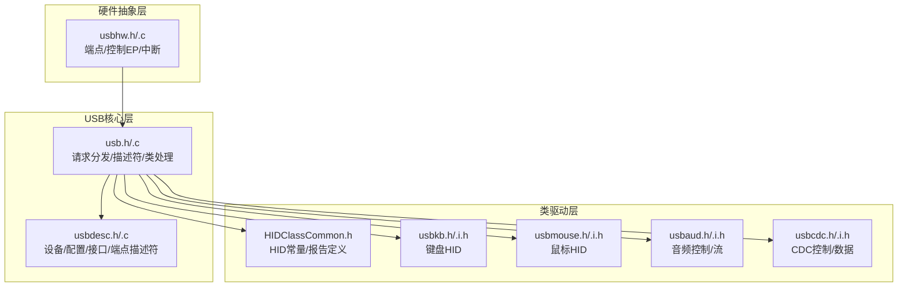
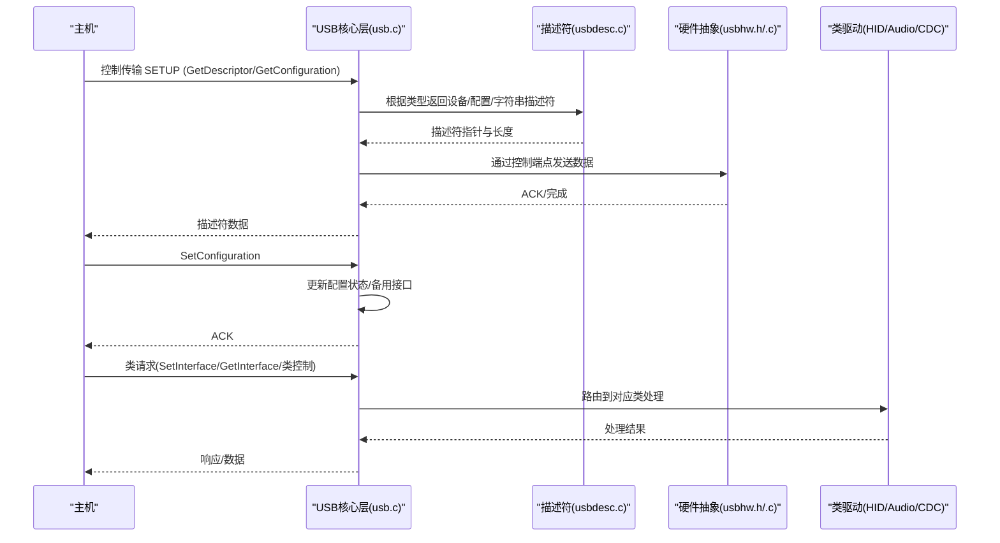
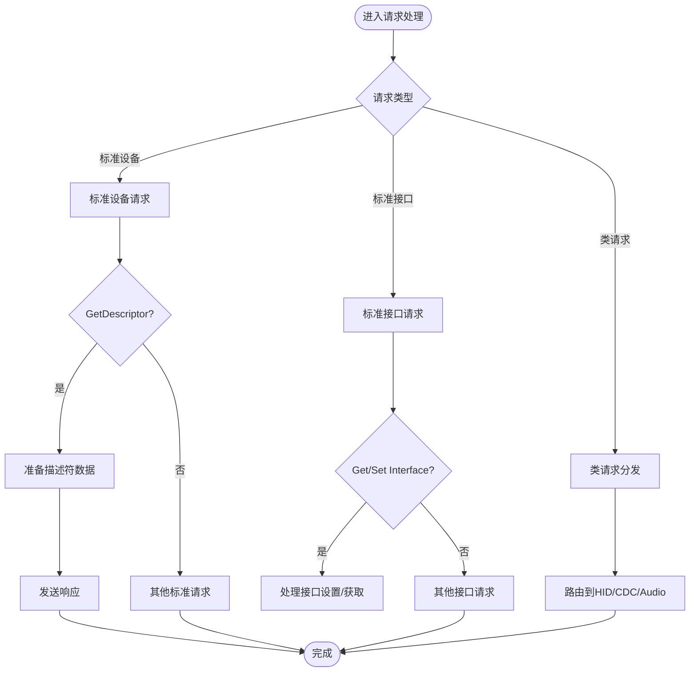
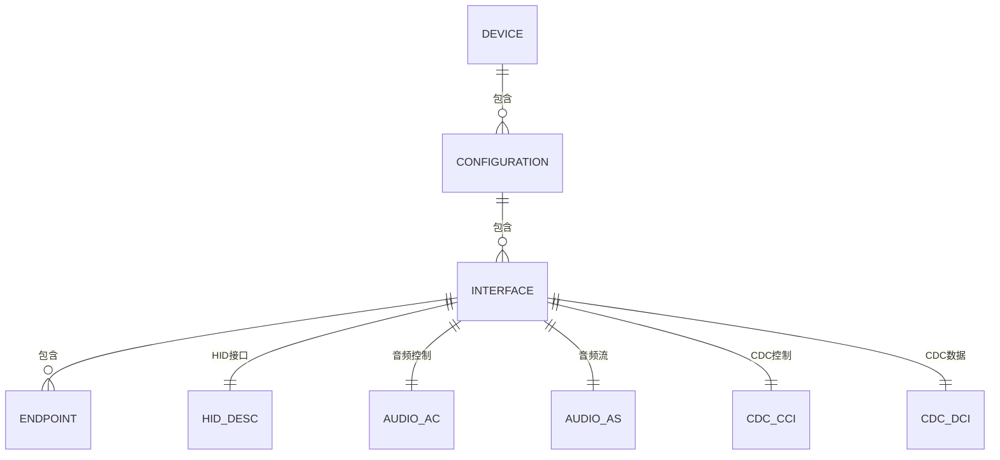
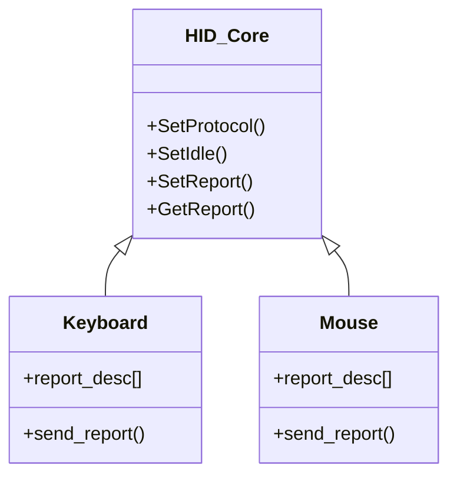
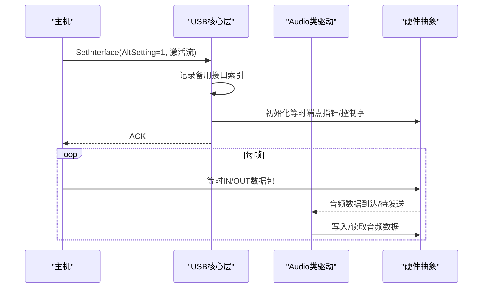
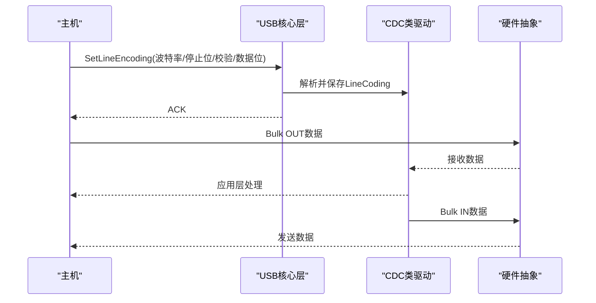
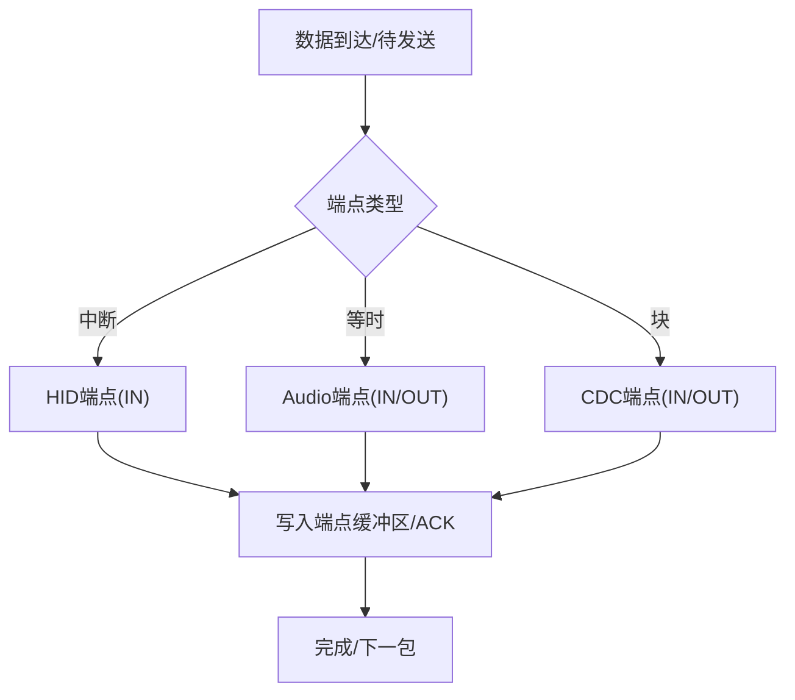
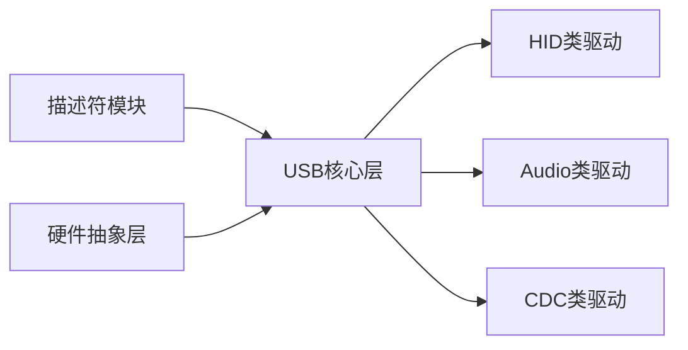

# USB协议栈设计

<cite>
**本文引用的文件**
- [usb.h](file://tc_ble_single_sdk/application/usbstd/usb.h)
- [usb.c](file://tc_ble_single_sdk/application/usbstd/usb.c)
- [usbdesc.h](file://tc_ble_single_sdk/application/usbstd/usbdesc.h)
- [usbdesc.c](file://tc_ble_single_sdk/application/usbstd/usbdesc.c)
- [HIDClassCommon.h](file://tc_ble_single_sdk/application/usbstd/HIDClassCommon.h)
- [CDCClassCommon.h](file://tc_ble_single_sdk/application/usbstd/CDCClassCommon.h)
- [usbaud.h](file://tc_ble_single_sdk/application/app/usbaud.h)
- [usbaud_i.h](file://tc_ble_single_sdk/application/app/usbaud_i.h)
- [usbkb.h](file://tc_ble_single_sdk/application/app/usbkb.h)
- [usbmouse.h](file://tc_ble_single_sdk/application/app/usbmouse.h)
- [usbcdc.h](file://tc_ble_single_sdk/application/app/usbcdc.h)
- [usbhw.h](file://tc_ble_single_sdk/drivers/B85/usbhw.h)
- [usbhw.c](file://tc_ble_single_sdk/drivers/B85/usbhw.c)
</cite>

## 目录
1. [简介](#简介)
2. [项目结构](#项目结构)
3. [核心组件](#核心组件)
4. [架构总览](#架构总览)
5. [详细组件分析](#详细组件分析)
6. [依赖关系分析](#依赖关系分析)
7. [性能考虑](#性能考虑)
8. [故障排查指南](#故障排查指南)
9. [结论](#结论)
10. [附录](#附录)

## 简介
本文件面向USB设备端协议栈，围绕Telink B85平台实现，覆盖USB核心层、类驱动层（HID、Audio、CDC）与设备描述符管理。重点说明：
- USB枚举过程、控制传输与数据端点管理
- HID键盘/鼠标、音频（Speaker/Mic）、CDC虚拟串口三类设备的配置与数据处理流程
- 多接口与复合设备支持机制
- 电源管理（挂起/恢复）、热插拔与可选的MS OS描述符支持
- 关键代码路径与调用时序，便于二次开发与问题定位

## 项目结构
该SDK将USB协议栈分为三层：
- 硬件抽象层（HAL）：寄存器级操作、端点读写、中断模式切换等
- USB核心层：标准请求分发、描述符响应、类请求路由、接口设置/获取、端点状态维护
- 应用/类驱动层：HID（键盘/鼠标/自定义）、Audio（Speaker/Mic）、CDC（虚拟串口）等具体实现

图表来源
- [usbhw.h:27-45](file://tc_ble_single_sdk/drivers/B85/usbhw.h#L27-L45)
- [usb.c:707-800](file://tc_ble_single_sdk/application/usbstd/usb.c#L707-L800)
- [usbdesc.c:234-761](file://tc_ble_single_sdk/application/usbstd/usbdesc.c#L234-L761)

章节来源
- [usb.h:61-80](file://tc_ble_single_sdk/application/usbstd/usb.h#L61-L80)
- [usb.c:707-800](file://tc_ble_single_sdk/application/usbstd/usb.c#L707-L800)
- [usbdesc.h:43-82](file://tc_ble_single_sdk/application/usbstd/usbdesc.h#L43-L82)
- [usbdesc.c:234-761](file://tc_ble_single_sdk/application/usbstd/usbdesc.c#L234-L761)

## 核心组件
- USB核心层（usb.c/usb.h）
  - 负责标准请求（GetDescriptor/GetConfiguration/SetConfiguration）与类请求（HID/CDC/Audio）的分发
  - 维护全局配置状态、备用接口索引、鼠标协议模式、空闲周期等
  - 提供回调注册以扩展SetReport处理（如OTA或自定义HID）
- 描述符管理（usbdesc.c/usbdesc.h）
  - 集中定义设备、配置、各接口及端点的描述符
  - 暴露查询函数供核心层在枚举时按需返回
- 硬件抽象层（usbhw.h/.c）
  - 封装端点编号、控制端点读写、批量写入、ACK/STALL、中断模式切换
- 类驱动层
  - HID：键盘/鼠标/自定义HID报告描述符与上报逻辑
  - Audio：控制单元（Feature Unit）与同步流端点（Speaker/Mic）
  - CDC：控制接口（ACM）与数据接口（Bulk），LineCoding等

章节来源
- [usb.c:707-800](file://tc_ble_single_sdk/application/usbstd/usb.c#L707-L800)
- [usbdesc.c:234-761](file://tc_ble_single_sdk/application/usbstd/usbdesc.c#L234-L761)
- [usbhw.h:27-45](file://tc_ble_single_sdk/drivers/B85/usbhw.h#L27-L45)
- [HIDClassCommon.h:374-444](file://tc_ble_single_sdk/application/usbstd/HIDClassCommon.h#L374-L444)
- [CDCClassCommon.h:55-175](file://tc_ble_single_sdk/application/usbstd/CDCClassCommon.h#L55-L175)

## 架构总览
下图展示从主机发起枚举到类数据传输的关键路径，以及各层职责边界。

图表来源
- [usb.c:147-206](file://tc_ble_single_sdk/application/usbstd/usb.c#L147-L206)
- [usb.c:707-800](file://tc_ble_single_sdk/application/usbstd/usb.c#L707-L800)
- [usbdesc.c:234-761](file://tc_ble_single_sdk/application/usbstd/usbdesc.c#L234-L761)
- [usbhw.c:54-61](file://tc_ble_single_sdk/drivers/B85/usbhw.c#L54-L61)

## 详细组件分析

### USB核心层与枚举流程
- 控制传输处理
  - GetDescriptor：按类型返回设备、配置、字符串或HID描述符；必要时裁剪长度
  - GetConfiguration/SetConfiguration：维护当前配置值，置位设备已配置标志
  - SetInterface/GetInterface：维护备用接口索引，激活相应端点（如音频流）
- 类请求分发
  - HID：SetReport/GetReport/SetIdle/SetProtocol
  - CDC：SetLineEncoding/GetLineEncoding/通知
  - Audio：Feature Unit控制（音量/静音）与采样频率查询
- 错误与异常
  - 未识别请求或参数非法时置STALL，终止事务

图表来源
- [usb.c:147-206](file://tc_ble_single_sdk/application/usbstd/usb.c#L147-L206)
- [usb.c:707-800](file://tc_ble_single_sdk/application/usbstd/usb.c#L707-L800)

章节来源
- [usb.c:147-206](file://tc_ble_single_sdk/application/usbstd/usb.c#L147-L206)
- [usb.c:707-800](file://tc_ble_single_sdk/application/usbstd/usb.c#L707-L800)

### 描述符管理（设备/配置/接口/端点）
- 设备描述符：指定USB版本、类/子类/协议、端点0包长、VID/PID、字符串索引等
- 配置描述符：包含多个接口及其端点，支持复合设备（HID+Audio+CDC等）
- 接口描述符：HID（键盘/鼠标/自定义）、Audio Control/Streaming、CDC CCI/DCI
- 端点描述符：中断（HID）、等时（Audio流）、块（CDC数据）
- MS OS描述符：可选开启，用于Windows特性描述与兼容ID

图表来源
- [usbdesc.c:234-761](file://tc_ble_single_sdk/application/usbstd/usbdesc.c#L234-L761)

章节来源
- [usbdesc.h:43-82](file://tc_ble_single_sdk/application/usbstd/usbdesc.h#L43-L82)
- [usbdesc.c:234-761](file://tc_ble_single_sdk/application/usbstd/usbdesc.c#L234-L761)

### HID类（键盘/鼠标/自定义）
- 报告描述符：键盘与鼠标使用标准HID报告；自定义HID用于媒体控制或私有功能
- 端点：中断IN端点，轮询间隔可配置
- 控制请求：SetProtocol（Boot/Non-Boot）、SetIdle、SetReport/GetReport
- 应用集成：键盘/鼠标上报数据结构与FIFO缓冲

图表来源
- [HIDClassCommon.h:374-444](file://tc_ble_single_sdk/application/usbstd/HIDClassCommon.h#L374-L444)
- [usbkb.h:38-62](file://tc_ble_single_sdk/application/app/usbkb.h#L38-L62)
- [usbmouse.h:40-50](file://tc_ble_single_sdk/application/app/usbmouse.h#L40-L50)
- [usb.c:483-497](file://tc_ble_single_sdk/application/usbstd/usb.c#L483-L497)

章节来源
- [usb.c:483-497](file://tc_ble_single_sdk/application/usbstd/usb.c#L483-L497)
- [usbkb.h:38-62](file://tc_ble_single_sdk/application/app/usbkb.h#L38-L62)
- [usbmouse.h:40-50](file://tc_ble_single_sdk/application/app/usbmouse.h#L40-L50)
- [usbdesc.c:668-712](file://tc_ble_single_sdk/application/usbstd/usbdesc.c#L668-L712)

### Audio类（Speaker/Mic）
- 控制接口（AC）：定义输入/输出终端与特征单元（音量/静音）
- 流接口（AS）：等时端点，支持自适应/同步，PCM格式，采样率可配置
- 控制请求：Feature Unit控制（音量/静音）与采样频率查询
- 备用接口：通过SetInterface激活流端点并初始化端点指针

图表来源
- [usb.c:665-703](file://tc_ble_single_sdk/application/usbstd/usb.c#L665-L703)
- [usbdesc.c:445-641](file://tc_ble_single_sdk/application/usbstd/usbdesc.c#L445-L641)
- [usb.c:630-651](file://tc_ble_single_sdk/application/usbstd/usb.c#L630-L651)

章节来源
- [usb.c:665-703](file://tc_ble_single_sdk/application/usbstd/usb.c#L665-L703)
- [usbdesc.c:445-641](file://tc_ble_single_sdk/application/usbstd/usbdesc.c#L445-L641)
- [usbaud.h:55-113](file://tc_ble_single_sdk/application/app/usbaud.h#L55-L113)
- [usbaud_i.h:97-114](file://tc_ble_single_sdk/application/app/usbaud_i.h#L97-L114)

### CDC类（虚拟串口）
- 控制接口（ACM）：支持LineCoding设置/获取、控制线状态通知
- 数据接口（Bulk）：IN/OUT端点用于透传数据
- 控制请求：SetLineEncoding、GetLineEncoding、Serial State通知

图表来源
- [usb.c:351-380](file://tc_ble_single_sdk/application/usbstd/usb.c#L351-L380)
- [usb.c:532-557](file://tc_ble_single_sdk/application/usbstd/usb.c#L532-L557)
- [usbdesc.c:304-410](file://tc_ble_single_sdk/application/usbstd/usbdesc.c#L304-L410)
- [usbcdc.h:38-73](file://tc_ble_single_sdk/application/app/usbcdc.h#L38-L73)

章节来源
- [usb.c:351-380](file://tc_ble_single_sdk/application/usbstd/usb.c#L351-L380)
- [usb.c:532-557](file://tc_ble_single_sdk/application/usbstd/usb.c#L532-L557)
- [usbdesc.c:304-410](file://tc_ble_single_sdk/application/usbstd/usbdesc.c#L304-L410)
- [usbcdc.h:38-73](file://tc_ble_single_sdk/application/app/usbcdc.h#L38-L73)

### 端点管理与数据传输
- 控制端点（EP0）：用于枚举与控制传输
- 数据端点：
  - 中断：HID键盘/鼠标/自定义HID
  - 等时：Audio流（Speaker/Mic）
  - 块：CDC数据
- 端点操作：重置指针、写数据、ACK/STALL、忙检测

图表来源
- [usbhw.h:27-45](file://tc_ble_single_sdk/drivers/B85/usbhw.h#L27-L45)
- [usbhw.c:54-61](file://tc_ble_single_sdk/drivers/B85/usbhw.c#L54-L61)

章节来源
- [usbhw.h:27-45](file://tc_ble_single_sdk/drivers/B85/usbhw.h#L27-L45)
- [usbhw.c:54-61](file://tc_ble_single_sdk/drivers/B85/usbhw.c#L54-L61)

### 多接口与复合设备支持
- 通过配置描述符组合多个接口（HID+Audio+CDC），每个接口独立端点
- 使用备用接口（Alternate Setting）动态启用/禁用流端点（Audio）
- 接口关联（IAD）可选，用于将多个相关接口绑定为一个功能

章节来源
- [usbdesc.c:268-761](file://tc_ble_single_sdk/application/usbstd/usbdesc.c#L268-L761)
- [usb.c:665-703](file://tc_ble_single_sdk/application/usbstd/usb.c#L665-L703)

### 电源管理、挂起/恢复与热插拔
- 挂起/恢复：设备支持远程唤醒与选择性挂起（MS OS描述符中声明）
- 热插拔：通过DP上拉使能/禁用设备，触发主机重新枚举
- 自定义HID命令可触发重枚举流程（软件复位USB设备）

章节来源
- [usbdesc.c:90-171](file://tc_ble_single_sdk/application/usbstd/usbdesc.c#L90-L171)
- [usb.c:437-442](file://tc_ble_single_sdk/application/usbstd/usb.c#L437-L442)

## 依赖关系分析
- 核心层依赖描述符模块提供枚举所需数据
- 核心层依赖硬件抽象层进行端点操作
- 类驱动通过核心层提供的回调/分发机制接入
- 各接口描述符与端点编号由硬件抽象层统一映射

图表来源
- [usb.c:707-800](file://tc_ble_single_sdk/application/usbstd/usb.c#L707-L800)
- [usbdesc.c:234-761](file://tc_ble_single_sdk/application/usbstd/usbdesc.c#L234-L761)
- [usbhw.h:27-45](file://tc_ble_single_sdk/drivers/B85/usbhw.h#L27-L45)

章节来源
- [usb.c:707-800](file://tc_ble_single_sdk/application/usbstd/usb.c#L707-L800)
- [usbdesc.c:234-761](file://tc_ble_single_sdk/application/usbstd/usbdesc.c#L234-L761)
- [usbhw.h:27-45](file://tc_ble_single_sdk/drivers/B85/usbhw.h#L27-L45)

## 性能考虑
- 端点缓冲与轮询间隔：HID中断端点大小与轮询间隔影响延迟与带宽占用
- 等时端点：Audio流需保证每帧及时收发，避免丢包
- 批量传输：CDC数据端点大小与主机调度影响吞吐
- 控制传输：描述符长度裁剪减少不必要的数据量
- 建议：合理配置端点大小与轮询间隔，避免过度占用总线带宽；对Audio流采用双缓冲或DMA（若可用）降低CPU负载

[本节为通用指导，不直接分析具体文件]

## 故障排查指南
- 枚举失败
  - 检查描述符长度与类型是否正确
  - 确认端点地址与类型匹配（中断/等时/块）
- 类请求无响应
  - 核对请求类型与接口索引是否匹配
  - 查看是否误置STALL或未处理分支
- 音频无声/杂音
  - 检查备用接口设置是否正确激活流端点
  - 确认采样率与格式一致
- CDC无法通信
  - 验证LineCoding设置是否被正确保存与应用
  - 检查Bulk端点是否忙碌或STALL

章节来源
- [usb.c:351-380](file://tc_ble_single_sdk/application/usbstd/usb.c#L351-L380)
- [usb.c:532-557](file://tc_ble_single_sdk/application/usbstd/usb.c#L532-L557)
- [usb.c:665-703](file://tc_ble_single_sdk/application/usbstd/usb.c#L665-L703)

## 结论
该USB协议栈以清晰的三层架构实现了HID、Audio与CDC三类常用设备的支持，具备复合设备与备用接口能力，并通过硬件抽象层屏蔽底层差异。核心层负责枚举与请求分发，描述符模块集中管理设备能力声明，类驱动专注业务逻辑。结合合理的端点配置与数据流管理，可在资源受限平台上稳定运行。

[本节为总结性内容，不直接分析具体文件]

## 附录
- 关键API与数据结构参考
  - 控制端点操作：reset/write/read/ack/stall/busy
  - 数据端点操作：write bulk/iso/interrupt
  - 类请求：HID Set/Get Report/Idle/Protocol；CDC LineEncoding；Audio Feature/Sampling
  - 描述符查询：device/configuration/string/HID descriptor

章节来源
- [usbhw.h:65-195](file://tc_ble_single_sdk/drivers/B85/usbhw.h#L65-L195)
- [usb.c:147-206](file://tc_ble_single_sdk/application/usbstd/usb.c#L147-L206)
- [usbdesc.c:763-800](file://tc_ble_single_sdk/application/usbstd/usbdesc.c#L763-L800)