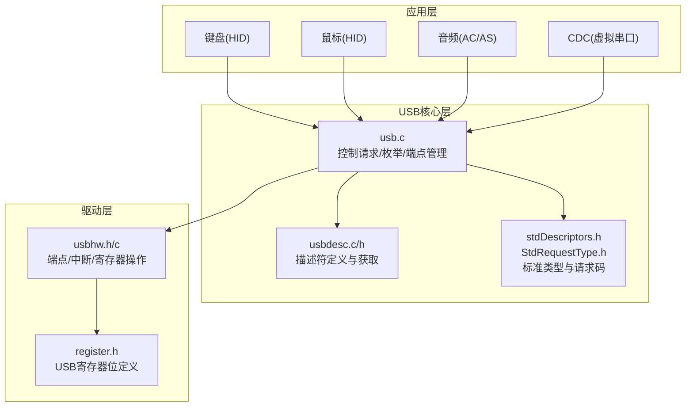
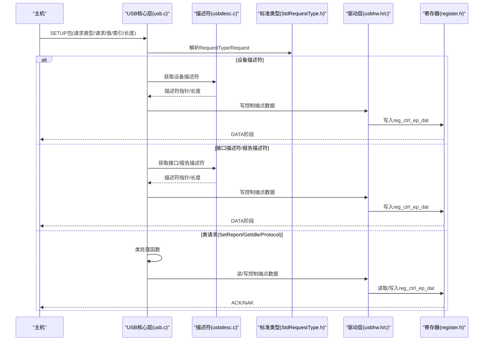
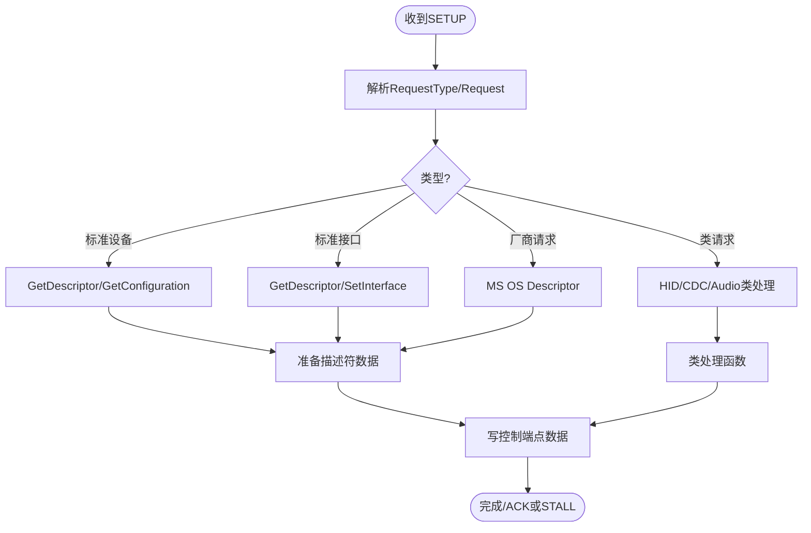
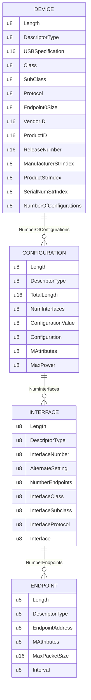
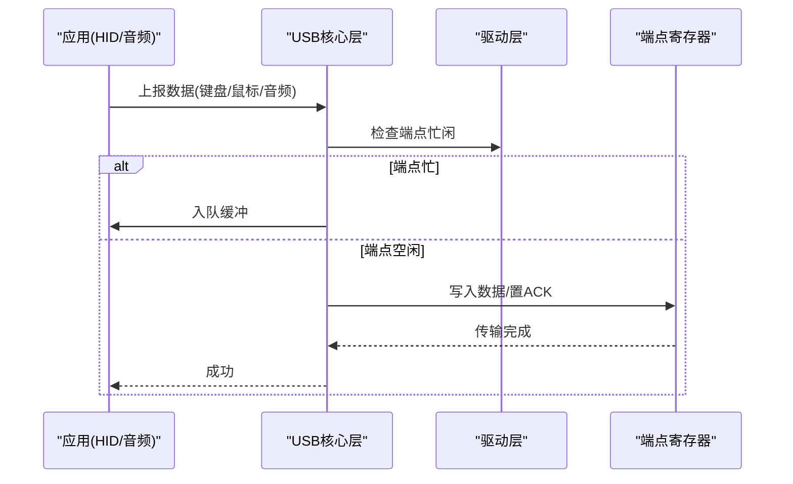
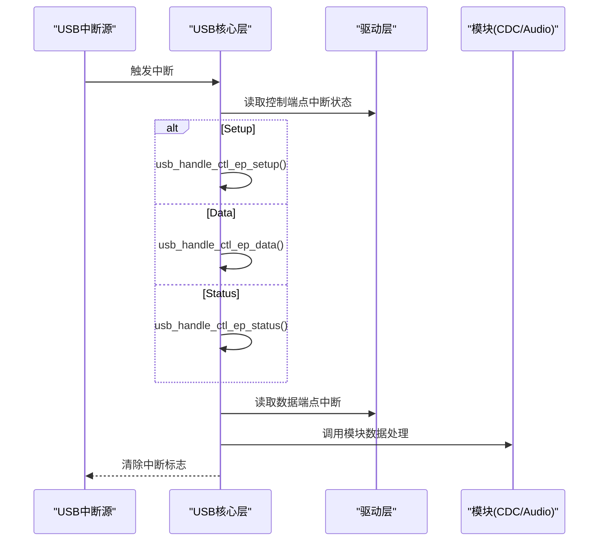
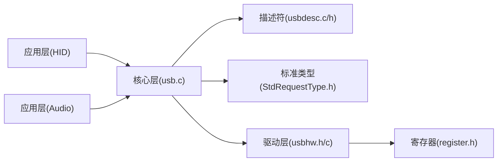

# USB核心层设计

<cite>
**本文引用的文件**
- [usb.h](file://tc_ble_single_sdk/application/usbstd/usb.h)
- [usb.c](file://tc_ble_single_sdk/application/usbstd/usb.c)
- [usbdesc.h](file://tc_ble_single_sdk/application/usbstd/usbdesc.h)
- [usbdesc.c](file://tc_ble_single_sdk/application/usbstd/usbdesc.c)
- [stdDescriptors.h](file://tc_ble_single_sdk/application/usbstd/stdDescriptors.h)
- [StdRequestType.h](file://tc_ble_single_sdk/application/usbstd/StdRequestType.h)
- [usbhw.h](file://tc_ble_single_sdk/drivers/B85/usbhw.h)
- [usbhw.c](file://tc_ble_single_sdk/drivers/B85/usbhw.c)
- [register.h](file://tc_ble_single_sdk/drivers/B85/register.h)
- [usbmouse.c](file://tc_ble_single_sdk/application/app/usbmouse.c)
- [usbkb.c](file://tc_ble_single_sdk/application/app/usbkb.c)
</cite>

## 目录
1. [简介](#简介)
2. [项目结构](#项目结构)
3. [核心组件](#核心组件)
4. [架构总览](#架构总览)
5. [详细组件分析](#详细组件分析)
6. [依赖关系分析](#依赖关系分析)
7. [性能考虑](#性能考虑)
8. [故障排查指南](#故障排查指南)
9. [结论](#结论)
10. [附录](#附录)

## 简介
本文件面向USB设备侧的核心层设计与实现，围绕枚举流程、描述符管理、端点配置与数据传输、中断处理、状态管理与错误处理、电源管理与热插拔支持进行系统化说明。代码基于Telink B85平台，采用分层设计：应用层（HID/CDC/Audio等）通过标准接口向上提供功能；USB核心层负责控制请求分发、描述符响应、端点数据收发与中断调度；驱动层直接操作寄存器完成底层传输。

## 项目结构
- 应用层
  - HID类：键盘、鼠标、Somatic传感器、OTA等，位于 application/app 下，封装上报逻辑与缓冲队列。
  - 音频类：麦克风/扬声器流式端点与AC/AS描述符，位于 application/app/usbaud_i.h 等。
  - CDC类：虚拟串口控制与数据端点，位于 application/app/usbcdc.*。
- USB核心层
  - 控制请求与枚举：usb.c 统一处理标准/类/厂商请求，维护配置状态、接口切换、描述符返回。
  - 描述符定义与获取：usbdesc.c/h 集中定义设备/配置/接口/端点/HID报告等描述符，并提供查询接口。
  - 标准类型与请求码：stdDescriptors.h、StdRequestType.h 定义描述符类型、请求码与特征位。
- 驱动层
  - 端点与中断：usbhw.h/c 暴露端点读写、忙闲检测、ACK/STALL、手动中断开关等。
  - 寄存器映射：register.h 提供USB相关寄存器位定义，供驱动层使用。

图表来源
- [usb.c:707-800](file://tc_ble_single_sdk/application/usbstd/usb.c#L707-L800)
- [usbdesc.c:234-761](file://tc_ble_single_sdk/application/usbstd/usbdesc.c#L234-L761)
- [stdDescriptors.h:52-243](file://tc_ble_single_sdk/application/usbstd/stdDescriptors.h#L52-L243)
- [StdRequestType.h:49-71](file://tc_ble_single_sdk/application/usbstd/StdRequestType.h#L49-L71)
- [usbhw.h:27-45](file://tc_ble_single_sdk/drivers/B85/usbhw.h#L27-L45)
- [register.h:175-184](file://tc_ble_single_sdk/drivers/B85/register.h#L175-L184)

章节来源
- [usb.h:24-86](file://tc_ble_single_sdk/application/usbstd/usb.h#L24-L86)
- [usb.c:24-76](file://tc_ble_single_sdk/application/usbstd/usb.c#L24-L76)
- [usbdesc.h:42-82](file://tc_ble_single_sdk/application/usbstd/usbdesc.h#L42-L82)
- [usbhw.h:60-195](file://tc_ble_single_sdk/drivers/B85/usbhw.h#L60-L195)

## 核心组件
- 控制请求处理器
  - 入口：usb_handle_request(data_request)，根据RequestType分派到标准/类/厂商处理分支。
  - 描述符准备：usb_prepare_desc_data() 根据描述符类型返回对应描述符指针与长度。
  - 接口请求：usb_handle_std_intf_req() 处理HID描述符/报告描述符等。
  - 类请求：usb_handle_out_class_intf_req()/usb_handle_in_class_intf_req() 处理HID SetReport/GetIdle/Protocol等。
  - 接口切换：usb_handle_set_intf()/usb_handle_get_intf() 处理SetInterface/GetInterface，更新备用设置并启用端点。
- 描述符系统
  - 设备/配置/接口/端点/HID报告/字符串/OS特性描述符集中定义于 usbdesc.c/h。
  - 标准类型与请求码在 stdDescriptors.h、StdRequestType.h 中统一定义。
- 端点与数据传输
  - 驱动层提供端点读写、忙闲检测、ACK/STALL、手动中断开关等能力。
  - HID类（键盘/鼠标）通过端点发送报告，维护DATA0/DATA1交替与缓冲队列。
- 中断处理
  - usb_handle_irq() 处理控制端点Setup/Data/Status、USB复位、数据端点中断，并调用各模块的IRQ处理。
- 状态与错误
  - g_stall 标志用于STALL错误路径；g_feature用于特殊测试场景；配置值usb_g_config_value跟踪当前配置。
- 电源与热插拔
  - 通过MS OS Feature Descriptor声明Selective Suspend与Remote Wakeup能力；复位时重置端点与toggle状态。

章节来源
- [usb.c:147-206](file://tc_ble_single_sdk/application/usbstd/usb.c#L147-L206)
- [usb.c:212-345](file://tc_ble_single_sdk/application/usbstd/usb.c#L212-L345)
- [usb.c:351-528](file://tc_ble_single_sdk/application/usbstd/usb.c#L351-L528)
- [usb.c:532-651](file://tc_ble_single_sdk/application/usbstd/usb.c#L532-L651)
- [usb.c:665-704](file://tc_ble_single_sdk/application/usbstd/usb.c#L665-L704)
- [usb.c:707-800](file://tc_ble_single_sdk/application/usbstd/usb.c#L707-L800)
- [usbdesc.c:234-761](file://tc_ble_single_sdk/application/usbstd/usbdesc.c#L234-L761)
- [usbhw.h:124-195](file://tc_ble_single_sdk/drivers/B85/usbhw.h#L124-L195)
- [usb.c:880-930](file://tc_ble_single_sdk/application/usbstd/usb.c#L880-L930)

## 架构总览
USB核心层采用“请求分发 + 描述符服务 + 端点驱动”的分层模式：
- 上层应用通过回调或函数将数据放入端点缓冲区或直接写入寄存器。
- 核心层解析控制请求，选择对应描述符或类处理函数。
- 驱动层屏蔽寄存器细节，提供统一的端点操作API。

图表来源
- [usb.c:707-800](file://tc_ble_single_sdk/application/usbstd/usb.c#L707-L800)
- [usb.c:147-206](file://tc_ble_single_sdk/application/usbstd/usb.c#L147-L206)
- [usb.c:351-528](file://tc_ble_single_sdk/application/usbstd/usb.c#L351-L528)
- [usbhw.h:60-112](file://tc_ble_single_sdk/drivers/B85/usbhw.h#L60-L112)
- [register.h:175-184](file://tc_ble_single_sdk/drivers/B85/register.h#L175-L184)

## 详细组件分析

### 控制请求与枚举流程
- 控制请求入口
  - usb_handle_request(data_request) 依据RequestType分派：
    - 标准设备请求：GetDescriptor、GetConfiguration等。
    - 标准接口请求：GetDescriptor、SetInterface、GetInterface。
    - 类请求：HID SetReport/GetIdle/Protocol、CDC LineCoding等。
    - 厂商请求：MS OS Descriptor兼容ID与扩展属性。
- 描述符准备
  - usb_prepare_desc_data() 根据描述符类型返回设备/配置/字符串等描述符。
  - 对长度进行裁剪，确保不超过主机请求长度。
- 接口描述符与报告描述符
  - usb_handle_std_intf_req() 按接口号返回HID描述符或报告描述符。
- 类请求处理
  - out/in方向分别由 usb_handle_out_class_intf_req()/usb_handle_in_class_intf_req() 处理。
  - 支持HID SetIdle/SetProtocol、CDC SetLineEncoding等。
- 接口切换
  - usb_handle_set_intf() 更新备用设置，并根据音频接口启用相应端点。
- 错误处理
  - 未处理的请求设置 g_stall = 1，进入STALL路径。

图表来源
- [usb.c:707-800](file://tc_ble_single_sdk/application/usbstd/usb.c#L707-L800)
- [usb.c:147-206](file://tc_ble_single_sdk/application/usbstd/usb.c#L147-L206)
- [usb.c:212-345](file://tc_ble_single_sdk/application/usbstd/usb.c#L212-L345)
- [usb.c:351-528](file://tc_ble_single_sdk/application/usbstd/usb.c#L351-L528)

章节来源
- [usb.c:707-800](file://tc_ble_single_sdk/application/usbstd/usb.c#L707-L800)
- [usb.c:147-206](file://tc_ble_single_sdk/application/usbstd/usb.c#L147-L206)
- [usb.c:212-345](file://tc_ble_single_sdk/application/usbstd/usb.c#L212-L345)
- [usb.c:351-528](file://tc_ble_single_sdk/application/usbstd/usb.c#L351-L528)
- [usb.c:665-704](file://tc_ble_single_sdk/application/usbstd/usb.c#L665-L704)

### 描述符结构与组织
- 标准描述符类型
  - 设备、配置、接口、端点、字符串、设备限定符等，定义于 stdDescriptors.h。
- 设备描述符
  - device_desc 包含USB版本、类/子类/协议、端点0大小、VID/PID、字符串索引、配置数量。
- 配置描述符
  - configuration_desc 包含总长度、接口数、配置值、属性、最大功耗，以及各接口的子描述符链。
- 接口与端点
  - 每个接口包含接口描述符、HID描述符（如适用）、端点描述符。
  - 音频接口包含AC/AS描述符、输入/输出终端、特性单元、采样率等。
- 字符串与OS特性
  - 语言、厂商、产品、序列号字符串；可选的MS OS Descriptor兼容ID与扩展属性。

图表来源
- [stdDescriptors.h:80-243](file://tc_ble_single_sdk/application/usbstd/stdDescriptors.h#L80-L243)
- [usbdesc.c:234-761](file://tc_ble_single_sdk/application/usbstd/usbdesc.c#L234-L761)

章节来源
- [stdDescriptors.h:52-243](file://tc_ble_single_sdk/application/usbstd/stdDescriptors.h#L52-L243)
- [usbdesc.c:234-761](file://tc_ble_single_sdk/application/usbstd/usbdesc.c#L234-L761)

### 端点配置与数据传输机制
- 端点分配
  - 驱动层定义端点编号与用途：鼠标、键盘、音频、CDC、SPP等。
- 数据传输
  - 控制端点：通过usbhw_write_ctrl_ep_data/read_ctrl_ep_data读写。
  - 数据端点：通过usbhw_write_ep批量写入，或使用寄存器逐字节写入并置ACK。
  - 数据令牌：维护edp_toggle数组实现DATA0/DATA1交替。
- HID上报
  - 键盘/鼠标通过各自模块将数据放入缓冲队列，空闲时写入端点寄存器并置ACK。
  - 支持软件CRC校验（键盘），提升可靠性。
- 音频流
  - 音频接口通过备用设置激活流式端点，端点类型为同步/自适应，支持采样率控制。

图表来源
- [usbhw.h:124-195](file://tc_ble_single_sdk/drivers/B85/usbhw.h#L124-L195)
- [usbhw.c:54-61](file://tc_ble_single_sdk/drivers/B85/usbhw.c#L54-L61)
- [usbmouse.c:107-151](file://tc_ble_single_sdk/application/app/usbmouse.c#L107-L151)
- [usbkb.c:150-213](file://tc_ble_single_sdk/application/app/usbkb.c#L150-L213)

章节来源
- [usbhw.h:27-45](file://tc_ble_single_sdk/drivers/B85/usbhw.h#L27-L45)
- [usbhw.h:124-195](file://tc_ble_single_sdk/drivers/B85/usbhw.h#L124-L195)
- [usbhw.c:54-61](file://tc_ble_single_sdk/drivers/B85/usbhw.c#L54-L61)
- [usbmouse.c:107-151](file://tc_ble_single_sdk/application/app/usbmouse.c#L107-L151)
- [usbkb.c:150-213](file://tc_ble_single_sdk/application/app/usbkb.c#L150-L213)

### 中断处理机制
- 控制端点中断
  - Setup/Data/Status三类中断分别处理，调用usb_handle_ctl_ep_setup/data/status。
- USB复位
  - 复位时重置所有端点控制寄存器与toggle状态，恢复默认协议。
- 数据端点中断
  - 根据使能情况调用CDC/Audio的数据处理函数。
- 挂起与唤醒
  - 通过MS OS Feature Descriptor声明Selective Suspend与Remote Wakeup能力；复位后重新初始化。

图表来源
- [usb.c:891-930](file://tc_ble_single_sdk/application/usbstd/usb.c#L891-L930)
- [usbhw.h:135-150](file://tc_ble_single_sdk/drivers/B85/usbhw.h#L135-L150)

章节来源
- [usb.c:891-930](file://tc_ble_single_sdk/application/usbstd/usb.c#L891-L930)
- [usbhw.h:135-150](file://tc_ble_single_sdk/drivers/B85/usbhw.h#L135-L150)

### 状态管理与错误处理策略
- 状态变量
  - usb_g_config_value：当前配置值。
  - g_stall：标记STALL错误路径。
  - g_feature：用于特定测试场景（Chapter 8）。
  - edp_toggle[]：端点DATA0/DATA1交替状态。
- 错误处理
  - 未识别的请求或非法参数设置STALL。
  - 复位时清理端点状态，避免残留ACK导致后续通信异常。
- 兼容性
  - 支持MS OS Descriptor，便于Windows正确识别设备功能。

章节来源
- [usb.c:52-66](file://tc_ble_single_sdk/application/usbstd/usb.c#L52-L66)
- [usb.c:707-800](file://tc_ble_single_sdk/application/usbstd/usb.c#L707-L800)
- [usb.c:891-930](file://tc_ble_single_sdk/application/usbstd/usb.c#L891-L930)
- [usbdesc.c:83-222](file://tc_ble_single_sdk/application/usbstd/usbdesc.c#L83-L222)

### 电源管理、挂起恢复与热插拔支持
- 电源管理
  - 配置属性包含Remote Wakeup与Reserved位；最大功耗设置为250mA。
- 挂起与恢复
  - 通过MS OS Feature Descriptor声明Selective Suspend与Default Idle Timeout；支持用户启用Selective Suspend与System Wake Enabled。
- 热插拔
  - USB复位时重置端点与toggle状态，确保重新枚举正常。
  - 驱动层提供dp_through_swire_en用于调试通路。

章节来源
- [usbdesc.c:268-278](file://tc_ble_single_sdk/application/usbstd/usbdesc.c#L268-L278)
- [usbdesc.c:83-222](file://tc_ble_single_sdk/application/usbstd/usbdesc.c#L83-L222)
- [usb.c:906-920](file://tc_ble_single_sdk/application/usbstd/usb.c#L906-L920)
- [usbhw.c:89-100](file://tc_ble_single_sdk/drivers/B85/usbhw.c#L89-L100)

### 具体代码示例：设备初始化与配置流程
- 初始化步骤
  - 调用usb_init()启动USB核心。
  - 注册HID SetReport回调（可选）。
  - 配置描述符与端点（由描述符系统自动响应）。
- 配置流程
  - 主机请求设备/配置/接口/端点描述符，核心层返回对应描述符。
  - 主机设置配置后，核心层更新usb_g_config_value并启用相应接口。
  - 对于音频接口，SetInterface激活备用设置并启用流式端点。

章节来源
- [usb.h:61-81](file://tc_ble_single_sdk/application/usbstd/usb.h#L61-L81)
- [usb.c:707-800](file://tc_ble_single_sdk/application/usbstd/usb.c#L707-L800)
- [usb.c:665-704](file://tc_ble_single_sdk/application/usbstd/usb.c#L665-L704)

## 依赖关系分析
- 核心层依赖
  - 描述符系统：usbdesc.c/h 提供描述符查询接口。
  - 标准类型：stdDescriptors.h、StdRequestType.h 提供类型与请求码。
  - 驱动层：usbhw.h/c 提供端点与中断操作。
- 应用层依赖
  - HID模块：usbmouse.c、usbkb.c 通过核心层接口上报数据。
  - 音频模块：usbaud_i.h 等提供音频类处理。
- 外部依赖
  - 寄存器：register.h 提供USB相关寄存器位定义。

图表来源
- [usb.c:24-76](file://tc_ble_single_sdk/application/usbstd/usb.c#L24-L76)
- [usbdesc.c:24-47](file://tc_ble_single_sdk/application/usbstd/usbdesc.c#L24-L47)
- [usbhw.h:24-27](file://tc_ble_single_sdk/drivers/B85/usbhw.h#L24-L27)
- [register.h:175-184](file://tc_ble_single_sdk/drivers/B85/register.h#L175-L184)

章节来源
- [usb.c:24-76](file://tc_ble_single_sdk/application/usbstd/usb.c#L24-L76)
- [usbdesc.c:24-47](file://tc_ble_single_sdk/application/usbstd/usbdesc.c#L24-L47)
- [usbhw.h:24-27](file://tc_ble_single_sdk/drivers/B85/usbhw.h#L24-L27)
- [register.h:175-184](file://tc_ble_single_sdk/drivers/B85/register.h#L175-L184)

## 性能考虑
- 端点忙闲检测
  - 通过usbhw_is_ep_busy()判断端点是否忙碌，避免覆盖未发送数据。
- 缓冲队列
  - 键盘/鼠标使用环形缓冲队列，减少CPU占用并提高吞吐。
- 数据令牌交替
  - 维护edp_toggle[]确保DATA0/DATA1交替，符合USB协议要求。
- 软件CRC
  - 键盘支持软件CRC校验，提升数据完整性（可配置）。
- 音频流
  - 同步/自适应端点类型与采样率控制，满足实时性需求。

[本节为通用指导，不直接分析具体文件]

## 故障排查指南
- 常见问题
  - 枚举失败：检查描述符是否正确返回，确认RequestType与Request匹配。
  - 端点无响应：检查端点忙闲状态与ACK设置，确认toggle状态正确。
  - 复位后异常：确认复位时清理了端点控制寄存器与toggle状态。
- 调试建议
  - 使用MS OS Descriptor兼容性信息辅助Windows识别。
  - 通过驱动层手动中断开关与寄存器访问定位问题。

章节来源
- [usb.c:707-800](file://tc_ble_single_sdk/application/usbstd/usb.c#L707-L800)
- [usb.c:891-930](file://tc_ble_single_sdk/application/usbstd/usb.c#L891-L930)
- [usbhw.h:124-195](file://tc_ble_single_sdk/drivers/B85/usbhw.h#L124-L195)

## 结论
该USB核心层设计以清晰的分层与模块化实现，覆盖了设备初始化、枚举流程、描述符管理、端点配置与数据传输、中断处理、状态与错误管理、电源管理与热插拔支持。通过标准类型与请求码的统一抽象、描述符系统的集中管理、驱动层的寄存器屏蔽，实现了高内聚低耦合的架构，便于扩展与维护。

[本节为总结，不直接分析具体文件]

## 附录
- 关键函数路径参考
  - 控制请求处理：[usb.c:707-800](file://tc_ble_single_sdk/application/usbstd/usb.c#L707-L800)
  - 描述符准备：[usb.c:147-206](file://tc_ble_single_sdk/application/usbstd/usb.c#L147-L206)
  - 接口描述符处理：[usb.c:212-345](file://tc_ble_single_sdk/application/usbstd/usb.c#L212-L345)
  - 类请求处理：[usb.c:351-528](file://tc_ble_single_sdk/application/usbstd/usb.c#L351-L528)
  - 端点操作：[usbhw.h:124-195](file://tc_ble_single_sdk/drivers/B85/usbhw.h#L124-L195)
  - 中断处理：[usb.c:891-930](file://tc_ble_single_sdk/application/usbstd/usb.c#L891-L930)
  - 描述符定义：[usbdesc.c:234-761](file://tc_ble_single_sdk/application/usbstd/usbdesc.c#L234-L761)
  - 标准类型：[stdDescriptors.h:52-243](file://tc_ble_single_sdk/application/usbstd/stdDescriptors.h#L52-L243)
  - 请求码：[StdRequestType.h:49-71](file://tc_ble_single_sdk/application/usbstd/StdRequestType.h#L49-L71)

[本节为附录，不直接分析具体文件]