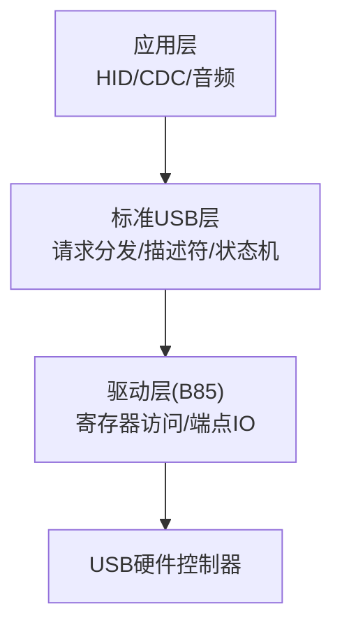
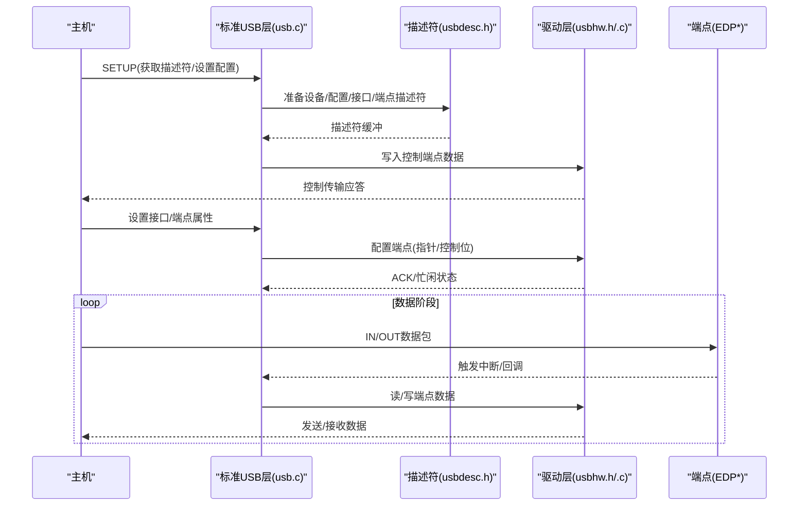
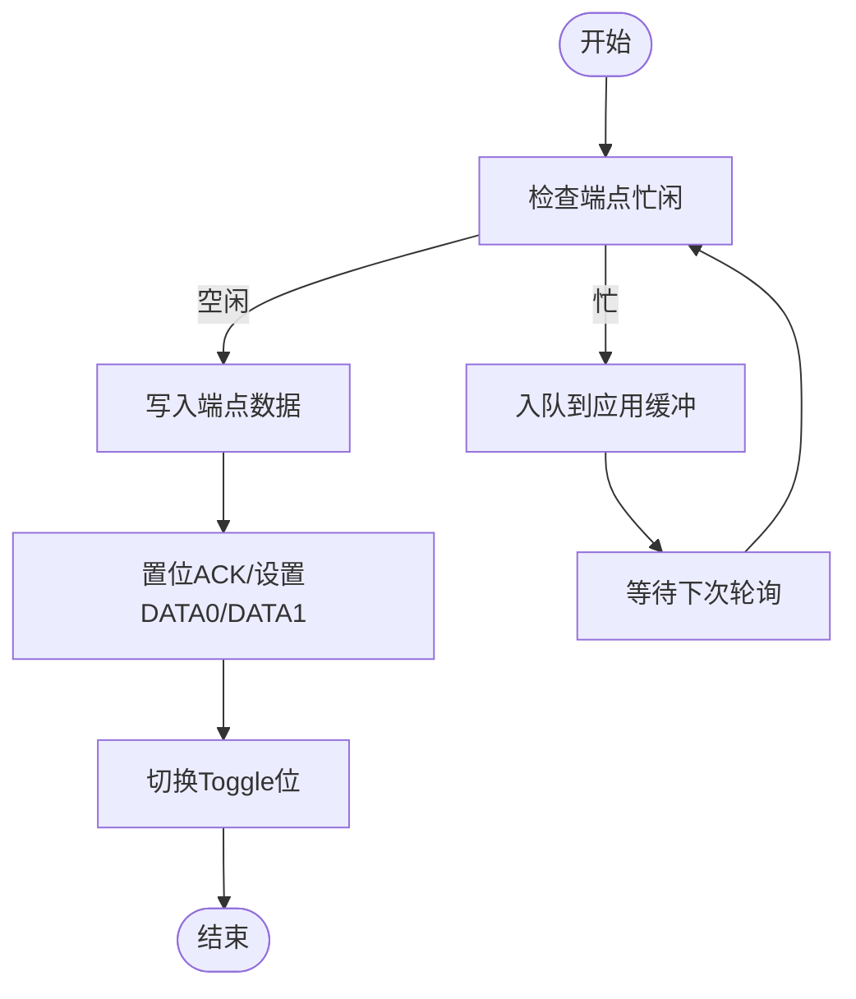
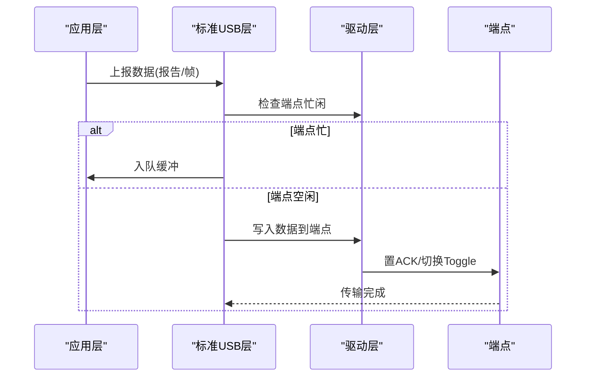
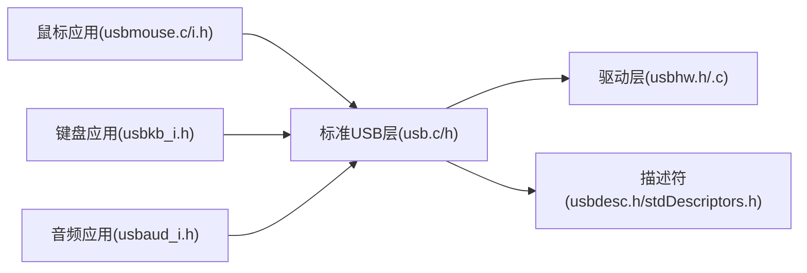

# USB端点管理

<cite>
**本文引用的文件**
- [usb.h](file://tc_ble_single_sdk/application/usbstd/usb.h)
- [usb.c](file://tc_ble_single_sdk/application/usbstd/usb.c)
- [usbhw.h](file://tc_ble_single_sdk/drivers/B85/usbhw.h)
- [usbhw.c](file://tc_ble_single_sdk/drivers/B85/usbhw.c)
- [usbdesc.h](file://tc_ble_single_sdk/application/usbstd/usbdesc.h)
- [stdDescriptors.h](file://tc_ble_single_sdk/application/usbstd/stdDescriptors.h)
- [usbmouse_i.h](file://tc_ble_single_sdk/application/app/usbmouse_i.h)
- [usbkb_i.h](file://tc_ble_single_sdk/application/app/usbkb_i.h)
- [usbaud_i.h](file://tc_ble_single_sdk/application/app/usbaud_i.h)
- [usbmouse.c](file://tc_ble_single_sdk/application/app/usbmouse.c)
</cite>

## 目录
1. [简介](#简介)
2. [项目结构](#项目结构)
3. [核心组件](#核心组件)
4. [架构总览](#架构总览)
5. [详细组件分析](#详细组件分析)
6. [依赖关系分析](#依赖关系分析)
7. [性能与内存优化](#性能与内存优化)
8. [故障排查指南](#故障排查指南)
9. [结论](#结论)
10. [附录：端点配置与使用示例路径](#附录端点配置与使用示例路径)

## 简介
本文件围绕USB端点管理展开，系统阐述控制端点、批量端点、中断端点和等时端点的概念与作用，并结合代码库中的实现说明端点缓冲区分配、数据传输队列管理、状态监控、错误处理与流量控制。文档同时提供不同端点的配置与使用示例路径，以及性能优化与调试技巧，帮助读者在Telink B85平台上高效开发USB设备功能。

## 项目结构
该SDK将USB协议栈与应用层按层次划分：
- 应用层（application）：定义各类类（HID、CDC、音频）的接口与描述符，封装具体业务逻辑。
- 标准USB层（application/usbstd）：实现USB请求分发、描述符响应、端点状态机与通用流程。
- 驱动层（drivers/B85）：直接操作寄存器，提供端点读写、ACK/STALL、忙闲检测等底层能力。

**图表来源**
- [usb.c:707-800](file://tc_ble_single_sdk/application/usbstd/usb.c#L707-L800)
- [usbhw.h:124-197](file://tc_ble_single_sdk/drivers/B85/usbhw.h#L124-L197)

**章节来源**
- [usb.h:24-86](file://tc_ble_single_sdk/application/usbstd/usb.h#L24-L86)
- [usb.c:24-80](file://tc_ble_single_sdk/application/usbstd/usb.c#L24-L80)
- [usbhw.h:24-45](file://tc_ble_single_sdk/drivers/B85/usbhw.h#L24-L45)

## 核心组件
- 标准USB请求处理：集中处理设备/接口/端点的标准、类和厂商请求，并调用各模块生成描述符或执行动作。
- 端点抽象与I/O：提供端点指针复位、数据读写、忙闲检测、ACK/STALL、中断模式切换等API。
- 描述符体系：设备、配置、接口、端点、字符串及各类类描述符，用于枚举阶段向主机声明能力。
- 应用端点实例：鼠标、键盘、音频等HID/音频类的端点使用示例，展示中断/等时传输的实际用法。

**章节来源**
- [usb.c:707-800](file://tc_ble_single_sdk/application/usbstd/usb.c#L707-L800)
- [usbhw.h:60-197](file://tc_ble_single_sdk/drivers/B85/usbhw.h#L60-L197)
- [usbdesc.h:42-82](file://tc_ble_single_sdk/application/usbstd/usbdesc.h#L42-L82)
- [stdDescriptors.h:44-50](file://tc_ble_single_sdk/application/usbstd/stdDescriptors.h#L44-L50)

## 架构总览
USB设备启动后，主机通过控制端点（EP0）进行枚举，设备返回描述符；随后根据配置激活相应接口和端点，进入数据阶段。应用层通过标准USB层提供的API完成数据收发，底层驱动直接操作寄存器完成实际传输。

**图表来源**
- [usb.c:147-206](file://tc_ble_single_sdk/application/usbstd/usb.c#L147-L206)
- [usb.c:707-800](file://tc_ble_single_sdk/application/usbstd/usb.c#L707-L800)
- [usbhw.c:54-61](file://tc_ble_single_sdk/drivers/B85/usbhw.c#L54-L61)

## 详细组件分析

### 端点类型与特性
- 控制端点（EP0）：用于枚举和控制命令，所有设备必须支持。
- 批量端点：用于大容量可靠传输，如存储设备。
- 中断端点：用于小数据量、低延迟、周期性传输，如鼠标、键盘。
- 等时端点：用于实时流媒体（音频/视频），不保证可靠性但保证时序。

在本SDK中，端点常量定义于驱动层头文件，包含鼠标、键盘、音频、CDC等映射。例如：
- 鼠标中断IN端点：USB_EDP_MOUSE
- 键盘中断IN端点：USB_EDP_KEYBOARD_IN
- 音频IN/OUT端点：USB_EDP_AUDIO_IN / USB_EDP_SPEAKER / USB_EDP_MIC
- CDC数据端点：USB_EDP_CDC_IN / USB_EDP_CDC_OUT

这些端点在描述符中声明，并在设置接口时由标准USB层启用。

**章节来源**
- [usbhw.h:27-45](file://tc_ble_single_sdk/drivers/B85/usbhw.h#L27-L45)
- [usbdesc.h:231-260](file://tc_ble_single_sdk/application/usbstd/usbdesc.h#L231-L260)
- [usbdesc.h:302-340](file://tc_ble_single_sdk/application/usbstd/usbdesc.h#L302-L340)

### 端点配置与管理机制
- 端点缓冲区分配：通过端点指针寄存器初始化，每次传输前复位指针，确保从缓冲区起始位置写入/读取。
- 数据传输队列：应用层维护环形缓冲（如鼠标帧缓冲），避免阻塞；当端点忙时入队，空闲时出队发送。
- 端点状态监控：通过忙闲标志位判断端点是否可写；ACK/STALL用于确认或错误处理。
- 交替设置（Alternate Setting）：音频接口支持多替代设置，切换时重新配置端点指针与控制位。

**图表来源**
- [usbmouse.c:107-151](file://tc_ble_single_sdk/application/app/usbmouse.c#L107-L151)
- [usbhw.h:170-197](file://tc_ble_single_sdk/drivers/B85/usbhw.h#L170-L197)

**章节来源**
- [usb.c:665-704](file://tc_ble_single_sdk/application/usbstd/usb.c#L665-L704)
- [usbhw.h:124-197](file://tc_ble_single_sdk/drivers/B85/usbhw.h#L124-L197)
- [usbmouse.c:44-98](file://tc_ble_single_sdk/application/app/usbmouse.c#L44-L98)

### 端点数据传输实现原理
- 数据包处理：应用层组装报告或数据块，调用驱动层写入端点数据寄存器，最后置ACK完成一次传输。
- 错误重试：通过STALL机制通知主机异常；应用层可在上层实现重发策略。
- 流量控制：忙闲检测与缓冲队列结合，防止溢出；音频等时传输需严格定时。

**图表来源**
- [usbmouse.c:107-151](file://tc_ble_single_sdk/application/app/usbmouse.c#L107-L151)
- [usbhw.c:54-61](file://tc_ble_single_sdk/drivers/B85/usbhw.c#L54-L61)

**章节来源**
- [usb.c:123-143](file://tc_ble_single_sdk/application/usbstd/usb.c#L123-L143)
- [usbhw.h:152-197](file://tc_ble_single_sdk/drivers/B85/usbhw.h#L152-L197)

### 不同端点的配置与使用示例路径
- 控制端点：描述符响应与请求处理位于标准USB层，参考路径：
  - [usb.c:147-206](file://tc_ble_single_sdk/application/usbstd/usb.c#L147-L206)
  - [usb.c:707-800](file://tc_ble_single_sdk/application/usbstd/usb.c#L707-L800)
- 中断端点（鼠标）：
  - 描述符定义：[usbmouse_i.h:248-449](file://tc_ble_single_sdk/application/app/usbmouse_i.h#L248-L449)
  - 发送实现：[usbmouse.c:107-151](file://tc_ble_single_sdk/application/app/usbmouse.c#L107-L151)
- 中断端点（键盘）：
  - 描述符定义：[usbkb_i.h:35-45](file://tc_ble_single_sdk/application/app/usbkb_i.h#L35-L45)
- 等时端点（音频MIC/SPEAKER）：
  - 描述符定义：[usbdesc.h:302-340](file://tc_ble_single_sdk/application/usbstd/usbdesc.h#L302-L340)
  - 接口切换与端点配置：[usb.c:665-704](file://tc_ble_single_sdk/application/usbstd/usb.c#L665-L704)

**章节来源**
- [usbmouse_i.h:248-449](file://tc_ble_single_sdk/application/app/usbmouse_i.h#L248-L449)
- [usbkb_i.h:35-45](file://tc_ble_single_sdk/application/app/usbkb_i.h#L35-L45)
- [usbdesc.h:302-340](file://tc_ble_single_sdk/application/usbstd/usbdesc.h#L302-L340)
- [usb.c:665-704](file://tc_ble_single_sdk/application/usbstd/usb.c#L665-L704)

## 依赖关系分析
- 应用层依赖标准USB层提供的请求分发与描述符接口。
- 标准USB层依赖驱动层进行端点寄存器操作。
- 描述符体系贯穿枚举阶段，决定端点类型、大小、周期等参数。

**图表来源**
- [usb.c:24-46](file://tc_ble_single_sdk/application/usbstd/usb.c#L24-L46)
- [usbdesc.h:24-35](file://tc_ble_single_sdk/application/usbstd/usbdesc.h#L24-L35)

**章节来源**
- [usb.c:24-46](file://tc_ble_single_sdk/application/usbstd/usb.c#L24-L46)
- [usbdesc.h:24-35](file://tc_ble_single_sdk/application/usbstd/usbdesc.h#L24-L35)

## 性能与内存优化
- 缓冲队列：使用环形缓冲减少拷贝与阻塞，避免端点忙时的丢包。
- 忙闲检测：在发送前检查端点状态，降低无效写入。
- Toggle位管理：正确切换DATA0/DATA1，避免主机解析错误。
- 最小化中断上下文工作：将耗时操作移出中断，仅做必要的数据搬运。
- 音频等时传输：严格定时，避免抖动；合理设置采样率与包大小。

**章节来源**
- [usbmouse.c:44-98](file://tc_ble_single_sdk/application/app/usbmouse.c#L44-L98)
- [usbmouse.c:107-151](file://tc_ble_single_sdk/application/app/usbmouse.c#L107-L151)
- [usbhw.h:170-197](file://tc_ble_single_sdk/drivers/B85/usbhw.h#L170-L197)

## 故障排查指南
- 端点无响应：检查端点指针是否复位、控制位是否正确置位。
- 主机STALL：确认请求是否被正确处理，必要时返回STALL以指示错误。
- 数据错乱：核对描述符与实际传输一致，检查Toggle位切换。
- 音频卡顿：调整采样率与端点大小，确保等时传输稳定性。

**章节来源**
- [usb.c:707-800](file://tc_ble_single_sdk/application/usbstd/usb.c#L707-L800)
- [usbhw.h:188-197](file://tc_ble_single_sdk/drivers/B85/usbhw.h#L188-L197)

## 结论
本SDK提供了完整的USB端点管理能力，涵盖控制、批量、中断与等时传输的实现与示例。通过分层设计，应用层专注于业务逻辑，标准USB层负责协议处理，驱动层提供底层寄存器操作。遵循本文档的配置与优化建议，可在B85平台上稳定高效地实现各类USB设备功能。

## 附录：端点配置与使用示例路径
- 控制端点描述符响应：[usb.c:147-206](file://tc_ble_single_sdk/application/usbstd/usb.c#L147-L206)
- 控制端点请求分发：[usb.c:707-800](file://tc_ble_single_sdk/application/usbstd/usb.c#L707-L800)
- 鼠标中断端点描述符：[usbmouse_i.h:248-449](file://tc_ble_single_sdk/application/app/usbmouse_i.h#L248-L449)
- 鼠标中断端点发送：[usbmouse.c:107-151](file://tc_ble_single_sdk/application/app/usbmouse.c#L107-L151)
- 键盘中断端点描述符：[usbkb_i.h:35-45](file://tc_ble_single_sdk/application/app/usbkb_i.h#L35-L45)
- 音频等时代码描述符：[usbdesc.h:302-340](file://tc_ble_single_sdk/application/usbstd/usbdesc.h#L302-L340)
- 音频接口切换与端点配置：[usb.c:665-704](file://tc_ble_single_sdk/application/usbstd/usb.c#L665-L704)
- 端点I/O与状态API：[usbhw.h:124-197](file://tc_ble_single_sdk/drivers/B85/usbhw.h#L124-L197)
- 批量写入实现：[usbhw.c:54-61](file://tc_ble_single_sdk/drivers/B85/usbhw.c#L54-L61)