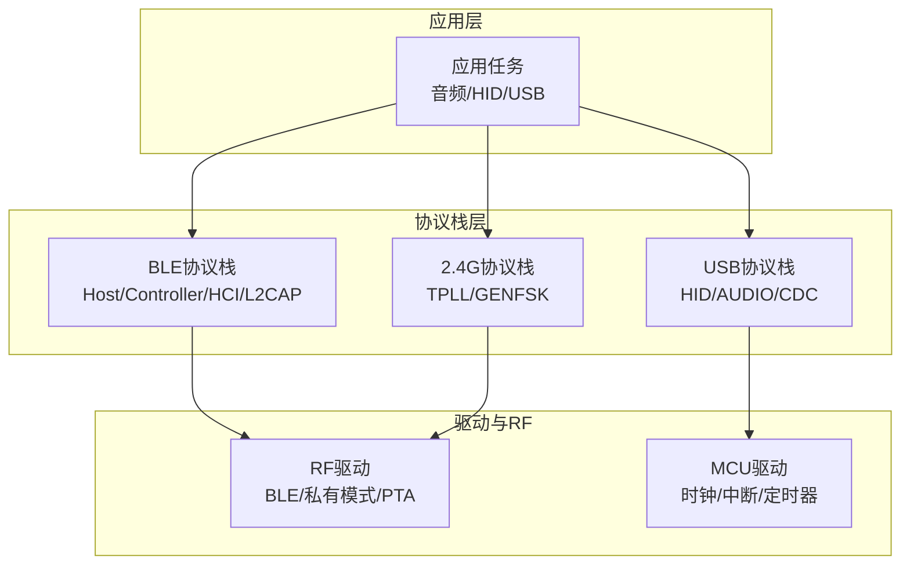
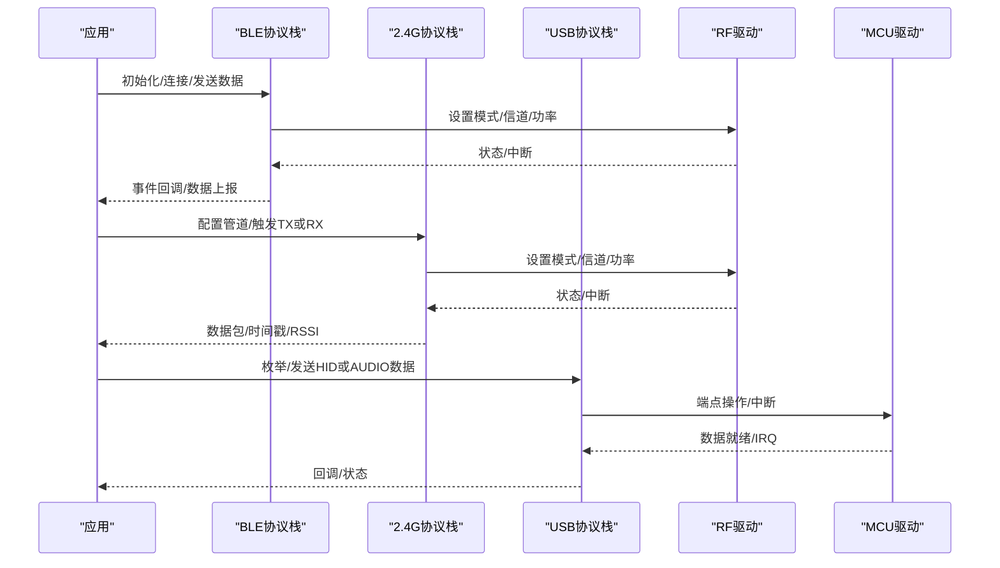
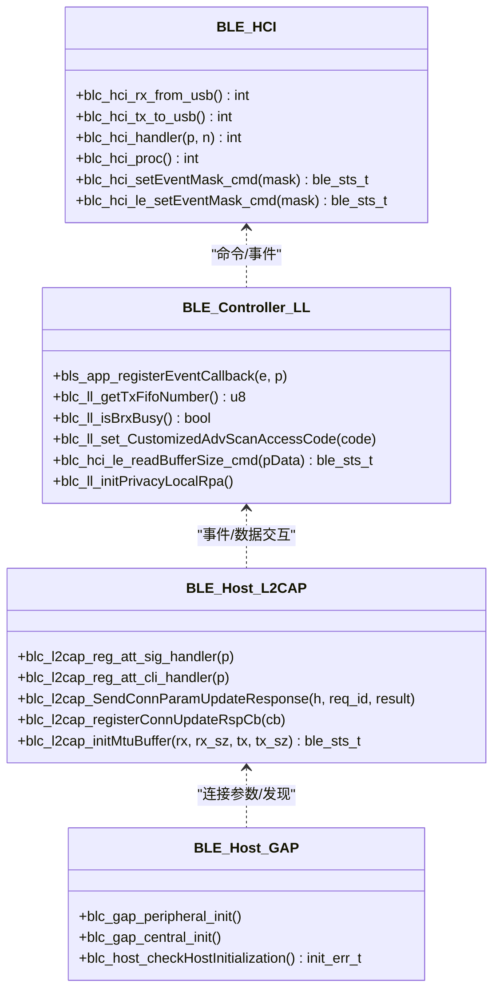
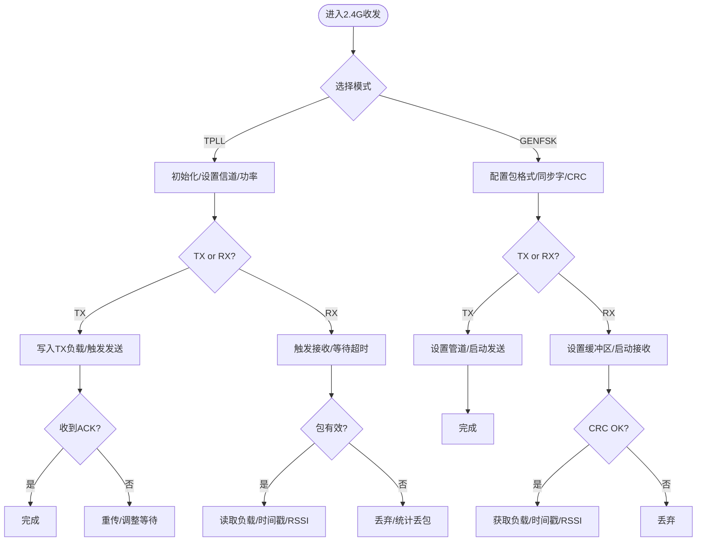
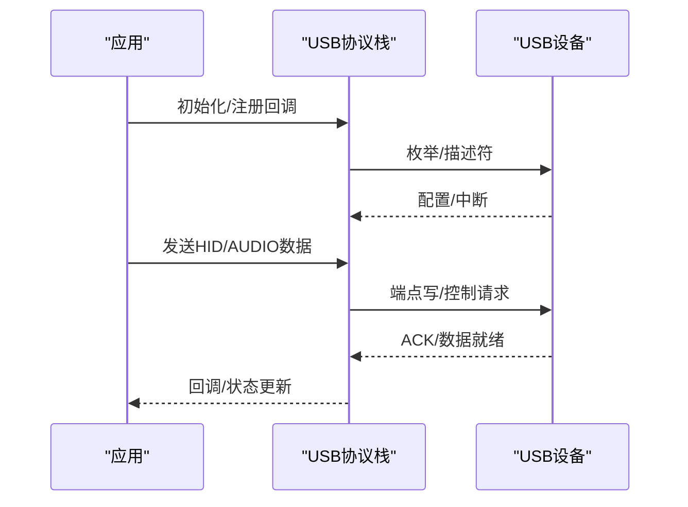
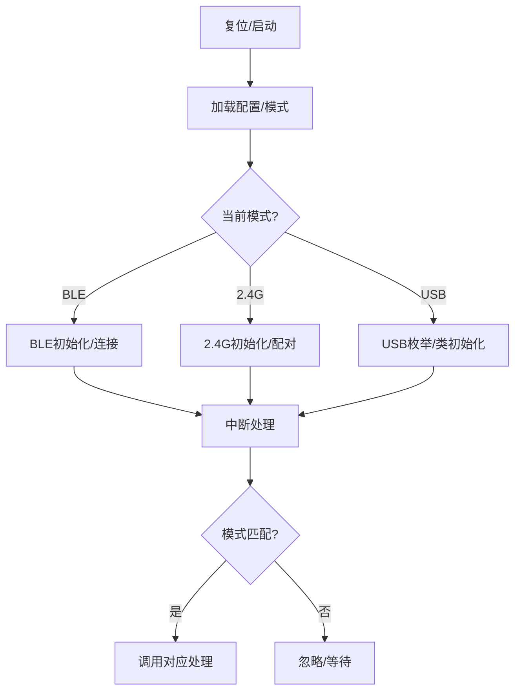
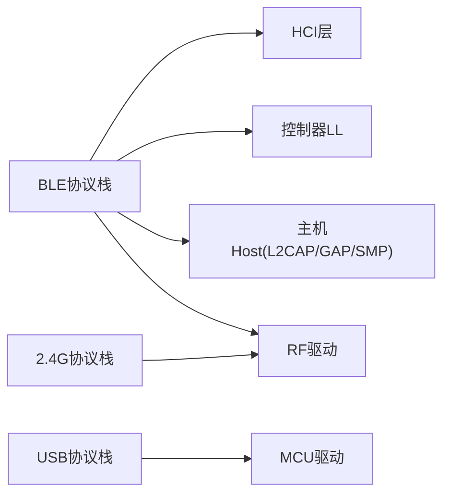

# 协议栈层设计

<cite>
**本文引用的文件**
- [tl_common.h](file://tc_ble_single_sdk/tl_common.h)
- [ble.h](file://tc_ble_single_sdk/stack/ble/ble.h)
- [hci.h](file://tc_ble_single_sdk/stack/ble/hci/hci.h)
- [ll.h](file://tc_ble_single_sdk/stack/ble/controller/ll/ll.h)
- [l2cap.h](file://tc_ble_single_sdk/stack/ble/host/l2cap/l2cap.h)
- [ble_host.h](file://tc_ble_single_sdk/stack/ble/host/ble_host.h)
- [gap.h](file://tc_ble_single_sdk/stack/ble/host/gap/gap.h)
- [genfsk_ll.h](file://tc_ble_single_sdk/stack/2p4g/genfsk_ll/genfsk_ll.h)
- [tpll.h](file://tc_ble_single_sdk/stack/2p4g/tpll/tpll.h)
- [usb.h](file://tc_ble_single_sdk/application/usbstd/usb.h)
- [usbaud.c](file://tc_ble_single_sdk/application/app/usbaud.c)
- [gl_audio.h](file://tc_ble_single_sdk/application/audio/gl_audio.h)
- [app_common.h](file://tc_ble_single_sdk/vendor/common/app_common.h)
- [app_buffer.h](file://tc_ble_single_sdk/vendor/common/app_buffer.h)
- [rf_drv.h (B80)](file://8373_dongle_for_km/chip/B80/drivers/lib/include/rf_drv.h)
- [rf_drv.h (TC321X)](file://tc_ble_single_sdk/drivers/TC321X/lib/include/rf_drv.h)
- [AAA_main.c](file://tc_ble_single_sdk/vendor/8258_dual_mouse/AAA_main.c)
- [SDK_Wiki.md](file://doc/SDK_Wiki.md)
- [Release Note](file://telink_b85m_triple_mode_audio_mouse_sdk_Release_Note .md)
</cite>

## 目录
1. [简介](#简介)
2. [项目结构](#项目结构)
3. [核心组件](#核心组件)
4. [架构总览](#架构总览)
5. [详细组件分析](#详细组件分析)
6. [依赖关系分析](#依赖关系分析)
7. [性能考量](#性能考量)
8. [故障排查指南](#故障排查指南)
9. [结论](#结论)
10. [附录](#附录)

## 简介
本文件围绕“协议栈层设计”展开，聚焦于BLE协议栈、2.4G协议栈与USB协议栈的统一抽象与协同。文档从系统架构、组件关系、数据流、处理逻辑、集成点、错误处理、性能特性等维度进行系统化阐述，并结合仓库中的头文件与示例代码，说明：
- 各协议栈的实现原理与状态机设计
- 消息传递机制与事件回调
- 向上提供统一接口、向下屏蔽差异的设计策略
- 多协议并发处理与资源分配策略
- 兼容性、版本管理与扩展性考虑
- 使用方式与典型流程（以路径引用代替具体代码）

## 项目结构
该SDK将协议栈与应用解耦，采用分层组织：
- 协议栈层：包含BLE主机/控制器、HCI、L2CAP/GAP/SMP等；2.4G私有链路层（TPLL/GENFSK）；USB设备栈
- 驱动与RF层：芯片相关RF模式、PTA优先级、时钟与中断
- 应用层：音频、HID、USB类实现、三模切换入口

图表来源
- [ble.h:1-53](file://tc_ble_single_sdk/stack/ble/ble.h#L1-L53)
- [genfsk_ll.h:1-460](file://tc_ble_single_sdk/stack/2p4g/genfsk_ll/genfsk_ll.h#L1-L460)
- [tpll.h:1-593](file://tc_ble_single_sdk/stack/2p4g/tpll/tpll.h#L1-L593)
- [usb.h:1-86](file://tc_ble_single_sdk/application/usbstd/usb.h#L1-L86)
- [rf_drv.h (B80):57-105](file://8373_dongle_for_km/chip/B80/drivers/lib/include/rf_drv.h#L57-L105)

章节来源
- [ble.h:1-53](file://tc_ble_single_sdk/stack/ble/ble.h#L1-L53)
- [genfsk_ll.h:1-460](file://tc_ble_single_sdk/stack/2p4g/genfsk_ll/genfsk_ll.h#L1-L460)
- [tpll.h:1-593](file://tc_ble_single_sdk/stack/2p4g/tpll/tpll.h#L1-L593)
- [usb.h:1-86](file://tc_ble_single_sdk/application/usbstd/usb.h#L1-L86)

## 核心组件
- BLE协议栈
  - 控制器（LL）：连接管理、广播/扫描、PHY、FIFO、事件回调
  - 主机（Host）：L2CAP、ATT/GATT、SMP、GAP、信号化
  - HCI：与USB或调试桥接的收发与事件处理
- 2.4G协议栈
  - TPLL：主链路层，提供TX/RX、管道、地址、重传、时间戳、RSSI、CRC校验、快速 settle/wait 时序
  - GENFSK：通用FSK链路层，提供包格式、同步字、CRC、自动FSM（STX/SRX/STX2RX/SRX2TX）、功率/速率/信道配置
- USB协议栈
  - HID/AUDIO/CDC类实现，端点与描述符管理，中断与数据请求处理
- 公共与资源
  - 内存与缓冲：ACL TX/RX FIFO、L2CAP MTU缓冲
  - 时钟与系统：系统时钟定义、深睡眠保持、初始化检查
  - RF模式与PTA：BLE/私有模式枚举、PTA优先级控制

章节来源
- [ll.h:124-174](file://tc_ble_single_sdk/stack/ble/controller/ll/ll.h#L124-L174)
- [l2cap.h:1-135](file://tc_ble_single_sdk/stack/ble/host/l2cap/l2cap.h#L1-L135)
- [hci.h:40-105](file://tc_ble_single_sdk/stack/ble/hci/hci.h#L40-L105)
- [tpll.h:1-593](file://tc_ble_single_sdk/stack/2p4g/tpll/tpll.h#L1-L593)
- [genfsk_ll.h:1-460](file://tc_ble_single_sdk/stack/2p4g/genfsk_ll/genfsk_ll.h#L1-L460)
- [usb.h:1-86](file://tc_ble_single_sdk/application/usbstd/usb.h#L1-L86)
- [app_buffer.h:1-115](file://tc_ble_single_sdk/vendor/common/app_buffer.h#L1-L115)
- [app_common.h:1-114](file://tc_ble_single_sdk/vendor/common/app_common.h#L1-L114)
- [rf_drv.h (B80):57-105](file://8373_dongle_for_km/chip/B80/drivers/lib/include/rf_drv.h#L57-L105)
- [rf_drv.h (TC321X):60-115](file://tc_ble_single_sdk/drivers/TC321X/lib/include/rf_drv.h#L60-L115)

## 架构总览
协议栈层通过“统一抽象+分层隔离”的方式，使上层应用无需关心底层是BLE还是2.4G或USB。关键抽象点：
- 射频通道抽象：BLE与2.4G均通过RF驱动暴露的模式与PTA优先级进行协调，避免冲突
- 链路层抽象：BLE的LL与2.4G的TPLL/GENFSK提供一致的TX/RX、管道/连接、ACK/重传、时间戳/RSSI能力
- 传输层抽象：L2CAP在BLE中负责分片重组与MTU管理；USB通过端点与报告完成类似的数据流控制
- 事件与回调：BLE LL事件、2.4G FSM中断、USB IRQ统一由应用侧注册或轮询处理

图表来源
- [ble.h:1-53](file://tc_ble_single_sdk/stack/ble/ble.h#L1-L53)
- [tpll.h:1-593](file://tc_ble_single_sdk/stack/2p4g/tpll/tpll.h#L1-L593)
- [genfsk_ll.h:1-460](file://tc_ble_single_sdk/stack/2p4g/genfsk_ll/genfsk_ll.h#L1-L460)
- [usb.h:1-86](file://tc_ble_single_sdk/application/usbstd/usb.h#L1-L86)
- [rf_drv.h (B80):57-105](file://8373_dongle_for_km/chip/B80/drivers/lib/include/rf_drv.h#L57-L105)

## 详细组件分析

### BLE协议栈
- 控制器（LL）
  - 提供FIFO数量查询、BRX忙状态检测、自定义访问码、隐私RPA初始化、事件回调注册等
  - 用于连接建立、参数更新、广播/扫描、PHY切换等
- 主机（Host）
  - L2CAP：MTU缓冲、SIG/ATT处理器注册、连接参数更新响应、回调注册
  - GAP：Central/Peripheral初始化、主机初始化检查
  - SMP：配对与安全存储
- HCI
  - USB收发、事件处理、事件掩码设置

图表来源
- [ll.h:124-174](file://tc_ble_single_sdk/stack/ble/controller/ll/ll.h#L124-L174)
- [l2cap.h:1-135](file://tc_ble_single_sdk/stack/ble/host/l2cap/l2cap.h#L1-L135)
- [gap.h:65-114](file://tc_ble_single_sdk/stack/ble/host/gap/gap.h#L65-L114)
- [hci.h:40-105](file://tc_ble_single_sdk/stack/ble/hci/hci.h#L40-L105)

章节来源
- [ll.h:124-174](file://tc_ble_single_sdk/stack/ble/controller/ll/ll.h#L124-L174)
- [l2cap.h:1-135](file://tc_ble_single_sdk/stack/ble/host/l2cap/l2cap.h#L1-L135)
- [gap.h:65-114](file://tc_ble_single_sdk/stack/ble/host/gap/gap.h#L65-L114)
- [hci.h:40-105](file://tc_ble_single_sdk/stack/ble/hci/hci.h#L40-L105)

### 2.4G协议栈（TPLL与GENFSK）
- TPLL（主链路层）
  - 状态机：空闲、TX Settle、TX、RX Wait、RX、TX Wait
  - 功能：管道/地址、重传、ACK负载、时间戳、RSSI、CRC校验、Fast/Settle时序优化
  - 触发：PTX/PRX触发、等待/超时设置、Flush、ReuseTx
- GENFSK（通用FSK链路层）
  - 包格式：固定/可变载荷、同步字长度、CRC长度
  - 模式：TX/RX/AUTO（单发/单收/收发切换）
  - 配置：功率、速率、信道、前导长度、管道开关、PID设置

图表来源
- [tpll.h:1-593](file://tc_ble_single_sdk/stack/2p4g/tpll/tpll.h#L1-L593)
- [genfsk_ll.h:1-460](file://tc_ble_single_sdk/stack/2p4g/genfsk_ll/genfsk_ll.h#L1-L460)

章节来源
- [tpll.h:1-593](file://tc_ble_single_sdk/stack/2p4g/tpll/tpll.h#L1-L593)
- [genfsk_ll.h:1-460](file://tc_ble_single_sdk/stack/2p4g/genfsk_ll/genfsk_ll.h#L1-L460)

### USB协议栈
- 设备初始化与中断处理：USB IRQ Setup/Data请求、挂起恢复标志
- 音频类：麦克风静音/音量控制、采样率、端点操作、数据发送
- HID类：报告ID与端点映射，配合应用层定时上报

图表来源
- [usb.h:1-86](file://tc_ble_single_sdk/application/usbstd/usb.h#L1-L86)
- [usbaud.c:1-320](file://tc_ble_single_sdk/application/app/usbaud.c#L1-L320)

章节来源
- [usb.h:1-86](file://tc_ble_single_sdk/application/usbstd/usb.h#L1-L86)
- [usbaud.c:1-320](file://tc_ble_single_sdk/application/app/usbaud.c#L1-L320)

### 三模切换与事件路由
- 中断路由：根据当前模式（BLE或2.4G）选择不同中断处理函数
- 模式切换：通过GPIO或配置保存/加载，持久化到Flash并切换工作模式

图表来源
- [AAA_main.c:1-200](file://tc_ble_single_sdk/vendor/8258_dual_mouse/AAA_main.c#L1-L200)

章节来源
- [AAA_main.c:1-200](file://tc_ble_single_sdk/vendor/8258_dual_mouse/AAA_main.c#L1-L200)

## 依赖关系分析
- BLE依赖
  - Host对Controller的命令/事件交互通过HCI
  - L2CAP对GATT/ATT的封装，支持大MTU缓冲注册
  - GAP负责设备角色与发现流程
- 2.4G依赖
  - TPLL/GENFSK共享RF驱动，需按模式与PTA优先级协调
  - 状态机与FSM确保收发时序正确
- USB依赖
  - 依赖MCU驱动与端点管理，应用层通过类实现对接

图表来源
- [ble.h:1-53](file://tc_ble_single_sdk/stack/ble/ble.h#L1-L53)
- [hci.h:40-105](file://tc_ble_single_sdk/stack/ble/hci/hci.h#L40-L105)
- [tpll.h:1-593](file://tc_ble_single_sdk/stack/2p4g/tpll/tpll.h#L1-L593)
- [genfsk_ll.h:1-460](file://tc_ble_single_sdk/stack/2p4g/genfsk_ll/genfsk_ll.h#L1-L460)
- [usb.h:1-86](file://tc_ble_single_sdk/application/usbstd/usb.h#L1-L86)
- [rf_drv.h (B80):57-105](file://8373_dongle_for_km/chip/B80/drivers/lib/include/rf_drv.h#L57-L105)

章节来源
- [ble.h:1-53](file://tc_ble_single_sdk/stack/ble/ble.h#L1-L53)
- [hci.h:40-105](file://tc_ble_single_sdk/stack/ble/hci/hci.h#L40-L105)
- [tpll.h:1-593](file://tc_ble_single_sdk/stack/2p4g/tpll/tpll.h#L1-L593)
- [genfsk_ll.h:1-460](file://tc_ble_single_sdk/stack/2p4g/genfsk_ll/genfsk_ll.h#L1-L460)
- [usb.h:1-86](file://tc_ble_single_sdk/application/usbstd/usb.h#L1-L86)
- [rf_drv.h (B80):57-105](file://8373_dongle_for_km/chip/B80/drivers/lib/include/rf_drv.h#L57-L105)

## 性能考量
- 缓冲与MTU
  - ACL TX/RX FIFO大小由配置宏计算，避免溢出与碎片
  - L2CAP默认MTU上限为250字节，超过需注册更大缓冲
- 时序优化
  - 2.4G Fast Settle/Wait减少收发切换延迟，提升吞吐
  - BLE BRX忙检测避免冲突
- 功耗与休眠
  - 系统时钟可配置，深睡眠保留SRAM大小可调
- 并发与PTA
  - RF模式与PTA优先级保证BLE与私有2.4G共存时的低干扰

章节来源
- [app_buffer.h:1-115](file://tc_ble_single_sdk/vendor/common/app_buffer.h#L1-L115)
- [l2cap.h:1-135](file://tc_ble_single_sdk/stack/ble/host/l2cap/l2cap.h#L1-L135)
- [tpll.h:1-593](file://tc_ble_single_sdk/stack/2p4g/tpll/tpll.h#L1-L593)
- [app_common.h:1-114](file://tc_ble_single_sdk/vendor/common/app_common.h#L1-L114)
- [rf_drv.h (B80):57-105](file://8373_dongle_for_km/chip/B80/drivers/lib/include/rf_drv.h#L57-L105)

## 故障排查指南
- 初始化检查
  - BLE主机/控制器初始化完成后执行检查，若失败则定位错误码
- 2.4G包有效性
  - 使用CRC与长度校验判断包是否有效，必要时丢弃并重试
- USB类处理
  - 音频类控制请求（静音/音量/采样率）返回错误时检查端点与描述符
- 模式切换
  - 中断路由错误会导致事件丢失，确认当前模式与处理函数匹配

章节来源
- [gap.h:65-114](file://tc_ble_single_sdk/stack/ble/host/gap/gap.h#L65-L114)
- [tpll.h:1-593](file://tc_ble_single_sdk/stack/2p4g/tpll/tpll.h#L1-L593)
- [genfsk_ll.h:1-460](file://tc_ble_single_sdk/stack/2p4g/genfsk_ll/genfsk_ll.h#L1-L460)
- [usbaud.c:1-320](file://tc_ble_single_sdk/application/app/usbaud.c#L1-L320)
- [AAA_main.c:1-200](file://tc_ble_single_sdk/vendor/8258_dual_mouse/AAA_main.c#L1-L200)

## 结论
该SDK通过分层与抽象实现了BLE、2.4G与USB三模的统一接入：
- 协议栈层提供一致的事件与数据接口，屏蔽底层差异
- 状态机与FSM确保时序与可靠性
- 缓冲与MTU管理保障高吞吐与稳定性
- PTA与RF模式协调支持多协议并发
- 应用层可按需启用不同模式，并通过统一API进行通信与控制

## 附录
- 使用示例（以路径引用代替代码）
  - BLE音频上报：参考[gl_audio.h:1-154](file://tc_ble_single_sdk/application/audio/gl_audio.h#L1-L154)
  - USB音频类：参考[usbaud.c:1-320](file://tc_ble_single_sdk/application/app/usbaud.c#L1-L320)
  - 三模切换：参考[AAA_main.c:1-200](file://tc_ble_single_sdk/vendor/8258_dual_mouse/AAA_main.c#L1-L200)
  - 2.4G收发：参考[tpll.h:1-593](file://tc_ble_single_sdk/stack/2p4g/tpll/tpll.h#L1-L593)、[genfsk_ll.h:1-460](file://tc_ble_single_sdk/stack/2p4g/genfsk_ll/genfsk_ll.h#L1-L460)
  - USB设备栈：参考[usb.h:1-86](file://tc_ble_single_sdk/application/usbstd/usb.h#L1-L86)
- 版本与兼容性
  - SDK版本与芯片平台信息见[Release Note:1-45](file://telink_b85m_triple_mode_audio_mouse_sdk_Release_Note .md#L1-L45)
  - 音频模式与USB模式说明见[SDK_Wiki.md:155-172](file://doc/SDK_Wiki.md#L155-L172)