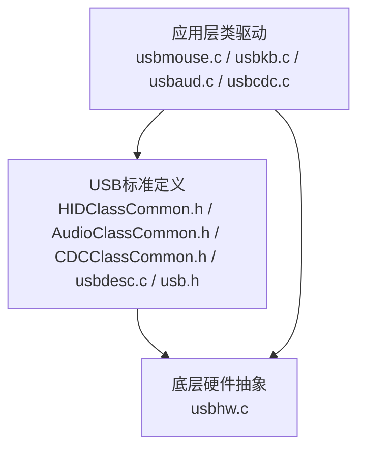
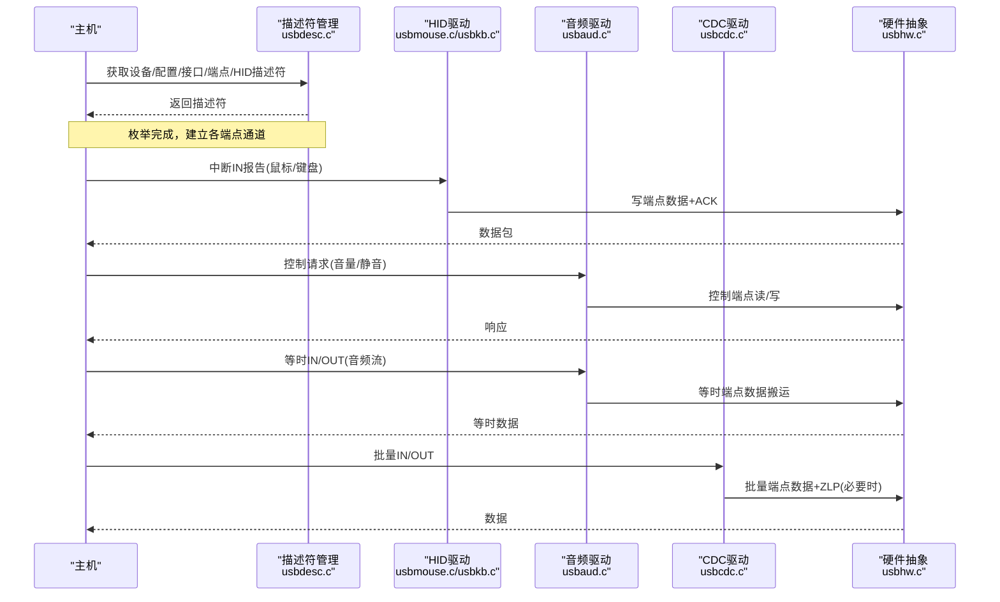
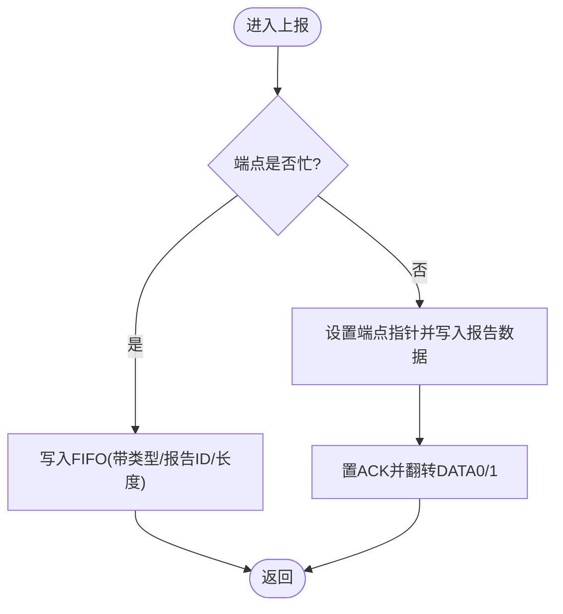
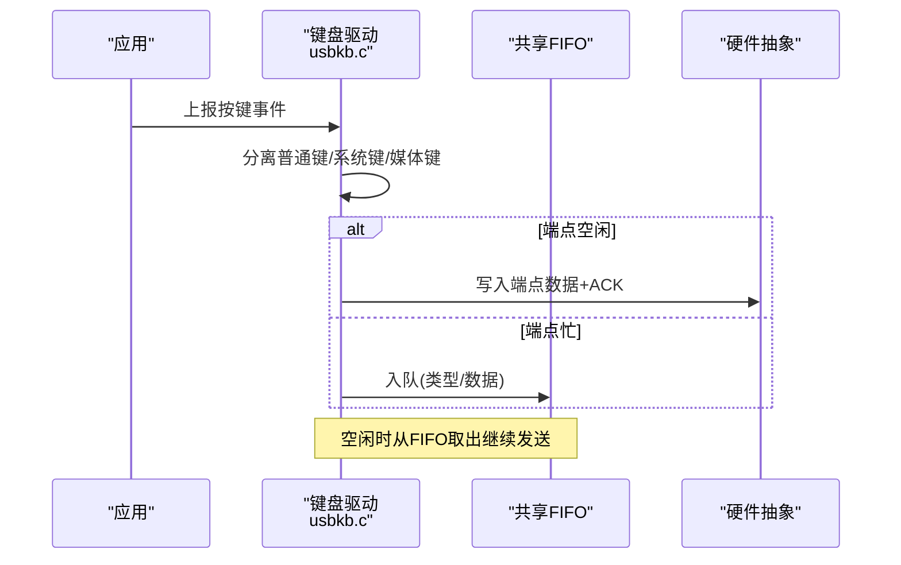
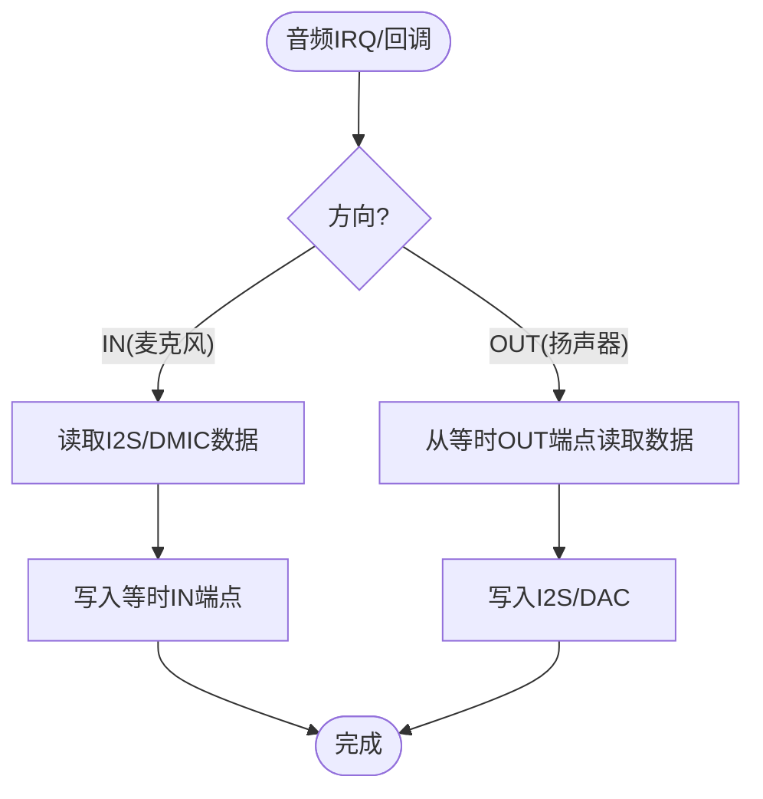
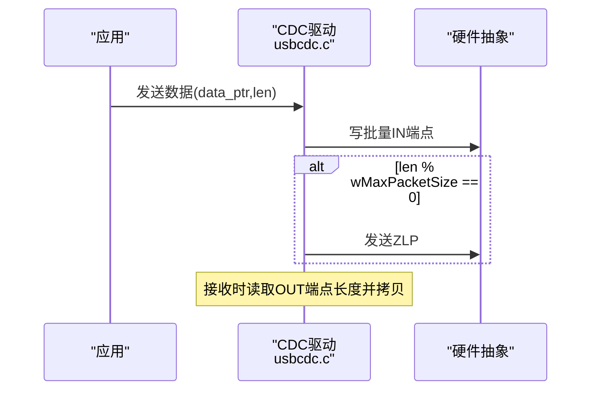
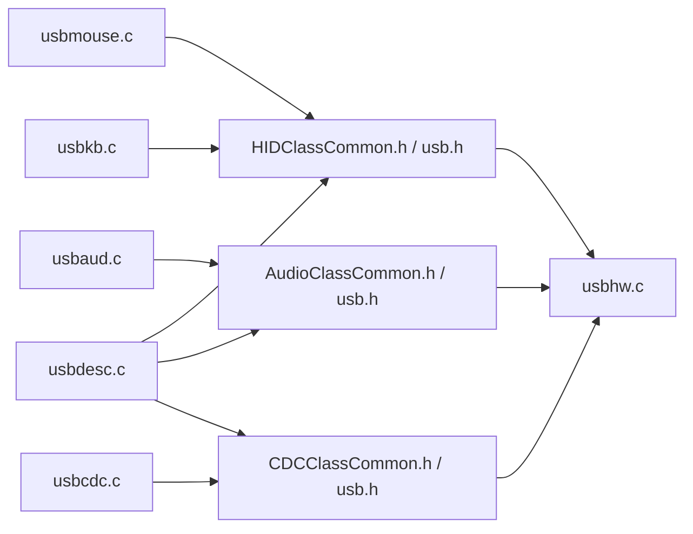

# USB设备管理

<cite>
**本文引用的文件**
- [usbmouse.c](file://tc_ble_single_sdk/application/app/usbmouse.c)
- [usbkb.c](file://tc_ble_single_sdk/application/app/usbkb.c)
- [usbaud.c](file://tc_ble_single_sdk/application/app/usbaud.c)
- [usbcdc.c](file://tc_ble_single_sdk/application/app/usbcdc.c)
- [usbdesc.c](file://tc_ble_single_sdk/application/usbstd/usbdesc.c)
- [usb.h](file://tc_ble_single_sdk/application/usbstd/usb.h)
- [usbmouse_i.h](file://tc_ble_single_sdk/application/app/usbmouse_i.h)
- [usbkb_i.h](file://tc_ble_single_sdk/application/app/usbkb_i.h)
- [usbaud_i.h](file://tc_ble_single_sdk/application/app/usbaud_i.h)
- [usbcdc_i.h](file://tc_ble_single_sdk/application/app/usbcdc_i.h)
- [HIDClassCommon.h](file://tc_ble_single_sdk/application/usbstd/HIDClassCommon.h)
- [AudioClassCommon.h](file://tc_ble_single_sdk/application/usbstd/AudioClassCommon.h)
- [CDCClassCommon.h](file://tc_ble_single_sdk/application/usbstd/CDCClassCommon.h)
- [usbhw.c](file://tc_ble_single_sdk/drivers/B85/usbhw.c)
</cite>

## 目录
1. [简介](#简介)
2. [项目结构](#项目结构)
3. [核心组件](#核心组件)
4. [架构总览](#架构总览)
5. [详细组件分析](#详细组件分析)
6. [依赖关系分析](#依赖关系分析)
7. [性能与优化](#性能与优化)
8. [故障排查指南](#故障排查指南)
9. [结论](#结论)
10. [附录：新增USB设备类型步骤](#附录新增usb设备类型步骤)

## 简介
本模块实现基于Telink B85平台的USB设备栈，支持多种USB类设备：HID（鼠标、键盘）、USB音频（Speaker/Mic）和CDC（虚拟串口）。文档重点阐述：
- HID设备的描述符配置、报告协议与数据传输流程
- USB音频设备控制面与等时数据流处理
- CDC设备的控制与批量传输
- 端点管理、缓冲区管理与错误处理机制
- 如何扩展新的USB设备类型
- 性能优化与兼容性最佳实践

## 项目结构
该SDK将USB相关代码按“应用层类驱动 + 公共USB标准定义 + 底层硬件抽象”分层组织：
- 应用层类驱动：usbmouse.c、usbkb.c、usbaud.c、usbcdc.c
- 公共USB标准定义：HIDClassCommon.h、AudioClassCommon.h、CDCClassCommon.h、usbdesc.c、usb.h
- 底层硬件抽象：drivers/B85/usbhw.c（端点读写、中断控制等）

图表来源
- [usbdesc.c:234-761](file://tc_ble_single_sdk/application/usbstd/usbdesc.c#L234-L761)
- [usb.h:24-86](file://tc_ble_single_sdk/application/usbstd/usb.h#L24-L86)
- [usbhw.c:24-103](file://tc_ble_single_sdk/drivers/B85/usbhw.c#L24-L103)

章节来源
- [usbdesc.c:234-761](file://tc_ble_single_sdk/application/usbstd/usbdesc.c#L234-L761)
- [usb.h:24-86](file://tc_ble_single_sdk/application/usbstd/usb.h#L24-L86)

## 核心组件
- HID鼠标：实现鼠标报告缓冲、平滑上报、按键释放超时处理，通过中断端点发送报告。
- HID键盘：分离普通键、系统键、媒体键，分别走不同报告ID；具备重复上报抑制与释放超时。
- USB音频：控制面通过控制端点处理静音/音量请求；数据面使用等时端点进行麦克风输入与扬声器输出。
- CDC：提供批量端点的收发接口，支持零长度包结束标志。
- 描述符：集中定义设备、配置、接口、端点及HID/Audio/CDC描述符，按编译宏开关组合。
- 硬件抽象：封装端点寄存器操作、ACK发送、控制端点读写等。

章节来源
- [usbmouse.c:44-151](file://tc_ble_single_sdk/application/app/usbmouse.c#L44-L151)
- [usbkb.c:82-337](file://tc_ble_single_sdk/application/app/usbkb.c#L82-L337)
- [usbaud.c:162-293](file://tc_ble_single_sdk/application/app/usbaud.c#L162-L293)
- [usbcdc.c:42-93](file://tc_ble_single_sdk/application/app/usbcdc.c#L42-L93)
- [usbdesc.c:234-761](file://tc_ble_single_sdk/application/usbstd/usbdesc.c#L234-L761)
- [usbhw.c:54-82](file://tc_ble_single_sdk/drivers/B85/usbhw.c#L54-L82)

## 架构总览
整体数据流与控制流如下：
- 主机枚举阶段：读取设备/配置/接口/端点/HID描述符，建立通信通道。
- 运行时：
  - HID：应用层生成报告 -> 检查端点忙 -> 写入端点数据并置ACK -> 维护轮询间隔与去抖。
  - 音频：控制面处理Set/Get请求更新状态；数据面等时端点周期性搬运PCM数据。
  - CDC：批量端点收发，注意满包后发送ZLP。

图表来源
- [usbdesc.c:234-761](file://tc_ble_single_sdk/application/usbstd/usbdesc.c#L234-L761)
- [usbmouse.c:107-151](file://tc_ble_single_sdk/application/app/usbmouse.c#L107-L151)
- [usbkb.c:150-213](file://tc_ble_single_sdk/application/app/usbkb.c#L150-L213)
- [usbaud.c:162-293](file://tc_ble_single_sdk/application/app/usbaud.c#L162-L293)
- [usbcdc.c:42-93](file://tc_ble_single_sdk/application/app/usbcdc.c#L42-L93)
- [usbhw.c:54-82](file://tc_ble_single_sdk/drivers/B85/usbhw.c#L54-L82)

## 详细组件分析

### HID鼠标（Mouse）
- 报告描述符：包含按钮、X/Y相对位移、滚轮、媒体键、系统键以及自定义Feature报告。
- 报告发送：
  - 若端点忙，则入队到全局FIFO，由统一调度函数在端点空闲时取出发送。
  - 直接发送时，设置端点指针，写入报告数据，置ACK，并翻转DATA0/DATA1。
- 缓冲与平滑：
  - 环形缓冲保存待上报的鼠标帧，避免丢帧。
  - 可选平滑策略：当端点持续忙碌且队列较短时延迟上报，降低抖动。
- 释放检测：
  - 若检测到按键未释放超过阈值，自动发送空报告以释放主机侧状态。

图表来源
- [usbmouse.c:107-151](file://tc_ble_single_sdk/application/app/usbmouse.c#L107-L151)
- [usbmouse.c:44-98](file://tc_ble_single_sdk/application/app/usbmouse.c#L44-L98)
- [usbmouse_i.h:248-449](file://tc_ble_single_sdk/application/app/usbmouse_i.h#L248-L449)

章节来源
- [usbmouse.c:44-151](file://tc_ble_single_sdk/application/app/usbmouse.c#L44-L151)
- [usbmouse_i.h:248-449](file://tc_ble_single_sdk/application/app/usbmouse_i.h#L248-L449)

### HID键盘（Keyboard）
- 报告分离：
  - 普通键：通过标准键盘报告发送。
  - 系统键/媒体键：复用鼠标报告的特定Report ID进行发送。
- 重复抑制：
  - 比较当前与上次上报数据，相同则跳过，减少总线负载。
- 释放超时：
  - 若按键保持时间超过阈值，强制发送释放报告，防止主机卡键。
- FIFO调度：
  - 键盘与鼠标共用FIFO，统一在空闲时按类型分发到对应端点。

图表来源
- [usbkb.c:134-337](file://tc_ble_single_sdk/application/app/usbkb.c#L134-L337)
- [usbkb.c:343-388](file://tc_ble_single_sdk/application/app/usbkb.c#L343-L388)
- [usbkb_i.h:35-45](file://tc_ble_single_sdk/application/app/usbkb_i.h#L35-L45)

章节来源
- [usbkb.c:82-337](file://tc_ble_single_sdk/application/app/usbkb.c#L82-L337)
- [usbkb.c:343-388](file://tc_ble_single_sdk/application/app/usbkb.c#L343-L388)
- [usbkb_i.h:35-45](file://tc_ble_single_sdk/application/app/usbkb_i.h#L35-L45)

### USB音频（Audio）
- 控制面：
  - 处理Set/Get请求，更新扬声器/麦克风静音与音量，计算步长并缓存。
  - 支持单声道模式切换。
- 数据面：
  - 麦克风：等时IN端点，按采样率周期读取ADC/I2S数据并写入USB端点。
  - 扬声器：等时OUT端点，从USB端点读取数据并写入DAC/I2S。
- 描述符：
  - 控制接口与流接口分离，声明终端、功能单元、格式与采样率。

图表来源
- [usbaud.c:311-431](file://tc_ble_single_sdk/application/app/usbaud.c#L311-L431)
- [usbaud.c:162-293](file://tc_ble_single_sdk/application/app/usbaud.c#L162-L293)
- [usbdesc.c:445-641](file://tc_ble_single_sdk/application/usbstd/usbdesc.c#L445-L641)
- [AudioClassCommon.h:48-138](file://tc_ble_single_sdk/application/usbstd/AudioClassCommon.h#L48-L138)

章节来源
- [usbaud.c:162-293](file://tc_ble_single_sdk/application/app/usbaud.c#L162-L293)
- [usbaud.c:311-431](file://tc_ble_single_sdk/application/app/usbaud.c#L311-L431)
- [usbdesc.c:445-641](file://tc_ble_single_sdk/application/usbstd/usbdesc.c#L445-L641)
- [AudioClassCommon.h:48-138](file://tc_ble_single_sdk/application/usbstd/AudioClassCommon.h#L48-L138)

### CDC（虚拟串口）
- 控制面：LineCoding等可通过控制端点配置（此处示例中定义了默认编码）。
- 数据面：
  - 发送：批量IN端点，若数据长度为端点大小的整数倍，需额外发送ZLP。
  - 接收：批量OUT端点，读取长度并拷贝到应用缓冲。

图表来源
- [usbcdc.c:42-93](file://tc_ble_single_sdk/application/app/usbcdc.c#L42-L93)
- [usbdesc.c:319-409](file://tc_ble_single_sdk/application/usbstd/usbdesc.c#L319-L409)
- [CDCClassCommon.h:55-77](file://tc_ble_single_sdk/application/usbstd/CDCClassCommon.h#L55-L77)

章节来源
- [usbcdc.c:42-93](file://tc_ble_single_sdk/application/app/usbcdc.c#L42-L93)
- [usbdesc.c:319-409](file://tc_ble_single_sdk/application/usbstd/usbdesc.c#L319-L409)
- [CDCClassCommon.h:55-77](file://tc_ble_single_sdk/application/usbstd/CDCClassCommon.h#L55-L77)

### 描述符与设备配置
- 设备描述符：指定USB版本、类、VID/PID、字符串索引等。
- 配置描述符：根据编译宏动态组合HID、Audio、CDC接口与端点。
- HID描述符：键盘、鼠标各自独立，支持多Report ID。
- Audio描述符：控制接口与流接口分离，声明终端、功能单元、格式与采样率。
- CDC描述符：控制接口与数据接口分离，定义通知、批量端点。

章节来源
- [usbdesc.c:234-761](file://tc_ble_single_sdk/application/usbstd/usbdesc.c#L234-L761)
- [usbmouse_i.h:248-449](file://tc_ble_single_sdk/application/app/usbmouse_i.h#L248-L449)
- [usbkb_i.h:35-45](file://tc_ble_single_sdk/application/app/usbkb_i.h#L35-L45)
- [usbaud_i.h:97-114](file://tc_ble_single_sdk/application/app/usbaud_i.h#L97-L114)

## 依赖关系分析
- 应用层类驱动依赖：
  - 公共USB标准定义（HID/Audio/CDC描述符与常量）
  - 硬件抽象（端点寄存器操作、ACK、控制端点读写）
- 描述符模块依赖：
  - 各子模块提供的报告描述符与大小查询函数
- 硬件抽象依赖：
  - 芯片寄存器与中断管理

图表来源
- [usbmouse.c:24-29](file://tc_ble_single_sdk/application/app/usbmouse.c#L24-L29)
- [usbkb.c:24-30](file://tc_ble_single_sdk/application/app/usbkb.c#L24-L30)
- [usbaud.c:24-31](file://tc_ble_single_sdk/application/app/usbaud.c#L24-L31)
- [usbcdc.c:24-30](file://tc_ble_single_sdk/application/app/usbcdc.c#L24-L30)
- [usbdesc.c:24-46](file://tc_ble_single_sdk/application/usbstd/usbdesc.c#L24-L46)
- [usbhw.c:24-27](file://tc_ble_single_sdk/drivers/B85/usbhw.c#L24-L27)

章节来源
- [usbmouse.c:24-29](file://tc_ble_single_sdk/application/app/usbmouse.c#L24-L29)
- [usbkb.c:24-30](file://tc_ble_single_sdk/application/app/usbkb.c#L24-L30)
- [usbaud.c:24-31](file://tc_ble_single_sdk/application/app/usbaud.c#L24-L31)
- [usbcdc.c:24-30](file://tc_ble_single_sdk/application/app/usbcdc.c#L24-L30)
- [usbdesc.c:24-46](file://tc_ble_single_sdk/application/usbstd/usbdesc.c#L24-L46)
- [usbhw.c:24-27](file://tc_ble_single_sdk/drivers/B85/usbhw.c#L24-L27)

## 性能与优化
- 端点忙检测与FIFO缓冲：
  - 在端点忙时将数据入队，避免阻塞上层逻辑；空闲时统一调度发送，提升吞吐。
- 去抖与重复抑制：
  - 键盘重复上报抑制，减少无效传输；鼠标平滑上报策略降低抖动。
- 释放超时：
  - 对长时间未释放的按键自动发送释放报告，保证主机状态一致性。
- 等时端点数据搬运：
  - 音频数据按固定长度循环搬运，确保低延迟与稳定流。
- ZLP处理：
  - CDC批量发送满包后发送ZLP，符合USB规范，提高主机解析效率。
- 兼容性：
  - 描述符按平台与功能开关组合，确保在不同主机下的兼容识别。

[本节为通用指导，不直接分析具体文件]

## 故障排查指南
- 端点忙导致上报失败：
  - 检查FIFO是否溢出；确认调度函数是否被调用；观察端点忙标志。
- 主机未识别设备：
  - 核对设备/配置/接口/端点描述符是否正确；确认VID/PID与类设置。
- 音频无声或杂音：
  - 检查等时端点长度与采样率匹配；确认I2S/DMIC数据源有效；验证静音/音量设置。
- CDC无法收发：
  - 确认ZLP发送逻辑；检查LineCoding配置；核对批量端点大小。
- 按键卡住：
  - 检查释放超时逻辑是否触发；确认释放报告成功发送。

章节来源
- [usbmouse.c:59-98](file://tc_ble_single_sdk/application/app/usbmouse.c#L59-L98)
- [usbkb.c:127-132](file://tc_ble_single_sdk/application/app/usbkb.c#L127-L132)
- [usbcdc.c:64-72](file://tc_ble_single_sdk/application/app/usbcdc.c#L64-L72)
- [usbaud.c:311-431](file://tc_ble_single_sdk/application/app/usbaud.c#L311-L431)

## 结论
本模块通过清晰的分层设计与完善的描述符管理，实现了HID、音频与CDC三类USB设备的稳定运行。借助端点忙检测、FIFO缓冲、去抖与释放超时等机制，保证了高可靠的数据传输与良好的用户体验。后续可按附录步骤扩展新设备类型，结合描述符与端点管理快速集成。

[本节为总结性内容，不直接分析具体文件]

## 附录：新增USB设备类型步骤
- 定义描述符：
  - 在usbdesc.c中添加设备/配置/接口/端点描述符，按需启用编译宏。
  - 如需HID，添加报告描述符并在对应头文件中暴露查询函数。
- 实现类驱动：
  - 新建或扩展现有驱动文件，实现端点初始化、数据收发、控制请求处理。
  - 使用usbhw.c提供的端点读写与ACK接口。
- 注册与调度：
  - 在描述符中声明新端点，并在应用层加入FIFO调度或独立任务处理。
- 测试与调试：
  - 使用主机工具验证枚举与数据传输；检查端点忙与错误码；调整轮询间隔与包大小。

章节来源
- [usbdesc.c:234-761](file://tc_ble_single_sdk/application/usbstd/usbdesc.c#L234-L761)
- [usbmouse_i.h:450-503](file://tc_ble_single_sdk/application/app/usbmouse_i.h#L450-L503)
- [usbkb_i.h:47-132](file://tc_ble_single_sdk/application/app/usbkb_i.h#L47-L132)
- [usbaud_i.h:97-114](file://tc_ble_single_sdk/application/app/usbaud_i.h#L97-L114)
- [usbhw.c:54-82](file://tc_ble_single_sdk/drivers/B85/usbhw.c#L54-L82)