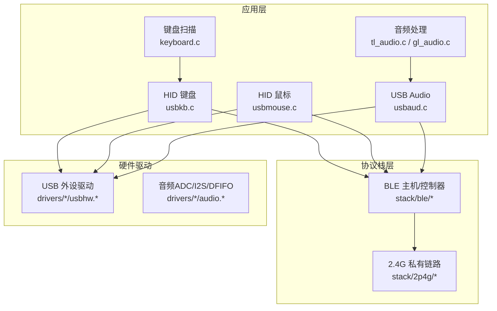
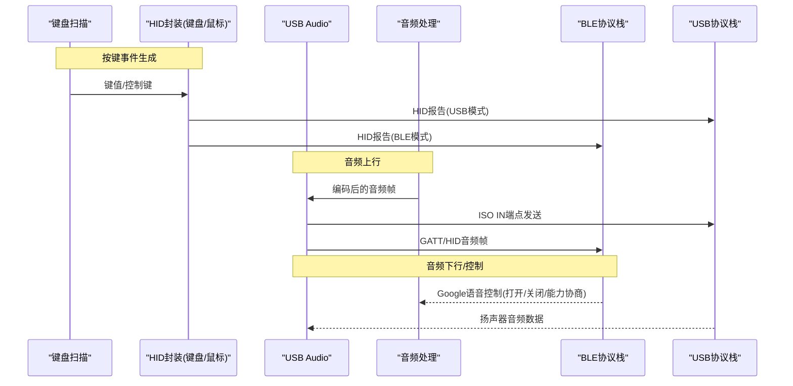
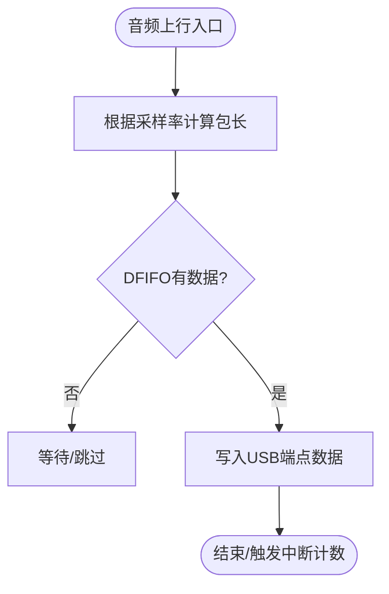
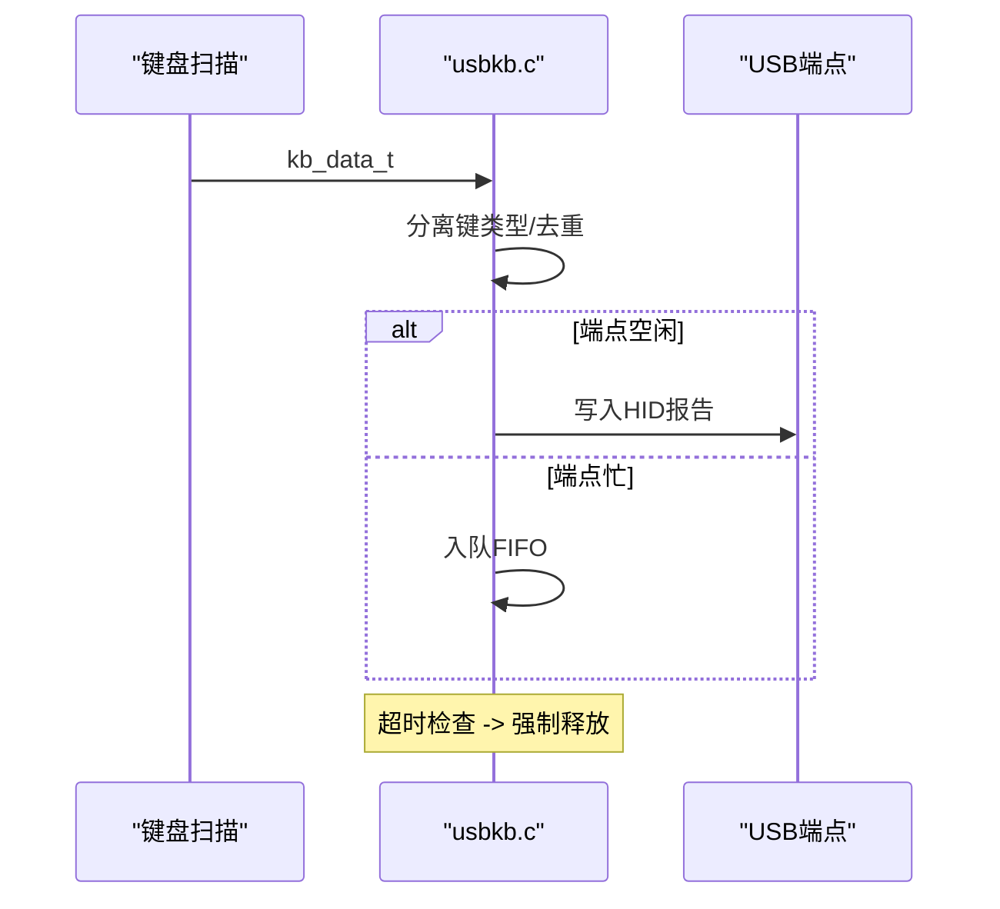
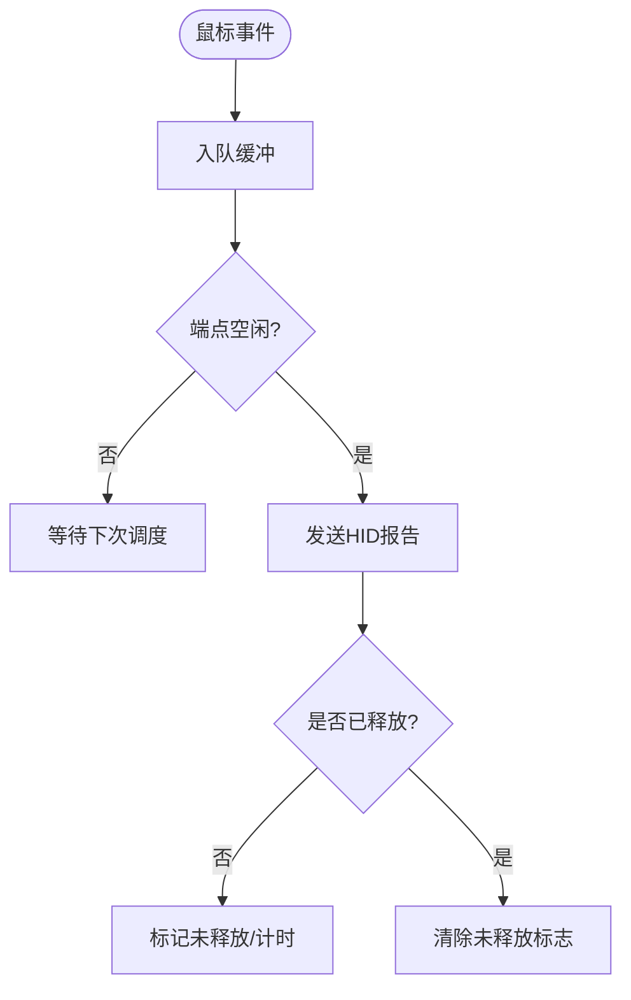
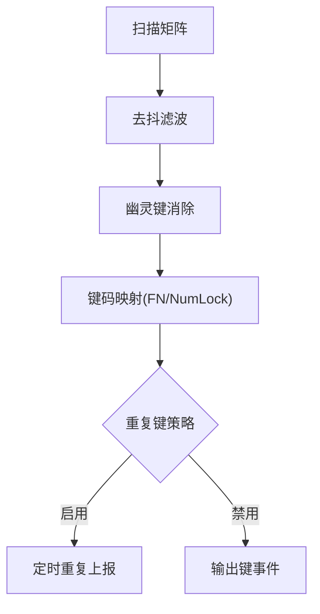
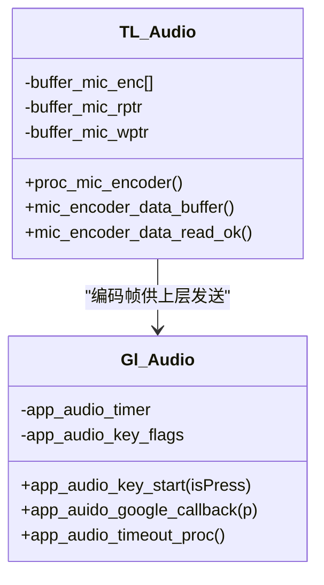
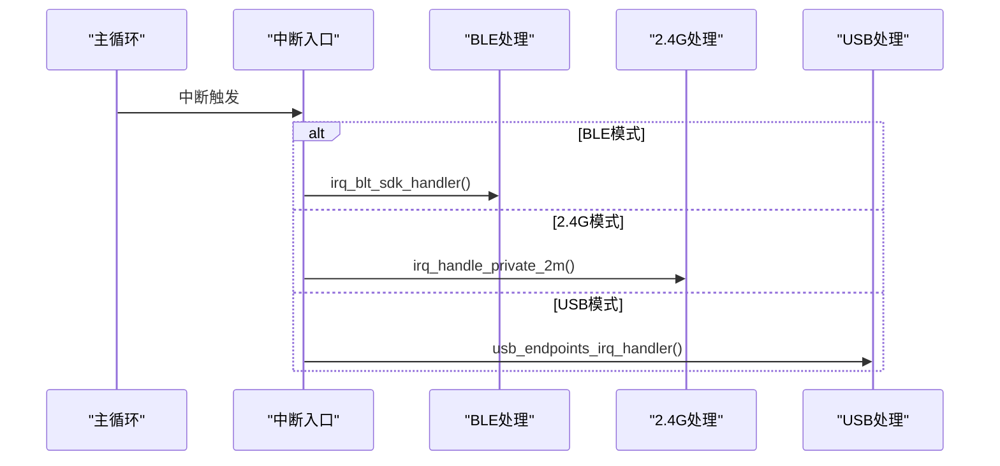
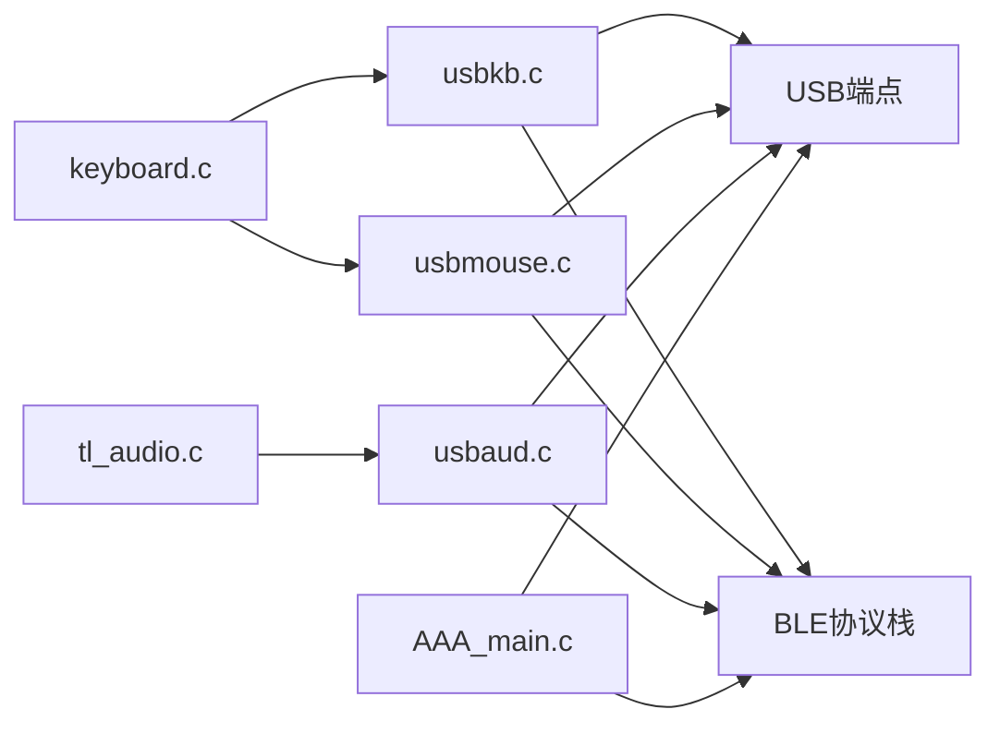

# 应用层设计

<cite>
**本文引用的文件**
- [usbaud.c](file://tc_ble_single_sdk/application/app/usbaud.c)
- [usbaud.h](file://tc_ble_single_sdk/application/app/usbaud.h)
- [usbkb.c](file://tc_ble_single_sdk/application/app/usbkb.c)
- [usbmouse.c](file://tc_ble_single_sdk/application/app/usbmouse.c)
- [keyboard.c](file://tc_ble_single_sdk/application/keyboard/keyboard.c)
- [keyboard.h](file://tc_ble_single_sdk/application/keyboard/keyboard.h)
- [tl_audio.c](file://tc_ble_single_sdk/application/audio/tl_audio.c)
- [tl_audio.h](file://tc_ble_single_sdk/application/audio/tl_audio.h)
- [gl_audio.c](file://tc_ble_single_sdk/application/audio/gl_audio.c)
- [audio_config.h](file://tc_ble_single_sdk/application/audio/audio_config.h)
- [AAA_main.c](file://tc_ble_single_sdk/vendor/827x_three_mode_mouse/AAA_main.c)
</cite>

## 目录
1. [简介](#简介)
2. [项目结构](#项目结构)
3. [核心组件](#核心组件)
4. [架构总览](#架构总览)
5. [详细组件分析](#详细组件分析)
6. [依赖关系分析](#依赖关系分析)
7. [性能考虑](#性能考虑)
8. [故障排查指南](#故障排查指南)
9. [结论](#结论)
10. [附录](#附录)

## 简介
本文件聚焦于三模（USB/BLE/2.4G）音频鼠标SDK的应用层设计，围绕以下目标展开：
- 明确应用层的职责边界与模块划分：USB设备管理、音频处理、键盘输入等。
- 阐述各模块的初始化流程、事件处理机制与数据流管理。
- 说明应用层如何与协议栈层交互（API调用模式与回调机制）。
- 提供开发模式示例与最佳实践（错误处理、资源管理、性能优化）。
- 解释三模连接在应用层的统一抽象实现方式。

## 项目结构
应用层位于 tc_ble_single_sdk/application 下，按功能划分为：
- application/app：USB类驱动与应用接口（USB Audio、HID键盘/鼠标）。
- application/audio：音频采集、编码、滤波与Google语音模型适配。
- application/keyboard：矩阵键盘扫描、去抖、键码映射与重复键处理。
- vendor/...：三模主程序入口与中断路由（BLE/2.4G/USB）。

图表来源
- [usbaud.c:294-304](file://tc_ble_single_sdk/application/app/usbaud.c#L294-L304)
- [usbkb.c:339-341](file://tc_ble_single_sdk/application/app/usbkb.c#L339-L341)
- [usbmouse.c:154-155](file://tc_ble_single_sdk/application/app/usbmouse.c#L154-L155)
- [keyboard.c:396-486](file://tc_ble_single_sdk/application/keyboard/keyboard.c#L396-L486)
- [tl_audio.c:327-418](file://tc_ble_single_sdk/application/audio/tl_audio.c#L327-L418)
- [AAA_main.c:59-75](file://tc_ble_single_sdk/vendor/827x_three_mode_mouse/AAA_main.c#L59-L75)

章节来源
- [usbaud.c:294-304](file://tc_ble_single_sdk/application/app/usbaud.c#L294-L304)
- [usbkb.c:339-341](file://tc_ble_single_sdk/application/app/usbkb.c#L339-L341)
- [usbmouse.c:154-155](file://tc_ble_single_sdk/application/app/usbmouse.c#L154-L155)
- [keyboard.c:396-486](file://tc_ble_single_sdk/application/keyboard/keyboard.c#L396-L486)
- [tl_audio.c:327-418](file://tc_ble_single_sdk/application/audio/tl_audio.c#L327-L418)
- [AAA_main.c:59-75](file://tc_ble_single_sdk/vendor/827x_three_mode_mouse/AAA_main.c#L59-L75)

## 核心组件
- USB Audio 模块：负责麦克风采样到USB端点的传输、扬声器从USB接收并写入音频DAC路径；支持音量/静音控制与HID扩展命令。
- HID 键盘模块：将按键事件封装为HID报告，支持普通键、系统键、媒体键分类上报，具备防重发与超时释放机制。
- HID 鼠标模块：将位移/按键打包为HID报告，支持平滑上报与超时释放。
- 键盘扫描模块：矩阵扫描、去抖、幽灵键消除、FN/NumLock状态切换、重复键策略。
- 音频处理模块：根据编译模式选择ADPCM/SBC/MSBC编码，IIR滤波、降噪、音量增益配置，以及Google语音模型（HTT/PTT/OnRequest）控制。
- 三模主循环与中断路由：根据当前工作模式分发至BLE/2.4G/USB中断处理。

章节来源
- [usbaud.c:294-304](file://tc_ble_single_sdk/application/app/usbaud.c#L294-L304)
- [usbkb.c:306-337](file://tc_ble_single_sdk/application/app/usbkb.c#L306-L337)
- [usbmouse.c:70-98](file://tc_ble_single_sdk/application/app/usbmouse.c#L70-L98)
- [keyboard.c:396-486](file://tc_ble_single_sdk/application/keyboard/keyboard.c#L396-L486)
- [tl_audio.c:327-418](file://tc_ble_single_sdk/application/audio/tl_audio.c#L327-L418)
- [AAA_main.c:59-75](file://tc_ble_single_sdk/vendor/827x_three_mode_mouse/AAA_main.c#L59-L75)

## 架构总览
应用层以“事件驱动+环形缓冲”为核心组织数据流：
- 输入侧：键盘扫描产生键值事件，经HID封装后通过USB或BLE上报；音频ADC采样进入编码器，产出压缩帧，再经USB或BLE发送。
- 输出侧：USB/Audio下行数据经USB端点读取，写入音频DAC；BLE Google语音控制命令通过GATT通知/回调驱动麦克风开关。
- 三模统一抽象：上层仅关注“上报/下发”语义，具体通道由主循环与中断路由决定。

图表来源
- [usbkb.c:306-337](file://tc_ble_single_sdk/application/app/usbkb.c#L306-L337)
- [usbmouse.c:70-98](file://tc_ble_single_sdk/application/app/usbmouse.c#L70-L98)
- [usbaud.c:311-431](file://tc_ble_single_sdk/application/app/usbaud.c#L311-L431)
- [gl_audio.c:213-354](file://tc_ble_single_sdk/application/audio/gl_audio.c#L213-L354)

## 详细组件分析

### USB Audio 模块
- 初始化：根据单声道/双声道配置设置端点模式，默认音量与静音状态初始化。
- 上行（麦克风）：按采样率计算每包长度，轮询DFIFO/寄存器读取音频样本，写入USB端点；中断中统计端点完成次数。
- 下行（扬声器）：从USB端点读取音频数据，写入音频DAC寄存器。
- 控制面：处理Class请求（音量/静音），维护本地设置结构体并提供查询接口。

图表来源
- [usbaud.c:311-399](file://tc_ble_single_sdk/application/app/usbaud.c#L311-L399)
- [usbaud.c:440-453](file://tc_ble_single_sdk/application/app/usbaud.c#L440-L453)

章节来源
- [usbaud.c:294-304](file://tc_ble_single_sdk/application/app/usbaud.c#L294-L304)
- [usbaud.c:311-431](file://tc_ble_single_sdk/application/app/usbaud.c#L311-L431)
- [usbaud.c:440-453](file://tc_ble_single_sdk/application/app/usbaud.c#L440-L453)
- [usbaud.h:52-113](file://tc_ble_single_sdk/application/app/usbaud.h#L52-L113)

### HID 键盘模块
- 事件分离：将按键分为普通键、系统键、媒体键三类分别上报。
- 防重发与超时释放：记录上次上报状态，相同状态不重复上报；若长时间未释放则强制释放。
- FIFO缓冲：当端点忙时，将数据入队，主循环择机发送。

图表来源
- [usbkb.c:134-276](file://tc_ble_single_sdk/application/app/usbkb.c#L134-L276)
- [usbkb.c:306-337](file://tc_ble_single_sdk/application/app/usbkb.c#L306-L337)
- [usbkb.c:343-388](file://tc_ble_single_sdk/application/app/usbkb.c#L343-L388)

章节来源
- [usbkb.c:134-276](file://tc_ble_single_sdk/application/app/usbkb.c#L134-L276)
- [usbkb.c:306-337](file://tc_ble_single_sdk/application/app/usbkb.c#L306-L337)
- [usbkb.c:343-388](file://tc_ble_single_sdk/application/app/usbkb.c#L343-L388)

### HID 鼠标模块
- 帧缓冲：将鼠标数据包入队，主循环择机发送。
- 平滑上报：在低移动量时合并上报以降低带宽占用。
- 超时释放：未释放按钮超过阈值则发送空报告。

图表来源
- [usbmouse.c:44-98](file://tc_ble_single_sdk/application/app/usbmouse.c#L44-L98)
- [usbmouse.c:107-151](file://tc_ble_single_sdk/application/app/usbmouse.c#L107-L151)

章节来源
- [usbmouse.c:44-98](file://tc_ble_single_sdk/application/app/usbmouse.c#L44-L98)
- [usbmouse.c:107-151](file://tc_ble_single_sdk/application/app/usbmouse.c#L107-L151)

### 键盘扫描模块
- 矩阵扫描：逐行驱动，读取扫描引脚状态，构建按下矩阵。
- 去抖与幽灵键消除：多周期滤波，检测交叉组合消除幽灵键。
- 键码映射：根据NumLock/FN状态切换映射表，解析控制键与普通键。
- 重复键：对指定键启用长按重复上报。

图表来源
- [keyboard.c:224-310](file://tc_ble_single_sdk/application/keyboard/keyboard.c#L224-L310)
- [keyboard.c:313-358](file://tc_ble_single_sdk/application/keyboard/keyboard.c#L313-L358)
- [keyboard.c:396-486](file://tc_ble_single_sdk/application/keyboard/keyboard.c#L396-L486)

章节来源
- [keyboard.c:224-310](file://tc_ble_single_sdk/application/keyboard/keyboard.c#L224-L310)
- [keyboard.c:313-358](file://tc_ble_single_sdk/application/keyboard/keyboard.c#L313-L358)
- [keyboard.c:396-486](file://tc_ble_single_sdk/application/keyboard/keyboard.c#L396-L486)
- [keyboard.h:28-113](file://tc_ble_single_sdk/application/keyboard/keyboard.h#L28-L113)

### 音频处理模块
- 编码路径：根据TL_AUDIO_MODE选择ADPCM/SBC/MSBC编码，批量读取ADC缓冲，执行降噪与IIR滤波，产出固定长度音频帧。
- 参数配置：从Flash加载滤波器系数与音量增益，动态设置PGA/数字音量。
- Google语音模型：支持HTT/PTT/OnRequest三种交互模式，通过GATT特性进行开/关/能力协商与超时管理。

图表来源
- [tl_audio.c:327-418](file://tc_ble_single_sdk/application/audio/tl_audio.c#L327-L418)
- [tl_audio.c:439-545](file://tc_ble_single_sdk/application/audio/tl_audio.c#L439-L545)
- [tl_audio.c:546-649](file://tc_ble_single_sdk/application/audio/tl_audio.c#L546-L649)
- [gl_audio.c:60-181](file://tc_ble_single_sdk/application/audio/gl_audio.c#L60-L181)
- [gl_audio.c:213-354](file://tc_ble_single_sdk/application/audio/gl_audio.c#L213-L354)

章节来源
- [tl_audio.c:327-418](file://tc_ble_single_sdk/application/audio/tl_audio.c#L327-L418)
- [tl_audio.c:439-545](file://tc_ble_single_sdk/application/audio/tl_audio.c#L439-L545)
- [tl_audio.c:546-649](file://tc_ble_single_sdk/application/audio/tl_audio.c#L546-L649)
- [tl_audio.h:32-129](file://tc_ble_single_sdk/application/audio/tl_audio.h#L32-L129)
- [gl_audio.c:60-181](file://tc_ble_single_sdk/application/audio/gl_audio.c#L60-L181)
- [gl_audio.c:213-354](file://tc_ble_single_sdk/application/audio/gl_audio.c#L213-L354)
- [audio_config.h:28-123](file://tc_ble_single_sdk/application/audio/audio_config.h#L28-L123)

### 三模连接统一抽象
- 主循环与中断路由：根据当前模式（BLE/2.4G/USB）调用对应中断处理函数，屏蔽底层差异。
- 应用层视角：对外暴露“上报/下发”接口，内部根据模式选择USB端点或BLE GATT/HID通道。

图表来源
- [AAA_main.c:59-75](file://tc_ble_single_sdk/vendor/827x_three_mode_mouse/AAA_main.c#L59-L75)

章节来源
- [AAA_main.c:59-75](file://tc_ble_single_sdk/vendor/827x_three_mode_mouse/AAA_main.c#L59-L75)

## 依赖关系分析
- 键盘扫描依赖GPIO与定时器，输出标准化键事件给HID封装。
- HID封装依赖USB端点状态与FIFO，必要时复用同一FIFO用于鼠标与键盘。
- 音频处理依赖ADC/DFIFO与编码器库，输出压缩帧给USB或BLE。
- 三模主程序依赖BLE/2.4G/USB驱动，按模式路由中断。

图表来源
- [keyboard.c:396-486](file://tc_ble_single_sdk/application/keyboard/keyboard.c#L396-L486)
- [usbkb.c:306-337](file://tc_ble_single_sdk/application/app/usbkb.c#L306-L337)
- [usbmouse.c:70-98](file://tc_ble_single_sdk/application/app/usbmouse.c#L70-L98)
- [tl_audio.c:327-418](file://tc_ble_single_sdk/application/audio/tl_audio.c#L327-L418)
- [usbaud.c:311-431](file://tc_ble_single_sdk/application/app/usbaud.c#L311-L431)
- [AAA_main.c:59-75](file://tc_ble_single_sdk/vendor/827x_three_mode_mouse/AAA_main.c#L59-L75)

章节来源
- [keyboard.c:396-486](file://tc_ble_single_sdk/application/keyboard/keyboard.c#L396-L486)
- [usbkb.c:306-337](file://tc_ble_single_sdk/application/app/usbkb.c#L306-L337)
- [usbmouse.c:70-98](file://tc_ble_single_sdk/application/app/usbmouse.c#L70-L98)
- [tl_audio.c:327-418](file://tc_ble_single_sdk/application/audio/tl_audio.c#L327-L418)
- [usbaud.c:311-431](file://tc_ble_single_sdk/application/app/usbaud.c#L311-L431)
- [AAA_main.c:59-75](file://tc_ble_single_sdk/vendor/827x_three_mode_mouse/AAA_main.c#L59-L75)

## 性能考虑
- 避免重复上报：HID键盘/鼠标均实现去重与超时释放，减少总线负载。
- 缓冲与溢出保护：键盘/鼠标使用环形缓冲，端点忙时入队，防止丢包；音频编码器采用双缓冲与溢出回退策略。
- 音频处理流水线：IIR滤波与降噪仅在需要时启用，降低CPU占用；合理设置包长与采样率匹配USB/BLE MTU。
- 平滑上报：鼠标在小位移场景合并上报，降低频率。
- 三模路由：中断快速分发，避免阻塞关键路径。

[本节为通用指导，无需特定文件引用]

## 故障排查指南
- USB端点忙导致上报失败：检查端点忙标志与FIFO深度，必要时增大缓冲或降低上报频率。
- 音频卡顿或爆音：确认DFIFO中断及时响应，调整包长与采样率；检查IIR滤波参数与增益设置。
- 按键卡住：启用超时释放逻辑，确保长时间按键能正确释放。
- Google语音模型异常：核对能力协商报文与超时处理，确认HTT/PTT/OnRequest模式标志位。

章节来源
- [usbkb.c:127-132](file://tc_ble_single_sdk/application/app/usbkb.c#L127-L132)
- [usbmouse.c:59-67](file://tc_ble_single_sdk/application/app/usbmouse.c#L59-L67)
- [usbaud.c:440-453](file://tc_ble_single_sdk/application/app/usbaud.c#L440-L453)
- [gl_audio.c:185-211](file://tc_ble_single_sdk/application/audio/gl_audio.c#L185-L211)

## 结论
本应用层以模块化与事件驱动为核心，实现了USB Audio、HID键盘/鼠标与音频处理的完整链路，并通过三模主循环与中断路由统一抽象不同传输通道。借助环形缓冲、去重与超时释放、IIR滤波与降噪等机制，系统在稳定性与性能之间取得良好平衡。开发者可基于现有接口快速扩展新功能，同时遵循错误处理与资源管理规范，确保产品可靠性。

[本节为总结性内容，无需特定文件引用]

## 附录
- 开发模式示例（路径参考）：
  - 键盘事件上报：[usbkb.c:306-337](file://tc_ble_single_sdk/application/app/usbkb.c#L306-L337)
  - 鼠标事件上报：[usbmouse.c:70-98](file://tc_ble_single_sdk/application/app/usbmouse.c#L70-L98)
  - 音频上行发送：[usbaud.c:311-399](file://tc_ble_single_sdk/application/app/usbaud.c#L311-L399)
  - Google语音控制：[gl_audio.c:213-354](file://tc_ble_single_sdk/application/audio/gl_audio.c#L213-L354)
  - 三模中断路由：[AAA_main.c:59-75](file://tc_ble_single_sdk/vendor/827x_three_mode_mouse/AAA_main.c#L59-L75)

[本节为参考信息，无需特定文件引用]