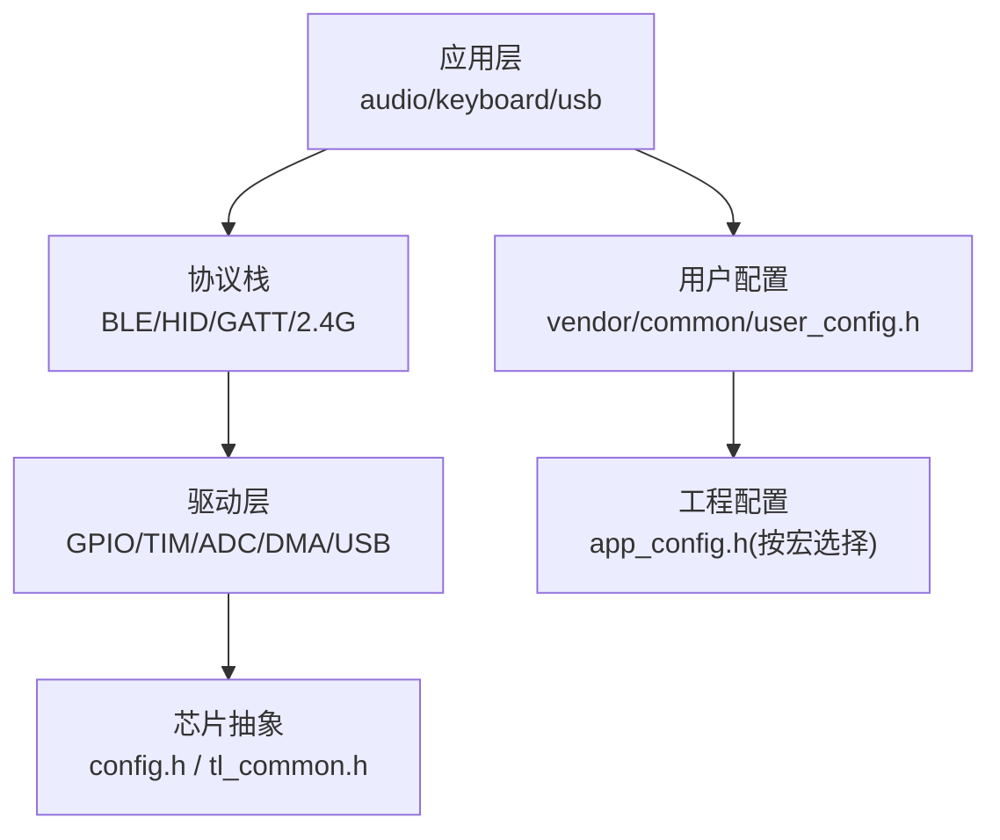
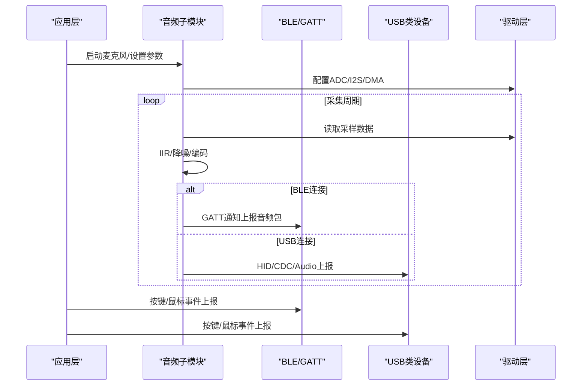
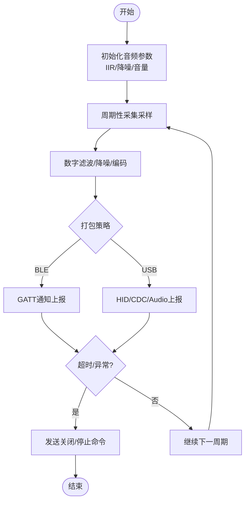
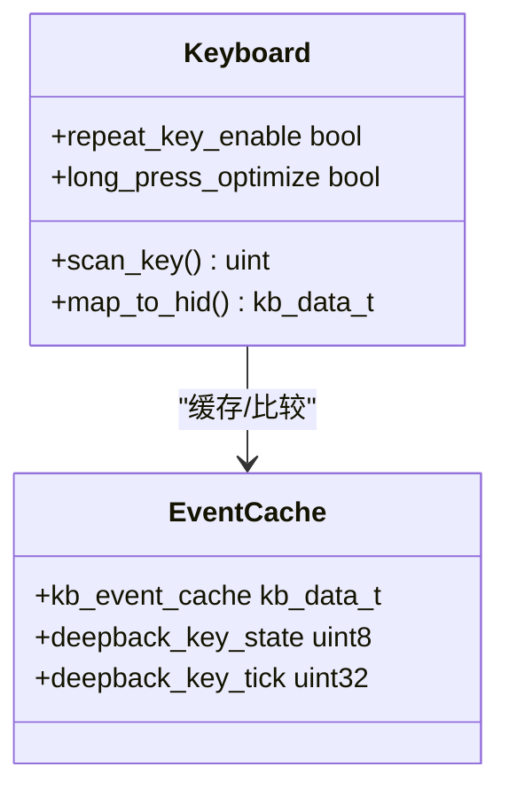
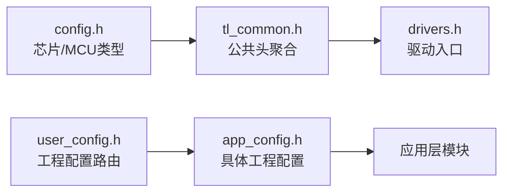
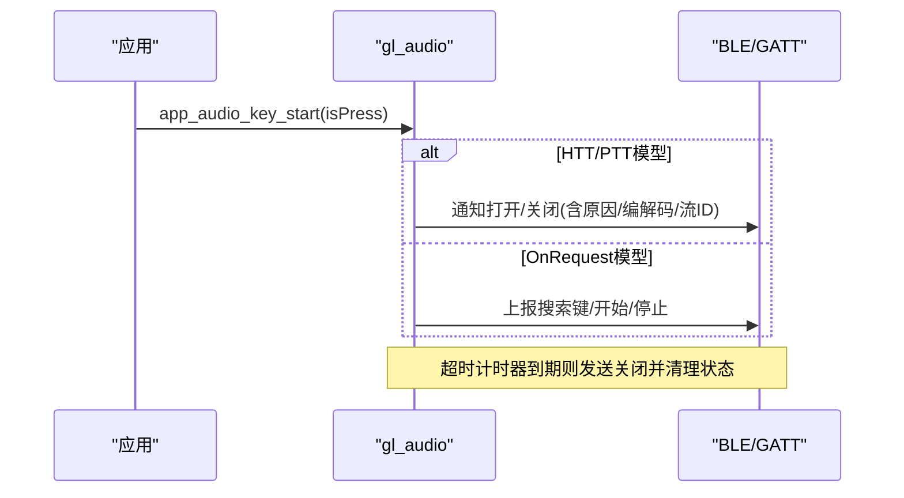
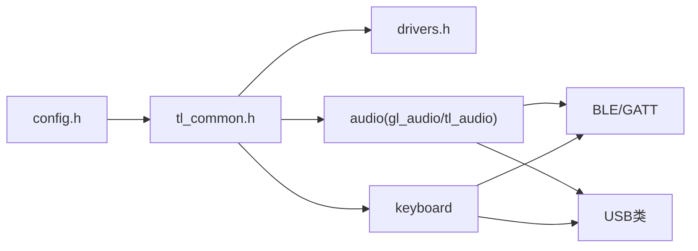

# 应用框架

<cite>
**本文引用的文件**
- [README.md](file://README.md)
- [telink_b85m_triple_mode_audio_mouse_sdk_Release_Note .md](file://telink_b85m_triple_mode_audio_mouse_sdk_Release_Note .md)
- [config.h](file://tc_ble_single_sdk/config.h)
- [tl_common.h](file://tc_ble_single_sdk/tl_common.h)
- [drivers.h](file://tc_ble_single_sdk/drivers.h)
- [user_config.h](file://tc_ble_single_sdk/vendor/common/user_config.h)
- [gl_audio.h](file://tc_ble_single_sdk/application/audio/gl_audio.h)
- [gl_audio.c](file://tc_ble_single_sdk/application/audio/gl_audio.c)
- [tl_audio.h](file://tc_ble_single_sdk/application/audio/tl_audio.h)
- [tl_audio.c](file://tc_ble_single_sdk/application/audio/tl_audio.c)
- [keyboard.h](file://tc_ble_single_sdk/application/keyboard/keyboard.h)
- [keyboard.c](file://tc_ble_single_sdk/application/keyboard/keyboard.c)
</cite>

## 目录
1. [简介](#简介)
2. [项目结构](#项目结构)
3. [核心组件](#核心组件)
4. [架构总览](#架构总览)
5. [详细组件分析](#详细组件分析)
6. [依赖关系分析](#依赖关系分析)
7. [性能考量](#性能考量)
8. [故障排查指南](#故障排查指南)
9. [结论](#结论)
10. [附录](#附录)

## 简介
本文件面向“音频鼠标”应用框架，系统性阐述应用层初始化流程、任务调度机制与模块间通信模式；详细说明用户配置接口、API调用规范与回调机制设计；解释应用层与底层驱动和协议栈的交互接口；并提供应用开发模板与最佳实践，以及调试、日志与错误处理的标准方法。内容基于仓库中的SDK与应用代码进行归纳总结，确保可追溯与可落地。

## 项目结构
该SDK采用分层组织：
- 平台与芯片抽象：通过配置头文件选择目标芯片与MCU核心类型，统一编译开关。
- 驱动层：提供GPIO、定时器、音频ADC/I2S、DMA、USB等外设驱动。
- 协议栈：BLE主机/控制器、HID/GATT服务、2.4G相关协议（按工程宏启用）。
- 应用层：音频采集/编码/传输、键盘/鼠标输入、USB CDC/HID/Audio类设备、打印调试等。
- 配置入口：用户配置通过条件编译选择具体工程配置头，再汇聚到公共入口头。

图表来源
- [config.h:31-55](file://tc_ble_single_sdk/config.h#L31-L55)
- [tl_common.h:27-52](file://tc_ble_single_sdk/tl_common.h#L27-L52)
- [drivers.h:26-30](file://tc_ble_single_sdk/drivers.h#L26-L30)
- [user_config.h:27-61](file://tc_ble_single_sdk/vendor/common/user_config.h#L27-L61)

章节来源
- [config.h:31-55](file://tc_ble_single_sdk/config.h#L31-L55)
- [tl_common.h:27-52](file://tc_ble_single_sdk/tl_common.h#L27-L52)
- [drivers.h:26-30](file://tc_ble_single_sdk/drivers.h#L26-L30)
- [user_config.h:27-61](file://tc_ble_single_sdk/vendor/common/user_config.h#L27-L61)

## 核心组件
- 音频子系统
  - 采集与预处理：IIR滤波、降噪、音量控制、采样缓冲管理。
  - 编码与打包：ADPCM/SBC/MSBC（按配置），分包策略与FIFO管理。
  - 传输适配：BLE GATT通知上报、USB HID/CDC/Audio类上报。
- 输入子系统
  - 按键扫描与映射：矩阵扫描、防抖、长按、重复键、深睡眠唤醒键。
  - 事件封装：标准化键值与修饰键组合，供上层统一上报。
- 配置与初始化
  - 芯片/MCU类型选择、工程配置路由、公共头聚合。
- 调试与日志
  - 统一打印接口、断言与静态断言、运行时检查。

章节来源
- [tl_audio.h:32-127](file://tc_ble_single_sdk/application/audio/tl_audio.h#L32-L127)
- [tl_audio.c:34-200](file://tc_ble_single_sdk/application/audio/tl_audio.c#L34-L200)
- [gl_audio.h:29-151](file://tc_ble_single_sdk/application/audio/gl_audio.h#L29-L151)
- [gl_audio.c:30-200](file://tc_ble_single_sdk/application/audio/gl_audio.c#L30-L200)
- [keyboard.h:28-113](file://tc_ble_single_sdk/application/keyboard/keyboard.h#L28-L113)
- [keyboard.c:30-200](file://tc_ble_single_sdk/application/keyboard/keyboard.c#L30-L200)

## 架构总览
应用层以“音频+输入”双主线驱动，依托BLE/USB/2.4G协议栈完成数据上行；底层驱动负责硬件资源访问；配置层决定编译期能力与行为。

图表来源
- [gl_audio.c:30-200](file://tc_ble_single_sdk/application/audio/gl_audio.c#L30-L200)
- [tl_audio.c:34-200](file://tc_ble_single_sdk/application/audio/tl_audio.c#L34-L200)
- [keyboard.c:30-200](file://tc_ble_single_sdk/application/keyboard/keyboard.c#L30-L200)

## 详细组件分析

### 音频子系统（采集-处理-传输）
- 采集与预处理
  - 支持IIR滤波器与噪声抑制，提供音量调节与外部OOB处理接口。
  - 缓冲区与分包策略由配置宏控制，避免溢出与丢帧。
- 编码与打包
  - 根据配置选择ADPCM/SBC/MSBC等编码；按固定长度或动态分片打包。
- 传输适配
  - BLE：通过GATT特征值通知上报音频数据与控制命令（如打开/关闭、超时处理）。
  - USB：通过HID/CDC/Audio类上报，兼容PC端播放与测试。

图表来源
- [tl_audio.h:32-127](file://tc_ble_single_sdk/application/audio/tl_audio.h#L32-L127)
- [tl_audio.c:34-200](file://tc_ble_single_sdk/application/audio/tl_audio.c#L34-L200)
- [gl_audio.c:30-200](file://tc_ble_single_sdk/application/audio/gl_audio.c#L30-L200)

章节来源
- [tl_audio.h:32-127](file://tc_ble_single_sdk/application/audio/tl_audio.h#L32-L127)
- [tl_audio.c:34-200](file://tc_ble_single_sdk/application/audio/tl_audio.c#L34-L200)
- [gl_audio.h:29-151](file://tc_ble_single_sdk/application/audio/gl_audio.h#L29-L151)
- [gl_audio.c:30-200](file://tc_ble_single_sdk/application/audio/gl_audio.c#L30-L200)

### 输入子系统（键盘/鼠标事件）
- 扫描与去抖：矩阵扫描、引脚状态检测、长按与重复键处理。
- 事件封装：将物理按键映射为标准键值，合并修饰键，生成统一事件结构。
- 上报路径：BLE HID报告或USB HID报告，保证低延迟与稳定性。

图表来源
- [keyboard.h:28-113](file://tc_ble_single_sdk/application/keyboard/keyboard.h#L28-L113)
- [keyboard.c:30-200](file://tc_ble_single_sdk/application/keyboard/keyboard.c#L30-L200)

章节来源
- [keyboard.h:28-113](file://tc_ble_single_sdk/application/keyboard/keyboard.h#L28-L113)
- [keyboard.c:30-200](file://tc_ble_single_sdk/application/keyboard/keyboard.c#L30-L200)

### 配置与初始化
- 芯片与MCU核心类型选择：通过配置头定义编译期目标，影响后续驱动与协议栈分支。
- 工程配置路由：用户配置头根据工程宏包含对应app_config，实现多工程复用。
- 公共头聚合：统一引入常用工具、调试、蓝牙与闪存等公共模块。

图表来源
- [config.h:31-55](file://tc_ble_single_sdk/config.h#L31-L55)
- [tl_common.h:27-52](file://tc_ble_single_sdk/tl_common.h#L27-L52)
- [drivers.h:26-30](file://tc_ble_single_sdk/drivers.h#L26-L30)
- [user_config.h:27-61](file://tc_ble_single_sdk/vendor/common/user_config.h#L27-L61)

章节来源
- [config.h:31-55](file://tc_ble_single_sdk/config.h#L31-L55)
- [tl_common.h:27-52](file://tc_ble_single_sdk/tl_common.h#L27-L52)
- [drivers.h:26-30](file://tc_ble_single_sdk/drivers.h#L26-L30)
- [user_config.h:27-61](file://tc_ble_single_sdk/vendor/common/user_config.h#L27-L61)

### API调用规范与回调机制
- 音频控制API
  - 开启/关闭语音通道：通过特定命令字与状态位控制，支持HTT/PTT/OnRequest多种交互模型。
  - 超时处理：在超过设定时间后自动关闭并上报原因。
- BLE GATT通知
  - 使用统一的句柄与通知函数上报控制与数据，失败时返回错误码。
- 回调与标志位
  - 使用保留区变量维护状态机与标志位，配合定时器实现超时与同步。

图表来源
- [gl_audio.c:30-200](file://tc_ble_single_sdk/application/audio/gl_audio.c#L30-L200)
- [gl_audio.h:29-151](file://tc_ble_single_sdk/application/audio/gl_audio.h#L29-L151)

章节来源
- [gl_audio.c:30-200](file://tc_ble_single_sdk/application/audio/gl_audio.c#L30-L200)
- [gl_audio.h:29-151](file://tc_ble_single_sdk/application/audio/gl_audio.h#L29-L151)

### 应用层与底层驱动/协议栈交互
- 驱动接口
  - 音频：ADC/I2S采样、DMA搬运、IIR滤波、音量控制。
  - 输入：GPIO扫描、中断/轮询、按键映射。
  - 通信：BLE GATT通知、USB HID/CDC/Audio类描述符与端点。
- 协议栈
  - BLE：连接管理、GATT属性、事件回调。
  - USB：枚举、报告描述符、端点收发。
- 交互原则
  - 应用层仅暴露稳定API，屏蔽底层差异；错误通过返回值与状态位反馈；关键路径尽量短且可重入。

章节来源
- [tl_audio.c:34-200](file://tc_ble_single_sdk/application/audio/tl_audio.c#L34-L200)
- [keyboard.c:30-200](file://tc_ble_single_sdk/application/keyboard/keyboard.c#L30-L200)
- [tl_common.h:27-52](file://tc_ble_single_sdk/tl_common.h#L27-L52)

## 依赖关系分析
- 编译期依赖
  - 芯片/MCU类型决定驱动与协议栈分支。
  - 工程配置宏决定启用哪些功能（如BLE/2.4G/USB）。
- 运行期依赖
  - 音频模块依赖驱动层的ADC/I2S/DMA与BLE/USB栈。
  - 输入模块依赖GPIO扫描与上报通道。
- 耦合与内聚
  - 各模块通过明确接口解耦；状态集中在保留区变量中，便于跨上下文访问。

图表来源
- [config.h:31-55](file://tc_ble_single_sdk/config.h#L31-L55)
- [tl_common.h:27-52](file://tc_ble_single_sdk/tl_common.h#L27-L52)
- [drivers.h:26-30](file://tc_ble_single_sdk/drivers.h#L26-L30)
- [gl_audio.c:30-200](file://tc_ble_single_sdk/application/audio/gl_audio.c#L30-L200)
- [tl_audio.c:34-200](file://tc_ble_single_sdk/application/audio/tl_audio.c#L34-L200)
- [keyboard.c:30-200](file://tc_ble_single_sdk/application/keyboard/keyboard.c#L30-L200)

章节来源
- [config.h:31-55](file://tc_ble_single_sdk/config.h#L31-L55)
- [tl_common.h:27-52](file://tc_ble_single_sdk/tl_common.h#L27-L52)
- [drivers.h:26-30](file://tc_ble_single_sdk/drivers.h#L26-L30)
- [gl_audio.c:30-200](file://tc_ble_single_sdk/application/audio/gl_audio.c#L30-L200)
- [tl_audio.c:34-200](file://tc_ble_single_sdk/application/audio/tl_audio.c#L34-L200)
- [keyboard.c:30-200](file://tc_ble_single_sdk/application/keyboard/keyboard.c#L30-L200)

## 性能考量
- 音频链路
  - 合理设置分包大小与上报频率，避免阻塞与丢包；在BLE模式下根据连接间隔动态调整UI与上报节奏。
  - 使用IIR滤波与降噪提升音质，但需权衡CPU占用。
- 输入链路
  - 按键扫描与去抖算法应轻量；重复键与长按优化降低功耗与误触发。
- 系统资源
  - 合理使用保留区变量与定时器；避免长耗时操作阻塞主循环。
- 版本与兼容性
  - 不同系统与设备的兼容性已在版本说明中持续修复，升级时关注已知问题与变更。

[本节为通用指导，不直接分析具体文件]

## 故障排查指南
- 常见问题定位
  - 音频无法上报：检查GATT通知句柄与返回值；确认超时计时器是否触发关闭。
  - 按键无响应：检查GPIO扫描使能、映射表与去抖逻辑；验证深睡眠唤醒键状态。
  - 连接不稳定：检查BLE连接间隔、MTU交换与FIFO容量；必要时降低上报频率。
- 日志与调试
  - 使用统一打印接口输出关键路径信息；结合断言与静态断言捕获非法状态。
  - 利用版本发布说明中的修复项对比当前固件行为。

章节来源
- [gl_audio.c:30-200](file://tc_ble_single_sdk/application/audio/gl_audio.c#L30-L200)
- [keyboard.c:30-200](file://tc_ble_single_sdk/application/keyboard/keyboard.c#L30-L200)
- [tl_common.h:27-52](file://tc_ble_single_sdk/tl_common.h#L27-L52)
- [README.md:1-231](file://README.md#L1-L231)
- [telink_b85m_triple_mode_audio_mouse_sdk_Release_Note .md:1-217](file://telink_b85m_triple_mode_audio_mouse_sdk_Release_Note .md#L1-L217)

## 结论
本应用框架以清晰的层次划分与稳定的API设计，支撑音频鼠标的三模（BLE/USB/2.4G）能力。通过模块化音频与输入子系统、完善的配置与调试体系，开发者可快速集成与扩展功能。建议在开发中遵循本文档的接口规范与最佳实践，结合版本说明持续优化稳定性与性能。

[本节为总结性内容，不直接分析具体文件]

## 附录
- 应用开发模板建议
  - 初始化顺序：配置芯片/MCU类型 -> 加载工程配置 -> 初始化驱动 -> 初始化协议栈 -> 初始化应用模块（音频/输入）-> 进入主循环。
  - 任务调度：以定时器或事件驱动方式调度音频采集与上报；按键扫描与事件上报独立于音频路径。
  - 错误处理：所有对外API返回状态码；关键路径记录日志；超时与异常统一收敛处理。
- 最佳实践
  - 音频分包与上报频率根据连接质量动态调整；避免长时间占用总线。
  - 按键映射与功能键组合集中管理，便于多工程复用。
  - 使用保留区变量保存跨上下文状态，减少锁竞争。
  - 充分利用版本说明中的修复项与已知问题，提前规避风险。

[本节为通用指导，不直接分析具体文件]