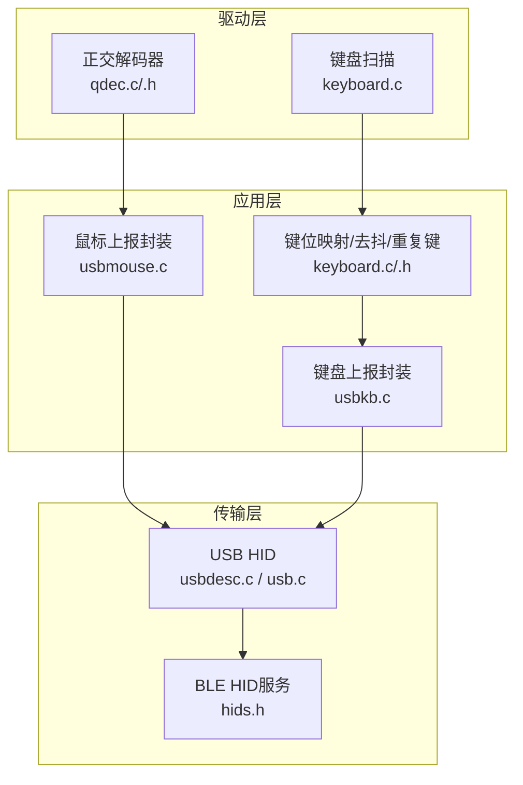
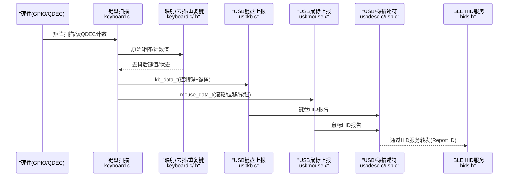
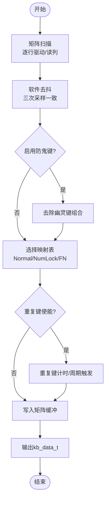
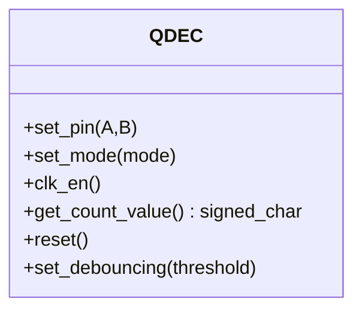
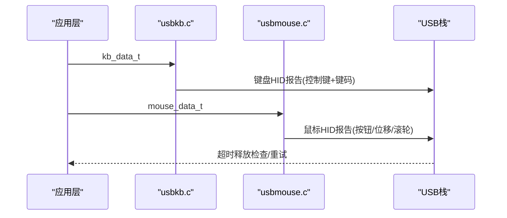
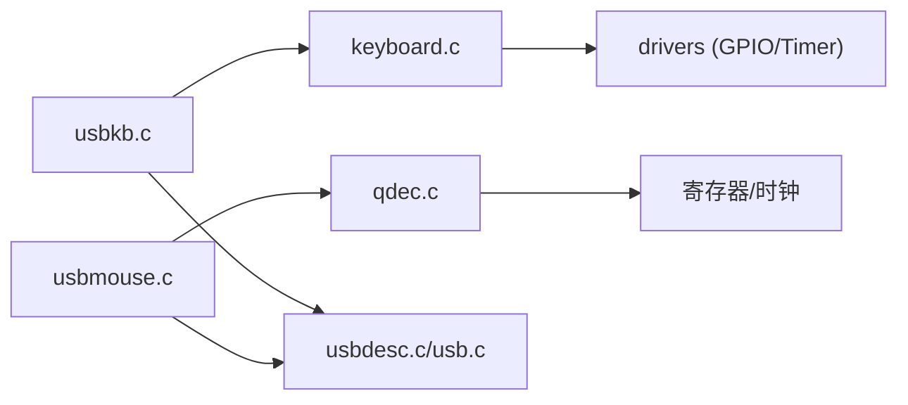

# 输入设备管理

<cite>
**本文引用的文件**
- [keyboard.c](file://tc_ble_single_sdk/application/keyboard/keyboard.c)
- [keyboard.h](file://tc_ble_single_sdk/application/keyboard/keyboard.h)
- [qdec.c](file://tc_ble_single_sdk/drivers/B85/qdec.c)
- [qdec.h](file://tc_ble_single_sdk/drivers/B85/qdec.h)
- [usbkb.c](file://tc_ble_single_sdk/application/app/usbkb.c)
- [usbmouse.c](file://tc_ble_single_sdk/application/app/usbmouse.c)
- [usbdesc.c](file://tc_ble_single_sdk/application/usbstd/usbdesc.c)
- [usb.c](file://tc_ble_single_sdk/application/usbstd/usb.c)
- [hids.h](file://tc_ble_single_sdk/stack/ble/service/hids.h)
</cite>

## 目录
1. [简介](#简介)
2. [项目结构](#项目结构)
3. [核心组件](#核心组件)
4. [架构总览](#架构总览)
5. [详细组件分析](#详细组件分析)
6. [依赖关系分析](#依赖关系分析)
7. [性能考量](#性能考量)
8. [故障排查指南](#故障排查指南)
9. [结论](#结论)
10. [附录：配置与自定义开发指南](#附录：配置与自定义开发指南)

## 简介
本模块文档围绕三模音频鼠标SDK中的“输入设备管理”展开，重点覆盖：
- 键盘扫描与按键事件处理（含去抖动、多键支持、宏/重复键）
- 滚轮编码器（正交解码器QDEC）驱动与计数读取
- USB HID上报（键盘、鼠标、媒体/系统扩展键）
- 与BLE HID的协同（报告ID与协议模式）
- 输入优先级与冲突解决思路（基于现有缓冲与超时释放机制）
- 配置项与扩展点（映射表、重复键、防鬼键等）

## 项目结构
输入子系统由“底层驱动 + 应用层输入抽象 + 传输层HID上报”三层构成：
- 驱动层：GPIO矩阵扫描、QDEC硬件编码器
- 应用层：键盘扫描、去抖、映射、缓冲、重复键；鼠标数据打包
- 传输层：USB HID（键盘/鼠标/媒体/系统），BLE HID（通过HID服务）

图表来源
- [keyboard.c:224-486](file://tc_ble_single_sdk/application/keyboard/keyboard.c#L224-L486)
- [qdec.c:32-98](file://tc_ble_single_sdk/drivers/B85/qdec.c#L32-L98)
- [usbkb.c:134-337](file://tc_ble_single_sdk/application/app/usbkb.c#L134-L337)
- [usbmouse.c:44-150](file://tc_ble_single_sdk/application/app/usbmouse.c#L44-L150)
- [usbdesc.c:181-205](file://tc_ble_single_sdk/application/usbstd/usbdesc.c#L181-L205)
- [hids.h:27-84](file://tc_ble_single_sdk/stack/ble/service/hids.h#L27-L84)

章节来源
- [keyboard.c:224-486](file://tc_ble_single_sdk/application/keyboard/keyboard.c#L224-L486)
- [qdec.c:32-98](file://tc_ble_single_sdk/drivers/B85/qdec.c#L32-L98)
- [usbkb.c:134-337](file://tc_ble_single_sdk/application/app/usbkb.c#L134-L337)
- [usbmouse.c:44-150](file://tc_ble_single_sdk/application/app/usbmouse.c#L44-L150)
- [usbdesc.c:181-205](file://tc_ble_single_sdk/application/usbstd/usbdesc.c#L181-L205)
- [hids.h:27-84](file://tc_ble_single_sdk/stack/ble/service/hids.h#L27-L84)

## 核心组件
- 键盘扫描与事件生成：矩阵扫描、去抖、防鬼键、FN/NumLock切换、重复键、缓冲队列
- 滚轮编码器：QDEC硬件计数、模式选择、硬件去抖阈值
- USB HID上报：键盘/鼠标/媒体/系统键分离与上报、FIFO缓冲、超时释放
- BLE HID：报告ID定义、协议模式（Boot/Report）

章节来源
- [keyboard.c:224-486](file://tc_ble_single_sdk/application/keyboard/keyboard.c#L224-L486)
- [qdec.c:32-98](file://tc_ble_single_sdk/drivers/B85/qdec.c#L32-L98)
- [usbkb.c:134-337](file://tc_ble_single_sdk/application/app/usbkb.c#L134-L337)
- [usbmouse.c:44-150](file://tc_ble_single_sdk/application/app/usbmouse.c#L44-L150)
- [hids.h:27-84](file://tc_ble_single_sdk/stack/ble/service/hids.h#L27-L84)

## 架构总览
输入事件从物理层到主机端的典型流程如下：

图表来源
- [keyboard.c:224-486](file://tc_ble_single_sdk/application/keyboard/keyboard.c#L224-L486)
- [qdec.c:69-98](file://tc_ble_single_sdk/drivers/B85/qdec.c#L69-L98)
- [usbkb.c:306-337](file://tc_ble_single_sdk/application/app/usbkb.c#L306-L337)
- [usbmouse.c:70-150](file://tc_ble_single_sdk/application/app/usbmouse.c#L70-L150)
- [usbdesc.c:181-205](file://tc_ble_single_sdk/application/usbstd/usbdesc.c#L181-L205)
- [hids.h:27-84](file://tc_ble_single_sdk/stack/ble/service/hids.h#L27-L84)

## 详细组件分析

### 键盘输入处理（扫描、去抖、多键、宏/重复键）
- 矩阵扫描
  - 行驱动输出、列读取，支持SPI Flash复用引脚切换
  - 支持行/列有效电平配置、延迟控制
- 去抖与防鬼键
  - 软件去抖：比较当前/上次/上上次矩阵，稳定才视为变化
  - 可选防鬼键：检测多行交叉组合，消除幽灵键
- 键位映射
  - 支持Normal/NumLock/FN三种映射表，按NumLock和FN状态动态切换
  - 支持Ctrl类键特殊处理（缩放等）
- 重复键与长按优化
  - 可配置的重复键列表与间隔，长按时周期性触发
  - 长按省电优化：矩阵不变计数用于功耗策略
- 缓冲与上报
  - 内部矩阵缓冲环形队列，避免丢帧
  - 输出kb_data_t（控制键+最多6个键码）

图表来源
- [keyboard.c:224-486](file://tc_ble_single_sdk/application/keyboard/keyboard.c#L224-L486)

章节来源
- [keyboard.c:224-486](file://tc_ble_single_sdk/application/keyboard/keyboard.c#L224-L486)
- [keyboard.h:28-113](file://tc_ble_single_sdk/application/keyboard/keyboard.h#L28-L113)

### 滚轮编码器处理（QDEC）
- 通道配置：A/B相输入引脚选择
- 模式选择：普通模式（双边沿计数）与双倍精度模式（每边沿计数，一圈计2）
- 时钟使能与复位：RC32K校准、模块时钟使能、计数器复位
- 计数读取：先写重载标志再读寄存器，保证读到最新计数
- 硬件去抖：设置阈值过滤窄脉冲抖动

图表来源
- [qdec.h:31-135](file://tc_ble_single_sdk/drivers/B85/qdec.h#L31-L135)
- [qdec.c:32-98](file://tc_ble_single_sdk/drivers/B85/qdec.c#L32-L98)

章节来源
- [qdec.c:32-98](file://tc_ble_single_sdk/drivers/B85/qdec.c#L32-L98)
- [qdec.h:31-135](file://tc_ble_single_sdk/drivers/B85/qdec.h#L31-L135)

### 按键扫描实现细节
- 行扫描函数：对每行置高/拉低，读取列状态，记录按下位图
- 全局扫描：一次性将所有驱动行置高，读取所有列，简化时序
- 防误触：释放计数窗口，确保松开稳定
- 中断保护：扫描期间关闭中断，避免竞态

章节来源
- [keyboard.c:313-394](file://tc_ble_single_sdk/application/keyboard/keyboard.c#L313-L394)

### 输入事件去抖动处理
- 软件去抖：使用最近两次采样进行一致性判断，降低抖动误报
- 硬件去抖：QDEC支持微秒级阈值过滤，屏蔽短脉冲
- 长按优化：矩阵无变化计数可用于低功耗策略

章节来源
- [keyboard.c:224-262](file://tc_ble_single_sdk/application/keyboard/keyboard.c#L224-L262)
- [qdec.c:88-98](file://tc_ble_single_sdk/drivers/B85/qdec.c#L88-L98)

### 多键支持与宏命令功能
- 多键支持：kb_data_t最多携带6个键码，配合控制键字节实现组合键
- 宏/重复键：可配置重复键列表，长按时周期性触发，模拟“宏”效果
- 媒体/系统扩展键：通过USB HID的媒体/系统报告ID发送

章节来源
- [keyboard.h:56-66](file://tc_ble_single_sdk/application/keyboard/keyboard.h#L56-L66)
- [keyboard.c:420-486](file://tc_ble_single_sdk/application/keyboard/keyboard.c#L420-L486)
- [usbkb.c:225-276](file://tc_ble_single_sdk/application/app/usbkb.c#L225-L276)

### 输入设备与三模连接的协调机制（优先级与冲突）
- USB端
  - 键盘与鼠标各自独立Endpoint，通过FIFO缓冲上报
  - 未释放键的超时释放：若长时间未收到释放，强制发送空报告，避免卡键
- BLE端
  - HID服务定义不同Report ID区分键盘、鼠标、媒体等
  - 协议模式支持Boot/Report，便于兼容不同主机
- 优先级与冲突
  - 代码中未见显式跨模仲裁逻辑，建议在上层根据连接状态与带宽限制做调度
  - 可通过USB FIFO溢出策略（丢弃旧数据）与BLE Report节流保障实时性

章节来源
- [usbkb.c:72-132](file://tc_ble_single_sdk/application/app/usbkb.c#L72-L132)
- [usbmouse.c:59-97](file://tc_ble_single_sdk/application/app/usbmouse.c#L59-L97)
- [usbdesc.c:181-205](file://tc_ble_single_sdk/application/usbstd/usbdesc.c#L181-L205)
- [hids.h:27-84](file://tc_ble_single_sdk/stack/ble/service/hids.h#L27-L84)

### 输入上报流程（USB）

图表来源
- [usbkb.c:306-337](file://tc_ble_single_sdk/application/app/usbkb.c#L306-L337)
- [usbmouse.c:70-150](file://tc_ble_single_sdk/application/app/usbmouse.c#L70-L150)

章节来源
- [usbkb.c:306-337](file://tc_ble_single_sdk/application/app/usbkb.c#L306-L337)
- [usbmouse.c:70-150](file://tc_ble_single_sdk/application/app/usbmouse.c#L70-L150)

## 依赖关系分析
- keyboard.c依赖：drivers GPIO、定时器、USB keycode定义
- qdec.c依赖：时钟、寄存器、电源管理
- usbkb.c/usbmouse.c依赖：USB栈、HID描述符、时间戳
- 上层通过统一接口将输入事件分发至USB/BLE

图表来源
- [keyboard.c:24-31](file://tc_ble_single_sdk/application/keyboard/keyboard.c#L24-L31)
- [qdec.c:24-35](file://tc_ble_single_sdk/drivers/B85/qdec.c#L24-L35)
- [usbkb.c:24-31](file://tc_ble_single_sdk/application/app/usbkb.c#L24-L31)
- [usbmouse.c:24-29](file://tc_ble_single_sdk/application/app/usbmouse.c#L24-L29)

章节来源
- [keyboard.c:24-31](file://tc_ble_single_sdk/application/keyboard/keyboard.c#L24-L31)
- [qdec.c:24-35](file://tc_ble_single_sdk/drivers/B85/qdec.c#L24-L35)
- [usbkb.c:24-31](file://tc_ble_single_sdk/application/app/usbkb.c#L24-L31)
- [usbmouse.c:24-29](file://tc_ble_single_sdk/application/app/usbmouse.c#L24-L29)

## 性能考量
- 去抖策略：软件去抖减少误触发，QDEC硬件去抖提升抗噪能力
- 缓冲设计：矩阵缓冲与USB FIFO避免丢包，必要时覆盖旧数据
- 重复键：合理设置间隔，避免过度上报占用带宽
- 超时释放：防止卡键导致主机状态异常
- 平滑滚动：鼠标上报支持平滑模式，降低高频抖动

[本节为通用指导，不直接分析具体文件]

## 故障排查指南
- 按键抖动或误触发
  - 检查软件去抖参数与QDEC硬件去抖阈值
  - 确认矩阵扫描时序与GPIO配置
- 多键冲突/幽灵键
  - 启用防鬼键逻辑，检查映射表是否合理
- 上报卡顿/丢失
  - 检查USB FIFO是否溢出，调整上报频率
  - 确认超时释放逻辑是否生效
- 滚轮计数异常
  - 校验QDEC模式与引脚配置，确认计数读取时机

章节来源
- [keyboard.c:224-262](file://tc_ble_single_sdk/application/keyboard/keyboard.c#L224-L262)
- [qdec.c:88-98](file://tc_ble_single_sdk/drivers/B85/qdec.c#L88-L98)
- [usbkb.c:127-132](file://tc_ble_single_sdk/application/app/usbkb.c#L127-L132)
- [usbmouse.c:59-97](file://tc_ble_single_sdk/application/app/usbmouse.c#L59-L97)

## 结论
该输入设备管理模块以“驱动-应用-传输”分层清晰实现：
- 键盘扫描具备完善的去抖、防鬼键、多键与重复键能力
- QDEC提供高精度滚轮计数与硬件去抖
- USB HID上报采用FIFO与超时释放保障稳定性
- BLE HID通过标准报告ID与协议模式兼容主流主机
建议在更高层增加跨模仲裁与带宽管理，以进一步优化三模并发体验。

[本节为总结，不直接分析具体文件]

## 附录：配置与自定义开发指南
- 键位映射
  - 修改Normal/NumLock/FN映射表，支持自定义键位布局
  - 参考路径：[keyboard.c:103-186](file://tc_ble_single_sdk/application/keyboard/keyboard.c#L103-L186)
- 重复键与长按
  - 启用重复键并配置列表与间隔，实现简单宏效果
  - 参考路径：[keyboard.c:81-99](file://tc_ble_single_sdk/application/keyboard/keyboard.c#L81-L99)、[keyboard.c:420-486](file://tc_ble_single_sdk/application/keyboard/keyboard.c#L420-L486)
- 防鬼键
  - 启用防鬼键逻辑，避免复杂组合键误判
  - 参考路径：[keyboard.c:202-218](file://tc_ble_single_sdk/application/keyboard/keyboard.c#L202-L218)
- QDEC配置
  - 设置A/B引脚、模式、去抖阈值，适配不同编码器
  - 参考路径：[qdec.c:32-98](file://tc_ble_single_sdk/drivers/B85/qdec.c#L32-L98)、[qdec.h:31-135](file://tc_ble_single_sdk/drivers/B85/qdec.h#L31-L135)
- USB HID扩展
  - 媒体/系统键映射与上报，支持消费者控制
  - 参考路径：[usbkb.c:39-62](file://tc_ble_single_sdk/application/app/usbkb.c#L39-L62)、[usbkb.c:225-276](file://tc_ble_single_sdk/application/app/usbkb.c#L225-L276)
- BLE HID集成
  - 使用标准Report ID与协议模式，确保兼容性
  - 参考路径：[hids.h:27-84](file://tc_ble_single_sdk/stack/ble/service/hids.h#L27-L84)

章节来源
- [keyboard.c:81-99](file://tc_ble_single_sdk/application/keyboard/keyboard.c#L81-L99)
- [keyboard.c:103-186](file://tc_ble_single_sdk/application/keyboard/keyboard.c#L103-L186)
- [keyboard.c:202-218](file://tc_ble_single_sdk/application/keyboard/keyboard.c#L202-L218)
- [keyboard.c:420-486](file://tc_ble_single_sdk/application/keyboard/keyboard.c#L420-L486)
- [qdec.c:32-98](file://tc_ble_single_sdk/drivers/B85/qdec.c#L32-L98)
- [qdec.h:31-135](file://tc_ble_single_sdk/drivers/B85/qdec.h#L31-L135)
- [usbkb.c:39-62](file://tc_ble_single_sdk/application/app/usbkb.c#L39-L62)
- [usbkb.c:225-276](file://tc_ble_single_sdk/application/app/usbkb.c#L225-L276)
- [hids.h:27-84](file://tc_ble_single_sdk/stack/ble/service/hids.h#L27-L84)