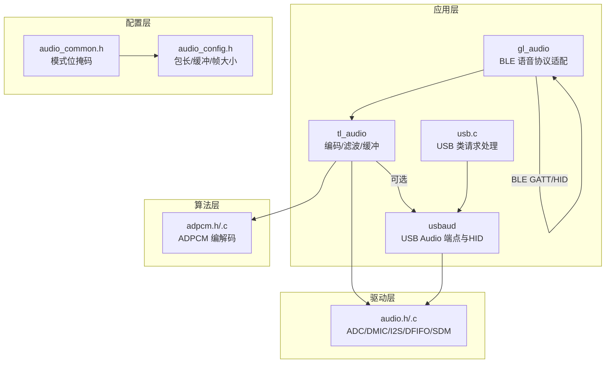
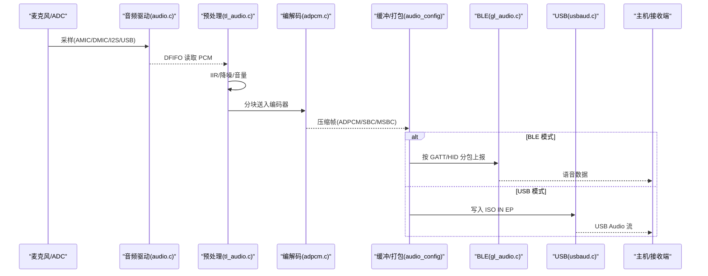
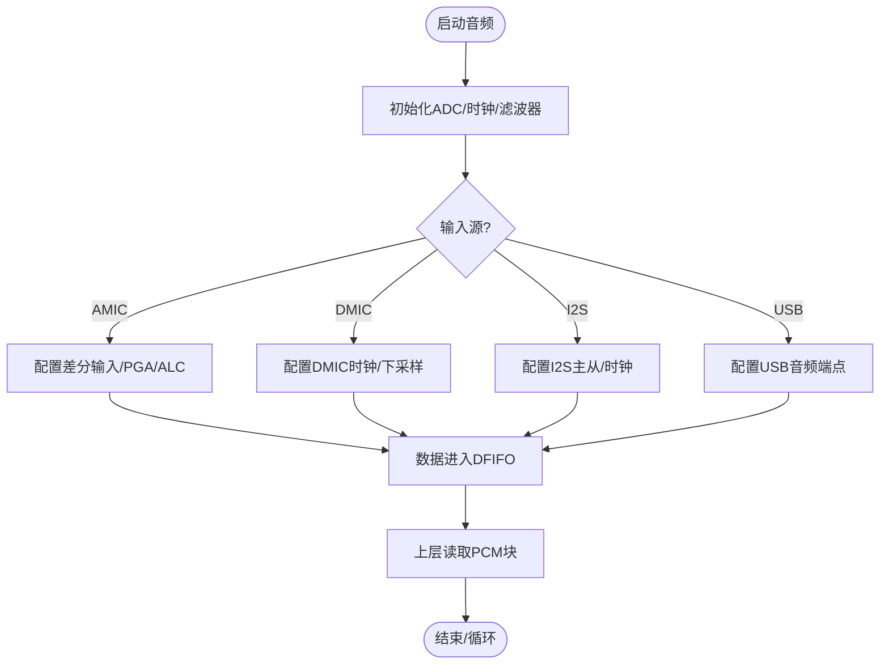
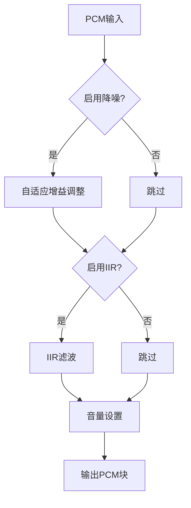
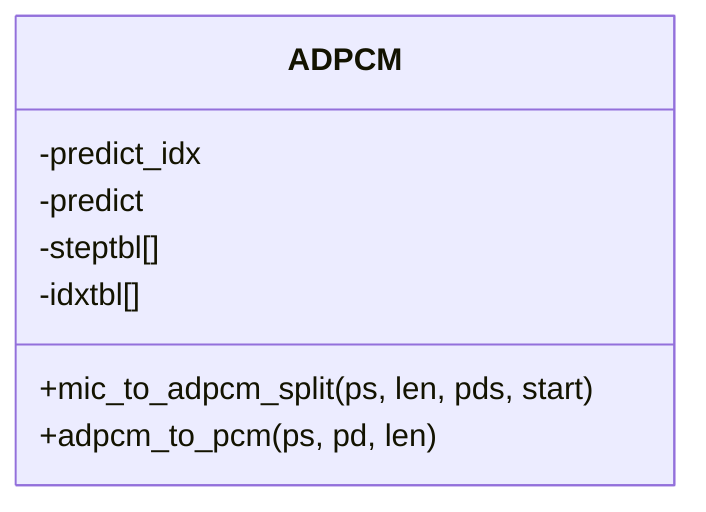
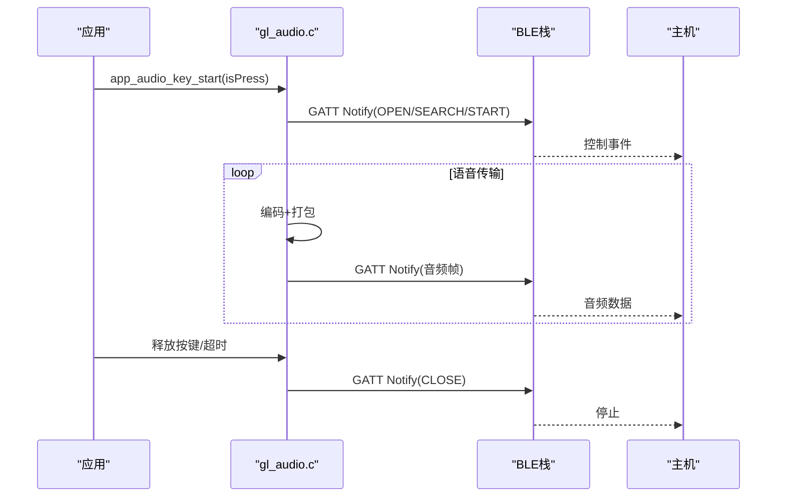
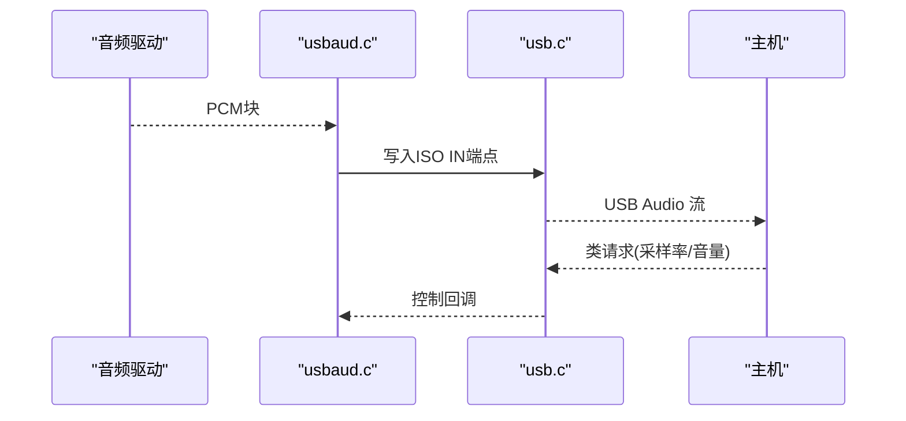
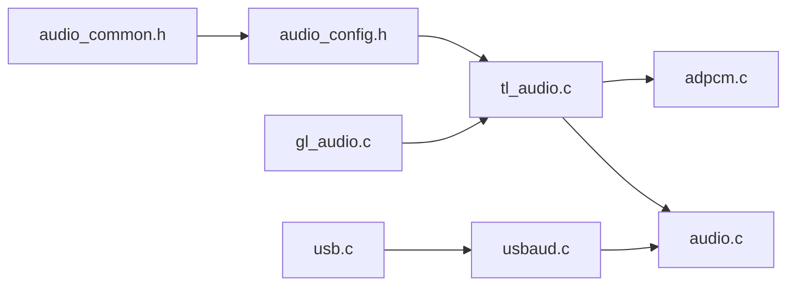

# 音频处理系统

<cite>
**本文引用的文件**
- [gl_audio.h](file://tc_ble_single_sdk/application/audio/gl_audio.h)
- [gl_audio.c](file://tc_ble_single_sdk/application/audio/gl_audio.c)
- [tl_audio.h](file://tc_ble_single_sdk/application/audio/tl_audio.h)
- [tl_audio.c](file://tc_ble_single_sdk/application/audio/tl_audio.c)
- [adpcm.h](file://tc_ble_single_sdk/application/audio/adpcm.h)
- [adpcm.c](file://tc_ble_single_sdk/application/audio/adpcm.c)
- [audio_config.h](file://tc_ble_single_sdk/application/audio/audio_config.h)
- [audio_common.h](file://tc_ble_single_sdk/application/audio/audio_common.h)
- [audio.h](file://tc_ble_single_sdk/drivers/B85/audio.h)
- [audio.c](file://tc_ble_single_sdk/drivers/B85/audio.c)
- [usbaud.h](file://tc_ble_single_sdk/application/app/usbaud.h)
- [usbaud.c](file://tc_ble_single_sdk/application/app/usbaud.c)
- [usb.c](file://tc_ble_single_sdk/application/usbstd/usb.c)
- [SDK_Wiki.md](file://doc/SDK_Wiki.md)
</cite>

## 目录
1. [简介](#简介)
2. [项目结构](#项目结构)
3. [核心组件](#核心组件)
4. [架构总览](#架构总览)
5. [详细组件分析](#详细组件分析)
6. [依赖关系分析](#依赖关系分析)
7. [性能与延迟优化](#性能与延迟优化)
8. [故障排查指南](#故障排查指南)
9. [结论](#结论)
10. [附录：参数配置与调优示例](#附录参数配置与调优示例)

## 简介
本文件系统性地梳理并文档化该三模（BLE、2.4G、USB）音频鼠标 SDK 的音频处理链路，覆盖从采集、预处理、ADPCM/SBC/MSBC 编解码、缓冲管理、采样率转换到多通道传输（BLE GATT/HID、2.4G 自定义帧、USB Audio HID）的完整流程。重点说明音频参数配置、质量控制（降噪、IIR滤波、音量控制）、延迟优化与功耗管理实践，并提供可操作的配置与调优指引。

## 项目结构
- 应用层音频模块
  - 通用音频配置与模式选择：audio_common.h、audio_config.h
  - 编码器与算法接口：adpcm.h/.c、SBC/MSBC（外部库或工程集成）
  - 平台音频抽象与驱动：drivers/B85/audio.h/.c
  - USB 音频实现：application/app/usbaud.h/.c、application/usbstd/usb.c
  - BLE 语音协议适配（Google/Telink）：application/audio/gl_audio.h/.c、tl_audio.h/.c
- 文档与参考
  - doc/SDK_Wiki.md：三模音频特性、版本演进、关键源码索引与配置要点

图表来源
- [gl_audio.h:24-154](file://tc_ble_single_sdk/application/audio/gl_audio.h#L24-L154)
- [tl_audio.h:24-129](file://tc_ble_single_sdk/application/audio/tl_audio.h#L24-L129)
- [adpcm.h:24-47](file://tc_ble_single_sdk/application/audio/adpcm.h#L24-L47)
- [audio_config.h:24-123](file://tc_ble_single_sdk/application/audio/audio_config.h#L24-L123)
- [audio_common.h:24-80](file://tc_ble_single_sdk/application/audio/audio_common.h#L24-L80)
- [audio.h:24-246](file://tc_ble_single_sdk/drivers/B85/audio.h#L24-L246)
- [usbaud.h:24-119](file://tc_ble_single_sdk/application/app/usbaud.h#L24-L119)
- [usb.c:627-680](file://tc_ble_single_sdk/application/usbstd/usb.c#L627-L680)

章节来源
- [SDK_Wiki.md:1-224](file://doc/SDK_Wiki.md#L1-L224)

## 核心组件
- 音频采集与输入路径
  - AMIC/DMIC/I2S/USB 输入，通过 drivers/B85/audio.h/.c 初始化 ADC/时钟/滤波器/下采样，数据经 DFIFO 进入上层。
- 音频预处理与质量控制
  - 可选噪声抑制、IIR 滤波、音量设置；在 tl_audio.h/.c 中提供 API 与实现。
- 编解码
  - ADPCM：adpcm.h/.c 提供 mic_to_adpcm_split 与 adpcm_to_pcm；支持 Google v0.4/v1.0 等格式差异。
  - SBC/MSBC：由 audio_config.h 的模式宏决定帧长与缓冲，具体编解码库在工程中链接。
- 缓冲与打包
  - TL_MIC_BUFFER_SIZE、TL_MIC_ADPCM_UNIT_SIZE、ADPCM_PACKET_LEN 等宏定义统一了不同模式的缓冲与包尺寸。
- 传输通道
  - BLE：gl_audio.c 实现 Google/Telink 语音服务控制面与数据上报；tl_audio.c 负责编码与缓冲。
  - 2.4G：按工程自定义帧（见 Wiki），将编码后的音频帧封装为 MIC_DATA_CMD 类型上报。
  - USB：usbaud.c 实现 USB Audio 类端点收发与 HID 控制；usb.c 处理采样率等类请求。

章节来源
- [audio.h:136-203](file://tc_ble_single_sdk/drivers/B85/audio.h#L136-L203)
- [tl_audio.h:32-129](file://tc_ble_single_sdk/application/audio/tl_audio.h#L32-L129)
- [adpcm.h:27-47](file://tc_ble_single_sdk/application/audio/adpcm.h#L27-L47)
- [audio_config.h:28-123](file://tc_ble_single_sdk/application/audio/audio_config.h#L28-L123)
- [gl_audio.h:24-154](file://tc_ble_single_sdk/application/audio/gl_audio.h#L24-L154)
- [usbaud.h:52-119](file://tc_ble_single_sdk/application/app/usbaud.h#L52-L119)

## 架构总览
下图展示从采集到多通道传输的整体数据流与控制流。

图表来源
- [audio.c:88-203](file://tc_ble_single_sdk/drivers/B85/audio.c#L88-L203)
- [tl_audio.c:52-178](file://tc_ble_single_sdk/application/audio/tl_audio.c#L52-L178)
- [adpcm.c:47-200](file://tc_ble_single_sdk/application/audio/adpcm.c#L47-L200)
- [gl_audio.c:54-181](file://tc_ble_single_sdk/application/audio/gl_audio.c#L54-L181)
- [usbaud.c:311-453](file://tc_ble_single_sdk/application/app/usbaud.c#L311-L453)

## 详细组件分析

### 音频采集与驱动（B85）
- 功能要点
  - 支持 AMIC/DMIC/I2S/USB 输入，配置采样时钟、滤波器、下采样比，输出至 DFIFO。
  - 提供 SDM/I2S 输出能力，便于本地监听或直通。
- 关键接口
  - audio_amic_init / audio_dmic_init / audio_i2s_init / audio_usb_init
  - audio_set_sdm_output / audio_set_i2s_output
  - get_mic_wr_ptr / audio_rx_data_from_sample_buff
- 复杂度与性能
  - 初始化为 O(1)，运行时以 DMA/中断方式搬运数据，CPU 占用低。
  - 下采样与滤波在硬件/专用路径完成，降低 CPU 负载。

图表来源
- [audio.h:136-203](file://tc_ble_single_sdk/drivers/B85/audio.h#L136-L203)
- [audio.c:88-203](file://tc_ble_single_sdk/drivers/B85/audio.c#L88-L203)

章节来源
- [audio.h:24-246](file://tc_ble_single_sdk/drivers/B85/audio.h#L24-L246)
- [audio.c:1-200](file://tc_ble_single_sdk/drivers/B85/audio.c#L1-L200)

### 预处理与质量控制
- 噪声抑制
  - 基于短时/长时能量估计自适应增益，抑制静音段噪声。
- IIR 滤波
  - 内带/外带滤波函数，支持移位缩放，避免溢出。
- 音量控制
  - 根据芯片型号设置 PGA/数字音量寄存器。
- 复杂度
  - 每样本常数时间操作，适合实时处理。

图表来源
- [tl_audio.h:66-113](file://tc_ble_single_sdk/application/audio/tl_audio.h#L66-L113)
- [tl_audio.c:52-178](file://tc_ble_single_sdk/application/audio/tl_audio.c#L52-L178)

章节来源
- [tl_audio.h:32-129](file://tc_ble_single_sdk/application/audio/tl_audio.h#L32-L129)
- [tl_audio.c:1-200](file://tc_ble_single_sdk/application/audio/tl_audio.c#L1-L200)

### ADPCM 编解码
- 功能要点
  - mic_to_adpcm_split：将 PCM 分块编码为 ADPCM，支持不同协议头（Google v0.4/v1.0）。
  - adpcm_to_pcm：解码回 PCM。
- 关键点
  - 预测器状态维护、步长表查找、符号位与量化误差更新。
  - 不同模式下的包长度与单元大小由 audio_config.h 统一配置。

图表来源
- [adpcm.h:27-47](file://tc_ble_single_sdk/application/audio/adpcm.h#L27-L47)
- [adpcm.c:47-200](file://tc_ble_single_sdk/application/audio/adpcm.c#L47-L200)

章节来源
- [adpcm.h:24-47](file://tc_ble_single_sdk/application/audio/adpcm.h#L24-L47)
- [adpcm.c:1-200](file://tc_ble_single_sdk/application/audio/adpcm.c#L1-L200)

### 音频缓冲与打包
- 配置项
  - TL_MIC_BUFFER_SIZE：输入缓冲大小
  - TL_MIC_ADPCM_UNIT_SIZE：单帧编码单元
  - ADPCM_PACKET_LEN：网络包长度
- 策略
  - 根据模式（RCU/Dongle、Google/Telink、HID/GATT）动态确定缓冲与包大小，确保与协议一致。

章节来源
- [audio_config.h:28-123](file://tc_ble_single_sdk/application/audio/audio_config.h#L28-L123)
- [audio_common.h:24-80](file://tc_ble_single_sdk/application/audio/audio_common.h#L24-L80)

### BLE 音频（Google/Telink）
- 控制面
  - 开/关语音、搜索、同步、错误码等命令与响应。
  - 按键模型：HTT/PTT/On-Request 三种交互模型。
- 数据面
  - 使用 GATT 特征值或 HID Report 上报编码后的音频帧。
- 超时与重连
  - 内置超时计时器，超过阈值自动关闭并通知主机。

图表来源
- [gl_audio.c:54-181](file://tc_ble_single_sdk/application/audio/gl_audio.c#L54-L181)
- [gl_audio.h:24-154](file://tc_ble_single_sdk/application/audio/gl_audio.h#L24-L154)

章节来源
- [gl_audio.c:1-200](file://tc_ble_single_sdk/application/audio/gl_audio.c#L1-L200)
- [gl_audio.h:24-154](file://tc_ble_single_sdk/application/audio/gl_audio.h#L24-L154)

### 2.4G 音频传输
- 帧格式
  - 自定义 MIC_DATA_CMD，携带编码后的音频帧（如 MSBC/ADPCM），含索引用于丢包恢复。
- 拼接与转发
  - Dongle 端按索引拼接完整帧后推送至 USB FIFO，供主机消费。
- 优化
  - 独立 FIFO 隔离鼠标数据，避免阻塞导致 Linux 语音异常。

章节来源
- [SDK_Wiki.md:172-183](file://doc/SDK_Wiki.md#L172-L183)

### USB 音频
- 端点与描述符
  - 支持 MIC/SPEAKER，ISO IN/OUT 端点，HID 控制类请求。
- 数据处理
  - audio_tx_data_to_usb：从 DFIFO/USB 读入 PCM 并写入端点。
  - audio_rx_data_from_usb：从端点读取 PCM 并写入 DAC/处理链。
- 类请求
  - 采样率查询/设置等通过 usb.c 处理。

图表来源
- [usbaud.c:311-453](file://tc_ble_single_sdk/application/app/usbaud.c#L311-L453)
- [usb.c:627-680](file://tc_ble_single_sdk/application/usbstd/usb.c#L627-L680)

章节来源
- [usbaud.h:52-119](file://tc_ble_single_sdk/application/app/usbaud.h#L52-L119)
- [usbaud.c:268-453](file://tc_ble_single_sdk/application/app/usbaud.c#L268-L453)
- [usb.c:627-680](file://tc_ble_single_sdk/application/usbstd/usb.c#L627-L680)

## 依赖关系分析
- 编译期依赖
  - audio_common.h 定义模式位掩码（RCU/DONGLE、SBC/MSBC/ADPCM、HID/GATT）。
  - audio_config.h 根据 TL_AUDIO_MODE 展开为具体包长/缓冲/帧大小。
- 运行期依赖
  - gl_audio.c 依赖 BLE 栈进行 GATT 通知。
  - tl_audio.c 依赖 adpcm.c 与驱动层 audio.c。
  - usbaud.c 依赖 USB 控制器与 DFIFO。

图表来源
- [audio_common.h:24-80](file://tc_ble_single_sdk/application/audio/audio_common.h#L24-L80)
- [audio_config.h:28-123](file://tc_ble_single_sdk/application/audio/audio_config.h#L28-L123)
- [tl_audio.c:1-200](file://tc_ble_single_sdk/application/audio/tl_audio.c#L1-L200)
- [adpcm.c:1-200](file://tc_ble_single_sdk/application/audio/adpcm.c#L1-L200)
- [audio.c:1-200](file://tc_ble_single_sdk/drivers/B85/audio.c#L1-L200)
- [gl_audio.c:1-200](file://tc_ble_single_sdk/application/audio/gl_audio.c#L1-L200)
- [usbaud.c:268-453](file://tc_ble_single_sdk/application/app/usbaud.c#L268-L453)
- [usb.c:627-680](file://tc_ble_single_sdk/application/usbstd/usb.c#L627-L680)

章节来源
- [audio_common.h:24-80](file://tc_ble_single_sdk/application/audio/audio_common.h#L24-L80)
- [audio_config.h:28-123](file://tc_ble_single_sdk/application/audio/audio_config.h#L28-L123)

## 性能与延迟优化
- 缓冲与包大小
  - 合理设置 TL_MIC_BUFFER_SIZE 与 ADPCM_PACKET_LEN，减少拷贝与碎片，匹配 BLE MTU 与 USB 端点大小。
- 采样率与下采样
  - 使用驱动层 CIC/下采样矩阵，降低 CPU 负担；根据目标带宽选择 8k/16k/32k。
- 编解码开销
  - ADPCM 轻量且低延迟；SBC/MSBC 音质更好但 CPU 更高，需权衡。
- BLE 传输
  - 使用多包（Multi-packet）与合适的 DLE；控制面事件与数据面分离，避免拥塞。
- USB 传输
  - 使用 ISO IN 端点，批量发送固定长度帧；避免控制端点阻塞。
- 功耗管理
  - 非活动期关闭 ADC/音频模块；按电量限制语音时长（Wiki 中的自适应策略）。

[本节为通用指导，不直接分析具体文件]

## 故障排查指南
- 无声音/断续
  - 检查 DFIFO 是否就绪（reg_dfifo_irq_status），确认采样率与端点长度匹配。
  - 核对 TL_MIC_BUFFER_SIZE 与 ADPCM_PACKET_LEN 是否满足最小帧需求。
- BLE 连接断开或超时
  - 检查 gl_audio.c 超时处理逻辑，确认 GATT Notify 返回状态。
- USB 无法枚举或无声
  - 确认 usb.c 类请求处理（采样率/接口激活）；检查 usbaud.c 端点指针复位与忙标志。
- 噪音大/底噪高
  - 开启噪声抑制与 IIR 滤波；调整 PGA 增益与参考电压。

章节来源
- [gl_audio.c:185-200](file://tc_ble_single_sdk/application/audio/gl_audio.c#L185-L200)
- [usbaud.c:311-453](file://tc_ble_single_sdk/application/app/usbaud.c#L311-L453)
- [usb.c:627-680](file://tc_ble_single_sdk/application/usbstd/usb.c#L627-L680)
- [tl_audio.c:52-178](file://tc_ble_single_sdk/application/audio/tl_audio.c#L52-L178)

## 结论
该 SDK 提供了完整的三模音频处理链路，具备灵活的配置与良好的可扩展性。通过合理的缓冲与包大小配置、适当的编解码选择、以及 BLE/USB/2.4G 的传输优化，可在保证音质的同时实现低延迟与低功耗。结合 Wiki 中的电量自适应策略与工程最佳实践，可进一步提升用户体验与稳定性。

[本节为总结，不直接分析具体文件]

## 附录：参数配置与调优示例
- 选择音频模式
  - 在 audio_common.h 中选择 RCU/DONGLE 与编码模式（ADPCM/SBC/MSBC）及通道（HID/GATT）。
- 配置包与缓冲
  - 在 audio_config.h 中根据所选模式设置 ADPCM_PACKET_LEN、TL_MIC_ADPCM_UNIT_SIZE、TL_MIC_BUFFER_SIZE。
- 启用预处理
  - 在 tl_audio.h 中启用 TL_NOISE_SUPPRESSION_ENABLE、IIR_FILTER_ENABLE，并配置 TL_MIC_PACKET_BUFFER_NUM。
- BLE 优化
  - 使用 Google v1.0 纯音频数据格式以减少头部开销；合理设置 DLE 与多包。
- USB 优化
  - 使用 ISO IN 端点，固定长度帧；确保采样率与描述符一致。
- 功耗与时长
  - 依据 Wiki 的电量区间设置单次开语音最长时长，避免长时间占用射频与 CPU。

章节来源
- [audio_common.h:24-80](file://tc_ble_single_sdk/application/audio/audio_common.h#L24-L80)
- [audio_config.h:28-123](file://tc_ble_single_sdk/application/audio/audio_config.h#L28-L123)
- [tl_audio.h:32-129](file://tc_ble_single_sdk/application/audio/tl_audio.h#L32-L129)
- [SDK_Wiki.md:184-190](file://doc/SDK_Wiki.md#L184-L190)