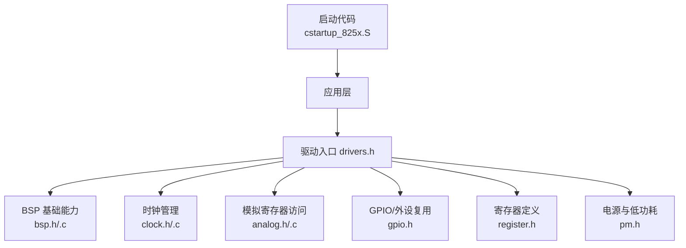
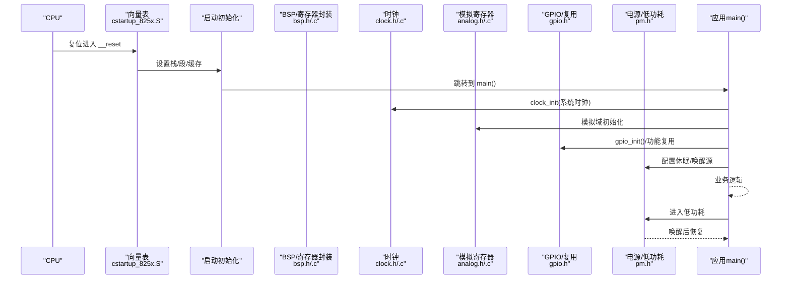
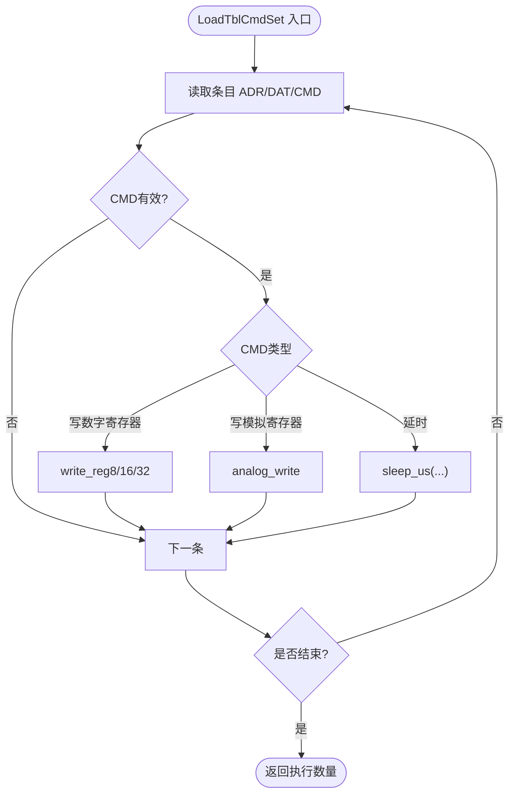
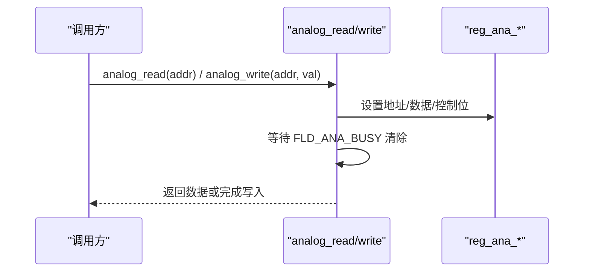
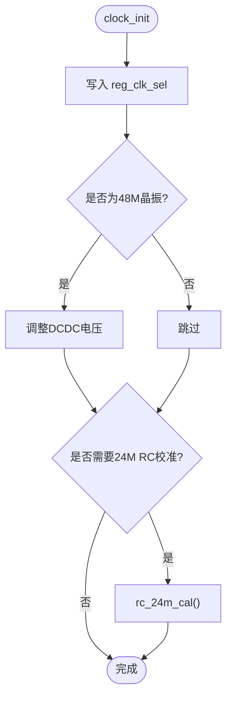
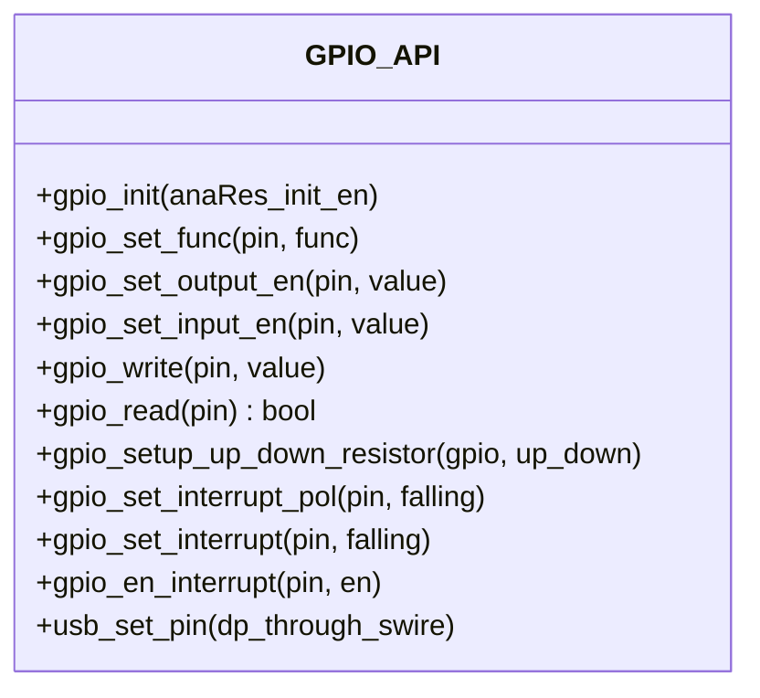
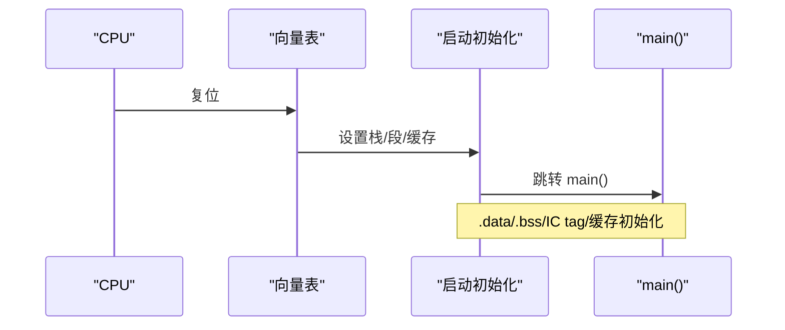
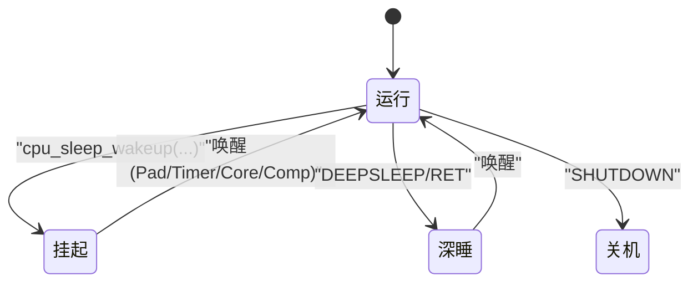
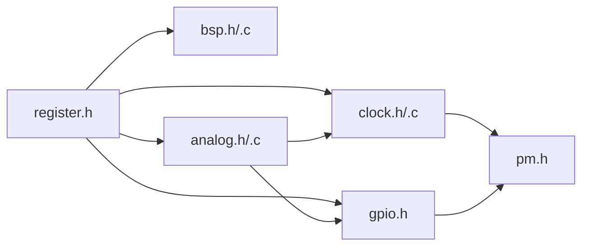

# 硬件抽象层设计

<cite>
**本文引用的文件**
- [bsp.h](file://tc_ble_single_sdk/drivers/B85/bsp.h)
- [bsp.c](file://tc_ble_single_sdk/drivers/B85/bsp.c)
- [clock.h](file://tc_ble_single_sdk/drivers/B85/clock.h)
- [clock.c](file://tc_ble_single_sdk/drivers/B85/clock.c)
- [analog.h](file://tc_ble_single_sdk/drivers/B85/analog.h)
- [analog.c](file://tc_ble_single_sdk/drivers/B85/analog.c)
- [gpio.h](file://tc_ble_single_sdk/drivers/B85/gpio.h)
- [register.h](file://tc_ble_single_sdk/drivers/B85/register.h)
- [cstartup_825x.S](file://tc_ble_single_sdk/boot/B85/cstartup_825x.S)
- [pm.h](file://tc_ble_single_sdk/drivers/B85/lib/include/pm.h)
- [drivers.h](file://tc_ble_single_sdk/drivers.h)
</cite>

## 目录
1. [简介](#简介)
2. [项目结构](#项目结构)
3. [核心组件](#核心组件)
4. [架构总览](#架构总览)
5. [详细组件分析](#详细组件分析)
6. [依赖关系分析](#依赖关系分析)
7. [性能考量](#性能考量)
8. [故障排查指南](#故障排查指南)
9. [结论](#结论)
10. [附录：使用示例与最佳实践](#附录使用示例与最佳实践)

## 简介
本文件面向Telink B85系列芯片的硬件抽象层（HAL）设计，系统性阐述以下主题：
- 寄存器操作封装、时钟系统管理、模拟前端控制、电源管理与低功耗模式
- BSP（板级支持包）实现原理：芯片初始化、内存映射、中断向量表配置
- HAL如何提供跨平台接口以统一不同芯片系列的开发
- 硬件特性检测、兼容性处理与调试支持
- 低功耗模式下的硬件状态管理与唤醒机制
- 结合仓库源码给出可落地的使用方法指引（以代码片段路径形式引用）

## 项目结构
该SDK采用“按芯片系列+驱动分层”的组织方式。B85相关驱动位于 drivers/B85，启动代码位于 boot/B85，电源管理在 drivers/B85/lib/include/pm.h。顶层 drivers.h 聚合驱动入口，便于上层应用统一包含。

图表来源
- [drivers.h:24-31](file://tc_ble_single_sdk/drivers.h#L24-L31)
- [bsp.h:24-172](file://tc_ble_single_sdk/drivers/B85/bsp.h#L24-L172)
- [clock.h:24-168](file://tc_ble_single_sdk/drivers/B85/clock.h#L24-L168)
- [analog.h:24-66](file://tc_ble_single_sdk/drivers/B85/analog.h#L24-L66)
- [gpio.h:24-561](file://tc_ble_single_sdk/drivers/B85/gpio.h#L24-L561)
- [register.h:24-800](file://tc_ble_single_sdk/drivers/B85/register.h#L24-L800)
- [pm.h:24-518](file://tc_ble_single_sdk/drivers/B85/lib/include/pm.h#L24-L518)
- [cstartup_825x.S:71-100](file://tc_ble_single_sdk/boot/B85/cstartup_825x.S#L71-L100)

章节来源
- [drivers.h:24-31](file://tc_ble_single_sdk/drivers.h#L24-L31)

## 核心组件
- 寄存器与位操作封装：提供统一的读写宏与掩码工具，屏蔽底层地址差异
- 模拟寄存器访问：通过专用总线完成对模拟域的读写与批量操作
- 时钟系统：系统主频选择、RC校准、32K源切换与稳定性保障
- GPIO与复用：引脚功能选择、输入输出使能、中断与唤醒配置
- 启动与异常：向量表、栈设置、数据段初始化、跳转至main
- 电源与低功耗：多种休眠模式、唤醒源、早期唤醒与恢复策略

章节来源
- [bsp.h:24-172](file://tc_ble_single_sdk/drivers/B85/bsp.h#L24-L172)
- [analog.h:24-66](file://tc_ble_single_sdk/drivers/B85/analog.h#L24-L66)
- [clock.h:24-168](file://tc_ble_single_sdk/drivers/B85/clock.h#L24-L168)
- [gpio.h:24-561](file://tc_ble_single_sdk/drivers/B85/gpio.h#L24-L561)
- [cstartup_825x.S:71-100](file://tc_ble_single_sdk/boot/B85/cstartup_825x.S#L71-L100)
- [pm.h:94-518](file://tc_ble_single_sdk/drivers/B85/lib/include/pm.h#L94-L518)

## 架构总览
下图展示从复位到应用层的调用链路与模块职责划分。

图表来源
- [cstartup_825x.S:196-340](file://tc_ble_single_sdk/boot/B85/cstartup_825x.S#L196-L340)
- [clock.c:50-81](file://tc_ble_single_sdk/drivers/B85/clock.c#L50-L81)
- [analog.c:45-74](file://tc_ble_single_sdk/drivers/B85/analog.c#L45-L74)
- [gpio.h:173-197](file://tc_ble_single_sdk/drivers/B85/gpio.h#L173-L197)
- [pm.h:375-410](file://tc_ble_single_sdk/drivers/B85/lib/include/pm.h#L375-L410)

## 详细组件分析

### 寄存器与位操作封装（BSP）
- 提供位操作宏（置位、清零、翻转、范围掩码等），以及数字寄存器读写宏（8/16/32位）
- 提供命令表批量写入工具，支持写数字寄存器、写模拟寄存器与延时等待
- 提供子函数对指定位域进行安全更新（读-改-写）

图表来源
- [bsp.c:37-62](file://tc_ble_single_sdk/drivers/B85/bsp.c#L37-L62)
- [bsp.h:134-148](file://tc_ble_single_sdk/drivers/B85/bsp.h#L134-L148)

章节来源
- [bsp.h:24-172](file://tc_ble_single_sdk/drivers/B85/bsp.h#L24-L172)
- [bsp.c:24-107](file://tc_ble_single_sdk/drivers/B85/bsp.c#L24-L107)

### 模拟前端控制（Analog）
- 通过专用控制寄存器序列完成模拟寄存器读写，内部忙标志轮询保证时序
- 提供批量读写接口，减少总线开销
- 所有模拟访问均关闭/恢复中断，确保原子性

图表来源
- [analog.c:35-74](file://tc_ble_single_sdk/drivers/B85/analog.c#L35-L74)
- [register.h:384-397](file://tc_ble_single_sdk/drivers/B85/register.h#L384-L397)

章节来源
- [analog.h:24-66](file://tc_ble_single_sdk/drivers/B85/analog.h#L24-L66)
- [analog.c:24-124](file://tc_ble_single_sdk/drivers/B85/analog.c#L24-L124)
- [register.h:384-397](file://tc_ble_single_sdk/drivers/B85/register.h#L384-L397)

### 时钟系统管理（Clock）
- 系统时钟源选择：支持外部晶振与RC，自动适配DCDC电压（如48M）
- RC校准：24M/32K/48M校准流程，含稳定等待与参数回写
- 32K源切换：支持RC与外部晶振，必要时临时复用引脚输出以加速起振
- 可选在首次上电/深度唤醒后自动校准，并提供开关配置

图表来源
- [clock.c:50-81](file://tc_ble_single_sdk/drivers/B85/clock.c#L50-L81)
- [clock.c:197-217](file://tc_ble_single_sdk/drivers/B85/clock.c#L197-L217)
- [clock.h:80-168](file://tc_ble_single_sdk/drivers/B85/clock.h#L80-L168)

章节来源
- [clock.h:24-168](file://tc_ble_single_sdk/drivers/B85/clock.h#L24-L168)
- [clock.c:24-308](file://tc_ble_single_sdk/drivers/B85/clock.c#L24-L308)

### GPIO与外设复用
- 引脚分组与功能枚举：支持GPIO、SPI/I2C/UART、I2S、USB、ADC、PWM等
- 输入/输出使能、电平读写、拉强/弱上下拉、驱动强度
- 中断与唤醒：边沿极性、中断使能、RISC0/RISC1多路中断、唤醒使能
- USB引脚复用与上拉控制

图表来源
- [gpio.h:39-125](file://tc_ble_single_sdk/drivers/B85/gpio.h#L39-L125)
- [gpio.h:173-197](file://tc_ble_single_sdk/drivers/B85/gpio.h#L173-L197)
- [gpio.h:204-269](file://tc_ble_single_sdk/drivers/B85/gpio.h#L204-L269)
- [gpio.h:351-361](file://tc_ble_single_sdk/drivers/B85/gpio.h#L351-L361)
- [gpio.h:375-423](file://tc_ble_single_sdk/drivers/B85/gpio.h#L375-L423)
- [gpio.h:510-560](file://tc_ble_single_sdk/drivers/B85/gpio.h#L510-L560)

章节来源
- [gpio.h:24-561](file://tc_ble_single_sdk/drivers/B85/gpio.h#L24-L561)

### 启动流程与中断向量表（BSP）
- 向量表：复位、保留字、IRQ入口、二进制大小等
- 栈与段：设置IRQ栈、SRAM边界、BSS清零、IC Tag区域清零、Cache初始化
- 数据段拷贝：将Flash中的.data复制到RAM
- 跳转main：完成初始化后进入应用
- IRQ入口：保存上下文并调用irq_handler

图表来源
- [cstartup_825x.S:71-100](file://tc_ble_single_sdk/boot/B85/cstartup_825x.S#L71-L100)
- [cstartup_825x.S:196-340](file://tc_ble_single_sdk/boot/B85/cstartup_825x.S#L196-L340)
- [cstartup_825x.S:384-407](file://tc_ble_single_sdk/boot/B85/cstartup_825x.S#L384-L407)

章节来源
- [cstartup_825x.S:71-100](file://tc_ble_single_sdk/boot/B85/cstartup_825x.S#L71-L100)
- [cstartup_825x.S:196-340](file://tc_ble_single_sdk/boot/B85/cstartup_825x.S#L196-L340)
- [cstartup_825x.S:384-407](file://tc_ble_single_sdk/boot/B85/cstartup_825x.S#L384-L407)

### 电源管理与低功耗模式
- 睡眠模式：SUSPEND、DEEPSLEEP、带SRAM保持的DEEPSLEEP、SHUTDOWN
- 唤醒源：Pad、Core、Timer、Comparator等
- 唤醒后恢复：定时器恢复、32K时钟稳定性检查、早期唤醒时间参数
- 休眠前准备：可注册回调、选择性断电（基带/USB/音频）
- 长时休眠：基于32K的长时间休眠API

图表来源
- [pm.h:94-113](file://tc_ble_single_sdk/drivers/B85/lib/include/pm.h#L94-L113)
- [pm.h:116-153](file://tc_ble_single_sdk/drivers/B85/lib/include/pm.h#L116-L153)
- [pm.h:270-318](file://tc_ble_single_sdk/drivers/B85/lib/include/pm.h#L270-L318)
- [pm.h:375-410](file://tc_ble_single_sdk/drivers/B85/lib/include/pm.h#L375-L410)

章节来源
- [pm.h:94-518](file://tc_ble_single_sdk/drivers/B85/lib/include/pm.h#L94-L518)

## 依赖关系分析
- register.h 为各驱动提供统一的寄存器地址与位域定义
- bsp.h/.c 提供通用位操作与批量命令执行，被其他驱动广泛使用
- analog.c 依赖 register.h 的模拟控制寄存器
- clock.c 依赖 analog.c、timer、pm 等
- gpio.h 依赖 register.h 与 analog.h（USB上拉等）
- pm.h 依赖 gpio、flash、clock 等，构成低功耗闭环

图表来源
- [register.h:24-800](file://tc_ble_single_sdk/drivers/B85/register.h#L24-L800)
- [bsp.h:24-172](file://tc_ble_single_sdk/drivers/B85/bsp.h#L24-L172)
- [analog.h:24-66](file://tc_ble_single_sdk/drivers/B85/analog.h#L24-L66)
- [clock.h:24-168](file://tc_ble_single_sdk/drivers/B85/clock.h#L24-L168)
- [gpio.h:24-561](file://tc_ble_single_sdk/drivers/B85/gpio.h#L24-L561)
- [pm.h:24-518](file://tc_ble_single_sdk/drivers/B85/lib/include/pm.h#L24-L518)

章节来源
- [register.h:24-800](file://tc_ble_single_sdk/drivers/B85/register.h#L24-L800)
- [bsp.h:24-172](file://tc_ble_single_sdk/drivers/B85/bsp.h#L24-L172)
- [analog.h:24-66](file://tc_ble_single_sdk/drivers/B85/analog.h#L24-L66)
- [clock.h:24-168](file://tc_ble_single_sdk/drivers/B85/clock.h#L24-L168)
- [gpio.h:24-561](file://tc_ble_single_sdk/drivers/B85/gpio.h#L24-L561)
- [pm.h:24-518](file://tc_ble_single_sdk/drivers/B85/lib/include/pm.h#L24-L518)

## 性能考量
- 模拟寄存器访问需等待忙标志，批量读写可降低总线开销
- 时钟切换期间DMA可能丢数，应避免在关键传输中切换时钟
- 48M工作点需要更高DCDC电压，否则Flash时钟可能出错
- 校准过程会占用时间，建议在上电/深度唤醒后尽快校准24M RC，并按需周期性校准
- 低功耗模式下注意外设断电与唤醒后的重新初始化

[本节为通用指导，不直接分析具体文件]

## 故障排查指南
- 模拟访问卡死：检查 FLD_ANA_BUSY 是否持续置位；确认中断未长期关闭
- 时钟不稳定：确认已执行对应RC校准；避免在USB收发期间校准
- GPIO中断误触发：先清中断源再使能；正确设置极性与唤醒使能
- 无法进入低功耗：检查唤醒源配置与引脚状态；确认外围电路满足电压差要求
- 唤醒后异常：核对早期唤醒时间与晶振稳定等待参数；必要时调整 pm_set_xtal_stable_timer_param

章节来源
- [analog.c:35-74](file://tc_ble_single_sdk/drivers/B85/analog.c#L35-L74)
- [clock.c:197-217](file://tc_ble_single_sdk/drivers/B85/clock.c#L197-L217)
- [gpio.h:375-423](file://tc_ble_single_sdk/drivers/B85/gpio.h#L375-L423)
- [pm.h:473-504](file://tc_ble_single_sdk/drivers/B85/lib/include/pm.h#L473-L504)

## 结论
该HAL通过清晰的层次划分与统一的寄存器/位操作封装，实现了B85系列芯片的跨平台抽象。时钟、模拟、GPIO、电源管理等子系统提供了稳定可靠的底层能力，配合完善的启动与中断向量表，使得上层应用可以专注于业务逻辑。通过合理的校准与低功耗策略，可在性能与功耗之间取得良好平衡。

[本节为总结性内容，不直接分析具体文件]

## 附录：使用示例与最佳实践
- 初始化系统时钟
  - 参考路径：[clock.c:50-81](file://tc_ble_single_sdk/drivers/B85/clock.c#L50-L81)、[clock.h:80-168](file://tc_ble_single_sdk/drivers/B85/clock.h#L80-L168)
- 批量写入模拟/数字寄存器
  - 参考路径：[bsp.c:37-62](file://tc_ble_single_sdk/drivers/B85/bsp.c#L37-L62)、[bsp.h:134-148](file://tc_ble_single_sdk/drivers/B85/bsp.h#L134-L148)
- 模拟寄存器单/批量读写
  - 参考路径：[analog.c:45-124](file://tc_ble_single_sdk/drivers/B85/analog.c#L45-L124)
- GPIO复用与中断配置
  - 参考路径：[gpio.h:173-197](file://tc_ble_single_sdk/drivers/B85/gpio.h#L173-L197)、[gpio.h:375-423](file://tc_ble_single_sdk/drivers/B85/gpio.h#L375-L423)
- 进入低功耗与唤醒
  - 参考路径：[pm.h:375-410](file://tc_ble_single_sdk/drivers/B85/lib/include/pm.h#L375-L410)、[pm.h:270-318](file://tc_ble_single_sdk/drivers/B85/lib/include/pm.h#L270-L318)
- 启动流程与中断入口
  - 参考路径：[cstartup_825x.S:196-340](file://tc_ble_single_sdk/boot/B85/cstartup_825x.S#L196-L340)、[cstartup_825x.S:384-407](file://tc_ble_single_sdk/boot/B85/cstartup_825x.S#L384-L407)

[本节为使用指引，不直接分析具体文件]