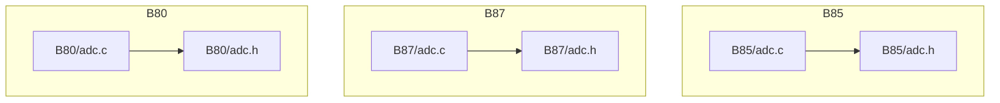
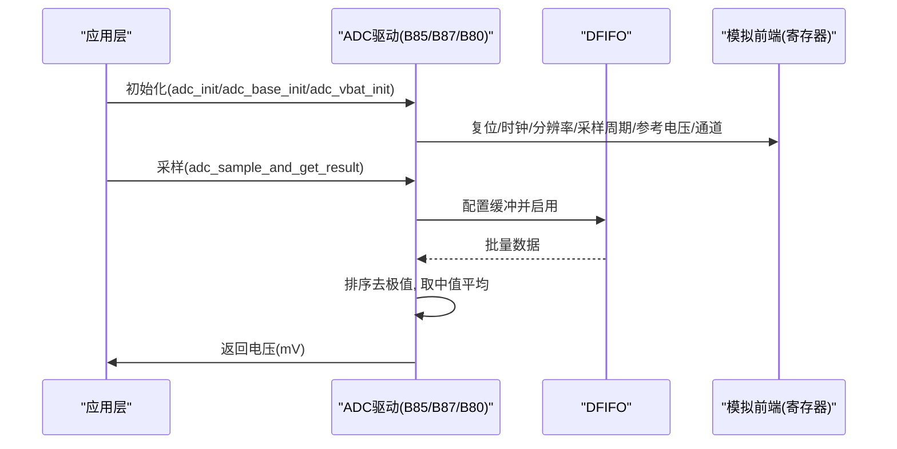
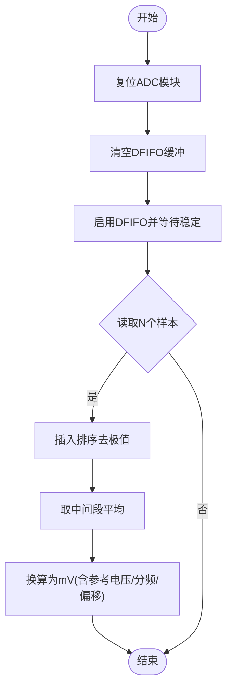
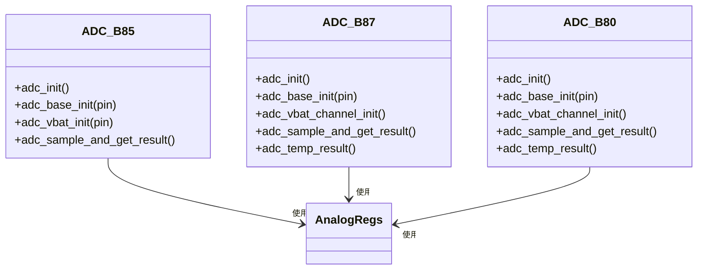

# ADC驱动

<cite>
**本文引用的文件**
- [tc_ble_single_sdk/drivers/B85/adc.c](file://tc_ble_single_sdk/drivers/B85/adc.c)
- [tc_ble_single_sdk/drivers/B85/adc.h](file://tc_ble_single_sdk/drivers/B85/adc.h)
- [tc_ble_single_sdk/drivers/B87/adc.c](file://tc_ble_single_sdk/drivers/B87/adc.c)
- [tc_ble_single_sdk/drivers/B87/adc.h](file://tc_ble_single_sdk/drivers/B87/adc.h)
- [8373_dongle_for_km/chip/B80/drivers/adc.c](file://8373_dongle_for_km/chip/B80/drivers/adc.c)
- [8373_dongle_for_km/chip/B80/drivers/adc.h](file://8373_dongle_for_km/chip/B80/drivers/adc.h)
</cite>

## 目录
1. [简介](#简介)
2. [项目结构](#项目结构)
3. [核心组件](#核心组件)
4. [架构总览](#架构总览)
5. [详细组件分析](#详细组件分析)
6. [依赖关系分析](#依赖关系分析)
7. [性能与功耗考量](#性能与功耗考量)
8. [故障排查指南](#故障排查指南)
9. [结论](#结论)
10. [附录：使用示例与最佳实践](#附录使用示例与最佳实践)

## 简介
本文件面向Telink B85/B87/B80系列MCU的ADC驱动，系统性阐述其工作模式、采样率与分辨率配置、通道选择、参考电压设置、校准流程、数据采集与处理算法（含噪声滤波与平均值计算）、中断与DMA的使用现状、以及电池电量检测与传感器采集的应用方法。同时给出低功耗模式下ADC的使用策略与功耗控制建议。

## 项目结构
本仓库为多平台SDK，ADC驱动按芯片平台分别实现：
- B85平台：drivers/B85/adc.c/.h
- B87平台：drivers/B87/adc.c/.h
- B80平台：chip/B80/drivers/adc.c/.h

各平台实现均围绕以下能力展开：
- 初始化与复位、时钟使能、状态机长度配置
- 输入通道配置（单端/差分）、参考电压与分压比
- 分辨率与采样周期配置
- 数据读取（DFIFO缓冲+软件排序平均）
- 温度传感器与电池电压专用通道初始化
- 手动读取寄存器方式获取原始码值

**图示来源**
- [tc_ble_single_sdk/drivers/B85/adc.c:1-565](file://tc_ble_single_sdk/drivers/B85/adc.c#L1-L565)
- [tc_ble_single_sdk/drivers/B85/adc.h:1-1184](file://tc_ble_single_sdk/drivers/B85/adc.h#L1-L1184)
- [tc_ble_single_sdk/drivers/B87/adc.c:1-558](file://tc_ble_single_sdk/drivers/B87/adc.c#L1-L558)
- [tc_ble_single_sdk/drivers/B87/adc.h:1-708](file://tc_ble_single_sdk/drivers/B87/adc.h#L1-L708)
- [8373_dongle_for_km/chip/B80/drivers/adc.c:1-374](file://8373_dongle_for_km/chip/B80/drivers/adc.c#L1-L374)
- [8373_dongle_for_km/chip/B80/drivers/adc.h:1-688](file://8373_dongle_for_km/chip/B80/drivers/adc.h#L1-L688)

**章节来源**
- [tc_ble_single_sdk/drivers/B85/adc.c:1-565](file://tc_ble_single_sdk/drivers/B85/adc.c#L1-L565)
- [tc_ble_single_sdk/drivers/B87/adc.c:1-558](file://tc_ble_single_sdk/drivers/B87/adc.c#L1-L558)
- [8373_dongle_for_km/chip/B80/drivers/adc.c:1-374](file://8373_dongle_for_km/chip/B80/drivers/adc.c#L1-L374)

## 核心组件
- 初始化与电源管理
  - 关闭SAR ADC后复位模块，开启24M至ADC的时钟，设置采样时钟分频，禁用DFIFO等
- 通道与输入模式
  - 支持单端/差分输入；B85提供左/右/MISC通道，B87/B80主要使用MISC通道
- 参考电压与分压
  - 支持0.6V/0.9V/1.2V或VBAT/N（依平台），可配置VBAT分压比
- 分辨率与采样周期
  - 8/10/12/14位可选；采样周期可调以平衡精度与速度
- 数据采集与处理
  - 通过DFIFO批量读取，软件插入排序去除极值，取中间段均值，再换算为mV
- 温度与电池通道
  - 内置温度传感器与VBAT通道专用初始化函数
- 手动读取
  - 直接读取ADC数据寄存器，适用于简单场景

**章节来源**
- [tc_ble_single_sdk/drivers/B85/adc.c:293-406](file://tc_ble_single_sdk/drivers/B85/adc.c#L293-L406)
- [tc_ble_single_sdk/drivers/B87/adc.c:217-410](file://tc_ble_single_sdk/drivers/B87/adc.c#L217-L410)
- [8373_dongle_for_km/chip/B80/drivers/adc.c:129-234](file://8373_dongle_for_km/chip/B80/drivers/adc.c#L129-L234)

## 架构总览
下图展示了从应用调用到硬件寄存器的关键路径，包括初始化、通道配置、采样与数据处理。

**图示来源**
- [tc_ble_single_sdk/drivers/B85/adc.c:417-516](file://tc_ble_single_sdk/drivers/B85/adc.c#L417-L516)
- [tc_ble_single_sdk/drivers/B87/adc.c:420-493](file://tc_ble_single_sdk/drivers/B87/adc.c#L420-L493)
- [8373_dongle_for_km/chip/B80/drivers/adc.c:244-312](file://8373_dongle_for_km/chip/B80/drivers/adc.c#L244-L312)

## 详细组件分析

### 初始化与电源管理
- 关闭SAR ADC电源，复位数字模块，开启24M时钟源，设置采样时钟分频
- 禁用DFIFO，避免残留数据影响
- B85在初始化中根据采样率宏配置状态机长度，B87/B80采用固定或简化配置

**章节来源**
- [tc_ble_single_sdk/drivers/B85/adc.c:293-324](file://tc_ble_single_sdk/drivers/B85/adc.c#L293-L324)
- [tc_ble_single_sdk/drivers/B87/adc.c:217-230](file://tc_ble_single_sdk/drivers/B87/adc.c#L217-L230)
- [8373_dongle_for_km/chip/B80/drivers/adc.c:129-153](file://8373_dongle_for_km/chip/B80/drivers/adc.c#L129-L153)

### 通道选择与输入模式
- B85支持左/右/MISC通道，可配置单端或差分输入
- B87/B80主要使用MISC通道，支持差分输入
- 通过设置正负输入引脚与模式位完成通道切换

**章节来源**
- [tc_ble_single_sdk/drivers/B85/adc.h:155-162](file://tc_ble_single_sdk/drivers/B85/adc.h#L155-L162)
- [tc_ble_single_sdk/drivers/B85/adc.c:210-257](file://tc_ble_single_sdk/drivers/B85/adc.c#L210-L257)
- [tc_ble_single_sdk/drivers/B87/adc.h:147-151](file://tc_ble_single_sdk/drivers/B87/adc.h#L147-L151)
- [8373_dongle_for_km/chip/B80/drivers/adc.h:151-155](file://8373_dongle_for_km/chip/B80/drivers/adc.h#L151-L155)

### 参考电压与分压配置
- B85支持0.6V/0.9V/1.2V/VBAT-N，B87/B80支持0.9V/1.2V/VBAT-N
- 可通过分压比适配VBAT测量范围
- 不同参考电压对应不同的偏置电流微调，保证精度

**章节来源**
- [tc_ble_single_sdk/drivers/B85/adc.h:48-68](file://tc_ble_single_sdk/drivers/B85/adc.h#L48-L68)
- [tc_ble_single_sdk/drivers/B85/adc.c:112-134](file://tc_ble_single_sdk/drivers/B85/adc.c#L112-L134)
- [tc_ble_single_sdk/drivers/B87/adc.h:44-61](file://tc_ble_single_sdk/drivers/B87/adc.h#L44-L61)
- [8373_dongle_for_km/chip/B80/drivers/adc.h:40-59](file://8373_dongle_for_km/chip/B80/drivers/adc.h#L40-L59)

### 分辨率与采样周期
- 分辨率：8/10/12/14位，越高则精度越高但转换时间更长
- 采样周期：可配置多个档位，影响建立时间与吞吐率
- 采样率宏定义用于B85平台的状态机长度配置，间接决定实际采样率

**章节来源**
- [tc_ble_single_sdk/drivers/B85/adc.h:115-152](file://tc_ble_single_sdk/drivers/B85/adc.h#L115-L152)
- [tc_ble_single_sdk/drivers/B85/adc.c:142-179](file://tc_ble_single_sdk/drivers/B85/adc.c#L142-L179)
- [tc_ble_single_sdk/drivers/B87/adc.h:107-144](file://tc_ble_single_sdk/drivers/B87/adc.h#L107-L144)
- [8373_dongle_for_km/chip/B80/drivers/adc.h:105-148](file://8373_dongle_for_km/chip/B80/drivers/adc.h#L105-L148)

### 数据采集与处理算法
- 使用DFIFO批量读取N个样本（默认8个）
- 软件插入排序去除最大最小值，取中间段求平均，降低噪声影响
- 将有效码值转换为mV：考虑参考电压、预分频、偏移量
- 支持手动模式直接读取寄存器，适合简单场景

**图示来源**
- [tc_ble_single_sdk/drivers/B85/adc.c:417-516](file://tc_ble_single_sdk/drivers/B85/adc.c#L417-L516)
- [tc_ble_single_sdk/drivers/B87/adc.c:420-493](file://tc_ble_single_sdk/drivers/B87/adc.c#L420-L493)
- [8373_dongle_for_km/chip/B80/drivers/adc.c:244-312](file://8373_dongle_for_km/chip/B80/drivers/adc.c#L244-L312)

**章节来源**
- [tc_ble_single_sdk/drivers/B85/adc.c:417-516](file://tc_ble_single_sdk/drivers/B85/adc.c#L417-L516)
- [tc_ble_single_sdk/drivers/B87/adc.c:420-493](file://tc_ble_single_sdk/drivers/B87/adc.c#L420-L493)
- [8373_dongle_for_km/chip/B80/drivers/adc.c:244-312](file://8373_dongle_for_km/chip/B80/drivers/adc.c#L244-L312)

### 温度传感器与电池电压
- 温度传感器：专用初始化函数，读取后通过线性公式换算为摄氏度
- 电池电压：支持VBAT通道或外部GPIO经分压测量，注意分压比与预分频匹配

**章节来源**
- [tc_ble_single_sdk/drivers/B87/adc.c:323-345](file://tc_ble_single_sdk/drivers/B87/adc.c#L323-L345)
- [tc_ble_single_sdk/drivers/B87/adc.c:534-551](file://tc_ble_single_sdk/drivers/B87/adc.c#L534-L551)
- [8373_dongle_for_km/chip/B80/drivers/adc.c:199-211](file://8373_dongle_for_km/chip/B80/drivers/adc.c#L199-L211)
- [8373_dongle_for_km/chip/B80/drivers/adc.c:350-367](file://8373_dongle_for_km/chip/B80/drivers/adc.c#L350-L367)

### 中断触发与DMA传输模式
- 当前驱动未暴露ADC中断接口，也未配置DMA传输
- 数据采集通过轮询DFIFO完成，适合低频采样场景
- 若需更高吞吐或更低CPU占用，可在上层结合定时器与DMA进行扩展

**章节来源**
- [tc_ble_single_sdk/drivers/B85/adc.c:417-516](file://tc_ble_single_sdk/drivers/B85/adc.c#L417-L516)
- [tc_ble_single_sdk/drivers/B87/adc.c:420-493](file://tc_ble_single_sdk/drivers/B87/adc.c#L420-L493)
- [8373_dongle_for_km/chip/B80/drivers/adc.c:244-312](file://8373_dongle_for_km/chip/B80/drivers/adc.c#L244-L312)

## 依赖关系分析
- 驱动依赖底层模拟寄存器操作（analog_write/read）、时钟与定时器、DFIFO
- B85与B87/B80在API粒度上略有差异，但核心流程一致
- 校准参数（参考电压系数与偏移）通过全局变量保存，支持运行时更新

**图示来源**
- [tc_ble_single_sdk/drivers/B85/adc.c:293-516](file://tc_ble_single_sdk/drivers/B85/adc.c#L293-L516)
- [tc_ble_single_sdk/drivers/B87/adc.c:217-493](file://tc_ble_single_sdk/drivers/B87/adc.c#L217-L493)
- [8373_dongle_for_km/chip/B80/drivers/adc.c:129-312](file://8373_dongle_for_km/chip/B80/drivers/adc.c#L129-L312)

**章节来源**
- [tc_ble_single_sdk/drivers/B85/adc.c:293-516](file://tc_ble_single_sdk/drivers/B85/adc.c#L293-L516)
- [tc_ble_single_sdk/drivers/B87/adc.c:217-493](file://tc_ble_single_sdk/drivers/B87/adc.c#L217-L493)
- [8373_dongle_for_km/chip/B80/drivers/adc.c:129-312](file://8373_dongle_for_km/chip/B80/drivers/adc.c#L129-L312)

## 性能与功耗考量
- 采样率与分辨率权衡：提高分辨率会增加转换时间；增加采样周期可降低噪声但降低吞吐
- 噪声抑制：软件排序去极值+中段平均可有效抑制尖峰噪声
- 功耗控制：
  - 非采样期间关闭SAR ADC电源以降低静态功耗
  - 合理设置状态机长度与采样周期，减少不必要的唤醒
  - 使用较低参考电压或分压可减少模拟前端功耗（视精度需求）

[本节为通用指导，不直接分析具体文件]

## 故障排查指南
- 读数异常或跳变大
  - 检查是否启用了正确的参考电压与分压比
  - 确认采样周期与分辨率匹配，避免建立时间不足
  - 确保DFIFO缓冲大小足够，且每次采样前清空缓冲
- 温度读数偏差
  - 确认温度传感器已正确使能
  - 使用专用温度转换公式，避免误用电压换算
- 电池电压不准
  - 核对VBAT分压比与预分频设置
  - 校准参考电压系数与偏移量

**章节来源**
- [tc_ble_single_sdk/drivers/B85/adc.c:417-516](file://tc_ble_single_sdk/drivers/B85/adc.c#L417-L516)
- [tc_ble_single_sdk/drivers/B87/adc.c:420-493](file://tc_ble_single_sdk/drivers/B87/adc.c#L420-L493)
- [8373_dongle_for_km/chip/B80/drivers/adc.c:244-312](file://8373_dongle_for_km/chip/B80/drivers/adc.c#L244-L312)

## 结论
该ADC驱动提供了跨平台的统一抽象，覆盖初始化、通道配置、参考电压、分辨率、采样周期、数据采集与处理、温度与电池测量等核心功能。通过DFIFO与软件滤波实现稳定可靠的低噪声采样。当前版本未暴露中断与DMA接口，适用于低频采样场景；如需高性能采集，可在上层结合定时器与DMA进行扩展。

[本节为总结性内容，不直接分析具体文件]

## 附录：使用示例与最佳实践

### 典型使用流程（GPIO电压采样）
- 初始化ADC与GPIO通道
- 设置参考电压、分辨率、采样周期
- 调用采样函数获取mV值
- 对多次采样结果做滑动平均进一步平滑

参考路径：
- [B85初始化与采样:293-516](file://tc_ble_single_sdk/drivers/B85/adc.c#L293-L516)
- [B87初始化与采样:217-493](file://tc_ble_single_sdk/drivers/B87/adc.c#L217-L493)
- [B80初始化与采样:129-312](file://8373_dongle_for_km/chip/B80/drivers/adc.c#L129-L312)

### 电池电量检测
- 使用VBAT通道或外部GPIO经分压测量
- 配置合适的分压比与预分频，确保量程覆盖
- 校准参考电压系数与偏移量，提升精度

参考路径：
- [B87 VBAT通道初始化:381-410](file://tc_ble_single_sdk/drivers/B87/adc.c#L381-L410)
- [B80 VBAT通道初始化:219-234](file://8373_dongle_for_km/chip/B80/drivers/adc.c#L219-L234)

### 温度传感器采集
- 启用温度传感器通道
- 使用专用温度转换公式得到摄氏度
- 丢弃前几次异常码值（内部滤波器重置影响）

参考路径：
- [B87温度初始化与转换:323-345](file://tc_ble_single_sdk/drivers/B87/adc.c#L323-L345)
- [B87温度结果计算:534-551](file://tc_ble_single_sdk/drivers/B87/adc.c#L534-L551)
- [B80温度初始化与转换:199-211](file://8373_dongle_for_km/chip/B80/drivers/adc.c#L199-L211)
- [B80温度结果计算:350-367](file://8373_dongle_for_km/chip/B80/drivers/adc.c#L350-L367)

### 低功耗模式下的ADC使用策略
- 仅在需要时开启SAR ADC电源，其余时间关闭
- 合理设置状态机长度与采样周期，减少唤醒次数
- 使用较低参考电压或分压以降低模拟前端功耗

[本节为通用指导，不直接分析具体文件]