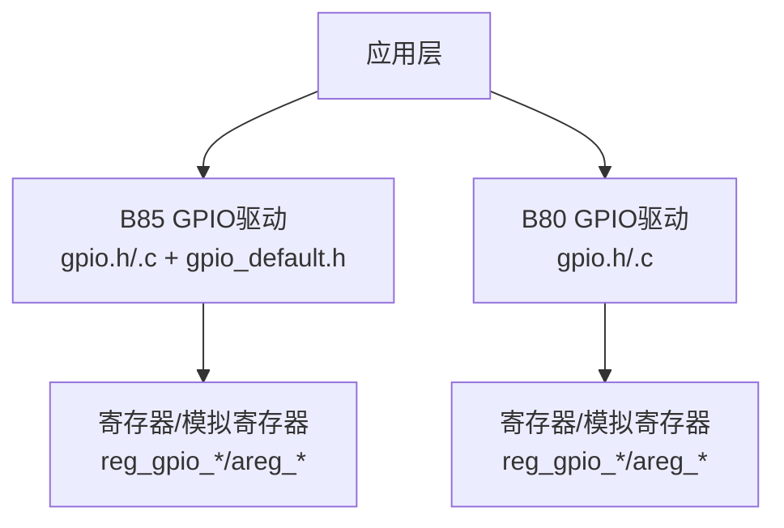
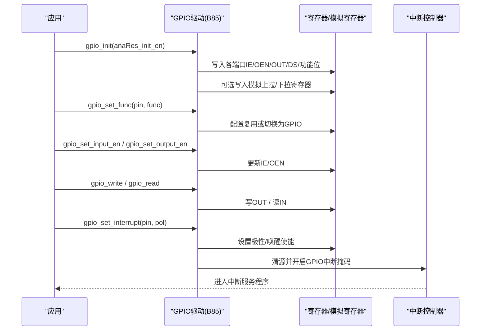
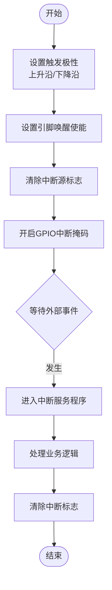
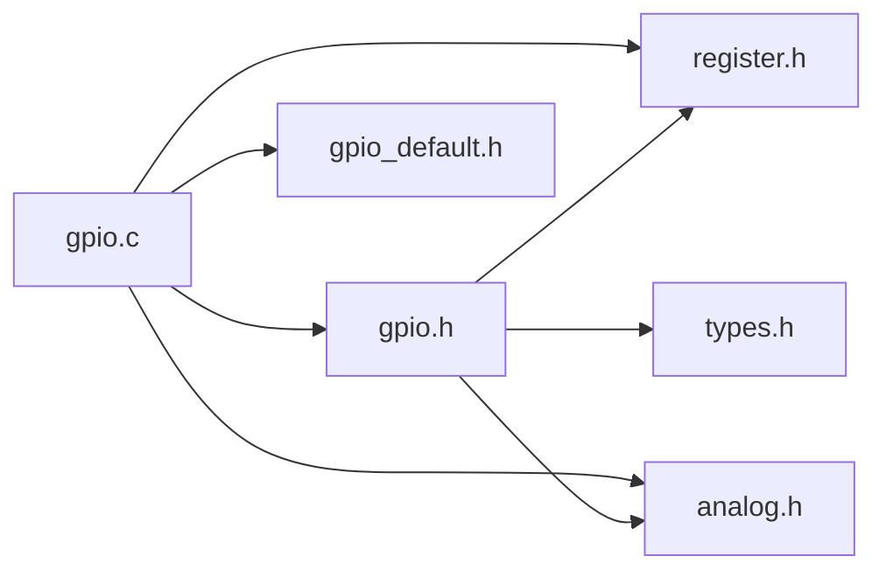

# GPIO驱动

<cite>
**本文引用的文件**
- [gpio.h](file://tc_ble_single_sdk/drivers/B85/gpio.h)
- [gpio.c](file://tc_ble_single_sdk/drivers/B85/gpio.c)
- [gpio_default.h](file://tc_ble_single_sdk/drivers/B85/gpio_default.h)
- [gpio.h（B80）](file://8373_dongle_for_km/chip/B80/drivers/gpio.h)
- [gpio.c（B80）](file://8373_dongle_for_km/chip/B80/drivers/gpio.c)
</cite>

## 目录
1. [简介](#简介)
2. [项目结构](#项目结构)
3. [核心组件](#核心组件)
4. [架构总览](#架构总览)
5. [详细组件分析](#详细组件分析)
6. [依赖关系分析](#依赖关系分析)
7. [性能与功耗考量](#性能与功耗考量)
8. [故障排查指南](#故障排查指南)
9. [结论](#结论)
10. [附录：使用示例与最佳实践](#附录使用示例与最佳实践)

## 简介
本文件面向Telink B85/B80系列MCU的GPIO驱动，系统性阐述引脚配置、输入/输出模式设置、中断处理、电平控制、状态读取、上拉/下拉电阻与驱动能力配置等核心机制。文档同时覆盖初始化流程、低功耗行为与优化策略，并提供基于源码路径的使用指引，帮助读者快速掌握并正确应用GPIO驱动。

## 项目结构
本项目在SDK中为不同芯片平台提供了独立的GPIO驱动实现：
- B85平台：drivers/B85/gpio.h/.c 与 gpio_default.h
- B80平台：chip/B80/drivers/gpio.h/.c

两者均提供统一的API风格（如gpio_init、gpio_set_func、gpio_write、gpio_read、gpio_setup_up_down_resistor、gpio_set_data_strength、gpio_shutdown、gpio_set_interrupt_*等），但寄存器映射与部分实现细节存在差异。

图表来源
- [gpio.h](file://tc_ble_single_sdk/drivers/B85/gpio.h)
- [gpio.c](file://tc_ble_single_sdk/drivers/B85/gpio.c)
- [gpio.h（B80）](file://8373_dongle_for_km/chip/B80/drivers/gpio.h)
- [gpio.c（B80）](file://8373_dongle_for_km/chip/B80/drivers/gpio.c)

章节来源
- [gpio.h](file://tc_ble_single_sdk/drivers/B85/gpio.h)
- [gpio.c](file://tc_ble_single_sdk/drivers/B85/gpio.c)
- [gpio_default.h](file://tc_ble_single_sdk/drivers/B85/gpio_default.h)
- [gpio.h（B80）](file://8373_dongle_for_km/chip/B80/drivers/gpio.h)
- [gpio.c（B80）](file://8373_dongle_for_km/chip/B80/drivers/gpio.c)

## 核心组件
- 引脚与功能枚举
  - 引脚分组与编号：PA/PB/PC/PD/PE(PF在B80)，以及别名（如USB DP/DM、SWS等）。
  - 复用功能：GPIO、UART、I2C、SPI、I2S、PWM、ADC、CMP、ATS、SWIRE、USB等。
- 基本操作
  - 初始化：gpio_init(anaRes_init_en)
  - 功能选择：gpio_set_func(pin, func)
  - 输入/输出使能：gpio_set_input_en / gpio_set_output_en
  - 电平读写：gpio_write / gpio_read / gpio_toggle / gpio_read_all
- 外设特性
  - 上拉/下拉：gpio_setup_up_down_resistor
  - 驱动能力：gpio_set_data_strength
  - 高阻态/关闭：gpio_shutdown
- 中断
  - 触发极性：POL_RISING / POL_FALLING
  - 启用/屏蔽：gpio_set_interrupt / gpio_en_interrupt
  - RISC0/RISC1（及B80新增RISC2）专用中断通道
  - 状态查询与清除：gpio_get_irq_status / gpio_clr_irq_status
  - 全局掩码：gpio_set_irq_mask / gpio_clr_irq_mask

章节来源
- [gpio.h](file://tc_ble_single_sdk/drivers/B85/gpio.h)
- [gpio.c](file://tc_ble_single_sdk/drivers/B85/gpio.c)
- [gpio.h（B80）](file://8373_dongle_for_km/chip/B80/drivers/gpio.h)
- [gpio.c（B80）](file://8373_dongle_for_km/chip/B80/drivers/gpio.c)

## 架构总览
GPIO驱动通过统一API封装底层寄存器访问，按引脚组（A/B/C/D/E/F）分别管理输入使能、输出使能、数据输出、驱动强度、复用功能、上拉/下拉等。中断子系统提供多路RISC中断通道，支持边沿/电平触发与屏蔽控制。

图表来源
- [gpio.c](file://tc_ble_single_sdk/drivers/B85/gpio.c)
- [gpio.h](file://tc_ble_single_sdk/drivers/B85/gpio.h)
- [gpio.c（B80）](file://8373_dongle_for_km/chip/B80/drivers/gpio.c)
- [gpio.h（B80）](file://8373_dongle_for_km/chip/B80/drivers/gpio.h)

## 详细组件分析

### 初始化流程（gpio_init）
- 作用：批量配置所有端口的输入/输出使能、初始输出值、驱动强度、是否作为GPIO等功能位；可选择初始化模拟上拉/下拉。
- 关键点：
  - PA/PD/PE等组通过专用寄存器一次性写入。
  - PB/PC组的输入使能与驱动强度位于模拟寄存器，需analog_write访问。
  - 若传入参数指示需要重置模拟寄存器，则调用内部函数初始化全部引脚的上拉/下拉默认值。
- 建议：
  - 从深度保持模式唤醒时，根据需求决定是否重新初始化模拟寄存器，避免不必要的功耗与时间开销。

章节来源
- [gpio.c](file://tc_ble_single_sdk/drivers/B85/gpio.c)
- [gpio.c（B80）](file://8373_dongle_for_km/chip/B80/drivers/gpio.c)

### 功能复用与GPIO模式切换（gpio_set_func）
- 作用：将指定引脚设置为GPIO或特定外设功能（UART/I2C/SPI/I2S/PWM/ADC/...）。
- 行为：
  - 当func为AS_GPIO时，置位对应GPIO功能位；否则写入复用功能选择寄存器并清除GPIO功能位。
  - 某些特殊引脚（如USB DP/DM）仅需设置输入使能即可。
- 注意：
  - 切换为复用功能后，应遵循“先设复用，再禁用GPIO”的顺序，以避免不确定状态。

章节来源
- [gpio.c](file://tc_ble_single_sdk/drivers/B85/gpio.c)
- [gpio.c（B80）](file://8373_dongle_for_km/chip/B80/drivers/gpio.c)

### 输入/输出使能与电平控制
- 输入使能：gpio_set_input_en
  - 不同组的输入使能寄存器位置不同（数字或模拟寄存器），驱动内部按组区分处理。
- 输出使能：gpio_set_output_en（内联）
  - 直接操作OEN寄存器位。
- 电平读写：
  - gpio_write：写OUT寄存器位。
  - gpio_read：读IN寄存器位。
  - gpio_toggle：对OUT进行异或翻转。
  - gpio_read_all：批量读取各组输入缓存到缓冲区。

章节来源
- [gpio.h](file://tc_ble_single_sdk/drivers/B85/gpio.h)
- [gpio.c](file://tc_ble_single_sdk/drivers/B85/gpio.c)
- [gpio.h（B80）](file://8373_dongle_for_km/chip/B80/drivers/gpio.h)
- [gpio.c（B80）](file://8373_dongle_for_km/chip/B80/drivers/gpio.c)

### 上拉/下拉电阻与驱动能力
- 上拉/下拉：gpio_setup_up_down_resistor
  - 通过计算基地址与移位量，写入对应的模拟寄存器，支持浮空、1M上拉、100K下拉、10K上拉。
  - 对DP等特殊引脚有额外处理逻辑。
- 驱动能力：gpio_set_data_strength
  - 根据引脚组写入相应寄存器位，调整输出驱动强度。
- 高阻态/关闭：gpio_shutdown
  - 将指定引脚置低、关闭输出、关闭输入、复位功能位，达到最小功耗状态。

章节来源
- [gpio.c](file://tc_ble_single_sdk/drivers/B85/gpio.c)
- [gpio.c（B80）](file://8373_dongle_for_km/chip/B80/drivers/gpio.c)
- [gpio_default.h](file://tc_ble_single_sdk/drivers/B85/gpio_default.h)

### 中断机制与事件响应
- 触发极性：POL_RISING（上升沿）/ POL_FALLING（下降沿）
- 启用中断：
  - gpio_set_interrupt：设置引脚唤醒使能、极性，并清理中断源、开启GPIO中断掩码。
  - gpio_en_interrupt：动态开关引脚中断。
- 多RISC通道：
  - B85：支持GPIO主中断、RISC0、RISC1。
  - B80：新增RISC2等扩展通道，并提供组级中断状态与屏蔽接口。
- 状态与屏蔽：
  - gpio_get_irq_status / gpio_clr_irq_status：查询与清除中断标志。
  - gpio_set_irq_mask / gpio_clr_irq_mask：全局屏蔽/取消屏蔽。

图表来源
- [gpio.h](file://tc_ble_single_sdk/drivers/B85/gpio.h)
- [gpio.h（B80）](file://8373_dongle_for_km/chip/B80/drivers/gpio.h)

章节来源
- [gpio.h](file://tc_ble_single_sdk/drivers/B85/gpio.h)
- [gpio.h（B80）](file://8373_dongle_for_km/chip/B80/drivers/gpio.h)

### 与外部电路的接口设计
- 上拉/下拉电阻：
  - 通过gpio_setup_up_down_resistor配置内部电阻，避免外部上下拉导致的漏电流风险。
  - 未使用的引脚建议设为高阻态并配置确定状态（上拉/下拉），保证稳定。
- 驱动能力：
  - 根据负载与走线长度选择合适的驱动强度，平衡速度与功耗。
- USB相关：
  - 提供USB DP/DM引脚配置与上拉控制接口，便于USB设备枚举。

章节来源
- [gpio.c](file://tc_ble_single_sdk/drivers/B85/gpio.c)
- [gpio.h](file://tc_ble_single_sdk/drivers/B85/gpio.h)

### 低功耗模式下的行为与优化
- 深度保持模式唤醒：
  - gpio_init可选择不重置模拟寄存器，减少唤醒时间与功耗。
- 未用引脚处理：
  - 使用gpio_shutdown将未用引脚置高阻态，降低静态功耗。
- 中断唤醒：
  - 合理配置引脚中断极性，结合系统休眠策略，实现事件驱动唤醒。
- 30k上拉：
  - B80提供专用接口设置数字上拉，注意进入低功耗后可能失效，需评估应用场景。

章节来源
- [gpio.c](file://tc_ble_single_sdk/drivers/B85/gpio.c)
- [gpio.c（B80）](file://8373_dongle_for_km/chip/B80/drivers/gpio.c)
- [gpio.h（B80）](file://8373_dongle_for_km/chip/B80/drivers/gpio.h)

## 依赖关系分析
- 头文件依赖：
  - gpio.h包含register.h、analog.h、types.h等，以访问寄存器与类型定义。
  - gpio.c包含bsp.h、compiler.h、register.h、analog.h、gpio_default.h。
- 模块耦合：
  - 驱动与寄存器抽象紧密耦合，通过宏与内联函数高效访问。
  - 不同平台的差异通过条件编译与分组逻辑处理，保持API一致性。

图表来源
- [gpio.h](file://tc_ble_single_sdk/drivers/B85/gpio.h)
- [gpio.c](file://tc_ble_single_sdk/drivers/B85/gpio.c)
- [gpio_default.h](file://tc_ble_single_sdk/drivers/B85/gpio_default.h)

章节来源
- [gpio.h](file://tc_ble_single_sdk/drivers/B85/gpio.h)
- [gpio.c](file://tc_ble_single_sdk/drivers/B85/gpio.c)
- [gpio_default.h](file://tc_ble_single_sdk/drivers/B85/gpio_default.h)

## 性能与功耗考量
- 批量操作优先：
  - 使用gpio_read_all批量读取输入，减少多次寄存器访问。
- 驱动强度调优：
  - 短距离低速信号可使用较低驱动强度以降低EMI与功耗；长距离或高速信号适当提高驱动强度。
- 中断策略：
  - 仅启用必要引脚的中断，及时清除中断标志，避免重复触发。
- 低功耗：
  - 未用引脚高阻态；深度保持唤醒时按需重置模拟寄存器；合理使用30k上拉（注意低功耗限制）。

[本节为通用指导，不直接分析具体文件]

## 故障排查指南
- 引脚无响应：
  - 检查是否已正确设置功能（gpio_set_func）与输入/输出使能（gpio_set_input_en / gpio_set_output_en）。
  - 确认未与其他复用功能冲突。
- 电平异常：
  - 检查上拉/下拉配置是否正确；必要时使用gpio_shutdown确保高阻态。
- 中断不触发：
  - 确认极性设置与外部信号一致；检查中断掩码是否开启；在中断服务程序中及时清除中断标志。
- USB相关：
  - 使用USB DP/DM前，确保已启用相应上拉与功能配置。

章节来源
- [gpio.c](file://tc_ble_single_sdk/drivers/B85/gpio.c)
- [gpio.c（B80）](file://8373_dongle_for_km/chip/B80/drivers/gpio.c)
- [gpio.h](file://tc_ble_single_sdk/drivers/B85/gpio.h)
- [gpio.h（B80）](file://8373_dongle_for_km/chip/B80/drivers/gpio.h)

## 结论
该GPIO驱动为B85/B80平台提供了完整且一致的API，涵盖引脚配置、输入输出控制、中断处理、上拉/下拉与驱动能力调节等关键功能。通过合理的初始化、配置与中断策略，可在满足性能的同时实现低功耗运行。开发者应依据具体硬件与应用场景，选择合适的引脚功能、驱动强度与中断方式，并遵循驱动注释中的注意事项，以确保系统稳定性与可靠性。

[本节为总结性内容，不直接分析具体文件]

## 附录：使用示例与最佳实践
以下示例以“代码片段路径”形式给出，便于定位到具体实现位置：

- 初始化GPIO并配置某引脚为上拉输入
  - 参考路径：[gpio.c:97-185](file://tc_ble_single_sdk/drivers/B85/gpio.c#L97-L185)
  - 说明：调用gpio_init完成端口初始化；随后使用gpio_setup_up_down_resistor配置上拉。

- 将引脚设为GPIO并输出高电平
  - 参考路径：[gpio.c:812-825](file://tc_ble_single_sdk/drivers/B85/gpio.c#L812-L825)
  - 参考路径：[gpio.h:204-258](file://tc_ble_single_sdk/drivers/B85/gpio.h#L204-L258)
  - 说明：gpio_set_func设置为GPIO；gpio_set_output_en启用输出；gpio_write输出高。

- 读取引脚电平
  - 参考路径：[gpio.h:265-269](file://tc_ble_single_sdk/drivers/B85/gpio.h#L265-L269)
  - 说明：gpio_read返回当前电平状态。

- 配置上升沿中断并启用
  - 参考路径：[gpio.h:375-406](file://tc_ble_single_sdk/drivers/B85/gpio.h#L375-L406)
  - 参考路径：[gpio.h:414-423](file://tc_ble_single_sdk/drivers/B85/gpio.h#L414-L423)
  - 说明：gpio_set_interrupt设置极性与唤醒使能；gpio_en_interrupt动态启用。

- 中断服务程序中的状态清除
  - 参考路径：[gpio.h:298-312](file://tc_ble_single_sdk/drivers/B85/gpio.h#L298-L312)
  - 说明：gpio_clr_irq_status清除中断标志，避免重复触发。

- B80平台上的30k上拉与关闭
  - 参考路径：[gpio.c（B80）:406-434](file://8373_dongle_for_km/chip/B80/drivers/gpio.c#L406-L434)
  - 说明：gpio_set_pullup_res_30k用于设置数字上拉；gpio_shutdown用于高阻态关闭。

- 批量读取所有引脚输入
  - 参考路径：[gpio.h:286-292](file://tc_ble_single_sdk/drivers/B85/gpio.h#L286-L292)
  - 说明：gpio_read_all将各组输入缓存到缓冲区，适合按键扫描等场景。

章节来源
- [gpio.c](file://tc_ble_single_sdk/drivers/B85/gpio.c)
- [gpio.h](file://tc_ble_single_sdk/drivers/B85/gpio.h)
- [gpio.c（B80）](file://8373_dongle_for_km/chip/B80/drivers/gpio.c)
- [gpio.h（B80）](file://8373_dongle_for_km/chip/B80/drivers/gpio.h)