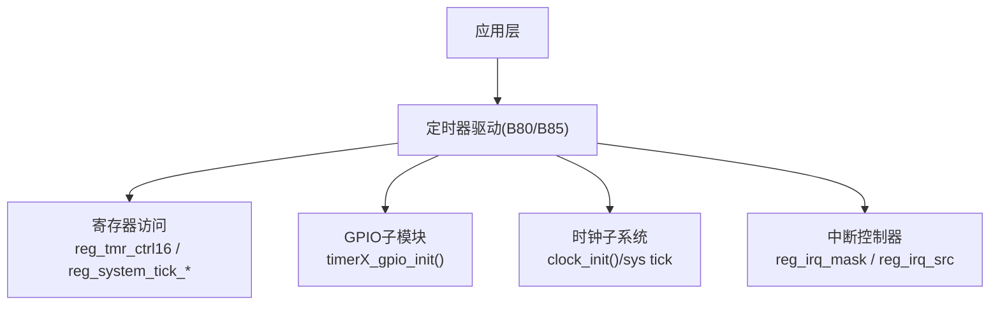
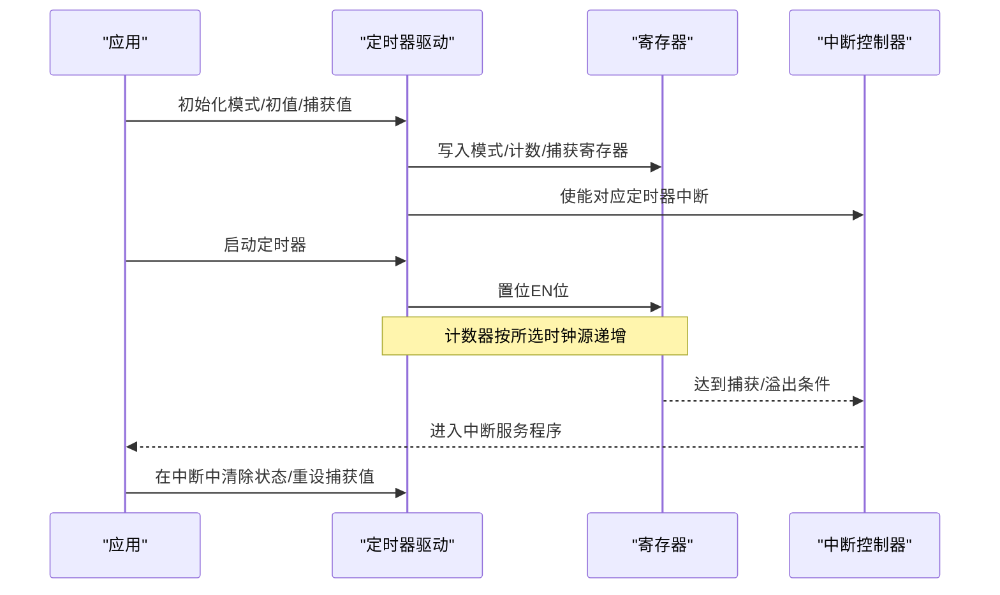
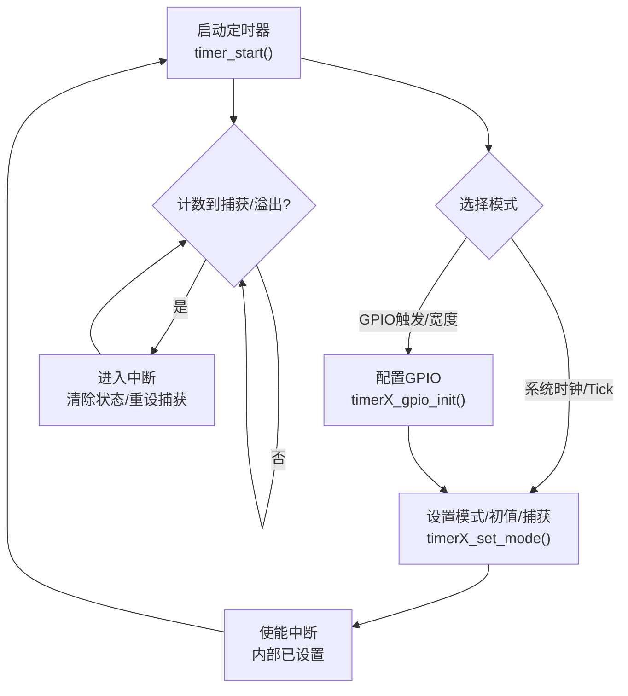
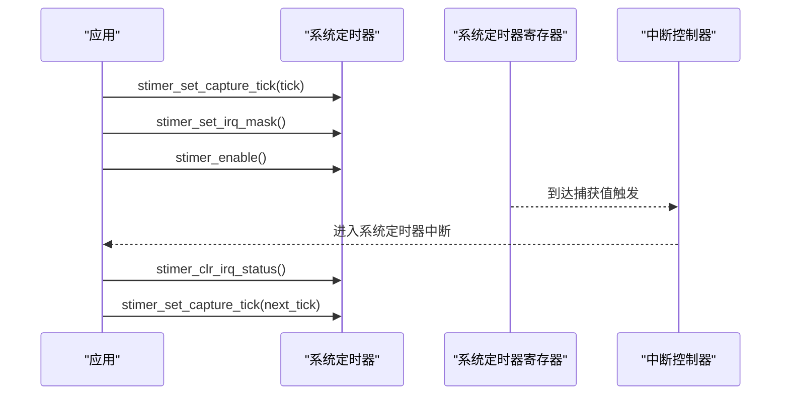
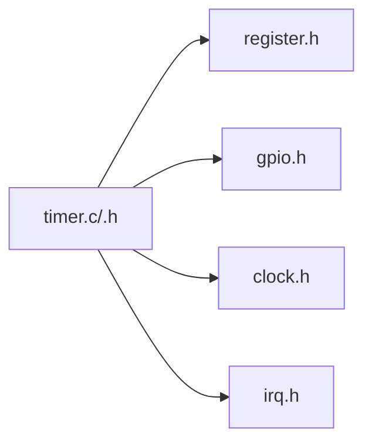

# 定时器驱动

<cite>
**本文引用的文件**
- [timer.c (B80)](file://8373_dongle_for_km/chip/B80/drivers/timer.c)
- [timer.h (B80)](file://8373_dongle_for_km/chip/B80/drivers/timer.h)
- [timer.c (B85)](file://tc_ble_single_sdk/drivers/B85/timer.c)
- [timer.h (B85)](file://tc_ble_single_sdk/drivers/B85/timer.h)
- [stimer.h (B85)](file://tc_ble_single_sdk/drivers/B85/stimer.h)
- [register.h (B85)](file://tc_ble_single_sdk/drivers/B85/register.h)
- [clock.h (B80)](file://8373_dongle_for_km/chip/B80/drivers/clock.h)
</cite>

## 目录
1. [简介](#简介)
2. [项目结构](#项目结构)
3. [核心组件](#核心组件)
4. [架构总览](#架构总览)
5. [详细组件分析](#详细组件分析)
6. [依赖关系分析](#依赖关系分析)
7. [性能与精度](#性能与精度)
8. [故障排查指南](#故障排查指南)
9. [结论](#结论)
10. [附录：使用示例与配置要点](#附录使用示例与配置要点)

## 简介
本文件面向Telink B80/B85系列芯片的定时器驱动，系统性阐述硬件定时器的实现原理、计数模式、预分频与时钟源、初始化/启动/停止流程、中断与回调机制、系统定时器与硬件定时器的区别与应用场景，以及精度、误差处理与性能优化策略。文档同时给出基于SDK接口的使用方法指引（以代码片段路径引用代替直接代码内容），帮助读者快速上手并深入理解底层行为。

## 项目结构
该SDK为多平台/多芯片提供统一的定时器抽象，关键文件分布如下：
- B80平台：drivers/timer.c/.h 提供硬件定时器API；stimer.h 提供系统定时器接口；clock.h 提供时钟源配置。
- B85平台：drivers/timer.c/.h 提供硬件定时器API；stimer.h 提供系统定时器接口；register.h 定义寄存器位域常量。

图表来源
- [timer.c (B80):137-329](file://8373_dongle_for_km/chip/B80/drivers/timer.c#L137-L329)
- [timer.c (B85):131-323](file://tc_ble_single_sdk/drivers/B85/timer.c#L131-L323)
- [stimer.h (B85):36-82](file://tc_ble_single_sdk/drivers/B85/stimer.h#L36-L82)
- [register.h (B85):175-194](file://tc_ble_single_sdk/drivers/B85/register.h#L175-L194)

章节来源
- [timer.c (B80):1-332](file://8373_dongle_for_km/chip/B80/drivers/timer.c#L1-L332)
- [timer.h (B80):1-217](file://8373_dongle_for_km/chip/B80/drivers/timer.h#L1-L217)
- [timer.c (B85):1-326](file://tc_ble_single_sdk/drivers/B85/timer.c#L1-L326)
- [timer.h (B85):1-198](file://tc_ble_single_sdk/drivers/B85/timer.h#L1-L198)
- [stimer.h (B85):1-85](file://tc_ble_single_sdk/drivers/B85/stimer.h#L1-L85)
- [register.h (B85):175-194](file://tc_ble_single_sdk/drivers/B85/register.h#L175-L194)
- [clock.h (B80):151-200](file://8373_dongle_for_km/chip/B80/drivers/clock.h#L151-L200)

## 核心组件
- 硬件定时器（Timer0/1/2）
  - 支持模式：系统时钟模式、GPIO触发模式、GPIO宽度测量模式、Tick计数模式。
  - 通过设置模式、初始计数值、捕获值，配合中断使能实现周期或事件驱动。
  - 提供统一启动/停止接口。
- 系统定时器（System Timer）
  - 提供高精度时基（微秒级延时、超时判断）。
  - 支持设置捕获比较值、中断掩码、状态查询与清除。
- GPIO输入配置
  - 为GPIO触发/宽度模式准备引脚：关闭输出、使能输入、配置上下拉、极性、清除中断源等。

章节来源
- [timer.h (B80):31-75](file://8373_dongle_for_km/chip/B80/drivers/timer.h#L31-L75)
- [timer.h (B85):31-71](file://tc_ble_single_sdk/drivers/B85/timer.h#L31-L71)
- [timer.c (B80):45-129](file://8373_dongle_for_km/chip/B80/drivers/timer.c#L45-L129)
- [timer.c (B85):45-123](file://tc_ble_single_sdk/drivers/B85/timer.c#L45-L123)
- [stimer.h (B85):36-82](file://tc_ble_single_sdk/drivers/B85/stimer.h#L36-L82)

## 架构总览
定时器子系统由“应用调用 -> 驱动封装 -> 寄存器操作 -> 中断/时钟”构成。硬件定时器通过模式选择决定计数源与触发方式；系统定时器提供稳定的时间基准；GPIO输入用于外部事件同步与脉宽测量。

图表来源
- [timer.c (B80):137-329](file://8373_dongle_for_km/chip/B80/drivers/timer.c#L137-L329)
- [timer.c (B85):131-323](file://tc_ble_single_sdk/drivers/B85/timer.c#L131-L323)
- [stimer.h (B85):48-82](file://tc_ble_single_sdk/drivers/B85/stimer.h#L48-L82)

## 详细组件分析

### 硬件定时器（Timer0/1/2）
- 模式说明
  - 系统时钟模式：以系统时钟为计数源，常用于周期性定时。
  - GPIO触发模式：由指定GPIO边沿触发计数/捕获，适合外部事件同步。
  - GPIO宽度模式：测量GPIO脉冲宽度，适合信号时序测量。
  - Tick模式：通用计数模式，可用作自由运行计数器。
- 初始化流程
  - 若使用GPIO触发/宽度模式，需先调用对应timerX_gpio_init完成引脚配置。
  - 调用timerX_set_mode设置模式、初始计数和捕获值，内部会开启对应中断并使能相关位。
- 启动/停止
  - timer_start(timerX) 置位对应EN位开始计数。
  - timer_stop(timerX) 清零EN位停止计数。
- 中断与状态
  - 通过timer_clear_interrupt_status清除状态位。
  - 通过timer_get_interrupt_status查询是否发生中断。

图表来源
- [timer.c (B80):45-129](file://8373_dongle_for_km/chip/B80/drivers/timer.c#L45-L129)
- [timer.c (B80):137-329](file://8373_dongle_for_km/chip/B80/drivers/timer.c#L137-L329)
- [timer.h (B80):183-215](file://8373_dongle_for_km/chip/B80/drivers/timer.h#L183-L215)

章节来源
- [timer.c (B80):45-329](file://8373_dongle_for_km/chip/B80/drivers/timer.c#L45-L329)
- [timer.h (B80):31-215](file://8373_dongle_for_km/chip/B80/drivers/timer.h#L31-L215)
- [timer.c (B85):45-323](file://tc_ble_single_sdk/drivers/B85/timer.c#L45-L323)
- [timer.h (B85):31-195](file://tc_ble_single_sdk/drivers/B85/timer.h#L31-L195)

### 系统定时器（System Timer）
- 功能
  - 提供微秒级延时与超时判断：sleep_us、clock_time_exceed。
  - 设置捕获比较值、中断掩码、状态查询与清除。
- 典型用法
  - 设置捕获值后使能中断，在ISR中清除状态并重新设置捕获值，形成周期中断。
  - 使用clock_time_exceed进行非阻塞延时/超时检测。

图表来源
- [stimer.h (B85):36-82](file://tc_ble_single_sdk/drivers/B85/stimer.h#L36-L82)
- [timer.h (B85):79-110](file://tc_ble_single_sdk/drivers/B85/timer.h#L79-L110)

章节来源
- [stimer.h (B85):36-82](file://tc_ble_single_sdk/drivers/B85/stimer.h#L36-L82)
- [timer.h (B85):79-110](file://tc_ble_single_sdk/drivers/B85/timer.h#L79-L110)
- [timer.h (B80):82-111](file://8373_dongle_for_km/chip/B80/drivers/timer.h#L82-L111)

### GPIO触发/宽度测量
- 引脚配置要点
  - 关闭输出、使能输入、配置上拉/下拉电阻、设置极性、清除中断源，避免误触发。
- 适用场景
  - 外部事件同步、脉冲宽度测量、频率测量等。

章节来源
- [timer.c (B80):45-129](file://8373_dongle_for_km/chip/B80/drivers/timer.c#L45-L129)
- [timer.c (B85):45-123](file://tc_ble_single_sdk/drivers/B85/timer.c#L45-L123)

## 依赖关系分析
- 定时器驱动依赖
  - 寄存器定义：如reg_tmr_ctrl16、reg_system_tick_*、reg_irq_mask、reg_irq_src等。
  - GPIO子模块：用于配置输入引脚及中断源。
  - 时钟子系统：系统时钟源与校准影响计时精度。
- 耦合与内聚
  - 各定时器函数独立封装，内聚度高；通过统一枚举与宏降低耦合。
- 外部依赖
  - 时钟源配置（clock_init）会影响系统定时器分辨率与精度。

图表来源
- [timer.c (B80):1-332](file://8373_dongle_for_km/chip/B80/drivers/timer.c#L1-L332)
- [timer.h (B80):24-30](file://8373_dongle_for_km/chip/B80/drivers/timer.h#L24-L30)
- [register.h (B85):175-194](file://tc_ble_single_sdk/drivers/B85/register.h#L175-L194)
- [clock.h (B80):151-200](file://8373_dongle_for_km/chip/B80/drivers/clock.h#L151-L200)

章节来源
- [timer.c (B80):1-332](file://8373_dongle_for_km/chip/B80/drivers/timer.c#L1-L332)
- [timer.h (B80):24-30](file://8373_dongle_for_km/chip/B80/drivers/timer.h#L24-L30)
- [register.h (B85):175-194](file://tc_ble_single_sdk/drivers/B85/register.h#L175-L194)
- [clock.h (B80):151-200](file://8373_dongle_for_km/chip/B80/drivers/clock.h#L151-L200)

## 性能与精度
- 时钟源与分辨率
  - 系统定时器以系统时钟为基准，微秒级延时通过读取系统tick并与参考值差值比较实现。
  - 分辨率受系统时钟频率影响；高频时钟可获得更高精度。
- 误差来源
  - 时钟源漂移（RC/晶振）、温度变化、中断延迟、上下文切换。
- 优化建议
  - 使用系统定时器进行高精度延时与周期任务调度。
  - 在ISR中仅做最小必要工作，重设捕获值与清除状态，复杂逻辑移至低优先级任务。
  - 合理选择定时器模式：GPIO宽度模式用于外部信号测量，系统时钟模式用于内部周期任务。
  - 定期校准时钟源（如24M RC/32K RC）以减少长期漂移。

章节来源
- [timer.h (B85):79-110](file://tc_ble_single_sdk/drivers/B85/timer.h#L79-L110)
- [timer.h (B80):82-111](file://8373_dongle_for_km/chip/B80/drivers/timer.h#L82-L111)
- [clock.h (B80):171-200](file://8373_dongle_for_km/chip/B80/drivers/clock.h#L171-L200)

## 故障排查指南
- 常见问题
  - 定时器不触发：检查模式设置、初始/捕获值、EN位是否置位、中断是否使能。
  - 频繁误触发：确认GPIO极性、上下拉配置是否正确；确保在配置极性后清除中断源。
  - 精度偏差：检查系统时钟源与校准状态；评估中断延迟对周期的影响。
- 定位步骤
  - 使用timer_get_interrupt_status查询状态位，结合中断入口判断是否进入。
  - 在ISR中及时清除状态位并重设捕获值，避免重复触发或丢失中断。
  - 使用sleep_us与clock_time_exceed验证延时是否符合预期。

章节来源
- [timer.c (B80):45-129](file://8373_dongle_for_km/chip/B80/drivers/timer.c#L45-L129)
- [timer.h (B80):183-215](file://8373_dongle_for_km/chip/B80/drivers/timer.h#L183-L215)
- [stimer.h (B85):64-82](file://tc_ble_single_sdk/drivers/B85/stimer.h#L64-L82)

## 结论
该定时器驱动提供了完善的硬件定时器与系统定时器能力，覆盖周期定时、外部事件同步、脉宽测量等常见需求。通过清晰的初始化/启动/停止流程与中断管理接口，开发者可在不同模式下灵活构建实时任务。结合时钟源校准与合理的ISR设计，可实现高精度与高可靠性的定时控制。

## 附录：使用示例与配置要点
以下示例以“代码片段路径”形式给出，便于在工程中快速定位与复用。

- 使用系统定时器进行微秒延时与超时判断
  - 延时：[sleep_us:32-37](file://8373_dongle_for_km/chip/B80/drivers/timer.c#L32-L37)
  - 超时判断：[clock_time_exceed:108-111](file://8373_dongle_for_km/chip/B80/drivers/timer.h#L108-L111)
  - 系统定时器捕获与中断：[stimer_set_capture_tick:36-41](file://tc_ble_single_sdk/drivers/B85/stimer.h#L36-L41)、[stimer_set_irq_mask:48-52](file://tc_ble_single_sdk/drivers/B85/stimer.h#L48-L52)、[stimer_clr_irq_status:69-72](file://tc_ble_single_sdk/drivers/B85/stimer.h#L69-L72)

- 配置硬件定时器（Timer0/1/2）
  - GPIO触发/宽度模式引脚配置：[timer0_gpio_init:45-71](file://8373_dongle_for_km/chip/B80/drivers/timer.c#L45-L71)、[timer1_gpio_init:78-103](file://8373_dongle_for_km/chip/B80/drivers/timer.c#L78-L103)、[timer2_gpio_init:110-129](file://8373_dongle_for_km/chip/B80/drivers/timer.c#L110-L129)
  - 设置模式/初值/捕获值：[timer0_set_mode:137-181](file://8373_dongle_for_km/chip/B80/drivers/timer.c#L137-L181)、[timer1_set_mode:189-233](file://8373_dongle_for_km/chip/B80/drivers/timer.c#L189-L233)、[timer2_set_mode:241-285](file://8373_dongle_for_km/chip/B80/drivers/timer.c#L241-L285)
  - 启动/停止：[timer_start:291-307](file://8373_dongle_for_km/chip/B80/drivers/timer.c#L291-L307)、[timer_stop:313-329](file://8373_dongle_for_km/chip/B80/drivers/timer.c#L313-L329)
  - 中断状态管理：[timer_clear_interrupt_status:203-206](file://8373_dongle_for_km/chip/B80/drivers/timer.h#L203-L206)、[timer_get_interrupt_status:213-215](file://8373_dongle_for_km/chip/B80/drivers/timer.h#L213-L215)

- 系统定时器与硬件定时器的区别与应用场景
  - 系统定时器：高精度时基、微秒级延时、周期任务调度，适用于软件定时与实时性要求高的场景。
  - 硬件定时器：外部事件同步、脉宽测量、独立于CPU的定时任务，适用于I/O时序与低功耗场景。

- 时钟源与精度
  - 系统时钟初始化与校准：[clock_init:151-151](file://8373_dongle_for_km/chip/B80/drivers/clock.h#L151-L151)、[rc_24m_cal:183-183](file://8373_dongle_for_km/chip/B80/drivers/clock.h#L183-L183)、[rc_48m_cal:190-190](file://8373_dongle_for_km/chip/B80/drivers/clock.h#L190-L190)
  - 32K时钟源选择：[clock_32k_init:169-169](file://8373_dongle_for_km/chip/B80/drivers/clock.h#L169-L169)

章节来源
- [timer.c (B80):32-37](file://8373_dongle_for_km/chip/B80/drivers/timer.c#L32-L37)
- [timer.h (B80):108-111](file://8373_dongle_for_km/chip/B80/drivers/timer.h#L108-L111)
- [stimer.h (B85):36-82](file://tc_ble_single_sdk/drivers/B85/stimer.h#L36-L82)
- [timer.c (B80):45-329](file://8373_dongle_for_km/chip/B80/drivers/timer.c#L45-L329)
- [timer.h (B80):183-215](file://8373_dongle_for_km/chip/B80/drivers/timer.h#L183-L215)
- [clock.h (B80):151-200](file://8373_dongle_for_km/chip/B80/drivers/clock.h#L151-L200)