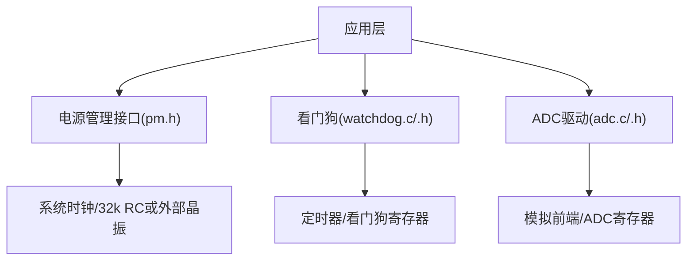
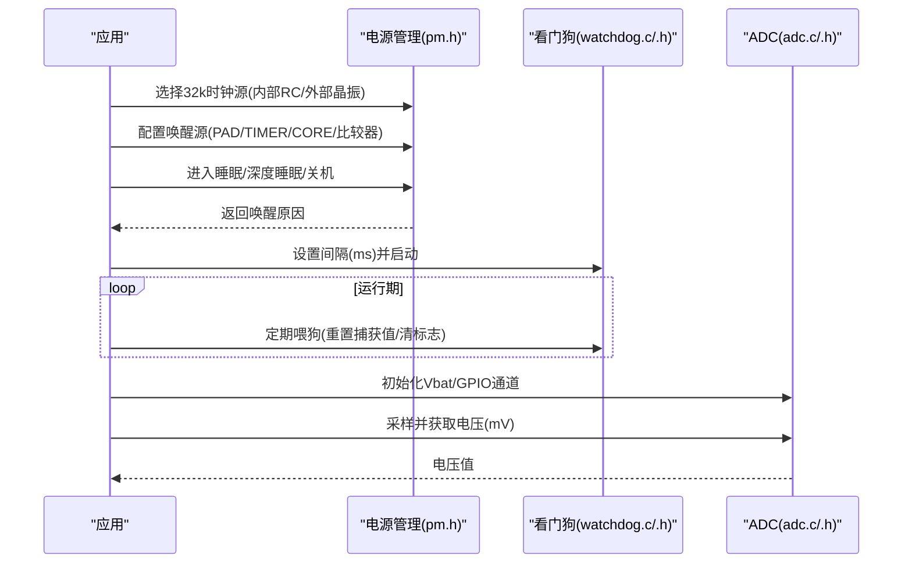
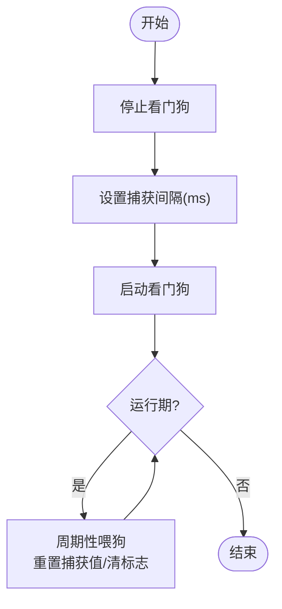
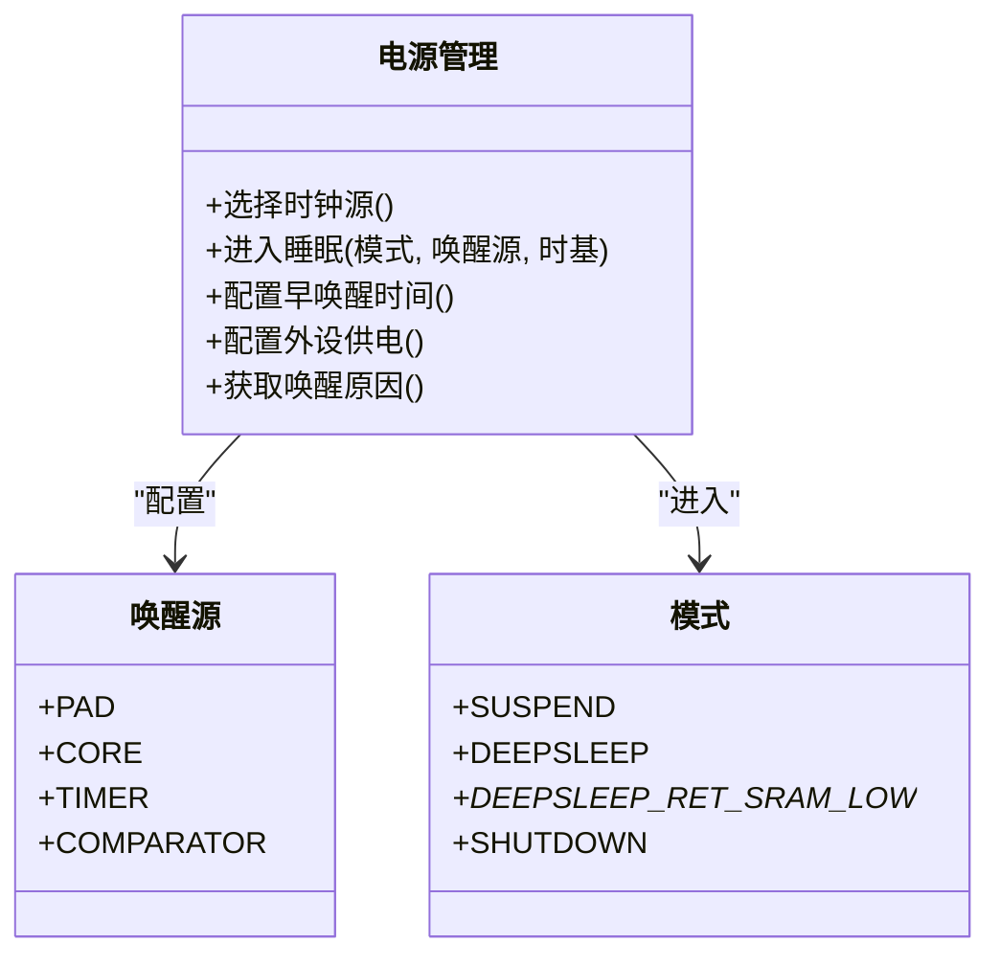
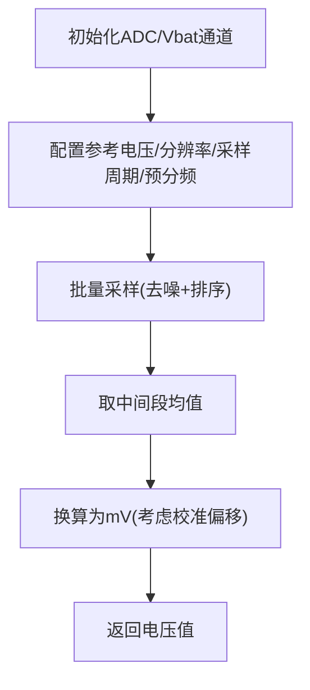
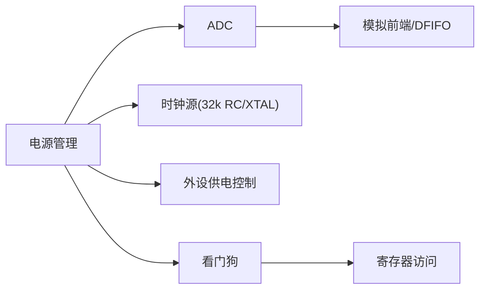

# 电源管理驱动

<cite>
**本文引用的文件**
- [watchdog.c](file://tc_ble_single_sdk/drivers/B85/watchdog.c)
- [watchdog.h](file://tc_ble_single_sdk/drivers/B85/watchdog.h)
- [pm.h](file://tc_ble_single_sdk/drivers/B85/lib/include/pm.h)
- [adc.c](file://tc_ble_single_sdk/drivers/B85/adc.c)
- [adc.h](file://tc_ble_single_sdk/drivers/B85/adc.h)
</cite>

## 目录
1. [简介](#简介)
2. [项目结构](#项目结构)
3. [核心组件](#核心组件)
4. [架构总览](#架构总览)
5. [详细组件分析](#详细组件分析)
6. [依赖关系分析](#依赖关系分析)
7. [性能与功耗考量](#性能与功耗考量)
8. [故障排查指南](#故障排查指南)
9. [结论](#结论)
10. [附录](#附录)

## 简介
本文件面向Telink B85平台的电源管理驱动，聚焦看门狗定时器与电源管理模块的实现原理、配置方法、低功耗模式切换与唤醒源配置，以及电池监控（电压采样）、电量估算与充电管理的工程实践。文档同时给出不同工作模式的功耗分析与优化建议，并说明系统在休眠状态下的外设控制与状态保持机制。内容基于仓库中B85的驱动头文件与实现文件进行提炼与归纳，便于开发者快速掌握正确用法与最佳实践。

## 项目结构
本SDK在drivers/B85目录下提供底层驱动：
- watchdog.c/.h：看门狗定时器的初始化、喂狗、启停与复位标志清除。
- pm.h：电源管理接口定义，包括睡眠/深度睡眠/关机模式、唤醒源、早唤醒时间参数、外部/内部32k时钟选择等。
- adc.c/.h：ADC驱动，支持GPIO电压采样、Vbat分压采样、参考电压与分辨率配置、采样周期与预分频设置，并提供批量采样与均值滤波算法。

图表来源
- [pm.h:100-135](file://tc_ble_single_sdk/drivers/B85/lib/include/pm.h#L100-L135)
- [watchdog.h:40-66](file://tc_ble_single_sdk/drivers/B85/watchdog.h#L40-L66)
- [adc.h:31-172](file://tc_ble_single_sdk/drivers/B85/adc.h#L31-L172)

章节来源
- [pm.h:100-135](file://tc_ble_single_sdk/drivers/B85/lib/include/pm.h#L100-L135)
- [watchdog.h:40-66](file://tc_ble_single_sdk/drivers/B85/watchdog.h#L40-L66)
- [adc.h:31-172](file://tc_ble_single_sdk/drivers/B85/adc.h#L31-L172)

## 核心组件
- 看门狗定时器：提供超时保护与自动复位能力，支持设置捕获值（间隔）与启停、清标志。
- 电源管理：支持SUSPEND、DEEPSLEEP（含SRAM保留）、SHUTDOWN等模式；可配置唤醒源（PAD、CORE、TIMER、比较器）；提供早唤醒时间与硬件延迟参数；支持内部/外部32k时钟选择与稳定检测。
- ADC与电池监控：支持多通道、差分/单端输入、多种参考电压与分辨率；提供Vbat采样路径与校准系数；内置采样缓冲与均值滤波，输出mV级电压值。

章节来源
- [watchdog.c:26-41](file://tc_ble_single_sdk/drivers/B85/watchdog.c#L26-L41)
- [watchdog.h:40-66](file://tc_ble_single_sdk/drivers/B85/watchdog.h#L40-L66)
- [pm.h:100-135](file://tc_ble_single_sdk/drivers/B85/lib/include/pm.h#L100-L135)
- [adc.c:293-406](file://tc_ble_single_sdk/drivers/B85/adc.c#L293-L406)
- [adc.h:31-172](file://tc_ble_single_sdk/drivers/B85/adc.h#L31-L172)

## 架构总览
电源管理由“时钟源选择 + 睡眠/唤醒控制 + 外设供电管理”构成；看门狗作为独立安全机制，通过定时器捕获值触发复位；ADC用于电池电压采集，为电量估算与充电策略提供数据基础。

图表来源
- [pm.h:421-441](file://tc_ble_single_sdk/drivers/B85/lib/include/pm.h#L421-L441)
- [watchdog.c:35-41](file://tc_ble_single_sdk/drivers/B85/watchdog.c#L35-L41)
- [watchdog.h:45-66](file://tc_ble_single_sdk/drivers/B85/watchdog.h#L45-L66)
- [adc.c:379-406](file://tc_ble_single_sdk/drivers/B85/adc.c#L379-L406)
- [adc.c:417-516](file://tc_ble_single_sdk/drivers/B85/adc.c#L417-L516)

## 详细组件分析

### 看门狗定时器
- 功能要点
  - 设置捕获值（间隔）：wd_set_interval_ms(period_ms, tick_per_ms)，将period_ms转换为捕获计数写入定时器捕获寄存器，达到后触发复位。
  - 启停控制：wd_start()启用看门狗；wd_stop()禁用看门狗。
  - 清标志：wd_clear()写标志位以清除看门狗中断/复位标志。
- 关键行为
  - 实际捕获值仅高14位有效，存在量化误差，计算公式见函数注释。
  - 建议在修改捕获值前先停止看门狗，避免中间值导致异常复位。
- 使用流程（推荐）
  - 停止看门狗 -> 设置间隔 -> 启动看门狗 -> 运行期周期性喂狗（重置捕获值或清标志）。

图表来源
- [watchdog.c:35-41](file://tc_ble_single_sdk/drivers/B85/watchdog.c#L35-L41)
- [watchdog.h:45-66](file://tc_ble_single_sdk/drivers/B85/watchdog.h#L45-L66)

章节来源
- [watchdog.c:26-41](file://tc_ble_single_sdk/drivers/B85/watchdog.c#L26-L41)
- [watchdog.h:40-66](file://tc_ble_single_sdk/drivers/B85/watchdog.h#L40-L66)

### 电源管理模块
- 工作模式
  - SUSPEND_MODE：挂起模式，射频/基带寄存器恢复默认，需重新配置。
  - DEEPSLEEP_MODE / DEEPSLEEP_MODE_RET_SRAM_*：深度睡眠，可选择保留低容量SRAM。
  - SHUTDOWN_MODE：关机模式。
- 唤醒源
  - PAD（GPIO）、CORE（内核事件）、TIMER（定时器）、COMPARATOR（比较器/LPC）。
  - 注意LPC唤醒前需等待约100us，且输入与参考电压差需大于30mV。
- 时钟与早唤醒
  - 支持内部32k RC与外部32k晶振两种时钟源选择。
  - 提供早唤醒时间与硬件延迟参数配置，适配不同晶振启动特性。
- 外设供电控制
  - 可在进入睡眠前关闭BASEBAND/USB/AUDIO以降低电流，唤醒后需重新初始化。
- 典型调用
  - blc_pm_select_internal_32k_crystal()/blc_pm_select_external_32k_crystal()选择时钟源。
  - cpu_sleep_wakeup_32k_rc()/cpu_sleep_wakeup_32k_xtal()进入睡眠并指定唤醒源与时基。
  - pm_set_suspend_power_cfg()控制外设供电。

图表来源
- [pm.h:100-135](file://tc_ble_single_sdk/drivers/B85/lib/include/pm.h#L100-L135)
- [pm.h:270-279](file://tc_ble_single_sdk/drivers/B85/lib/include/pm.h#L270-L279)
- [pm.h:421-441](file://tc_ble_single_sdk/drivers/B85/lib/include/pm.h#L421-L441)

章节来源
- [pm.h:100-135](file://tc_ble_single_sdk/drivers/B85/lib/include/pm.h#L100-L135)
- [pm.h:270-279](file://tc_ble_single_sdk/drivers/B85/lib/include/pm.h#L270-L279)
- [pm.h:421-441](file://tc_ble_single_sdk/drivers/B85/lib/include/pm.h#L421-L441)

### ADC与电池监控
- 通道与输入模式
  - 支持左/右/MISC通道，单端/差分输入模式可选。
  - 参考电压可选0.6V/0.9V/1.2V/VBAT分压。
- 分辨率与采样
  - 分辨率8/10/12/14位可调；采样周期可配置；支持预分频。
- Vbat采样
  - 提供adc_vbat_init()配置Vbat采样路径与分压；adc_sample_and_get_result()批量采样并取均值，输出mV。
- 校准
  - 支持两点和工厂EFUSE校准，提升测量精度。
- 手动模式
  - 提供adc_sample_and_get_result_manual_mode()直接读取原始数据，适用于特定时序需求。

图表来源
- [adc.c:379-406](file://tc_ble_single_sdk/drivers/B85/adc.c#L379-L406)
- [adc.c:417-516](file://tc_ble_single_sdk/drivers/B85/adc.c#L417-L516)
- [adc.h:31-172](file://tc_ble_single_sdk/drivers/B85/adc.h#L31-L172)

章节来源
- [adc.c:293-406](file://tc_ble_single_sdk/drivers/B85/adc.c#L293-L406)
- [adc.c:417-516](file://tc_ble_single_sdk/drivers/B85/adc.c#L417-L516)
- [adc.h:31-172](file://tc_ble_single_sdk/drivers/B85/adc.h#L31-L172)

## 依赖关系分析
- 看门狗依赖定时器与看门狗控制寄存器，通过捕获值触发复位。
- 电源管理依赖时钟子系统（32k RC/外部晶振），并通过回调/钩子注册在进入睡眠前的处理函数。
- ADC依赖模拟前端与DFIFO，采样结果经软件滤波后输出。

图表来源
- [watchdog.c:35-41](file://tc_ble_single_sdk/drivers/B85/watchdog.c#L35-L41)
- [pm.h:421-441](file://tc_ble_single_sdk/drivers/B85/lib/include/pm.h#L421-L441)
- [adc.c:293-406](file://tc_ble_single_sdk/drivers/B85/adc.c#L293-L406)

章节来源
- [watchdog.c:35-41](file://tc_ble_single_sdk/drivers/B85/watchdog.c#L35-L41)
- [pm.h:421-441](file://tc_ble_single_sdk/drivers/B85/lib/include/pm.h#L421-L441)
- [adc.c:293-406](file://tc_ble_single_sdk/drivers/B85/adc.c#L293-L406)

## 性能与功耗考量
- 低功耗模式选择
  - SUSPEND：适合短时休眠，唤醒快但功耗高于深度睡眠。
  - DEEPSLEEP_RET_SRAM_*：保留少量SRAM，适合需要快速恢复上下文的应用。
  - SHUTDOWN：最低功耗，需完整冷启动恢复。
- 唤醒源优化
  - 优先使用低功耗唤醒源（如TIMER、比较器），减少PAD唤醒带来的额外开销。
  - LPC唤醒需满足最小电压差条件，避免无法入眠或崩溃。
- 外设供电
  - 进入睡眠前关闭BASEBAND/USB/AUDIO，显著降低漏电流；唤醒后按需重新初始化。
- 时钟与早唤醒
  - 根据晶振特性调整早唤醒时间与硬件延迟，避免不稳定导致的重启。
- 看门狗
  - 合理设置间隔，避免频繁喂狗增加CPU占用；确保在关键路径及时喂狗。
- ADC采样
  - 批量采样与均值滤波提高精度；适当降低采样率与分辨率以减少功耗。

[本节为通用指导，不直接分析具体文件]

## 故障排查指南
- 看门狗相关
  - 现象：设备无规律复位。
  - 排查：确认是否按“停止->设置间隔->启动”的顺序操作；检查是否在关键路径周期性喂狗；核对tick_per_ms与实际系统时钟匹配。
  - 参考
    - [watchdog.c:35-41](file://tc_ble_single_sdk/drivers/B85/watchdog.c#L35-L41)
    - [watchdog.h:45-66](file://tc_ble_single_sdk/drivers/B85/watchdog.h#L45-L66)
- 电源管理相关
  - 现象：无法进入睡眠或唤醒后异常。
  - 排查：确认唤醒源配置与引脚极性；检查LPC唤醒前后等待时间与电压差；验证早唤醒时间与晶振稳定性；必要时调整pm_set_wakeup_time_param()。
  - 参考
    - [pm.h:120-135](file://tc_ble_single_sdk/drivers/B85/lib/include/pm.h#L120-L135)
    - [pm.h:473-504](file://tc_ble_single_sdk/drivers/B85/lib/include/pm.h#L473-L504)
- ADC与电池监控
  - 现象：电压读数漂移或不准确。
  - 排查：确认参考电压与分压配置；检查校准系数与偏移；确保采样间隔满足至少两倍采样周期；使用批量采样与均值滤波。
  - 参考
    - [adc.c:379-406](file://tc_ble_single_sdk/drivers/B85/adc.c#L379-L406)
    - [adc.c:417-516](file://tc_ble_single_sdk/drivers/B85/adc.c#L417-L516)

章节来源
- [watchdog.c:35-41](file://tc_ble_single_sdk/drivers/B85/watchdog.c#L35-L41)
- [watchdog.h:45-66](file://tc_ble_single_sdk/drivers/B85/watchdog.h#L45-L66)
- [pm.h:120-135](file://tc_ble_single_sdk/drivers/B85/lib/include/pm.h#L120-L135)
- [pm.h:473-504](file://tc_ble_single_sdk/drivers/B85/lib/include/pm.h#L473-L504)
- [adc.c:379-406](file://tc_ble_single_sdk/drivers/B85/adc.c#L379-L406)
- [adc.c:417-516](file://tc_ble_single_sdk/drivers/B85/adc.c#L417-L516)

## 结论
本SDK提供了完善的看门狗与电源管理驱动，结合ADC可实现可靠的电池监控与低功耗策略。通过合理配置看门狗间隔、选择合适的睡眠模式与唤醒源、优化外设供电与时钟参数，可以在保证系统稳定性的前提下最大化延长电池寿命。对于高精度电压测量，应充分利用ADC的校准与滤波能力。

[本节为总结性内容，不直接分析具体文件]

## 附录
- 看门狗使用示例（步骤）
  - 停止看门狗 -> 设置捕获间隔 -> 启动看门狗 -> 运行期周期性喂狗（重置捕获值或清标志）。
  - 参考路径
    - [watchdog.c:35-41](file://tc_ble_single_sdk/drivers/B85/watchdog.c#L35-L41)
    - [watchdog.h:45-66](file://tc_ble_single_sdk/drivers/B85/watchdog.h#L45-L66)
- 电源管理使用示例（步骤）
  - 选择32k时钟源 -> 配置唤醒源 -> 进入睡眠 -> 唤醒后读取唤醒原因并恢复外设。
  - 参考路径
    - [pm.h:421-441](file://tc_ble_single_sdk/drivers/B85/lib/include/pm.h#L421-L441)
    - [pm.h:270-279](file://tc_ble_single_sdk/drivers/B85/lib/include/pm.h#L270-L279)
- 电池监控使用示例（步骤）
  - 初始化Vbat通道 -> 配置参考电压/分辨率/采样周期 -> 批量采样并取均值 -> 换算为mV。
  - 参考路径
    - [adc.c:379-406](file://tc_ble_single_sdk/drivers/B85/adc.c#L379-L406)
    - [adc.c:417-516](file://tc_ble_single_sdk/drivers/B85/adc.c#L417-L516)

[本节为补充信息，不直接分析具体文件]