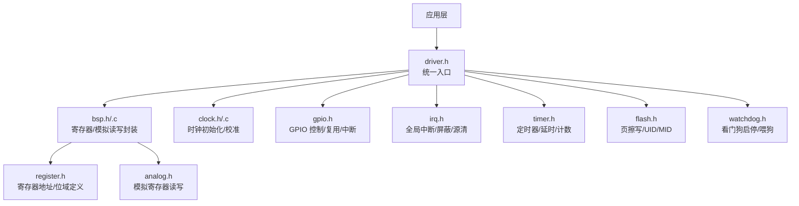
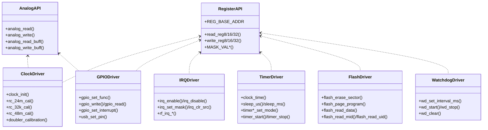
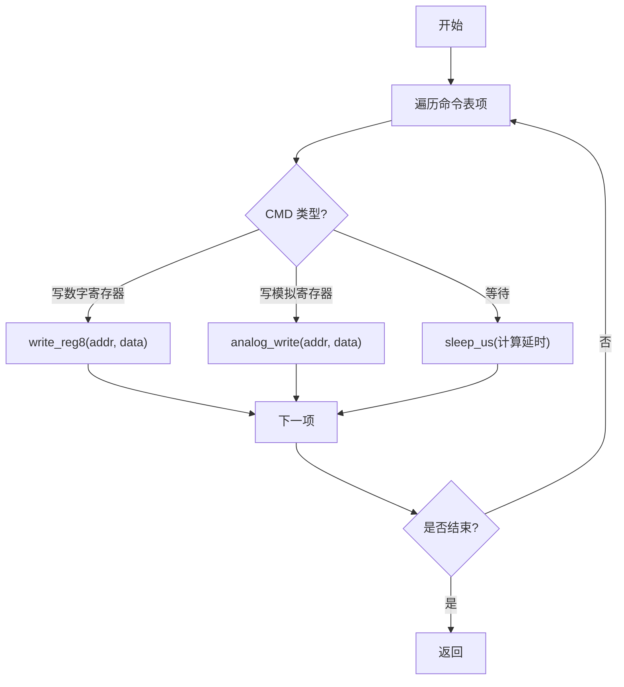
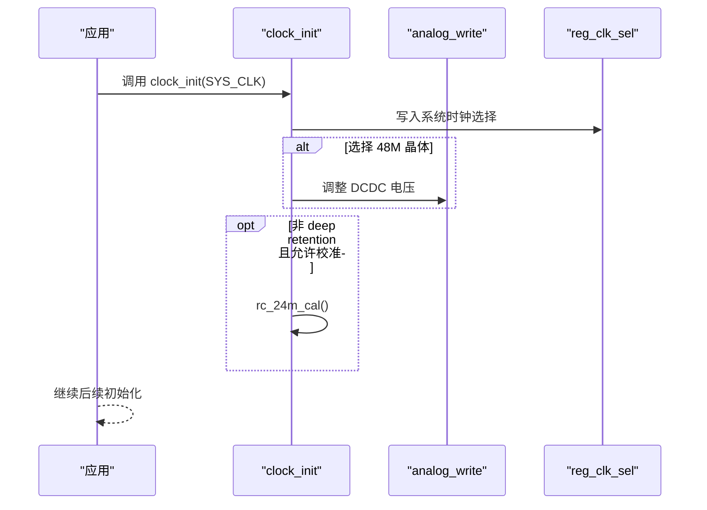
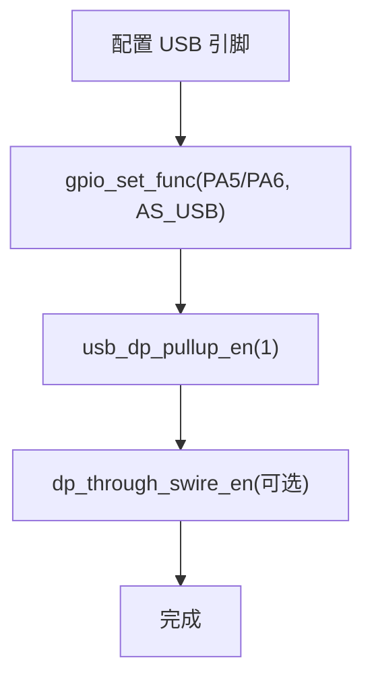
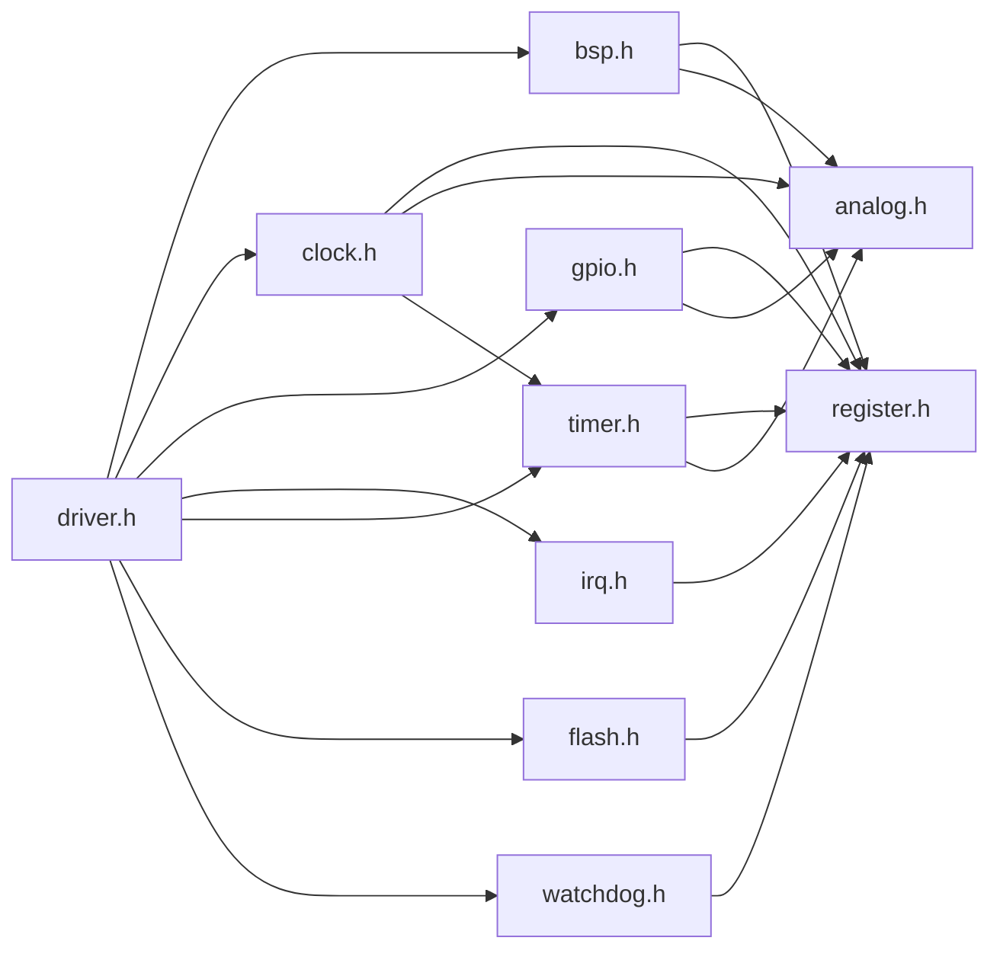

# 硬件抽象层

<cite>
**本文引用的文件**
- [bsp.h](file://tc_ble_single_sdk/drivers/B85/bsp.h)
- [bsp.c](file://tc_ble_single_sdk/drivers/B85/bsp.c)
- [register.h](file://tc_ble_single_sdk/drivers/B85/register.h)
- [clock.h](file://tc_ble_single_sdk/drivers/B85/clock.h)
- [clock.c](file://tc_ble_single_sdk/drivers/B85/clock.c)
- [gpio.h](file://tc_ble_single_sdk/drivers/B85/gpio.h)
- [irq.h](file://tc_ble_single_sdk/drivers/B85/irq.h)
- [timer.h](file://tc_ble_single_sdk/drivers/B85/timer.h)
- [analog.h](file://tc_ble_single_sdk/drivers/B85/analog.h)
- [flash.h](file://tc_ble_single_sdk/drivers/B85/flash.h)
- [watchdog.h](file://tc_ble_single_sdk/drivers/B85/watchdog.h)
- [driver.h](file://tc_ble_single_sdk/drivers/B85/driver.h)
- [tl_common.h](file://tc_ble_single_sdk/tl_common.h)
</cite>

## 目录
1. [简介](#简介)
2. [项目结构](#项目结构)
3. [核心组件](#核心组件)
4. [架构总览](#架构总览)
5. [详细组件分析](#详细组件分析)
6. [依赖关系分析](#依赖关系分析)
7. [性能考量](#性能考量)
8. [故障排查指南](#故障排查指南)
9. [结论](#结论)
10. [附录](#附录)

## 简介
本文件面向 Telink B85M 音频鼠标 SDK 的硬件抽象层（BSP），系统性阐述其设计目标、模块划分与实现要点。重点覆盖：
- 寄存器访问封装与位操作宏
- 时钟树配置与校准流程（系统主时钟、32K、24M RC、48M）
- 系统初始化流程（启动后时钟、模拟域、GPIO、中断等）
- 内存映射与外设寄存器定义
- 中断向量与屏蔽管理
- 定时器、看门狗、Flash 驱动接口
- 多芯片平台适配策略（B85/B87/TC321X）
- 调试接口、诊断方法与常见故障定位

该 BSP 通过统一的 C 接口屏蔽底层寄存器差异，为上层应用提供稳定、可移植的编程模型。

## 项目结构
BSP 位于 drivers/B85 目录下，按“功能域”组织：
- 基础抽象：bsp.h/.c、register.h、analog.h
- 时钟：clock.h/.c
- GPIO：gpio.h
- 中断：irq.h
- 定时器：timer.h
- Flash：flash.h
- 看门狗：watchdog.h
- 统一入口：driver.h（聚合各驱动头文件）
- 公共头：tl_common.h（SDK 公共能力聚合）

图表来源
- [driver.h:28-64](file://tc_ble_single_sdk/drivers/B85/driver.h#L28-L64)
- [bsp.h:98-118](file://tc_ble_single_sdk/drivers/B85/bsp.h#L98-L118)
- [clock.h:50-168](file://tc_ble_single_sdk/drivers/B85/clock.h#L50-L168)
- [gpio.h:39-125](file://tc_ble_single_sdk/drivers/B85/gpio.h#L39-L125)
- [irq.h:28-168](file://tc_ble_single_sdk/drivers/B85/irq.h#L28-L168)
- [timer.h:31-198](file://tc_ble_single_sdk/drivers/B85/timer.h#L31-L198)
- [flash.h:29-325](file://tc_ble_single_sdk/drivers/B85/flash.h#L29-L325)
- [watchdog.h:29-68](file://tc_ble_single_sdk/drivers/B85/watchdog.h#L29-L68)

章节来源
- [driver.h:28-64](file://tc_ble_single_sdk/drivers/B85/driver.h#L28-L64)
- [tl_common.h:27-53](file://tc_ble_single_sdk/tl_common.h#L27-L53)

## 核心组件
- 寄存器访问封装：提供 REG_BASE_ADDR 基址与 read/write 宏，支持 8/16/32 位访问；提供 MASK_VAL 系列位域构造宏；提供 sub_wr/sub_wr_ana 对数字/模拟寄存器进行位域安全写入；LoadTblCmdSet 批量下发命令表（含等待）。
- 时钟子系统：clock_init 设置系统时钟源并记录类型；rc_24m_cal/rc_32k_cal/rc_48m_cal 完成 RC 校准；doubler_calibration 倍频校准；dmic_prob_* 选择 DMIC 时钟源；支持在 deep retention 唤醒时跳过校准。
- GPIO：统一引脚枚举、复用函数选择、输入输出使能、拉强/上拉下拉、中断极性/使能/清除、USB DP/DM 复用与内部上拉控制。
- 中断：全局开/关/恢复、类型屏蔽、源读取与清零；RF 中断独立屏蔽与状态获取。
- 定时器：系统 tick 读取、微秒/毫秒延时、三种模式（系统时钟/GPIO 触发/GPIO 宽度）、捕获与比较、中断状态清/读。
- Flash：页擦除、页编程、数据读取、MID/UID 读取、厂商识别、VDD_F 校准值读取；提供读写函数指针替换以适配不同 Flash 控制器。
- 看门狗：设置间隔、启动/停止、喂狗、状态清。

章节来源
- [bsp.h:28-118](file://tc_ble_single_sdk/drivers/B85/bsp.h#L28-L118)
- [bsp.c:37-106](file://tc_ble_single_sdk/drivers/B85/bsp.c#L37-L106)
- [clock.h:50-168](file://tc_ble_single_sdk/drivers/B85/clock.h#L50-L168)
- [clock.c:50-308](file://tc_ble_single_sdk/drivers/B85/clock.c#L50-L308)
- [gpio.h:39-561](file://tc_ble_single_sdk/drivers/B85/gpio.h#L39-L561)
- [irq.h:28-168](file://tc_ble_single_sdk/drivers/B85/irq.h#L28-L168)
- [timer.h:31-198](file://tc_ble_single_sdk/drivers/B85/timer.h#L31-L198)
- [flash.h:29-325](file://tc_ble_single_sdk/drivers/B85/flash.h#L29-L325)
- [watchdog.h:29-68](file://tc_ble_single_sdk/drivers/B85/watchdog.h#L29-L68)

## 架构总览
BSP 采用分层设计：
- 最底层：register.h 暴露寄存器地址与位域常量；analog.h 提供模拟寄存器读写；bsp.h/.c 提供通用位操作与批量命令执行。
- 中间层：clock/gpio/irq/timer/flash/watchdog 等驱动基于底层封装实现具体外设逻辑。
- 顶层：driver.h 聚合所有驱动头，作为 BSP 的统一入口；tl_common.h 聚合 SDK 公共能力。

图表来源
- [register.h:28-800](file://tc_ble_single_sdk/drivers/B85/register.h#L28-L800)
- [analog.h:29-66](file://tc_ble_single_sdk/drivers/B85/analog.h#L29-L66)
- [bsp.h:28-118](file://tc_ble_single_sdk/drivers/B85/bsp.h#L28-L118)
- [clock.h:50-168](file://tc_ble_single_sdk/drivers/B85/clock.h#L50-L168)
- [gpio.h:39-561](file://tc_ble_single_sdk/drivers/B85/gpio.h#L39-L561)
- [irq.h:28-168](file://tc_ble_single_sdk/drivers/B85/irq.h#L28-L168)
- [timer.h:31-198](file://tc_ble_single_sdk/drivers/B85/timer.h#L31-L198)
- [flash.h:29-325](file://tc_ble_single_sdk/drivers/B85/flash.h#L29-L325)
- [watchdog.h:29-68](file://tc_ble_single_sdk/drivers/B85/watchdog.h#L29-L68)

## 详细组件分析

### 寄存器访问与位操作封装
- 基址与访问宏：通过 REG_BASE_ADDR 将寄存器映射到固定地址空间，提供 8/16/32 位读写宏，保证 volatile 语义。
- 位操作宏：BIT/BIT_RNG/BIT_MASK_LEN 等简化位域构造；MASK_VALn 系列用于一次性组合多个位域写入。
- 批量命令表：LoadTblCmdSet 支持数字寄存器写、模拟寄存器写、延时等待，便于初始化序列下发。
- 位域安全写入：sub_wr 针对数字寄存器、sub_wr_ana 针对模拟寄存器，先读再改位域再写回，避免破坏其他位。

图表来源
- [bsp.c:37-62](file://tc_ble_single_sdk/drivers/B85/bsp.c#L37-L62)
- [bsp.h:98-118](file://tc_ble_single_sdk/drivers/B85/bsp.h#L98-L118)
- [analog.h:29-66](file://tc_ble_single_sdk/drivers/B85/analog.h#L29-L66)

章节来源
- [bsp.h:28-118](file://tc_ble_single_sdk/drivers/B85/bsp.h#L28-L118)
- [bsp.c:37-106](file://tc_ble_single_sdk/drivers/B85/bsp.c#L37-L106)

### 时钟树配置与校准
- 系统时钟：clock_init 设置 reg_clk_sel，记录 system_clk_type；当选择 48M 晶体时调整 DCDC 电压以保证 Flash 稳定。
- RC 校准：rc_24m_cal 通过模拟寄存器自动校准 24M RC；rc_32k_cal 校准 32K RC；rc_48m_cal 校准 48M RC。
- 倍频校准：doubler_calibration 用于倍频模块校准。
- DMIC 时钟源：dmic_prob_24M_rc/dmic_prob_32k 选择 DMIC 时钟来源。
- 深度睡眠唤醒：若从 deep retention 唤醒且未配置校准，则跳过 24M RC 校准以避免不必要开销。

图表来源
- [clock.c:50-81](file://tc_ble_single_sdk/drivers/B85/clock.c#L50-L81)
- [clock.h:50-168](file://tc_ble_single_sdk/drivers/B85/clock.h#L50-L168)

章节来源
- [clock.c:50-308](file://tc_ble_single_sdk/drivers/B85/clock.c#L50-L308)
- [clock.h:50-168](file://tc_ble_single_sdk/drivers/B85/clock.h#L50-L168)

### GPIO 与复用
- 引脚分组与枚举：PA~PE 组，支持 USB、I2C、SPI、UART、I2S、SDM、ADC 等复用。
- 基本操作：输入/输出使能、电平读写、驱动强度、上拉/下拉、关闭引脚。
- 中断：支持上升/下降沿、RISC0/RISC1 中断路径、中断源清与屏蔽。
- USB 专用：usb_set_pin 将 PA5/PA6 复用为 USB DP/DM，并可启用 dp_through_swire 以便 SWD 与 USB 并存；usb_dp_pullup_en 控制内部上拉。

图表来源
- [gpio.h:549-561](file://tc_ble_single_sdk/drivers/B85/gpio.h#L549-L561)
- [gpio.h:39-125](file://tc_ble_single_sdk/drivers/B85/gpio.h#L39-L125)

章节来源
- [gpio.h:39-561](file://tc_ble_single_sdk/drivers/B85/gpio.h#L39-L561)

### 中断管理
- 全局中断：irq_enable/irq_disable/irq_restore 控制 CPU 中断使能。
- 屏蔽与源：irq_set_mask/irq_disable_type 设置屏蔽；irq_get_src/irq_clr_sel_src/irq_clr_src 读取与清除中断源。
- RF 中断：rf_irq_enable/disable/rf_irq_src_get/rf_irq_clr_src 管理射频相关中断。

章节来源
- [irq.h:28-168](file://tc_ble_single_sdk/drivers/B85/irq.h#L28-L168)

### 定时器与延时
- 系统时间：clock_time 读取系统 tick；sleep_us/sleep_ms 提供精确延时。
- 定时器模式：TIMER_MODE_SYSCLK/TIMER_MODE_GPIO_TRIGGER/TIMER_MODE_GPIO_WIDTH/TIMER_MODE_TICK。
- 控制接口：timer*_set_mode 设置模式/初始计数/捕获值；timer_start/timer_stop 启停；中断状态清/读。

章节来源
- [timer.h:31-198](file://tc_ble_single_sdk/drivers/B85/timer.h#L31-L198)

### Flash 存储
- 页级操作：flash_erase_sector、flash_page_program、flash_read_data。
- 设备识别：flash_read_mid、flash_read_raw_mid、flash_read_uid、flash_get_vendor。
- 电压校准：flash_vdd_f_calib 与 flash_get_vdd_f_calib_value 用于 VDD_F 校准值读取与设置。
- 可插拔实现：flash_change_rw_func 可替换读写函数以适配不同 Flash 控制器。

章节来源
- [flash.h:29-325](file://tc_ble_single_sdk/drivers/B85/flash.h#L29-L325)

### 看门狗
- 设置间隔：wd_set_interval_ms 根据系统时钟 tick_per_ms 计算捕获值。
- 启停与喂狗：wd_start/stop/clear 控制看门狗运行与复位标志清除。

章节来源
- [watchdog.h:29-68](file://tc_ble_single_sdk/drivers/B85/watchdog.h#L29-L68)

## 依赖关系分析
- driver.h 聚合所有驱动头，形成 BSP 对外统一入口。
- bsp.h/.c 依赖 register.h 与 analog.h，为上层提供稳定的寄存器与模拟域访问。
- clock.c 依赖 register.h、analog.h、timer.h、pm.h 与 tl_common.h，完成时钟切换与校准。
- gpio.h 依赖 register.h、analog.h、usbhw.h，实现引脚复用与 USB 相关控制。
- irq.h 依赖 register.h，集中管理中断屏蔽与源。
- timer.h 依赖 register.h、analog.h、gpio.h，提供定时与延时服务。
- flash.h 依赖 compiler.h，提供页级存储接口。
- watchdog.h 依赖 register.h，提供看门狗控制。

图表来源
- [driver.h:28-64](file://tc_ble_single_sdk/drivers/B85/driver.h#L28-L64)
- [bsp.h:98-118](file://tc_ble_single_sdk/drivers/B85/bsp.h#L98-L118)
- [clock.h:50-168](file://tc_ble_single_sdk/drivers/B85/clock.h#L50-L168)
- [gpio.h:39-561](file://tc_ble_single_sdk/drivers/B85/gpio.h#L39-L561)
- [irq.h:28-168](file://tc_ble_single_sdk/drivers/B85/irq.h#L28-L168)
- [timer.h:31-198](file://tc_ble_single_sdk/drivers/B85/timer.h#L31-L198)
- [flash.h:29-325](file://tc_ble_single_sdk/drivers/B85/flash.h#L29-L325)
- [watchdog.h:29-68](file://tc_ble_single_sdk/drivers/B85/watchdog.h#L29-L68)

章节来源
- [driver.h:28-64](file://tc_ble_single_sdk/drivers/B85/driver.h#L28-L64)

## 性能考量
- 时钟切换期间 DMA 暂停：避免在 DMA 收发过程中切换系统时钟，防止数据丢失。
- 校准时机：首次上电或深度睡眠唤醒后尽快校准 24M RC；USB 通信期间不要执行校准，以免通信异常。
- 高频率场景：48M 晶体需提升 DCDC 电压以确保 Flash 稳定。
- 看门狗：长耗时操作（如 Flash 擦除）前需提前喂狗，避免误复位。
- 位域写入：使用 sub_wr/sub_wr_ana 进行位域安全修改，减少总线事务与潜在竞争。

[本节为通用指导，不直接分析具体文件]

## 故障排查指南
- 无法进入中断：检查 irq_set_mask 是否正确设置；确认 reg_irq_en 已开启；核对中断源是否已清除。
- GPIO 无响应：确认 gpio_set_func 已正确配置复用；检查输入/输出使能；验证上拉/下拉与驱动强度；必要时关闭引脚后再重新配置。
- USB 通信异常：确认 usb_set_pin 已调用；检查 dp_through_swire 配置；确保内部上拉已启用；避免在校准期间进行 USB 传输。
- 时钟不稳定：确认已完成相应 RC 校准；若使用 48M 晶体，检查 DCDC 电压设置；避免在 USB 传输中执行校准。
- 看门狗复位：检查 wd_set_interval_ms 设置是否合理；长耗时操作前及时喂狗；确认定时器状态位已正确清除。
- Flash 读写失败：确认电源电压满足安全阈值；先读取 MID 再选择 UID 命令；必要时执行 VDD_F 校准。

章节来源
- [irq.h:28-168](file://tc_ble_single_sdk/drivers/B85/irq.h#L28-L168)
- [gpio.h:39-561](file://tc_ble_single_sdk/drivers/B85/gpio.h#L39-L561)
- [clock.c:50-308](file://tc_ble_single_sdk/drivers/B85/clock.c#L50-L308)
- [flash.h:29-325](file://tc_ble_single_sdk/drivers/B85/flash.h#L29-L325)
- [watchdog.h:29-68](file://tc_ble_single_sdk/drivers/B85/watchdog.h#L29-L68)

## 结论
该 BSP 通过清晰的层次化设计与稳定的寄存器/模拟域封装，为上层提供了统一的硬件抽象接口。时钟、GPIO、中断、定时器、Flash、看门狗等模块均提供完备 API，并考虑了低功耗、实时性与稳定性需求。借助 driver.h 的统一入口与多平台目录结构，可在 B85/B87/TC321X 等平台间平滑移植，屏蔽底层差异，提高代码复用率与维护性。

[本节为总结性内容，不直接分析具体文件]

## 附录
- 内存映射要点：寄存器基址 REG_BASE_ADDR 统一映射；各外设寄存器地址在 register.h 中集中定义，便于跨模块引用。
- 中断向量表：本 SDK 未在此处展开，通常由启动脚本与链接脚本配置；BSP 提供中断屏蔽与源管理接口供上层绑定 ISR。
- 设备树管理：本 BSP 未采用设备树机制，外设配置通过 C 宏与 API 完成，适合资源受限 MCU。
- 多平台适配策略：drivers/B85、drivers/B87、drivers/TC321X 分别实现对应芯片的驱动细节；上层通过 driver.h 统一包含，编译期选择目标平台。
- 调试接口：uart、swire、USB 等可用于调试输出与烧录；结合 printf/u_printf 与日志工具进行问题定位。

[本节为概念性说明，不直接分析具体文件]