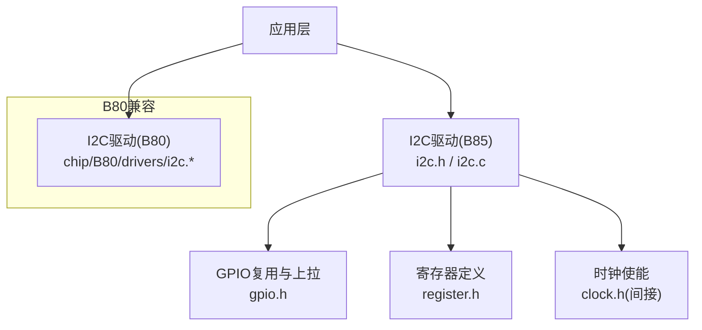
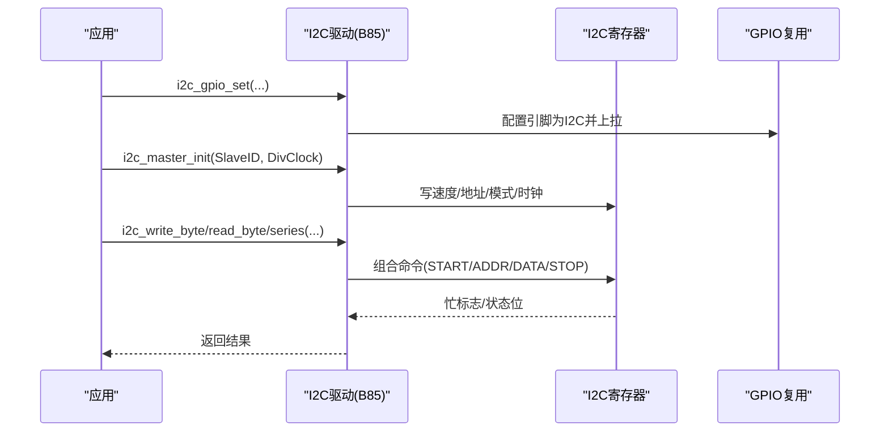
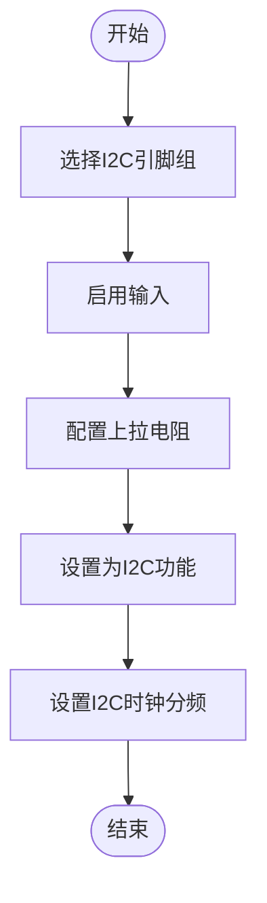
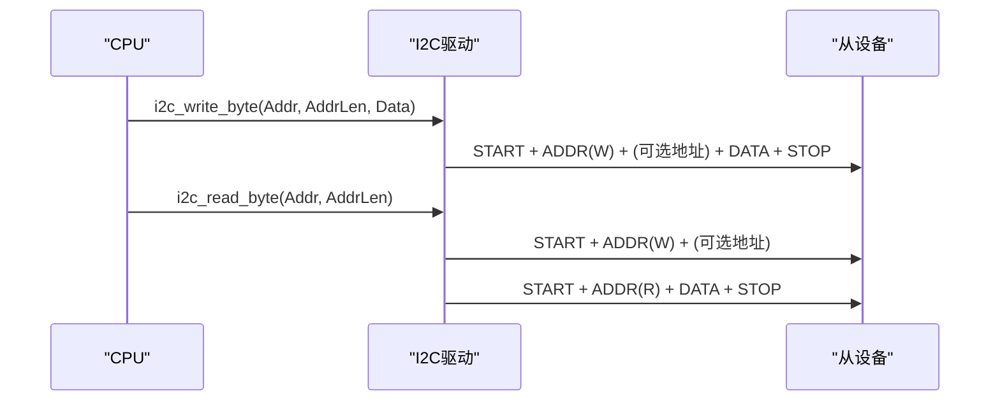
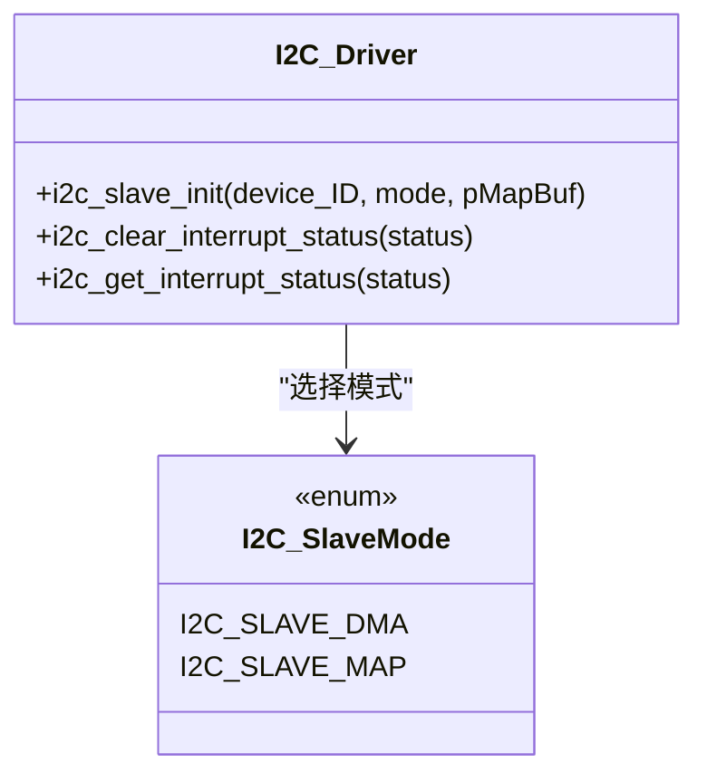
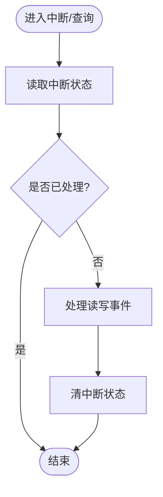
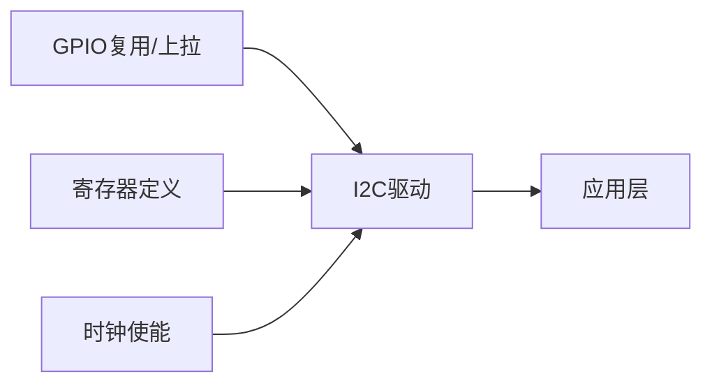

# I2C通信驱动

<cite>
**本文引用的文件**
- [tc_ble_single_sdk/drivers/B85/i2c.h](file://tc_ble_single_sdk/drivers/B85/i2c.h)
- [tc_ble_single_sdk/drivers/B85/i2c.c](file://tc_ble_single_sdk/drivers/B85/i2c.c)
- [tc_ble_single_sdk/drivers/B85/gpio.h](file://tc_ble_single_sdk/drivers/B85/gpio.h)
- [tc_ble_single_sdk/drivers/B85/register.h](file://tc_ble_single_sdk/drivers/B85/register.h)
- [8373_dongle_for_km/chip/B80/drivers/i2c.h](file://8373_dongle_for_km/chip/B80/drivers/i2c.h)
- [8373_dongle_for_km/chip/B80/drivers/i2c.c](file://8373_dongle_for_km/chip/B80/drivers/i2c.c)
</cite>

## 目录
1. [简介](#简介)
2. [项目结构](#项目结构)
3. [核心组件](#核心组件)
4. [架构总览](#架构总览)
5. [详细组件分析](#详细组件分析)
6. [依赖关系分析](#依赖关系分析)
7. [性能考虑](#性能考虑)
8. [故障排查指南](#故障排查指南)
9. [结论](#结论)
10. [附录](#附录)

## 简介
本文件面向Telink B85芯片的I2C通信驱动，系统性阐述I2C协议在B85上的实现方式，覆盖主/从模式配置、GPIO引脚选择、时钟分频、设备地址管理、单字节与批量读写、DMA与映射模式差异、中断与错误处理、多设备通信策略以及性能优化与常见问题解决方案。文档以SDK中B85的I2C驱动源码为依据，提供可追溯的代码片段路径与图示，便于读者快速定位并正确集成到实际项目中。

## 项目结构
B85平台的I2C驱动位于drivers/B85目录下，包含头文件与源文件；同时存在B80平台兼容版本，接口基本一致但引脚复用逻辑略有差异。寄存器定义集中在register.h中，GPIO功能复用与上拉配置在gpio.h中。

图表来源
- [tc_ble_single_sdk/drivers/B85/i2c.h:1-198](file://tc_ble_single_sdk/drivers/B85/i2c.h#L1-L198)
- [tc_ble_single_sdk/drivers/B85/i2c.c:1-355](file://tc_ble_single_sdk/drivers/B85/i2c.c#L1-L355)
- [tc_ble_single_sdk/drivers/B85/gpio.h:1-200](file://tc_ble_single_sdk/drivers/B85/gpio.h#L1-L200)
- [tc_ble_single_sdk/drivers/B85/register.h:34-88](file://tc_ble_single_sdk/drivers/B85/register.h#L34-L88)
- [8373_dongle_for_km/chip/B80/drivers/i2c.h:1-187](file://8373_dongle_for_km/chip/B80/drivers/i2c.h#L1-L187)
- [8373_dongle_for_km/chip/B80/drivers/i2c.c:1-325](file://8373_dongle_for_km/chip/B80/drivers/i2c.c#L1-L325)

章节来源
- [tc_ble_single_sdk/drivers/B85/i2c.h:1-198](file://tc_ble_single_sdk/drivers/B85/i2c.h#L1-L198)
- [tc_ble_single_sdk/drivers/B85/i2c.c:1-355](file://tc_ble_single_sdk/drivers/B85/i2c.c#L1-L355)
- [tc_ble_single_sdk/drivers/B85/gpio.h:1-200](file://tc_ble_single_sdk/drivers/B85/gpio.h#L1-L200)
- [tc_ble_single_sdk/drivers/B85/register.h:34-88](file://tc_ble_single_sdk/drivers/B85/register.h#L34-L88)
- [8373_dongle_for_km/chip/B80/drivers/i2c.h:1-187](file://8373_dongle_for_km/chip/B80/drivers/i2c.h#L1-L187)
- [8373_dongle_for_km/chip/B80/drivers/i2c.c:1-325](file://8373_dongle_for_km/chip/B80/drivers/i2c.c#L1-L325)

## 核心组件
- I2C GPIO复用与上拉：将指定引脚切换为I2C功能，并启用内部上拉电阻，确保总线空闲时高电平。
- 主模式初始化：设置从机地址（用于寻址）、时钟分频、开启主模式、使能I2C时钟。
- 从模式初始化：设置从机地址、选择DMA或映射模式、配置映射缓冲区基址。
- 数据访问API：单字节读写、批量读写（支持0/1/2/3字节地址长度）。
- 中断状态查询与清除：提供从机侧中断状态读取与清零接口。

章节来源
- [tc_ble_single_sdk/drivers/B85/i2c.h:31-198](file://tc_ble_single_sdk/drivers/B85/i2c.h#L31-L198)
- [tc_ble_single_sdk/drivers/B85/i2c.c:37-125](file://tc_ble_single_sdk/drivers/B85/i2c.c#L37-L125)
- [tc_ble_single_sdk/drivers/B85/register.h:34-88](file://tc_ble_single_sdk/drivers/B85/register.h#L34-L88)

## 架构总览
B85的I2C控制器通过一组控制寄存器完成时序生成与数据搬运。驱动层封装了底层寄存器操作，向上提供简洁的API。主模式下，CPU通过写控制寄存器触发Start/Addr/Data/Stop等命令；从模式下，支持DMA与映射两种数据缓冲方式，降低CPU参与程度。

图表来源
- [tc_ble_single_sdk/drivers/B85/i2c.c:87-95](file://tc_ble_single_sdk/drivers/B85/i2c.c#L87-L95)
- [tc_ble_single_sdk/drivers/B85/i2c.c:135-174](file://tc_ble_single_sdk/drivers/B85/i2c.c#L135-L174)
- [tc_ble_single_sdk/drivers/B85/i2c.c:182-233](file://tc_ble_single_sdk/drivers/B85/i2c.c#L182-L233)
- [tc_ble_single_sdk/drivers/B85/register.h:34-88](file://tc_ble_single_sdk/drivers/B85/register.h#L34-L88)

## 详细组件分析

### I2C协议与B85控制器要点
- 标准I2C时序由Start、设备地址（含R/W位）、可选地址字段、数据段、Stop组成。
- B85控制器通过命令位组合触发各阶段：ID、ADDR、DO、DI、START、STOP、READ_ID、ACK。
- 状态位指示忙、总线忙、NAK等，驱动在每个命令后轮询忙标志以确保时序正确。

章节来源
- [tc_ble_single_sdk/drivers/B85/register.h:34-88](file://tc_ble_single_sdk/drivers/B85/register.h#L34-L88)
- [tc_ble_single_sdk/drivers/B85/i2c.c:135-174](file://tc_ble_single_sdk/drivers/B85/i2c.c#L135-L174)
- [tc_ble_single_sdk/drivers/B85/i2c.c:182-233](file://tc_ble_single_sdk/drivers/B85/i2c.c#L182-L233)

### GPIO引脚选择与时钟分频
- 引脚选择：B85支持多组I2C引脚复用，如A3/A4、B6/D7、C0/C1、C2/C3。函数会启用输入、上拉并设置为I2C功能。
- 时钟分频：主模式初始化时写入分频值，I2C时钟=系统时钟/(4×DivClock)。合理设置分频以满足目标速率。

图表来源
- [tc_ble_single_sdk/drivers/B85/i2c.c:37-75](file://tc_ble_single_sdk/drivers/B85/i2c.c#L37-L75)
- [tc_ble_single_sdk/drivers/B85/i2c.c:87-95](file://tc_ble_single_sdk/drivers/B85/i2c.c#L87-L95)
- [tc_ble_single_sdk/drivers/B85/gpio.h:95-151](file://tc_ble_single_sdk/drivers/B85/gpio.h#L95-L151)

章节来源
- [tc_ble_single_sdk/drivers/B85/i2c.c:37-95](file://tc_ble_single_sdk/drivers/B85/i2c.c#L37-L95)
- [tc_ble_single_sdk/drivers/B85/gpio.h:95-151](file://tc_ble_single_sdk/drivers/B85/gpio.h#L95-L151)

### 主模式配置与使用
- 初始化：设置SlaveID（用于寻址）、DivClock、开启主模式、使能I2C时钟。
- 单字节写：先写地址（支持0/1/2/3字节），再写数据，最后Stop。
- 单字节读：先写地址，再发起Read ID并ACK，读取数据，最后Stop。
- 批量写/读：循环写入/读取数据，注意读序列最后一个字节需ACK，其余为NACK。

图表来源
- [tc_ble_single_sdk/drivers/B85/i2c.c:135-174](file://tc_ble_single_sdk/drivers/B85/i2c.c#L135-L174)
- [tc_ble_single_sdk/drivers/B85/i2c.c:182-233](file://tc_ble_single_sdk/drivers/B85/i2c.c#L182-L233)
- [tc_ble_single_sdk/drivers/B85/i2c.c:242-286](file://tc_ble_single_sdk/drivers/B85/i2c.c#L242-L286)
- [tc_ble_single_sdk/drivers/B85/i2c.c:296-353](file://tc_ble_single_sdk/drivers/B85/i2c.c#L296-L353)

章节来源
- [tc_ble_single_sdk/drivers/B85/i2c.c:87-95](file://tc_ble_single_sdk/drivers/B85/i2c.c#L87-L95)
- [tc_ble_single_sdk/drivers/B85/i2c.c:135-353](file://tc_ble_single_sdk/drivers/B85/i2c.c#L135-L353)

### 从模式配置：DMA模式与映射模式
- DMA模式：所有SRAM区域可作为数据缓冲，主设备在I2C总线上发送3字节SRAM地址进行读写。适用于灵活地址访问。
- 映射模式：通过映射寄存器配置固定缓冲区基址，主设备无需发送地址字段，直接读写数据。读/写缓冲区由硬件管理偏移（写pMapBuf，读pMapBuf+64）。
- 两种模式均启用地址自动递增，简化连续数据传输。

图表来源
- [tc_ble_single_sdk/drivers/B85/i2c.h:44-70](file://tc_ble_single_sdk/drivers/B85/i2c.h#L44-L70)
- [tc_ble_single_sdk/drivers/B85/i2c.c:105-125](file://tc_ble_single_sdk/drivers/B85/i2c.c#L105-L125)
- [tc_ble_single_sdk/drivers/B85/register.h:75-88](file://tc_ble_single_sdk/drivers/B85/register.h#L75-L88)

章节来源
- [tc_ble_single_sdk/drivers/B85/i2c.h:44-70](file://tc_ble_single_sdk/drivers/B85/i2c.h#L44-L70)
- [tc_ble_single_sdk/drivers/B85/i2c.c:105-125](file://tc_ble_single_sdk/drivers/B85/i2c.c#L105-L125)
- [tc_ble_single_sdk/drivers/B85/register.h:75-88](file://tc_ble_single_sdk/drivers/B85/register.h#L75-L88)

### 单字节与批量传输示例（代码片段路径）
- 单字节写：参考路径 [i2c.c:135-174](file://tc_ble_single_sdk/drivers/B85/i2c.c#L135-L174)
- 单字节读：参考路径 [i2c.c:182-233](file://tc_ble_single_sdk/drivers/B85/i2c.c#L182-L233)
- 批量写：参考路径 [i2c.c:242-286](file://tc_ble_single_sdk/drivers/B85/i2c.c#L242-L286)
- 批量读：参考路径 [i2c.c:296-353](file://tc_ble_single_sdk/drivers/B85/i2c.c#L296-L353)

章节来源
- [tc_ble_single_sdk/drivers/B85/i2c.c:135-353](file://tc_ble_single_sdk/drivers/B85/i2c.c#L135-L353)

### 中断处理机制与错误处理
- 中断状态：提供从机侧中断状态读取与清零接口，区分主机命令触发与仅读触发两类事件。
- 错误处理：通过状态位检测BUSY、BUS_BUSY、NAK等，驱动在每个命令后轮询忙标志，确保时序稳定；若出现NAK，上层应重试或上报错误。

图表来源
- [tc_ble_single_sdk/drivers/B85/i2c.h:178-196](file://tc_ble_single_sdk/drivers/B85/i2c.h#L178-L196)
- [tc_ble_single_sdk/drivers/B85/register.h:82-88](file://tc_ble_single_sdk/drivers/B85/register.h#L82-L88)

章节来源
- [tc_ble_single_sdk/drivers/B85/i2c.h:178-196](file://tc_ble_single_sdk/drivers/B85/i2c.h#L178-L196)
- [tc_ble_single_sdk/drivers/B85/register.h:82-88](file://tc_ble_single_sdk/drivers/B85/register.h#L82-L88)

### 多设备通信中的地址管理与冲突解决
- 地址分配：每个从设备需唯一地址，主设备通过不同SlaveID依次访问。
- 冲突避免：同一时刻仅一个从设备响应；总线空闲后再发起新事务；必要时加入延时或重试机制。
- 地址长度：支持0/1/2/3字节地址，根据从设备规格选择合适长度，避免误寻址。

章节来源
- [tc_ble_single_sdk/drivers/B85/i2c.c:135-174](file://tc_ble_single_sdk/drivers/B85/i2c.c#L135-L174)
- [tc_ble_single_sdk/drivers/B85/i2c.c:182-233](file://tc_ble_single_sdk/drivers/B85/i2c.c#L182-L233)

## 依赖关系分析
- I2C驱动依赖GPIO复用与上拉配置，确保信号完整性。
- 寄存器定义集中管理，驱动通过宏访问控制/状态/数据寄存器。
- 时钟使能由驱动在初始化时完成，保证模块工作。

图表来源
- [tc_ble_single_sdk/drivers/B85/i2c.c:37-95](file://tc_ble_single_sdk/drivers/B85/i2c.c#L37-L95)
- [tc_ble_single_sdk/drivers/B85/register.h:34-88](file://tc_ble_single_sdk/drivers/B85/register.h#L34-L88)

章节来源
- [tc_ble_single_sdk/drivers/B85/i2c.c:37-95](file://tc_ble_single_sdk/drivers/B85/i2c.c#L37-L95)
- [tc_ble_single_sdk/drivers/B85/register.h:34-88](file://tc_ble_single_sdk/drivers/B85/register.h#L34-L88)

## 性能考虑
- 时钟分频：根据系统时钟与目标I2C速率计算DivClock，避免过高导致不稳定。
- 批量传输：优先使用批量读写减少命令开销；读序列最后一个字节ACK，提高吞吐。
- 模式选择：映射模式省去地址字段，适合固定缓冲区场景；DMA模式更灵活，适合动态地址访问。
- 忙等待：驱动在每个命令后轮询忙标志，避免竞争；在高负载系统中建议结合中断或任务调度优化。

[本节为通用指导，不直接分析具体文件]

## 故障排查指南
- 无响应：检查GPIO是否正确复用为I2C并启用上拉；确认时钟已使能；验证SlaveID与从设备匹配。
- NAK错误：检查从设备是否存在、地址是否正确、总线是否有其他占用；适当增加延时并重试。
- 时序异常：确认命令组合正确（START/ADDR/DATA/STOP），避免遗漏或重复；关注BUSY状态。
- 映射模式问题：确认映射缓冲区基址设置正确，且读/写缓冲区偏移符合硬件约定。

章节来源
- [tc_ble_single_sdk/drivers/B85/i2c.c:37-95](file://tc_ble_single_sdk/drivers/B85/i2c.c#L37-L95)
- [tc_ble_single_sdk/drivers/B85/i2c.c:135-353](file://tc_ble_single_sdk/drivers/B85/i2c.c#L135-L353)
- [tc_ble_single_sdk/drivers/B85/register.h:34-88](file://tc_ble_single_sdk/drivers/B85/register.h#L34-L88)

## 结论
B85的I2C驱动提供了完整的主/从模式支持与灵活的缓冲模式，配合清晰的API与寄存器抽象，能够高效实现单字节与批量数据传输。通过合理的GPIO配置、时钟分频、地址管理与错误处理策略，可在多设备场景中稳定运行。建议在高性能需求下采用映射或DMA模式，并结合中断与任务调度进一步优化吞吐与延迟。

[本节为总结性内容，不直接分析具体文件]

## 附录
- 常用API路径索引：
  - GPIO设置：[i2c.c:37-75](file://tc_ble_single_sdk/drivers/B85/i2c.c#L37-L75)
  - 主模式初始化：[i2c.c:87-95](file://tc_ble_single_sdk/drivers/B85/i2c.c#L87-L95)
  - 从模式初始化：[i2c.c:105-125](file://tc_ble_single_sdk/drivers/B85/i2c.c#L105-L125)
  - 单字节读写：[i2c.c:135-233](file://tc_ble_single_sdk/drivers/B85/i2c.c#L135-L233)
  - 批量读写：[i2c.c:242-353](file://tc_ble_single_sdk/drivers/B85/i2c.c#L242-L353)
  - 中断状态：[i2c.h:178-196](file://tc_ble_single_sdk/drivers/B85/i2c.h#L178-L196)
  - 寄存器定义：[register.h:34-88](file://tc_ble_single_sdk/drivers/B85/register.h#L34-L88)

[本节为索引信息，不直接分析具体文件]