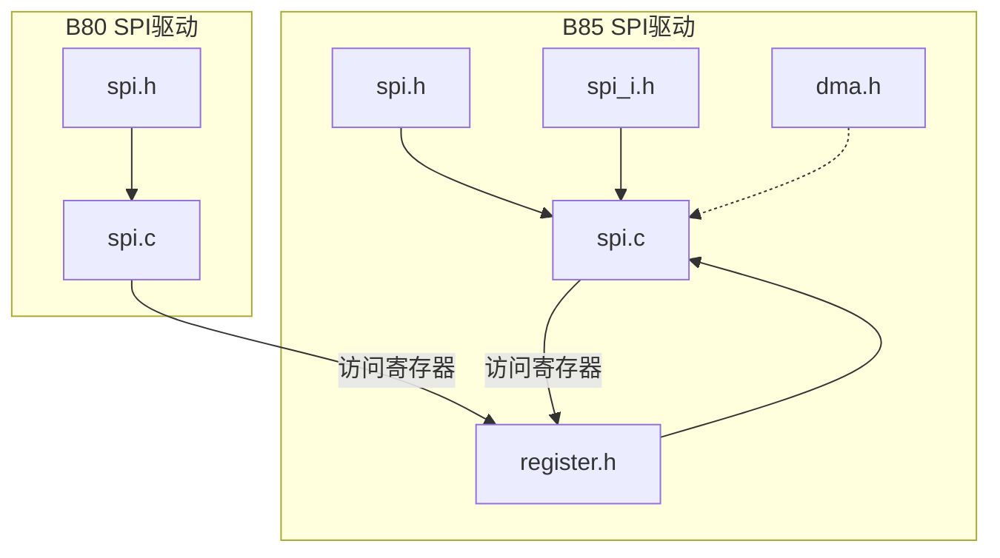
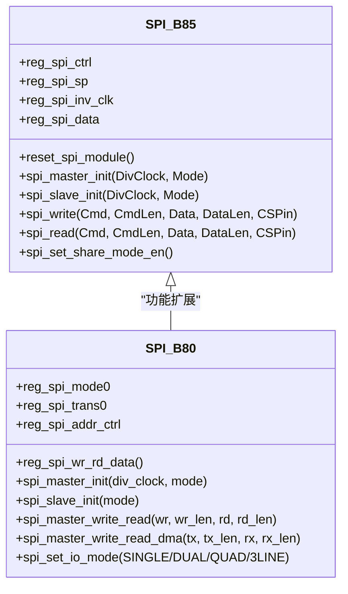
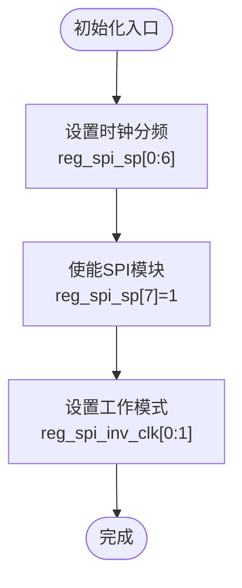
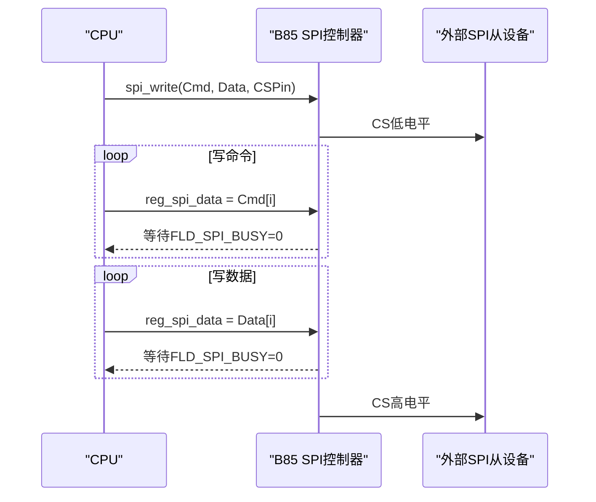
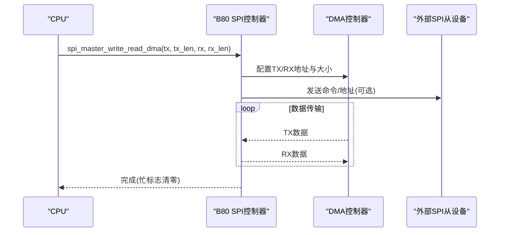
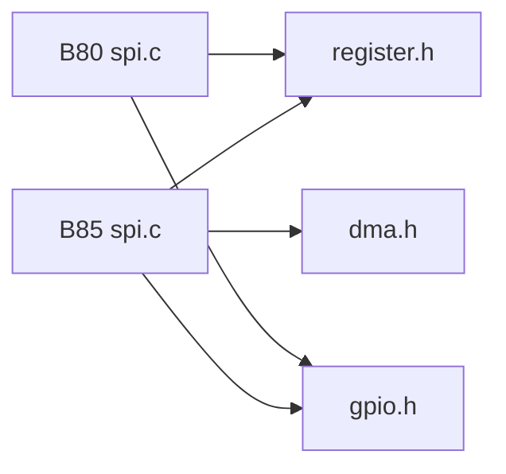

# SPI通信驱动

<cite>
**本文引用的文件**
- [tc_ble_single_sdk/drivers/B85/spi.h](file://tc_ble_single_sdk/drivers/B85/spi.h)
- [tc_ble_single_sdk/drivers/B85/spi.c](file://tc_ble_single_sdk/drivers/B85/spi.c)
- [tc_ble_single_sdk/drivers/B85/spi_i.h](file://tc_ble_single_sdk/drivers/B85/spi_i.h)
- [tc_ble_single_sdk/drivers/B85/register.h](file://tc_ble_single_sdk/drivers/B85/register.h)
- [tc_ble_single_sdk/drivers/B85/dma.h](file://tc_ble_single_sdk/drivers/B85/dma.h)
- [8373_dongle_for_km/chip/B80/drivers/spi.h](file://8373_dongle_for_km/chip/B80/drivers/spi.h)
- [8373_dongle_for_km/chip/B80/drivers/spi.c](file://8373_dongle_for_km/chip/B80/drivers/spi.c)
</cite>

## 目录
1. [简介](#简介)
2. [项目结构](#项目结构)
3. [核心组件](#核心组件)
4. [架构总览](#架构总览)
5. [详细组件分析](#详细组件分析)
6. [依赖关系分析](#依赖关系分析)
7. [性能考虑](#性能考虑)
8. [故障排查指南](#故障排查指南)
9. [结论](#结论)
10. [附录](#附录)

## 简介
本文件面向Telink B85芯片的SPI通信驱动，系统性阐述SPI协议四种工作模式（CPOL/CPHA组合）与B85 SPI控制器的实现细节。文档覆盖主/从设备配置、时钟极性与时相设置、数据格式、时钟与波特率计算、时序参数、中断处理与DMA传输机制、多设备片选管理、命令协议设计、以及外设驱动开发与性能优化建议。内容基于SDK中B85与B80两套SPI驱动源码进行归纳与对比，便于在不同平台间迁移与复用。

## 项目结构
- B85 SPI驱动位于 tc_ble_single_sdk/drivers/B85/ 下，包含spi.h、spi.c、spi_i.h（MSPI辅助）、register.h（寄存器定义）、dma.h（DMA通用接口）。
- B80 SPI驱动位于 8373_dongle_for_km/chip/B80/drivers/ 下，提供更丰富的SPI功能（单/双/四线、3线模式、FIFO/DMA、面板DCX等），适用于更高阶应用。

图表来源
- [tc_ble_single_sdk/drivers/B85/spi.c:113-121](file://tc_ble_single_sdk/drivers/B85/spi.c#L113-L121)
- [tc_ble_single_sdk/drivers/B85/register.h:94-137](file://tc_ble_single_sdk/drivers/B85/register.h#L94-L137)
- [8373_dongle_for_km/chip/B80/drivers/spi.c:95-117](file://8373_dongle_for_km/chip/B80/drivers/spi.c#L95-L117)

章节来源
- [tc_ble_single_sdk/drivers/B85/spi.h:38-64](file://tc_ble_single_sdk/drivers/B85/spi.h#L38-L64)
- [tc_ble_single_sdk/drivers/B85/spi.c:46-80](file://tc_ble_single_sdk/drivers/B85/spi.c#L46-L80)
- [8373_dongle_for_km/chip/B80/drivers/spi.h:31-76](file://8373_dongle_for_km/chip/B80/drivers/spi.h#L31-L76)

## 核心组件
- SPI引脚与复用：支持两组引脚映射（PA2/PA3/PA4/PD6 或 PB6/PB7/PD2/PD7），通过GPIO与I2C/SPI复用寄存器选择。
- 主/从初始化：分别配置时钟分频、工作模式（MODE0~MODE3）、主/从模式位。
- 读写操作：
  - B85：spi_write/spi_read，支持先写命令再写/读数据，使用busy轮询。
  - B80：提供FIFO与DMA读写，支持半/全双工、命令+地址+数据流水线。
- MSPI辅助：spi_i.h提供低层MSPI操作（等待、CS控制、读写）。
- DMA与中断：B80提供完善的TX/RX DMA使能、触发阈值、中断状态查询；B85提供共享模式与基础忙标志。

章节来源
- [tc_ble_single_sdk/drivers/B85/spi.c:135-198](file://tc_ble_single_sdk/drivers/B85/spi.c#L135-L198)
- [8373_dongle_for_km/chip/B80/drivers/spi.c:312-396](file://8373_dongle_for_km/chip/B80/drivers/spi.c#L312-L396)
- [tc_ble_single_sdk/drivers/B85/spi_i.h:34-92](file://tc_ble_single_sdk/drivers/B85/spi_i.h#L34-L92)
- [8373_dongle_for_km/chip/B80/drivers/spi.h:486-544](file://8373_dongle_for_km/chip/B80/drivers/spi.h#L486-L544)

## 架构总览
B85 SPI控制器由寄存器组构成：
- 控制寄存器：reg_spi_ctrl（忙标志、读写方向、输出使能、共享模式等）
- 时钟/模式寄存器：reg_spi_sp（时钟分频、使能）、reg_spi_inv_clk（CPOL/CPHA）
- 数据寄存器：reg_spi_data
- 复位/时钟门控：reg_rst0、reg_clk_en0

B80 SPI控制器在此基础上扩展了FIFO、DMA、面板DCX、3线模式、命令/地址相位控制等。

图表来源
- [tc_ble_single_sdk/drivers/B85/spi.c:113-121](file://tc_ble_single_sdk/drivers/B85/spi.c#L113-L121)
- [tc_ble_single_sdk/drivers/B85/register.h:94-137](file://tc_ble_single_sdk/drivers/B85/register.h#L94-L137)
- [8373_dongle_for_km/chip/B80/drivers/spi.c:95-117](file://8373_dongle_for_km/chip/B80/drivers/spi.c#L95-L117)

## 详细组件分析

### SPI工作模式与时钟配置
- 四种标准模式（CPOL/CPHA）：
  - MODE0: CPOL=0, CPHA=0
  - MODE1: CPOL=0, CPHA=1
  - MODE2: CPOL=1, CPHA=0
  - MODE3: CPOL=1, CPHA=1
- 时钟分频公式（B85）：SPI时钟 = 系统时钟 / ((DivClock+1)*2)
- B80时钟公式：spi_clock_out = AHB时钟 / ((div_clock+1)*2)

图表来源
- [tc_ble_single_sdk/drivers/B85/spi.c:113-121](file://tc_ble_single_sdk/drivers/B85/spi.c#L113-L121)
- [tc_ble_single_sdk/drivers/B85/register.h:107-116](file://tc_ble_single_sdk/drivers/B85/register.h#L107-L116)
- [8373_dongle_for_km/chip/B80/drivers/spi.c:95-100](file://8373_dongle_for_km/chip/B80/drivers/spi.c#L95-L100)

章节来源
- [tc_ble_single_sdk/drivers/B85/spi.h:131-152](file://tc_ble_single_sdk/drivers/B85/spi.h#L131-L152)
- [8373_dongle_for_km/chip/B80/drivers/spi.h:733-758](file://8373_dongle_for_km/chip/B80/drivers/spi.h#L733-L758)

### 主设备配置与数据收发（B85）
- GPIO复用：spi_master_gpio_set选择引脚并启用SPI功能，同时配置CS为GPIO输出。
- 写流程：拉低CS -> 写命令字节 -> 写数据字节 -> 拉高CS。每字节写入后等待BUSY清零。
- 读流程：拉低CS -> 写命令 -> 切换为只读 -> 读取数据（首字节为dummy）-> 拉高CS。

图表来源
- [tc_ble_single_sdk/drivers/B85/spi.c:135-157](file://tc_ble_single_sdk/drivers/B85/spi.c#L135-L157)
- [tc_ble_single_sdk/drivers/B85/register.h:94-106](file://tc_ble_single_sdk/drivers/B85/register.h#L94-L106)

章节来源
- [tc_ble_single_sdk/drivers/B85/spi.c:46-80](file://tc_ble_single_sdk/drivers/B85/spi.c#L46-L80)
- [tc_ble_single_sdk/drivers/B85/spi.c:170-198](file://tc_ble_single_sdk/drivers/B85/spi.c#L170-L198)

### 从设备配置（B85）
- 从模式初始化：关闭主模式位，设置时钟分频与工作模式。
- 引脚配置：SCLK、CS、SDI、SDO均设为SPI功能，输入使能打开。

章节来源
- [tc_ble_single_sdk/drivers/B85/spi.c:214-222](file://tc_ble_single_sdk/drivers/B85/spi.c#L214-L222)
- [tc_ble_single_sdk/drivers/B85/spi.c:240-275](file://tc_ble_single_sdk/drivers/B85/spi.c#L240-L275)

### 高级SPI功能（B80）
- 多IO模式：单线、双线、四线、三线（面板DCX）。
- FIFO与DMA：
  - TX/RX计数寄存器设置长度。
  - 中断触发阈值可配置。
  - DMA通道使能与缓冲地址配置。
- 命令/地址相位：可单独启用命令与地址阶段，支持不同格式跟随IO模式。
- 全双工读写：spi_master_write_read_full_duplex按块发送/接收，内部循环处理偏移与FIFO清空。

图表来源
- [8373_dongle_for_km/chip/B80/drivers/spi.c:514-537](file://8373_dongle_for_km/chip/B80/drivers/spi.c#L514-L537)
- [8373_dongle_for_km/chip/B80/drivers/spi.h:486-544](file://8373_dongle_for_km/chip/B80/drivers/spi.h#L486-L544)

章节来源
- [8373_dongle_for_km/chip/B80/drivers/spi.c:363-396](file://8373_dongle_for_km/chip/B80/drivers/spi.c#L363-L396)
- [8373_dongle_for_km/chip/B80/drivers/spi.c:663-695](file://8373_dongle_for_km/chip/B80/drivers/spi.c#L663-L695)
- [8373_dongle_for_km/chip/B80/drivers/spi.h:201-287](file://8373_dongle_for_km/chip/B80/drivers/spi.h#L201-L287)

### 片选管理与多设备通信
- B85：CS由GPIO控制，spi_masterCSpin_select将CS设为GPIO输出，空闲高电平；在读写前拉低，结束后拉高。
- B80：提供spi_cs_pin_dis与spi_change_csn_pin，支持动态切换CS引脚，便于多设备总线管理。

章节来源
- [tc_ble_single_sdk/drivers/B85/spi.c:91-97](file://tc_ble_single_sdk/drivers/B85/spi.c#L91-L97)
- [8373_dongle_for_km/chip/B80/drivers/spi.c:65-82](file://8373_dongle_for_km/chip/B80/drivers/spi.c#L65-L82)

### 中断与DMA机制
- B85：通过reg_spi_ctrl的BUSY位轮询；提供共享模式使能（FLD_SPI_SHARE_MODE）。
- B80：
  - 中断：RX/TX FIFO满/空、结束、从机命令等中断状态与掩码。
  - DMA：TX/RX通道使能、突发大小、触发阈值、地址配置。
  - 推荐中断触发级别为4字节，以平衡吞吐与开销。

章节来源
- [tc_ble_single_sdk/drivers/B85/spi.c:283-286](file://tc_ble_single_sdk/drivers/B85/spi.c#L283-L286)
- [8373_dongle_for_km/chip/B80/drivers/spi.h:162-178](file://8373_dongle_for_km/chip/B80/drivers/spi.h#L162-L178)
- [8373_dongle_for_km/chip/B80/drivers/spi.h:486-544](file://8373_dongle_for_km/chip/B80/drivers/spi.h#L486-L544)
- [tc_ble_single_sdk/drivers/B85/dma.h:66-157](file://tc_ble_single_sdk/drivers/B85/dma.h#L66-L157)

### 命令协议设计与时序参数
- 命令/地址/数据相位：B80支持独立启用命令与地址阶段，并可配置其格式跟随IO模式（单/双/四线）。
- Dummy周期：可通过spi_set_dummy_cnt配置dummy时钟周期数，用于满足某些从设备的时序要求。
- 3线模式：用于面板DCX信号分离，命令/数据通过同一数据线，配合DCX区分。

章节来源
- [8373_dongle_for_km/chip/B80/drivers/spi.h:201-287](file://8373_dongle_for_km/chip/B80/drivers/spi.h#L201-L287)
- [8373_dongle_for_km/chip/B80/drivers/spi.c:194-197](file://8373_dongle_for_km/chip/B80/drivers/spi.c#L194-L197)
- [8373_dongle_for_km/chip/B80/drivers/spi.h:567-592](file://8373_dongle_for_km/chip/B80/drivers/spi.h#L567-L592)

## 依赖关系分析
- B85 SPI驱动依赖：
  - register.h：SPI相关寄存器与位域定义。
  - gpio.h：引脚功能与输入输出使能。
  - dma.h：DMA通用接口（若使用）。
- B80 SPI驱动依赖：
  - register.h：SPI寄存器与位域。
  - gpio.h：引脚复用。
  - 内部FIFO/DMA寄存器：通过spi.h内联函数暴露。

图表来源
- [tc_ble_single_sdk/drivers/B85/spi.c:24-26](file://tc_ble_single_sdk/drivers/B85/spi.c#L24-L26)
- [8373_dongle_for_km/chip/B80/drivers/spi.c:24-26](file://8373_dongle_for_km/chip/B80/drivers/spi.c#L24-L26)

章节来源
- [tc_ble_single_sdk/drivers/B85/spi.c:24-26](file://tc_ble_single_sdk/drivers/B85/spi.c#L24-L26)
- [8373_dongle_for_km/chip/B80/drivers/spi.c:24-26](file://8373_dongle_for_km/chip/B80/drivers/spi.c#L24-L26)

## 性能考虑
- 时钟与波特率：
  - B85：SPI时钟 = 系统时钟 / ((DivClock+1)*2)。合理选择DivClock以获得目标速率。
  - B80：spi_clock_out = AHB时钟 / ((div_clock+1)*2)。
- 传输模式：
  - 小数据量：B85轮询BUSY简单可靠。
  - 大数据量：B80使用FIFO/DMA，减少CPU占用，提高吞吐。
- 中断阈值：B80建议设置为4字节，平衡中断频率与效率。
- 多设备总线：使用B80的spi_change_csn_pin动态切换CS，避免额外GPIO开销。
- 时序优化：合理使用Dummy周期与3线模式，满足从设备时序要求。

## 故障排查指南
- 无响应/卡死：
  - 检查SPI时钟是否使能（reg_clk_en0）。
  - 确认BUSY位是否在读写后清零。
  - 验证CS是否正确拉低/拉高。
- 数据错误：
  - 核对CPOL/CPHA模式是否与从设备一致。
  - 检查命令/地址相位配置（B80）是否符合协议。
  - 确认IO模式（单/双/四线）与从设备匹配。
- DMA问题：
  - 检查DMA通道使能与地址配置。
  - 确认突发大小与中断触发阈值设置合理。
  - 使用spi_is_busy等待传输完成。

章节来源
- [tc_ble_single_sdk/drivers/B85/register.h:94-137](file://tc_ble_single_sdk/drivers/B85/register.h#L94-L137)
- [8373_dongle_for_km/chip/B80/drivers/spi.h:398-402](file://8373_dongle_for_km/chip/B80/drivers/spi.h#L398-L402)
- [8373_dongle_for_km/chip/B80/drivers/spi.c:663-695](file://8373_dongle_for_km/chip/B80/drivers/spi.c#L663-L695)

## 结论
B85 SPI驱动提供了基础的SPI主/从能力，适合简单外设通信；B80 SPI驱动则在B85基础上扩展了FIFO、DMA、多IO模式与面板DCX，适合高性能与复杂协议场景。开发者应根据具体需求选择合适的驱动版本，并遵循时钟、模式、时序与片选管理的最佳实践，以实现稳定高效的SPI通信。

## 附录
- 常用API路径参考：
  - B85主初始化：[spi_master_init:113-121](file://tc_ble_single_sdk/drivers/B85/spi.c#L113-L121)
  - B85读写：[spi_write:135-157](file://tc_ble_single_sdk/drivers/B85/spi.c#L135-L157), [spi_read:170-198](file://tc_ble_single_sdk/drivers/B85/spi.c#L170-L198)
  - B80全双工：[spi_master_write_read_full_duplex:663-695](file://8373_dongle_for_km/chip/B80/drivers/spi.c#L663-L695)
  - B80 DMA读写：[spi_master_write_read_dma:514-537](file://8373_dongle_for_km/chip/B80/drivers/spi.c#L514-L537)
  - B80 IO模式：[spi_set_io_mode:170-187](file://8373_dongle_for_km/chip/B80/drivers/spi.c#L170-L187)