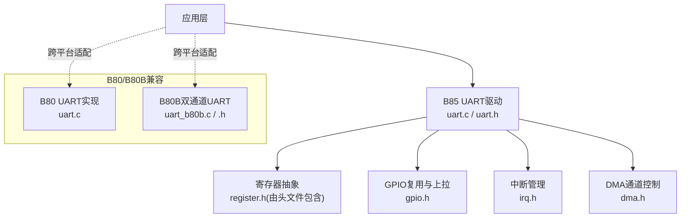
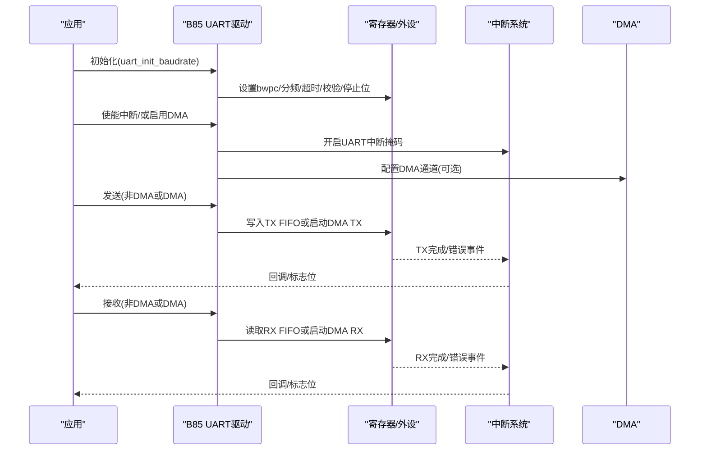
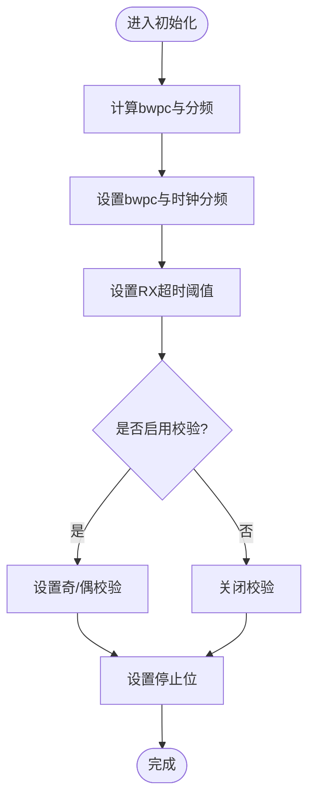
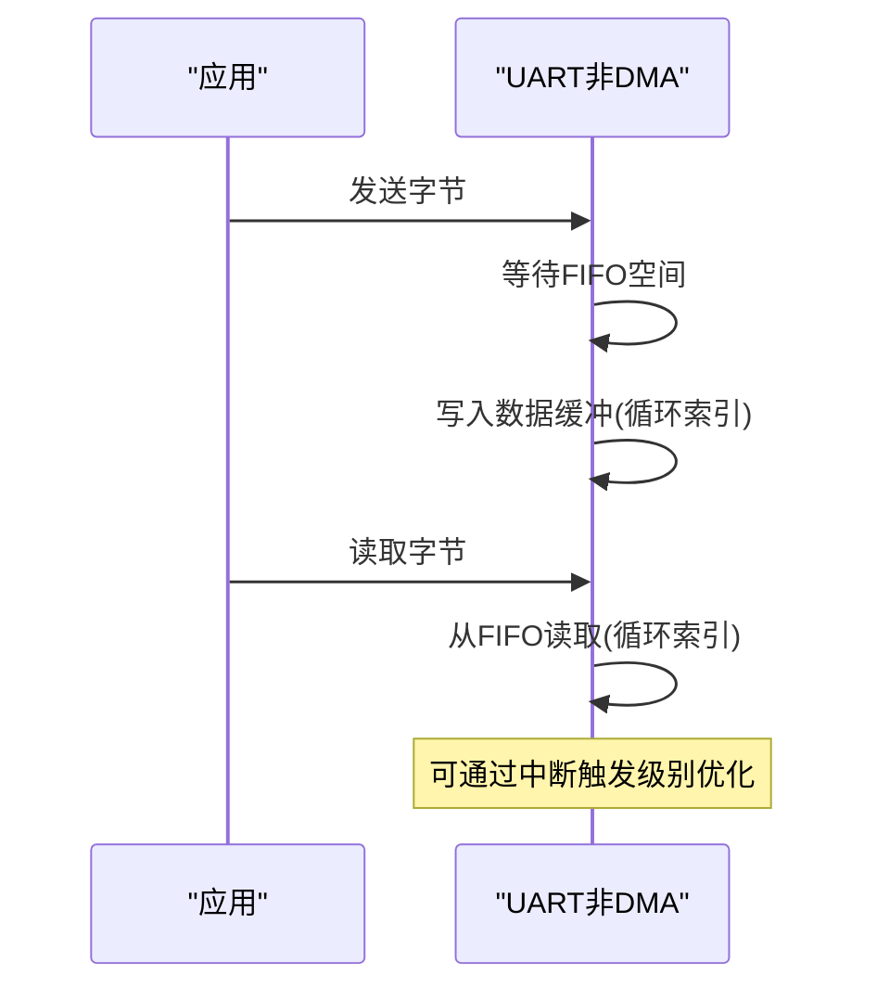
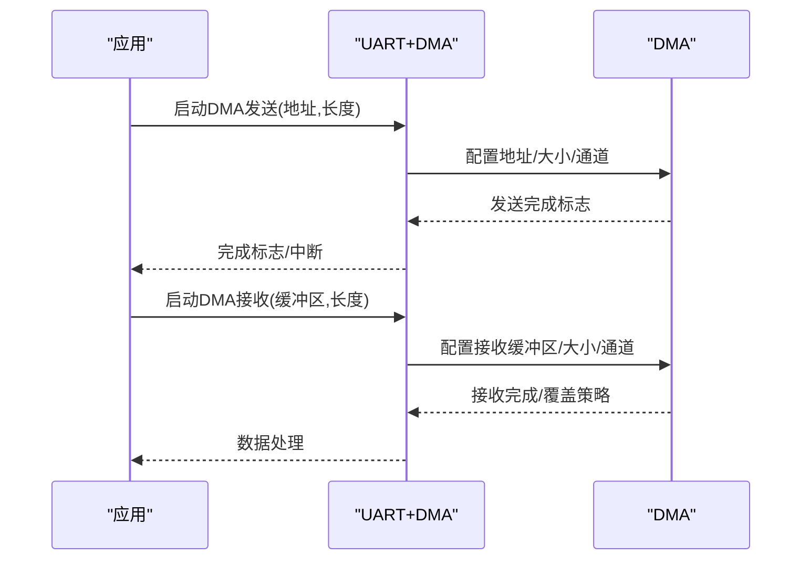
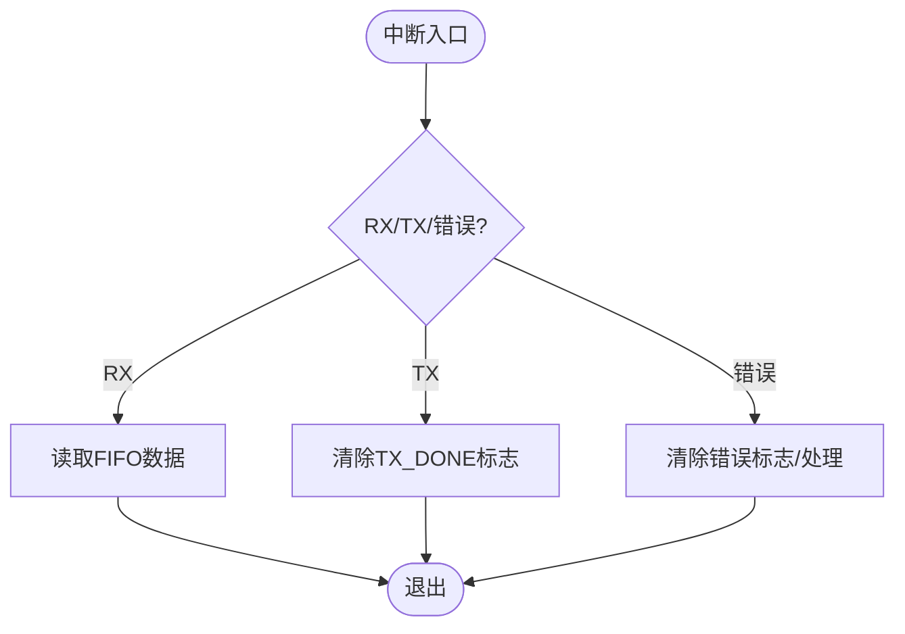
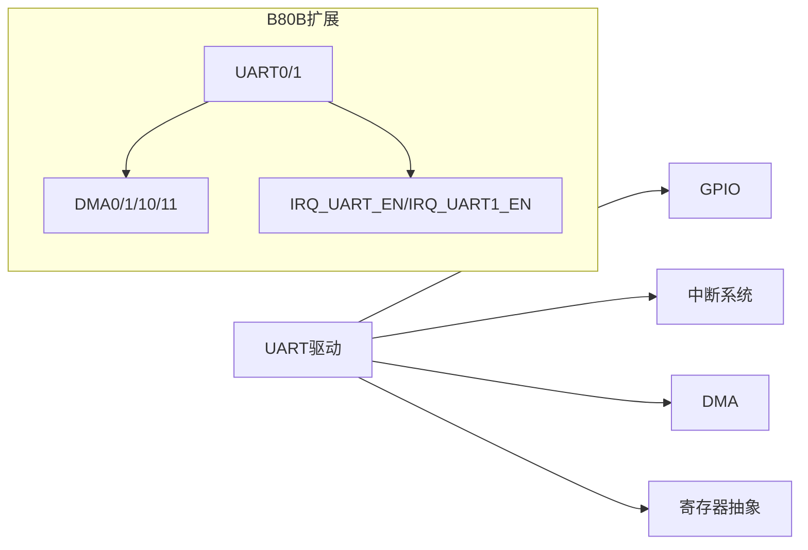

# UART通信驱动

<cite>
**本文引用的文件**
- [tc_ble_single_sdk/drivers/B85/uart.c](file://tc_ble_single_sdk/drivers/B85/uart.c)
- [tc_ble_single_sdk/drivers/B85/uart.h](file://tc_ble_single_sdk/drivers/B85/uart.h)
- [tc_ble_single_sdk/drivers/B85/dma.h](file://tc_ble_single_sdk/drivers/B85/dma.h)
- [tc_ble_single_sdk/drivers/B85/irq.h](file://tc_ble_single_sdk/drivers/B85/irq.h)
- [8373_dongle_for_km/chip/B80/drivers/uart.c](file://8373_dongle_for_km/chip/B80/drivers/uart.c)
- [8373_dongle_for_km/chip/B80/drivers/uart_b80b.c](file://8373_dongle_for_km/chip/B80/drivers/uart_b80b.c)
- [8373_dongle_for_km/chip/B80/drivers/uart_b80b.h](file://8373_dongle_for_km/chip/B80/drivers/uart_b80b.h)
</cite>

## 目录
1. [简介](#简介)
2. [项目结构](#项目结构)
3. [核心组件](#核心组件)
4. [架构总览](#架构总览)
5. [详细组件分析](#详细组件分析)
6. [依赖关系分析](#依赖关系分析)
7. [性能与调优](#性能与调优)
8. [故障诊断与排错](#故障诊断与排错)
9. [结论](#结论)
10. [附录：使用示例与最佳实践](#附录使用示例与最佳实践)

## 简介
本文件面向Telink B85系列芯片的UART异步串行通信驱动，系统性阐述UART工作原理、B85控制器实现、初始化配置（波特率、数据位、停止位、校验位）、发送与接收（阻塞与非阻塞）、中断处理与DMA机制、多通道管理、调试输出与日志记录、以及故障诊断与性能调优。同时对比B80B的差异与兼容性处理建议，帮助读者在B85平台上高效、稳定地集成UART。

## 项目结构
围绕UART驱动的关键代码主要分布在以下位置：
- B85平台驱动：drivers/B85/uart.c、uart.h、dma.h、irq.h
- B80/B80B兼容实现：chip/B80/drivers/uart.c、uart_b80b.c、uart_b80b.h

图表来源
- [tc_ble_single_sdk/drivers/B85/uart.c:159-215](file://tc_ble_single_sdk/drivers/B85/uart.c#L159-L215)
- [tc_ble_single_sdk/drivers/B85/uart.h:24-42](file://tc_ble_single_sdk/drivers/B85/uart.h#L24-L42)
- [8373_dongle_for_km/chip/B80/drivers/uart_b80b.c:161-219](file://8373_dongle_for_km/chip/B80/drivers/uart_b80b.c#L161-L219)

章节来源
- [tc_ble_single_sdk/drivers/B85/uart.c:159-215](file://tc_ble_single_sdk/drivers/B85/uart.c#L159-L215)
- [tc_ble_single_sdk/drivers/B85/uart.h:24-42](file://tc_ble_single_sdk/drivers/B85/uart.h#L24-L42)
- [8373_dongle_for_km/chip/B80/drivers/uart_b80b.c:161-219](file://8373_dongle_for_km/chip/B80/drivers/uart_b80b.c#L161-L219)

## 核心组件
- UART初始化与波特率计算：通过内部算法选择最优bwpc与分频值，设置时钟分频、超时阈值、校验与停止位。
- 非DMA收发：基于FIFO轮询读写，提供触发级别配置与中断标志查询。
- DMA收发：支持批量发送与接收，自动完成标志与错误处理。
- 硬件流控：RTS/CTS引脚配置与模式设置。
- 中断与错误：可屏蔽错误中断、RX_DONE中断等。
- 多通道（B80B）：统一接口支持UART0/UART1，分别管理DMA通道与中断源。

章节来源
- [tc_ble_single_sdk/drivers/B85/uart.c:159-215](file://tc_ble_single_sdk/drivers/B85/uart.c#L159-L215)
- [tc_ble_single_sdk/drivers/B85/uart.c:222-269](file://tc_ble_single_sdk/drivers/B85/uart.c#L222-L269)
- [tc_ble_single_sdk/drivers/B85/uart.c:339-432](file://tc_ble_single_sdk/drivers/B85/uart.c#L339-L432)
- [tc_ble_single_sdk/drivers/B85/uart.c:473-551](file://tc_ble_single_sdk/drivers/B85/uart.c#L473-L551)
- [8373_dongle_for_km/chip/B80/drivers/uart_b80b.c:161-219](file://8373_dongle_for_km/chip/B80/drivers/uart_b80b.c#L161-L219)
- [8373_dongle_for_km/chip/B80/drivers/uart_b80b.c:229-302](file://8373_dongle_for_km/chip/B80/drivers/uart_b80b.c#L229-L302)
- [8373_dongle_for_km/chip/B80/drivers/uart_b80b.c:375-497](file://8373_dongle_for_km/chip/B80/drivers/uart_b80b.c#L375-L497)

## 架构总览
B85 UART驱动以“初始化—使能—收发—中断/DMA—错误处理”为主线，结合GPIO复用与中断/DMA子系统协同工作。B80B在此基础上扩展为双通道，所有API增加通道参数，内部按通道路由到对应寄存器与DMA通道。

图表来源
- [tc_ble_single_sdk/drivers/B85/uart.c:192-215](file://tc_ble_single_sdk/drivers/B85/uart.c#L192-L215)
- [tc_ble_single_sdk/drivers/B85/uart.c:247-269](file://tc_ble_single_sdk/drivers/B85/uart.c#L247-L269)
- [tc_ble_single_sdk/drivers/B85/uart.c:339-354](file://tc_ble_single_sdk/drivers/B85/uart.c#L339-L354)
- [tc_ble_single_sdk/drivers/B85/uart.c:418-432](file://tc_ble_single_sdk/drivers/B85/uart.c#L418-L432)
- [tc_ble_single_sdk/drivers/B85/dma.h:97-124](file://tc_ble_single_sdk/drivers/B85/dma.h#L97-L124)
- [tc_ble_single_sdk/drivers/B85/irq.h:65-76](file://tc_ble_single_sdk/drivers/B85/irq.h#L65-L76)

## 详细组件分析

### 1) UART初始化与波特率配置
- 波特率计算：内部函数根据系统时钟与目标波特率，搜索最优bwpc与分频值，保证误差最小。
- 关键寄存器：
  - 位宽与分频：设置bwpc与时钟分频并启用分频器。
  - 超时阈值：按bwpc计算单字节最大位数，设定RX超时。
  - 校验位：支持无校验、偶校验、奇校验。
  - 停止位：支持1、1.5、2停止位。
- 两种初始化入口：
  - 直接传入分频与bwpc。
  - 传入目标波特率与系统时钟，内部自动计算。

图表来源
- [tc_ble_single_sdk/drivers/B85/uart.c:65-130](file://tc_ble_single_sdk/drivers/B85/uart.c#L65-L130)
- [tc_ble_single_sdk/drivers/B85/uart.c:159-215](file://tc_ble_single_sdk/drivers/B85/uart.c#L159-L215)

章节来源
- [tc_ble_single_sdk/drivers/B85/uart.c:65-130](file://tc_ble_single_sdk/drivers/B85/uart.c#L65-L130)
- [tc_ble_single_sdk/drivers/B85/uart.c:159-215](file://tc_ble_single_sdk/drivers/B85/uart.c#L159-L215)
- [tc_ble_single_sdk/drivers/B85/uart.h:217-252](file://tc_ble_single_sdk/drivers/B85/uart.h#L217-L252)

### 2) 非DMA模式收发（阻塞/非阻塞）
- 发送：
  - 阻塞式：等待FIFO空间后写入数据缓冲，循环索引访问四个数据寄存器。
  - 忙状态检测：提供接口查询TX是否忙碌，用于非阻塞调度。
- 接收：
  - 非阻塞读取：从FIFO轮询读取，配合中断触发级别减少CPU占用。
  - 中断触发级别：可按RX/TX FIFO水位触发中断，降低频繁中断开销。
- 注意事项：
  - 非DMA模式下无RX_DONE中断，需依据FIFO计数判断数据到达。
  - 唤醒或复位后需重置读写索引，避免指针错位。

图表来源
- [tc_ble_single_sdk/drivers/B85/uart.c:304-328](file://tc_ble_single_sdk/drivers/B85/uart.c#L304-L328)
- [tc_ble_single_sdk/drivers/B85/uart.c:280-295](file://tc_ble_single_sdk/drivers/B85/uart.c#L280-L295)
- [tc_ble_single_sdk/drivers/B85/uart.h:159-173](file://tc_ble_single_sdk/drivers/B85/uart.h#L159-L173)

章节来源
- [tc_ble_single_sdk/drivers/B85/uart.c:280-328](file://tc_ble_single_sdk/drivers/B85/uart.c#L280-L328)
- [tc_ble_single_sdk/drivers/B85/uart.h:159-173](file://tc_ble_single_sdk/drivers/B85/uart.h#L159-L173)

### 3) DMA模式收发
- 发送：
  - 批量发送：设置DMA地址与长度，启动DMA通道；发送完成后置位完成标志，可配合中断或轮询。
  - 单字节发送：将单字节放入固定缓冲区，通过DMA发送，返回成功/忙状态。
- 接收：
  - 批量接收：配置DMA接收缓冲区与大小，启动DMA；达到设定长度后继续接收，不会溢出但会覆盖旧数据。
- 限制与注意：
  - 单次最大传输长度受限（约4079-4字节）。
  - 若启用TX_DONE中断，需在ISR中清除完成标志，否则可能重复中断。

图表来源
- [tc_ble_single_sdk/drivers/B85/uart.c:339-354](file://tc_ble_single_sdk/drivers/B85/uart.c#L339-L354)
- [tc_ble_single_sdk/drivers/B85/uart.c:390-407](file://tc_ble_single_sdk/drivers/B85/uart.c#L390-L407)
- [tc_ble_single_sdk/drivers/B85/uart.c:418-432](file://tc_ble_single_sdk/drivers/B85/uart.c#L418-L432)
- [tc_ble_single_sdk/drivers/B85/dma.h:97-124](file://tc_ble_single_sdk/drivers/B85/dma.h#L97-L124)

章节来源
- [tc_ble_single_sdk/drivers/B85/uart.c:339-432](file://tc_ble_single_sdk/drivers/B85/uart.c#L339-L432)
- [tc_ble_single_sdk/drivers/B85/dma.h:97-124](file://tc_ble_single_sdk/drivers/B85/dma.h#L97-L124)

### 4) 中断处理与错误处理
- 中断使能：
  - 可单独使能RX/TX中断，并在任一使能时开启UART全局中断掩码。
- 错误中断：
  - 可屏蔽错误数据中断，便于异常捕获与恢复。
- 完成标志：
  - TX_DONE标志用于DMA发送完成判定；需在ISR中清除，避免重复触发。
- 校验错误：
  - 提供校验错误检测与清除接口；DMA模式下清除错误标志会同时清空RX FIFO。

图表来源
- [tc_ble_single_sdk/drivers/B85/uart.c:247-269](file://tc_ble_single_sdk/drivers/B85/uart.c#L247-L269)
- [tc_ble_single_sdk/drivers/B85/uart.c:440-460](file://tc_ble_single_sdk/drivers/B85/uart.c#L440-L460)
- [tc_ble_single_sdk/drivers/B85/uart.h:187-214](file://tc_ble_single_sdk/drivers/B85/uart.h#L187-L214)

章节来源
- [tc_ble_single_sdk/drivers/B85/uart.c:247-269](file://tc_ble_single_sdk/drivers/B85/uart.c#L247-L269)
- [tc_ble_single_sdk/drivers/B85/uart.c:440-460](file://tc_ble_single_sdk/drivers/B85/uart.c#L440-L460)
- [tc_ble_single_sdk/drivers/B85/uart.h:187-214](file://tc_ble_single_sdk/drivers/B85/uart.h#L187-L214)

### 5) 硬件流控（RTS/CTS）
- RTS：
  - 支持自动/手动模式，可配置触发阈值与极性反转。
  - 引脚复用与功能使能。
- CTS：
  - 输入电平选择决定何时暂停发送。
  - 引脚复用与功能使能。

章节来源
- [tc_ble_single_sdk/drivers/B85/uart.c:473-551](file://tc_ble_single_sdk/drivers/B85/uart.c#L473-L551)

### 6) 多通道UART（B80B）
- 通道枚举：UART0、UART1。
- 所有API均增加通道参数，内部按通道选择不同寄存器与DMA通道。
- 中断源区分：UART0与UART1分别对应不同的中断掩码位。
- DMA通道：
  - UART0使用DMA1(TX)/DMA0(RX)。
  - UART1使用专用DMA通道（地址与使能位不同）。

章节来源
- [8373_dongle_for_km/chip/B80/drivers/uart_b80b.c:161-219](file://8373_dongle_for_km/chip/B80/drivers/uart_b80b.c#L161-L219)
- [8373_dongle_for_km/chip/B80/drivers/uart_b80b.c:229-302](file://8373_dongle_for_km/chip/B80/drivers/uart_b80b.c#L229-L302)
- [8373_dongle_for_km/chip/B80/drivers/uart_b80b.c:375-497](file://8373_dongle_for_km/chip/B80/drivers/uart_b80b.c#L375-L497)
- [8373_dongle_for_km/chip/B80/drivers/uart_b80b.h:52-55](file://8373_dongle_for_km/chip/B80/drivers/uart_b80b.h#L52-L55)

### 7) 串口调试输出与日志记录
- 非DMA模式适合低速率调试打印，配合中断触发级别减少CPU占用。
- 高吞吐场景建议使用DMA批量发送，利用完成标志或中断进行批处理。
- 建议在应用层封装日志宏，根据编译选项开关输出，避免运行时开销。

章节来源
- [tc_ble_single_sdk/drivers/B85/uart.c:280-328](file://tc_ble_single_sdk/drivers/B85/uart.c#L280-L328)
- [tc_ble_single_sdk/drivers/B85/uart.c:339-432](file://tc_ble_single_sdk/drivers/B85/uart.c#L339-L432)

## 依赖关系分析
- UART驱动依赖：
  - GPIO复用与上拉配置，确保引脚正确切换与稳定性。
  - 中断系统：全局中断使能与UART中断掩码。
  - DMA子系统：通道使能、中断与状态管理。
- 模块耦合：
  - 初始化与波特率计算强相关于系统时钟。
  - DMA收发与中断完成标志紧密协作。
  - 多通道实现通过参数化封装降低耦合度。

图表来源
- [tc_ble_single_sdk/drivers/B85/uart.c:247-269](file://tc_ble_single_sdk/drivers/B85/uart.c#L247-L269)
- [tc_ble_single_sdk/drivers/B85/dma.h:97-124](file://tc_ble_single_sdk/drivers/B85/dma.h#L97-L124)
- [8373_dongle_for_km/chip/B80/drivers/uart_b80b.c:229-302](file://8373_dongle_for_km/chip/B80/drivers/uart_b80b.c#L229-L302)

章节来源
- [tc_ble_single_sdk/drivers/B85/uart.c:247-269](file://tc_ble_single_sdk/drivers/B85/uart.c#L247-L269)
- [tc_ble_single_sdk/drivers/B85/dma.h:97-124](file://tc_ble_single_sdk/drivers/B85/dma.h#L97-L124)
- [8373_dongle_for_km/chip/B80/drivers/uart_b80b.c:229-302](file://8373_dongle_for_km/chip/B80/drivers/uart_b80b.c#L229-L302)

## 性能与调优
- 波特率精度：优先使用自动计算接口，确保bwpc与分频组合误差最小。
- 中断触发级别：
  - 未知长度接收：rx_level设为1，及时响应。
  - 已知长度接收：rx_level设为小于8且为长度的整数倍，减少中断次数。
- DMA模式：
  - 大批量数据优先DMA，避免CPU瓶颈。
  - 注意单次最大长度限制，必要时分包。
- 功耗与实时性：
  - 非DMA+中断触发级别可降低CPU占用。
  - DMA+中断完成标志适合高吞吐与低功耗场景。
- 硬件流控：
  - 在高噪声或长距离通信中启用RTS/CTS，提升可靠性。

[本节为通用指导，不直接分析具体文件]

## 故障诊断与排错
- 校验错误：
  - 检测与清除校验错误标志；DMA模式下清除会清空RX FIFO。
- 超时与帧错误：
  - 检查RX超时阈值设置是否与bwpc匹配。
  - 确认波特率与系统时钟配置正确。
- 中断重复触发：
  - 确保在ISR中清除TX_DONE标志。
- FIFO溢出风险：
  - 非DMA模式下若中断处理过慢可能导致FIFO溢出，建议提高优先级或使用DMA。
- 引脚配置问题：
  - 确保GPIO复用顺序与上拉电阻配置正确，避免误读导致错误数据进入RX FIFO。

章节来源
- [tc_ble_single_sdk/drivers/B85/uart.c:440-460](file://tc_ble_single_sdk/drivers/B85/uart.c#L440-L460)
- [tc_ble_single_sdk/drivers/B85/uart.c:561-579](file://tc_ble_single_sdk/drivers/B85/uart.c#L561-L579)
- [tc_ble_single_sdk/drivers/B85/uart.h:24-42](file://tc_ble_single_sdk/drivers/B85/uart.h#L24-L42)

## 结论
B85 UART驱动提供了完善的初始化、收发、中断与DMA能力，适用于从低速调试到高吞吐通信的各类场景。通过合理配置波特率、中断触发级别与DMA参数，可在性能与功耗之间取得平衡。对于多通道需求，B80B实现提供了统一的通道化接口。遵循本文档的配置与排错建议，可有效提升UART通信的稳定性与效率。

[本节为总结，不直接分析具体文件]

## 附录：使用示例与最佳实践
以下为典型流程的步骤说明（不包含具体代码内容），请参照对应函数路径进行实现：

- 初始化与配置
  - 步骤：调用初始化接口设置波特率、校验位与停止位；配置GPIO复用与上拉；根据需要启用中断或DMA。
  - 参考路径：
    - [uart_init_baudrate:192-215](file://tc_ble_single_sdk/drivers/B85/uart.c#L192-L215)
    - [uart_gpio_set:561-579](file://tc_ble_single_sdk/drivers/B85/uart.c#L561-L579)
    - [uart_irq_enable:247-269](file://tc_ble_single_sdk/drivers/B85/uart.c#L247-L269)
    - [uart_dma_enable:222-238](file://tc_ble_single_sdk/drivers/B85/uart.c#L222-L238)

- 非DMA发送（阻塞/非阻塞）
  - 步骤：等待FIFO空间后写入数据；或通过忙状态接口进行非阻塞调度。
  - 参考路径：
    - [uart_ndma_send_byte:304-313](file://tc_ble_single_sdk/drivers/B85/uart.c#L304-L313)
    - [uart_tx_is_busy:159-162](file://tc_ble_single_sdk/drivers/B85/uart.h#L159-L162)

- 非DMA接收（中断触发级别）
  - 步骤：设置RX触发级别；在中断中读取FIFO直至空。
  - 参考路径：
    - [uart_ndma_irq_triglevel:280-283](file://tc_ble_single_sdk/drivers/B85/uart.c#L280-L283)
    - [uart_ndma_read_byte:322-328](file://tc_ble_single_sdk/drivers/B85/uart.c#L322-L328)

- DMA发送
  - 步骤：准备数据缓冲区（首四字节为长度），调用批量发送接口；通过完成标志或中断判断完成。
  - 参考路径：
    - [uart_send_dma:339-354](file://tc_ble_single_sdk/drivers/B85/uart.c#L339-L354)
    - [uart_clr_tx_done:187-195](file://tc_ble_single_sdk/drivers/B85/uart.h#L187-L195)

- DMA接收
  - 步骤：配置接收缓冲区与长度；启动DMA；处理接收完成后的数据。
  - 参考路径：
    - [uart_recbuff_init:418-432](file://tc_ble_single_sdk/drivers/B85/uart.c#L418-L432)

- 多通道（B80B）
  - 步骤：在所有API中指定通道号；按通道配置DMA与中断。
  - 参考路径：
    - [uart_init_baudrate (B80B):195-219](file://8373_dongle_for_km/chip/B80/drivers/uart_b80b.c#L195-L219)
    - [uart_send_dma (B80B):375-395](file://8373_dongle_for_km/chip/B80/drivers/uart_b80b.c#L375-L395)
    - [uart_recbuff_init (B80B):477-497](file://8373_dongle_for_km/chip/B80/drivers/uart_b80b.c#L477-L497)

- 与B80B的差异与兼容
  - 差异点：
    - B80B所有接口增加通道参数，内部按通道路由寄存器与DMA通道。
    - 中断源与DMA通道编号不同，需按通道配置。
  - 兼容建议：
    - 使用统一封装层，根据编译宏选择B85或B80B实现。
    - 在多平台项目中，对通道枚举与DMA通道映射进行抽象。

章节来源
- [tc_ble_single_sdk/drivers/B85/uart.c:192-215](file://tc_ble_single_sdk/drivers/B85/uart.c#L192-L215)
- [tc_ble_single_sdk/drivers/B85/uart.c:247-269](file://tc_ble_single_sdk/drivers/B85/uart.c#L247-L269)
- [tc_ble_single_sdk/drivers/B85/uart.c:304-328](file://tc_ble_single_sdk/drivers/B85/uart.c#L304-L328)
- [tc_ble_single_sdk/drivers/B85/uart.c:339-354](file://tc_ble_single_sdk/drivers/B85/uart.c#L339-L354)
- [tc_ble_single_sdk/drivers/B85/uart.c:418-432](file://tc_ble_single_sdk/drivers/B85/uart.c#L418-L432)
- [8373_dongle_for_km/chip/B80/drivers/uart_b80b.c:195-219](file://8373_dongle_for_km/chip/B80/drivers/uart_b80b.c#L195-L219)
- [8373_dongle_for_km/chip/B80/drivers/uart_b80b.c:375-395](file://8373_dongle_for_km/chip/B80/drivers/uart_b80b.c#L375-L395)
- [8373_dongle_for_km/chip/B80/drivers/uart_b80b.c:477-497](file://8373_dongle_for_km/chip/B80/drivers/uart_b80b.c#L477-L497)