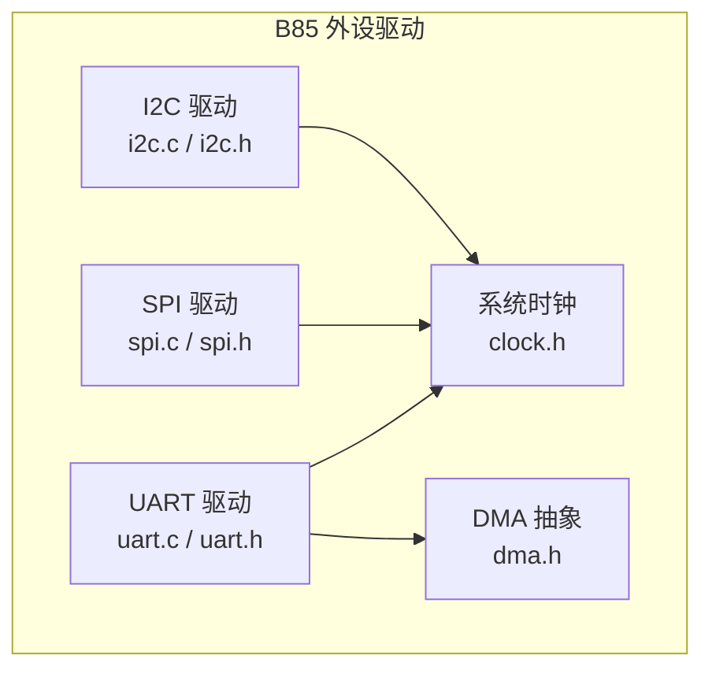
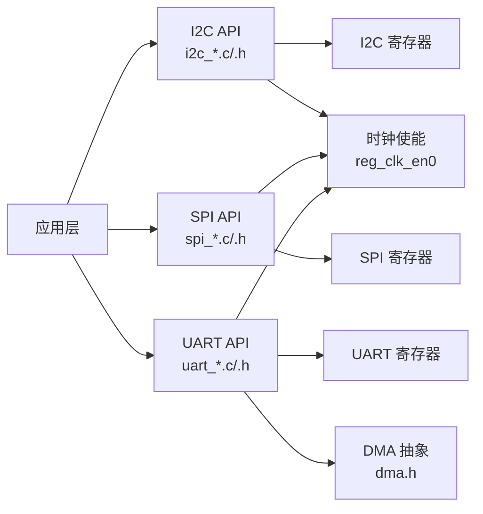
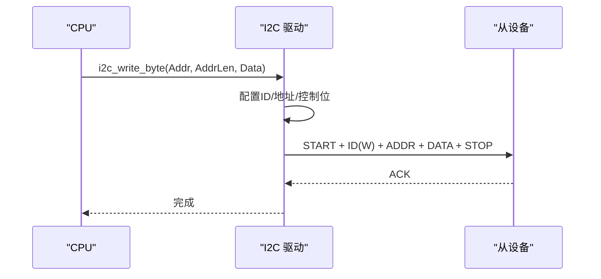
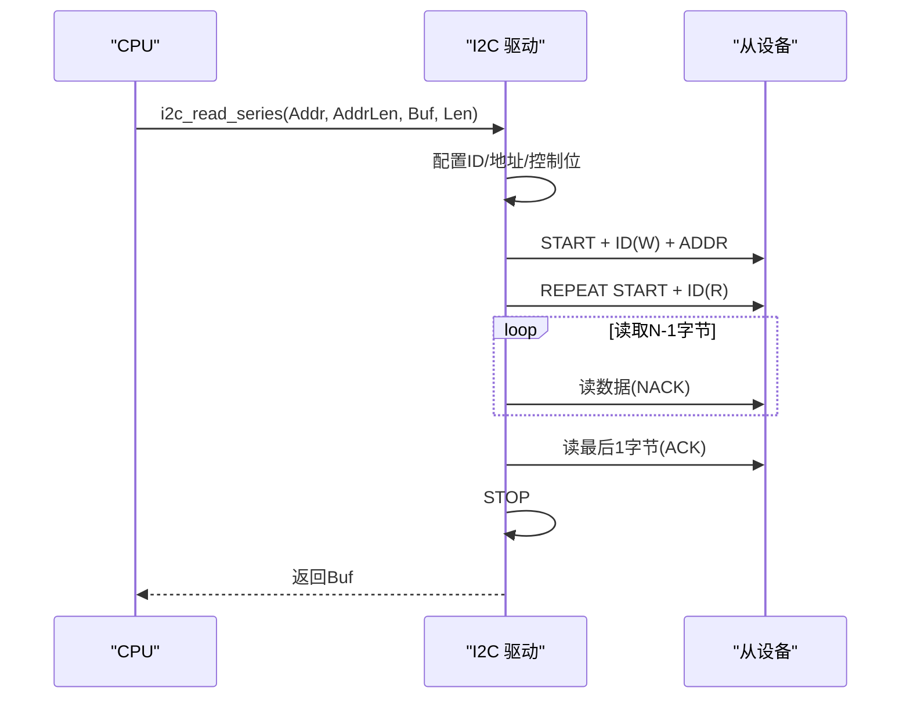
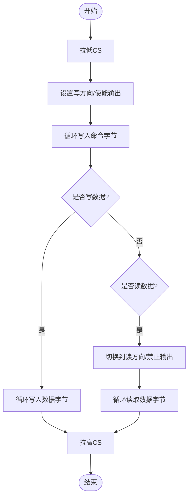
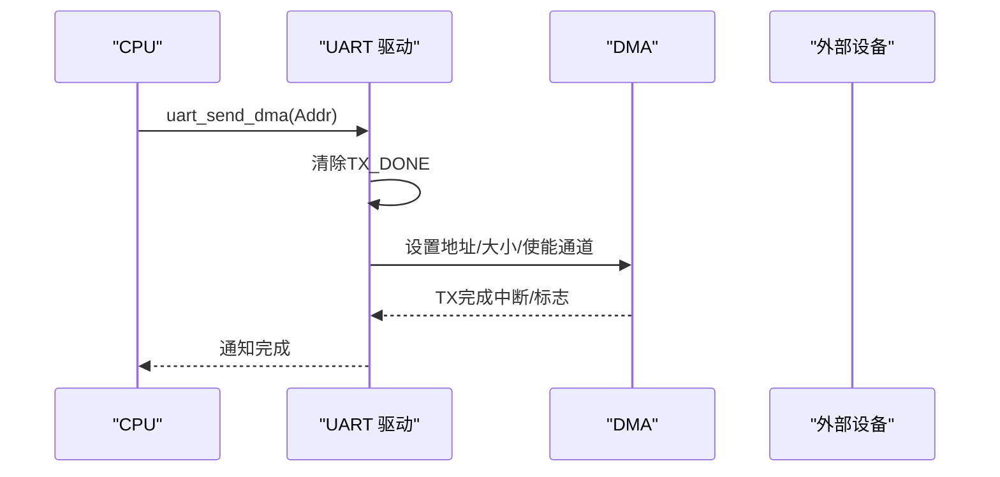
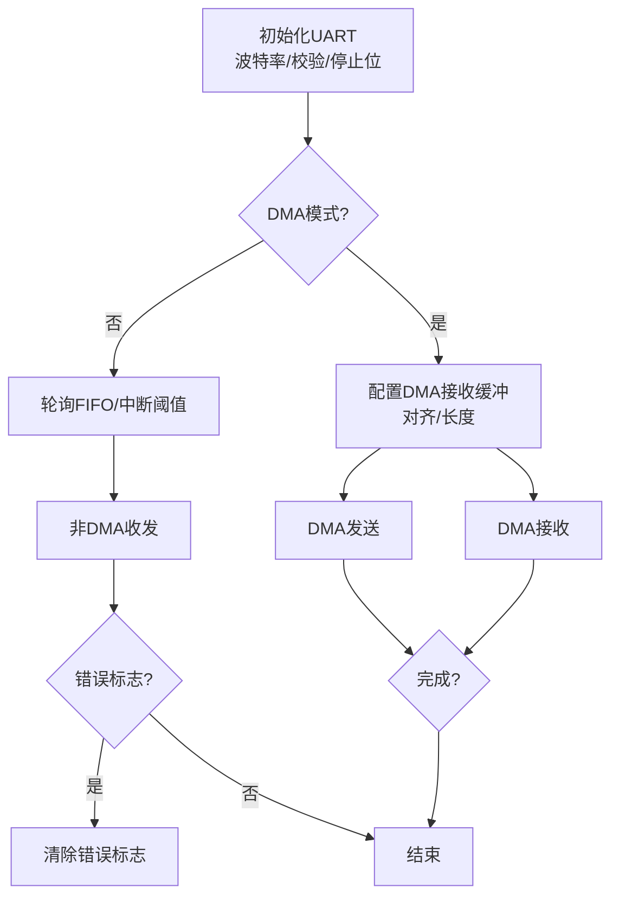
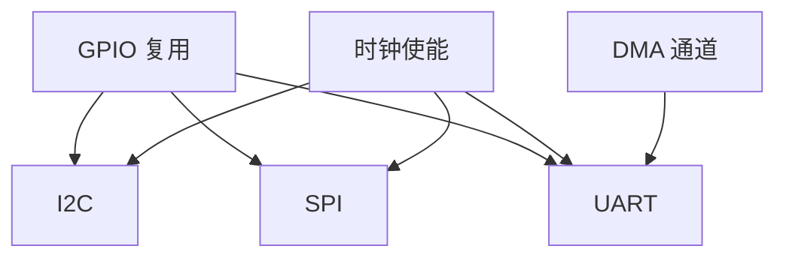

# 通信接口驱动

<cite>
**本文引用的文件**
- [i2c.c](file://tc_ble_single_sdk/drivers/B85/i2c.c)
- [i2c.h](file://tc_ble_single_sdk/drivers/B85/i2c.h)
- [spi.c](file://tc_ble_single_sdk/drivers/B85/spi.c)
- [spi.h](file://tc_ble_single_sdk/drivers/B85/spi.h)
- [uart.c](file://tc_ble_single_sdk/drivers/B85/uart.c)
- [uart.h](file://tc_ble_single_sdk/drivers/B85/uart.h)
- [dma.h](file://tc_ble_single_sdk/drivers/B85/dma.h)
- [clock.h](file://tc_ble_single_sdk/drivers/B85/clock.h)
</cite>

## 目录
1. [简介](#简介)
2. [项目结构](#项目结构)
3. [核心组件](#核心组件)
4. [架构总览](#架构总览)
5. [详细组件分析](#详细组件分析)
6. [依赖关系分析](#依赖关系分析)
7. [性能与优化](#性能与优化)
8. [故障排查指南](#故障排查指南)
9. [结论](#结论)
10. [附录：使用示例与参考路径](#附录使用示例与参考路径)

## 简介
本文件面向Telink B85系列SDK中的常用通信接口驱动，系统性阐述I2C、SPI、UART的初始化配置、数据传输模式与时序要点，覆盖时钟与波特率设置、数据格式配置、错误处理与超时机制、DMA高速传输以及多设备地址管理与冲突规避。文档以源码为依据，提供可追溯的代码片段路径，帮助读者快速定位实现细节。

## 项目结构
- 驱动位于 tc_ble_single_sdk/drivers/B85 目录下，分别提供 i2c.c/.h、spi.c/.h、uart.c/.h，以及 DMA 与系统时钟相关头文件 dma.h、clock.h。
- I2C/SPI/UART均提供GPIO复用配置、模块初始化、读写函数；UART额外提供DMA收发、中断触发阈值、硬件流控（RTS/CTS）等能力。
- I2C支持主/从模式，从模式支持DMA与Mapping两种数据缓冲方式；SPI支持主/从模式及四种标准工作模式；UART支持非DMA轮询与DMA两种收发模式。

图表来源
- [i2c.c:24-26](file://tc_ble_single_sdk/drivers/B85/i2c.c#L24-L26)
- [spi.c:24-26](file://tc_ble_single_sdk/drivers/B85/spi.c#L24-L26)
- [uart.c:24-26](file://tc_ble_single_sdk/drivers/B85/uart.c#L24-L26)
- [dma.h:24-28](file://tc_ble_single_sdk/drivers/B85/dma.h#L24-L28)
- [clock.h:24-28](file://tc_ble_single_sdk/drivers/B85/clock.h#L24-L28)

章节来源
- [i2c.c:1-355](file://tc_ble_single_sdk/drivers/B85/i2c.c#L1-L355)
- [spi.c:1-287](file://tc_ble_single_sdk/drivers/B85/spi.c#L1-L287)
- [uart.c:1-607](file://tc_ble_single_sdk/drivers/B85/uart.c#L1-L607)
- [dma.h:1-160](file://tc_ble_single_sdk/drivers/B85/dma.h#L1-L160)
- [clock.h:1-168](file://tc_ble_single_sdk/drivers/B85/clock.h#L1-L168)

## 核心组件
- I2C：引脚复用、主/从初始化、单字节/批量读写、从模式DMA/Mapping缓冲、中断状态管理。
- SPI：引脚复用、主/从初始化、四种CPOL/CPHA模式、命令+数据块读写、共享模式。
- UART：引脚复用、波特率/校验/停止位配置、非DMA收发、DMA收发、中断触发阈值、硬件流控（RTS/CTS）、错误标志与清除。
- DMA：通道枚举、使能/禁用、中断屏蔽/状态查询、缓冲区大小设置。
- 时钟：系统时钟源选择、校准提示（避免在DMA过程中切换时钟）。

章节来源
- [i2c.h:31-75](file://tc_ble_single_sdk/drivers/B85/i2c.h#L31-L75)
- [spi.h:31-64](file://tc_ble_single_sdk/drivers/B85/spi.h#L31-L64)
- [uart.h:53-150](file://tc_ble_single_sdk/drivers/B85/uart.h#L53-L150)
- [dma.h:50-59](file://tc_ble_single_sdk/drivers/B85/dma.h#L50-L59)
- [clock.h:56-68](file://tc_ble_single_sdk/drivers/B85/clock.h#L56-L68)

## 架构总览
下图展示各驱动对底层寄存器与外设的依赖关系，以及DMA在UART中的作用。

图表来源
- [i2c.c:87-95](file://tc_ble_single_sdk/drivers/B85/i2c.c#L87-L95)
- [spi.c:113-121](file://tc_ble_single_sdk/drivers/B85/spi.c#L113-L121)
- [uart.c:159-183](file://tc_ble_single_sdk/drivers/B85/uart.c#L159-L183)
- [dma.h:97-105](file://tc_ble_single_sdk/drivers/B85/dma.h#L97-L105)

## 详细组件分析

### I2C 驱动
- 引脚复用与上拉：支持多组引脚映射，自动启用输入并配置上拉电阻，确保总线空闲高电平。
- 主模式初始化：设置分频因子计算I2C时钟，配置从机地址（含R/W位），开启主模式与模块时钟，关闭SPI复用。
- 从模式初始化：设置从机地址，开启映射或DMA模式，配置映射缓冲首地址。
- 单字节/批量读写：按地址长度（0/1/2/3字节）组合控制寄存器，发送START/ADDR/DATA/STOP序列，忙等待完成。
- 时序要点：读操作先写地址再发重复START后读；最后一字节ACK/NACK由驱动控制。

图表来源
- [i2c.c:135-174](file://tc_ble_single_sdk/drivers/B85/i2c.c#L135-L174)

图表来源
- [i2c.c:296-353](file://tc_ble_single_sdk/drivers/B85/i2c.c#L296-L353)

章节来源
- [i2c.c:37-75](file://tc_ble_single_sdk/drivers/B85/i2c.c#L37-L75)
- [i2c.c:87-125](file://tc_ble_single_sdk/drivers/B85/i2c.c#L87-L125)
- [i2c.c:135-233](file://tc_ble_single_sdk/drivers/B85/i2c.c#L135-L233)
- [i2c.c:242-353](file://tc_ble_single_sdk/drivers/B85/i2c.c#L242-L353)
- [i2c.h:31-75](file://tc_ble_single_sdk/drivers/B85/i2c.h#L31-L75)

### SPI 驱动
- 引脚复用：支持两组引脚映射，输出/输入使能与功能选择，CS引脚独立配置为GPIO输出。
- 主模式初始化：开启时钟、清零配置、设置分频得到SPI时钟、开启主模式、选择CPOL/CPHA工作模式。
- 从模式初始化：类似主模式但关闭主模式位。
- 读写流程：写时先置写方向、循环写入命令与数据；读时先写命令，再切换只读方向，读取有效数据，最后释放CS。
- 共享模式：提供共享模式开关，便于与其他模块共用SPI资源。

图表来源
- [spi.c:135-157](file://tc_ble_single_sdk/drivers/B85/spi.c#L135-L157)
- [spi.c:170-198](file://tc_ble_single_sdk/drivers/B85/spi.c#L170-L198)

章节来源
- [spi.c:46-80](file://tc_ble_single_sdk/drivers/B85/spi.c#L46-L80)
- [spi.c:113-121](file://tc_ble_single_sdk/drivers/B85/spi.c#L113-L121)
- [spi.c:135-198](file://tc_ble_single_sdk/drivers/B85/spi.c#L135-L198)
- [spi.c:214-222](file://tc_ble_single_sdk/drivers/B85/spi.c#L214-L222)
- [spi.c:240-275](file://tc_ble_single_sdk/drivers/B85/spi.c#L240-L275)
- [spi.c:283-286](file://tc_ble_single_sdk/drivers/B85/spi.c#L283-L286)
- [spi.h:31-64](file://tc_ble_single_sdk/drivers/B85/spi.h#L31-L64)

### UART 驱动
- 引脚复用：TX/RX可选多组引脚，配置输入使能与上拉电阻，避免误触发。
- 初始化：根据目标波特率与系统时钟计算最佳bwpc与分频值，配置校验位、停止位、接收超时阈值。
- 非DMA收发：通过FIFO索引循环访问四个数据寄存器，配合中断触发阈值进行批处理。
- DMA收发：发送前清空TX_DONE标志，设置DMA地址与大小，使能通道并触发；接收需对齐且长度为16的倍数，最大约4079字节。
- 流控：支持RTS（自动/手动）与CTS，配置触发阈值与极性。
- 错误处理：奇偶校验错误检测与清除，错误中断掩码。

图表来源
- [uart.c:339-354](file://tc_ble_single_sdk/drivers/B85/uart.c#L339-L354)
- [dma.h:97-105](file://tc_ble_single_sdk/drivers/B85/dma.h#L97-L105)

图表来源
- [uart.c:159-215](file://tc_ble_single_sdk/drivers/B85/uart.c#L159-L215)
- [uart.c:222-238](file://tc_ble_single_sdk/drivers/B85/uart.c#L222-L238)
- [uart.c:339-432](file://tc_ble_single_sdk/drivers/B85/uart.c#L339-L432)
- [uart.c:440-460](file://tc_ble_single_sdk/drivers/B85/uart.c#L440-L460)

章节来源
- [uart.c:159-215](file://tc_ble_single_sdk/drivers/B85/uart.c#L159-L215)
- [uart.c:222-238](file://tc_ble_single_sdk/drivers/B85/uart.c#L222-L238)
- [uart.c:247-283](file://tc_ble_single_sdk/drivers/B85/uart.c#L247-L283)
- [uart.c:304-328](file://tc_ble_single_sdk/drivers/B85/uart.c#L304-L328)
- [uart.c:339-432](file://tc_ble_single_sdk/drivers/B85/uart.c#L339-L432)
- [uart.c:440-460](file://tc_ble_single_sdk/drivers/B85/uart.c#L440-L460)
- [uart.c:473-551](file://tc_ble_single_sdk/drivers/B85/uart.c#L473-L551)
- [uart.c:561-593](file://tc_ble_single_sdk/drivers/B85/uart.c#L561-L593)
- [uart.h:53-150](file://tc_ble_single_sdk/drivers/B85/uart.h#L53-L150)
- [uart.h:159-185](file://tc_ble_single_sdk/drivers/B85/uart.h#L159-L185)
- [uart.h:217-252](file://tc_ble_single_sdk/drivers/B85/uart.h#L217-L252)
- [uart.h:254-368](file://tc_ble_single_sdk/drivers/B85/uart.h#L254-L368)

### DMA 在高速通信中的应用
- UART DMA：发送前必须清除TX_DONE标志，避免初始化后立即进入中断；接收缓冲需16字节对齐，长度限制约4079字节。
- I2C从模式：支持DMA与Mapping两种缓冲方式，Mapping模式下无需发送地址，简化主从时序。
- 注意事项：时钟切换期间避免DMA传输，防止数据丢失。

章节来源
- [uart.c:339-432](file://tc_ble_single_sdk/drivers/B85/uart.c#L339-L432)
- [i2c.c:105-125](file://tc_ble_single_sdk/drivers/B85/i2c.c#L105-L125)
- [clock.h:81-89](file://tc_ble_single_sdk/drivers/B85/clock.h#L81-L89)

### 多设备通信的地址管理与冲突解决
- I2C：主模式通过设置不同的SlaveID（包含R/W位）访问不同从设备；从模式通过device_ID匹配。
- SPI：通过CS引脚选择不同从设备，同一总线可挂多个设备，互不干扰。
- UART：点对点通信，无地址概念；如需多设备，可在协议层增加设备标识与仲裁。

章节来源
- [i2c.c:87-95](file://tc_ble_single_sdk/drivers/B85/i2c.c#L87-L95)
- [spi.c:135-157](file://tc_ble_single_sdk/drivers/B85/spi.c#L135-L157)

## 依赖关系分析
- I2C依赖GPIO与时钟模块，复用引脚时需同时关闭SPI功能以避免冲突。
- SPI依赖GPIO与时钟模块，主/从模式通过寄存器位切换，支持共享模式。
- UART依赖GPIO、时钟与DMA模块，DMA用于高效收发；中断阈值与错误标志用于可靠性保障。
- 所有驱动均通过寄存器直接操作，头文件提供类型与常量定义。

图表来源
- [i2c.c:37-75](file://tc_ble_single_sdk/drivers/B85/i2c.c#L37-L75)
- [spi.c:46-80](file://tc_ble_single_sdk/drivers/B85/spi.c#L46-L80)
- [uart.c:561-593](file://tc_ble_single_sdk/drivers/B85/uart.c#L561-L593)
- [dma.h:97-105](file://tc_ble_single_sdk/drivers/B85/dma.h#L97-L105)

章节来源
- [i2c.c:24-26](file://tc_ble_single_sdk/drivers/B85/i2c.c#L24-L26)
- [spi.c:24-26](file://tc_ble_single_sdk/drivers/B85/spi.c#L24-L26)
- [uart.c:24-26](file://tc_ble_single_sdk/drivers/B85/uart.c#L24-L26)

## 性能与优化
- I2C：批量读写减少START/STOP开销；合理设置分频因子以获得稳定时钟。
- SPI：选择合适的工作模式（CPOL/CPHA）与分频，保证与从设备匹配；大吞吐场景建议提高SPI时钟。
- UART：
  - 非DMA：设置合适的rx_level与tx_level以减少中断次数。
  - DMA：利用DMA降低CPU占用，注意缓冲对齐与长度限制；发送前清除TX_DONE避免误中断。
- 时钟：避免在DMA传输期间切换系统时钟，防止数据丢失。

章节来源
- [i2c.c:242-353](file://tc_ble_single_sdk/drivers/B85/i2c.c#L242-L353)
- [spi.c:113-121](file://tc_ble_single_sdk/drivers/B85/spi.c#L113-L121)
- [uart.c:247-283](file://tc_ble_single_sdk/drivers/B85/uart.c#L247-L283)
- [uart.c:339-432](file://tc_ble_single_sdk/drivers/B85/uart.c#L339-L432)
- [clock.h:81-89](file://tc_ble_single_sdk/drivers/B85/clock.h#L81-L89)

## 故障排查指南
- I2C：
  - 检查引脚复用与上拉是否正确；确认从机地址与R/W位设置。
  - 批量读写时关注忙等待与STOP序列是否执行。
- SPI：
  - 确认CPOL/CPHA与工作模式匹配；检查CS拉低/拉高时机。
  - 读操作时注意先写命令再切换读方向，避免无效数据。
- UART：
  - 非DMA：若FIFO指针异常，考虑改用DMA模式；检查rx_level设置。
  - DMA：发送前清除TX_DONE；接收缓冲需对齐且长度为16倍数；注意最大长度限制。
  - 错误：奇偶校验错误需及时清除；必要时启用错误中断掩码。
- 时钟：
  - 切换时钟前后避免DMA传输；首次上电或深睡唤醒后进行RC校准。

章节来源
- [i2c.c:135-233](file://tc_ble_single_sdk/drivers/B85/i2c.c#L135-L233)
- [spi.c:170-198](file://tc_ble_single_sdk/drivers/B85/spi.c#L170-L198)
- [uart.c:339-460](file://tc_ble_single_sdk/drivers/B85/uart.c#L339-L460)
- [clock.h:81-89](file://tc_ble_single_sdk/drivers/B85/clock.h#L81-L89)

## 结论
该SDK提供了完善且可直接使用的I2C、SPI、UART驱动，覆盖主/从模式、DMA收发、错误处理与流控等关键特性。通过合理的初始化配置、数据格式与时序设置，以及DMA与中断阈值的优化，可实现稳定高效的通信。在多设备场景中，结合I2C地址与SPI片选管理，可有效避免冲突。遵循本文档的实践建议，可快速集成并调试通信子系统。

## 附录：使用示例与参考路径
- I2C 初始化与读写
  - 引脚复用与上拉：[i2c.c:37-75](file://tc_ble_single_sdk/drivers/B85/i2c.c#L37-L75)
  - 主模式初始化：[i2c.c:87-95](file://tc_ble_single_sdk/drivers/B85/i2c.c#L87-L95)
  - 单字节写：[i2c.c:135-174](file://tc_ble_single_sdk/drivers/B85/i2c.c#L135-L174)
  - 批量读：[i2c.c:296-353](file://tc_ble_single_sdk/drivers/B85/i2c.c#L296-L353)
- SPI 初始化与读写
  - 引脚复用与CS选择：[spi.c:46-97](file://tc_ble_single_sdk/drivers/B85/spi.c#L46-L97)
  - 主模式初始化：[spi.c:113-121](file://tc_ble_single_sdk/drivers/B85/spi.c#L113-L121)
  - 写命令与数据：[spi.c:135-157](file://tc_ble_single_sdk/drivers/B85/spi.c#L135-L157)
  - 读数据：[spi.c:170-198](file://tc_ble_single_sdk/drivers/B85/spi.c#L170-L198)
- UART 初始化与DMA收发
  - 初始化（波特率/校验/停止位）：[uart.c:159-215](file://tc_ble_single_sdk/drivers/B85/uart.c#L159-L215)
  - 非DMA收发：[uart.c:304-328](file://tc_ble_single_sdk/drivers/B85/uart.c#L304-L328)
  - DMA发送：[uart.c:339-354](file://tc_ble_single_sdk/drivers/B85/uart.c#L339-L354)
  - DMA接收缓冲初始化：[uart.c:418-432](file://tc_ble_single_sdk/drivers/B85/uart.c#L418-L432)
  - 错误处理（奇偶校验）：[uart.c:440-460](file://tc_ble_single_sdk/drivers/B85/uart.c#L440-L460)
- DMA 与系统时钟
  - DMA通道使能与中断：[dma.h:97-124](file://tc_ble_single_sdk/drivers/B85/dma.h#L97-L124)
  - 时钟切换注意事项：[clock.h:81-89](file://tc_ble_single_sdk/drivers/B85/clock.h#L81-L89)