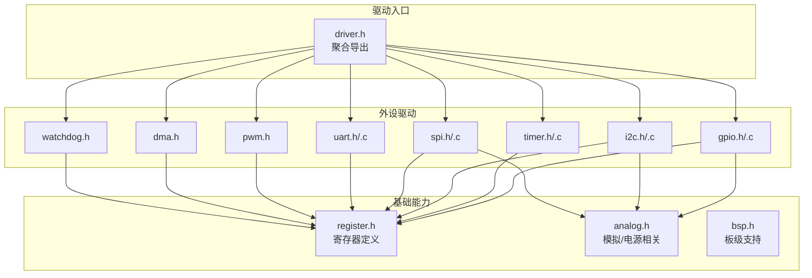
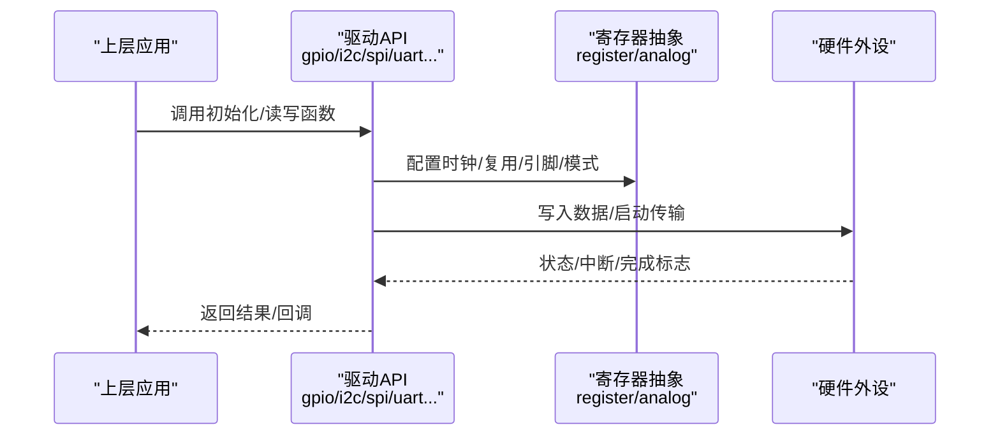
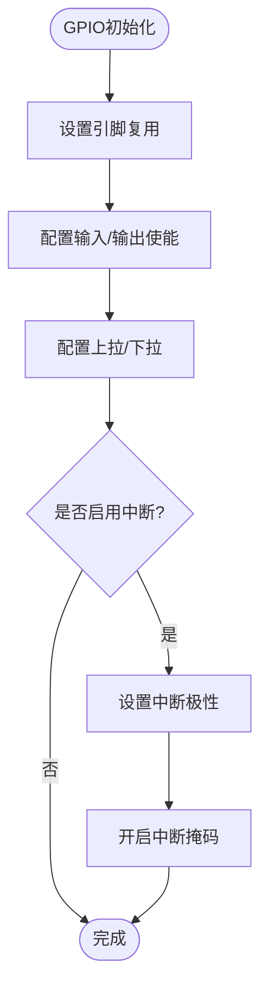
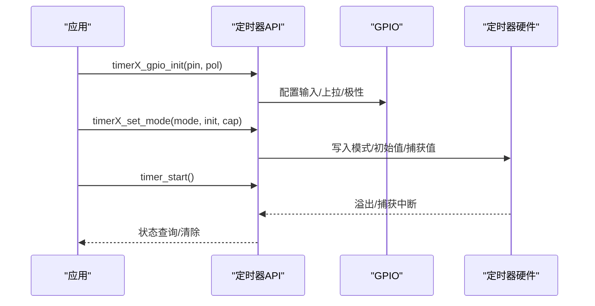
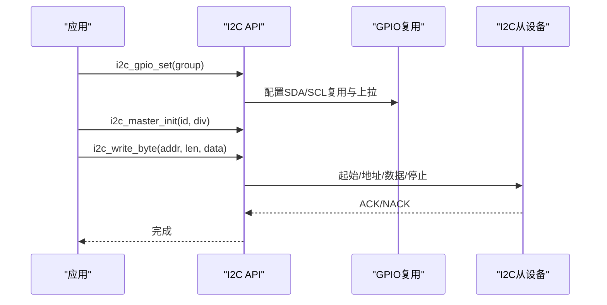
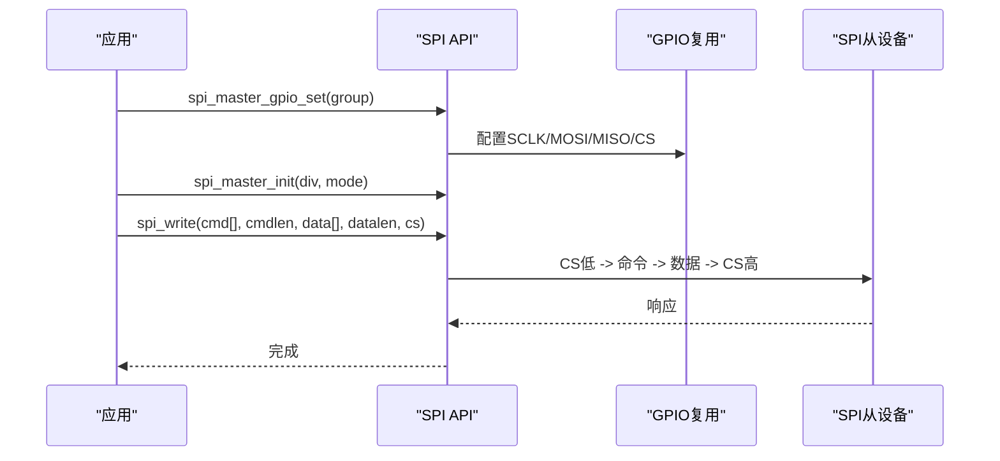
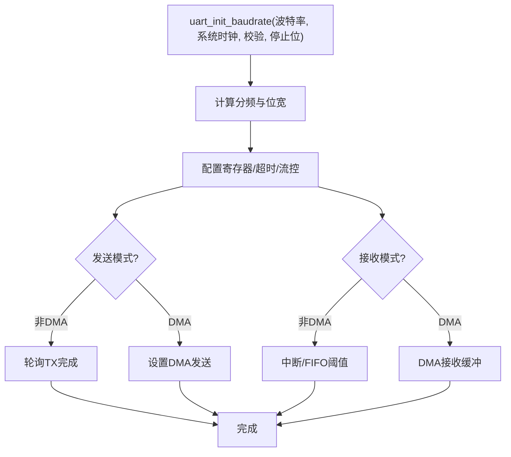
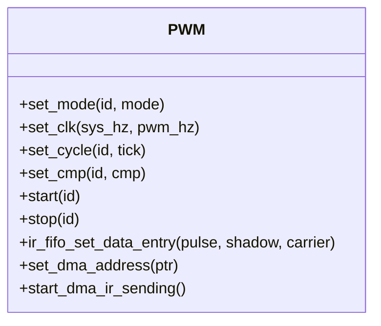
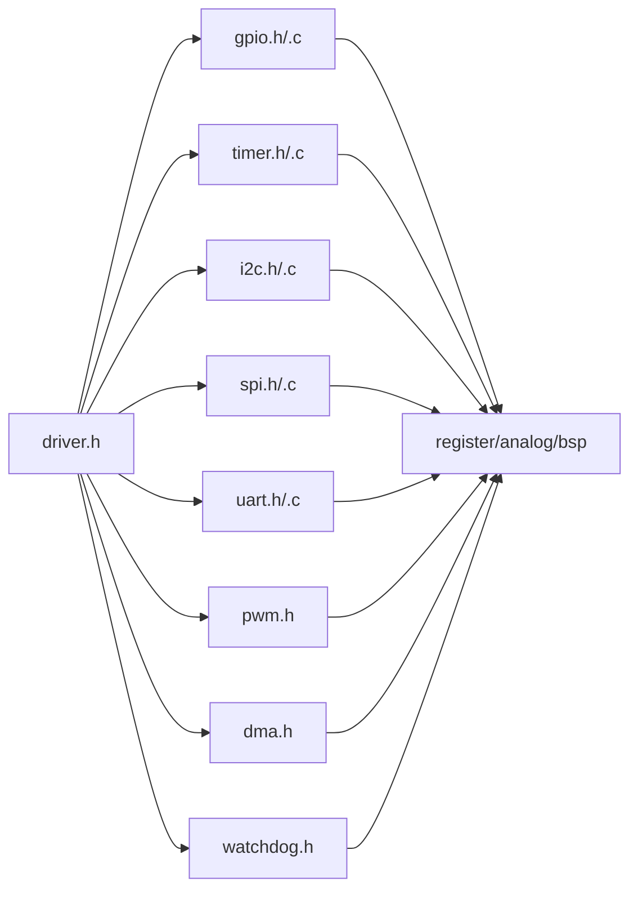

# 驱动层设计

<cite>
**本文引用的文件**
- [driver.h](file://tc_ble_single_sdk/drivers/B85/driver.h)
- [gpio.h](file://tc_ble_single_sdk/drivers/B85/gpio.h)
- [gpio.c](file://tc_ble_single_sdk/drivers/B85/gpio.c)
- [timer.h](file://tc_ble_single_sdk/drivers/B85/timer.h)
- [timer.c](file://tc_ble_single_sdk/drivers/B85/timer.c)
- [i2c.h](file://tc_ble_single_sdk/drivers/B85/i2c.h)
- [i2c.c](file://tc_ble_single_sdk/drivers/B85/i2c.c)
- [spi.h](file://tc_ble_single_sdk/drivers/B85/spi.h)
- [spi.c](file://tc_ble_single_sdk/drivers/B85/spi.c)
- [uart.h](file://tc_ble_single_sdk/drivers/B85/uart.h)
- [uart.c](file://tc_ble_single_sdk/drivers/B85/uart.c)
- [dma.h](file://tc_ble_single_sdk/drivers/B85/dma.h)
- [pwm.h](file://tc_ble_single_sdk/drivers/B85/pwm.h)
- [watchdog.h](file://tc_ble_single_sdk/drivers/B85/watchdog.h)
</cite>

## 目录
1. [简介](#简介)
2. [项目结构](#项目结构)
3. [核心组件](#核心组件)
4. [架构总览](#架构总览)
5. [详细组件分析](#详细组件分析)
6. [依赖关系分析](#依赖关系分析)
7. [性能考虑](#性能考虑)
8. [故障排查指南](#故障排查指南)
9. [结论](#结论)
10. [附录](#附录)

## 简介
本文件面向Telink B85系列芯片的驱动层设计与实现，系统性阐述硬件抽象、外设驱动与系统服务的统一接口设计。重点覆盖GPIO、定时器、I2C、SPI、UART、PWM、DMA、看门狗等常用外设，解释如何通过统一的API屏蔽底层寄存器差异，为上层应用提供稳定、可移植的编程接口。文档同时涵盖中断处理、DMA传输与电源管理相关的驱动要点，并提供流程图与时序图帮助理解关键流程。

## 项目结构
驱动层位于B85目录下，采用“按功能模块划分”的组织方式：每个外设一个头文件与源文件对（如gpio.h/.c、i2c.h/.c），并通过统一的driver.h聚合导出所有驱动接口。时钟、复位、引脚复用等基础能力由bsp/analog/register等底层文件支撑，驱动通过封装这些能力对外暴露简洁API。

图表来源
- [driver.h:28-63](file://tc_ble_single_sdk/drivers/B85/driver.h#L28-L63)

章节来源
- [driver.h:28-63](file://tc_ble_single_sdk/drivers/B85/driver.h#L28-L63)

## 核心组件
- GPIO：引脚分组、复用、输入输出使能、上下拉、驱动强度、中断配置与USB DP/DM复用。
- 定时器：系统时间获取、微秒延时、GPIO触发/宽度捕获模式、定时中断状态管理。
- I2C：主从模式初始化、地址/速度设置、单字节/批量读写、映射/DMA模式说明。
- SPI：主从模式初始化、时钟/工作模式配置、CS选择、命令+数据块读写。
- UART：波特率/校验/停止位配置、非DMA与DMA收发、RTS/CTS流控、错误中断。
- PWM：多通道周期/占空比/相位/极性控制、IR FIFO与DMA波形发送。
- DMA：通道使能/中断、缓冲区大小设置、RF/RX/TX专用通道。
- 看门狗：喂狗、启停、超时复位机制。

章节来源
- [gpio.h:39-125](file://tc_ble_single_sdk/drivers/B85/gpio.h#L39-L125)
- [timer.h:34-71](file://tc_ble_single_sdk/drivers/B85/timer.h#L34-L71)
- [i2c.h:36-75](file://tc_ble_single_sdk/drivers/B85/i2c.h#L36-L75)
- [spi.h:38-64](file://tc_ble_single_sdk/drivers/B85/spi.h#L38-L64)
- [uart.h:53-150](file://tc_ble_single_sdk/drivers/B85/uart.h#L53-L150)
- [pwm.h:35-69](file://tc_ble_single_sdk/drivers/B85/pwm.h#L35-L69)
- [dma.h:50-59](file://tc_ble_single_sdk/drivers/B85/dma.h#L50-L59)
- [watchdog.h:29-66](file://tc_ble_single_sdk/drivers/B85/watchdog.h#L29-L66)

## 架构总览
驱动层以“寄存器抽象 + 外设封装”为核心思想：
- 寄存器抽象：通过register.h等定义访问宏与位域，避免直接裸写。
- 外设封装：将复杂时序与状态机封装为函数，隐藏细节（如I2C起始/停止、SPI忙等待、UART分频计算）。
- 统一入口：driver.h集中include各驱动头，形成单一接入点，便于跨平台移植。

图表来源
- [gpio.c:97-184](file://tc_ble_single_sdk/drivers/B85/gpio.c#L97-L184)
- [i2c.c:87-125](file://tc_ble_single_sdk/drivers/B85/i2c.c#L87-L125)
- [spi.c:113-121](file://tc_ble_single_sdk/drivers/B85/spi.c#L113-L121)
- [uart.c:159-200](file://tc_ble_single_sdk/drivers/B85/uart.c#L159-L200)

## 详细组件分析

### GPIO驱动
- 引脚与复用：定义引脚组与复用功能枚举；提供设置复用、输入/输出使能、电平读写、上拉/下拉、驱动强度、关闭引脚等接口。
- 中断：支持GPIO全局中断及RISC0/RISC1子中断，含极性与掩码配置。
- USB复用：提供USB DP/DM引脚复用与内部上拉控制。

图表来源
- [gpio.c:97-184](file://tc_ble_single_sdk/drivers/B85/gpio.c#L97-L184)
- [gpio.h:173-196](file://tc_ble_single_sdk/drivers/B85/gpio.h#L173-L196)
- [gpio.h:375-423](file://tc_ble_single_sdk/drivers/B85/gpio.h#L375-L423)

章节来源
- [gpio.h:39-125](file://tc_ble_single_sdk/drivers/B85/gpio.h#L39-L125)
- [gpio.h:173-196](file://tc_ble_single_sdk/drivers/B85/gpio.h#L173-L196)
- [gpio.h:244-269](file://tc_ble_single_sdk/drivers/B85/gpio.h#L244-L269)
- [gpio.h:375-423](file://tc_ble_single_sdk/drivers/B85/gpio.h#L375-L423)
- [gpio.c:97-184](file://tc_ble_single_sdk/drivers/B85/gpio.c#L97-L184)

### 定时器驱动
- 系统时间：提供微秒级延时与时间差判断。
- 模式：支持系统时钟计数、GPIO触发、GPIO宽度测量、Tick模式。
- 中断：提供状态查询与清除接口。

图表来源
- [timer.c:45-68](file://tc_ble_single_sdk/drivers/B85/timer.c#L45-L68)
- [timer.c:131-175](file://tc_ble_single_sdk/drivers/B85/timer.c#L131-L175)
- [timer.h:118-175](file://tc_ble_single_sdk/drivers/B85/timer.h#L118-L175)

章节来源
- [timer.h:34-71](file://tc_ble_single_sdk/drivers/B85/timer.h#L34-L71)
- [timer.h:118-175](file://tc_ble_single_sdk/drivers/B85/timer.h#L118-L175)
- [timer.c:32-68](file://tc_ble_single_sdk/drivers/B85/timer.c#L32-L68)
- [timer.c:131-175](file://tc_ble_single_sdk/drivers/B85/timer.c#L131-L175)

### I2C驱动
- 主从模式：支持主设备与从设备两种模式；从设备支持DMA与映射模式。
- 引脚复用：提供多种引脚组选择，自动配置I2C/SPI复用。
- 通信：单字节/批量读写，支持不同地址长度。

图表来源
- [i2c.c:37-75](file://tc_ble_single_sdk/drivers/B85/i2c.c#L37-L75)
- [i2c.c:87-125](file://tc_ble_single_sdk/drivers/B85/i2c.c#L87-L125)
- [i2c.c:135-174](file://tc_ble_single_sdk/drivers/B85/i2c.c#L135-L174)

章节来源
- [i2c.h:36-75](file://tc_ble_single_sdk/drivers/B85/i2c.h#L36-L75)
- [i2c.h:114-176](file://tc_ble_single_sdk/drivers/B85/i2c.h#L114-L176)
- [i2c.c:37-75](file://tc_ble_single_sdk/drivers/B85/i2c.c#L37-L75)
- [i2c.c:87-125](file://tc_ble_single_sdk/drivers/B85/i2c.c#L87-L125)
- [i2c.c:135-174](file://tc_ble_single_sdk/drivers/B85/i2c.c#L135-L174)

### SPI驱动
- 主从模式：支持主设备与从设备，提供时钟分频与工作模式（CPOL/CPHA）配置。
- CS管理：可选择任意GPIO作为片选并控制空闲高电平。
- 数据传输：命令+数据块读写，忙等待确保时序正确。

图表来源
- [spi.c:46-80](file://tc_ble_single_sdk/drivers/B85/spi.c#L46-L80)
- [spi.c:113-121](file://tc_ble_single_sdk/drivers/B85/spi.c#L113-L121)
- [spi.c:135-157](file://tc_ble_single_sdk/drivers/B85/spi.c#L135-L157)

章节来源
- [spi.h:38-64](file://tc_ble_single_sdk/drivers/B85/spi.h#L38-L64)
- [spi.h:97-152](file://tc_ble_single_sdk/drivers/B85/spi.h#L97-L152)
- [spi.c:46-80](file://tc_ble_single_sdk/drivers/B85/spi.c#L46-L80)
- [spi.c:113-121](file://tc_ble_single_sdk/drivers/B85/spi.c#L113-L121)
- [spi.c:135-157](file://tc_ble_single_sdk/drivers/B85/spi.c#L135-L157)

### UART驱动
- 初始化：支持按波特率或分频参数初始化，自动计算最优分频与位宽。
- 收发：提供非DMA与DMA两种方式；支持奇偶校验、停止位、RTS/CTS流控。
- 错误处理：支持奇偶错误检测与清除。

图表来源
- [uart.c:159-200](file://tc_ble_single_sdk/drivers/B85/uart.c#L159-L200)
- [uart.h:243-271](file://tc_ble_single_sdk/drivers/B85/uart.h#L243-L271)
- [uart.h:323-368](file://tc_ble_single_sdk/drivers/B85/uart.h#L323-L368)

章节来源
- [uart.h:53-150](file://tc_ble_single_sdk/drivers/B85/uart.h#L53-L150)
- [uart.h:243-271](file://tc_ble_single_sdk/drivers/B85/uart.h#L243-L271)
- [uart.h:323-368](file://tc_ble_single_sdk/drivers/B85/uart.h#L323-L368)
- [uart.c:159-200](file://tc_ble_single_sdk/drivers/B85/uart.c#L159-L200)

### PWM驱动
- 通道与模式：支持多通道，普通/计数/IR/IR FIFO/DMA波形模式。
- 参数：周期、比较值、相位、极性、脉冲数。
- IR FIFO与DMA：支持FIFO数据写入与DMA波形发送，适用于红外发射等场景。

图表来源
- [pwm.h:83-130](file://tc_ble_single_sdk/drivers/B85/pwm.h#L83-L130)
- [pwm.h:348-400](file://tc_ble_single_sdk/drivers/B85/pwm.h#L348-L400)

章节来源
- [pwm.h:35-69](file://tc_ble_single_sdk/drivers/B85/pwm.h#L35-L69)
- [pwm.h:83-130](file://tc_ble_single_sdk/drivers/B85/pwm.h#L83-L130)
- [pwm.h:348-400](file://tc_ble_single_sdk/drivers/B85/pwm.h#L348-L400)

### DMA驱动
- 通道：UART RX/TX、RF RX/TX、AES编解码、PWM等专用通道。
- 控制：通道使能、中断使能/禁用、缓冲区大小设置、状态查询。
- 使用建议：大数据量传输优先使用DMA，注意对齐与最大长度限制。

章节来源
- [dma.h:50-59](file://tc_ble_single_sdk/drivers/B85/dma.h#L50-L59)
- [dma.h:66-157](file://tc_ble_single_sdk/drivers/B85/dma.h#L66-L157)

### 看门狗
- 功能：设置超时周期、启动/停止、喂狗。
- 适用：防止程序跑飞，提升系统可靠性。

章节来源
- [watchdog.h:29-66](file://tc_ble_single_sdk/drivers/B85/watchdog.h#L29-L66)

## 依赖关系分析
- driver.h聚合所有驱动头，形成统一入口，降低上层耦合。
- 各驱动依赖register/analog/bsp等基础能力，保证跨芯片的可移植性。
- 外设之间相对独立，但共享GPIO复用与中断资源，需合理分配引脚与中断优先级。

图表来源
- [driver.h:28-63](file://tc_ble_single_sdk/drivers/B85/driver.h#L28-L63)

章节来源
- [driver.h:28-63](file://tc_ble_single_sdk/drivers/B85/driver.h#L28-L63)

## 性能考虑
- 中断与轮询：高频小数据适合中断，大数据用DMA；UART非DMA模式下注意FIFO深度与阈值设置。
- 忙等待：SPI/I2C读写中使用忙等待确保时序，避免竞争条件。
- 时钟与功耗：合理配置外设时钟与睡眠延时，减少不必要的唤醒。
- DMA对齐与长度：DMA缓冲需满足对齐要求，注意单次最大长度限制。

[本节为通用指导，不直接分析具体文件]

## 故障排查指南
- GPIO中断误触发：在设置极性与使能前清除中断源，避免意外中断。
- I2C从设备映射：确认映射模式下的地址偏移与自动递增配置。
- SPI读取首字节：读操作时首字节无意义，需丢弃后再取数据。
- UART奇偶错误：发生错误后及时清除标志，必要时切换DMA模式。
- PWM IR FIFO：FIFO满时需等待或清空，DMA发送长度受限于首四字节指示长度。

章节来源
- [gpio.h:391-423](file://tc_ble_single_sdk/drivers/B85/gpio.h#L391-L423)
- [i2c.c:105-125](file://tc_ble_single_sdk/drivers/B85/i2c.c#L105-L125)
- [spi.c:170-198](file://tc_ble_single_sdk/drivers/B85/spi.c#L170-L198)
- [uart.h:372-392](file://tc_ble_single_sdk/drivers/B85/uart.h#L372-L392)
- [pwm.h:348-400](file://tc_ble_single_sdk/drivers/B85/pwm.h#L348-L400)

## 结论
该驱动层通过清晰的模块化设计与统一的API封装，有效屏蔽了底层寄存器差异，提供了稳定、易用的外设接口。结合中断、DMA与电源管理策略，能够满足音频鼠标等多模态应用的实时性与低功耗需求。建议在项目中遵循引脚复用规范、合理使用DMA与中断，并严格遵循各驱动的初始化顺序与时序约束。

## 附录
- 典型使用步骤（示例路径，不含代码内容）：
  - GPIO：初始化→复用→输入/输出使能→上拉/下拉→可选中断配置
    - 参考：[gpio.c:97-184](file://tc_ble_single_sdk/drivers/B85/gpio.c#L97-L184)、[gpio.h:173-196](file://tc_ble_single_sdk/drivers/B85/gpio.h#L173-L196)
  - I2C：引脚复用→主/从初始化→地址与速度设置→读写
    - 参考：[i2c.c:37-75](file://tc_ble_single_sdk/drivers/B85/i2c.c#L37-L75)、[i2c.c:87-125](file://tc_ble_single_sdk/drivers/B85/i2c.c#L87-L125)、[i2c.c:135-174](file://tc_ble_single_sdk/drivers/B85/i2c.c#L135-L174)
  - SPI：引脚复用→主模式初始化→CS选择→命令+数据读写
    - 参考：[spi.c:46-80](file://tc_ble_single_sdk/drivers/B85/spi.c#L46-L80)、[spi.c:113-121](file://tc_ble_single_sdk/drivers/B85/spi.c#L113-L121)、[spi.c:135-157](file://tc_ble_single_sdk/drivers/B85/spi.c#L135-L157)
  - UART：波特率初始化→收发模式选择→DMA/中断配置
    - 参考：[uart.c:159-200](file://tc_ble_single_sdk/drivers/B85/uart.c#L159-L200)、[uart.h:243-271](file://tc_ble_single_sdk/drivers/B85/uart.h#L243-L271)、[uart.h:323-368](file://tc_ble_single_sdk/drivers/B85/uart.h#L323-L368)
  - PWM：模式/时钟/周期/占空比设置→IR FIFO或DMA发送
    - 参考：[pwm.h:83-130](file://tc_ble_single_sdk/drivers/B85/pwm.h#L83-L130)、[pwm.h:348-400](file://tc_ble_single_sdk/drivers/B85/pwm.h#L348-L400)
  - DMA：通道使能→缓冲区大小→中断/状态管理
    - 参考：[dma.h:66-157](file://tc_ble_single_sdk/drivers/B85/dma.h#L66-L157)
  - 看门狗：设置周期→启动→定期喂狗
    - 参考：[watchdog.h:29-66](file://tc_ble_single_sdk/drivers/B85/watchdog.h#L29-L66)