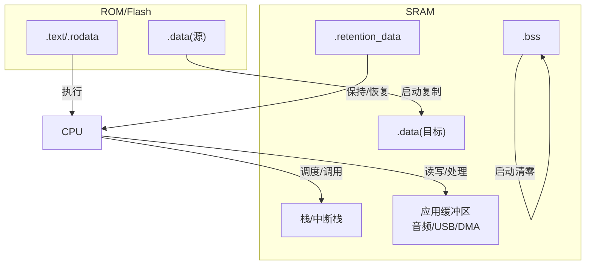
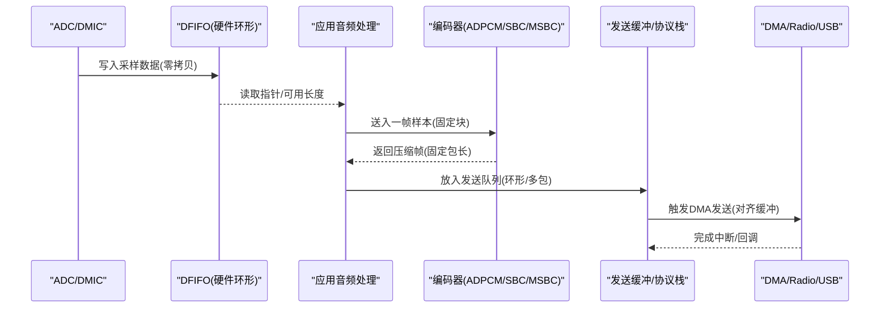
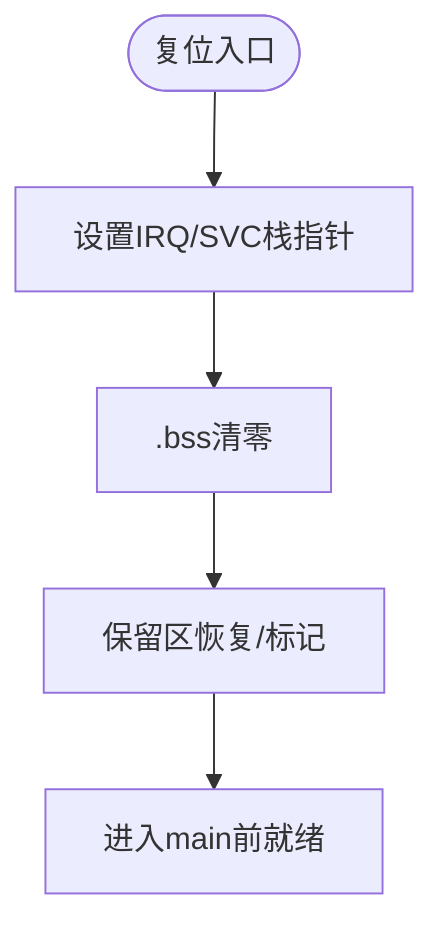
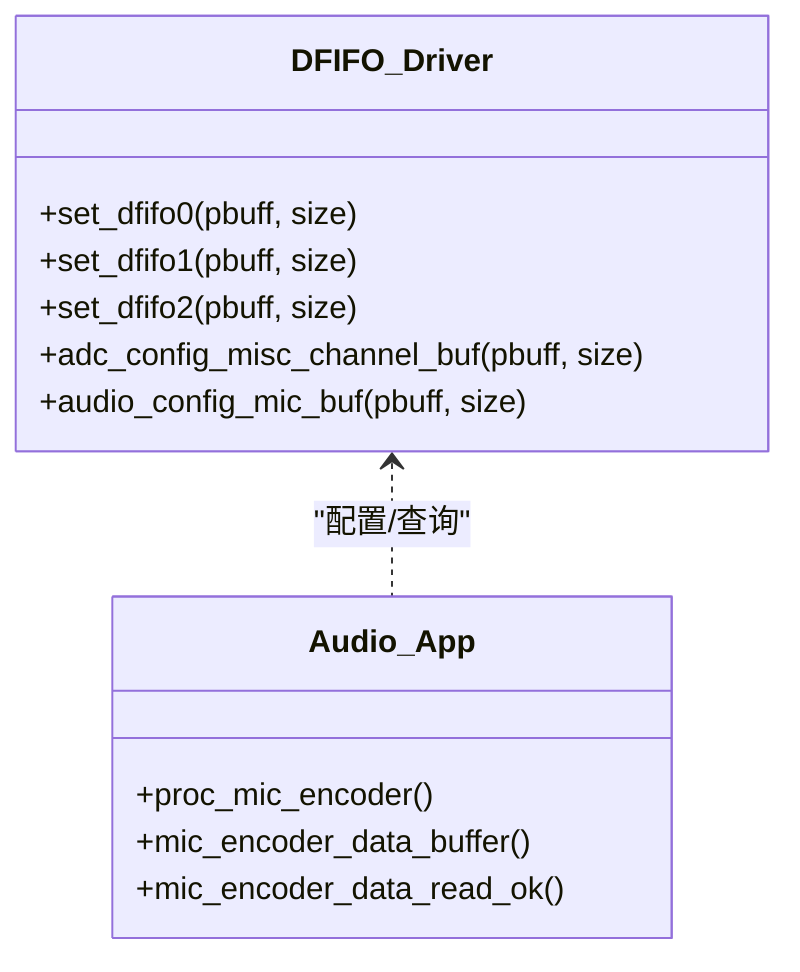
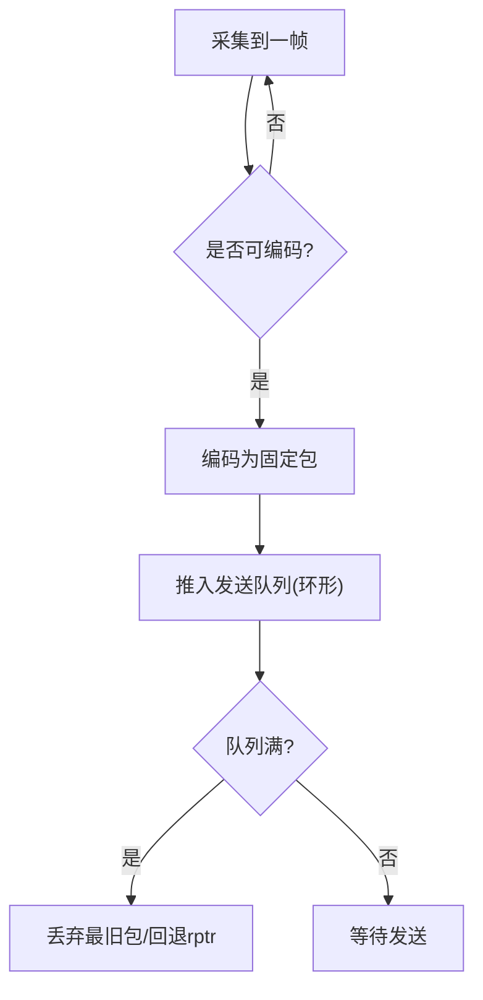
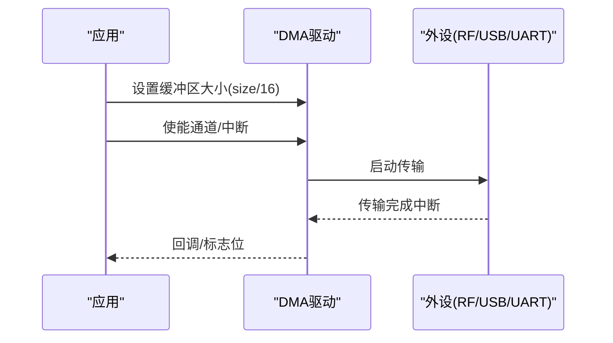
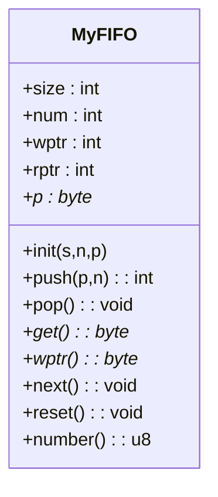
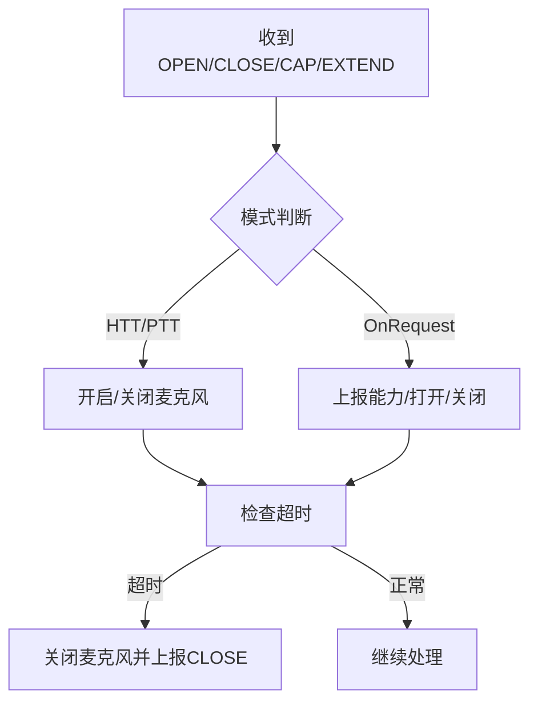
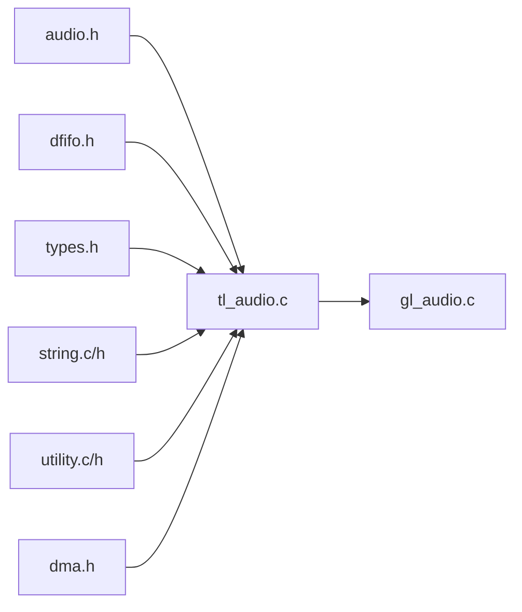

# 内存管理策略

<cite>
**本文引用的文件**
- [cstartup_825x.S](file://tc_ble_single_sdk/boot/B85/cstartup_825x.S)
- [boot_B85_dual_mouse.link](file://doc/boot_B85_dual_mouse.link)
- [boot_b87_triple_mouse.link](file://doc/boot_b87_triple_mouse.link)
- [dma.h](file://tc_ble_single_sdk/drivers/B85/dma.h)
- [dfifo.h](file://tc_ble_single_sdk/drivers/B85/dfifo.h)
- [audio.h](file://tc_ble_single_sdk/drivers/B85/audio.h)
- [tl_audio.h](file://tc_ble_single_sdk/application/audio/tl_audio.h)
- [tl_audio.c](file://tc_ble_single_sdk/application/audio/tl_audio.c)
- [gl_audio.h](file://tc_ble_single_sdk/application/audio/gl_audio.h)
- [gl_audio.c](file://tc_ble_single_sdk/application/audio/gl_audio.c)
- [utility.h](file://tc_ble_single_sdk/common/utility.h)
- [utility.c](file://tc_ble_single_sdk/common/utility.c)
- [string.c](file://8373_dongle_for_km/common/string.c)
- [string.h](file://8373_dongle_for_km/common/string.h)
- [types.h](file://tc_ble_single_sdk/common/types.h)
</cite>

## 目录
1. [简介](#简介)
2. [项目结构](#项目结构)
3. [核心组件](#核心组件)
4. [架构总览](#架构总览)
5. [详细组件分析](#详细组件分析)
6. [依赖关系分析](#依赖关系分析)
7. [性能考量](#性能考量)
8. [故障排查指南](#故障排查指南)
9. [结论](#结论)
10. [附录](#附录)

## 简介
本文件面向该音频鼠标SDK的内存管理策略，围绕以下目标展开：
- 解释系统内各数据类型的内存分配与管理机制（静态段、保留区、堆栈与缓冲区）。
- 阐述缓冲区池设计（固定大小缓冲与动态复用）、DMA传输中的对齐要求与零拷贝优化。
- 说明内存碎片化预防措施与“垃圾回收”式指针推进策略。
- 提供内存使用监控工具与分析方法（含泄漏检测与性能瓶颈识别）。
- 详述模块间内存共享机制与同步策略。
- 给出内存优化最佳实践与调试技巧。

## 项目结构
从链接脚本与启动代码可见，系统采用典型的嵌入式内存布局：
- .text/.rodata：只读代码与常量。
- .data：已初始化全局变量，由启动阶段从Flash复制到RAM。
- .bss：未初始化全局变量，启动时清零。
- .retention_data：掉电保持区，用于跨低功耗状态保存关键状态。
- .data_no_init：位于RAM但不需启动时清理的区域。
- 栈与中断栈：在启动时设置SP，IRQ/SVC模式分别有独立栈空间。

图表来源
- [cstartup_825x.S:342-363](file://tc_ble_single_sdk/boot/B85/cstartup_825x.S#L342-L363)
- [boot_B85_dual_mouse.link:103-137](file://doc/boot_B85_dual_mouse.link#L103-L137)
- [boot_b87_triple_mouse.link:113-137](file://doc/boot_b87_triple_mouse.link#L113-L137)

章节来源
- [cstartup_825x.S:342-363](file://tc_ble_single_sdk/boot/B85/cstartup_825x.S#L342-L363)
- [boot_B85_dual_mouse.link:103-137](file://doc/boot_B85_dual_mouse.link#L103-L137)
- [boot_b87_triple_mouse.link:113-137](file://doc/boot_b87_triple_mouse.link#L113-L137)

## 核心组件
- 类型与基础工具
  - 统一整型类型定义，避免平台差异导致的对齐与溢出问题。
  - 高效内存操作函数族（按字对齐的memcpy4、memset、零值检测等），减少CPU开销。
- 音频采集与处理
  - DFIFO硬件环形缓冲，配合驱动API配置地址与深度，实现ADC/DMIC/I2S到SRAM的零拷贝数据通路。
  - 应用层双缓冲/多包缓冲（TL_MIC_PACKET_BUFFER_NUM）与编码器输入输出缓冲，降低延迟并避免阻塞。
- DMA与外设
  - DMA通道控制、中断使能、缓冲区大小设置；RF收发路径通过DMA直接搬运数据，减少CPU参与。
- 通用FIFO与内存池
  - 基于固定块大小的my_fifo_t环形队列，支持push/pop/get/wptr，避免动态分配与碎片化。
  - 宏ATT_ALIGN4_DMA_BUFF确保缓冲区满足DMA对齐需求。

章节来源
- [types.h:27-41](file://tc_ble_single_sdk/common/types.h#L27-L41)
- [string.c:75-110](file://8373_dongle_for_km/common/string.c#L75-L110)
- [string.h:34-61](file://8373_dongle_for_km/common/string.h#L34-L61)
- [dfifo.h:50-112](file://tc_ble_single_sdk/drivers/B85/dfifo.h#L50-L112)
- [tl_audio.h:41-63](file://tc_ble_single_sdk/application/audio/tl_audio.h#L41-L63)
- [utility.h:215-216](file://tc_ble_single_sdk/common/utility.h#L215-L216)
- [utility.c:85-166](file://tc_ble_single_sdk/common/utility.c#L85-L166)
- [dma.h:149-157](file://tc_ble_single_sdk/drivers/B85/dma.h#L149-L157)

## 架构总览
下图展示音频数据从采集到编码、再经BLE/GATT或USB输出的内存流转，强调零拷贝与环形缓冲的关键节点。

图表来源
- [dfifo.h:50-112](file://tc_ble_single_sdk/drivers/B85/dfifo.h#L50-L112)
- [tl_audio.c:338-418](file://tc_ble_single_sdk/application/audio/tl_audio.c#L338-L418)
- [tl_audio.c:444-524](file://tc_ble_single_sdk/application/audio/tl_audio.c#L444-L524)
- [tl_audio.c:552-632](file://tc_ble_single_sdk/application/audio/tl_audio.c#L552-L632)
- [tl_audio.c:652-732](file://tc_ble_single_sdk/application/audio/tl_audio.c#L652-L732)
- [tl_audio.c:755-800](file://tc_ble_single_sdk/application/audio/tl_audio.c#L755-L800)
- [dma.h:149-157](file://tc_ble_single_sdk/drivers/B85/dma.h#L149-L157)

## 详细组件分析

### 启动期内存布局与初始化
- 链接脚本定义.data/.bss/.retention_data等段的起始与结束符号，供启动代码使用。
- 启动汇编负责：
  - 设置IRQ/SVC模式下的栈指针。
  - 将.bss清零。
  - 将.retention_data进行保持/恢复（根据芯片特性）。
  - 可选地初始化FLL栈区域。

图表来源
- [cstartup_825x.S:342-363](file://tc_ble_single_sdk/boot/B85/cstartup_825x.S#L342-L363)
- [boot_B85_dual_mouse.link:103-137](file://doc/boot_B85_dual_mouse.link#L103-L137)
- [boot_b87_triple_mouse.link:113-137](file://doc/boot_b87_triple_mouse.link#L113-L137)

章节来源
- [cstartup_825x.S:342-363](file://tc_ble_single_sdk/boot/B85/cstartup_825x.S#L342-L363)
- [boot_B85_dual_mouse.link:103-137](file://doc/boot_B85_dual_mouse.link#L103-L137)
- [boot_b87_triple_mouse.link:113-137](file://doc/boot_b87_triple_mouse.link#L113-L137)

### 音频采集与DFIFO环形缓冲
- DFIFO提供多个通道（DFIFO0/1/2/MISC/Audio），通过设置地址与深度（以16字节为单位）建立硬件环形缓冲。
- 应用侧通过get_mic_wr_ptr获取写指针，计算可用数据长度，按需消费，避免溢出。
- 音频路径尽量零拷贝：ADC/DMIC直写到DFIFO，应用仅读指针与必要的数据移动。

图表来源
- [dfifo.h:50-112](file://tc_ble_single_sdk/drivers/B85/dfifo.h#L50-L112)
- [audio.h:127-161](file://tc_ble_single_sdk/drivers/B85/audio.h#L127-L161)
- [tl_audio.c:338-418](file://tc_ble_single_sdk/application/audio/tl_audio.c#L338-L418)

章节来源
- [dfifo.h:50-112](file://tc_ble_single_sdk/drivers/B85/dfifo.h#L50-L112)
- [audio.h:127-161](file://tc_ble_single_sdk/drivers/B85/audio.h#L127-L161)
- [tl_audio.c:338-418](file://tc_ble_single_sdk/application/audio/tl_audio.c#L338-L418)

### 编码器与多包缓冲（零拷贝优化）
- 不同音频模式下，应用将固定长度的原始帧送入编码器，得到固定长度的压缩帧。
- 使用TL_MIC_PACKET_BUFFER_NUM个固定大小包缓冲，形成生产者-消费者模型：
  - 生产者：音频采集/滤波/编码线程。
  - 消费者：BLE/GATT或USB发送任务。
- 通过wptr/rptr推进实现“软GC”，无需释放内存，避免碎片化。

图表来源
- [tl_audio.c:338-418](file://tc_ble_single_sdk/application/audio/tl_audio.c#L338-L418)
- [tl_audio.c:444-524](file://tc_ble_single_sdk/application/audio/tl_audio.c#L444-L524)
- [tl_audio.c:552-632](file://tc_ble_single_sdk/application/audio/tl_audio.c#L552-L632)
- [tl_audio.c:652-732](file://tc_ble_single_sdk/application/audio/tl_audio.c#L652-L732)
- [tl_audio.c:755-800](file://tc_ble_single_sdk/application/audio/tl_audio.c#L755-L800)

章节来源
- [tl_audio.c:338-418](file://tc_ble_single_sdk/application/audio/tl_audio.c#L338-L418)
- [tl_audio.c:444-524](file://tc_ble_single_sdk/application/audio/tl_audio.c#L444-L524)
- [tl_audio.c:552-632](file://tc_ble_single_sdk/application/audio/tl_audio.c#L552-L632)
- [tl_audio.c:652-732](file://tc_ble_single_sdk/application/audio/tl_audio.c#L652-L732)
- [tl_audio.c:755-800](file://tc_ble_single_sdk/application/audio/tl_audio.c#L755-L800)

### DMA传输与对齐要求
- DMA通道支持UART、RF、AES、PWM等，提供使能/禁用、中断屏蔽、缓冲区大小设置等接口。
- 缓冲区大小以16字节为单位设置，确保与硬件匹配。
- 通用宏ATT_ALIGN4_DMA_BUFF保证缓冲区按4字节对齐，满足DMA/协议栈对齐要求。

图表来源
- [dma.h:61-157](file://tc_ble_single_sdk/drivers/B85/dma.h#L61-L157)
- [utility.h:215-216](file://tc_ble_single_sdk/common/utility.h#L215-L216)

章节来源
- [dma.h:61-157](file://tc_ble_single_sdk/drivers/B85/dma.h#L61-L157)
- [utility.h:215-216](file://tc_ble_single_sdk/common/utility.h#L215-L216)

### 通用FIFO与内存池
- my_fifo_t为固定块环形队列，提供init/push/pop/get/wptr/next/reset/number等接口。
- 适用于音频帧、USB报文、GATT通知等场景，避免动态分配与碎片化。
- 结合MYFIFO_INIT宏可在编译期分配连续内存，便于缓存命中与DMA友好。

图表来源
- [utility.c:85-166](file://tc_ble_single_sdk/common/utility.c#L85-L166)
- [utility.h:215-216](file://tc_ble_single_sdk/common/utility.h#L215-L216)

章节来源
- [utility.c:85-166](file://tc_ble_single_sdk/common/utility.c#L85-L166)
- [utility.h:215-216](file://tc_ble_single_sdk/common/utility.h#L215-L216)

### 应用状态与超时处理（Google语音模式）
- 应用层维护保留区状态（按键、流ID、超时计时器等），用于跨低功耗状态保持。
- 超时处理逻辑关闭麦克风、上报关闭事件，防止资源泄露与死锁。

图表来源
- [gl_audio.c:60-211](file://tc_ble_single_sdk/application/audio/gl_audio.c#L60-L211)
- [gl_audio.c:213-355](file://tc_ble_single_sdk/application/audio/gl_audio.c#L213-L355)
- [gl_audio.h:31-63](file://tc_ble_single_sdk/application/audio/gl_audio.h#L31-L63)

章节来源
- [gl_audio.c:60-211](file://tc_ble_single_sdk/application/audio/gl_audio.c#L60-L211)
- [gl_audio.c:213-355](file://tc_ble_single_sdk/application/audio/gl_audio.c#L213-L355)
- [gl_audio.h:31-63](file://tc_ble_single_sdk/application/audio/gl_audio.h#L31-L63)

## 依赖关系分析
- 音频链路依赖：
  - audio.h提供底层音频I/O与时钟配置。
  - dfifo.h提供硬件环形缓冲配置。
  - tl_audio.c实现具体编码流程与缓冲管理。
  - gl_audio.c实现上层协议交互与状态机。
- 内存工具依赖：
  - types.h统一类型。
  - string.c/h提供高效内存操作。
  - utility.c/h提供FIFO与对齐宏。
  - dma.h提供DMA通道控制。

图表来源
- [audio.h:127-161](file://tc_ble_single_sdk/drivers/B85/audio.h#L127-L161)
- [dfifo.h:50-112](file://tc_ble_single_sdk/drivers/B85/dfifo.h#L50-L112)
- [tl_audio.c:338-800](file://tc_ble_single_sdk/application/audio/tl_audio.c#L338-L800)
- [gl_audio.c:60-355](file://tc_ble_single_sdk/application/audio/gl_audio.c#L60-L355)
- [types.h:27-41](file://tc_ble_single_sdk/common/types.h#L27-L41)
- [string.c:75-110](file://8373_dongle_for_km/common/string.c#L75-L110)
- [utility.c:85-166](file://tc_ble_single_sdk/common/utility.c#L85-L166)
- [dma.h:61-157](file://tc_ble_single_sdk/drivers/B85/dma.h#L61-L157)

章节来源
- [audio.h:127-161](file://tc_ble_single_sdk/drivers/B85/audio.h#L127-L161)
- [dfifo.h:50-112](file://tc_ble_single_sdk/drivers/B85/dfifo.h#L50-L112)
- [tl_audio.c:338-800](file://tc_ble_single_sdk/application/audio/tl_audio.c#L338-L800)
- [gl_audio.c:60-355](file://tc_ble_single_sdk/application/audio/gl_audio.c#L60-L355)
- [types.h:27-41](file://tc_ble_single_sdk/common/types.h#L27-L41)
- [string.c:75-110](file://8373_dongle_for_km/common/string.c#L75-L110)
- [utility.c:85-166](file://tc_ble_single_sdk/common/utility.c#L85-L166)
- [dma.h:61-157](file://tc_ble_single_sdk/drivers/B85/dma.h#L61-L157)

## 性能考量
- 零拷贝优先：
  - 使用DFIFO硬件环形缓冲，应用仅读指针与必要的数据移动，减少CPU占用。
  - 编码器输入输出均为固定长度块，避免动态分配与拷贝。
- 对齐与批量操作：
  - 使用memcpy4、memset4、ismemzero4等按字对齐的高效函数，提升吞吐。
  - ATT_ALIGN4_DMA_BUFF确保DMA友好对齐。
- 环形缓冲与滑动窗口：
  - 通过wptr/rptr推进实现“软GC”，避免内存碎片与频繁释放。
  - 合理设置TL_MIC_PACKET_BUFFER_NUM与包大小，平衡延迟与稳定性。
- DMA与中断：
  - 使用DMA通道批量传输，减少CPU干预；在中断中仅做最小化处理。
- 功耗与保留区：
  - 关键状态放入.retention_data，降低唤醒成本与状态重建开销。

[本节为通用指导，不直接分析具体文件]

## 故障排查指南
- 常见问题定位
  - 音频卡顿/爆音：检查DFIFO写指针与可用长度，确认未发生溢出；核对TL_MIC_PACKET_BUFFER_NUM与包大小是否匹配。
  - DMA传输失败：确认缓冲区大小按16字节设置，且缓冲区按4字节对齐；检查DMA通道使能与中断屏蔽。
  - 内存泄漏/状态丢失：核查保留区变量是否正确更新；检查超时处理是否关闭麦克风并上报关闭事件。
- 诊断手段
  - 使用hex_to_str打印关键缓冲区内容，辅助定位数据异常。
  - 利用ismemzero4快速判断缓冲区是否为空，辅助判断消费端是否滞后。
  - 通过gl_audio.c中的超时处理逻辑，观察是否在异常情况下正确退出。
- 建议
  - 在关键路径加入计数与统计（如丢包数、溢出次数），便于长期稳定性评估。
  - 对新增缓冲区统一使用固定块+环形队列模式，避免引入动态分配。

章节来源
- [utility.c:168-186](file://tc_ble_single_sdk/common/utility.c#L168-L186)
- [string.c:104-179](file://8373_dongle_for_km/common/string.c#L104-L179)
- [gl_audio.c:185-211](file://tc_ble_single_sdk/application/audio/gl_audio.c#L185-L211)

## 结论
该SDK通过“硬件环形缓冲+固定块环形队列+DMA零拷贝”的组合，实现了低延迟、高吞吐、低碎片化的音频数据通路。启动期的严格内存布局与保留区机制保障了低功耗场景下的状态一致性。遵循本文的策略与实践，可进一步提升系统的稳定性与性能。

[本节为总结性内容，不直接分析具体文件]

## 附录
- 术语
  - DFIFO：数字FIFO，硬件环形缓冲。
  - 零拷贝：数据在设备与内存之间直接搬运，避免CPU参与的多次拷贝。
  - 保留区：掉电保持的RAM区域，用于跨低功耗状态保存关键状态。
- 参考路径
  - 音频采集与编码：见tl_audio.c相关分支。
  - 协议交互与状态机：见gl_audio.c。
  - 底层驱动：见audio.h、dfifo.h、dma.h。
  - 工具函数：见utility.c/h、string.c/h、types.h。

[本节为补充信息，不直接分析具体文件]