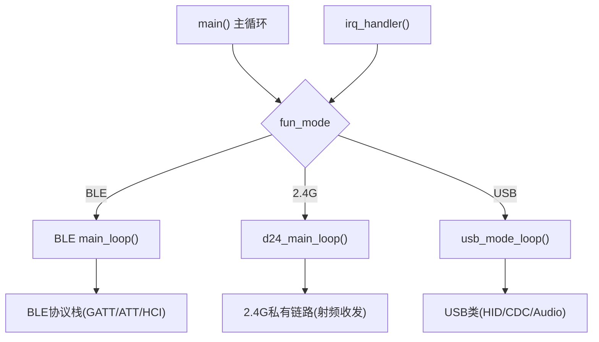
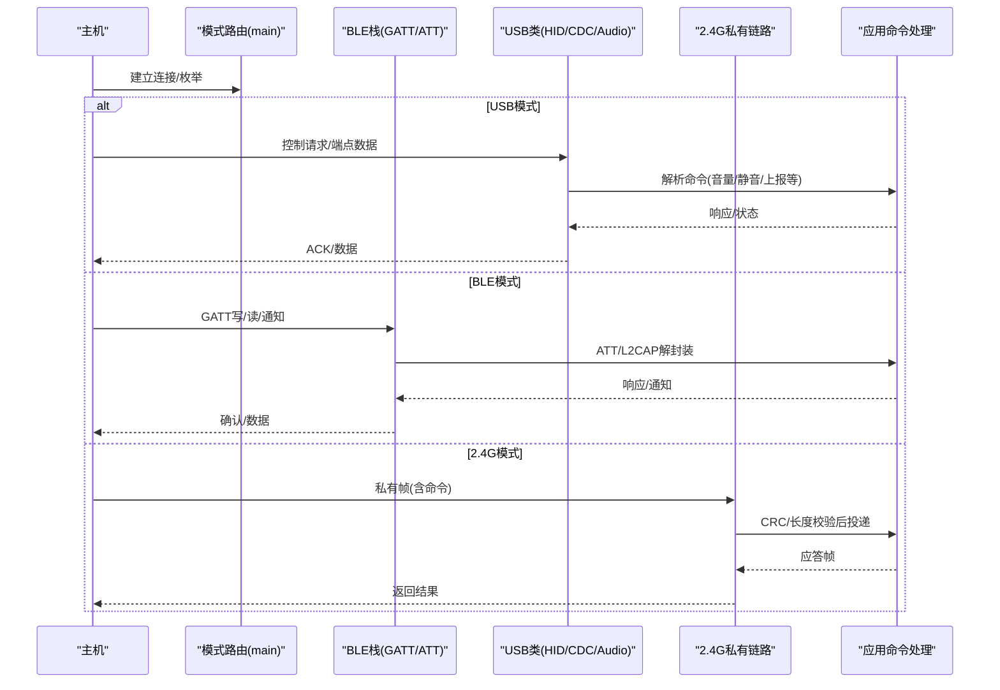
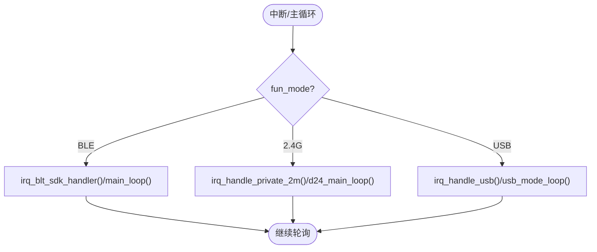
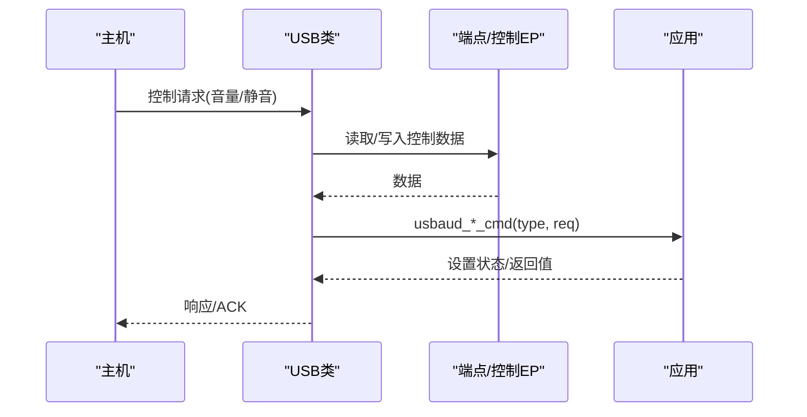
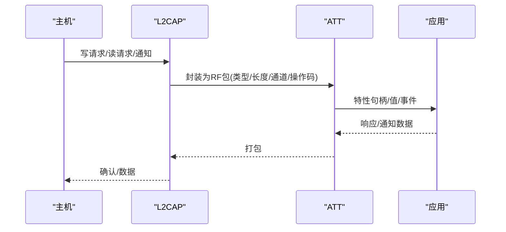
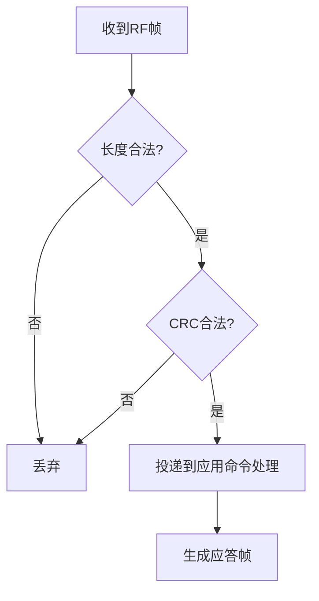
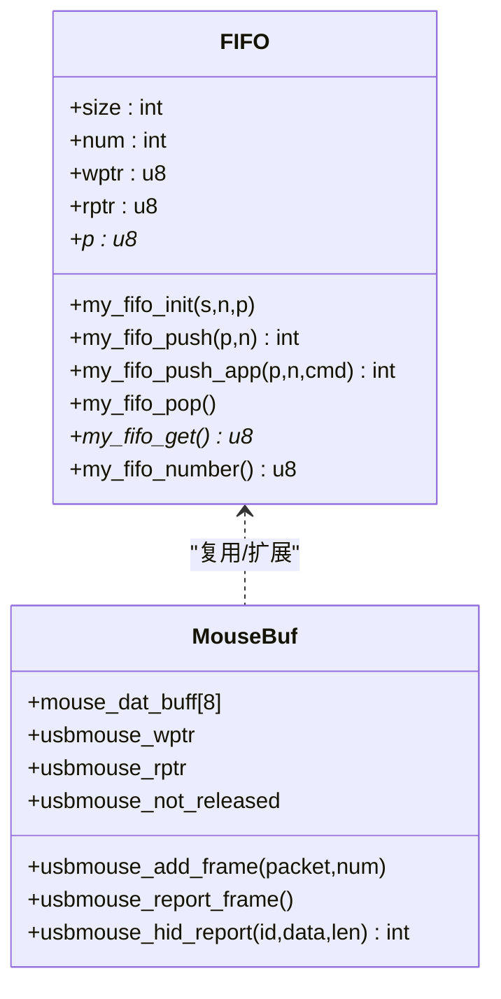
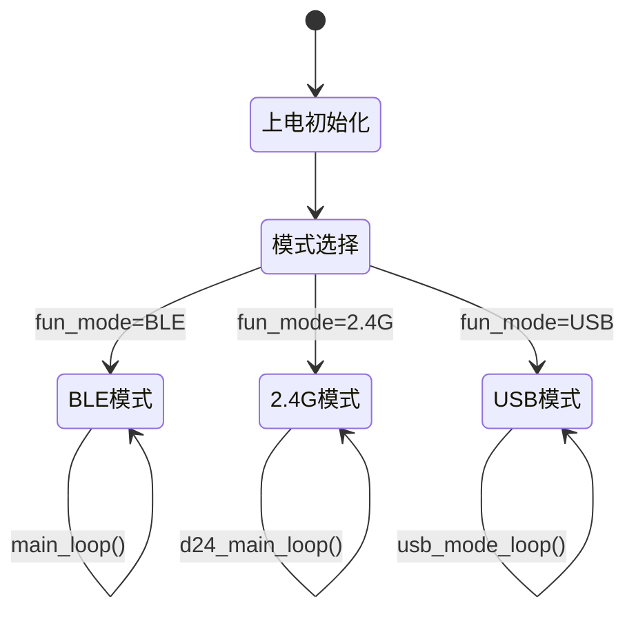
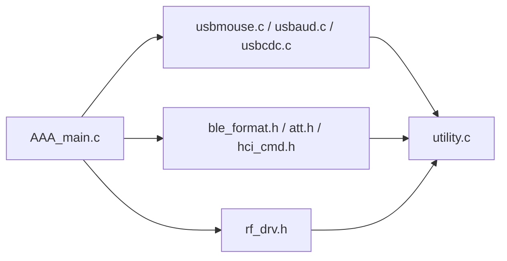

# 控制命令流

<cite>
**本文引用的文件**
- [AAA_main.c](file://tc_ble_single_sdk/vendor/827x_three_mode_mouse/AAA_main.c)
- [usbmouse.c](file://tc_ble_single_sdk/application/app/usbmouse.c)
- [usbaud.c](file://tc_ble_single_sdk/application/app/usbaud.c)
- [usbcdc.c](file://tc_ble_single_sdk/application/app/usbcdc.c)
- [utility.c](file://tc_ble_single_sdk/common/utility.c)
- [ble_format.h](file://tc_ble_single_sdk/stack/ble/ble_format.h)
- [att.h](file://tc_ble_single_sdk/stack/ble/host/attr/att.h)
- [hci_cmd.h](file://tc_ble_single_sdk/stack/ble/hci/hci_cmd.h)
- [rf_drv.h](file://tc_ble_single_sdk/drivers/B85/lib/include/rf_drv.h)
</cite>

## 目录
1. [简介](#简介)
2. [项目结构](#项目结构)
3. [核心组件](#核心组件)
4. [架构总览](#架构总览)
5. [详细组件分析](#详细组件分析)
6. [依赖关系分析](#依赖关系分析)
7. [性能考虑](#性能考虑)
8. [故障排查指南](#故障排查指南)
9. [结论](#结论)
10. [附录](#附录)

## 简介
本文件围绕三模音频鼠标的“控制命令流”进行系统化说明，覆盖主机指令的解析、执行与响应全流程；阐述BLE、2.4G、USB三种连接模式下的命令传输协议与数据格式；描述命令队列管理机制（优先级调度、并发处理、错误恢复）；详述设备状态管理（模式切换、连接管理、资源分配）；提供关键路径的时序图与状态机图；解释命令验证、安全检查与权限控制机制；并包含超时处理、重试策略与故障诊断方法。

## 项目结构
该SDK采用分层组织：应用层（USB HID/CDC/Audio、键盘/鼠标）、通用工具（FIFO/字节序转换）、协议栈（BLE GATT/ATT/HCI、2.4G私有链路）、驱动层（RF/USB/时钟/中断）。入口主循环根据当前功能模式分发到不同子系统的主循环，并在统一中断入口中按模式路由至对应处理函数。

图表来源
- [AAA_main.c:59-75](file://tc_ble_single_sdk/vendor/827x_three_mode_mouse/AAA_main.c#L59-L75)
- [AAA_main.c:530-558](file://tc_ble_single_sdk/vendor/827x_three_mode_mouse/AAA_main.c#L530-L558)

章节来源
- [AAA_main.c:59-75](file://tc_ble_single_sdk/vendor/827x_three_mode_mouse/AAA_main.c#L59-L75)
- [AAA_main.c:335-558](file://tc_ble_single_sdk/vendor/827x_three_mode_mouse/AAA_main.c#L335-L558)

## 核心组件
- 模式路由与主循环：根据全局模式变量选择BLE/2.4G/USB主循环，并在中断中按模式分派。
- USB命令通道：HID鼠标报告、CDC串口透传、Audio控制面（音量/静音）通过端点或控制请求完成命令下发与上报。
- BLE命令通道：基于GATT特性读写、通知/指示，底层由ATT/L2CAP封装为RF包格式。
- 2.4G命令通道：私有链路帧，长度与CRC校验由射频驱动宏判定。
- 通用队列与工具：环形FIFO用于缓冲命令/数据包，支持带命令字压入；字节序转换工具确保跨端一致性。

章节来源
- [AAA_main.c:59-75](file://tc_ble_single_sdk/vendor/827x_three_mode_mouse/AAA_main.c#L59-L75)
- [usbmouse.c:44-151](file://tc_ble_single_sdk/application/app/usbmouse.c#L44-L151)
- [usbaud.c:162-293](file://tc_ble_single_sdk/application/app/usbaud.c#L162-L293)
- [usbcdc.c:42-93](file://tc_ble_single_sdk/application/app/usbcdc.c#L42-L93)
- [utility.c:85-166](file://tc_ble_single_sdk/common/utility.c#L85-L166)
- [ble_format.h:122-266](file://tc_ble_single_sdk/stack/ble/ble_format.h#L122-L266)
- [rf_drv.h:363-377](file://tc_ble_single_sdk/drivers/B85/lib/include/rf_drv.h#L363-L377)

## 架构总览
下图展示从主机到设备的端到端命令流：主机通过USB/BLE/2.4G发送命令，设备在各自协议栈中解封装后进入应用层命令处理器，最终更新设备状态并回送响应。

图表来源
- [AAA_main.c:530-558](file://tc_ble_single_sdk/vendor/827x_three_mode_mouse/AAA_main.c#L530-L558)
- [usbmouse.c:107-151](file://tc_ble_single_sdk/application/app/usbmouse.c#L107-L151)
- [usbaud.c:162-293](file://tc_ble_single_sdk/application/app/usbaud.c#L162-L293)
- [usbcdc.c:42-93](file://tc_ble_single_sdk/application/app/usbcdc.c#L42-L93)
- [ble_format.h:122-266](file://tc_ble_single_sdk/stack/ble/ble_format.h#L122-L266)
- [rf_drv.h:363-377](file://tc_ble_single_sdk/drivers/B85/lib/include/rf_drv.h#L363-L377)

## 详细组件分析

### 模式路由与中断分发
- 全局模式变量决定运行分支；中断入口按模式调用对应处理函数（BLE/2.4G/USB）。
- 主循环内持续清理看门狗、调试标志，并按模式调用相应主循环。

图表来源
- [AAA_main.c:59-75](file://tc_ble_single_sdk/vendor/827x_three_mode_mouse/AAA_main.c#L59-L75)
- [AAA_main.c:530-558](file://tc_ble_single_sdk/vendor/827x_three_mode_mouse/AAA_main.c#L530-L558)

章节来源
- [AAA_main.c:59-75](file://tc_ble_single_sdk/vendor/827x_three_mode_mouse/AAA_main.c#L59-L75)
- [AAA_main.c:530-558](file://tc_ble_single_sdk/vendor/827x_three_mode_mouse/AAA_main.c#L530-L558)

### USB命令通道（HID/CDC/Audio）
- 鼠标HID报告：将鼠标数据写入端点或缓冲队列，支持平滑上报与释放检测。
- CDC透传：实现固定大小端点的收发，必要时发送零长度包以结束数据阶段。
- Audio控制：通过控制请求设置/获取扬声器与麦克风静音、音量，内部维护步长与范围映射。

图表来源
- [usbaud.c:162-293](file://tc_ble_single_sdk/application/app/usbaud.c#L162-L293)
- [usbcdc.c:42-93](file://tc_ble_single_sdk/application/app/usbcdc.c#L42-L93)
- [usbmouse.c:107-151](file://tc_ble_single_sdk/application/app/usbmouse.c#L107-L151)

章节来源
- [usbmouse.c:44-151](file://tc_ble_single_sdk/application/app/usbmouse.c#L44-L151)
- [usbaud.c:162-293](file://tc_ble_single_sdk/application/app/usbaud.c#L162-L293)
- [usbcdc.c:42-93](file://tc_ble_single_sdk/application/app/usbcdc.c#L42-L93)

### BLE命令通道（GATT/ATT/L2CAP）
- 上层通过GATT特性进行读写与通知/指示；底层使用L2CAP承载，并以RF包结构封装。
- ATT层在服务发现期间对服务器推送进行延迟保护，避免冲突导致失败。

图表来源
- [ble_format.h:122-266](file://tc_ble_single_sdk/stack/ble/ble_format.h#L122-L266)
- [att.h:205-225](file://tc_ble_single_sdk/stack/ble/host/attr/att.h#L205-L225)

章节来源
- [ble_format.h:122-266](file://tc_ble_single_sdk/stack/ble/ble_format.h#L122-L266)
- [att.h:205-225](file://tc_ble_single_sdk/stack/ble/host/attr/att.h#L205-L225)

### 2.4G命令通道（私有链路）
- 使用私有射频帧，长度与CRC有效性由驱动宏检查；有效载荷携带命令与参数。
- 接收路径先做长度/CRC校验，再投递到应用层处理。

图表来源
- [rf_drv.h:363-377](file://tc_ble_single_sdk/drivers/B85/lib/include/rf_drv.h#L363-L377)

章节来源
- [rf_drv.h:363-377](file://tc_ble_single_sdk/drivers/B85/lib/include/rf_drv.h#L363-L377)

### 命令队列与优先级调度
- 通用环形FIFO提供固定大小缓冲，支持普通压入与带命令字压入，便于区分命令类型与优先级。
- USB鼠标数据采用独立缓冲与指针管理，避免阻塞端点发送；当端点忙时转入队列，溢出时丢弃旧数据。

图表来源
- [utility.c:85-166](file://tc_ble_single_sdk/common/utility.c#L85-L166)
- [usbmouse.c:35-151](file://tc_ble_single_sdk/application/app/usbmouse.c#L35-L151)

章节来源
- [utility.c:85-166](file://tc_ble_single_sdk/common/utility.c#L85-L166)
- [usbmouse.c:35-151](file://tc_ble_single_sdk/application/app/usbmouse.c#L35-L151)

### 设备状态管理与模式切换
- 启动时加载配置与默认参数，初始化随机数、时钟、Flash保护等。
- 根据保存的模式进入对应子系统的初始化与主循环；支持OTA/EMI等扩展流程。
- 低功耗与深度休眠相关参数在初始化阶段设定。

图表来源
- [AAA_main.c:335-558](file://tc_ble_single_sdk/vendor/827x_three_mode_mouse/AAA_main.c#L335-L558)

章节来源
- [AAA_main.c:335-558](file://tc_ble_single_sdk/vendor/827x_three_mode_mouse/AAA_main.c#L335-L558)

### 命令验证、安全检查与权限控制
- 2.4G链路：长度与CRC校验保证基本完整性。
- BLE链路：服务发现期间的服务器数据推送被延迟，避免冲突；连接间隔等参数可配置。
- USB链路：控制请求类型与Feature ID严格匹配，非法请求返回错误；端点忙时拒绝新数据或入队。

章节来源
- [rf_drv.h:363-377](file://tc_ble_single_sdk/drivers/B85/lib/include/rf_drv.h#L363-L377)
- [att.h:205-225](file://tc_ble_single_sdk/stack/ble/host/attr/att.h#L205-L225)
- [hci_cmd.h:497-534](file://tc_ble_single_sdk/stack/ble/hci/hci_cmd.h#L497-L534)
- [usbaud.c:162-293](file://tc_ble_single_sdk/application/app/usbaud.c#L162-L293)

### 超时处理、重试机制与错误恢复
- BLE：可通过软件超时设置调整等待时间；服务发现期间限制服务器推送以避免拥塞。
- USB：端点忙时采用队列缓冲；若队列满则丢弃旧数据，防止死锁。
- 2.4G：无效帧直接丢弃，应用层需实现重发逻辑（如需要）。

章节来源
- [hci_cmd.h:497-534](file://tc_ble_single_sdk/stack/ble/hci/hci_cmd.h#L497-L534)
- [att.h:205-225](file://tc_ble_single_sdk/stack/ble/host/attr/att.h#L205-L225)
- [usbmouse.c:107-151](file://tc_ble_single_sdk/application/app/usbmouse.c#L107-L151)
- [rf_drv.h:363-377](file://tc_ble_single_sdk/drivers/B85/lib/include/rf_drv.h#L363-L377)

## 依赖关系分析
- 主循环与中断：AAA_main.c负责模式路由与主循环调度，依赖各子系统提供的初始化与循环接口。
- USB子系统：usbmouse.c、usbaud.c、usbcdc.c分别实现HID/CDC/Audio的命令与数据通路，依赖底层USB驱动寄存器操作。
- BLE子系统：ble_format.h定义RF包结构，att.h提供ATT行为约束，hci_cmd.h提供连接参数枚举。
- 2.4G子系统：rf_drv.h提供长度/CRC校验宏，供上层判断帧合法性。
- 通用工具：utility.c提供FIFO与字节序转换，被多模块复用。

图表来源
- [AAA_main.c:530-558](file://tc_ble_single_sdk/vendor/827x_three_mode_mouse/AAA_main.c#L530-L558)
- [usbmouse.c:107-151](file://tc_ble_single_sdk/application/app/usbmouse.c#L107-L151)
- [usbaud.c:162-293](file://tc_ble_single_sdk/application/app/usbaud.c#L162-L293)
- [usbcdc.c:42-93](file://tc_ble_single_sdk/application/app/usbcdc.c#L42-L93)
- [utility.c:85-166](file://tc_ble_single_sdk/common/utility.c#L85-L166)
- [ble_format.h:122-266](file://tc_ble_single_sdk/stack/ble/ble_format.h#L122-L266)
- [att.h:205-225](file://tc_ble_single_sdk/stack/ble/host/attr/att.h#L205-L225)
- [hci_cmd.h:497-534](file://tc_ble_single_sdk/stack/ble/hci/hci_cmd.h#L497-L534)
- [rf_drv.h:363-377](file://tc_ble_single_sdk/drivers/B85/lib/include/rf_drv.h#L363-L377)

## 性能考虑
- 端点忙检测与队列：USB端点忙时入队，避免阻塞；队列满时丢弃旧数据，保障实时性。
- 批量与批处理：BLE服务发现期间限制服务器推送，降低拥塞风险。
- 射频帧校验：长度与CRC快速过滤无效帧，减少CPU开销。
- 低延迟路径：关键路径尽量短，避免不必要的拷贝；使用环形缓冲减少内存移动。

## 故障排查指南
- 2.4G帧异常：检查长度与CRC宏条件，确认射频配置与调制参数；定位丢帧位置。
- BLE服务发现失败：关注ATT延迟保护机制，适当调整ServerDataPendingTime或降低推送频率。
- USB无响应：检查端点忙标志与队列是否溢出；确认控制请求类型与Feature ID匹配。
- 模式切换异常：核对fun_mode设置与初始化顺序；确认各子系统初始化成功。

章节来源
- [rf_drv.h:363-377](file://tc_ble_single_sdk/drivers/B85/lib/include/rf_drv.h#L363-L377)
- [att.h:205-225](file://tc_ble_single_sdk/stack/ble/host/attr/att.h#L205-L225)
- [usbmouse.c:107-151](file://tc_ble_single_sdk/application/app/usbmouse.c#L107-L151)
- [usbaud.c:162-293](file://tc_ble_single_sdk/application/app/usbaud.c#L162-L293)
- [AAA_main.c:530-558](file://tc_ble_single_sdk/vendor/827x_three_mode_mouse/AAA_main.c#L530-L558)

## 结论
该SDK在三模场景下通过统一的中断与主循环路由，结合各子系统的专用协议栈与队列机制，实现了稳定高效的命令传输与处理。通过对长度/CRC、服务发现延迟保护、端点忙检测等手段，保障了命令链路的可靠性与实时性。实际开发中应重点关注队列容量、超时配置与模式切换顺序，以获得最佳性能与稳定性。

## 附录
- 术语
  - BLE：蓝牙低功耗
  - 2.4G：私有无线链路
  - USB：通用串行总线
  - GATT/ATT：蓝牙属性协议栈
  - HID/CDC/Audio：USB设备类
- 参考路径
  - 主循环与中断：AAA_main.c
  - USB命令：usbmouse.c、usbaud.c、usbcdc.c
  - BLE格式与行为：ble_format.h、att.h、hci_cmd.h
  - 2.4G校验：rf_drv.h
  - 通用队列：utility.c