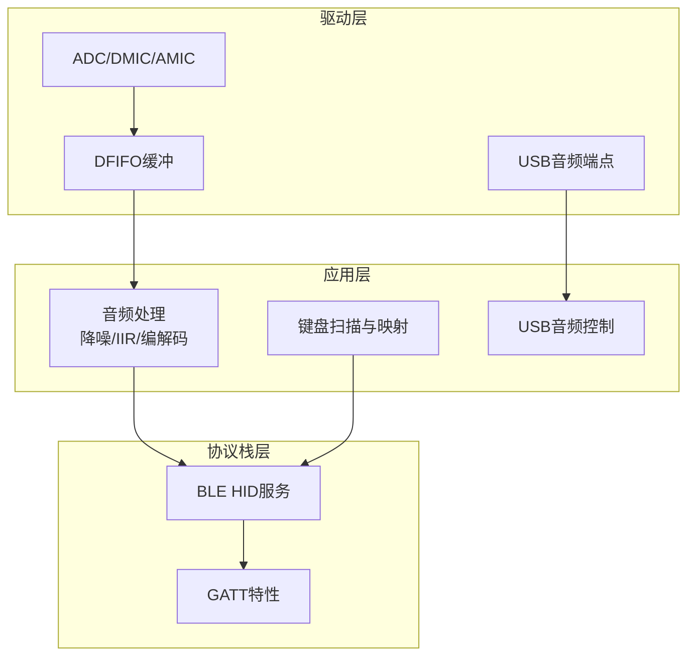
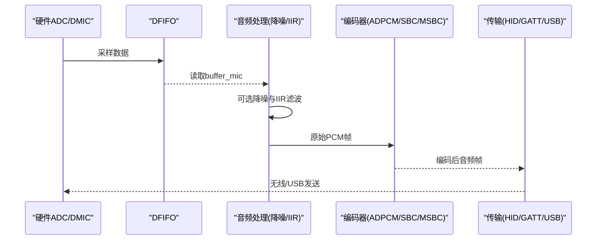
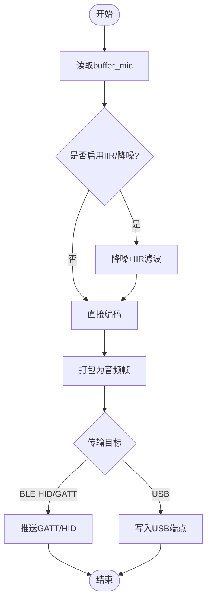
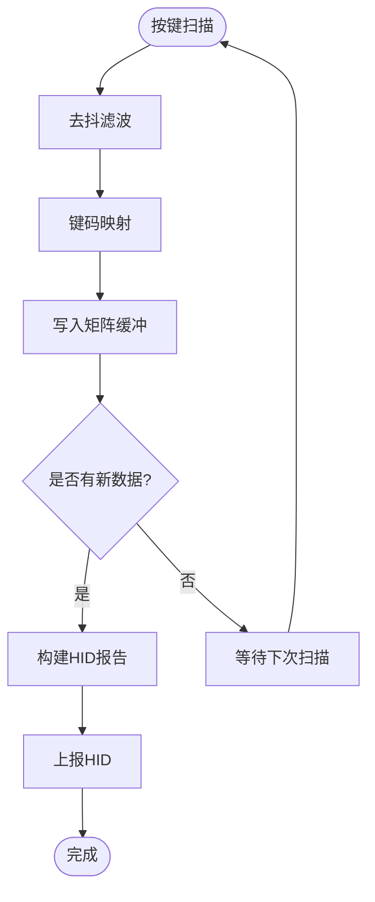
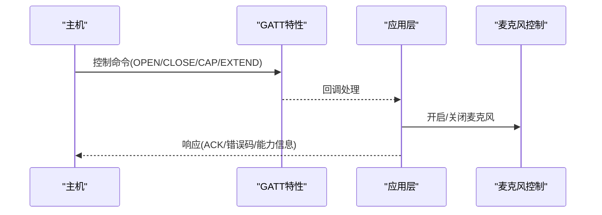
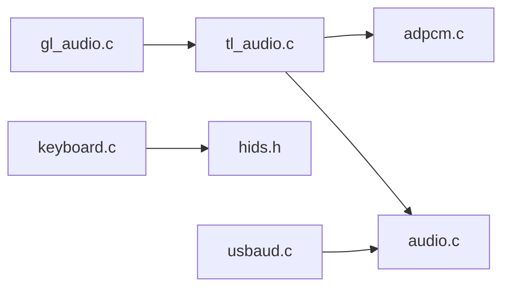

# 数据流设计

<cite>
**本文引用的文件**
- [tl_audio.c](file://tc_ble_single_sdk/application/audio/tl_audio.c)
- [gl_audio.c](file://tc_ble_single_sdk/application/audio/gl_audio.c)
- [adpcm.c](file://tc_ble_single_sdk/application/audio/adpcm.c)
- [audio.c](file://tc_ble_single_sdk/drivers/B85/audio.c)
- [adc.c](file://tc_ble_single_sdk/drivers/B85/adc.c)
- [usbaud.c](file://tc_ble_single_sdk/application/app/usbaud.c)
- [keyboard.c](file://tc_ble_single_sdk/application/keyboard/keyboard.c)
- [hids.h](file://tc_ble_single_sdk/stack/ble/service/hids.h)
</cite>

## 目录
1. [简介](#简介)
2. [项目结构](#项目结构)
3. [核心组件](#核心组件)
4. [架构总览](#架构总览)
5. [详细组件分析](#详细组件分析)
6. [依赖关系分析](#依赖关系分析)
7. [性能与延迟优化](#性能与延迟优化)
8. [故障排查指南](#故障排查指南)
9. [结论](#结论)
10. [附录](#附录)

## 简介
本文件面向音频鼠标系统中的“数据流设计”，聚焦以下三条关键路径：
- 音频数据流：从ADC采集到编码（ADPCM/SBC/MSBC）再到传输（BLE HID/GATT或USB）的完整链路，重点说明缓冲区管理、格式转换与延迟控制。
- 输入设备数据流：传感器（按键矩阵）数据采集、去抖滤波、报告生成与上报。
- 控制命令流：主机指令解析、执行与响应机制（如Google语音模型控制、音量/静音等）。

文档提供数据流图与时间序列图，并给出内存管理策略、缓存机制、性能监控点以及拥塞与丢包处理建议。

## 项目结构
系统按功能分层组织：
- 驱动层：音频采集（ADC/DMIC/AMIC/I2S）、DFIFO、DMA/中断、USB接口等。
- 应用层：音频处理（降噪、IIR滤波、编解码）、键盘扫描与映射、USB音频类控制。
- 协议栈层：BLE HID服务、GATT特性、HID Report定义。

图表来源
- [audio.c:92-237](file://tc_ble_single_sdk/drivers/B85/audio.c#L92-L237)
- [tl_audio.c:338-418](file://tc_ble_single_sdk/application/audio/tl_audio.c#L338-L418)
- [keyboard.c:396-486](file://tc_ble_single_sdk/application/keyboard/keyboard.c#L396-L486)
- [usbaud.c:311-399](file://tc_ble_single_sdk/application/app/usbaud.c#L311-L399)
- [hids.h:30-49](file://tc_ble_single_sdk/stack/ble/service/hids.h#L30-L49)

章节来源
- [audio.c:92-237](file://tc_ble_single_sdk/drivers/B85/audio.c#L92-L237)
- [tl_audio.c:338-418](file://tc_ble_single_sdk/application/audio/tl_audio.c#L338-L418)
- [keyboard.c:396-486](file://tc_ble_single_sdk/application/keyboard/keyboard.c#L396-L486)
- [usbaud.c:311-399](file://tc_ble_single_sdk/application/app/usbaud.c#L311-L399)
- [hids.h:30-49](file://tc_ble_single_sdk/stack/ble/service/hids.h#L30-L49)

## 核心组件
- 音频采集与缓冲：ADC/DMIC/AMIC通过DFIFO将采样数据送入应用层缓冲；支持不同采样率与通道配置。
- 音频处理：可选降噪、IIR滤波、下采样（32k→16k），然后进行ADPCM/SBC/MSBC编码。
- 传输封装：根据模式选择HID服务或GATT特性发送音频帧；支持Google语音模型控制。
- 输入设备：按键矩阵扫描、去抖、映射为HID报告。
- USB音频：支持USB MIC/扬声器控制与数据通路。

章节来源
- [tl_audio.c:338-418](file://tc_ble_single_sdk/application/audio/tl_audio.c#L338-L418)
- [adpcm.c:53-126](file://tc_ble_single_sdk/application/audio/adpcm.c#L53-L126)
- [keyboard.c:396-486](file://tc_ble_single_sdk/application/keyboard/keyboard.c#L396-L486)
- [usbaud.c:311-399](file://tc_ble_single_sdk/application/app/usbaud.c#L311-L399)

## 架构总览
下图展示音频数据从采集到传输的关键路径，包括缓冲、滤波、编码与发送。

图表来源
- [audio.c:92-237](file://tc_ble_single_sdk/drivers/B85/audio.c#L92-L237)
- [tl_audio.c:338-418](file://tc_ble_single_sdk/application/audio/tl_audio.c#L338-L418)
- [adpcm.c:53-126](file://tc_ble_single_sdk/application/audio/adpcm.c#L53-L126)
- [usbaud.c:311-399](file://tc_ble_single_sdk/application/app/usbaud.c#L311-L399)

## 详细组件分析

### 音频数据流：ADC采集→滤波→编码→传输
- 采集与缓冲
  - ADC/DMIC/AMIC初始化设置采样时钟、分辨率、输入模式、ALC/HF/LP等参数，数据经DFIFO进入应用层缓冲buffer_mic。
  - 支持多速率（8k/16k/32k）与单/立体声配置。
- 滤波与降采样
  - 可选IIR滤波（内带/外带EQ）与32k→16k半采样，提升音质并降低后续编码负载。
- 编码
  - ADPCM：按固定单位长度分块编码，维护预测器状态与步长索引。
  - SBC/MSBC：按短帧编码，输出固定长度数据包。
- 传输
  - BLE HID/GATT：根据模式选择HID服务或GATT特性推送音频帧。
  - USB：通过USB音频类端点发送MIC数据。

图表来源
- [tl_audio.c:338-418](file://tc_ble_single_sdk/application/audio/tl_audio.c#L338-L418)
- [adpcm.c:53-126](file://tc_ble_single_sdk/application/audio/adpcm.c#L53-L126)
- [usbaud.c:311-399](file://tc_ble_single_sdk/application/app/usbaud.c#L311-L399)

章节来源
- [audio.c:92-237](file://tc_ble_single_sdk/drivers/B85/audio.c#L92-L237)
- [tl_audio.c:338-418](file://tc_ble_single_sdk/application/audio/tl_audio.c#L338-L418)
- [adpcm.c:53-126](file://tc_ble_single_sdk/application/audio/adpcm.c#L53-L126)
- [usbaud.c:311-399](file://tc_ble_single_sdk/application/app/usbaud.c#L311-L399)

### 输入设备数据流：传感器采集→滤波→报告生成
- 扫描与去抖
  - 行扫描获取矩阵按键状态，使用去抖滤波避免误触发。
  - 支持防鬼键逻辑与长按重复键。
- 映射与缓冲
  - 将物理按键映射为虚拟键码，写入环形缓冲matrix_buff，供上层消费。
- 报告生成
  - 读取matrix_buff，组装HID报告并通过BLE HID上报。

图表来源
- [keyboard.c:396-486](file://tc_ble_single_sdk/application/keyboard/keyboard.c#L396-L486)
- [hids.h:30-49](file://tc_ble_single_sdk/stack/ble/service/hids.h#L30-L49)

章节来源
- [keyboard.c:396-486](file://tc_ble_single_sdk/application/keyboard/keyboard.c#L396-L486)
- [hids.h:30-49](file://tc_ble_single_sdk/stack/ble/service/hids.h#L30-L49)

### 控制命令流：主机指令解析→执行→响应
- Google语音模型控制
  - 接收GATT控制命令（打开/关闭/能力协商/扩展），更新内部状态机，控制麦克风开关与超时。
  - 支持HTT/PTT/On-Request三种模型，分别对应不同的交互行为。
- USB音频控制
  - 处理音量、静音等控制请求，更新扬声器/麦克风设置，并通过HID报告反馈。

图表来源
- [gl_audio.c:60-181](file://tc_ble_single_sdk/application/audio/gl_audio.c#L60-L181)
- [gl_audio.c:213-355](file://tc_ble_single_sdk/application/audio/gl_audio.c#L213-L355)
- [usbaud.c:162-293](file://tc_ble_single_sdk/application/app/usbaud.c#L162-L293)

章节来源
- [gl_audio.c:60-181](file://tc_ble_single_sdk/application/audio/gl_audio.c#L60-L181)
- [gl_audio.c:213-355](file://tc_ble_single_sdk/application/audio/gl_audio.c#L213-L355)
- [usbaud.c:162-293](file://tc_ble_single_sdk/application/app/usbaud.c#L162-L293)

## 依赖关系分析
- 音频模块依赖驱动层的ADC/DFIFO与USB接口，应用层负责处理与编码，协议栈层负责传输。
- 键盘模块独立于音频，但共享BLE HID服务用于上报。
- 控制命令通过GATT特性与应用层交互，影响音频通路与设备状态。

图表来源
- [tl_audio.c:338-418](file://tc_ble_single_sdk/application/audio/tl_audio.c#L338-L418)
- [adpcm.c:53-126](file://tc_ble_single_sdk/application/audio/adpcm.c#L53-L126)
- [audio.c:92-237](file://tc_ble_single_sdk/drivers/B85/audio.c#L92-L237)
- [gl_audio.c:60-181](file://tc_ble_single_sdk/application/audio/gl_audio.c#L60-L181)
- [keyboard.c:396-486](file://tc_ble_single_sdk/application/keyboard/keyboard.c#L396-L486)
- [usbaud.c:311-399](file://tc_ble_single_sdk/application/app/usbaud.c#L311-L399)
- [hids.h:30-49](file://tc_ble_single_sdk/stack/ble/service/hids.h#L30-L49)

章节来源
- [tl_audio.c:338-418](file://tc_ble_single_sdk/application/audio/tl_audio.c#L338-L418)
- [adpcm.c:53-126](file://tc_ble_single_sdk/application/audio/adpcm.c#L53-L126)
- [audio.c:92-237](file://tc_ble_single_sdk/drivers/B85/audio.c#L92-L237)
- [gl_audio.c:60-181](file://tc_ble_single_sdk/application/audio/gl_audio.c#L60-L181)
- [keyboard.c:396-486](file://tc_ble_single_sdk/application/keyboard/keyboard.c#L396-L486)
- [usbaud.c:311-399](file://tc_ble_single_sdk/application/app/usbaud.c#L311-L399)
- [hids.h:30-49](file://tc_ble_single_sdk/stack/ble/service/hids.h#L30-L49)

## 性能与延迟优化
- 缓冲区管理
  - 音频编码采用双缓冲/环形缓冲（写指针/读指针），防止溢出与阻塞；当编码队列满时丢弃最旧帧以保实时性。
  - 键盘矩阵缓冲限制深度，避免历史数据堆积。
- 格式转换与计算
  - IIR滤波在RAM中执行，减少外部访问；必要时跳过滤波以降低CPU占用。
  - 32k→16k下采样减少编码负载，平衡音质与延迟。
- 传输优化
  - BLE HID/GATT推送前检查忙状态，避免重复发送导致拥塞。
  - USB音频端点在IRQ中批量写入，减少上下文切换。
- 监控点
  - 编码队列长度、传输失败计数、超时事件（Google语音模型）。
  - USB端点忙标志与中断计数。

[本节为通用指导，不直接分析具体文件]

## 故障排查指南
- 音频卡顿/爆音
  - 检查编码队列是否溢出（读指针落后写指针过多），适当增大缓冲或降低采样率。
  - 确认IIR滤波参数是否合理，避免过度处理导致CPU过载。
- 连接断开/丢包
  - 检查BLE推送返回值，若失败则重试或降级帧大小。
  - 对Google语音模型，关注超时处理，及时关闭麦克风释放资源。
- 按键误触/漏报
  - 调整去抖阈值与扫描周期，确保稳定识别。
  - 检查矩阵缓冲是否被覆盖，必要时增加深度。

章节来源
- [tl_audio.c:520-544](file://tc_ble_single_sdk/application/audio/tl_audio.c#L520-L544)
- [gl_audio.c:185-211](file://tc_ble_single_sdk/application/audio/gl_audio.c#L185-L211)
- [keyboard.c:224-262](file://tc_ble_single_sdk/application/keyboard/keyboard.c#L224-L262)

## 结论
本系统通过分层设计与合理的缓冲策略，实现了低延迟、高可靠的音频与输入数据处理。音频链路支持多种编码与传输方式，输入设备具备稳定的去抖与映射机制，控制命令流清晰且具备超时保护。在实际部署中，可根据场景调整滤波参数、缓冲大小与传输策略，以平衡音质、功耗与延迟。

[本节为总结，不直接分析具体文件]

## 附录
- 关键函数路径参考
  - 音频采集与处理：[tl_audio.c:338-418](file://tc_ble_single_sdk/application/audio/tl_audio.c#L338-L418)
  - ADPCM编码：[adpcm.c:53-126](file://tc_ble_single_sdk/application/audio/adpcm.c#L53-L126)
  - 键盘扫描与映射：[keyboard.c:396-486](file://tc_ble_single_sdk/application/keyboard/keyboard.c#L396-L486)
  - USB音频控制：[usbaud.c:311-399](file://tc_ble_single_sdk/application/app/usbaud.c#L311-L399)
  - BLE HID服务定义：[hids.h:30-49](file://tc_ble_single_sdk/stack/ble/service/hids.h#L30-L49)

[本节为参考列表，不直接分析具体文件]