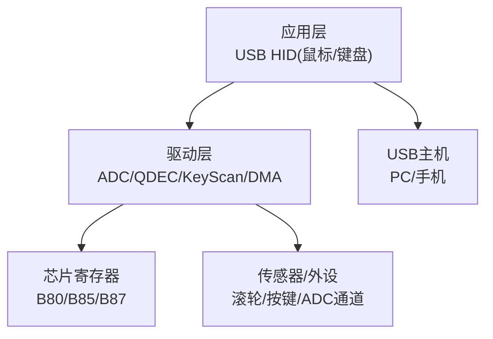
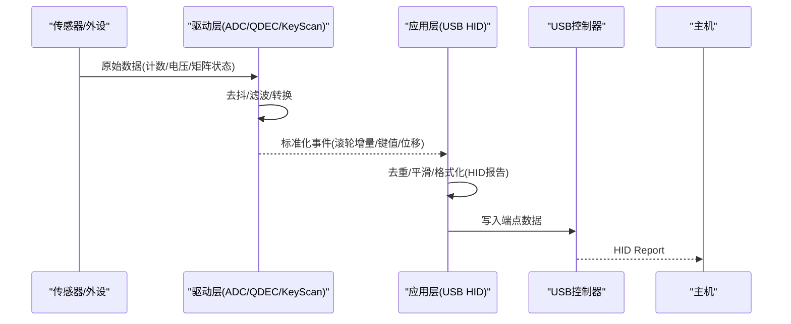
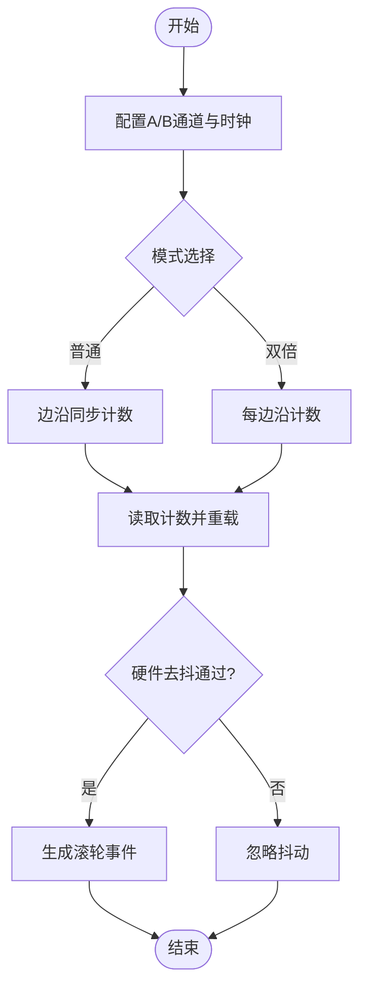
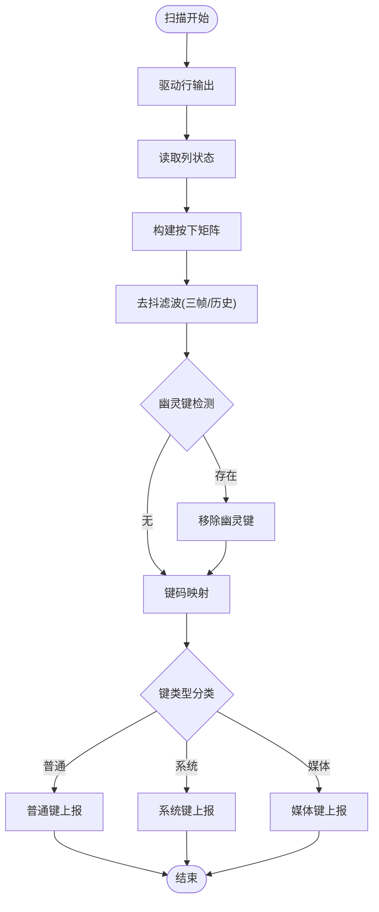
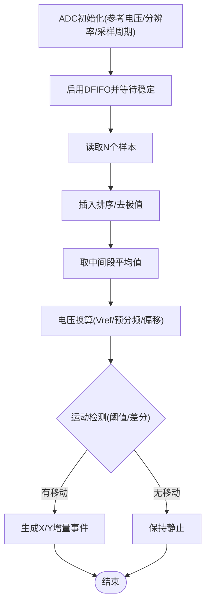
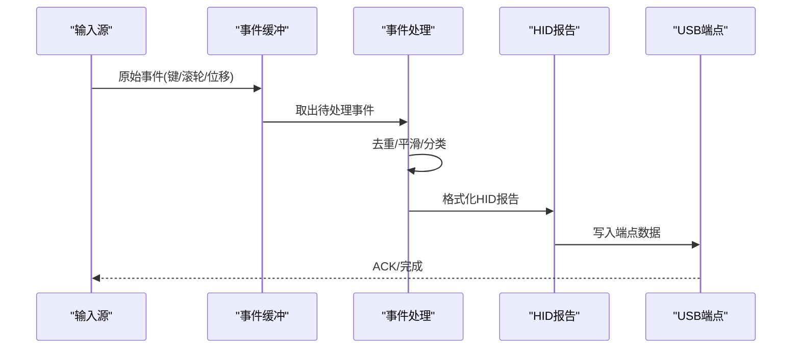
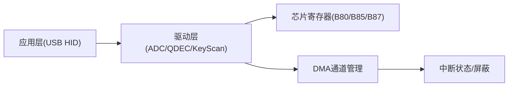

# 输入设备数据流

<cite>
**本文引用的文件**
- [usbmouse.c](file://tc_ble_single_sdk/application/app/usbmouse.c)
- [usbkb.c](file://tc_ble_single_sdk/application/app/usbkb.c)
- [keyboard.c](file://tc_ble_single_sdk/application/keyboard/keyboard.c)
- [qdec.c (B80)](file://8373_dongle_for_km/chip/B80/drivers/qdec.c)
- [qdec.c (B85)](file://tc_ble_single_sdk/drivers/B85/qdec.c)
- [keyscan.c](file://8373_dongle_for_km/chip/B80/drivers/keyscan.c)
- [adc.c (B80)](file://8373_dongle_for_km/chip/B80/drivers/adc.c)
- [adc.c (B85)](file://tc_ble_single_sdk/drivers/B85/adc.c)
- [dma.h (B85)](file://tc_ble_single_sdk/drivers/B85/dma.h)
- [dma.h (B80)](file://8373_dongle_for_km/chip/B80/drivers/dma.h)
- [register.h (B80)](file://8373_dongle_for_km/chip/B80/drivers/register.h)
- [usbmouse_i.h](file://tc_ble_single_sdk/application/app/usbmouse_i.h)
- [usbkb_i.h](file://tc_ble_single_sdk/application/app/usbkb_i.h)
</cite>

## 目录
1. [简介](#简介)
2. [项目结构](#项目结构)
3. [核心组件](#核心组件)
4. [架构总览](#架构总览)
5. [详细组件分析](#详细组件分析)
6. [依赖关系分析](#依赖关系分析)
7. [性能考虑](#性能考虑)
8. [故障排查指南](#故障排查指南)
9. [结论](#结论)
10. [附录](#附录)

## 简介
本文件面向Telink音频鼠标SDK中的输入设备数据流，系统性阐述鼠标移动检测、按键事件处理与滚轮操作的数据路径；解释传感器数据采集（ADC采样、滤波算法、运动检测逻辑）；说明输入事件的生成与处理机制（去抖、坐标变换、报告格式化）；对比不同输入设备（鼠标、键盘、滚轮）的数据流差异与统一处理框架；并提供输入延迟优化策略（中断优先级、DMA传输、实时响应）、校准方法与精度调优技术。

## 项目结构
该SDK按“应用层-驱动层-芯片寄存器”分层组织：
- 应用层：USB HID类实现（鼠标、键盘），负责事件缓冲、去重、上报调度与HID报告封装。
- 驱动层：外设驱动（ADC、QDEC正交编码器、KeyScan矩阵扫描、DMA等），提供底层采集与硬件抽象。
- 芯片寄存器：各芯片平台（B80/B85/B87）的寄存器定义与通道映射。

**章节来源**
- [usbmouse.c:44-151](file://tc_ble_single_sdk/application/app/usbmouse.c#L44-L151)
- [usbkb.c:82-388](file://tc_ble_single_sdk/application/app/usbkb.c#L82-L388)
- [keyboard.c:224-486](file://tc_ble_single_sdk/application/keyboard/keyboard.c#L224-L486)
- [qdec.c (B80):32-98](file://8373_dongle_for_km/chip/B80/drivers/qdec.c#L32-L98)
- [qdec.c (B85):32-98](file://tc_ble_single_sdk/drivers/B85/qdec.c#L32-L98)
- [keyscan.c:42-223](file://8373_dongle_for_km/chip/B80/drivers/keyscan.c#L42-L223)
- [adc.c (B80):129-312](file://8373_dongle_for_km/chip/B80/drivers/adc.c#L129-L312)
- [adc.c (B85):293-516](file://tc_ble_single_sdk/drivers/B85/adc.c#L293-L516)
- [dma.h (B85):66-157](file://tc_ble_single_sdk/drivers/B85/dma.h#L66-L157)
- [dma.h (B80):66-220](file://8373_dongle_for_km/chip/B80/drivers/dma.h#L66-L220)
- [register.h (B80):1812-1852](file://8373_dongle_for_km/chip/B80/drivers/register.h#L1812-L1852)

## 核心组件
- USB鼠标模块：维护环形缓冲区、平滑上报策略、释放超时检查、HID报告发送。
- USB键盘模块：键值分离（普通键/系统键/媒体键）、重复键抑制、释放超时检查、HID报告发送。
- 键盘扫描：矩阵扫描、去抖滤波、幽灵键消除、键码映射、重复键支持。
- 滚轮（QDEC）：正交编码器计数、模式选择（单/双分辨率）、硬件去抖、时钟使能。
- ADC采样：多通道配置、差分/单端模式、采样率设置、中值滤波与历史平均、电压换算与校准。
- DMA：通道管理、中断屏蔽/状态读取、缓冲区大小设置，用于降低CPU负载。

**章节来源**
- [usbmouse.c:35-151](file://tc_ble_single_sdk/application/app/usbmouse.c#L35-L151)
- [usbkb.c:72-388](file://tc_ble_single_sdk/application/app/usbkb.c#L72-L388)
- [keyboard.c:224-486](file://tc_ble_single_sdk/application/keyboard/keyboard.c#L224-L486)
- [qdec.c (B80):32-98](file://8373_dongle_for_km/chip/B80/drivers/qdec.c#L32-L98)
- [qdec.c (B85):32-98](file://tc_ble_single_sdk/drivers/B85/qdec.c#L32-L98)
- [adc.c (B80):129-312](file://8373_dongle_for_km/chip/B80/drivers/adc.c#L129-L312)
- [adc.c (B85):293-516](file://tc_ble_single_sdk/drivers/B85/adc.c#L293-L516)
- [dma.h (B85):66-157](file://tc_ble_single_sdk/drivers/B85/dma.h#L66-L157)
- [dma.h (B80):66-220](file://8373_dongle_for_km/chip/B80/drivers/dma.h#L66-L220)

## 架构总览
输入设备数据流从传感器到主机HID报告的完整路径如下：
- 滚轮：QDEC硬件计数器 -> 软件读取计数 -> 转换为滚轮增量 -> 打包为鼠标报告 -> USB端点发送。
- 按键：矩阵扫描/KeyScan -> 去抖与键码映射 -> 分类为普通/系统/媒体键 -> 键盘报告 -> USB端点发送。
- 鼠标移动：可由外部传感器经ADC或专用接口获取位移/加速度，经滤波与阈值判断后生成X/Y增量，再打包为鼠标报告。

**图表来源**
- [usbmouse.c:70-151](file://tc_ble_single_sdk/application/app/usbmouse.c#L70-L151)
- [usbkb.c:82-388](file://tc_ble_single_sdk/application/app/usbkb.c#L82-L388)
- [keyboard.c:224-486](file://tc_ble_single_sdk/application/keyboard/keyboard.c#L224-L486)
- [qdec.c (B80):69-98](file://8373_dongle_for_km/chip/B80/drivers/qdec.c#L69-L98)
- [adc.c (B80):244-312](file://8373_dongle_for_km/chip/B80/drivers/adc.c#L244-L312)

## 详细组件分析

### 滚轮数据流（QDEC）
- 引脚与时钟：配置A/B通道输入，开启QDEC时钟。
- 模式：普通模式（边沿同步计数）与双倍精度模式（每边沿计数）。
- 计数读取：读前需重载计数寄存器，避免丢失脉冲。
- 硬件去抖：通过阈值过滤短脉冲抖动。

**图表来源**
- [qdec.c (B80):32-98](file://8373_dongle_for_km/chip/B80/drivers/qdec.c#L32-L98)
- [qdec.c (B85):32-98](file://tc_ble_single_sdk/drivers/B85/qdec.c#L32-L98)

**章节来源**
- [qdec.c (B80):32-98](file://8373_dongle_for_km/chip/B80/drivers/qdec.c#L32-L98)
- [qdec.c (B85):32-98](file://tc_ble_single_sdk/drivers/B85/qdec.c#L32-L98)

### 按键数据流（矩阵扫描/KeyScan）
- 矩阵扫描：逐行驱动，读取列状态，构建按下矩阵。
- 去抖滤波：三帧比较与历史状态更新，减少误触发。
- 幽灵键消除：多行交叉检测，剔除虚假组合。
- 键码映射：根据布局表将矩阵位置映射为标准键码，区分控制键与普通键。
- KeyScan硬件：支持行列配置、去抖周期、空闲进入低功耗、三击检测。

**图表来源**
- [keyboard.c:224-486](file://tc_ble_single_sdk/application/keyboard/keyboard.c#L224-L486)
- [keyscan.c:42-223](file://8373_dongle_for_km/chip/B80/drivers/keyscan.c#L42-L223)

**章节来源**
- [keyboard.c:224-486](file://tc_ble_single_sdk/application/keyboard/keyboard.c#L224-L486)
- [keyscan.c:42-223](file://8373_dongle_for_km/chip/B80/drivers/keyscan.c#L42-L223)

### 鼠标移动数据流（ADC与运动检测）
- ADC初始化：设置参考电压、分辨率、采样周期、预分频、通道模式（差分/单端）。
- 采样流程：启用DFIFO，等待稳定采样窗口，读取多组样本，排序取中值，计算平均值。
- 电压换算：结合Vref、预分频与校准偏移，得到实际电压(mV)。
- 运动检测：对连续采样做差分或阈值判断，生成X/Y增量事件。

**图表来源**
- [adc.c (B80):129-312](file://8373_dongle_for_km/chip/B80/drivers/adc.c#L129-L312)
- [adc.c (B85):293-516](file://tc_ble_single_sdk/drivers/B85/adc.c#L293-L516)

**章节来源**
- [adc.c (B80):129-312](file://8373_dongle_for_km/chip/B80/drivers/adc.c#L129-L312)
- [adc.c (B85):293-516](file://tc_ble_single_sdk/drivers/B85/adc.c#L293-L516)

### 输入事件生成与处理机制
- 事件缓冲：鼠标与键盘均使用环形缓冲区暂存事件，避免阻塞。
- 去重与平滑：键盘模块保存上次状态，相同状态不重复上报；鼠标支持平滑上报策略，降低高频抖动。
- 释放超时：若未收到释放事件，在超时后主动发送空报告以清理主机状态。
- 报告格式化：依据HID描述符（Report Descriptor）组装报告ID与字段，写入对应端点。

**图表来源**
- [usbmouse.c:44-151](file://tc_ble_single_sdk/application/app/usbmouse.c#L44-L151)
- [usbkb.c:82-388](file://tc_ble_single_sdk/application/app/usbkb.c#L82-L388)
- [usbmouse_i.h:407-431](file://tc_ble_single_sdk/application/app/usbmouse_i.h#L407-L431)
- [usbkb_i.h:62-91](file://tc_ble_single_sdk/application/app/usbkb_i.h#L62-L91)

**章节来源**
- [usbmouse.c:44-151](file://tc_ble_single_sdk/application/app/usbmouse.c#L44-L151)
- [usbkb.c:82-388](file://tc_ble_single_sdk/application/app/usbkb.c#L82-L388)
- [usbmouse_i.h:407-431](file://tc_ble_single_sdk/application/app/usbmouse_i.h#L407-L431)
- [usbkb_i.h:62-91](file://tc_ble_single_sdk/application/app/usbkb_i.h#L62-L91)

### 不同输入设备的数据流差异与统一框架
- 差异：
  - 滚轮：基于QDEC硬件计数，直接产生增量，低延迟。
  - 按键：矩阵扫描或KeyScan硬件，涉及去抖、映射与分类。
  - 鼠标移动：可能由ADC或其他传感器提供，需要滤波与阈值判断。
- 统一框架：
  - 所有事件最终汇聚至USB HID层，按设备类型封装为对应Report。
  - 共享缓冲与上报调度机制，保证实时性与一致性。

**章节来源**
- [usbmouse.c:44-151](file://tc_ble_single_sdk/application/app/usbmouse.c#L44-L151)
- [usbkb.c:82-388](file://tc_ble_single_sdk/application/app/usbkb.c#L82-L388)
- [qdec.c (B80):32-98](file://8373_dongle_for_km/chip/B80/drivers/qdec.c#L32-L98)
- [adc.c (B80):129-312](file://8373_dongle_for_km/chip/B80/drivers/adc.c#L129-L312)

## 依赖关系分析
- 应用层依赖驱动层提供的原始数据与事件。
- 驱动层依赖芯片寄存器进行外设配置与状态读取。
- DMA与中断用于卸载CPU，提升吞吐与实时性。

**图表来源**
- [dma.h (B85):66-157](file://tc_ble_single_sdk/drivers/B85/dma.h#L66-L157)
- [dma.h (B80):66-220](file://8373_dongle_for_km/chip/B80/drivers/dma.h#L66-L220)
- [register.h (B80):1812-1852](file://8373_dongle_for_km/chip/B80/drivers/register.h#L1812-L1852)

**章节来源**
- [dma.h (B85):66-157](file://tc_ble_single_sdk/drivers/B85/dma.h#L66-L157)
- [dma.h (B80):66-220](file://8373_dongle_for_km/chip/B80/drivers/dma.h#L66-L220)
- [register.h (B80):1812-1852](file://8373_dongle_for_km/chip/B80/drivers/register.h#L1812-L1852)

## 性能考虑
- 中断优先级：将关键输入（如滚轮、鼠标移动）的中断优先级提高，确保及时响应。
- DMA传输：利用DMA通道搬运大量数据（如ADC DFIFO、RF收发），减少CPU占用。
- 实时响应：采用环形缓冲与批量上报策略，避免频繁中断导致抖动。
- 功耗优化：KeyScan空闲时关闭扫描时钟，降低功耗。

**章节来源**
- [dma.h (B85):66-157](file://tc_ble_single_sdk/drivers/B85/dma.h#L66-L157)
- [dma.h (B80):66-220](file://8373_dongle_for_km/chip/B80/drivers/dma.h#L66-L220)
- [keyscan.c:208-223](file://8373_dongle_for_km/chip/B80/drivers/keyscan.c#L208-L223)

## 故障排查指南
- 滚轮计数异常：检查QDEC模式与去抖阈值，确认A/B通道配置正确。
- 按键误触发：调整去抖周期与扫描次数，验证矩阵行列配置。
- ADC读数漂移：校准Vref与偏移，检查采样周期与预分频设置。
- 上报卡顿：检查USB端点是否忙，确认环形缓冲区是否溢出。

**章节来源**
- [qdec.c (B80):89-98](file://8373_dongle_for_km/chip/B80/drivers/qdec.c#L89-L98)
- [keyscan.c:42-223](file://8373_dongle_for_km/chip/B80/drivers/keyscan.c#L42-L223)
- [adc.c (B80):156-312](file://8373_dongle_for_km/chip/B80/drivers/adc.c#L156-L312)
- [usbmouse.c:114-151](file://tc_ble_single_sdk/application/app/usbmouse.c#L114-L151)

## 结论
本SDK通过分层架构与硬件加速（QDEC、KeyScan、ADC、DMA）实现了高效稳定的输入设备数据流。鼠标、键盘与滚轮在驱动层采集后经统一的应用层处理，形成标准化的HID报告。通过合理的去抖、滤波、校准与DMA优化，系统在低延迟与低功耗之间取得平衡。

## 附录
- 校准方法：使用两点对比法校准ADC Vref与偏移，提升电压测量精度。
- 精度调优：调整采样周期、预分频与滤波器参数，平衡噪声与响应速度。
- 报告格式：依据HID描述符定义Report ID与字段长度，确保主机兼容。

**章节来源**
- [adc.c (B80):156-312](file://8373_dongle_for_km/chip/B80/drivers/adc.c#L156-L312)
- [adc.c (B85):326-516](file://tc_ble_single_sdk/drivers/B85/adc.c#L326-L516)
- [usbmouse_i.h:407-431](file://tc_ble_single_sdk/application/app/usbmouse_i.h#L407-L431)
- [usbkb_i.h:62-91](file://tc_ble_single_sdk/application/app/usbkb_i.h#L62-L91)