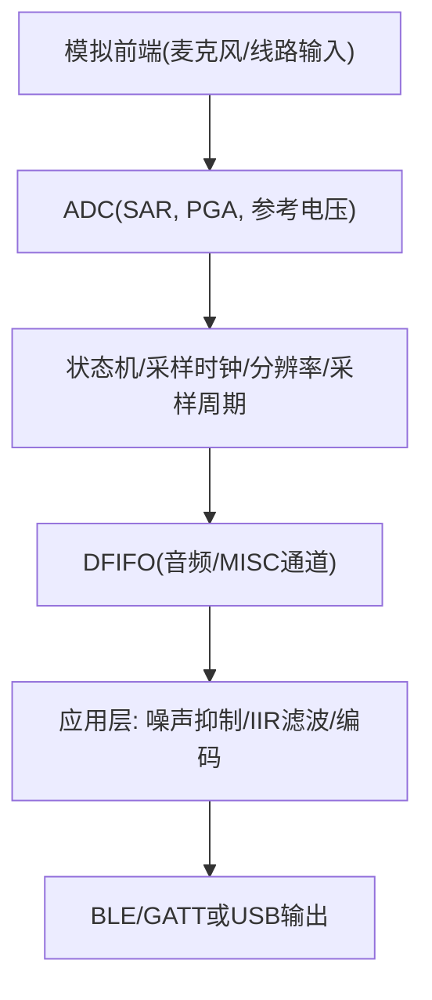
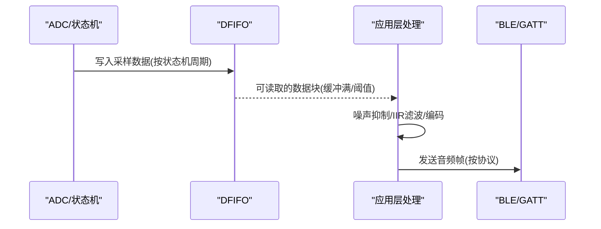
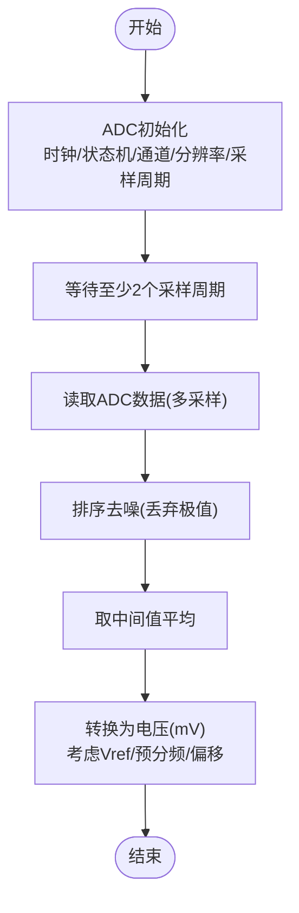
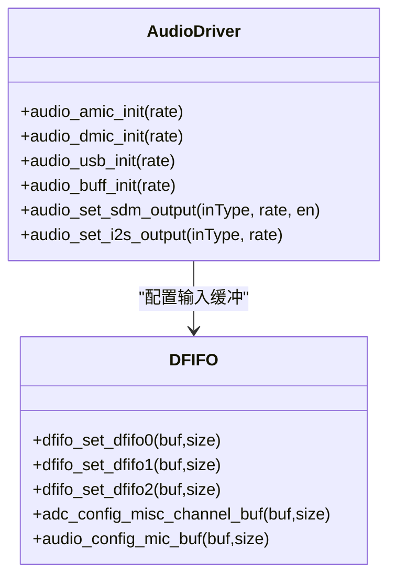
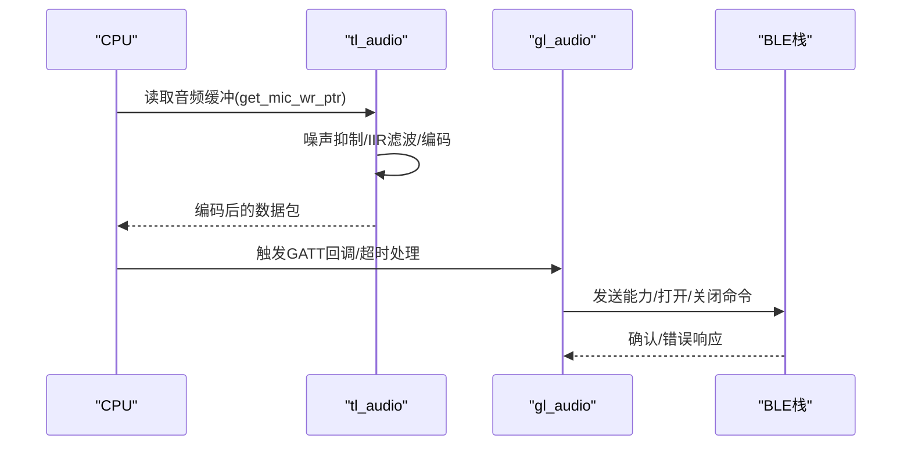
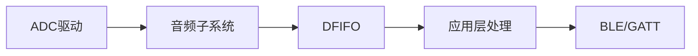

# ADC音频采集

<cite>
**本文引用的文件**
- [adc.h](file://tc_ble_single_sdk/drivers/B85/adc.h)
- [adc.c](file://tc_ble_single_sdk/drivers/B85/adc.c)
- [audio.h](file://tc_ble_single_sdk/drivers/B85/audio.h)
- [audio.c](file://tc_ble_single_sdk/drivers/B85/audio.c)
- [dfifo.h](file://tc_ble_single_sdk/drivers/B85/dfifo.h)
- [tl_audio.h](file://tc_ble_single_sdk/application/audio/tl_audio.h)
- [tl_audio.c](file://tc_ble_single_sdk/application/audio/tl_audio.c)
- [gl_audio.h](file://tc_ble_single_sdk/application/audio/gl_audio.h)
- [gl_audio.c](file://tc_ble_single_sdk/application/audio/gl_audio.c)
- [audio_config.h](file://tc_ble_single_sdk/application/audio/audio_config.h)
</cite>

## 目录
1. [简介](#简介)
2. [项目结构](#项目结构)
3. [核心组件](#核心组件)
4. [架构总览](#架构总览)
5. [详细组件分析](#详细组件分析)
6. [依赖关系分析](#依赖关系分析)
7. [性能与实时性](#性能与实时性)
8. [故障排查指南](#故障排查指南)
9. [结论](#结论)
10. [附录：不同音频模式的ADC配置参数](#附录不同音频模式的adc配置参数)

## 简介
本文件面向B85芯片的ADC音频采集，系统性阐述从模拟信号到数字音频数据的全链路：采样率设置、分辨率配置、通道选择、抗混叠滤波与量化、中断与DMA（DFIFO）传输机制、噪声抑制与校准方法，以及在不同音频模式下的配置要点与优化建议。文档基于SDK中B85驱动与应用层代码进行提炼，确保与实际实现一致。

## 项目结构
围绕ADC音频采集的关键模块分布如下：
- 底层ADC驱动：定义采样率、参考电压、分辨率、输入通道、采样周期、状态机长度等，并提供初始化、通道配置、预分频、偏置电流调节等接口。
- 音频子系统：封装AMIC/DMIC/I2S/USB等输入路径，配置CIC抽取滤波器、ALC/HF/LF、PGA增益、DFIFO输入模式等。
- DFIFO缓冲管理：提供MISC通道与音频通道的缓冲区地址/大小配置，用于ADC数据搬运。
- 应用层音频处理：包含噪声抑制、IIR滤波、编码（ADPCM/SBC/MSBC）、GATT/Google协议交互等。

**图示来源**
- [adc.h:31-198](file://tc_ble_single_sdk/drivers/B85/adc.h#L31-L198)
- [audio.c:92-237](file://tc_ble_single_sdk/drivers/B85/audio.c#L92-L237)
- [dfifo.h:50-112](file://tc_ble_single_sdk/drivers/B85/dfifo.h#L50-L112)
- [tl_audio.c:323-418](file://tc_ble_single_sdk/application/audio/tl_audio.c#L323-L418)

**章节来源**
- [adc.h:31-198](file://tc_ble_single_sdk/drivers/B85/adc.h#L31-L198)
- [audio.c:92-237](file://tc_ble_single_sdk/drivers/B85/audio.c#L92-L237)
- [dfifo.h:50-112](file://tc_ble_single_sdk/drivers/B85/dfifo.h#L50-L112)

## 核心组件
- ADC驱动（B85）
  - 采样率：支持23K/96K/192K（通过状态机长度与采样时钟配置）。
  - 参考电压：可选0.6V/0.9V/1.2V/VBAT分压，支持按通道独立设置。
  - 分辨率：8/10/12/14位，支持单端/差分输入模式。
  - 输入通道：左/右/MISC/RNS，支持PGA输出作为输入源。
  - 采样周期：3~48个ADC时钟周期可调。
  - 预分频与偏置：支持AIN预分频、比较器/参考缓冲偏置电流调节。
- 音频子系统
  - AMIC/DMIC/I2S/USB输入路径，CIC抽取、ALC/HF/LPF、PGA增益固定/自动调节。
  - DFIFO输入模式、双缓冲、中断阈值配置。
- DFIFO缓冲
  - MISC通道与音频通道缓冲地址/大小配置，写指针清零等。
- 应用层音频处理
  - 噪声抑制（可选）、IIR滤波（可选）、编码（ADPCM/SBC/MSBC），Google GATT协议交互。

**章节来源**
- [adc.h:31-198](file://tc_ble_single_sdk/drivers/B85/adc.h#L31-L198)
- [adc.c:293-324](file://tc_ble_single_sdk/drivers/B85/adc.c#L293-L324)
- [audio.c:92-237](file://tc_ble_single_sdk/drivers/B85/audio.c#L92-L237)
- [dfifo.h:50-112](file://tc_ble_single_sdk/drivers/B85/dfifo.h#L50-L112)
- [tl_audio.h:32-113](file://tc_ble_single_sdk/application/audio/tl_audio.h#L32-L113)
- [tl_audio.c:323-418](file://tc_ble_single_sdk/application/audio/tl_audio.c#L323-L418)

## 架构总览
B85的ADC音频采集采用“硬件ADC + 状态机 + DFIFO + 应用处理”的分层架构：
- 硬件层：SAR ADC、PGA、参考电压、采样时钟、分辨率、输入通道选择。
- 状态机层：控制set/capture状态长度，决定采样时序与吞吐。
- 数据通路：ADC结果经DFIFO写入内存，CPU或上层任务按需读取并处理。
- 应用层：噪声抑制、IIR滤波、编码、协议封装与发送。

**图示来源**
- [adc.c:293-324](file://tc_ble_single_sdk/drivers/B85/adc.c#L293-L324)
- [dfifo.h:50-112](file://tc_ble_single_sdk/drivers/B85/dfifo.h#L50-L112)
- [tl_audio.c:323-418](file://tc_ble_single_sdk/application/audio/tl_audio.c#L323-L418)
- [gl_audio.c:213-355](file://tc_ble_single_sdk/application/audio/gl_audio.c#L213-L355)

## 详细组件分析

### ADC驱动与采样流程
- 初始化流程
  - 关闭SAR ADC电源，复位ADC模块，开启24M至SAR时钟，设置采样时钟分频。
  - 配置左右通道使能与最大状态计数；根据采样率设置set/capture状态长度。
  - 设置输入模式（单端/差分）、正负输入通道、参考电压、分辨率、采样周期、预分频、偏置电流。
  - 启用DFIFO（或禁用MISC通道DFIFO），完成初始化。
- 采样与数据处理
  - 通过时间等待保证至少两个采样周期后读取数据。
  - 对原始数据进行排序去噪，取中间值平均，转换为mV（考虑参考电压、预分频、偏移）。
  - 支持手动模式直接读寄存器获取ADC码值。

**图示来源**
- [adc.c:293-324](file://tc_ble_single_sdk/drivers/B85/adc.c#L293-L324)
- [adc.c:417-516](file://tc_ble_single_sdk/drivers/B85/adc.c#L417-L516)

**章节来源**
- [adc.c:293-324](file://tc_ble_single_sdk/drivers/B85/adc.c#L293-L324)
- [adc.c:417-516](file://tc_ble_single_sdk/drivers/B85/adc.c#L417-L516)
- [adc.h:220-267](file://tc_ble_single_sdk/drivers/B85/adc.h#L220-L267)
- [adc.h:296-362](file://tc_ble_single_sdk/drivers/B85/adc.h#L296-L362)
- [adc.h:415-516](file://tc_ble_single_sdk/drivers/B85/adc.h#L415-L516)
- [adc.h:544-638](file://tc_ble_single_sdk/drivers/B85/adc.h#L544-L638)
- [adc.h:654-714](file://tc_ble_single_sdk/drivers/B85/adc.h#L654-L714)
- [adc.h:746-795](file://tc_ble_single_sdk/drivers/B85/adc.h#L746-L795)

### 音频子系统（AMIC/DMIC/I2S/USB）
- AMIC初始化
  - 配置ADC差分输入、参考电压、分辨率、采样周期、预分频、偏置电流。
  - 设置ALC/HF/LPF、CIC抽取比、PGA增益固定值。
  - 配置DFIFO输入为AMIC，启用解调滤波器。
- DMIC/USB/Buffer输入
  - 配置DFIFO输入选择、边缘触发、是否绕过解调滤波器。
  - 设置CIC抽取比与ALC/HF/LPF。
- SDM输出与I2S输出
  - 配置SDM输出引脚、I2S时钟、播放模式。

**图示来源**
- [audio.c:92-237](file://tc_ble_single_sdk/drivers/B85/audio.c#L92-L237)
- [audio.c:288-405](file://tc_ble_single_sdk/drivers/B85/audio.c#L288-L405)
- [audio.c:414-478](file://tc_ble_single_sdk/drivers/B85/audio.c#L414-L478)
- [audio.c:596-640](file://tc_ble_single_sdk/drivers/B85/audio.c#L596-L640)
- [dfifo.h:50-112](file://tc_ble_single_sdk/drivers/B85/dfifo.h#L50-L112)

**章节来源**
- [audio.c:92-237](file://tc_ble_single_sdk/drivers/B85/audio.c#L92-L237)
- [audio.c:288-405](file://tc_ble_single_sdk/drivers/B85/audio.c#L288-L405)
- [audio.c:414-478](file://tc_ble_single_sdk/drivers/B85/audio.c#L414-L478)
- [audio.c:596-640](file://tc_ble_single_sdk/drivers/B85/audio.c#L596-L640)
- [dfifo.h:50-112](file://tc_ble_single_sdk/drivers/B85/dfifo.h#L50-L112)

### 应用层音频处理与协议交互
- 噪声抑制与IIR滤波
  - 可选噪声抑制算法，动态增益调整。
  - 可选IIR滤波（带内/带外EQ、低通），支持系数加载与移位缩放。
- 编码与缓冲
  - ADPCM/SBC/MSBC编码，缓冲读写指针管理，溢出保护。
- Google GATT交互
  - 能力协商、打开/关闭音频流、超时处理、按键事件上报。

**图示来源**
- [tl_audio.c:323-418](file://tc_ble_single_sdk/application/audio/tl_audio.c#L323-L418)
- [tl_audio.c:439-525](file://tc_ble_single_sdk/application/audio/tl_audio.c#L439-L525)
- [tl_audio.c:546-649](file://tc_ble_single_sdk/application/audio/tl_audio.c#L546-L649)
- [gl_audio.c:213-355](file://tc_ble_single_sdk/application/audio/gl_audio.c#L213-L355)

**章节来源**
- [tl_audio.h:32-113](file://tc_ble_single_sdk/application/audio/tl_audio.h#L32-L113)
- [tl_audio.c:323-418](file://tc_ble_single_sdk/application/audio/tl_audio.c#L323-L418)
- [tl_audio.c:439-525](file://tc_ble_single_sdk/application/audio/tl_audio.c#L439-L525)
- [tl_audio.c:546-649](file://tc_ble_single_sdk/application/audio/tl_audio.c#L546-L649)
- [gl_audio.c:213-355](file://tc_ble_single_sdk/application/audio/gl_audio.c#L213-L355)

## 依赖关系分析
- ADC驱动依赖模拟寄存器操作（analog_write/read）、时钟与GPIO功能配置。
- 音频子系统依赖ADC驱动、DFIFO、ALC/HF/LPF、PGA增益配置。
- 应用层依赖音频子系统提供的缓冲与数据指针，以及BLE栈进行协议交互。
- DFIFO作为数据搬运枢纽，连接ADC与上层处理，避免CPU频繁中断。

**图示来源**
- [adc.c:293-324](file://tc_ble_single_sdk/drivers/B85/adc.c#L293-L324)
- [audio.c:92-237](file://tc_ble_single_sdk/drivers/B85/audio.c#L92-L237)
- [dfifo.h:50-112](file://tc_ble_single_sdk/drivers/B85/dfifo.h#L50-L112)
- [tl_audio.c:323-418](file://tc_ble_single_sdk/application/audio/tl_audio.c#L323-L418)
- [gl_audio.c:213-355](file://tc_ble_single_sdk/application/audio/gl_audio.c#L213-L355)

**章节来源**
- [adc.c:293-324](file://tc_ble_single_sdk/drivers/B85/adc.c#L293-L324)
- [audio.c:92-237](file://tc_ble_single_sdk/drivers/B85/audio.c#L92-L237)
- [dfifo.h:50-112](file://tc_ble_single_sdk/drivers/B85/dfifo.h#L50-L112)
- [tl_audio.c:323-418](file://tc_ble_single_sdk/application/audio/tl_audio.c#L323-L418)
- [gl_audio.c:213-355](file://tc_ble_single_sdk/application/audio/gl_audio.c#L213-L355)

## 性能与实时性
- 采样率与状态机
  - 通过设置set/capture状态长度与采样时钟分频，实现23K/96K/192K采样率。
  - 高采样率需缩短capture/set状态长度，确保时序稳定。
- 分辨率与精度
  - 14位分辨率提供更高动态范围，但增加数据量；可根据需求选择8/10/12/14位。
- 噪声抑制与滤波
  - 噪声抑制动态增益可降低底噪；IIR滤波提升语音清晰度。
- 缓冲与溢出
  - DFIFO缓冲大小与读取策略需匹配编码速率，避免溢出或欠载。
- 功耗与偏置
  - 合理设置偏置电流与PGA增益，平衡噪声与功耗。

[本节为通用指导，不直接分析具体文件]

## 故障排查指南
- 无数据或数据异常
  - 检查ADC初始化是否完成（时钟、状态机、通道、分辨率、采样周期）。
  - 确认DFIFO缓冲地址与大小已正确配置。
  - 验证输入通道与参考电压设置是否符合硬件设计。
- 数据失真或噪声大
  - 调整采样周期与预分频，优化输入阻抗匹配。
  - 启用噪声抑制与IIR滤波，调整系数与增益。
  - 检查PGA增益与ALC设置，避免饱和或过小信号。
- 协议交互失败
  - 检查Google GATT能力协商与超时处理逻辑。
  - 确认音频流打开/关闭命令发送成功，错误码处理正确。

**章节来源**
- [adc.c:293-324](file://tc_ble_single_sdk/drivers/B85/adc.c#L293-L324)
- [dfifo.h:50-112](file://tc_ble_single_sdk/drivers/B85/dfifo.h#L50-L112)
- [tl_audio.c:323-418](file://tc_ble_single_sdk/application/audio/tl_audio.c#L323-L418)
- [gl_audio.c:213-355](file://tc_ble_single_sdk/application/audio/gl_audio.c#L213-L355)

## 结论
B85的ADC音频采集通过灵活的ADC配置、状态机控制与DFIFO数据搬运，结合应用层的噪声抑制、滤波与编码，实现了稳定高效的实时音频采集与传输。合理设置采样率、分辨率、通道与参考电压，配合噪声抑制与校准，可获得高质量的音频数据。在高采样率与高分辨率场景下，需关注时序与缓冲管理，确保系统稳定性。

[本节为总结，不直接分析具体文件]

## 附录：不同音频模式的ADC配置参数
- 23K采样率
  - 状态机：R_max_mc=1023, R_max_s=15
  - 适用场景：低功耗语音采集
- 96K采样率
  - 状态机：R_max_mc=240, R_max_s=10
  - 适用场景：高质量语音采集
- 192K采样率
  - 状态机：R_max_mc=115, R_max_s=10
  - 适用场景：高保真音频采集

**章节来源**
- [adc.c:312-323](file://tc_ble_single_sdk/drivers/B85/adc.c#L312-L323)
- [adc.h:746-795](file://tc_ble_single_sdk/drivers/B85/adc.h#L746-L795)