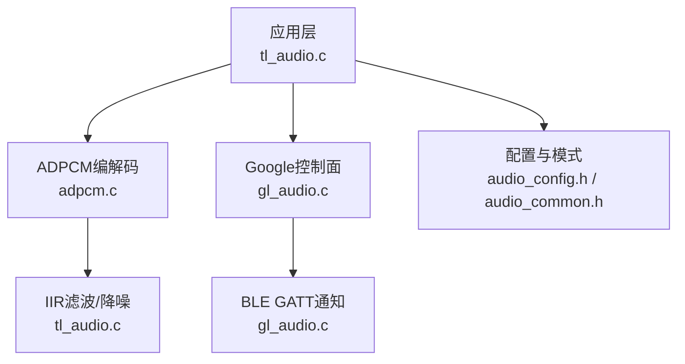
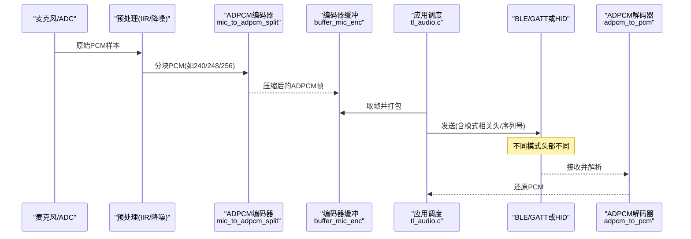
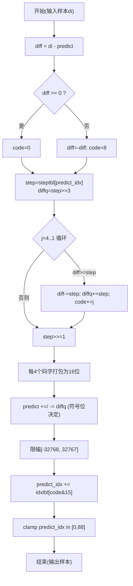
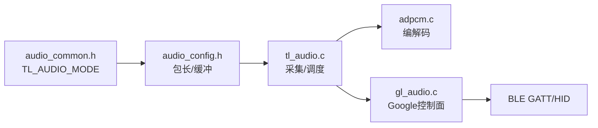

# ADPCM编解码

<cite>
**本文引用的文件**
- [adpcm.c](file://tc_ble_single_sdk/application/audio/adpcm.c)
- [adpcm.h](file://tc_ble_single_sdk/application/audio/adpcm.h)
- [tl_audio.c](file://tc_ble_single_sdk/application/audio/tl_audio.c)
- [tl_audio.h](file://tc_ble_single_sdk/application/audio/tl_audio.h)
- [audio_common.h](file://tc_ble_single_sdk/application/audio/audio_common.h)
- [audio_config.h](file://tc_ble_single_sdk/application/audio/audio_config.h)
- [gl_audio.c](file://tc_ble_single_sdk/application/audio/gl_audio.c)
- [gl_audio.h](file://tc_ble_single_sdk/application/audio/gl_audio.h)
</cite>

## 目录
1. [简介](#简介)
2. [项目结构](#项目结构)
3. [核心组件](#核心组件)
4. [架构总览](#架构总览)
5. [详细组件分析](#详细组件分析)
6. [依赖关系分析](#依赖关系分析)
7. [性能与内存优化](#性能与内存优化)
8. [故障排查指南](#故障排查指南)
9. [结论](#结论)
10. [附录](#附录)

## 简介
本文件面向在Telink B85/B87平台上实现语音采集与传输的工程师，系统性梳理ADPCM（自适应差分脉冲编码调制）在该SDK中的实现。内容覆盖：
- ADPCM算法原理在本工程中的体现：预测、量化、步长表与索引更新
- 不同音频模式（Telink GATT、Google GATT、HID服务）下的编解码差异与数据包格式
- 序列号/同步机制与错误恢复策略
- 性能优化与内存使用建议
- 多平台兼容性与配置要点

## 项目结构
该SDK将音频处理集中在 application/audio 目录下，按功能分层：
- adpcm.c/h：ADPCM编解码核心算法与接口
- tl_audio.c/h：音频采集、预处理、编码器调度与缓冲管理
- audio_common.h / audio_config.h：音频模式宏定义、包长与缓冲区大小等编译期配置
- gl_audio.c/h：Google语音协议控制面（能力协商、开启/关闭、超时与状态机）

图表来源
- [tl_audio.c:323-841](file://tc_ble_single_sdk/application/audio/tl_audio.c#L323-L841)
- [adpcm.c:32-283](file://tc_ble_single_sdk/application/audio/adpcm.c#L32-L283)
- [gl_audio.c:30-356](file://tc_ble_single_sdk/application/audio/gl_audio.c#L30-L356)
- [audio_config.h:32-122](file://tc_ble_single_sdk/application/audio/audio_config.h#L32-L122)
- [audio_common.h:27-73](file://tc_ble_single_sdk/application/audio/audio_common.h#L27-L73)

章节来源
- [tl_audio.c:323-841](file://tc_ble_single_sdk/application/audio/tl_audio.c#L323-L841)
- [adpcm.c:32-283](file://tc_ble_single_sdk/application/audio/adpcm.c#L32-L283)
- [gl_audio.c:30-356](file://tc_ble_single_sdk/application/audio/gl_audio.c#L30-L356)
- [audio_config.h:32-122](file://tc_ble_single_sdk/application/audio/audio_config.h#L32-L122)
- [audio_common.h:27-73](file://tc_ble_single_sdk/application/audio/audio_common.h#L27-L73)

## 核心组件
- ADPCM编解码器：提供 mic_to_adpcm_split 与 adpcm_to_pcm 两个API，分别用于压缩与解压
- 音频采集与预处理：从麦克风获取PCM，可选噪声抑制与IIR滤波，再送入ADPCM
- 模式与配置：通过 TL_AUDIO_MODE 选择具体模式（RCU/Dongle × Telink/Google/HID），并决定包长、采样块大小、缓冲大小
- Google控制面：处理能力协商、开启/关闭、超时、按键事件等

章节来源
- [adpcm.h:27-44](file://tc_ble_single_sdk/application/audio/adpcm.h#L27-L44)
- [tl_audio.h:32-128](file://tc_ble_single_sdk/application/audio/tl_audio.h#L32-L128)
- [audio_common.h:27-73](file://tc_ble_single_sdk/application/audio/audio_common.h#L27-L73)
- [audio_config.h:28-122](file://tc_ble_single_sdk/application/audio/audio_config.h#L28-L122)
- [gl_audio.h:31-150](file://tc_ble_single_sdk/application/audio/gl_audio.h#L31-L150)

## 架构总览
下图展示了从麦克风到GATT/HID上报的完整数据流，以及不同模式下ADPCM编解码的差异点。

图表来源
- [tl_audio.c:323-841](file://tc_ble_single_sdk/application/audio/tl_audio.c#L323-L841)
- [adpcm.c:53-283](file://tc_ble_single_sdk/application/audio/adpcm.c#L53-L283)
- [adpcm.c:289-513](file://tc_ble_single_sdk/application/audio/adpcm.c#L289-L513)
- [audio_config.h:32-122](file://tc_ble_single_sdk/application/audio/audio_config.h#L32-L122)

## 详细组件分析

### ADPCM算法实现与参数
- 预测与量化
  - 每个输入样本计算与上一预测值的差值，根据符号位确定正负码字高位
  - 使用步长表 steptbl[predict_idx] 进行迭代量化，生成4bit码字
  - 更新预测值 predict，并进行限幅保护
- 步长索引更新
  - 使用 idxtbl[code] 对 predict_idx 进行增量更新，并限制在[0, 88]范围
- 端序与打包
  - 每4个4bit码字打包为一个16位字；部分模式需进行字节/半字交换以适配Android/平台要求
- 关键常量
  - idxtbl[]：索引调整表
  - steptbl[]：步长表（约89项）

图表来源
- [adpcm.c:53-126](file://tc_ble_single_sdk/application/audio/adpcm.c#L53-L126)
- [adpcm.c:137-208](file://tc_ble_single_sdk/application/audio/adpcm.c#L137-L208)
- [adpcm.c:217-280](file://tc_ble_single_sdk/application/audio/adpcm.c#L217-L280)

章节来源
- [adpcm.c:32-283](file://tc_ble_single_sdk/application/audio/adpcm.c#L32-L283)

### 不同音频模式的编解码差异

#### Telink GATT模式（RCU/Dongle）
- 编码器
  - 首帧写入初始预测值与索引，随后仅写ADPCM数据长度字段
  - 无额外序列号头
- 解码器
  - 首两字为初始预测值与索引，后续逐字节解出4bit码字并重建PCM
- 典型包长
  - RCU: ADPCM_PACKET_LEN=128，单位块248样本
  - Dongle: 对应MIC_SHORT_DEC_SIZE=248

章节来源
- [adpcm.c:53-126](file://tc_ble_single_sdk/application/audio/adpcm.c#L53-L126)
- [adpcm.c:289-361](file://tc_ble_single_sdk/application/audio/adpcm.c#L289-L361)
- [audio_config.h:32-36](file://tc_ble_single_sdk/application/audio/audio_config.h#L32-L36)
- [audio_config.h:78-80](file://tc_ble_single_sdk/application/audio/audio_config.h#L78-L80)

#### Google GATT模式（RCU/Dongle）
- 版本差异
  - v0.4：每帧包含序列号(2B)、Android ID(1B)、前一个预测值(2B)、索引(1B)，然后才是ADPCM数据
  - v1.0：纯音频数据，无额外头；序列号由全局计数器维护
- 字节序
  - 某些平台需要半字交换以适配Android 8+
- 典型包长
  - RCU v1.0: ADPCM_PACKET_LEN=120，单位块240样本
  - RCU v0.4: ADPCM_PACKET_LEN=136，单位块256样本
  - Dongle: 依据 GOOGLE_VOICE_OVER_BLE_SPCE_VERSION 选择120或136

章节来源
- [adpcm.c:128-208](file://tc_ble_single_sdk/application/audio/adpcm.c#L128-L208)
- [adpcm.c:364-440](file://tc_ble_single_sdk/application/audio/adpcm.c#L364-L440)
- [audio_config.h:37-51](file://tc_ble_single_sdk/application/audio/audio_config.h#L37-L51)
- [audio_config.h:81-88](file://tc_ble_single_sdk/application/audio/audio_config.h#L81-L88)

#### HID服务通道（RCU/Dongle）
- 编码器
  - 直接输出ADPCM数据，无额外头；内部维护 predict/predict_idx
- 解码器
  - 与Google v1.0类似，但无需解析头部；注意半字交换
- 典型包长
  - RCU: ADPCM_PACKET_LEN=120，单位块240样本
  - Dongle: 同RCU

章节来源
- [adpcm.c:210-280](file://tc_ble_single_sdk/application/audio/adpcm.c#L210-L280)
- [adpcm.c:442-513](file://tc_ble_single_sdk/application/audio/adpcm.c#L442-L513)
- [audio_config.h:52-59](file://tc_ble_single_sdk/application/audio/audio_config.h#L52-L59)

### 预测器系数更新策略与量化表设计
- 预测器
  - 一阶预测：predict = predict ± diffq，符号由码字最高位决定
  - 限幅：防止溢出至[-32768, 32767]
- 量化步长
  - 基于静态表 steptbl[]，随 predict_idx 变化动态调整
- 索引更新
  - 使用 idxtbl[] 根据码字低4位调整 predict_idx，边界钳制在[0, 88]
- 复杂度
  - 每样本固定次数的移位与比较，适合MCU实时处理

章节来源
- [adpcm.c:32-42](file://tc_ble_single_sdk/application/audio/adpcm.c#L32-L42)
- [adpcm.c:74-125](file://tc_ble_single_sdk/application/audio/adpcm.c#L74-L125)
- [adpcm.c:159-207](file://tc_ble_single_sdk/application/audio/adpcm.c#L159-L207)
- [adpcm.c:227-279](file://tc_ble_single_sdk/application/audio/adpcm.c#L227-L279)

### 数据包格式与序列号管理
- Telink GATT
  - 首帧：预测值(2B)+索引(1B)+数据长度(1B)，之后为ADPCM数据
- Google GATT
  - v0.4：序列号(2B)+Android ID(1B)+前预测值(2B)+索引(1B)+ADPCM数据
  - v1.0：纯ADPCM数据；全局序列号自增
- HID
  - 纯ADPCM数据；内部维护状态
- 序列号
  - Google v0.4使用 adpcm_serial_num 自增；v1.0不携带序列号
- 字节序
  - Android平台可能需要半字交换（代码中多处显式交换）

章节来源
- [adpcm.c:53-71](file://tc_ble_single_sdk/application/audio/adpcm.c#L53-L71)
- [adpcm.c:145-157](file://tc_ble_single_sdk/application/audio/adpcm.c#L145-L157)
- [adpcm.c:183-187](file://tc_ble_single_sdk/application/audio/adpcm.c#L183-L187)
- [adpcm.c:372-439](file://tc_ble_single_sdk/application/audio/adpcm.c#L372-L439)
- [adpcm.c:447-513](file://tc_ble_single_sdk/application/audio/adpcm.c#L447-L513)

### 音频采集、预处理与缓冲管理
- 采集与预处理
  - 从麦克风读取PCM，可选噪声抑制与IIR滤波（内带EQ、带外LPF）
  - 支持32k→16k降采样（半采样函数）
- 编码器调度
  - 达到阈值后调用 mic_to_adpcm_split 完成压缩
  - 结果写入 buffer_mic_enc 环形缓冲，供上层取用
- 缓冲管理
  - 写指针/读指针管理，防溢出丢弃旧包
  - 不同模式下缓冲大小由 TL_MIC_BUFFER_SIZE、TL_MIC_PACKET_BUFFER_NUM 等配置

章节来源
- [tl_audio.c:62-178](file://tc_ble_single_sdk/application/audio/tl_audio.c#L62-L178)
- [tl_audio.c:323-418](file://tc_ble_single_sdk/application/audio/tl_audio.c#L323-L418)
- [tl_audio.c:651-751](file://tc_ble_single_sdk/application/audio/tl_audio.c#L651-L751)
- [tl_audio.c:753-841](file://tc_ble_single_sdk/application/audio/tl_audio.c#L753-L841)
- [tl_audio.h:41-63](file://tc_ble_single_sdk/application/audio/tl_audio.h#L41-L63)

### Google语音控制面（能力协商、开启/关闭、超时）
- 能力协商
  - 返回支持的编码格式（ADPCM 16kHz/16bit）、帧长、交互模型（ON_REQUEST/PTT/HTT）
- 开启/关闭
  - 收到OPEN则启动麦克风与编码流程；CLOSE则停止
- 超时处理
  - 传输超时与等待远端响应超时，均会关闭麦克风并上报原因
- 按键事件
  - PTT/HTT模式下通过按键触发开始/停止，并通过HID或GATT通知上报

章节来源
- [gl_audio.c:60-181](file://tc_ble_single_sdk/application/audio/gl_audio.c#L60-L181)
- [gl_audio.c:185-211](file://tc_ble_single_sdk/application/audio/gl_audio.c#L185-L211)
- [gl_audio.c:213-356](file://tc_ble_single_sdk/application/audio/gl_audio.c#L213-L356)
- [gl_audio.h:31-150](file://tc_ble_single_sdk/application/audio/gl_audio.h#L31-L150)

## 依赖关系分析
- 编译期模式选择
  - 通过 TL_AUDIO_MODE 组合 RCU_PROJECT/DONGLE_PROJECT 与编码/通道掩码，决定编译分支
- 运行时依赖
  - tl_audio.c 依赖 adpcm.c 的编解码API
  - gl_audio.c 依赖BLE栈进行GATT通知
  - audio_config.h 提供各模式下的包长与缓冲尺寸

图表来源
- [audio_common.h:27-73](file://tc_ble_single_sdk/application/audio/audio_common.h#L27-L73)
- [audio_config.h:28-122](file://tc_ble_single_sdk/application/audio/audio_config.h#L28-L122)
- [tl_audio.c:323-841](file://tc_ble_single_sdk/application/audio/tl_audio.c#L323-L841)
- [adpcm.c:32-283](file://tc_ble_single_sdk/application/audio/adpcm.c#L32-L283)
- [gl_audio.c:30-356](file://tc_ble_single_sdk/application/audio/gl_audio.c#L30-L356)

章节来源
- [audio_common.h:27-73](file://tc_ble_single_sdk/application/audio/audio_common.h#L27-L73)
- [audio_config.h:28-122](file://tc_ble_single_sdk/application/audio/audio_config.h#L28-L122)
- [tl_audio.c:323-841](file://tc_ble_single_sdk/application/audio/tl_audio.c#L323-L841)
- [adpcm.c:32-283](file://tc_ble_single_sdk/application/audio/adpcm.c#L32-L283)
- [gl_audio.c:30-356](file://tc_ble_single_sdk/application/audio/gl_audio.c#L30-L356)

## 性能与内存优化
- 实时性
  - ADPCM每样本固定运算量，适合MCU硬实时；建议在RAM区执行关键路径（已有 _attribute_ram_code_ 标记）
- 内存占用
  - 缓冲大小由 TL_MIC_BUFFER_SIZE、TL_MIC_PACKET_BUFFER_NUM、ADPCM_PACKET_LEN 决定；合理设置避免溢出与丢帧
  - IIR滤波与降噪可开关，按需启用以降低CPU与RAM开销
- 吞吐与延迟
  - 单位块大小（240/248/256）影响端到端延迟；Google v1.0更紧凑（120B/240样本）
  - 半字交换仅在必要时执行，减少不必要操作
- 功耗
  - 空闲时关闭麦克风；利用超时机制及时释放资源

章节来源
- [tl_audio.c:62-178](file://tc_ble_single_sdk/application/audio/tl_audio.c#L62-L178)
- [tl_audio.c:323-418](file://tc_ble_single_sdk/application/audio/tl_audio.c#L323-L418)
- [adpcm.c:372-439](file://tc_ble_single_sdk/application/audio/adpcm.c#L372-L439)
- [audio_config.h:32-122](file://tc_ble_single_sdk/application/audio/audio_config.h#L32-L122)

## 故障排查指南
- 声音断续/爆音
  - 检查缓冲是否溢出：确认 TL_MIC_PACKET_BUFFER_NUM 足够，避免读慢于写
  - 检查IIR/降噪参数是否过大导致削波
- 无法连接/无声音
  - Google模式：确认能力协商成功，OPEN/CLOSE流程正确，超时处理正常
  - 检查GOOGLE_AUDIO_VERSION 与设备端期望一致（v0.4/v1.0）
- 音质异常
  - 核对步长表与索引更新是否正确；检查半字交换是否误用
  - 验证不同模式下的包长与单位块大小匹配
- 平台兼容
  - Android 8+需半字交换；确保在Google v1.0路径中正确执行
  - HID通道与GATT通道头部不同，勿混用

章节来源
- [gl_audio.c:185-211](file://tc_ble_single_sdk/application/audio/gl_audio.c#L185-L211)
- [gl_audio.c:213-356](file://tc_ble_single_sdk/application/audio/gl_audio.c#L213-L356)
- [adpcm.c:183-187](file://tc_ble_single_sdk/application/audio/adpcm.c#L183-L187)
- [adpcm.c:372-439](file://tc_ble_single_sdk/application/audio/adpcm.c#L372-L439)
- [tl_audio.c:323-841](file://tc_ble_single_sdk/application/audio/tl_audio.c#L323-L841)

## 结论
该SDK在Telink平台上实现了高效、可配置的ADPCM编解码方案，覆盖Telink GATT、Google GATT与HID三种主流通道。其核心优势在于：
- 清晰的模式划分与编译期配置，便于移植与裁剪
- 稳定的预测-量化-步长更新机制，保证音质与实时性
- 完善的缓冲管理与错误恢复，提升鲁棒性
在实际工程中，建议根据目标平台与协议选择合适的模式与参数，并结合IIR/降噪开关平衡音质与功耗。

## 附录
- 关键宏与枚举
  - 模式掩码：TL_AUDIO_MASK_ADPCM_MODE、TL_AUDIO_MASK_HID_SERVICE_CHANNEL、TL_AUDIO_MASK_GATT_SERVICE_TELINK_CHANNEL、TL_AUDIO_MASK_GATT_SERVICE_GOOGLE_CHANNEL
  - 项目类型：RCU_PROJECT、DONGLE_PROJECT
  - 音频模式：TL_AUDIO_RCU_ADPCM_GATT_TLEINK、TL_AUDIO_RCU_ADPCM_GATT_GOOGLE、TL_AUDIO_RCU_ADPCM_HID 等
- 典型配置
  - RCU ADPCM Telink: ADPCM_PACKET_LEN=128, TL_MIC_ADPCM_UNIT_SIZE=248, TL_MIC_BUFFER_SIZE=992
  - RCU ADPCM Google v1.0: ADPCM_PACKET_LEN=120, TL_MIC_ADPCM_UNIT_SIZE=240, TL_MIC_BUFFER_SIZE=960
  - RCU ADPCM Google v0.4: ADPCM_PACKET_LEN=136, TL_MIC_ADPCM_UNIT_SIZE=256, TL_MIC_BUFFER_SIZE=1024
  - RCU ADPCM HID: ADPCM_PACKET_LEN=120, TL_MIC_ADPCM_UNIT_SIZE=240, TL_MIC_BUFFER_SIZE=960

章节来源
- [audio_common.h:27-73](file://tc_ble_single_sdk/application/audio/audio_common.h#L27-L73)
- [audio_config.h:32-122](file://tc_ble_single_sdk/application/audio/audio_config.h#L32-L122)