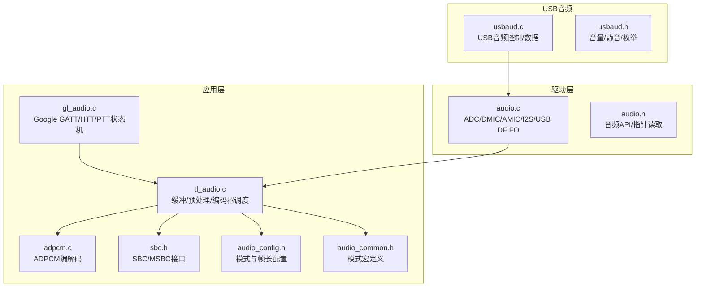
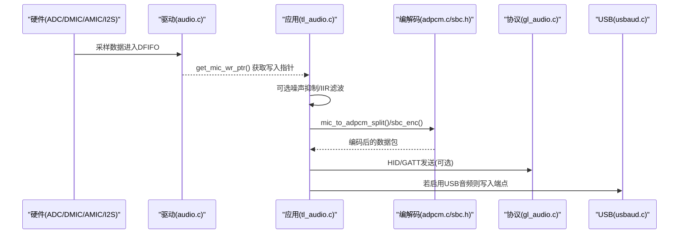
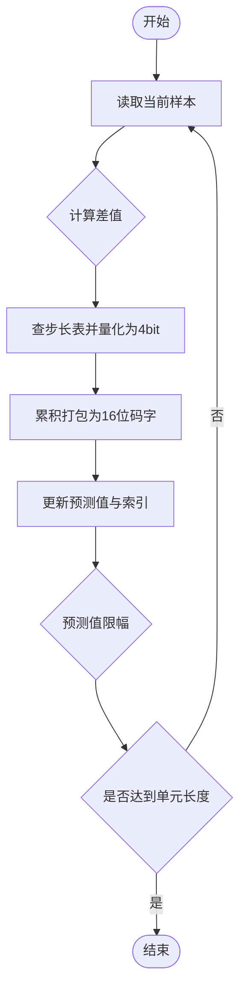
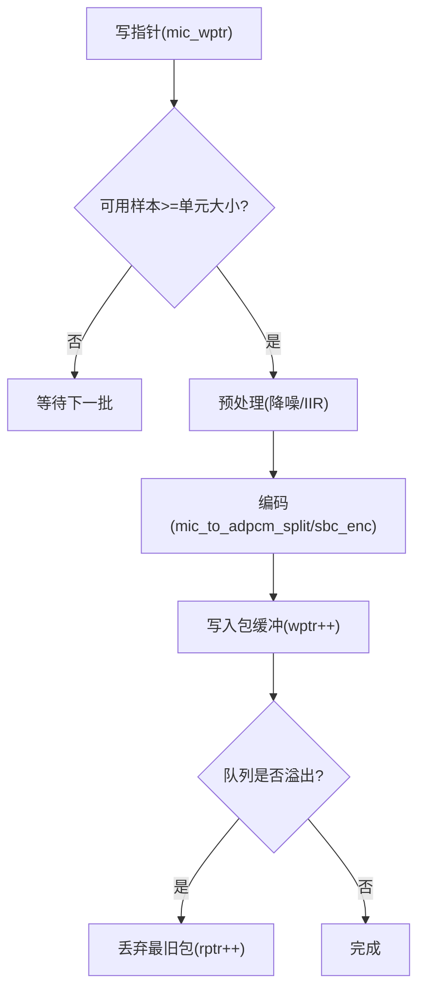
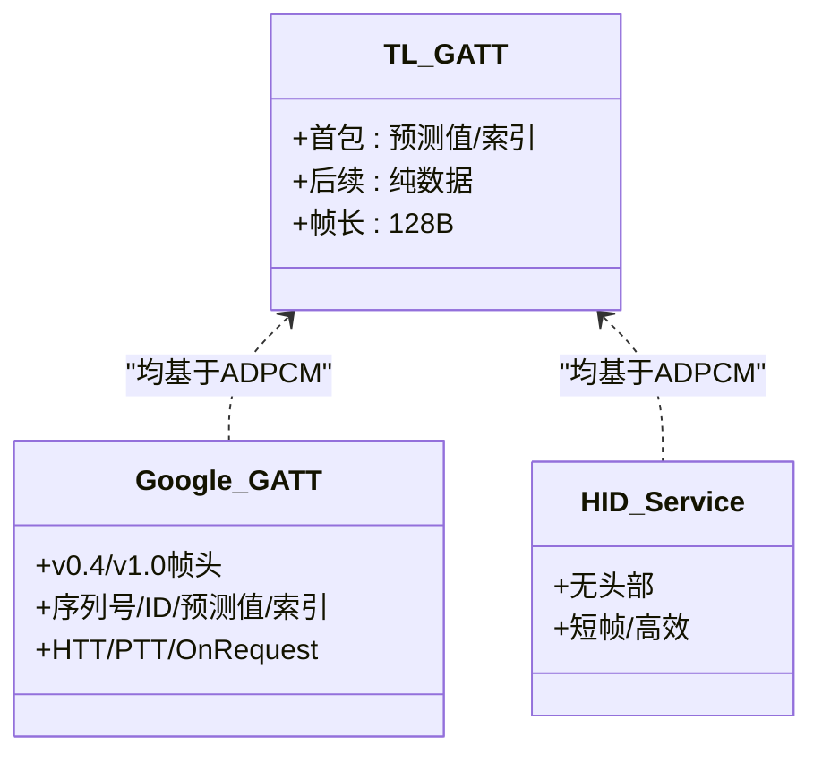
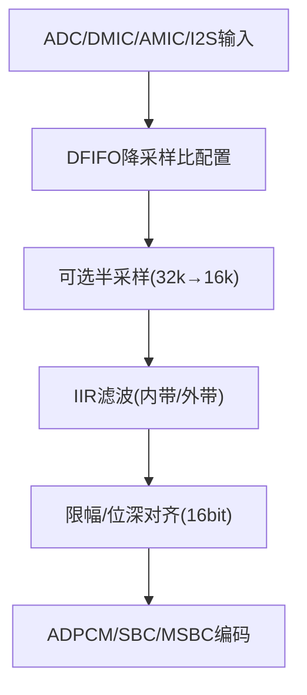
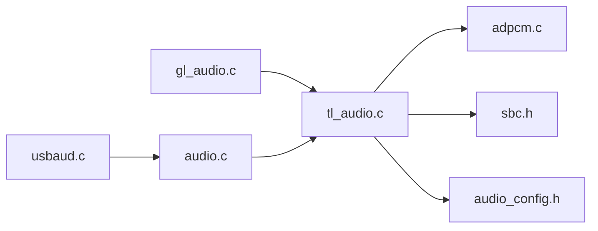

# 音频数据流

<cite>
**本文引用的文件**
- [adpcm.c](file://tc_ble_single_sdk/application/audio/adpcm.c)
- [adpcm.h](file://tc_ble_single_sdk/application/audio/adpcm.h)
- [tl_audio.c](file://tc_ble_single_sdk/application/audio/tl_audio.c)
- [tl_audio.h](file://tc_ble_single_sdk/application/audio/tl_audio.h)
- [audio_config.h](file://tc_ble_single_sdk/application/audio/audio_config.h)
- [audio_common.h](file://tc_ble_single_sdk/application/audio/audio_common.h)
- [gl_audio.c](file://tc_ble_single_sdk/application/audio/gl_audio.c)
- [gl_audio.h](file://tc_ble_single_sdk/application/audio/gl_audio.h)
- [sbc.h](file://tc_ble_single_sdk/application/audio/sbc.h)
- [audio.c](file://tc_ble_single_sdk/drivers/B85/audio.c)
- [audio.h](file://tc_ble_single_sdk/drivers/B85/audio.h)
- [usbaud.c](file://tc_ble_single_sdk/application/app/usbaud.c)
- [usbaud.h](file://tc_ble_single_sdk/application/app/usbaud.h)
</cite>

## 目录
1. [简介](#简介)
2. [项目结构](#项目结构)
3. [核心组件](#核心组件)
4. [架构总览](#架构总览)
5. [详细组件分析](#详细组件分析)
6. [依赖关系分析](#依赖关系分析)
7. [性能考量](#性能考量)
8. [故障排查指南](#故障排查指南)
9. [结论](#结论)
10. [附录](#附录)

## 简介
本文件面向从ADC采集到编码传输的完整音频处理链路，覆盖以下主题：
- ADPCM编解码算法的实现原理（预测编码、量化与步长调整）
- 音频缓冲区管理策略（双缓冲设计、内存分配与数据同步）
- 不同音频模式（Telink GATT、Google GATT、HID服务）的数据处理差异
- 音频数据格式转换流程（采样率转换、位深度处理、声道配置）
- 音频质量控制技术（噪声抑制、自动增益控制、延迟优化）
- 性能监控点与调试方法

## 项目结构
该SDK将音频相关代码按“应用层”和“驱动层”分层组织：
- 应用层（application/audio）：封装ADPCM/SBC/MSBC编解码、GATT/HTT/HID协议适配、音频参数与缓冲管理。
- 驱动层（drivers/B85）：提供ADC/DMIC/AMIC/I2S/USB等硬件接口、DFIFO配置、时钟与音量控制。
- USB音频（application/app）：实现USB音频类设备控制面与数据面交互。

图表来源
- [tl_audio.c:323-751](file://tc_ble_single_sdk/application/audio/tl_audio.c#L323-L751)
- [adpcm.c:29-521](file://tc_ble_single_sdk/application/audio/adpcm.c#L29-L521)
- [gl_audio.c:30-356](file://tc_ble_single_sdk/application/audio/gl_audio.c#L30-L356)
- [audio_config.h:28-123](file://tc_ble_single_sdk/application/audio/audio_config.h#L28-L123)
- [audio_common.h:27-79](file://tc_ble_single_sdk/application/audio/audio_common.h#L27-L79)
- [audio.c:92-364](file://tc_ble_single_sdk/drivers/B85/audio.c#L92-L364)
- [usbaud.c:311-454](file://tc_ble_single_sdk/application/app/usbaud.c#L311-L454)

章节来源
- [tl_audio.c:323-751](file://tc_ble_single_sdk/application/audio/tl_audio.c#L323-L751)
- [audio_config.h:28-123](file://tc_ble_single_sdk/application/audio/audio_config.h#L28-L123)
- [audio_common.h:27-79](file://tc_ble_single_sdk/application/audio/audio_common.h#L27-L79)
- [audio.c:92-364](file://tc_ble_single_sdk/drivers/B85/audio.c#L92-L364)
- [usbaud.c:311-454](file://tc_ble_single_sdk/application/app/usbaud.c#L311-L454)

## 核心组件
- 音频采集与预处理：通过驱动层初始化ADC/DMIC/AMIC/I2S/USB输入路径，设置ALC、HPF/LPF、降采样比；应用层在每帧进入编码器前可选IIR滤波与噪声抑制。
- 编解码器：
  - ADPCM：支持Telink GATT、Google GATT、HID三种打包格式，含预测值与索引维护。
  - SBC/MSBC：通过统一接口进行压缩，适配HID或透传场景。
- 缓冲管理：环形缓冲+包级写读指针，避免CPU忙等；溢出保护与下溢保护。
- 协议适配：Google GATT/HTT/PTT状态机，控制麦克风开关、超时、能力协商。
- USB音频：控制面（音量/静音）与数据面（端点读写）。

章节来源
- [tl_audio.c:323-751](file://tc_ble_single_sdk/application/audio/tl_audio.c#L323-L751)
- [adpcm.c:29-521](file://tc_ble_single_sdk/application/audio/adpcm.c#L29-L521)
- [sbc.h:44-55](file://tc_ble_single_sdk/application/audio/sbc.h#L44-L55)
- [gl_audio.c:30-356](file://tc_ble_single_sdk/application/audio/gl_audio.c#L30-L356)
- [usbaud.c:311-454](file://tc_ble_single_sdk/application/app/usbaud.c#L311-L454)

## 架构总览
下图展示从ADC到编码再到传输的整体数据流与控制流。

图表来源
- [audio.c:131-134](file://tc_ble_single_sdk/drivers/B85/audio.h#L131-L134)
- [tl_audio.c:338-418](file://tc_ble_single_sdk/application/audio/tl_audio.c#L338-L418)
- [adpcm.c:53-126](file://tc_ble_single_sdk/application/audio/adpcm.c#L53-L126)
- [gl_audio.c:60-181](file://tc_ble_single_sdk/application/audio/gl_audio.c#L60-L181)
- [usbaud.c:311-399](file://tc_ble_single_sdk/application/app/usbaud.c#L311-L399)

## 详细组件分析

### ADPCM编解码算法
- 预测编码：以历史预测值为基础计算差值，使用自适应步长表更新预测值与索引。
- 量化：对差值进行4bit量化，累积为16位码字后按字节序输出。
- 步长调整：根据量化结果查表更新预测索引，限制范围防止越界。
- 多模式打包：
  - Telink GATT：首包携带初始预测值与索引，后续仅数据。
  - Google GATT：支持v0.4/v1.0两种帧头格式，包含序列号、ID、预测值与索引。
  - HID服务：纯数据帧，无额外头部。

图表来源
- [adpcm.c:53-126](file://tc_ble_single_sdk/application/audio/adpcm.c#L53-L126)
- [adpcm.c:137-208](file://tc_ble_single_sdk/application/audio/adpcm.c#L137-L208)
- [adpcm.c:217-280](file://tc_ble_single_sdk/application/audio/adpcm.c#L217-L280)
- [adpcm.c:289-361](file://tc_ble_single_sdk/application/audio/adpcm.c#L289-L361)
- [adpcm.c:372-440](file://tc_ble_single_sdk/application/audio/adpcm.c#L372-L440)
- [adpcm.c:447-513](file://tc_ble_single_sdk/application/audio/adpcm.c#L447-L513)

章节来源
- [adpcm.c:29-521](file://tc_ble_single_sdk/application/audio/adpcm.c#L29-L521)
- [adpcm.h:27-44](file://tc_ble_single_sdk/application/audio/adpcm.h#L27-L44)

### 音频缓冲区管理（双缓冲/环形缓冲）
- 写指针：由驱动层提供get_mic_wr_ptr()，表示ADC/DMIC/AMIC/I2S/USB最新可写位置。
- 读指针：应用层维护buffer_mic_rptr，按固定单元大小消费数据。
- 包缓冲：buffer_mic_enc为编码输出环形缓冲，wptr/rptr用于生产者-消费者同步。
- 溢出保护：当编码队列超过阈值时丢弃最旧包，保证实时性。

图表来源
- [tl_audio.c:338-418](file://tc_ble_single_sdk/application/audio/tl_audio.c#L338-L418)
- [tl_audio.c:444-525](file://tc_ble_single_sdk/application/audio/tl_audio.c#L444-L525)
- [tl_audio.c:552-633](file://tc_ble_single_sdk/application/audio/tl_audio.c#L552-L633)
- [tl_audio.c:652-733](file://tc_ble_single_sdk/application/audio/tl_audio.c#L652-L733)

章节来源
- [tl_audio.c:323-751](file://tc_ble_single_sdk/application/audio/tl_audio.c#L323-L751)
- [tl_audio.h:61-63](file://tc_ble_single_sdk/application/audio/tl_audio.h#L61-L63)

### 不同音频模式的数据处理差异
- Telink GATT（RCU/Dongle）：
  - 使用TLINK自定义GATT特征，首包携带预测头信息，后续仅数据。
  - 帧长与单元大小由audio_config.h定义。
- Google GATT：
  - 支持v0.4与v1.0两种帧头，包含序列号、ID、预测值与索引。
  - gl_audio.c实现HTT/PTT/OnRequest三种交互模型，处理开/关、能力协商、超时。
- HID服务：
  - 通过HID通道传输，通常无额外头部，适合低开销透传。

图表来源
- [audio_config.h:32-74](file://tc_ble_single_sdk/application/audio/audio_config.h#L32-L74)
- [gl_audio.c:60-181](file://tc_ble_single_sdk/application/audio/gl_audio.c#L60-L181)
- [gl_audio.h:75-143](file://tc_ble_single_sdk/application/audio/gl_audio.h#L75-L143)

章节来源
- [audio_config.h:28-123](file://tc_ble_single_sdk/application/audio/audio_config.h#L28-L123)
- [gl_audio.c:30-356](file://tc_ble_single_sdk/application/audio/gl_audio.c#L30-L356)
- [gl_audio.h:29-154](file://tc_ble_single_sdk/application/audio/gl_audio.h#L29-L154)

### 音频数据格式转换流程
- 采样率转换：
  - 驱动层通过DFIFO降采样比将原始采样率降至目标速率（如32k→16k）。
  - 应用层可选半采样抽取（例如32k→16k）。
- 位深度处理：
  - ADC分辨率配置为14bit，后续IIR滤波与限幅确保16bit输出。
- 声道配置：
  - 支持单声道与立体声切换，默认单声道以降低带宽。

图表来源
- [audio.c:92-237](file://tc_ble_single_sdk/drivers/B85/audio.c#L92-L237)
- [audio.c:288-364](file://tc_ble_single_sdk/drivers/B85/audio.c#L288-L364)
- [tl_audio.c:354-406](file://tc_ble_single_sdk/application/audio/tl_audio.c#L354-L406)

章节来源
- [audio.c:92-364](file://tc_ble_single_sdk/drivers/B85/audio.c#L92-L364)
- [tl_audio.c:354-406](file://tc_ble_single_sdk/application/audio/tl_audio.c#L354-L406)

### 音频质量控制技术
- 噪声抑制：
  - 基于短时/长时能量估计与门限判断，动态衰减噪声段。
  - 通过tl_audio.h中的noise_suppression函数实现。
- 自动增益控制（ALC）：
  - 驱动层配置ALC数字模式与最小音量，避免削波与过小信号。
- 延迟优化：
  - 小帧长与快速编码路径（RAM代码），减少端到端延迟。
  - 包缓冲溢出保护，避免阻塞。

章节来源
- [tl_audio.h:66-105](file://tc_ble_single_sdk/application/audio/tl_audio.h#L66-L105)
- [tl_audio.c:175-216](file://tc_ble_single_sdk/application/audio/tl_audio.c#L175-L216)
- [adpcm.c:372-440](file://tc_ble_single_sdk/application/audio/adpcm.c#L372-L440)

## 依赖关系分析
- 应用层依赖：
  - tl_audio.c依赖adpcm.c与sbc.h进行编码，依赖audio_config.h确定帧长与单元大小。
  - gl_audio.c依赖BLE栈与GATT特性句柄，管理Google语音生命周期。
- 驱动层依赖：
  - audio.c提供ADC/DMIC/AMIC/I2S/USB初始化与DFIFO配置，暴露get_mic_wr_ptr()供应用层消费。
- USB音频：
  - usbaud.c实现控制面（音量/静音）与数据面（端点读写），与驱动层寄存器交互。

图表来源
- [tl_audio.c:323-751](file://tc_ble_single_sdk/application/audio/tl_audio.c#L323-L751)
- [adpcm.c:29-521](file://tc_ble_single_sdk/application/audio/adpcm.c#L29-L521)
- [sbc.h:44-55](file://tc_ble_single_sdk/application/audio/sbc.h#L44-L55)
- [audio_config.h:28-123](file://tc_ble_single_sdk/application/audio/audio_config.h#L28-L123)
- [gl_audio.c:30-356](file://tc_ble_single_sdk/application/audio/gl_audio.c#L30-L356)
- [audio.c:92-364](file://tc_ble_single_sdk/drivers/B85/audio.c#L92-L364)
- [usbaud.c:311-454](file://tc_ble_single_sdk/application/app/usbaud.c#L311-L454)

章节来源
- [tl_audio.c:323-751](file://tc_ble_single_sdk/application/audio/tl_audio.c#L323-L751)
- [adpcm.c:29-521](file://tc_ble_single_sdk/application/audio/adpcm.c#L29-L521)
- [sbc.h:44-55](file://tc_ble_single_sdk/application/audio/sbc.h#L44-L55)
- [audio_config.h:28-123](file://tc_ble_single_sdk/application/audio/audio_config.h#L28-L123)
- [gl_audio.c:30-356](file://tc_ble_single_sdk/application/audio/gl_audio.c#L30-L356)
- [audio.c:92-364](file://tc_ble_single_sdk/drivers/B85/audio.c#L92-L364)
- [usbaud.c:311-454](file://tc_ble_single_sdk/application/app/usbaud.c#L311-L454)

## 性能考量
- 编码路径优化：
  - Google模式下的adpcm_to_pcm使用RAM代码标注以减少执行时间。
- 缓冲策略：
  - 包缓冲采用环形结构与写读指针，避免拷贝与锁竞争。
  - 溢出保护机制确保高负载下不阻塞。
- 延迟控制：
  - 小帧长（如20B/57B/120B/128B）与快速IIR/降噪路径降低端到端延迟。
- 功耗与资源：
  - 按需启用IIR与降噪，关闭未用通道降低功耗。

[本节为通用指导，无需具体文件引用]

## 故障排查指南
- 无声音/无声：
  - 检查驱动层初始化是否正确（ADC/DMIC/AMIC/I2S/USB），确认ALC与HPF/LPF配置。
  - 确认应用层proc_mic_encoder是否被周期性调用，缓冲写指针是否正常增长。
- 杂音/爆音：
  - 检查IIR滤波系数与移位量，确认限幅逻辑有效。
  - 验证噪声抑制门限与增益曲线是否合理。
- 丢包/卡顿：
  - 观察包缓冲溢出保护是否频繁触发，必要时增大缓冲或降低帧长。
  - 检查BLE/HID发送频率与MTU限制。
- Google语音异常：
  - 核对能力协商与帧头版本（v0.4/v1.0），确认HTT/PTT/OnRequest状态机流转正确。
  - 检查超时处理与远程响应。

章节来源
- [audio.c:92-364](file://tc_ble_single_sdk/drivers/B85/audio.c#L92-L364)
- [tl_audio.c:354-406](file://tc_ble_single_sdk/application/audio/tl_audio.c#L354-L406)
- [gl_audio.c:185-356](file://tc_ble_single_sdk/application/audio/gl_audio.c#L185-L356)

## 结论
该SDK提供了完整的音频采集、预处理、编码与传输链路，支持多种模式与协议。通过合理的缓冲管理与质量控制技术，能够在低功耗MCU上实现低延迟、稳定的语音传输。针对不同的应用场景（Telink GATT、Google GATT、HID服务），可根据需求选择合适编码与帧长，平衡音质与带宽。

[本节为总结，无需具体文件引用]

## 附录
- 关键常量与配置：
  - 帧长与单元大小：见audio_config.h中各模式定义。
  - 模式宏：见audio_common.h中TL_AUDIO_*宏。
- 常用API：
  - 编解码：mic_to_adpcm_split、adpcm_to_pcm、sbc_enc。
  - 缓冲：get_mic_wr_ptr、mic_encoder_data_buffer、mic_encoder_data_read_ok。
  - 驱动：audio_amic_init、audio_dmic_init、audio_usb_init、audio_i2s_init。
  - USB：audio_tx_data_to_usb、audio_rx_data_from_usb、usbaud_handle_set_*_cmd。

章节来源
- [audio_config.h:28-123](file://tc_ble_single_sdk/application/audio/audio_config.h#L28-L123)
- [audio_common.h:27-79](file://tc_ble_single_sdk/application/audio/audio_common.h#L27-L79)
- [adpcm.h:27-44](file://tc_ble_single_sdk/application/audio/adpcm.h#L27-L44)
- [sbc.h:44-55](file://tc_ble_single_sdk/application/audio/sbc.h#L44-L55)
- [tl_audio.h:112-127](file://tc_ble_single_sdk/application/audio/tl_audio.h#L112-L127)
- [audio.h:131-168](file://tc_ble_single_sdk/drivers/B85/audio.h#L131-L168)
- [usbaud.h:91-113](file://tc_ble_single_sdk/application/app/usbaud.h#L91-L113)