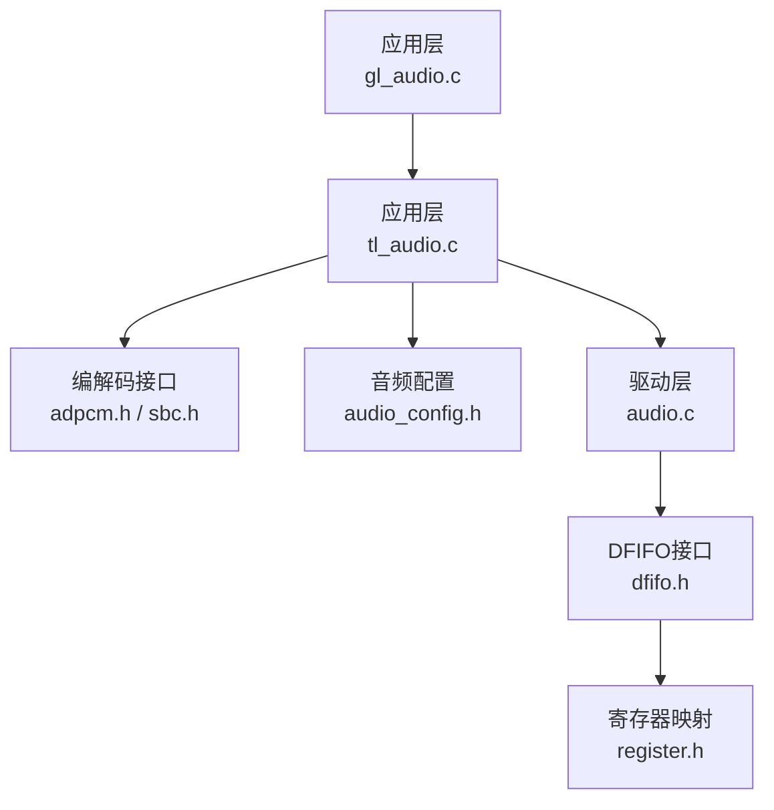
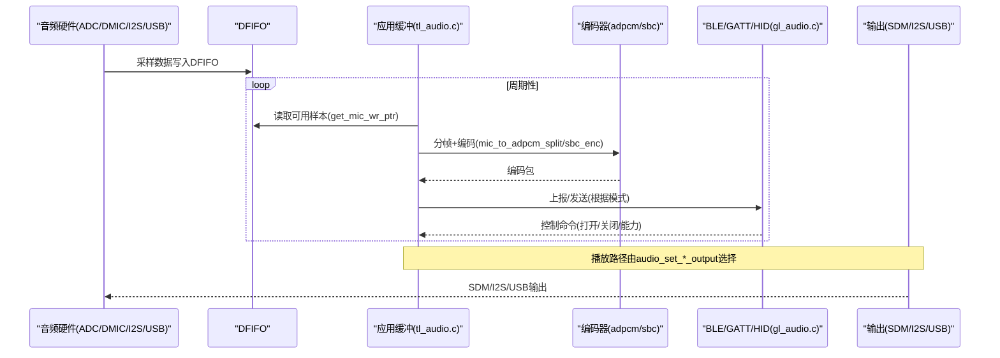
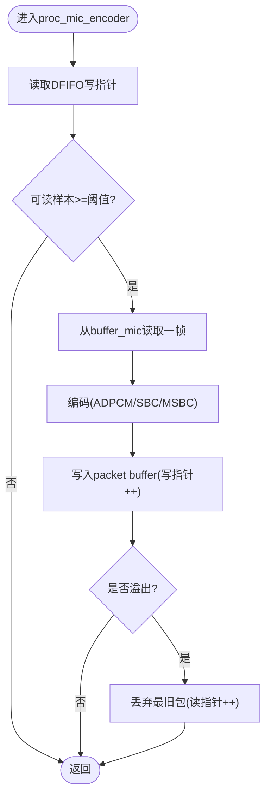
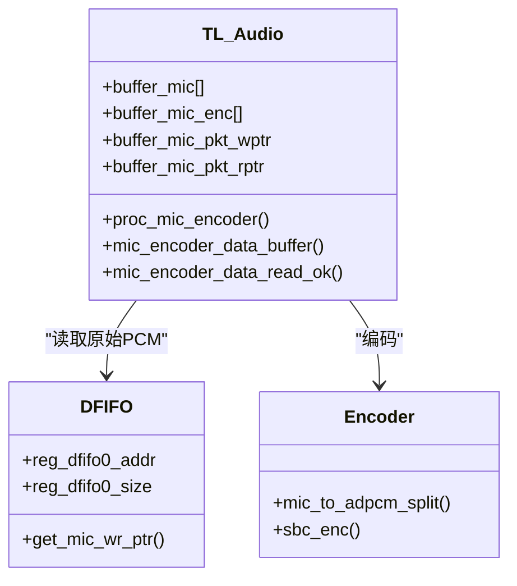
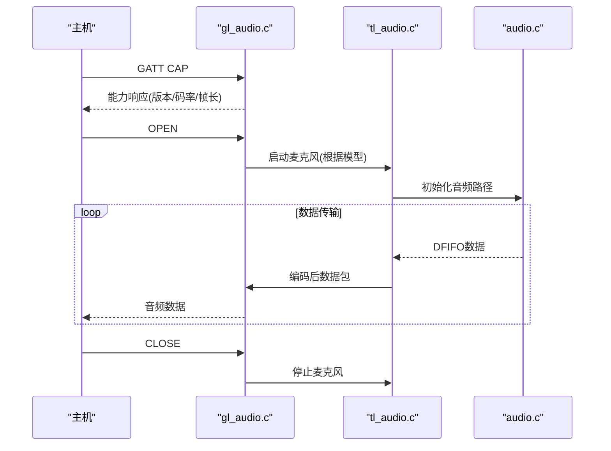
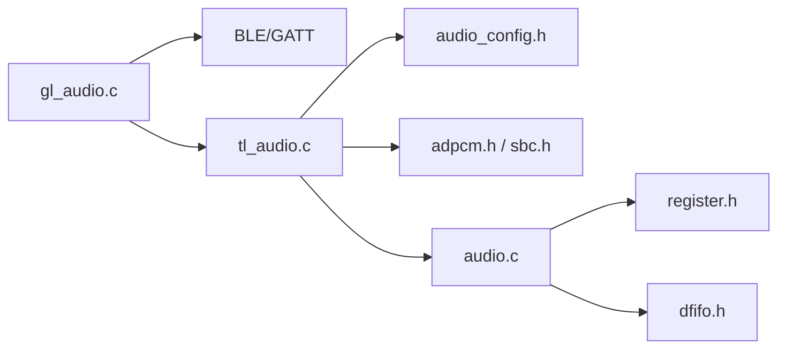

# 音频缓冲区管理

<cite>
**本文引用的文件**
- [gl_audio.h](file://tc_ble_single_sdk/application/audio/gl_audio.h)
- [gl_audio.c](file://tc_ble_single_sdk/application/audio/gl_audio.c)
- [audio_config.h](file://tc_ble_single_sdk/application/audio/audio_config.h)
- [tl_audio.h](file://tc_ble_single_sdk/application/audio/tl_audio.h)
- [tl_audio.c](file://tc_ble_single_sdk/application/audio/tl_audio.c)
- [adpcm.h](file://tc_ble_single_sdk/application/audio/adpcm.h)
- [sbc.h](file://tc_ble_single_sdk/application/audio/sbc.h)
- [audio.h](file://tc_ble_single_sdk/drivers/B85/audio.h)
- [audio.c](file://tc_ble_single_sdk/drivers/B85/audio.c)
- [dfifo.h](file://tc_ble_single_sdk/drivers/B85/dfifo.h)
- [register.h](file://tc_ble_single_sdk/drivers/B85/register.h)
</cite>

## 目录
1. [简介](#简介)
2. [项目结构](#项目结构)
3. [核心组件](#核心组件)
4. [架构总览](#架构总览)
5. [详细组件分析](#详细组件分析)
6. [依赖关系分析](#依赖关系分析)
7. [性能与延迟优化](#性能与延迟优化)
8. [故障排查指南](#故障排查指南)
9. [结论](#结论)
10. [附录：配置与参数速查](#附录配置与参数速查)

## 简介
本文件围绕该SDK中的音频数据路径，系统性阐述双缓冲设计、FIFO（DFIFO）机制、内存分配策略、溢出保护、不同音频模式下的缓冲区大小与数据流控制，以及监控调试方法与丢包处理策略。目标是为开发者提供从底层硬件到上层应用的全链路理解与实践指导。

## 项目结构
- 应用层音频模块
  - Google GATT 音频协议适配：gl_audio.*
  - 编码与缓冲：tl_audio.*，adpcm.h，sbc.h
  - 模式与尺寸配置：audio_config.h
- 驱动层音频子系统
  - 音频外设与I2S/SDM输出：audio.h/.c
  - DFIFO（数字FIFO）接口：dfifo.h
  - 寄存器定义：register.h

图表来源
- [gl_audio.c:24-31](file://tc_ble_single_sdk/application/audio/gl_audio.c#L24-L31)
- [tl_audio.c:24-30](file://tc_ble_single_sdk/application/audio/tl_audio.c#L24-L30)
- [audio_config.h:28-123](file://tc_ble_single_sdk/application/audio/audio_config.h#L28-L123)
- [audio.c:24-31](file://tc_ble_single_sdk/drivers/B85/audio.c#L24-L31)
- [dfifo.h:50-84](file://tc_ble_single_sdk/drivers/B85/dfifo.h#L50-L84)
- [register.h:163-200](file://tc_ble_single_sdk/drivers/B85/register.h#L163-L200)

章节来源
- [gl_audio.c:24-31](file://tc_ble_single_sdk/application/audio/gl_audio.c#L24-L31)
- [tl_audio.c:24-30](file://tc_ble_single_sdk/application/audio/tl_audio.c#L24-L30)
- [audio_config.h:28-123](file://tc_ble_single_sdk/application/audio/audio_config.h#L28-L123)
- [audio.c:24-31](file://tc_ble_single_sdk/drivers/B85/audio.c#L24-L31)
- [dfifo.h:50-84](file://tc_ble_single_sdk/drivers/B85/dfifo.h#L50-L84)
- [register.h:163-200](file://tc_ble_single_sdk/drivers/B85/register.h#L163-L200)

## 核心组件
- 音频输入与DFIFO
  - 通过 audio_amic_init/audio_dmic_init/audio_usb_init/audio_buff_init 等初始化函数配置ADC/DMIC/I2S/USB输入路径，并启用DFIFO时钟与模式，将采样数据写入DFIFO。
  - DFIFO提供地址与深度设置接口，用于把SRAM区域作为环形缓冲供CPU读取。
- 应用层缓冲与编码
  - tl_audio.c 中维护多包缓冲（packet buffer），按模式（ADPCM/SBC/MSBC）进行分帧、编码，并通过 mic_encoder_data_buffer/mic_encoder_data_read_ok 暴露给上层发送。
  - 对于Google GATT模式，gl_audio.c 负责GATT控制面（能力协商、打开/关闭、超时处理）。
- 输出路径
  - audio_set_sdm_output/audio_set_i2s_output 将DFIFO数据经SDM或I2S输出；也可通过USB输出。

章节来源
- [audio.c:92-237](file://tc_ble_single_sdk/drivers/B85/audio.c#L92-L237)
- [audio.c:288-323](file://tc_ble_single_sdk/drivers/B85/audio.c#L288-L323)
- [audio.c:332-364](file://tc_ble_single_sdk/drivers/B85/audio.c#L332-L364)
- [audio.c:373-405](file://tc_ble_single_sdk/drivers/B85/audio.c#L373-L405)
- [dfifo.h:50-84](file://tc_ble_single_sdk/drivers/B85/dfifo.h#L50-L84)
- [tl_audio.c:323-418](file://tc_ble_single_sdk/application/audio/tl_audio.c#L323-L418)
- [gl_audio.c:213-355](file://tc_ble_single_sdk/application/audio/gl_audio.c#L213-L355)

## 架构总览
下图展示从采集到输出的完整数据流，包括DFIFO、应用缓冲、编码器、BLE/GATT/HID传输以及输出路径。

图表来源
- [audio.c:92-237](file://tc_ble_single_sdk/drivers/B85/audio.c#L92-L237)
- [tl_audio.c:323-418](file://tc_ble_single_sdk/application/audio/tl_audio.c#L323-L418)
- [gl_audio.c:213-355](file://tc_ble_single_sdk/application/audio/gl_audio.c#L213-L355)
- [audio.c:414-478](file://tc_ble_single_sdk/drivers/B85/audio.c#L414-L478)

## 详细组件分析

### 双缓冲设计与数据同步
- 硬件侧：DFIFO以环形方式工作，写指针由硬件递增，读指针由软件维护。通过 get_mic_wr_ptr 获取最新写入位置，计算可读长度，避免竞争。
- 应用侧：采用多包缓冲（packet buffer），每个包对应一帧编码后的数据。写指针 buffer_mic_pkt_wptr 由编码线程推进，读指针 buffer_mic_pkt_rptr 由发送线程推进，形成生产者-消费者模型。
- 同步要点
  - 仅在“可读样本数”达到阈值时触发一次编码，降低CPU抖动。
  - 使用模运算实现环形索引，保证无锁高效访问。
  - 对编码器输出缓冲的溢出检测：当写-读差超过上限时，丢弃最旧包，防止内存越界。

图表来源
- [tl_audio.c:323-418](file://tc_ble_single_sdk/application/audio/tl_audio.c#L323-L418)
- [tl_audio.c:439-524](file://tc_ble_single_sdk/application/audio/tl_audio.c#L439-L524)
- [tl_audio.c:546-633](file://tc_ble_single_sdk/application/audio/tl_audio.c#L546-L633)
- [tl_audio.c:651-733](file://tc_ble_single_sdk/application/audio/tl_audio.c#L651-L733)
- [tl_audio.c:753-800](file://tc_ble_single_sdk/application/audio/tl_audio.c#L753-L800)

章节来源
- [tl_audio.c:323-418](file://tc_ble_single_sdk/application/audio/tl_audio.c#L323-L418)
- [tl_audio.c:439-524](file://tc_ble_single_sdk/application/audio/tl_audio.c#L439-L524)
- [tl_audio.c:546-633](file://tc_ble_single_sdk/application/audio/tl_audio.c#L546-L633)
- [tl_audio.c:651-733](file://tc_ble_single_sdk/application/audio/tl_audio.c#L651-L733)
- [tl_audio.c:753-800](file://tc_ble_single_sdk/application/audio/tl_audio.c#L753-L800)

### FIFO缓冲区的使用与优化技巧
- DFIFO配置
  - 通过 dfifo_set_dfifo0/1/2 设置基址与深度，注意size字段为(size>>4)-1，需按16字节对齐。
  - 在音频初始化中开启DFIFO时钟 reg_clk_en2 |= FLD_CLK2_DFIFO_EN，并选择输入源与单/立体声模式。
- 优化建议
  - 合理设置DFIFO深度，平衡延迟与抗抖：较大深度可降低突发丢样风险，但增加端到端延迟。
  - 批量读取：每次读取整帧（如TL_MIC_BUFFER_SIZE/2或MIC_SHORT_DEC_SIZE）以减少中断/调度开销。
  - 避免频繁切换模式：初始化后尽量保持固定输入源与采样率。

章节来源
- [dfifo.h:50-84](file://tc_ble_single_sdk/drivers/B85/dfifo.h#L50-L84)
- [audio.c:92-237](file://tc_ble_single_sdk/drivers/B85/audio.c#L92-L237)
- [audio.c:288-323](file://tc_ble_single_sdk/drivers/B85/audio.c#L288-L323)
- [audio.c:332-364](file://tc_ble_single_sdk/drivers/B85/audio.c#L332-L364)
- [audio.c:373-405](file://tc_ble_single_sdk/drivers/B85/audio.c#L373-L405)

### 不同音频模式下的缓冲区大小与数据流控制
- RCU项目（麦克风端）
  - ADPCM模式：TL_MIC_BUFFER_SIZE 与 ADPCM_PACKET_LEN 决定每帧采样与编码包大小；TL_MIC_PACKET_BUFFER_NUM 控制并发包数。
  - SBC/MSBC模式：MIC_SHORT_DEC_SIZE 决定解码后每块PCM长度；ADPCM_PACKET_LEN 为实际发送帧长（含头部）。
- Dongle项目（接收/播放端）
  - 使用 abuf_mic/abuf_dec 双缓冲：abuf_mic 缓存压缩帧，abuf_dec 缓存解出的PCM；abuf_mic_add/abuf_mic_dec 完成入队与解码出队。
  - 针对Google GATT v1.0/v1.x，帧长与解码长度不同（240/256），影响缓冲大小与对齐。

图表来源
- [tl_audio.c:323-418](file://tc_ble_single_sdk/application/audio/tl_audio.c#L323-L418)
- [adpcm.h:27-44](file://tc_ble_single_sdk/application/audio/adpcm.h#L27-L44)
- [sbc.h:40-55](file://tc_ble_single_sdk/application/audio/sbc.h#L40-L55)
- [audio.c:127-134](file://tc_ble_single_sdk/drivers/B85/audio.c#L127-L134)

章节来源
- [audio_config.h:28-123](file://tc_ble_single_sdk/application/audio/audio_config.h#L28-L123)
- [tl_audio.c:323-418](file://tc_ble_single_sdk/application/audio/tl_audio.c#L323-L418)
- [tl_audio.c:439-524](file://tc_ble_single_sdk/application/audio/tl_audio.c#L439-L524)
- [tl_audio.c:546-633](file://tc_ble_single_sdk/application/audio/tl_audio.c#L546-L633)
- [tl_audio.c:651-733](file://tc_ble_single_sdk/application/audio/tl_audio.c#L651-L733)
- [tl_audio.c:753-800](file://tc_ble_single_sdk/application/audio/tl_audio.c#L753-L800)

### 内存管理与溢出保护机制
- 编码器输出缓冲溢出保护
  - 在SBC/MSBC分支中，若写-读差超过 TL_MIC_PACKET_BUFFER_NUM，则自动推进读指针丢弃最旧包，避免写越界。
- 播放缓冲溢出保护（Dongle）
  - abuf_mic_dec 中检测 num_mic > MIC_ADPCM_FRAME_NUM 时推进写指针，必要时重置缓冲，确保稳定播放。
- 双缓冲/多缓冲策略
  - 应用层使用多包缓冲，配合“阈值触发编码”，减少CPU占用和抖动。
  - 播放侧使用双缓冲（压缩帧缓冲+PCM缓冲），隔离编解码与IO节奏差异。

章节来源
- [tl_audio.c:439-524](file://tc_ble_single_sdk/application/audio/tl_audio.c#L439-L524)
- [tl_audio.c:546-633](file://tc_ble_single_sdk/application/audio/tl_audio.c#L546-L633)
- [tl_audio.c:651-733](file://tc_ble_single_sdk/application/audio/tl_audio.c#L651-L733)
- [tl_audio.c:876-932](file://tc_ble_single_sdk/application/audio/tl_audio.c#L876-L932)
- [tl_audio.c:1013-1064](file://tc_ble_single_sdk/application/audio/tl_audio.c#L1013-L1064)
- [tl_audio.c:1176-1238](file://tc_ble_single_sdk/application/audio/tl_audio.c#L1176-L1238)

### 不同音频模式下的缓冲区大小配置
- RCU（麦克风）
  - ADPCM：TL_MIC_BUFFER_SIZE=960/1024，ADPCM_PACKET_LEN=120/136，TL_MIC_PACKET_BUFFER_NUM=4
  - SBC/MSBC：MIC_SHORT_DEC_SIZE=80/120，ADPCM_PACKET_LEN=20/57
- Dongle（播放）
  - Google v1.0：MIC_SHORT_DEC_SIZE=240，v1.x：256
  - abuf_mic 大小为 MIC_ADPCM_FRAME_SIZE * N（N=4/8），abuf_dec 大小为 DEC_BUFFER_SIZE

章节来源
- [audio_config.h:28-123](file://tc_ble_single_sdk/application/audio/audio_config.h#L28-L123)
- [tl_audio.c:1013-1064](file://tc_ble_single_sdk/application/audio/tl_audio.c#L1013-L1064)
- [tl_audio.c:1176-1238](file://tc_ble_single_sdk/application/audio/tl_audio.c#L1176-L1238)

### 数据流转控制（Google GATT）
- 能力协商：收到 CAP 命令后，根据交互模型（On-Request/PTT/HTT）回复能力集，包含版本、码率、帧长等。
- 打开/关闭：OPEN/CLOSE 控制麦克风的启停，结合按键事件（HTT/PTT）与超时处理。
- 超时保护：EXTEND 刷新超时计时器；超时后主动关闭并通知主机。

图表来源
- [gl_audio.c:213-355](file://tc_ble_single_sdk/application/audio/gl_audio.c#L213-L355)
- [tl_audio.c:323-418](file://tc_ble_single_sdk/application/audio/tl_audio.c#L323-L418)
- [audio.c:92-237](file://tc_ble_single_sdk/drivers/B85/audio.c#L92-L237)

章节来源
- [gl_audio.c:213-355](file://tc_ble_single_sdk/application/audio/gl_audio.c#L213-L355)
- [gl_audio.c:185-211](file://tc_ble_single_sdk/application/audio/gl_audio.c#L185-L211)

## 依赖关系分析
- 应用层依赖
  - gl_audio.c 依赖 BLE/GATT 栈与 UI 控制（ui_enable_mic），并与 tl_audio.c 协作完成音频生命周期管理。
  - tl_audio.c 依赖 adpcm/sbc 编解码库与 audio_config.h 的配置宏。
- 驱动层依赖
  - audio.c 依赖 register.h 的位域与寄存器定义，dfifo.h 提供FIFO操作接口。
- 耦合点
  - 配置宏（TL_AUDIO_MODE、GOOGLE_AUDIO_VERSION）决定数据路径与缓冲大小。
  - 编码器输出缓冲大小与发送周期强相关，需保持一致性。

图表来源
- [gl_audio.c:24-31](file://tc_ble_single_sdk/application/audio/gl_audio.c#L24-L31)
- [tl_audio.c:24-30](file://tc_ble_single_sdk/application/audio/tl_audio.c#L24-L30)
- [audio_config.h:28-123](file://tc_ble_single_sdk/application/audio/audio_config.h#L28-L123)
- [audio.c:24-31](file://tc_ble_single_sdk/drivers/B85/audio.c#L24-L31)
- [dfifo.h:50-84](file://tc_ble_single_sdk/drivers/B85/dfifo.h#L50-L84)
- [register.h:163-200](file://tc_ble_single_sdk/drivers/B85/register.h#L163-L200)

章节来源
- [gl_audio.c:24-31](file://tc_ble_single_sdk/application/audio/gl_audio.c#L24-L31)
- [tl_audio.c:24-30](file://tc_ble_single_sdk/application/audio/tl_audio.c#L24-L30)
- [audio_config.h:28-123](file://tc_ble_single_sdk/application/audio/audio_config.h#L28-L123)
- [audio.c:24-31](file://tc_ble_single_sdk/drivers/B85/audio.c#L24-L31)
- [dfifo.h:50-84](file://tc_ble_single_sdk/drivers/B85/dfifo.h#L50-L84)
- [register.h:163-200](file://tc_ble_single_sdk/drivers/B85/register.h#L163-L200)

## 性能与延迟优化
- 降低CPU占用
  - 增大DFIFO深度与单次读取帧长，减少调用频率。
  - 使用阈值触发编码，避免每采样都处理。
- 降低端到端延迟
  - 减小DFIFO深度与缓冲包数，权衡丢包风险。
  - 缩短编码包大小（如Google v1.0的120B vs v1.x的136B）。
- 稳定性与鲁棒性
  - 启用溢出保护（丢弃最旧包），避免崩溃。
  - 播放侧双缓冲隔离编解码与IO抖动。
- 功耗
  - 空闲时关闭音频模块（audio_stop），按需唤醒。

[本节为通用指导，不直接分析具体文件]

## 故障排查指南
- 常见问题
  - 无声/爆音：检查DFIFO时钟与输入源配置是否正确；确认音频路径（SDM/I2S/USB）已启用。
  - 卡顿/断断续续：检查编码器输出缓冲是否溢出；适当增大 TL_MIC_PACKET_BUFFER_NUM 或调整阈值。
  - 连接断开后未释放：检查超时处理逻辑（app_audio_timeout_proc）是否被调用。
- 定位方法
  - 观察 get_mic_wr_ptr 变化，判断DFIFO是否持续写入。
  - 打印 buffer_mic_pkt_wptr/buffer_mic_pkt_rptr，确认生产消费速率匹配。
  - 在Google模式下，检查CAP/OPEN/CLOSE流程与超时刷新（EXTEND）。

章节来源
- [audio.c:80-84](file://tc_ble_single_sdk/drivers/B85/audio.c#L80-L84)
- [tl_audio.c:439-524](file://tc_ble_single_sdk/application/audio/tl_audio.c#L439-L524)
- [gl_audio.c:185-211](file://tc_ble_single_sdk/application/audio/gl_audio.c#L185-L211)
- [gl_audio.c:213-355](file://tc_ble_single_sdk/application/audio/gl_audio.c#L213-L355)

## 结论
该SDK通过DFIFO与应用层多包缓冲的组合，实现了低延迟、高稳定的音频数据通路。双缓冲/多缓冲策略有效隔离了采集、编码与传输的节奏差异；溢出保护与超时机制保障了系统健壮性。针对不同音频模式，合理配置缓冲区大小与阈值，可在延迟、功耗与稳定性之间取得最佳平衡。

[本节为总结，不直接分析具体文件]

## 附录：配置与参数速查
- 关键宏
  - TL_MIC_BUFFER_SIZE：原始PCM缓冲大小（RCU）
  - ADPCM_PACKET_LEN：编码后每包长度
  - MIC_SHORT_DEC_SIZE：解码后每块PCM长度（Dongle）
  - TL_MIC_PACKET_BUFFER_NUM：编码器输出包数量
  - GOOGLE_AUDIO_VERSION：Google音频版本（v1.0/v1.x）
- 关键API
  - 音频初始化：audio_amic_init/audio_dmic_init/audio_usb_init/audio_buff_init
  - DFIFO设置：dfifo_set_dfifo0/1/2
  - 编码接口：mic_to_adpcm_split/sbc_enc
  - 缓冲管理：mic_encoder_data_buffer/mic_encoder_data_read_ok
  - 播放缓冲：abuf_mic_add/abuf_mic_dec/abuf_dec_usb

章节来源
- [audio_config.h:28-123](file://tc_ble_single_sdk/application/audio/audio_config.h#L28-L123)
- [tl_audio.c:323-418](file://tc_ble_single_sdk/application/audio/tl_audio.c#L323-L418)
- [tl_audio.c:876-932](file://tc_ble_single_sdk/application/audio/tl_audio.c#L876-L932)
- [tl_audio.c:1013-1064](file://tc_ble_single_sdk/application/audio/tl_audio.c#L1013-L1064)
- [tl_audio.c:1176-1238](file://tc_ble_single_sdk/application/audio/tl_audio.c#L1176-L1238)
- [adpcm.h:27-44](file://tc_ble_single_sdk/application/audio/adpcm.h#L27-L44)
- [sbc.h:40-55](file://tc_ble_single_sdk/application/audio/sbc.h#L40-L55)
- [audio.c:92-237](file://tc_ble_single_sdk/drivers/B85/audio.c#L92-L237)
- [dfifo.h:50-84](file://tc_ble_single_sdk/drivers/B85/dfifo.h#L50-L84)