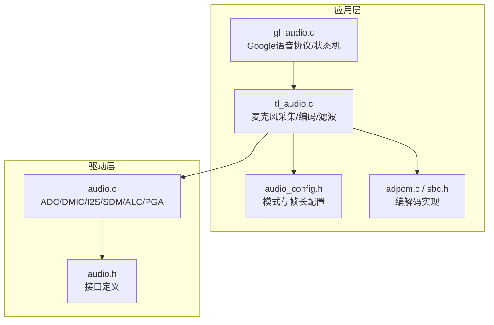
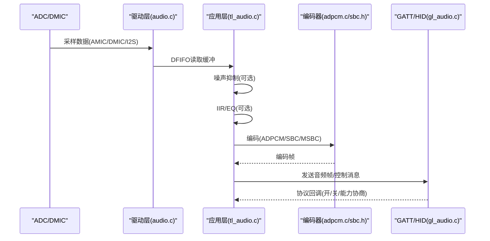
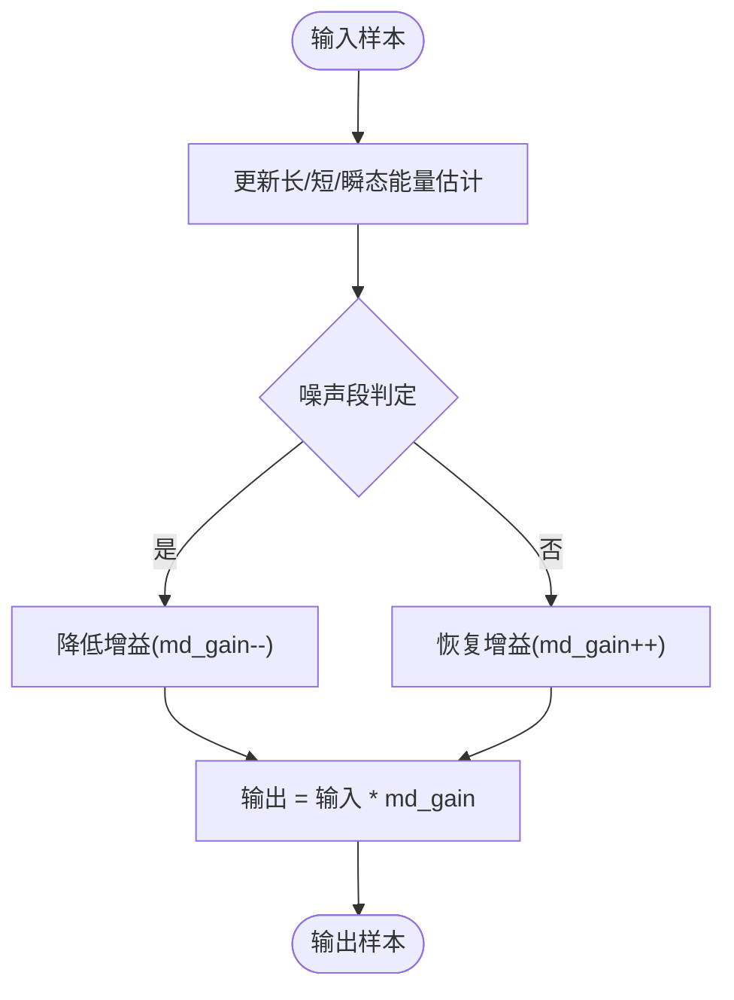
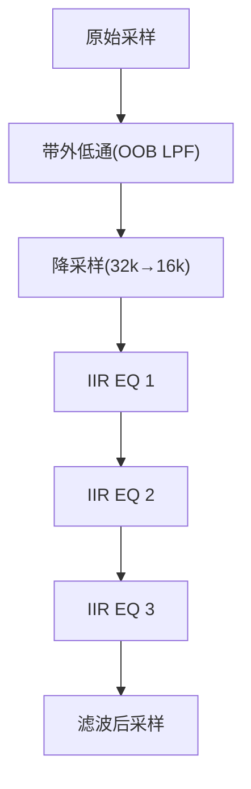
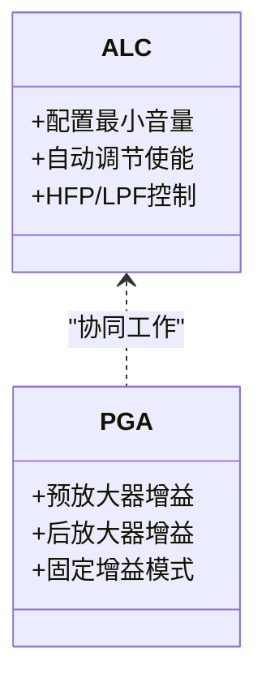
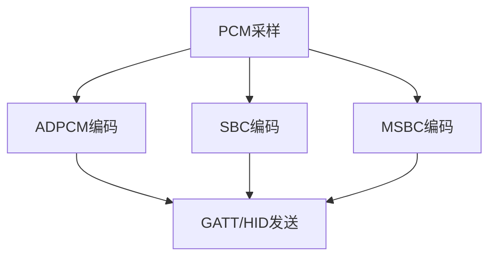
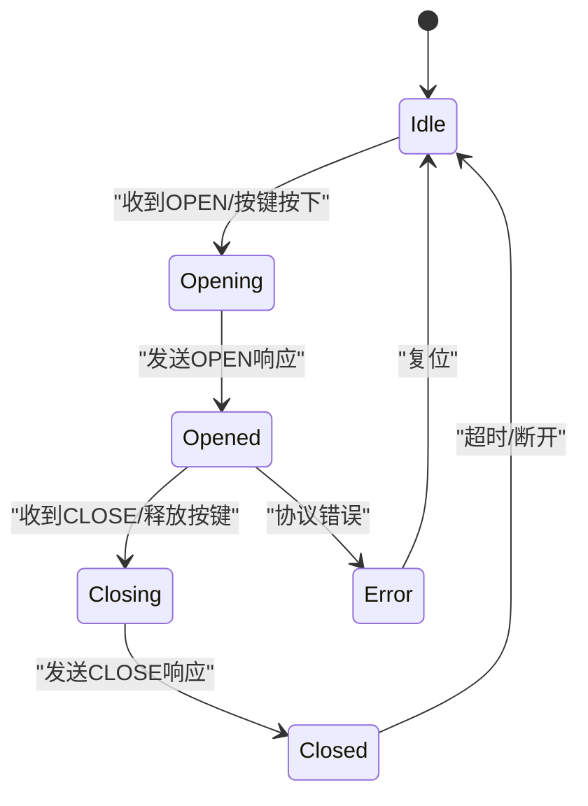
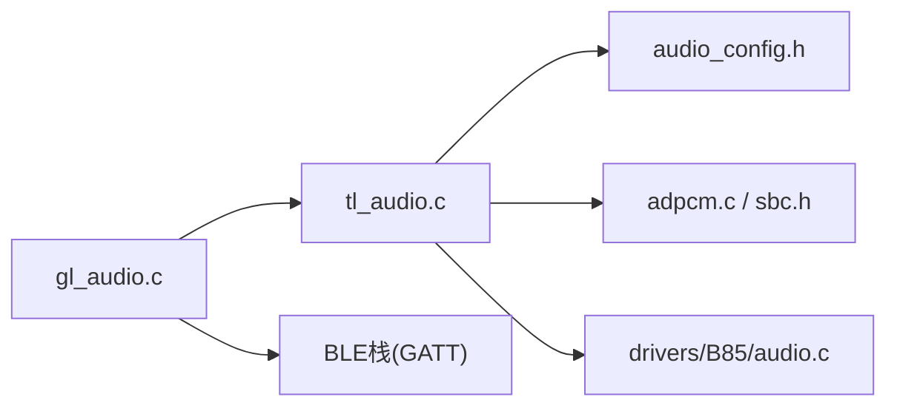

# 音频质量控制

<cite>
**本文引用的文件**
- [tl_audio.c](file://tc_ble_single_sdk/application/audio/tl_audio.c)
- [tl_audio.h](file://tc_ble_single_sdk/application/audio/tl_audio.h)
- [gl_audio.c](file://tc_ble_single_sdk/application/audio/gl_audio.c)
- [gl_audio.h](file://tc_ble_single_sdk/application/audio/gl_audio.h)
- [audio_config.h](file://tc_ble_single_sdk/application/audio/audio_config.h)
- [adpcm.c](file://tc_ble_single_sdk/application/audio/adpcm.c)
- [sbc.h](file://tc_ble_single_sdk/application/audio/sbc.h)
- [audio.c](file://tc_ble_single_sdk/drivers/B85/audio.c)
- [audio.h](file://tc_ble_single_sdk/drivers/B85/audio.h)
</cite>

## 目录
1. [简介](#简介)
2. [项目结构](#项目结构)
3. [核心组件](#核心组件)
4. [架构总览](#架构总览)
5. [详细组件分析](#详细组件分析)
6. [依赖关系分析](#依赖关系分析)
7. [性能与延迟优化](#性能与延迟优化)
8. [质量评估与实时监控](#质量评估与实时监控)
9. [环境自适应与调优策略](#环境自适应与调优策略)
10. [测试方法与调优指南](#测试方法与调优指南)
11. [常见问题诊断与解决](#常见问题诊断与解决)
12. [结论](#结论)

## 简介
本文件面向在嵌入式蓝牙鼠标/遥控器平台上实现高质量语音采集与传输的工程师，系统性阐述噪声抑制、自动增益控制（AGC）、编解码流水线、延迟与抖动控制、质量评估与监控、以及在不同使用场景下的自适应优化策略。文档基于代码库中的实际实现进行解读，并提供可操作的调优建议与故障排查指引。

## 项目结构
该SDK将音频功能分为应用层与驱动层：
- 应用层（application/audio）：负责音频模式配置、编码流程（ADPCM/SBC/MSBC）、Google语音协议交互、噪声抑制开关与IIR滤波管线集成。
- 驱动层（drivers/B85）：负责ADC/DMIC/I2S/SDM等硬件初始化、ALC/HPF/LPF、PGA增益、DFIFO数据通路、USB输出等底层能力。

**图表来源**
- [tl_audio.c:323-751](file://tc_ble_single_sdk/application/audio/tl_audio.c#L323-L751)
- [gl_audio.c:30-356](file://tc_ble_single_sdk/application/audio/gl_audio.c#L30-L356)
- [audio_config.h:28-123](file://tc_ble_single_sdk/application/audio/audio_config.h#L28-L123)
- [adpcm.c:29-521](file://tc_ble_single_sdk/application/audio/adpcm.c#L29-L521)
- [audio.c:92-405](file://tc_ble_single_sdk/drivers/B85/audio.c#L92-L405)
- [audio.h:131-168](file://tc_ble_single_sdk/drivers/B85/audio.h#L131-L168)

**章节来源**
- [tl_audio.c:323-751](file://tc_ble_single_sdk/application/audio/tl_audio.c#L323-L751)
- [gl_audio.c:30-356](file://tc_ble_single_sdk/application/audio/gl_audio.c#L30-L356)
- [audio_config.h:28-123](file://tc_ble_single_sdk/application/audio/audio_config.h#L28-L123)
- [adpcm.c:29-521](file://tc_ble_single_sdk/application/audio/adpcm.c#L29-L521)
- [audio.c:92-405](file://tc_ble_single_sdk/drivers/B85/audio.c#L92-L405)
- [audio.h:131-168](file://tc_ble_single_sdk/drivers/B85/audio.h#L131-L168)

## 核心组件
- 噪声抑制（NS）：在采样后对每帧数据进行幅度阈值判断与动态增益调整，抑制静音段噪声。
- IIR滤波与EQ：支持带外低通与内带多段均衡，提升语音清晰度并抑制带外噪声。
- 自动增益控制（ALC/PGA）：通过数字ALC与模拟PGA组合，稳定输入电平，避免削波或过小信号。
- 编解码器：ADPCM（Telink/Google/HID）、SBC/MSBC，适配不同协议与带宽需求。
- Google语音协议：按键触发、能力协商、超时控制、流ID管理。
- DFIFO与DMA：保证低延迟、稳定的音频数据搬运。

**章节来源**
- [tl_audio.h:66-105](file://tc_ble_single_sdk/application/audio/tl_audio.h#L66-L105)
- [tl_audio.c:52-178](file://tc_ble_single_sdk/application/audio/tl_audio.c#L52-L178)
- [audio.c:175-216](file://tc_ble_single_sdk/drivers/B85/audio.c#L175-L216)
- [adpcm.c:29-521](file://tc_ble_single_sdk/application/audio/adpcm.c#L29-L521)
- [gl_audio.c:30-356](file://tc_ble_single_sdk/application/audio/gl_audio.c#L30-L356)

## 架构总览
音频采集链路从ADC/DMIC进入，经ALC/HF/LPF与可选IIR/EQ处理，再进入编码器（ADPCM/SBC/MSBC），最后通过BLE GATT/HID上报。Google语音协议在应用层协调开启/关闭、能力协商与超时。

**图表来源**
- [tl_audio.c:323-751](file://tc_ble_single_sdk/application/audio/tl_audio.c#L323-L751)
- [adpcm.c:29-521](file://tc_ble_single_sdk/application/audio/adpcm.c#L29-L521)
- [gl_audio.c:30-356](file://tc_ble_single_sdk/application/audio/gl_audio.c#L30-L356)
- [audio.c:92-405](file://tc_ble_single_sdk/drivers/B85/audio.c#L92-L405)

## 详细组件分析

### 噪声抑制算法（NS）
- 位置与启用：在每种模式的proc_mic_encoder中，若启用TL_NOISE_SUPPRESSION_ENABLE，则对每帧样本调用noise_suppression。
- 算法要点：
  - 维护长期/短期/瞬时能量估计（md_long/md_short/md_im）。
  - 根据阈值判定是否处于噪声段（md_noise标志）。
  - 在噪声段降低增益（md_gain递减），在语音段恢复增益，最终对样本乘以动态增益。
- 复杂度：每样本O(1)，适合实时处理。
- 注意事项：阈值与时间常数需按环境校准；过强抑制会引入“呼吸效应”或吞音。

**图表来源**
- [tl_audio.h:66-105](file://tc_ble_single_sdk/application/audio/tl_audio.h#L66-L105)
- [tl_audio.c:346-351](file://tc_ble_single_sdk/application/audio/tl_audio.c#L346-L351)

**章节来源**
- [tl_audio.h:66-105](file://tc_ble_single_sdk/application/audio/tl_audio.h#L66-L105)
- [tl_audio.c:346-351](file://tc_ble_single_sdk/application/audio/tl_audio.c#L346-L351)

### IIR滤波与EQ
- 带外低通（OOB LPF）：用于抑制高频噪声，系数与移位量可从Flash加载。
- 内带多段EQ：三段IIR滤波器，参数同样可配置，用于语音频段增强与平坦化。
- 处理路径：在编码前对缓冲数据进行滤波，支持半采样率转换（32k→16k）以匹配编码需求。
- 关键点：系数精度与移位量影响数值稳定性与动态范围；需避免溢出与量化噪声。

**图表来源**
- [tl_audio.c:86-178](file://tc_ble_single_sdk/application/audio/tl_audio.c#L86-L178)
- [tl_audio.c:354-403](file://tc_ble_single_sdk/application/audio/tl_audio.c#L354-L403)

**章节来源**
- [tl_audio.c:86-178](file://tc_ble_single_sdk/application/audio/tl_audio.c#L86-L178)
- [tl_audio.c:354-403](file://tc_ble_single_sdk/application/audio/tl_audio.c#L354-L403)

### 自动增益控制（ALC/PGA）
- 数字ALC：通过寄存器配置最小音量、自动调节使能、HFP/LPF控制，确保输入电平稳定。
- 模拟PGA：设置前后级增益、固定增益模式，配合ALC形成多级增益控制。
- 初始化：在AMIC/DMIC/USB/I2S等不同输入模式下分别配置ALC与PGA，确保最佳信噪比与动态范围。
- 可调项：ALC目标电平、响应速度、最大增益限制；PGA预放/后放增益。

**图表来源**
- [audio.c:175-216](file://tc_ble_single_sdk/drivers/B85/audio.c#L175-L216)
- [audio.c:288-323](file://tc_ble_single_sdk/drivers/B85/audio.c#L288-L323)
- [audio.c:332-405](file://tc_ble_single_sdk/drivers/B85/audio.c#L332-L405)

**章节来源**
- [audio.c:175-216](file://tc_ble_single_sdk/drivers/B85/audio.c#L175-L216)
- [audio.c:288-323](file://tc_ble_single_sdk/drivers/B85/audio.c#L288-L323)
- [audio.c:332-405](file://tc_ble_single_sdk/drivers/B85/audio.c#L332-L405)

### 编解码器（ADPCM/SBC/MSBC）
- ADPCM：
  - Telink/GATT/T4H/Google/HID多种封装格式，支持序列号、预测值与索引传递。
  - 压缩比高、延迟低，适合低功耗与低带宽场景。
- SBC/MSBC：
  - 提供更高音质与标准兼容性，适用于HID服务通道。
  - 通过sbc_enc/msbc_init_ctx等接口完成编码与上下文管理。
- 关键参数：帧长、包长、采样率、码率，需在audio_config.h中按模式配置。

**图表来源**
- [adpcm.c:29-521](file://tc_ble_single_sdk/application/audio/adpcm.c#L29-L521)
- [sbc.h:44-55](file://tc_ble_single_sdk/application/audio/sbc.h#L44-L55)
- [audio_config.h:28-123](file://tc_ble_single_sdk/application/audio/audio_config.h#L28-L123)

**章节来源**
- [adpcm.c:29-521](file://tc_ble_single_sdk/application/audio/adpcm.c#L29-L521)
- [sbc.h:44-55](file://tc_ble_single_sdk/application/audio/sbc.h#L44-L55)
- [audio_config.h:28-123](file://tc_ble_single_sdk/application/audio/audio_config.h#L28-L123)

### Google语音协议与状态机
- 能力协商：返回版本、支持的编解码器、帧长、交互模式（On-Request/PTT/HTT）。
- 控制流程：按键触发开启/关闭、超时保护、流ID管理、错误码上报。
- 状态机：维护按键状态、等待ACK、超时重置、模型切换。

**图表来源**
- [gl_audio.c:60-356](file://tc_ble_single_sdk/application/audio/gl_audio.c#L60-L356)
- [gl_audio.h:31-149](file://tc_ble_single_sdk/application/audio/gl_audio.h#L31-L149)

**章节来源**
- [gl_audio.c:60-356](file://tc_ble_single_sdk/application/audio/gl_audio.c#L60-L356)
- [gl_audio.h:31-149](file://tc_ble_single_sdk/application/audio/gl_audio.h#L31-L149)

## 依赖关系分析
- tl_audio.c依赖：
  - audio_config.h：决定帧长、缓冲区大小、模式选择。
  - adpcm.c/sbc.h：编码实现。
  - drivers/B85/audio.c：底层ADC/DMIC/ALC/PGA/DFIFO。
- gl_audio.c依赖：
  - BLE栈：GATT通知、超时计时、状态机。
  - tl_audio.c：麦克风开关、编码数据获取。

**图表来源**
- [tl_audio.c:24-30](file://tc_ble_single_sdk/application/audio/tl_audio.c#L24-L30)
- [gl_audio.c:24-33](file://tc_ble_single_sdk/application/audio/gl_audio.c#L24-L33)
- [audio_config.h:28-123](file://tc_ble_single_sdk/application/audio/audio_config.h#L28-L123)
- [adpcm.c:24-28](file://tc_ble_single_sdk/application/audio/adpcm.c#L24-L28)
- [audio.c:24-31](file://tc_ble_single_sdk/drivers/B85/audio.c#L24-L31)

**章节来源**
- [tl_audio.c:24-30](file://tc_ble_single_sdk/application/audio/tl_audio.c#L24-L30)
- [gl_audio.c:24-33](file://tc_ble_single_sdk/application/audio/gl_audio.c#L24-L33)
- [audio_config.h:28-123](file://tc_ble_single_sdk/application/audio/audio_config.h#L28-L123)
- [adpcm.c:24-28](file://tc_ble_single_sdk/application/audio/adpcm.c#L24-L28)
- [audio.c:24-31](file://tc_ble_single_sdk/drivers/B85/audio.c#L24-L31)

## 性能与延迟优化
- 缓冲区与包大小：
  - TL_MIC_BUFFER_SIZE、ADPCM_PACKET_LEN、MIC_SHORT_DEC_SIZE直接影响吞吐与延迟。
  - 小帧长降低延迟但增加协议开销；大帧长提高压缩效率但增加时延。
- 编码选择：
  - ADPCM：更低CPU占用与延迟，适合低功耗设备。
  - SBC/MSBC：更高音质，适合对音质要求高的场景。
- 滤波与降采样：
  - 合理配置IIR/EQ与32k→16k降采样，减少计算量同时保持语音质量。
- DFIFO与DMA：
  - 启用双缓冲与中断，避免丢帧与卡顿。
- 功耗与实时性：
  - 在噪声段降低处理强度（如跳过复杂EQ），在语音段启用完整处理链。

[本节为通用指导，不直接分析具体文件]

## 质量评估与实时监控
- 指标建议：
  - 信噪比（SNR）：衡量噪声抑制效果。
  - 总谐波失真（THD）：评估线性度与削波情况。
  - 平均响度与峰值：监控ALC/PGA增益是否合适。
  - 丢帧率与重传率：评估链路稳定性。
  - 端到端延迟：测量从采样到接收的时间。
- 监控方法：
  - 在应用层统计编码前后能量变化，估算动态范围与压缩比。
  - 通过GATT特性上报状态（如打开/关闭原因、错误码），辅助定位问题。
  - 利用定时器检测超时与异常退出，记录日志。

[本节为通用指导，不直接分析具体文件]

## 环境自适应与调优策略
- 安静环境：
  - 降低NS强度，避免吞音；适当提升EQ中频增益增强语音清晰度。
  - 降低PGA预放增益，避免底噪放大。
- 嘈杂环境：
  - 提高NS阈值与衰减深度，抑制背景噪声；启用带外低通。
  - 适度提升ALC目标电平，确保语音突出。
- 远场拾音：
  - 增大PGA预放增益，结合ALC稳定电平；启用多段EQ补偿房间反射。
- 近场拾音：
  - 降低PGA增益，避免过载；NS阈值提高，防止误判。
- 自适应调节：
  - 基于能量估计（md_long/md_short）动态切换NS与EQ强度。
  - 根据链路质量（丢包/延迟）调整帧长与编码类型。

[本节为通用指导，不直接分析具体文件]

## 测试方法与调优指南
- 基准测试：
  - 使用标准声源（粉红噪声、白噪声、语音片段）测量SNR与THD。
  - 在不同距离与角度下测试拾音效果，记录增益与噪声水平。
- 压力测试：
  - 长时间运行验证ALC稳定性与NS鲁棒性。
  - 高负载下观察CPU占用与丢帧情况。
- 调优步骤：
  - 先调ALC/PGA，确保无削波且电平稳定。
  - 再调NS阈值与衰减，平衡噪声抑制与语音自然度。
  - 最后调EQ，优化语音清晰度与听感。
- 工具建议：
  - 频谱分析仪、示波器、音频分析软件（如Audacity、MATLAB）。
  - 抓包工具分析GATT/HID报文，检查协议交互与错误码。

[本节为通用指导，不直接分析具体文件]

## 常见问题诊断与解决
- 声音过小或过大：
  - 检查ALC最小音量与PGA预放/后放增益；确认手动音量设置未越界。
  - 参考Audio_VolumeSet与reg_aud_alc_vol_l_chn配置。
- 噪声抑制过度导致断断续续：
  - 降低NS阈值或减小衰减深度；延长恢复时间常数。
- 语音发闷或刺耳：
  - 调整IIR/EQ系数与移位量；检查带外低通截止频率。
- 编码卡顿或丢帧：
  - 增大TL_MIC_BUFFER_SIZE或减小帧长；检查DFIFO中断与DMA配置。
- Google语音协议异常：
  - 检查能力协商返回值、超时处理与流ID管理；确认按键事件与状态机流转。

**章节来源**
- [tl_audio.c:180-196](file://tc_ble_single_sdk/application/audio/tl_audio.c#L180-L196)
- [tl_audio.c:226-318](file://tc_ble_single_sdk/application/audio/tl_audio.c#L226-L318)
- [tl_audio.h:66-105](file://tc_ble_single_sdk/application/audio/tl_audio.h#L66-L105)
- [gl_audio.c:185-356](file://tc_ble_single_sdk/application/audio/gl_audio.c#L185-L356)

## 结论
该SDK提供了完整的音频质量控制方案，涵盖噪声抑制、IIR/EQ、ALC/PGA、多格式编解码与Google语音协议。通过合理配置与调优，可在不同环境下获得稳定、清晰、低延迟的语音体验。建议在开发过程中结合质量评估与实时监控，持续优化参数，确保产品在各种使用场景中表现一致。

[本节为总结性内容，不直接分析具体文件]