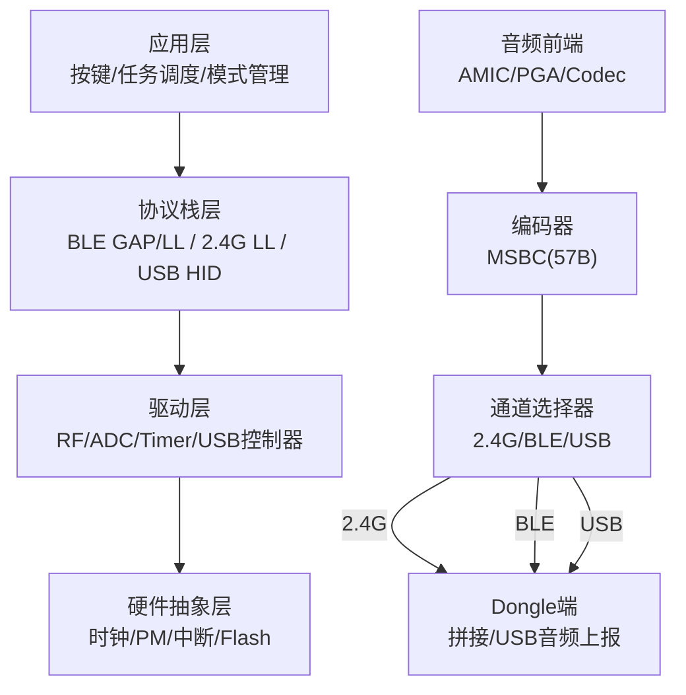
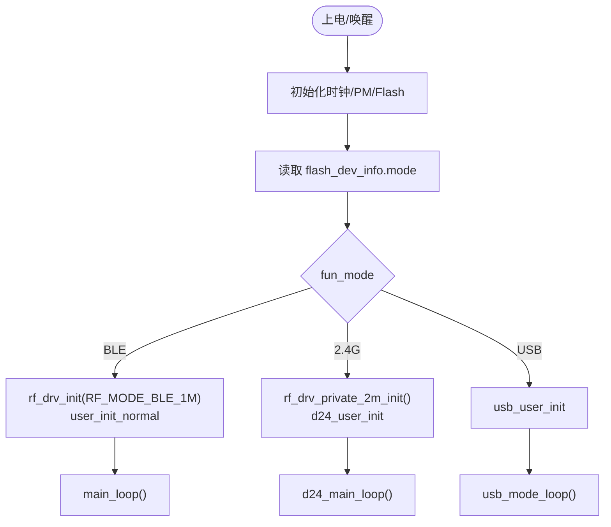
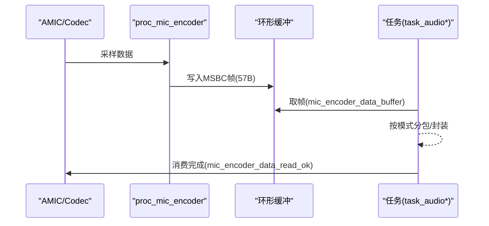
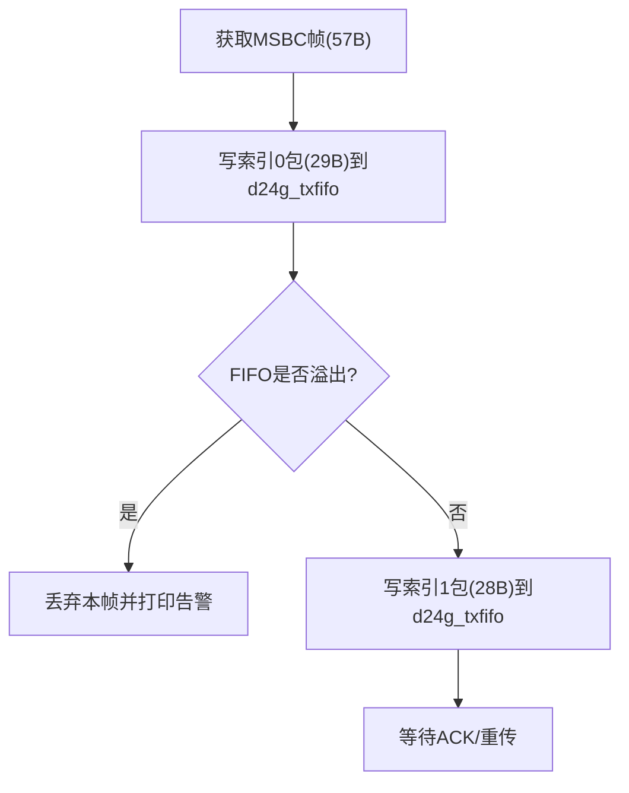
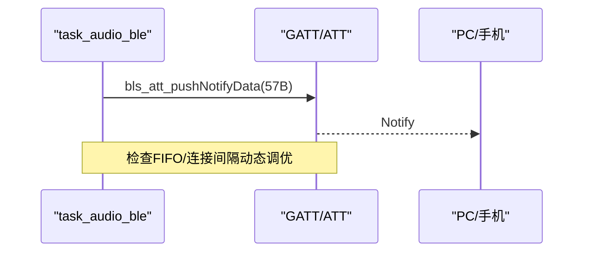
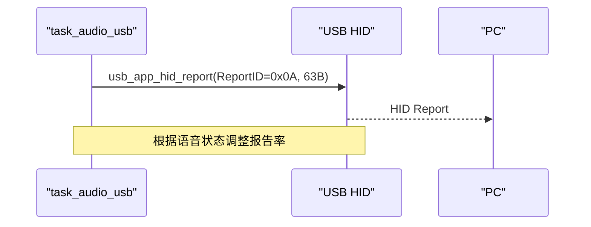
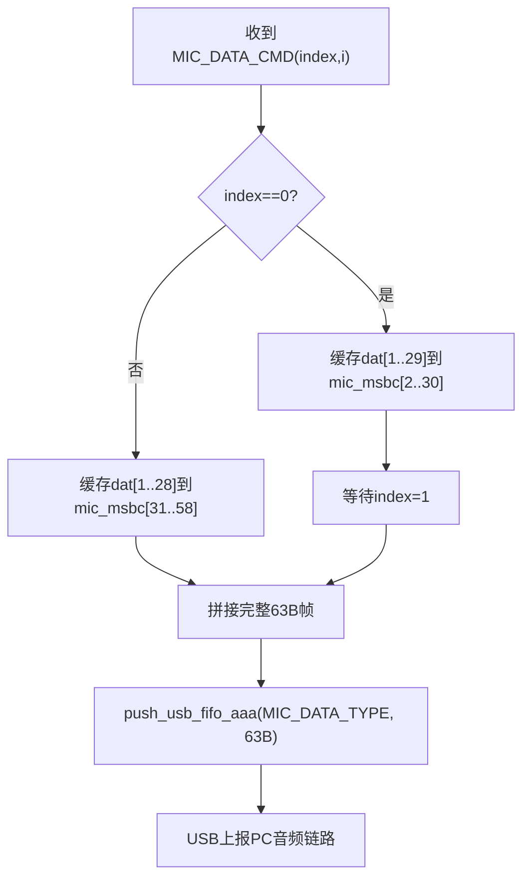
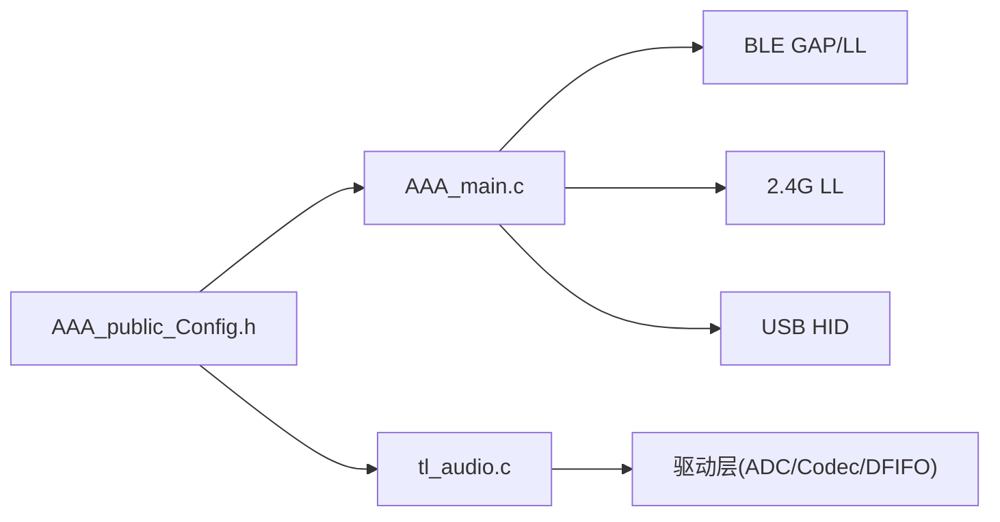

# 架构设计

<cite>
**本文引用的文件**
- [README.md](file://README.md)
- [telink_b85m_triple_mode_audio_mouse_sdk_Release_Note .md](file://telink_b85m_triple_mode_audio_mouse_sdk_Release_Note .md)
- [SDK_Wiki.md](file://doc/SDK_Wiki.md)
- [AAA_main.c](file://tc_ble_single_sdk/vendor/827x_three_mode_mouse/AAA_main.c)
- [AAA_public_Config.h](file://tc_ble_single_sdk/vendor/827x_three_mode_mouse/AAA_public_Config.h)
- [tl_audio.c](file://tc_ble_single_sdk/application/audio/tl_audio.c)
- [usb.h](file://tc_ble_single_sdk/application/usbstd/usb.h)
- [USBController.h](file://tc_ble_single_sdk/application/usbstd/USBController.h)
- [gap.h](file://tc_ble_single_sdk/stack/ble/host/gap/gap.h)
- [ll_conn.h](file://tc_ble_single_sdk/stack/ble/controller/ll/ll_conn/ll_conn.h)
- [ll_adv.h](file://tc_ble_single_sdk/stack/ble/controller/ll/ll_adv.h)
- [audio_config.h](file://tc_ble_single_sdk/application/audio/audio_config.h)
- [tl_audio.h](file://tc_ble_single_sdk/application/audio/tl_audio.h)
</cite>

## 目录
1. [简介](#简介)
2. [项目结构](#项目结构)
3. [核心组件](#核心组件)
4. [架构总览](#架构总览)
5. [详细组件分析](#详细组件分析)
6. [依赖关系分析](#依赖关系分析)
7. [性能考量](#性能考量)
8. [故障排查指南](#故障排查指南)
9. [结论](#结论)
10. [附录](#附录)

## 简介
本架构设计文档面向 Telink B85m 三模音频鼠标 SDK（V0.2.6），围绕“应用层—协议栈层—驱动层—硬件抽象层”的分层职责，系统阐述 BLE、2.4G、USB 三种连接模式的管理与切换机制，并给出系统架构图、数据流图与组件交互图。文档同时总结关键设计决策与技术选型原因，为不同层次开发者提供扩展指导。

## 项目结构
仓库由三大主体构成：
- 三模音频鼠标工程（B85/B87）：位于 tc_ble_single_sdk/vendor/827x_three_mode_mouse，实现 2.4G + BLE + USB 三模音频鼠标应用。
- Dongle 工程（B80）：位于 8373_dongle_for_km/demo/vendor/eaglet_dongle_Demo，负责 2.4G 接收转发与 USB Audio/HID 上报。
- BLE 协议栈与通用组件：位于 tc_ble_single_sdk，包含 BLE 协议栈、音频编解码（ADPCM/SBC/MSBC）、USB 标准类与驱动。

```mermaid
graph TB
subgraph "鼠标端(B85/B87)"
A["应用层<br/>AAA_main.c / AAA_public_Config.h"]
B["协议栈层<br/>BLE(GAP/LL) / 2.4G私有链路"]
C["驱动层<br/>USB HID/Audio / RF / GPIO / ADC / Timer"]
D["硬件抽象层<br/>时钟/PM/Flash/中断"]
end
subgraph "Dongle端(B80)"
E["应用层<br/>dongle app.c"]
F["协议栈层<br/>2.4G链路 / USB主机侧处理"]
G["驱动层<br/>USB设备类 / RF"]
H["硬件抽象层<br/>平台SDK PM/Flash等"]
end
A --> B --> C --> D
E --> F --> G --> H
B < --> F
```

图表来源
- [AAA_main.c:335-558](file://tc_ble_single_sdk/vendor/827x_three_mode_mouse/AAA_main.c#L335-L558)
- [SDK_Wiki.md:100-115](file://doc/SDK_Wiki.md#L100-L115)

章节来源
- [README.md:1-231](file://README.md#L1-L231)
- [SDK_Wiki.md:10-21](file://doc/SDK_Wiki.md#L10-L21)

## 核心组件
- 三模连接管理：基于 fun_mode 在 BLE(1M)、2.4G(2M)、USB 之间切换；主循环按模式分发到 main_loop/d24_main_loop/usb_mode_loop。
- 音频采集与编码：AMIC 输入，经 PGA/Codec 放大后进入 MSBC 编码器，输出每帧 57 字节，按当前模式分包上报。
- 上报通道：
  - 2.4G：MIC_DATA_CMD 分包（29B+28B），带索引与 ACK，FIFO 保护防堵塞。
  - BLE：自定义服务 Notify 57B，MTU 交换与连接间隔动态 UI 间隔。
  - USB：HID 上报 63B（含头），报告率自适应（开语音降频）。
- Dongle 拼接与转发：按索引拼接完整 57B 帧，push_usb_fifo_aaa 后经 USB 上报 PC。

章节来源
- [AAA_main.c:335-558](file://tc_ble_single_sdk/vendor/827x_three_mode_mouse/AAA_main.c#L335-L558)
- [SDK_Wiki.md:100-180](file://doc/SDK_Wiki.md#L100-L180)
- [tl_audio.c:430-561](file://tc_ble_single_sdk/application/audio/tl_audio.c#L430-L561)
- [audio_config.h:74-122](file://tc_ble_single_sdk/application/audio/audio_config.h#L74-L122)

## 架构总览
分层职责与数据流如下：



图表来源
- [AAA_main.c:335-558](file://tc_ble_single_sdk/vendor/827x_three_mode_mouse/AAA_main.c#L335-L558)
- [SDK_Wiki.md:100-180](file://doc/SDK_Wiki.md#L100-L180)

## 详细组件分析

### 三模连接管理与模式切换
- 初始化与入口：main() 根据 fun_mode 选择 BLE/2.4G/USB 的初始化与主循环。
- 中断分发：统一 irq_handler 根据 fun_mode 路由到 2.4G/蓝牙/USB 中断处理。
- 模式持久化：flash_dev_info.mode 保存当前模式，支持底部开关/USB插入检测触发切换。



图表来源
- [AAA_main.c:335-558](file://tc_ble_single_sdk/vendor/827x_three_mode_mouse/AAA_main.c#L335-L558)

章节来源
- [AAA_main.c:335-558](file://tc_ble_single_sdk/vendor/827x_three_mode_mouse/AAA_main.c#L335-L558)
- [AAA_public_Config.h:181-225](file://tc_ble_single_sdk/vendor/827x_three_mode_mouse/AAA_public_Config.h#L181-L225)

### 音频采集与编码流水线
- 采集路径：AMIC 差分输入 → PGA/Codec 放大 → 采样缓冲。
- 编码路径：proc_mic_encoder 将 PCM 转换为 MSBC 帧（57B），写入环形缓冲。
- 取包接口：mic_encoder_data_buffer 返回待发送帧指针，上层消费后调用 mic_encoder_data_read_ok 推进读指针。



图表来源
- [tl_audio.c:430-561](file://tc_ble_single_sdk/application/audio/tl_audio.c#L430-L561)
- [tl_audio.h:112-118](file://tc_ble_single_sdk/application/audio/tl_audio.h#L112-L118)

章节来源
- [tl_audio.c:430-561](file://tc_ble_single_sdk/application/audio/tl_audio.c#L430-L561)
- [tl_audio.h:112-118](file://tc_ble_single_sdk/application/audio/tl_audio.h#L112-L118)

### 2.4G 模式音频上报流程
- 分包策略：57B 拆分为两包（索引 0: 29B，索引 1: 28B），命令码 MIC_DATA_CMD，ACK 为 MIC_DATA_CMD_ACK。
- FIFO 保护：当 d24g_txfifo 中音频包超过阈值时丢弃本帧，防止阻塞。
- 报告率协同：开语音降低报告率，保障带宽。



图表来源
- [SDK_Wiki.md:143-151](file://doc/SDK_Wiki.md#L143-L151)

章节来源
- [SDK_Wiki.md:143-151](file://doc/SDK_Wiki.md#L143-L151)

### BLE 模式音频上报流程
- 上报接口：bls_att_pushNotifyData(MY_DATA_INPUT_DP_H, p_ble_mic, 57)。
- 服务定义：自定义数据服务特征值承载语音数据；ATT 表保留 Telink Audio Service。
- 流控：发送前判断 FIFO 剩余空间，UI 通知间隔随连接间隔动态调整；开启语音时执行 MTU size exchange。



图表来源
- [SDK_Wiki.md:153-163](file://doc/SDK_Wiki.md#L153-L163)
- [ll_conn.h:43-68](file://tc_ble_single_sdk/stack/ble/controller/ll/ll_conn/ll_conn.h#L43-L68)

章节来源
- [SDK_Wiki.md:153-163](file://doc/SDK_Wiki.md#L153-L163)
- [ll_conn.h:43-68](file://tc_ble_single_sdk/stack/ble/controller/ll/ll_conn/ll_conn.h#L43-L68)

### USB 模式音频上报流程
- 上报接口：usb_app_hid_report(0x0A, msbc_data, 63)，通过专用端点发送。
- 报告率策略：关语音 1 kHz，开语音 500 Hz。
- 设备形态：枚举为复合设备（HID + Audio），描述符在 AAA_usb_desc.c 中配置。



图表来源
- [SDK_Wiki.md:165-170](file://doc/SDK_Wiki.md#L165-L170)
- [usb.h:33-41](file://tc_ble_single_sdk/application/usbstd/usb.h#L33-L41)

章节来源
- [SDK_Wiki.md:165-170](file://doc/SDK_Wiki.md#L165-L170)
- [usb.h:33-41](file://tc_ble_single_sdk/application/usbstd/usb.h#L33-L41)

### Dongle 端音频接收与转发
- 接收分支：MIC_DATA_CMD 分支解析索引，缓存第一/第二包。
- 拼接逻辑：索引 0 缓存 dat[1..29]，索引 1 缓存 dat[1..28]，随后 push_usb_fifo_aaa(MIC_DATA_TYPE, mic_msbc, 63)。
- 帧格式：mic_msbc[63] = {1, 57, 0, 0}，与鼠标端一致。
- 独立 FIFO：避免 mouse 数据堵塞影响 Linux 系统开语音工作。



图表来源
- [SDK_Wiki.md:172-180](file://doc/SDK_Wiki.md#L172-L180)

章节来源
- [SDK_Wiki.md:172-180](file://doc/SDK_Wiki.md#L172-L180)

### 关键设计决策与技术选型
- 编码格式：从 ADPCM 演进至 MSBC，提升音质与兼容性（V0.2.0/V0.2.6 引入与正式启用）。
- 上报通道：
  - 2.4G 分包 + 索引 + ACK，保证可靠性与低延迟。
  - BLE 使用自定义服务 Notify，结合 MTU 交换与连接间隔动态调优，解决 macOS 画线卡顿问题。
  - USB HID 直接上报，便于测试与兼容。
- 报告率自适应：开语音降低报告率，平衡鼠标移动与音频带宽。
- 电量自适应控制：按电量限制单次开麦时长，超时自动关闭麦克风，延长续航。

章节来源
- [telink_b85m_triple_mode_audio_mouse_sdk_Release_Note .md:21-45](file://telink_b85m_triple_mode_audio_mouse_sdk_Release_Note .md#L21-L45)
- [SDK_Wiki.md:182-192](file://doc/SDK_Wiki.md#L182-L192)

## 依赖关系分析
- 应用层依赖协议栈：AAA_main.c 调用 BLE/2.4G/USB 初始化与主循环。
- 协议栈依赖驱动：BLE GAP/LL、2.4G LL、USB HID 均依赖底层 RF/USB 控制器。
- 音频模块依赖驱动：tl_audio.c 依赖 ADC/Codec/DFIFO 等驱动。
- 配置宏集中：AAA_public_Config.h 统一定义音频模式、键位、FIFO 大小等。



图表来源
- [AAA_main.c:335-558](file://tc_ble_single_sdk/vendor/827x_three_mode_mouse/AAA_main.c#L335-L558)
- [tl_audio.c:430-561](file://tc_ble_single_sdk/application/audio/tl_audio.c#L430-L561)
- [AAA_public_Config.h:50-73](file://tc_ble_single_sdk/vendor/827x_three_mode_mouse/AAA_public_Config.h#L50-L73)

章节来源
- [AAA_main.c:335-558](file://tc_ble_single_sdk/vendor/827x_three_mode_mouse/AAA_main.c#L335-L558)
- [AAA_public_Config.h:50-73](file://tc_ble_single_sdk/vendor/827x_three_mode_mouse/AAA_public_Config.h#L50-L73)

## 性能考量
- 音频带宽与报告率：开语音时降低鼠标报告率，避免丢包与卡顿。
- FIFO 保护：2.4G 音频 FIFO 上限保护，防止堵塞导致系统异常。
- BLE 流控：根据连接间隔动态调整 UI 通知间隔，减少拥塞。
- 低功耗：2.4G 模式增加低功耗处理；USB/BLE 模式在睡眠/唤醒场景优化。

章节来源
- [SDK_Wiki.md:143-170](file://doc/SDK_Wiki.md#L143-L170)
- [telink_b85m_triple_mode_audio_mouse_sdk_Release_Note .md:21-45](file://telink_b85m_triple_mode_audio_mouse_sdk_Release_Note .md#L21-L45)

## 故障排查指南
- 语音模式下画线异常：检查报告率设置与 FIFO 保护逻辑，确认分包与索引是否正确。
- BLE 模式无法使用：确认自定义服务 Notify 是否成功，MTU 交换是否完成。
- USB 模式无法睡眠/唤醒：检查 USB 报告率与系统电源管理交互。
- Dongle 端异常：确认索引拼接逻辑与独立 FIFO 是否生效。

章节来源
- [telink_b85m_triple_mode_audio_mouse_sdk_Release_Note .md:21-45](file://telink_b85m_triple_mode_audio_mouse_sdk_Release_Note .md#L21-L45)
- [SDK_Wiki.md:143-180](file://doc/SDK_Wiki.md#L143-L180)

## 结论
本 SDK 采用清晰的分层架构，将应用、协议栈、驱动与硬件抽象解耦，支撑 BLE/2.4G/USB 三模连接与音频实时传输。通过分包索引、FIFO 保护、报告率自适应与电量自适应控制，实现了高可靠、低延迟与长续航的音频鼠标体验。后续扩展可聚焦于新编码格式接入、多设备并发与跨平台兼容性优化。

## 附录
- 版本信息：SDK V0.2.6，BLE SDK V3.4.2.8，Platform SDK V3.3.0。
- 芯片：Dongle B80(TLSR8373)，Mouse B85(TLSR825X)。
- 关键宏：TL_AUDIO_MODE=TL_AUDIO_RCU_MSBC_HID，APP_24G_AUDIO_EN 开启音频功能。

章节来源
- [telink_b85m_triple_mode_audio_mouse_sdk_Release_Note .md:4-16](file://telink_b85m_triple_mode_audio_mouse_sdk_Release_Note .md#L4-L16)
- [AAA_public_Config.h:50-73](file://tc_ble_single_sdk/vendor/827x_three_mode_mouse/AAA_public_Config.h#L50-L73)