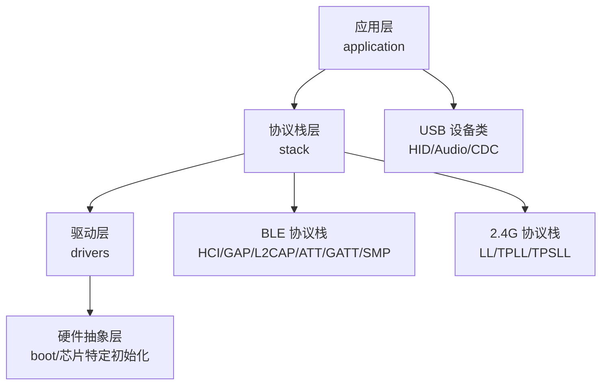
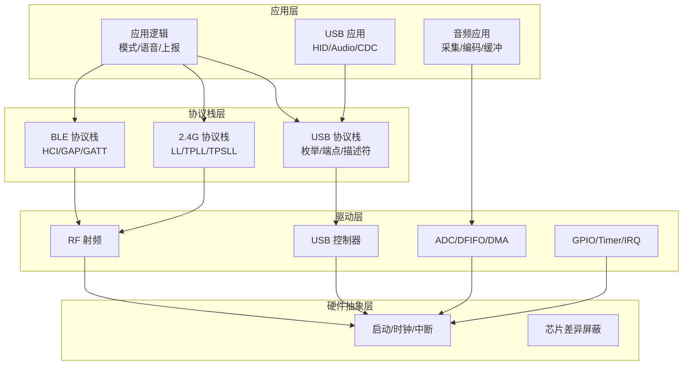
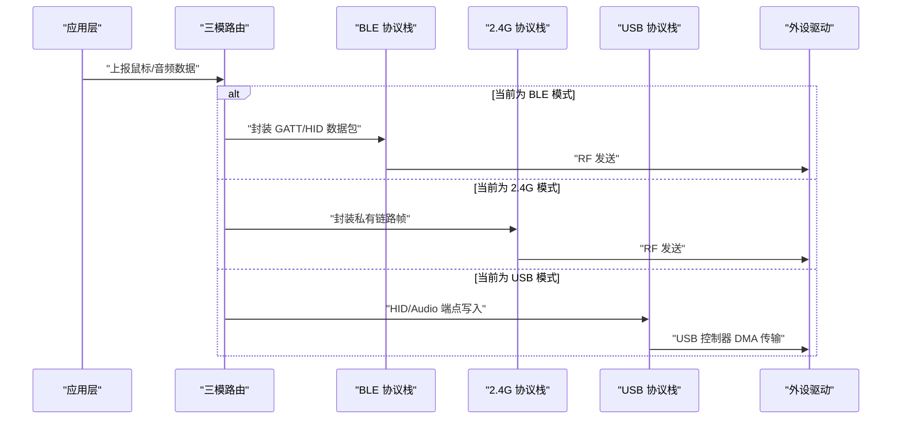
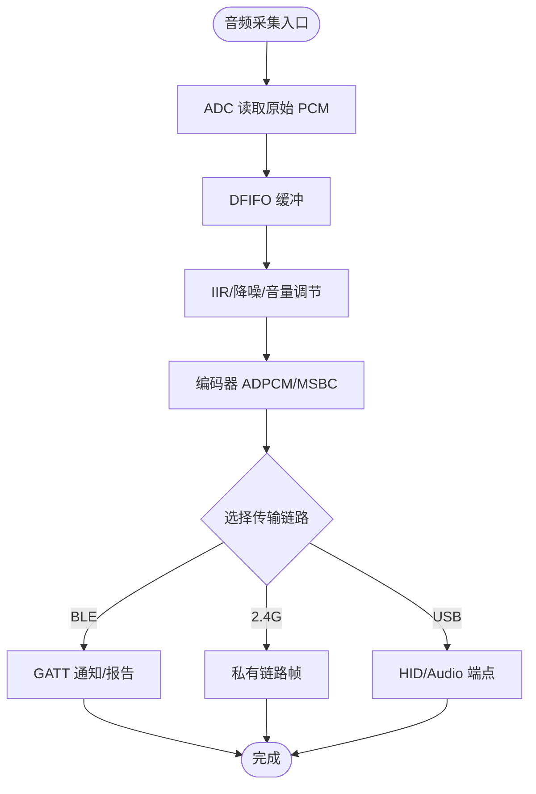
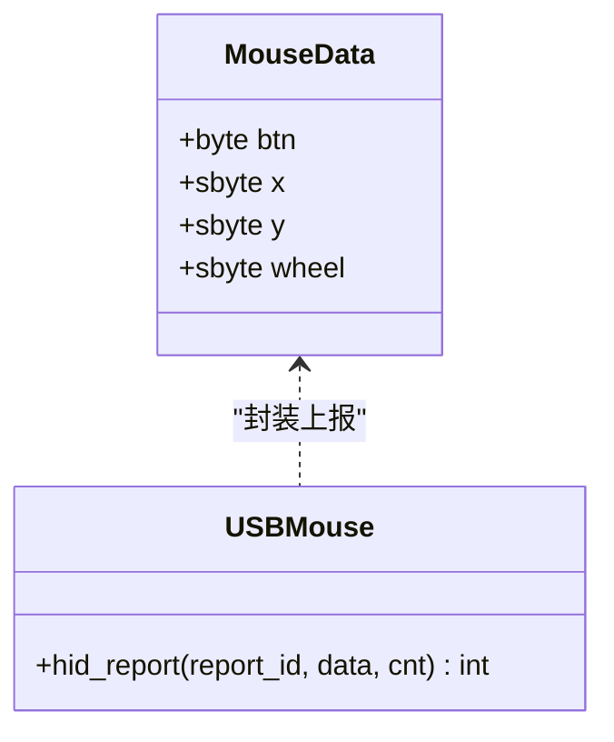
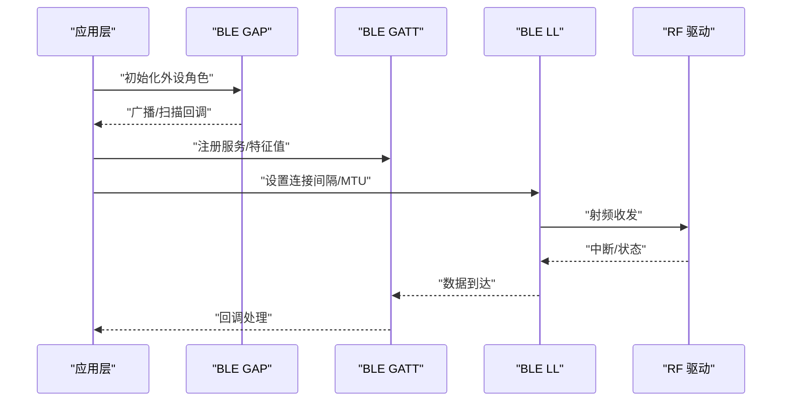
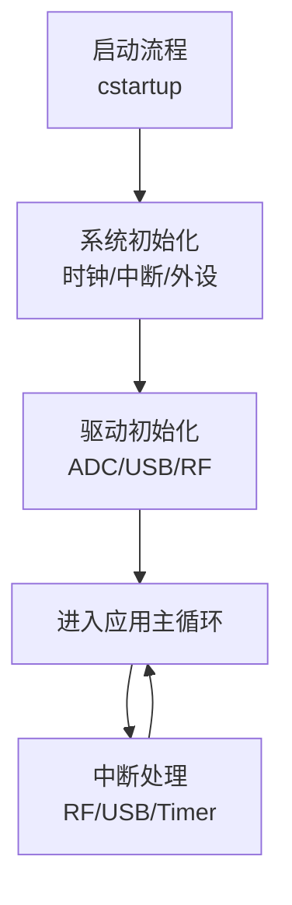

# 系统概览

<cite>
**本文引用的文件**
- [README.md](file://README.md)
- [telink_b85m_triple_mode_audio_mouse_sdk_Release_Note .md](file://telink_b85m_triple_mode_audio_mouse_sdk_Release_Note .md)
- [tl_common.h](file://c_ble_single_sdk/tl_common.h)
- [config.h](file://c_ble_single_sdk/config.h)
- [drivers.h](file://c_ble_single_sdk/drivers.h)
- [usb.h](file://c_ble_single_sdk/application/usbstd/usb.h)
- [usbmouse.h](file://c_ble_single_sdk/application/app/usbmouse.h)
- [usbaud.c](file://c_ble_single_sdk/application/app/usbaud.c)
- [tl_audio.h](file://c_ble_single_sdk/application/audio/tl_audio.h)
- [gl_audio.h](file://c_ble_single_sdk/application/audio/gl_audio.h)
- [audio.c](file://c_ble_single_sdk/drivers/TC321X/audio.c)
- [clock.c](file://c_ble_single_sdk/drivers/TC321X/clock.c)
- [cstartup_825x.S](file://c_ble_single_sdk/boot/B85/cstartup_825x.S)
- [software_uart.c](file://c_ble_single_sdk/drivers/B85/driver_ext/software_uart.c)
- [hci_cmd.h](file://c_ble_single_sdk/stack/ble/hci/hci_cmd.h)
- [ll_adv.h](file://c_ble_single_sdk/stack/ble/controller/ll/ll_adv.h)
- [gap.h](file://c_ble_single_sdk/stack/ble/host/gap/gap.h)
</cite>

## 目录
1. [简介](#简介)
2. [项目结构](#项目结构)
3. [核心组件](#核心组件)
4. [架构总览](#架构总览)
5. [详细组件分析](#详细组件分析)
6. [依赖关系分析](#依赖关系分析)
7. [性能考量](#性能考量)
8. [故障排查指南](#故障排查指南)
9. [结论](#结论)
10. [附录](#附录)

## 简介
本系统为基于 Telink B85m（鼠标端）与 B80（接收器/Dongle 端）的三模音频鼠标 SDK，支持 BLE、2.4G、USB 三种连接模式，并在各模式下提供鼠标 HID 与音频流传输能力。SDK 采用分层设计：应用层负责业务逻辑（按键、滚轮、语音开关、模式切换等），协议栈层封装 BLE/2.4G/USB 协议细节，驱动层对接芯片外设（ADC、DMA、DFIFO、USB、RF 等），硬件抽象层屏蔽不同 MCU 内核差异并提供统一接口。通过统一的抽象层，三模连接在数据上报、音频编码、电源管理与 OTA 等方面保持一致体验。

## 项目结构
- 顶层包含 README 与版本说明，明确芯片型号、平台与工具链信息，以及功能演进与修复记录。
- tc_ble_single_sdk 为核心 SDK，包含：
  - application：应用层（USB HID、音频处理、键盘/鼠标、打印等）
  - stack：协议栈（BLE 控制器/主机、2.4G 相关模块）
  - drivers：驱动层（按芯片系列分目录，如 B85/B87/TC321X）
  - boot：启动代码（B85/B87/TC321X）
  - common：公共类型、工具与配置
- 8373_dongle_for_km：Dongle 侧参考实现与驱动示例
- doc：链接脚本与文档

**图示来源**
- [tl_common.h:27-52](file://c_ble_single_sdk/tl_common.h#L27-L52)
- [drivers.h:24-29](file://c_ble_single_sdk/drivers.h#L24-L29)
- [usb.h:24-41](file://c_ble_single_sdk/application/usbstd/usb.h#L24-L41)
- [hci_cmd.h:471-498](file://c_ble_single_sdk/stack/ble/hci/hci_cmd.h#L471-L498)
- [ll_adv.h:137-193](file://c_ble_single_sdk/stack/ble/controller/ll/ll_adv.h#L137-L193)
- [gap.h:65-114](file://c_ble_single_sdk/stack/ble/host/gap/gap.h#L65-L114)

**章节来源**
- [README.md:1-231](file://README.md#L1-L231)
- [telink_b85m_triple_mode_audio_mouse_sdk_Release_Note .md:1-217](file://telink_b85m_triple_mode_audio_mouse_sdk_Release_Note .md#L1-L217)

## 核心组件
- 三模连接抽象
  - USB：HID（鼠标）、Audio（麦克风/扬声器）、CDC（调试/扩展）
  - BLE：GAP/GATT 服务、自定义音频通道、MTU 协商、连接间隔动态调整
  - 2.4G：私有链路层与 TPLL/TPSLL 射频控制，用于低延迟鼠标与音频透传
- 音频子系统
  - 采集：ADC + DFIFO 缓冲，IIR/降噪可选
  - 编码：ADPCM/MSBC 编解码，按模式与电量自适应报率
  - 输出：USB Audio 或 BLE 自定义服务/报告
- 输入子系统
  - 按键/滚轮扫描，CPI 检测与切换，移动唤醒
- 电源与系统
  - 时钟管理、软定时器、低功耗策略、OTA（USB/BLE）
- 工具与调试
  - 打印、EMI 测试、固件签名与校验

**章节来源**
- [tl_audio.h:32-129](file://c_ble_single_sdk/application/audio/tl_audio.h#L32-L129)
- [gl_audio.h:29-154](file://c_ble_single_sdk/application/audio/gl_audio.h#L29-L154)
- [usbaud.c:401-453](file://c_ble_single_sdk/application/app/usbaud.c#L401-L453)
- [usbmouse.h:40-51](file://c_ble_single_sdk/application/app/usbmouse.h#L40-L51)
- [clock.c:47-62](file://c_ble_single_sdk/drivers/TC321X/clock.c#L47-L62)

## 架构总览
系统采用四层架构：
- 应用层：业务编排（模式切换、语音开关、上报策略、UI/灯效）
- 协议栈层：BLE/2.4G/USB 协议实现与事件分发
- 驱动层：外设驱动（ADC、DMA、DFIFO、USB、RF、GPIO、Timer）
- 硬件抽象层：启动流程、时钟、中断、芯片差异屏蔽

**图示来源**
- [tl_common.h:27-52](file://c_ble_single_sdk/tl_common.h#L27-L52)
- [drivers.h:24-29](file://c_ble_single_sdk/drivers.h#L24-L29)
- [usb.h:24-41](file://c_ble_single_sdk/application/usbstd/usb.h#L24-L41)
- [hci_cmd.h:471-498](file://c_ble_single_sdk/stack/ble/hci/hci_cmd.h#L471-L498)
- [ll_adv.h:137-193](file://c_ble_single_sdk/stack/ble/controller/ll/ll_adv.h#L137-L193)
- [gap.h:65-114](file://c_ble_single_sdk/stack/ble/host/gap/gap.h#L65-L114)
- [audio.c:594-618](file://c_ble_single_sdk/drivers/TC321X/audio.c#L594-L618)
- [cstartup_825x.S:304-340](file://c_ble_single_sdk/boot/B85/cstartup_825x.S#L304-L340)

## 详细组件分析

### 三模连接统一抽象层
- 目标：对 BLE、2.4G、USB 三种链路进行统一抽象，向上提供一致的“上报鼠标数据”和“上报音频数据”接口，向下屏蔽协议差异。
- 关键机制：
  - 模式选择：根据硬件开关/USB 插入状态决定当前工作模式
  - 数据路由：将应用层产生的鼠标 HID 包与音频帧路由到对应协议栈
  - 资源协调：避免多模并发冲突（例如 USB 与 BLE 同时占用 CPU/RF）
  - 参数适配：针对不同链路特性调整上报率、MTU、FIFO 大小与丢包策略

**图示来源**
- [usb.h:24-41](file://c_ble_single_sdk/application/usbstd/usb.h#L24-L41)
- [hci_cmd.h:471-498](file://c_ble_single_sdk/stack/ble/hci/hci_cmd.h#L471-L498)
- [ll_adv.h:137-193](file://c_ble_single_sdk/stack/ble/controller/ll/ll_adv.h#L137-L193)
- [audio.c:594-618](file://c_ble_single_sdk/drivers/TC321X/audio.c#L594-L618)

**章节来源**
- [README.md:121-165](file://README.md#L121-L165)
- [telink_b85m_triple_mode_audio_mouse_sdk_Release_Note .md:38-42](file://telink_b85m_triple_mode_audio_mouse_sdk_Release_Note .md#L38-L42)

### 音频子系统
- 采集路径：ADC -> DFIFO -> 应用缓冲 -> 编码器（ADPCM/MSBC）
- 输出路径：编码器输出 -> 协议栈（BLE 自定义服务/报告、USB Audio、2.4G 私有通道）
- 质量控制：IIR 滤波、噪声抑制、音量控制、输入去爆音
- 自适应策略：根据电量与连接间隔动态调整采样率/报率与 FIFO 大小

**图示来源**
- [tl_audio.h:66-129](file://c_ble_single_sdk/application/audio/tl_audio.h#L66-L129)
- [gl_audio.h:29-154](file://c_ble_single_sdk/application/audio/gl_audio.h#L29-L154)
- [usbaud.c:401-453](file://c_ble_single_sdk/application/app/usbaud.c#L401-L453)
- [audio.c:594-618](file://c_ble_single_sdk/drivers/TC321X/audio.c#L594-L618)

**章节来源**
- [tl_audio.h:32-129](file://c_ble_single_sdk/application/audio/tl_audio.h#L32-L129)
- [gl_audio.h:29-154](file://c_ble_single_sdk/application/audio/gl_audio.h#L29-L154)
- [usbaud.c:401-453](file://c_ble_single_sdk/application/app/usbaud.c#L401-L453)

### 输入子系统（鼠标 HID）
- 数据采集：按键扫描、滚轮计数、传感器方向校准
- 上报策略：默认报告率与开启语音时的降频策略；多键同时上报
- 模式联动：不同模式下 HID 描述符与报告 ID 映射

**图示来源**
- [usbmouse.h:40-51](file://c_ble_single_sdk/application/app/usbmouse.h#L40-L51)

**章节来源**
- [usbmouse.h:40-51](file://c_ble_single_sdk/application/app/usbmouse.h#L40-L51)
- [README.md:107-135](file://README.md#L107-L135)

### 协议栈层（BLE/2.4G/USB）
- BLE：GAP 初始化、GATT 服务注册、SMP 配对、连接间隔与 MTU 协商
- 2.4G：TPLL/TPSLL 射频控制，链路层调度，低功耗休眠与唤醒
- USB：设备枚举、描述符管理、端点中断与 DMA 传输

**图示来源**
- [gap.h:65-114](file://c_ble_single_sdk/stack/ble/host/gap/gap.h#L65-L114)
- [hci_cmd.h:471-498](file://c_ble_single_sdk/stack/ble/hci/hci_cmd.h#L471-L498)
- [ll_adv.h:137-193](file://c_ble_single_sdk/stack/ble/controller/ll/ll_adv.h#L137-L193)

**章节来源**
- [gap.h:65-114](file://c_ble_single_sdk/stack/ble/host/gap/gap.h#L65-L114)
- [hci_cmd.h:471-498](file://c_ble_single_sdk/stack/ble/hci/hci_cmd.h#L471-L498)
- [ll_adv.h:137-193](file://c_ble_single_sdk/stack/ble/controller/ll/ll_adv.h#L137-L193)

### 驱动层与硬件抽象层
- 驱动层：ADC/DFIFO/DMA、USB 控制器、RF 射频、GPIO/Timer/IRQ
- 硬件抽象层：启动流程（清零 BSS、拷贝 Data、跳转 main）、时钟配置、中断向量表
- 软件 UART：在 RF 状态下安全发送调试信息

**图示来源**
- [cstartup_825x.S:304-340](file://c_ble_single_sdk/boot/B85/cstartup_825x.S#L304-L340)
- [clock.c:47-62](file://c_ble_single_sdk/drivers/TC321X/clock.c#L47-L62)
- [software_uart.c:249-281](file://c_ble_single_sdk/drivers/B85/driver_ext/software_uart.c#L249-L281)

**章节来源**
- [cstartup_825x.S:304-340](file://c_ble_single_sdk/boot/B85/cstartup_825x.S#L304-L340)
- [clock.c:47-62](file://c_ble_single_sdk/drivers/TC321X/clock.c#L47-L62)
- [software_uart.c:249-281](file://c_ble_single_sdk/drivers/B85/driver_ext/software_uart.c#L249-L281)

## 依赖关系分析
- 应用层依赖协议栈提供的统一接口（HID、GATT、USB 端点）
- 协议栈依赖驱动层的外设能力（RF、USB、Timer）
- 驱动层依赖硬件抽象层的启动与时钟配置
- 音频子系统跨层协作：应用层编码 -> 协议栈打包 -> 驱动层 DMA/RF

**图示来源**
- [tl_common.h:27-52](file://c_ble_single_sdk/tl_common.h#L27-L52)
- [drivers.h:24-29](file://c_ble_single_sdk/drivers.h#L24-L29)

**章节来源**
- [tl_common.h:27-52](file://c_ble_single_sdk/tl_common.h#L27-L52)
- [drivers.h:24-29](file://c_ble_single_sdk/drivers.h#L24-L29)

## 性能考量
- 音频链路
  - 使用 DFIFO 与 DMA 降低 CPU 占用，提升吞吐
  - 根据连接间隔与电量动态调整采样率与报率，平衡音质与功耗
  - IIR 滤波与噪声抑制改善底噪与稳定性
- 三模并发
  - 避免 BLE 与 USB 同时高负载导致 CPU 瓶颈
  - 2.4G 链路采用低功耗策略，减少空闲功耗
- 内存与存储
  - 合理分配 FIFO 与缓冲区，防止溢出与丢包
  - OTA 过程保证固件完整性与回滚能力

[本节为通用指导，不直接分析具体文件]

## 故障排查指南
- 常见问题定位
  - 无法进入睡眠/无法唤醒：检查 USB 模式下的中断与电源管理配置
  - 快速移动画线异常：确认报告率与音频报率的协同，必要时降低音频 poll rate
  - BLE 重连弹窗：检查 GAP 状态机与 SMP 配对缓存
  - 2.4G 长按按键自动释放：检查按键去抖与超时处理
- 调试手段
  - 使用软件 UART 在 RF 状态下安全打印
  - 利用 EMI 测试功能验证射频性能
  - 通过 USB CDC/HID 报告诊断数据流

**章节来源**
- [README.md:31-65](file://README.md#L31-L65)
- [README.md:70-93](file://README.md#L70-L93)
- [telink_b85m_triple_mode_audio_mouse_sdk_Release_Note .md:21-32](file://telink_b85m_triple_mode_audio_mouse_sdk_Release_Note .md#L21-L32)
- [software_uart.c:249-281](file://c_ble_single_sdk/drivers/B85/driver_ext/software_uart.c#L249-L281)

## 结论
该 SDK 以清晰的分层架构与统一的三模抽象层，实现了 BLE、2.4G、USB 三种连接模式下的鼠标与音频一体化方案。通过驱动层对芯片外设的精细控制与协议栈层的标准化封装，系统在兼容性、稳定性与功耗方面具备良好表现。开发者可基于此架构快速扩展新功能（如新编码格式、新报告类型、新的低功耗策略），并借助完善的调试与测试工具进行问题定位与优化。

[本节为总结性内容，不直接分析具体文件]

## 附录
- 技术选型原因与优势
  - BLE：生态成熟、低功耗、跨平台兼容，适合手机/PC 场景
  - 2.4G：低延迟、高可靠，适合桌面办公与游戏场景
  - USB：即插即用、带宽充足，适合有线稳定传输与调试
  - 音频编码：ADPCM/MSBC 兼顾音质与带宽，适配不同链路特性
  - 驱动抽象：屏蔽芯片差异，提升可移植性与维护效率

[本节为概念性内容，不直接分析具体文件]