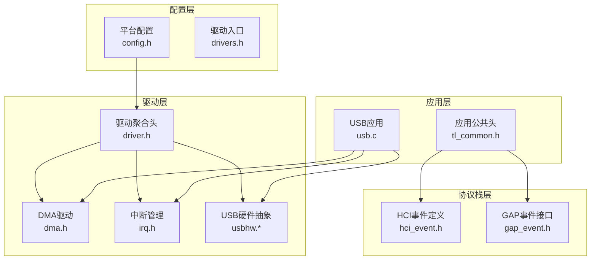
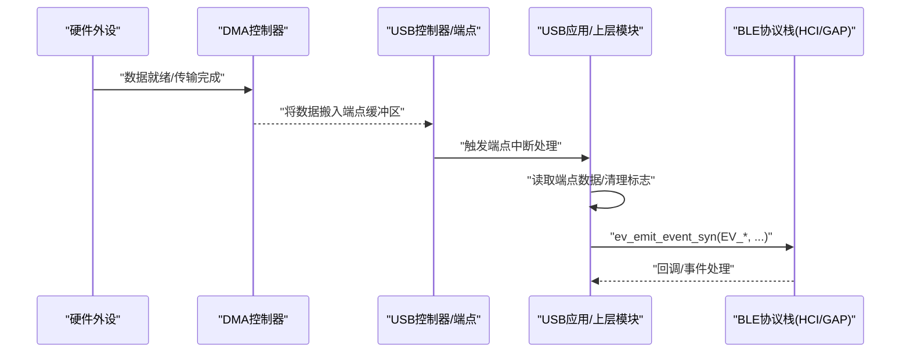
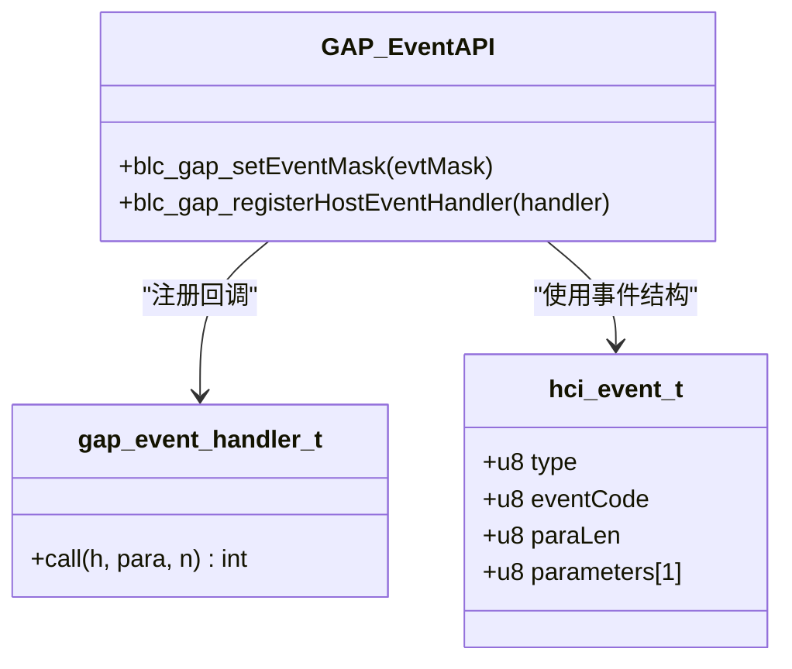
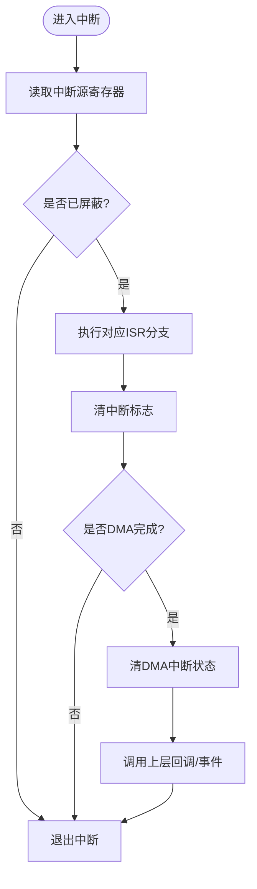
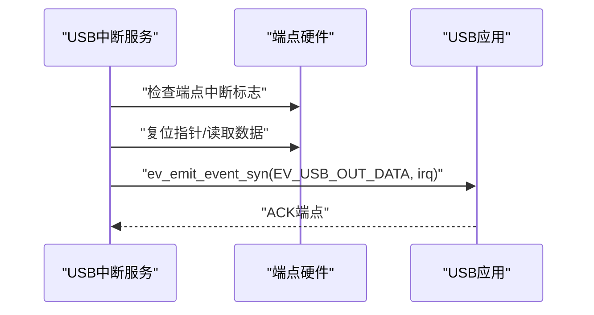
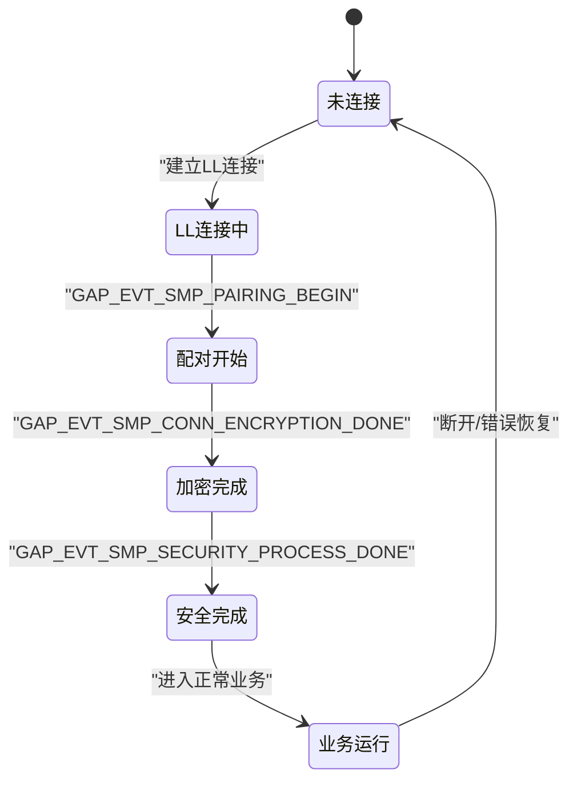
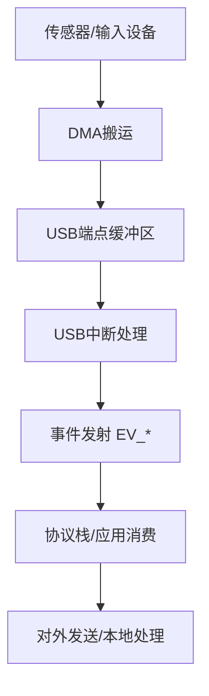
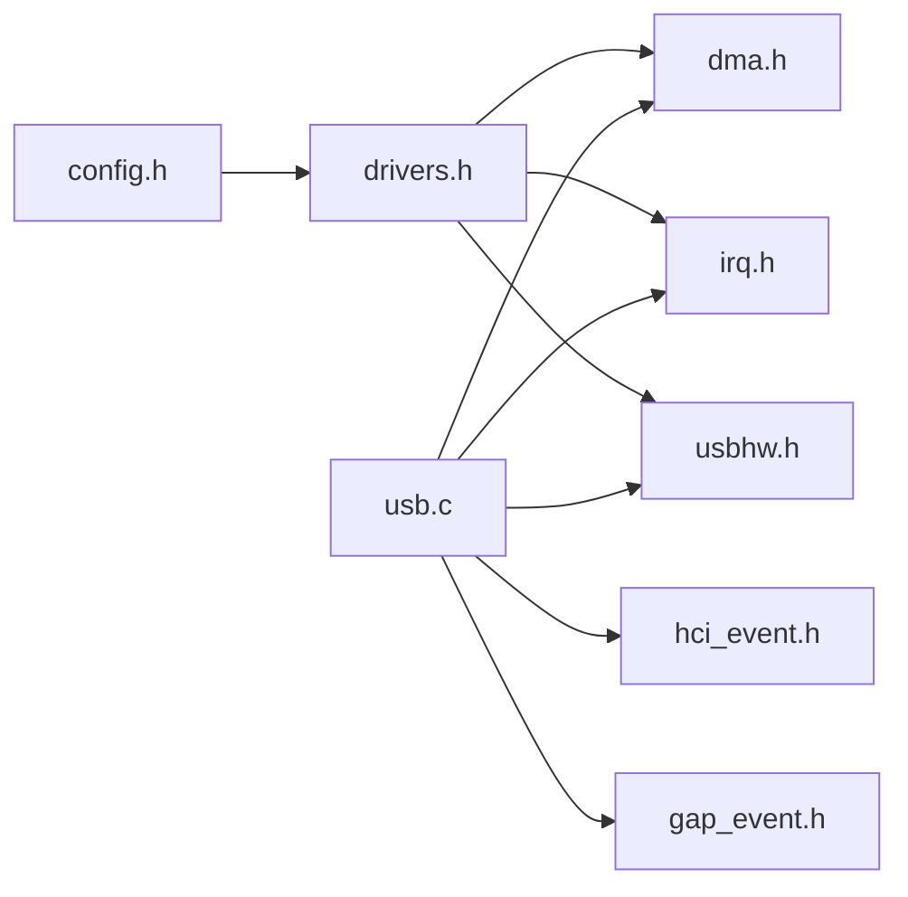

# 组件交互机制

<cite>
**本文引用的文件**
- [tl_common.h](file://tc_ble_single_sdk/tl_common.h)
- [drivers.h](file://tc_ble_single_sdk/drivers.h)
- [config.h](file://tc_ble_single_sdk/config.h)
- [driver.h (B85)](file://tc_ble_single_sdk/drivers/B85/driver.h)
- [irq.h (B85)](file://tc_ble_single_sdk/drivers/B85/irq.h)
- [dma.h (B85)](file://tc_ble_single_sdk/drivers/B85/dma.h)
- [usb.c](file://tc_ble_single_sdk/application/usbstd/usb.c)
- [hci_event.h](file://tc_ble_single_sdk/stack/ble/hci/hci_event.h)
- [gap_event.h](file://tc_ble_single_sdk/stack/ble/host/gap/gap_event.h)
</cite>

## 目录
1. [简介](#简介)
2. [项目结构](#项目结构)
3. [核心组件](#核心组件)
4. [架构总览](#架构总览)
5. [详细组件分析](#详细组件分析)
6. [依赖关系分析](#依赖关系分析)
7. [性能考虑](#性能考虑)
8. [故障排查指南](#故障排查指南)
9. [结论](#结论)
10. [附录](#附录)

## 简介
本文件面向Telink音频鼠标SDK中的“组件交互机制”，聚焦事件驱动架构、异步通信（DMA/中断/回调）、状态机在组件状态管理中的应用，以及从数据产生到最终处理的端到端消息流。文档同时给出性能优化建议与常见问题解决方案，并说明如何扩展新组件以融入现有交互框架。

## 项目结构
该SDK采用分层组织：
- 应用层：USB类实现（如USB CDC/Audio/HID等）与应用公共头
- 协议栈层：BLE HCI/GAP事件定义与处理接口
- 驱动层：芯片相关驱动（DMA、IRQ、USB硬件、时钟、GPIO等）
- 配置层：芯片类型、MCU核心类型等编译期配置

图表来源
- [tl_common.h:27-52](file://tc_ble_single_sdk/tl_common.h#L27-L52)
- [drivers.h:26-30](file://tc_ble_single_sdk/drivers.h#L26-L30)
- [config.h:31-55](file://tc_ble_single_sdk/config.h#L31-L55)
- [driver.h (B85):28-63](file://tc_ble_single_sdk/drivers/B85/driver.h#L28-L63)

章节来源
- [tl_common.h:27-52](file://tc_ble_single_sdk/tl_common.h#L27-L52)
- [drivers.h:26-30](file://tc_ble_single_sdk/drivers.h#L26-L30)
- [config.h:31-55](file://tc_ble_single_sdk/config.h#L31-L55)
- [driver.h (B85):28-63](file://tc_ble_single_sdk/drivers/B85/driver.h#L28-L63)

## 核心组件
- 事件系统（HCI/GAP）：统一的事件类型与参数结构，提供注册与分发接口，用于跨层解耦。
- 中断与DMA：底层硬件中断屏蔽/使能、DMA通道控制与中断标志管理，支撑零拷贝或低CPU占用的数据传输。
- USB子系统：端点忙/ACK/STALL控制、批量写入、中断处理流程，向上层暴露事件发射能力。
- 配置与聚合：按芯片类型选择驱动集合，统一入口便于维护与移植。

章节来源
- [hci_event.h:34-90](file://tc_ble_single_sdk/stack/ble/hci/hci_event.h#L34-L90)
- [gap_event.h:130-193](file://tc_ble_single_sdk/stack/ble/host/gap/gap_event.h#L130-L193)
- [dma.h (B85):50-159](file://tc_ble_single_sdk/drivers/B85/dma.h#L50-L159)
- [irq.h (B85):28-168](file://tc_ble_single_sdk/drivers/B85/irq.h#L28-L168)
- [usb.c:924-981](file://tc_ble_single_sdk/application/usbstd/usb.c#L924-L981)

## 架构总览
下图展示从硬件中断到上层应用的典型数据路径：外设中断触发→DMA搬运→USB端点处理→事件发射→协议栈/应用消费。

图表来源
- [dma.h (B85):97-159](file://tc_ble_single_sdk/drivers/B85/dma.h#L97-L159)
- [usb.c:924-981](file://tc_ble_single_sdk/application/usbstd/usb.c#L924-L981)
- [hci_event.h:34-90](file://tc_ble_single_sdk/stack/ble/hci/hci_event.h#L34-L90)
- [gap_event.h:347-364](file://tc_ble_single_sdk/stack/ble/host/gap/gap_event.h#L347-L364)

## 详细组件分析

### 事件系统与回调链（HCI/GAP）
- 事件模型：通过统一的event结构体承载事件类型、子事件码与参数；GAP层提供事件掩码与公共处理器注册接口，便于集中拦截与分发。
- 回调链：应用可注册GAP主机事件处理器，实现跨层解耦的响应逻辑。

图表来源
- [hci_event.h:34-90](file://tc_ble_single_sdk/stack/ble/hci/hci_event.h#L34-L90)
- [gap_event.h:347-364](file://tc_ble_single_sdk/stack/ble/host/gap/gap_event.h#L347-L364)

章节来源
- [hci_event.h:34-90](file://tc_ble_single_sdk/stack/ble/hci/hci_event.h#L34-L90)
- [gap_event.h:130-193](file://tc_ble_single_sdk/stack/ble/host/gap/gap_event.h#L130-L193)
- [gap_event.h:347-364](file://tc_ble_single_sdk/stack/ble/host/gap/gap_event.h#L347-L364)

### 中断管理与DMA通道
- 中断管理：提供全局中断开关、屏蔽位设置、源获取与清除，支持RF等专用中断。
- DMA通道：通道使能/禁用、中断使能/清除、缓冲大小设置，配合外设实现高效数据搬运。

图表来源
- [irq.h (B85):28-168](file://tc_ble_single_sdk/drivers/B85/irq.h#L28-L168)
- [dma.h (B85):97-159](file://tc_ble_single_sdk/drivers/B85/dma.h#L97-L159)

章节来源
- [irq.h (B85):28-168](file://tc_ble_single_sdk/drivers/B85/irq.h#L28-L168)
- [dma.h (B85):97-159](file://tc_ble_single_sdk/drivers/B85/dma.h#L97-L159)

### USB端点处理与事件发射
- 端点控制：忙检测、ACK/STALL、批量写入、手动中断使能等。
- 事件发射：在特定端点数据到达时，清理标志后通过同步事件发射给上层，避免阻塞。

图表来源
- [usb.c:924-981](file://tc_ble_single_sdk/application/usbstd/usb.c#L924-L981)
- [usbhw.h (B85):152-197](file://tc_ble_single_sdk/drivers/B85/usbhw.h#L152-L197)

章节来源
- [usb.c:924-981](file://tc_ble_single_sdk/application/usbstd/usb.c#L924-L981)
- [usbhw.h (B85):152-197](file://tc_ble_single_sdk/drivers/B85/usbhw.h#L152-L197)

### 状态机在组件状态管理中的应用
- 连接与安全状态：GAP/SMP阶段通过事件序列推进（配对开始、加密完成、安全处理完成），上层依据事件切换内部状态机。
- 典型状态：未连接→建立LL连接→SMP配对→加密完成→密钥分发→安全处理完成→业务运行。

图表来源
- [gap_event.h:130-193](file://tc_ble_single_sdk/stack/ble/host/gap/gap_event.h#L130-L193)

章节来源
- [gap_event.h:130-193](file://tc_ble_single_sdk/stack/ble/host/gap/gap_event.h#L130-L193)

### 端到端消息传递示例（USB音频/键鼠数据）
- 数据产生：外设采集或输入设备产生数据。
- 传输路径：DMA将数据搬运至USB端点缓冲区；USB中断触发应用处理；应用读取数据并封装为报告/音频帧。
- 事件分发：通过事件机制通知上层（如BLE HID/CDC或音频链路）。
- 最终处理：协议栈打包发送或本地播放。

图表来源
- [dma.h (B85):97-159](file://tc_ble_single_sdk/drivers/B85/dma.h#L97-L159)
- [usb.c:924-981](file://tc_ble_single_sdk/application/usbstd/usb.c#L924-L981)
- [hci_event.h:34-90](file://tc_ble_single_sdk/stack/ble/hci/hci_event.h#L34-L90)

## 依赖关系分析
- 顶层聚合头引入各驱动模块，按芯片类型选择具体实现。
- 应用层依赖驱动提供的DMA/IRQ/USB能力，并通过事件系统与协议栈交互。
- 配置头决定MCU核心类型，影响驱动选择与行为。

图表来源
- [config.h:31-55](file://tc_ble_single_sdk/config.h#L31-L55)
- [drivers.h:26-30](file://tc_ble_single_sdk/drivers.h#L26-L30)
- [driver.h (B85):28-63](file://tc_ble_single_sdk/drivers/B85/driver.h#L28-L63)
- [usb.c:924-981](file://tc_ble_single_sdk/application/usbstd/usb.c#L924-L981)

章节来源
- [config.h:31-55](file://tc_ble_single_sdk/config.h#L31-L55)
- [drivers.h:26-30](file://tc_ble_single_sdk/drivers.h#L26-L30)
- [driver.h (B85):28-63](file://tc_ble_single_sdk/drivers/B85/driver.h#L28-L63)

## 性能考虑
- 使用DMA进行大数据块搬运，减少CPU参与，降低中断频率。
- 合理设置DMA缓冲大小与通道优先级，避免溢出与竞争。
- 在中断中仅做最小化处理（清标志、读端点、发事件），重任务放入上下文或队列。
- 利用事件掩码过滤不必要事件，减少无效回调开销。
- 对高频事件采用批处理或环形缓冲，降低锁与拷贝成本。

## 故障排查指南
- 中断未触发：检查全局中断使能与相应模块中断屏蔽位；确认DMA通道中断使能。
- DMA未完成：核对通道使能、缓冲大小、源/目的地址配置；清中断状态后再重试。
- USB端点卡死：检查端点忙标志、ACK/STALL是否正确设置；必要时复位端点指针。
- 事件未到达：确认事件发射函数被调用且参数正确；检查上层事件处理器是否注册。
- 状态机异常：根据GAP事件序列定位当前阶段；打印关键状态变量与返回码。

章节来源
- [irq.h (B85):28-168](file://tc_ble_single_sdk/drivers/B85/irq.h#L28-L168)
- [dma.h (B85):97-159](file://tc_ble_single_sdk/drivers/B85/dma.h#L97-L159)
- [usb.c:924-981](file://tc_ble_single_sdk/application/usbstd/usb.c#L924-L981)
- [gap_event.h:130-193](file://tc_ble_single_sdk/stack/ble/host/gap/gap_event.h#L130-L193)

## 结论
本SDK通过“中断+DMA+事件”的组合实现了高效的组件间通信：底层由中断与DMA保障实时性与吞吐，中间层通过统一事件抽象解耦，上层基于状态机管理复杂业务流程。遵循本文的扩展与优化建议，可快速集成新组件并保持系统稳定与高性能。

## 附录

### 如何添加新组件并集成到现有交互框架
- 步骤概览
  - 在驱动层新增或复用DMA/IRQ/USB等能力，确保通道与中断可用。
  - 在应用层实现数据生产与消费逻辑，使用事件发射机制通知其他模块。
  - 如需协议栈参与，定义或复用HCI/GAP事件结构，并在适当时机触发。
  - 更新配置头（如需要）以包含新模块的编译选项。
- 关键点
  - 保持中断短小，重任务下沉到上下文或队列。
  - 使用事件掩码精确订阅所需事件，避免广播风暴。
  - 在状态机中明确每个事件的职责与副作用，保证可预测性。

章节来源
- [tl_common.h:27-52](file://tc_ble_single_sdk/tl_common.h#L27-L52)
- [drivers.h:26-30](file://tc_ble_single_sdk/drivers.h#L26-L30)
- [config.h:31-55](file://tc_ble_single_sdk/config.h#L31-L55)
- [driver.h (B85):28-63](file://tc_ble_single_sdk/drivers/B85/driver.h#L28-L63)
- [gap_event.h:347-364](file://tc_ble_single_sdk/stack/ble/host/gap/gap_event.h#L347-L364)