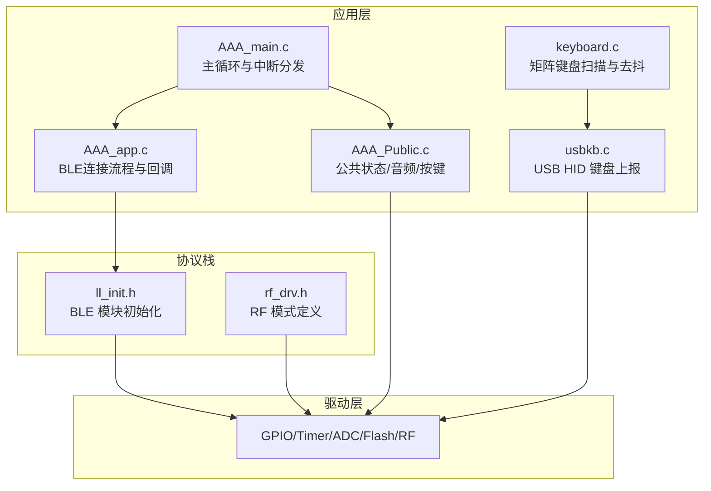
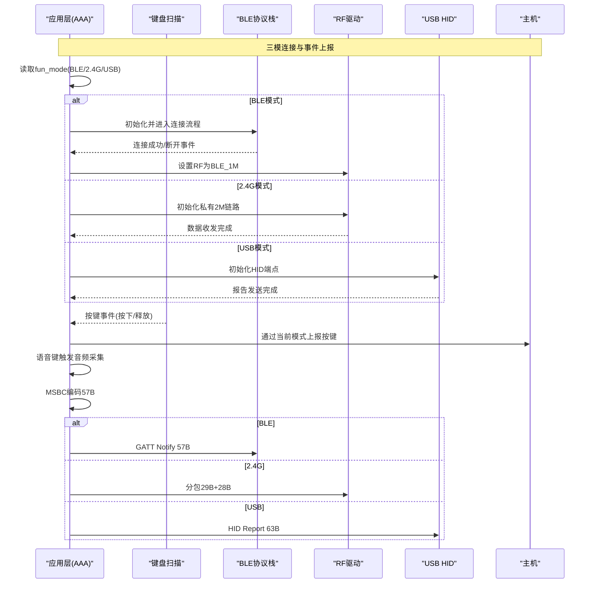
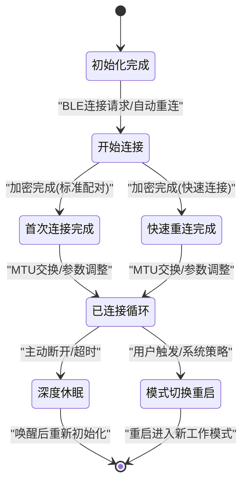
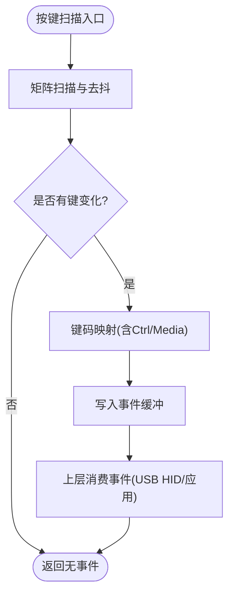
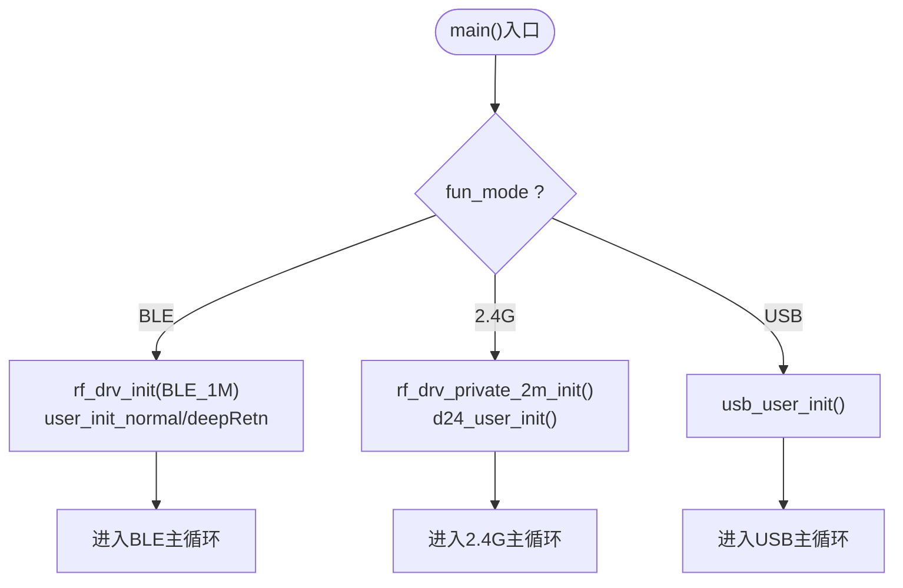
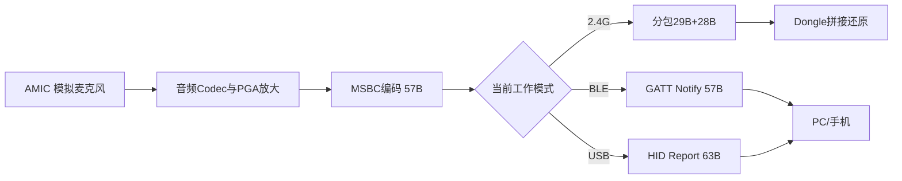
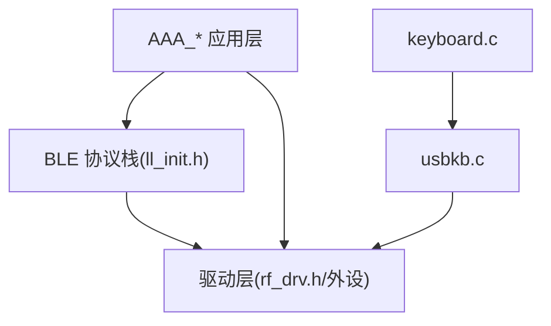

# 设计模式应用

<cite>
**本文引用的文件**
- [AAA_main.c](file://tc_ble_single_sdk/vendor/827x_three_mode_mouse/AAA_main.c)
- [AAA_app.c](file://tc_ble_single_sdk/vendor/827x_three_mode_mouse/AAA_app.c)
- [AAA_Public.c](file://tc_ble_single_sdk/vendor/827x_three_mode_mouse/AAA_Public.c)
- [keyboard.c](file://tc_ble_single_sdk/application/keyboard/keyboard.c)
- [usbkb.c](file://tc_ble_single_sdk/application/app/usbkb.c)
- [HIDClassCommon.h](file://tc_ble_single_sdk/application/usbstd/HIDClassCommon.h)
- [SDK_Wiki.md](file://doc/SDK_Wiki.md)
- [ll_init.h](file://tc_ble_single_sdk/stack/ble/controller/ll/ll_init.h)
- [rf_drv.h](file://8373_dongle_for_km/chip/B80/drivers/lib/include/rf_drv.h)
</cite>

## 目录
1. [简介](#简介)
2. [项目结构](#项目结构)
3. [核心组件](#核心组件)
4. [架构总览](#架构总览)
5. [详细组件分析](#详细组件分析)
6. [依赖关系分析](#依赖关系分析)
7. [性能考虑](#性能考虑)
8. [故障排查指南](#故障排查指南)
9. [结论](#结论)
10. [附录](#附录)

## 简介
本文件聚焦于三模音频鼠标 SDK 中设计模式的落地实践，重点覆盖：
- 状态机模式：用于三模（BLE/2.4G/USB）连接切换与生命周期管理
- 观察者模式：按键事件、连接状态变化等事件通知机制
- 工厂模式：设备初始化过程中按当前工作模式选择不同初始化路径
- 单例模式：全局资源（如系统时钟、配置区、RF驱动实例）的集中管理与访问

通过代码级分析与图示，帮助读者理解这些模式如何提升可维护性、可扩展性与运行稳定性。

## 项目结构
本项目采用“应用层 + 协议栈 + 驱动层”的分层组织方式：
- 应用层：三模业务逻辑（连接、音频采集上报、按键处理、USB HID 输出）
- 协议栈：BLE 控制器与主机接口（连接、SMP、GATT、OTA）
- 驱动层：MCU 外设（GPIO、定时器、ADC、Flash、RF）

图表来源
- [AAA_main.c:335-558](file://tc_ble_single_sdk/vendor/827x_three_mode_mouse/AAA_main.c#L335-L558)
- [AAA_app.c:42-51](file://tc_ble_single_sdk/vendor/827x_three_mode_mouse/AAA_app.c#L42-L51)
- [AAA_Public.c:65-88](file://tc_ble_single_sdk/vendor/827x_three_mode_mouse/AAA_Public.c#L65-L88)
- [keyboard.c:396-486](file://tc_ble_single_sdk/application/keyboard/keyboard.c#L396-L486)
- [usbkb.c:311-355](file://tc_ble_single_sdk/application/app/usbkb.c#L311-L355)
- [ll_init.h:29-35](file://tc_ble_single_sdk/stack/ble/controller/ll/ll_init.h#L29-L35)
- [rf_drv.h:60-73](file://8373_dongle_for_km/chip/B80/drivers/lib/include/rf_drv.h#L60-L73)

章节来源
- [AAA_main.c:335-558](file://tc_ble_single_sdk/vendor/827x_three_mode_mouse/AAA_main.c#L335-L558)
- [SDK_Wiki.md:86-117](file://doc/SDK_Wiki.md#L86-L117)

## 核心组件
- 三模连接与切换：由主函数根据 fun_mode 选择 BLE/2.4G/USB 初始化与主循环；支持通过事件触发模式切换并重启进入新工作模式。
- 音频采集与上报：统一采集编码流水线，按当前模式分包并通过对应通道上报（2.4G 自定义分包、BLE GATT Notify、USB HID）。
- 按键事件：矩阵扫描+去抖+映射，生成键值事件并分发到 USB HID 或上层处理。
- 设备初始化：依据芯片类型、电源状态、配置参数进行差异化初始化（工厂模式思想）。
- 全局资源：系统时钟、随机数、Flash 保护、RF 驱动等以全局变量/函数形式提供，体现单例式访问。

章节来源
- [AAA_main.c:335-558](file://tc_ble_single_sdk/vendor/827x_three_mode_mouse/AAA_main.c#L335-L558)
- [AAA_Public.c:239-368](file://tc_ble_single_sdk/vendor/827x_three_mode_mouse/AAA_Public.c#L239-L368)
- [keyboard.c:396-486](file://tc_ble_single_sdk/application/keyboard/keyboard.c#L396-L486)
- [usbkb.c:311-355](file://tc_ble_single_sdk/application/app/usbkb.c#L311-L355)

## 架构总览
下图展示了三模连接的总体数据流与控制流，包括按键事件、音频数据流以及 BLE/2.4G/USB 三种通道的上报路径。

图表来源
- [AAA_main.c:482-551](file://tc_ble_single_sdk/vendor/827x_three_mode_mouse/AAA_main.c#L482-L551)
- [AAA_Public.c:239-368](file://tc_ble_single_sdk/vendor/827x_three_mode_mouse/AAA_Public.c#L239-L368)
- [SDK_Wiki.md:102-117](file://doc/SDK_Wiki.md#L102-L117)
- [rf_drv.h:60-73](file://8373_dongle_for_km/chip/B80/drivers/lib/include/rf_drv.h#L60-L73)

## 详细组件分析

### 状态机模式：三模连接切换
- 状态定义：在应用层定义了 BLE 连接步骤枚举（如 INIT_DONE、BEGIN_CONNECT、CONNECTED_DONE 等），用于控制 BLE 侧的连接生命周期。
- 转移条件：基于 BLE 事件（连接建立、加密完成、MTU交换、终止等）和系统事件（模式切换、低电量、配对失败）触发状态迁移。
- 事件处理：通过回调函数处理 GAP/GATT 事件，更新内部状态标志，必要时触发重启进入目标模式。

图表来源
- [AAA_app.c:42-51](file://tc_ble_single_sdk/vendor/827x_three_mode_mouse/AAA_app.c#L42-L51)
- [AAA_app.c:365-439](file://tc_ble_single_sdk/vendor/827x_three_mode_mouse/AAA_app.c#L365-L439)
- [AAA_app.c:452-525](file://tc_ble_single_sdk/vendor/827x_three_mode_mouse/AAA_app.c#L452-L525)
- [AAA_app.c:622-698](file://tc_ble_single_sdk/vendor/827x_three_mode_mouse/AAA_app.c#L622-L698)

章节来源
- [AAA_app.c:42-51](file://tc_ble_single_sdk/vendor/827x_three_mode_mouse/AAA_app.c#L42-L51)
- [AAA_app.c:365-439](file://tc_ble_single_sdk/vendor/827x_three_mode_mouse/AAA_app.c#L365-L439)
- [AAA_app.c:452-525](file://tc_ble_single_sdk/vendor/827x_three_mode_mouse/AAA_app.c#L452-L525)
- [AAA_app.c:622-698](file://tc_ble_single_sdk/vendor/827x_three_mode_mouse/AAA_app.c#L622-L698)

### 观察者模式：事件通知系统
- 按键事件：键盘扫描模块将矩阵扫描结果去抖、映射为键值，推送到缓冲区，供上层消费。
- 连接状态变化：BLE 协议栈通过回调通知应用层连接建立、加密完成、MTU交换、终止等事件，应用层据此更新状态与行为。
- 好处：解耦事件生产者与消费者，便于扩展新的事件类型与订阅者。

图表来源
- [keyboard.c:396-486](file://tc_ble_single_sdk/application/keyboard/keyboard.c#L396-L486)
- [usbkb.c:311-355](file://tc_ble_single_sdk/application/app/usbkb.c#L311-L355)
- [HIDClassCommon.h:35-46](file://tc_ble_single_sdk/application/usbstd/HIDClassCommon.h#L35-L46)

章节来源
- [keyboard.c:396-486](file://tc_ble_single_sdk/application/keyboard/keyboard.c#L396-L486)
- [usbkb.c:311-355](file://tc_ble_single_sdk/application/app/usbkb.c#L311-L355)
- [HIDClassCommon.h:35-46](file://tc_ble_single_sdk/application/usbstd/HIDClassCommon.h#L35-L46)

### 工厂模式：设备初始化
- 场景：根据 fun_mode（BLE/2.4G/USB）选择不同的初始化路径；根据芯片类型（825x/827x）调用不同的唤醒初始化；根据是否深睡恢复决定是否需要恢复上下文。
- 实现要点：在主函数中集中判断并调用对应的初始化函数，形成“输入=工作模式/硬件环境，输出=对应子系统就绪”的工厂化流程。
- 好处：屏蔽差异化的初始化细节，新增工作模式时只需扩展分支与对应初始化函数。

图表来源
- [AAA_main.c:482-551](file://tc_ble_single_sdk/vendor/827x_three_mode_mouse/AAA_main.c#L482-L551)
- [AAA_main.c:335-364](file://tc_ble_single_sdk/vendor/827x_three_mode_mouse/AAA_main.c#L335-L364)

章节来源
- [AAA_main.c:335-364](file://tc_ble_single_sdk/vendor/827x_three_mode_mouse/AAA_main.c#L335-L364)
- [AAA_main.c:482-551](file://tc_ble_single_sdk/vendor/827x_three_mode_mouse/AAA_main.c#L482-L551)

### 单例模式：资源管理
- 全局资源：系统时钟、随机数发生器、Flash 保护、RF 驱动、配置区等以全局变量/函数形式存在，确保唯一实例与一致访问。
- 使用方式：各模块直接调用初始化与操作函数，无需传递句柄，简化调用链。
- 好处：避免重复初始化与资源竞争，便于统一管理生命周期与权限。

章节来源
- [AAA_main.c:335-364](file://tc_ble_single_sdk/vendor/827x_three_mode_mouse/AAA_main.c#L335-L364)
- [AAA_Public.c:65-88](file://tc_ble_single_sdk/vendor/827x_three_mode_mouse/AAA_Public.c#L65-L88)
- [rf_drv.h:60-73](file://8373_dongle_for_km/chip/B80/drivers/lib/include/rf_drv.h#L60-L73)

### 音频数据流与多通道上报
- 采集与编码：AMIC 模拟麦克风 → Codec/PGA → MSBC 编码（每帧 57B）。
- 多通道上报：
  - 2.4G：分包为 29B+28B，通过自定义命令上报
  - BLE：GATT Notify 直接发送 57B
  - USB：HID Report 封装为 63B 上报
- 优势：统一采集流水线，降低重复开发成本，提高带宽利用率。

图表来源
- [SDK_Wiki.md:102-117](file://doc/SDK_Wiki.md#L102-L117)
- [AAA_Public.c:239-368](file://tc_ble_single_sdk/vendor/827x_three_mode_mouse/AAA_Public.c#L239-L368)
- [AAA_Public.c:408-465](file://tc_ble_single_sdk/vendor/827x_three_mode_mouse/AAA_Public.c#L408-L465)
- [AAA_Public.c:473-535](file://tc_ble_single_sdk/vendor/827x_three_mode_mouse/AAA_Public.c#L473-L535)

## 依赖关系分析
- 应用层依赖协议栈：BLE 连接、SMP、GATT 等通过 ll_init.h 暴露的 API 进行初始化与管理。
- 应用层依赖驱动层：RF 驱动通过 rf_drv.h 定义的 RF 模式进行切换；GPIO/Timer/ADC/Flash 等外设由驱动层抽象。
- 键盘与 USB HID：键盘扫描产生事件，USB HID 负责上报；两者通过事件缓冲与队列解耦。

图表来源
- [ll_init.h:29-35](file://tc_ble_single_sdk/stack/ble/controller/ll/ll_init.h#L29-L35)
- [rf_drv.h:60-73](file://8373_dongle_for_km/chip/B80/drivers/lib/include/rf_drv.h#L60-L73)
- [keyboard.c:396-486](file://tc_ble_single_sdk/application/keyboard/keyboard.c#L396-L486)
- [usbkb.c:311-355](file://tc_ble_single_sdk/application/app/usbkb.c#L311-L355)

章节来源
- [ll_init.h:29-35](file://tc_ble_single_sdk/stack/ble/controller/ll/ll_init.h#L29-L35)
- [rf_drv.h:60-73](file://8373_dongle_for_km/chip/B80/drivers/lib/include/rf_drv.h#L60-L73)
- [keyboard.c:396-486](file://tc_ble_single_sdk/application/keyboard/keyboard.c#L396-L486)
- [usbkb.c:311-355](file://tc_ble_single_sdk/application/app/usbkb.c#L311-L355)

## 性能考虑
- 音频带宽与报告率：语音期间自动降低鼠标报告率以保证音频带宽（2.4G 模式）或调整 USB 报告率（USB 模式）。
- 分包策略：2.4G 模式下将 57B 拆分为 29B+28B，减少单次传输压力，提高可靠性。
- 去抖与防鬼键：键盘扫描加入去抖与防鬼键逻辑，降低误报与抖动影响。
- Flash 保护：在 OTA 写/擦除前后动态解锁/锁定 Flash，保证固件安全与一致性。

章节来源
- [SDK_Wiki.md:86-117](file://doc/SDK_Wiki.md#L86-L117)
- [AAA_Public.c:239-368](file://tc_ble_single_sdk/vendor/827x_three_mode_mouse/AAA_Public.c#L239-L368)
- [AAA_Public.c:408-465](file://tc_ble_single_sdk/vendor/827x_three_mode_mouse/AAA_Public.c#L408-L465)
- [AAA_Public.c:473-535](file://tc_ble_single_sdk/vendor/827x_three_mode_mouse/AAA_Public.c#L473-L535)
- [AAA_main.c:236-325](file://tc_ble_single_sdk/vendor/827x_three_mode_mouse/AAA_main.c#L236-L325)

## 故障排查指南
- 连接异常：检查 BLE 回调中的连接/终止事件，确认状态机迁移是否符合预期；必要时重启进入目标模式。
- 按键无响应：查看键盘扫描与去抖逻辑，确认矩阵扫描结果是否正确映射为键值；检查 USB HID 上报是否被阻塞。
- 音频卡顿：确认当前模式下的报告率与分包策略；检查 FIFO 是否溢出；验证编码与上报时序。
- Flash 操作错误：确认 Flash 保护回调是否正确解锁/锁定；校验写回读比对逻辑。

章节来源
- [AAA_app.c:452-525](file://tc_ble_single_sdk/vendor/827x_three_mode_mouse/AAA_app.c#L452-L525)
- [AAA_app.c:622-698](file://tc_ble_single_sdk/vendor/827x_three_mode_mouse/AAA_app.c#L622-L698)
- [keyboard.c:396-486](file://tc_ble_single_sdk/application/keyboard/keyboard.c#L396-L486)
- [AAA_Public.c:239-368](file://tc_ble_single_sdk/vendor/827x_three_mode_mouse/AAA_Public.c#L239-L368)
- [AAA_main.c:236-325](file://tc_ble_single_sdk/vendor/827x_three_mode_mouse/AAA_main.c#L236-L325)

## 结论
本项目在三模音频鼠标的复杂场景中，合理运用了状态机、观察者、工厂与单例等设计模式：
- 状态机清晰刻画了连接生命周期与切换逻辑，便于扩展与维护
- 观察者模式解耦了事件生产与消费，提升了系统的灵活性与可测试性
- 工厂模式屏蔽了初始化差异，降低了新增工作模式的接入成本
- 单例模式集中管理全局资源，避免了重复初始化与资源竞争

这些模式共同保障了系统在功能完整性、性能与稳定性方面的表现。

## 附录
- 如何在现有代码基础上应用更多设计模式：
  - 引入策略模式：针对不同工作模式（BLE/2.4G/USB）的上报策略抽取为独立策略类，运行时选择具体策略
  - 引入命令模式：将按键动作封装为命令对象，支持撤销/重放与批量执行
  - 引入模板方法：在音频采集流水线中定义固定骨架，子类实现特定编码/打包步骤
  - 引入责任链：对连接事件的处理按优先级串联多个处理器，便于扩展新的处理逻辑