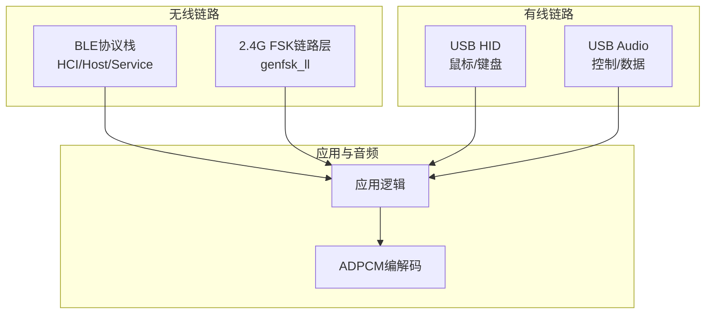
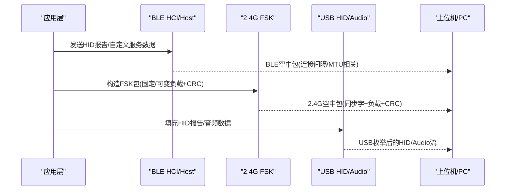
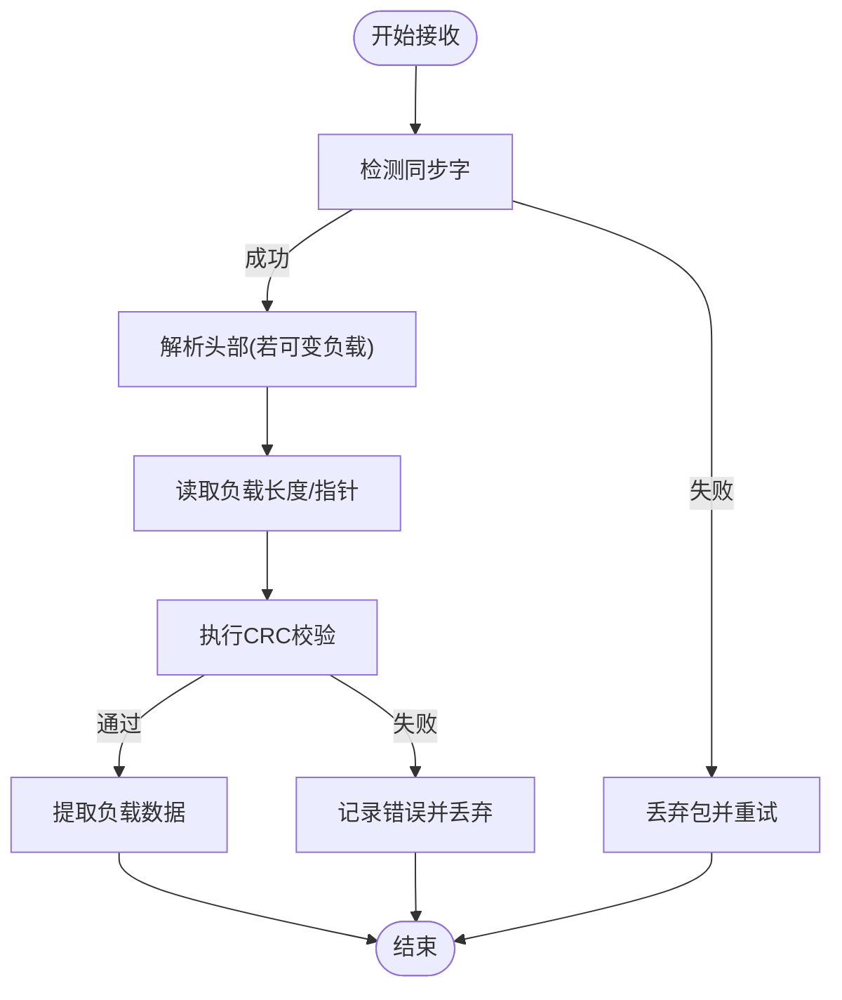
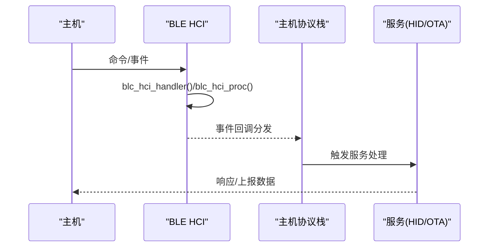
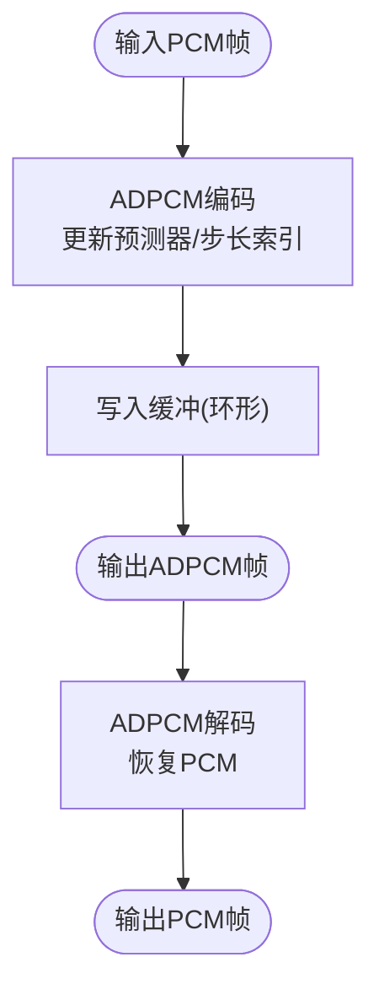
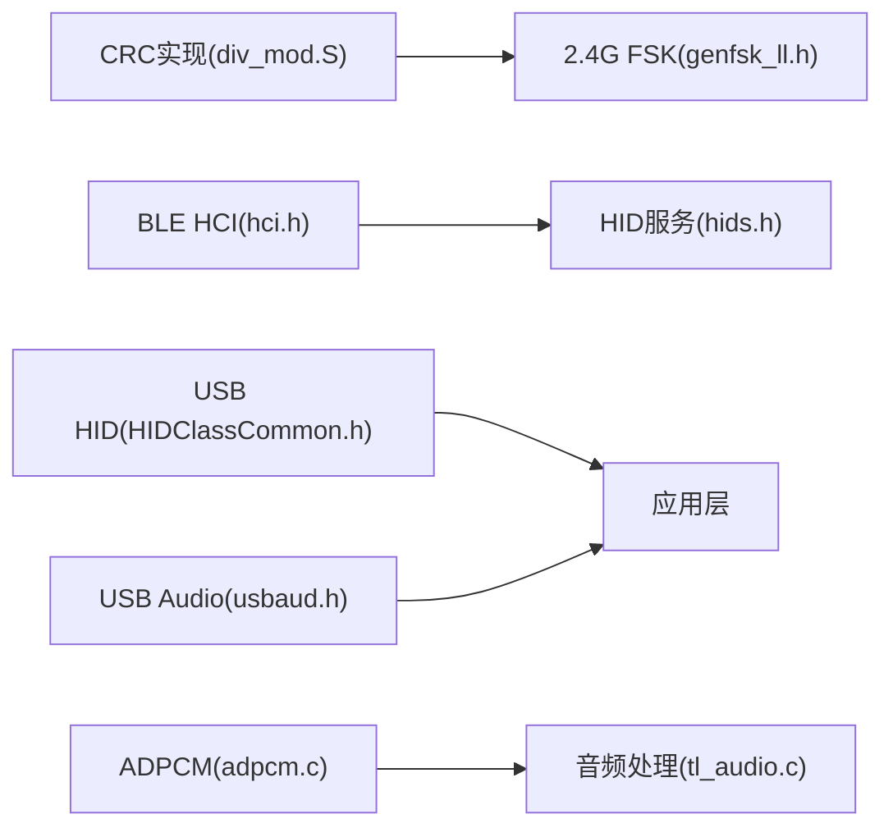

# 协议分析

<cite>
**本文引用的文件**
- [README.md](file://README.md)
- [genfsk_ll.h](file://tc_ble_single_sdk/stack/2p4g/genfsk_ll/genfsk_ll.h)
- [usbmouse.h](file://tc_ble_single_sdk/application/app/usbmouse.h)
- [usbaud.h](file://tc_ble_single_sdk/application/app/usbaud.h)
- [hci.h](file://tc_ble_single_sdk/stack/ble/hci/hci.h)
- [hids.h](file://tc_ble_single_sdk/stack/ble/service/hids.h)
- [HIDClassCommon.h](file://tc_ble_single_sdk/application/usbstd/HIDClassCommon.h)
- [HIDReportData.h](file://tc_ble_single_sdk/application/usbstd/HIDReportData.h)
- [adpcm.c](file://tc_ble_single_sdk/application/audio/adpcm.c)
- [tl_audio.c](file://tc_ble_single_sdk/application/audio/tl_audio.c)
- [div_mod.S](file://tc_ble_single_sdk/common/div_mod.S)
</cite>

## 目录
1. [简介](#简介)
2. [项目结构](#项目结构)
3. [核心组件](#核心组件)
4. [架构总览](#架构总览)
5. [详细组件分析](#详细组件分析)
6. [依赖关系分析](#依赖关系分析)
7. [性能考量](#性能考量)
8. [故障诊断指南](#故障诊断指南)
9. [结论](#结论)
10. [附录](#附录)

## 简介
本技术文档面向协议分析与调试，覆盖BLE、2.4G（FSK）与USB三类通信协议的数据包捕获与分析方法。重点包括：
- 协议帧结构解析：头部字段、数据载荷、CRC校验与错误码识别
- 常见问题诊断：连接失败、数据传输错误、协议不兼容
- 正确性验证：协议一致性测试与兼容性测试要点
- 抓包解读技巧与性能分析方法

本项目为三模音频鼠标SDK，支持BLE、2.4G与USB三种模式，提供HID鼠标、音频流（ADPCM编码）以及自定义服务通道等能力。

## 项目结构
- 2.4G链路层接口位于 stack/2p4g/genfsk_ll，提供射频收发、数据包格式、CRC、RSSI、时间戳等能力
- BLE协议栈位于 stack/ble，包含HCI、主机协议栈、服务（HID、OTA、设备信息等）
- USB应用层位于 application/app 与 application/usbstd，实现HID鼠标报告、USB音频类控制与数据流
- 音频编解码位于 application/audio，实现ADPCM编解码与缓冲管理
- CRC计算在 common/div_mod.S 中提供高效实现

图表来源
- [genfsk_ll.h:199-217](file://tc_ble_single_sdk/stack/2p4g/genfsk_ll/genfsk_ll.h#L199-L217)
- [hci.h:34-144](file://tc_ble_single_sdk/stack/ble/hci/hci.h#L34-L144)
- [HIDClassCommon.h:326-372](file://tc_ble_single_sdk/application/usbstd/HIDClassCommon.h#L326-L372)
- [usbaud.h:52-113](file://tc_ble_single_sdk/application/app/usbaud.h#L52-L113)

章节来源
- [README.md:1-231](file://README.md#L1-L231)

## 核心组件
- 2.4G FSK链路层：提供固定/可变负载包格式、同步字、CRC长度配置、RSSI与时间戳获取、自动TX/RX状态机与时序参数设置
- BLE HCI与主机：事件处理、ACL数据发送、事件掩码、LE事件掩码、控制器事件回调注册
- BLE HID服务：定义HID特性UUID、报告ID（含语音控制与多路音频输入）、协议模式
- USB HID：鼠标报告结构、键盘扫描码、HID描述符宏
- USB音频：音量/静音控制、特征ID、音频数据收发与中断处理
- 音频编解码：ADPCM编码/解码、缓冲管理、丢包保护与复位策略
- CRC计算：高效查表实现，用于2.4G包校验

章节来源
- [genfsk_ll.h:29-217](file://tc_ble_single_sdk/stack/2p4g/genfsk_ll/genfsk_ll.h#L29-L217)
- [hci.h:34-144](file://tc_ble_single_sdk/stack/ble/hci/hci.h#L34-L144)
- [hids.h:27-85](file://tc_ble_single_sdk/stack/ble/service/hids.h#L27-L85)
- [HIDClassCommon.h:326-372](file://tc_ble_single_sdk/application/usbstd/HIDClassCommon.h#L326-L372)
- [usbaud.h:52-113](file://tc_ble_single_sdk/application/app/usbaud.h#L52-L113)
- [adpcm.c:29-488](file://tc_ble_single_sdk/application/audio/adpcm.c#L29-L488)
- [div_mod.S:424-470](file://tc_ble_single_sdk/common/div_mod.S#L424-L470)

## 架构总览
下图展示从应用到各协议栈的调用关系与数据流向，涵盖BLE、2.4G与USB路径。

图表来源
- [hci.h:34-144](file://tc_ble_single_sdk/stack/ble/hci/hci.h#L34-L144)
- [genfsk_ll.h:199-217](file://tc_ble_single_sdk/stack/2p4g/genfsk_ll/genfsk_ll.h#L199-L217)
- [HIDClassCommon.h:326-372](file://tc_ble_single_sdk/application/usbstd/HIDClassCommon.h#L326-L372)
- [usbaud.h:52-113](file://tc_ble_single_sdk/application/app/usbaud.h#L52-L113)

## 详细组件分析

### 2.4G FSK链路层协议帧与解析
- 空中包格式
  - 固定负载：前导码 + 同步字 + 负载 + CRC
  - 可变负载：前导码 + 同步字 + 头(含负载长度) + 负载 + CRC
- 关键配置项
  - 同步字长度、管道选择、调制指数、数据速率、信道、发射功率
  - CRC长度（禁用/1字节/2字节）
  - 自动状态机：单发、单收、收发切换及等待时序
- 接收侧信息
  - RSSI冻结值、瞬时RSSI、接收时间戳、负载指针与长度、CRC校验结果

图表来源
- [genfsk_ll.h:199-217](file://tc_ble_single_sdk/stack/2p4g/genfsk_ll/genfsk_ll.h#L199-L217)
- [genfsk_ll.h:228-287](file://tc_ble_single_sdk/stack/2p4g/genfsk_ll/genfsk_ll.h#L228-L287)

章节来源
- [genfsk_ll.h:29-217](file://tc_ble_single_sdk/stack/2p4g/genfsk_ll/genfsk_ll.h#L29-L217)

### BLE HCI与主机事件流程
- HCI事件处理与回调注册
  - 事件掩码设置（标准蓝牙/LE事件）
  - 控制器事件回调注册
  - ACL数据发送到主机
- 典型流程：主机请求→HCI处理→分发至上层服务（如HID/OTA）

图表来源
- [hci.h:34-144](file://tc_ble_single_sdk/stack/ble/hci/hci.h#L34-L144)

章节来源
- [hci.h:34-144](file://tc_ble_single_sdk/stack/ble/hci/hci.h#L34-L144)

### BLE HID服务与报告ID
- 特性UUID：HID Boot输入/输出、信息、报告映射、控制点、报告、协议模式
- 报告ID：
  - 键盘输入、消费控制输入、鼠标输入、游戏手柄输入
  - LED输出、特性报告
  - 语音控制报告ID、多路音频输入报告ID（用于高吞吐音频）
  - OTA输入/输出报告ID
- 协议模式：Boot或Report模式

章节来源
- [hids.h:27-85](file://tc_ble_single_sdk/stack/ble/service/hids.h#L27-L85)

### USB HID鼠标报告与描述符
- 鼠标报告结构：按钮、X/Y位移、滚轮
- HID描述符宏：鼠标集合、按键、轴范围、绝对/相对坐标
- 键盘扫描码常量与修饰键位定义

章节来源
- [usbmouse.h:40-50](file://tc_ble_single_sdk/application/app/usbmouse.h#L40-L50)
- [HIDClassCommon.h:326-372](file://tc_ble_single_sdk/application/usbstd/HIDClassCommon.h#L326-L372)
- [HIDReportData.h:26-110](file://tc_ble_single_sdk/application/usbstd/HIDReportData.h#L26-L110)

### USB音频控制与数据流
- 控制命令：播放/暂停、下一首/上一首、停止、快进/倒带、音量增减、静音
- 特征ID：扬声器与麦克风
- 音量范围与步长定义
- 音频数据收发与中断处理函数

章节来源
- [usbaud.h:37-113](file://tc_ble_single_sdk/application/app/usbaud.h#L37-L113)

### 音频编解码与缓冲管理（ADPCM）
- 编码：将PCM采样转换为ADPCM码流，维护预测器与步长索引
- 解码：根据ADPCM码流重建PCM，保持预测器状态一致
- 缓冲管理：写入/读取指针、溢出保护、超时复位策略，避免数据错乱

图表来源
- [adpcm.c:29-488](file://tc_ble_single_sdk/application/audio/adpcm.c#L29-L488)
- [tl_audio.c:876-932](file://tc_ble_single_sdk/application/audio/tl_audio.c#L876-L932)
- [tl_audio.c:1176-1252](file://tc_ble_single_sdk/application/audio/tl_audio.c#L1176-L1252)

章节来源
- [adpcm.c:29-488](file://tc_ble_single_sdk/application/audio/adpcm.c#L29-L488)
- [tl_audio.c:876-932](file://tc_ble_single_sdk/application/audio/tl_audio.c#L876-L932)
- [tl_audio.c:1176-1252](file://tc_ble_single_sdk/application/audio/tl_audio.c#L1176-L1252)

## 依赖关系分析
- 2.4G链路层依赖CRC实现进行包校验
- BLE主机通过HCI与控制器交互，向上提供服务抽象
- USB HID与Audio依赖HID描述符与报告结构
- 音频模块依赖ADPCM编解码与系统定时器进行缓冲管理

图表来源
- [div_mod.S:424-470](file://tc_ble_single_sdk/common/div_mod.S#L424-L470)
- [genfsk_ll.h:199-217](file://tc_ble_single_sdk/stack/2p4g/genfsk_ll/genfsk_ll.h#L199-L217)
- [hci.h:34-144](file://tc_ble_single_sdk/stack/ble/hci/hci.h#L34-L144)
- [hids.h:27-85](file://tc_ble_single_sdk/stack/ble/service/hids.h#L27-L85)
- [HIDClassCommon.h:326-372](file://tc_ble_single_sdk/application/usbstd/HIDClassCommon.h#L326-L372)
- [usbaud.h:52-113](file://tc_ble_single_sdk/application/app/usbaud.h#L52-L113)
- [adpcm.c:29-488](file://tc_ble_single_sdk/application/audio/adpcm.c#L29-L488)
- [tl_audio.c:876-932](file://tc_ble_single_sdk/application/audio/tl_audio.c#L876-L932)

章节来源
- [div_mod.S:424-470](file://tc_ble_single_sdk/common/div_mod.S#L424-L470)
- [genfsk_ll.h:199-217](file://tc_ble_single_sdk/stack/2p4g/genfsk_ll/genfsk_ll.h#L199-L217)
- [hci.h:34-144](file://tc_ble_single_sdk/stack/ble/hci/hci.h#L34-L144)
- [hids.h:27-85](file://tc_ble_single_sdk/stack/ble/service/hids.h#L27-L85)
- [HIDClassCommon.h:326-372](file://tc_ble_single_sdk/application/usbstd/HIDClassCommon.h#L326-L372)
- [usbaud.h:52-113](file://tc_ble_single_sdk/application/app/usbaud.h#L52-L113)
- [adpcm.c:29-488](file://tc_ble_single_sdk/application/audio/adpcm.c#L29-L488)
- [tl_audio.c:876-932](file://tc_ble_single_sdk/application/audio/tl_audio.c#L876-L932)

## 性能考量
- 2.4G
  - 合理设置前导码长度、同步字长度与CRC长度以平衡可靠性与开销
  - 使用自动TX/RX状态机与合适的settling/wait时序降低空口竞争与功耗
  - 利用RSSI与时间戳评估链路质量与时延
- BLE
  - 连接间隔影响时延与功耗；音频场景需权衡MTU与连接间隔
  - 使用HID多路音频报告ID提升吞吐
- USB
  - HID报告率与音频采样率匹配，避免缓冲区溢出
  - 使用批量/中断端点优化吞吐
- 音频
  - ADPCM编码/解码保持预测器一致，避免爆音
  - 缓冲管理防止溢出与欠载，必要时触发复位

[本节为通用指导，无需特定文件引用]

## 故障诊断指南
- 连接失败（BLE）
  - 检查HCI事件掩码与控制器事件回调是否正确注册
  - 确认配对安全请求配置与绑定存储
  - 参考SMP失败原因码定位问题（如密钥尺寸、认证要求、超时等）
- 数据传输错误（2.4G）
  - 校验CRC是否通过；检查同步字与包格式是否一致
  - 检查RSSI与瞬时RSSI判断链路质量
  - 调整settling/wait时序与调制指数
- 协议不兼容（USB）
  - 核对HID描述符与报告ID是否与主机期望一致
  - 检查USB音频控制命令与特征ID
- 音频异常
  - 检查ADPCM编码/解码预测器与步长索引是否同步
  - 监控缓冲指针差值，避免溢出或欠载；必要时触发复位

章节来源
- [hci.h:34-144](file://tc_ble_single_sdk/stack/ble/hci/hci.h#L34-L144)
- [genfsk_ll.h:228-287](file://tc_ble_single_sdk/stack/2p4g/genfsk_ll/genfsk_ll.h#L228-L287)
- [HIDClassCommon.h:326-372](file://tc_ble_single_sdk/application/usbstd/HIDClassCommon.h#L326-L372)
- [usbaud.h:52-113](file://tc_ble_single_sdk/application/app/usbaud.h#L52-L113)
- [adpcm.c:29-488](file://tc_ble_single_sdk/application/audio/adpcm.c#L29-L488)
- [tl_audio.c:876-932](file://tc_ble_single_sdk/application/audio/tl_audio.c#L876-L932)

## 结论
通过对BLE、2.4G与USB协议的深入分析，结合帧结构解析、CRC校验、RSSI与时间戳等指标，可有效定位连接与传输问题。配合HID与USB音频的报告/控制机制，以及ADPCM编解码的缓冲管理，可实现稳定高效的三模音频鼠标通信。建议在开发与测试阶段建立完整的抓包与日志体系，持续验证协议一致性与兼容性。

[本节为总结，无需特定文件引用]

## 附录
- 抓包工具建议
  - BLE：使用支持BLE HCI与BTSnoop的工具（如Wireshark）抓取HCI事件与ACL数据
  - 2.4G：使用厂商提供的空中包捕获工具或逻辑分析仪，关注同步字、负载与CRC
  - USB：使用USB协议分析仪或Wireshark的USB捕获功能，查看HID报告与音频流
- 一致性测试要点
  - BLE：验证GATT/ATT/HID服务发现、连接参数协商、加密与绑定流程
  - 2.4G：验证包格式、CRC、RSSI阈值、时序参数与重传策略
  - USB：验证HID描述符、报告ID、音频控制命令与数据流带宽
- 兼容性测试要点
  - 多平台（Windows/macOS/Linux）下HID与音频设备的枚举与行为
  - 不同主机对BLE连接间隔与MTU的适配
  - 2.4G在不同信道与干扰环境下的鲁棒性

[本节为通用指导，无需特定文件引用]