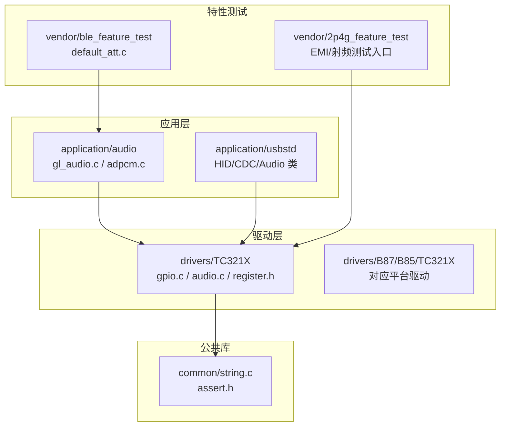
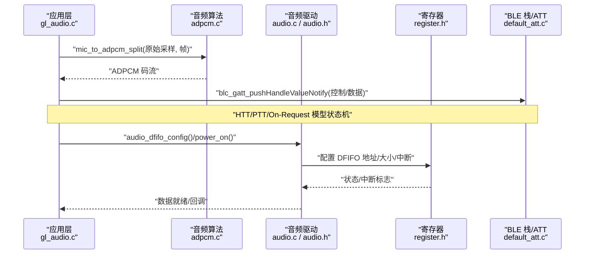
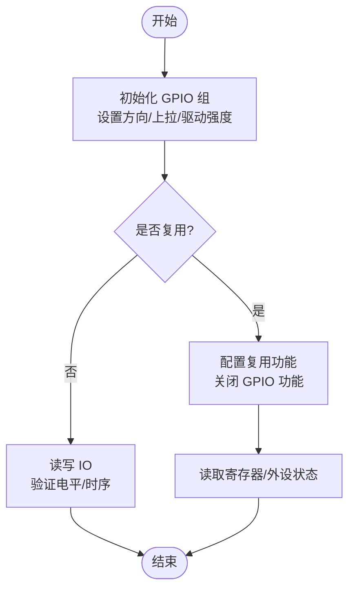
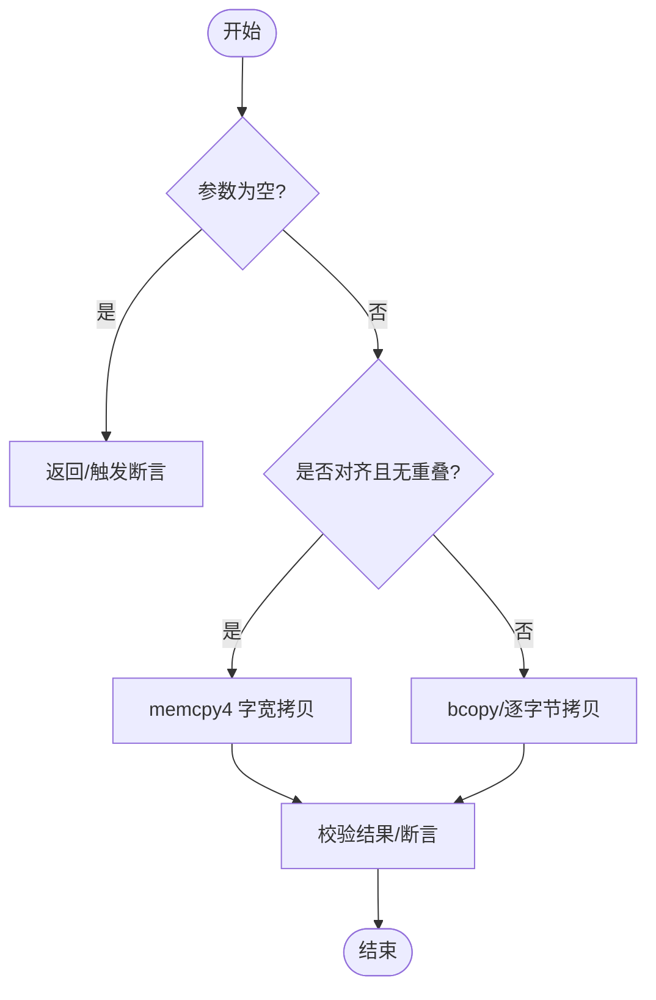
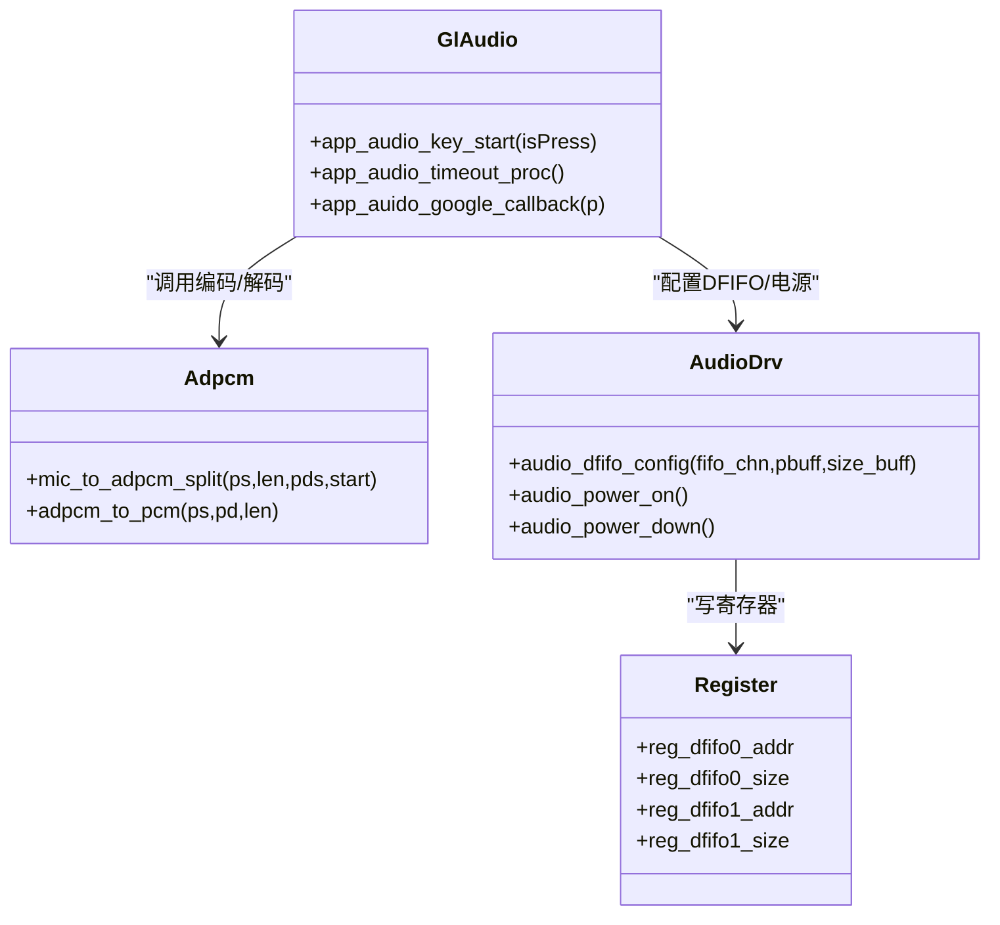
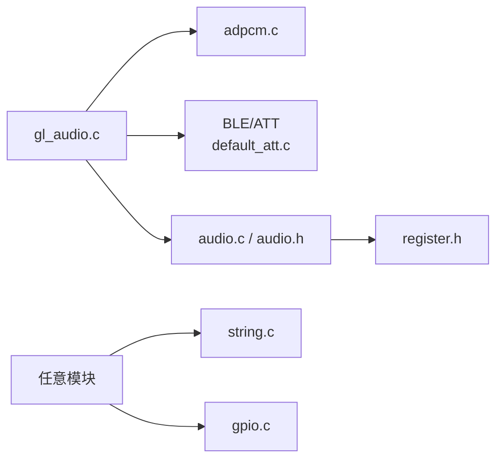

# 单元测试

<cite>
**本文引用的文件**
- [gpio.c](file://tc_ble_single_sdk/drivers/TC321X/gpio.c)
- [string.c（B85）](file://tc_ble_single_sdk/common/string.c)
- [string.c（B80）](file://8373_dongle_for_km/common/string.c)
- [adpcm.c](file://tc_ble_single_sdk/application/audio/adpcm.c)
- [gl_audio.c](file://tc_ble_single_sdk/application/audio/gl_audio.c)
- [default_att.c](file://tc_ble_single_sdk/vendor/ble_feature_test/default_att.c)
- [assert.h](file://tc_ble_single_sdk/common/assert.h)
- [audio.h（TC321X）](file://tc_ble_single_sdk/drivers/TC321X/audio.h)
- [audio.c（TC321X）](file://tc_ble_single_sdk/drivers/TC321X/audio.c)
- [register.h（音频寄存器）](file://tc_ble_single_sdk/drivers/TC321X/register.h)
- [pri2m_emi.c](file://8373_dongle_for_km/chip/B80/drivers/pri2m_emi.c)
- [.cproject（B80）](file://8373_dongle_for_km/project/tlsr_tc32/B80/.cproject)
</cite>

## 目录
1. [简介](#简介)
2. [项目结构](#项目结构)
3. [核心组件](#核心组件)
4. [架构总览](#架构总览)
5. [详细组件分析](#详细组件分析)
6. [依赖关系分析](#依赖关系分析)
7. [性能考虑](#性能考虑)
8. [故障排查指南](#故障排查指南)
9. [结论](#结论)
10. [附录](#附录)

## 简介
本技术文档面向嵌入式环境下的单元测试实践，围绕该 Telink 音频鼠标 SDK 的 GPIO 驱动、字符串处理函数、音频处理模块等关键组件，提供隔离测试方法、用例编写规范（边界条件、异常处理、性能基准）、自动化脚本与持续集成建议，以及硬件依赖模拟策略。文档基于仓库中现有代码与工程配置进行系统化梳理，帮助开发者在资源受限的 MCU 环境中高效构建可维护、可回归的测试体系。

## 项目结构
该 SDK 采用按平台与功能分层组织：
- drivers：各芯片平台的底层驱动（GPIO、音频、I2C/SPI/UART、定时器、看门狗等）
- application：应用层逻辑（USB HID、音频流、打印等）
- common：公共库（字符串、断言、类型定义）
- vendor：厂商示例与特性测试工程（BLE/2p4g 特性测试、默认 ATT 表等）
- project：各目标工程的 IDE 工程与 Makefile 配置

图表来源
- [gpio.c:93-188](file://tc_ble_single_sdk/drivers/TC321X/gpio.c#L93-L188)
- [adpcm.c:53-126](file://tc_ble_single_sdk/application/audio/adpcm.c#L53-L126)
- [default_att.c:330-426](file://tc_ble_single_sdk/vendor/ble_feature_test/default_att.c#L330-L426)

章节来源
- [gpio.c:93-188](file://tc_ble_single_sdk/drivers/TC321X/gpio.c#L93-L188)
- [default_att.c:330-426](file://tc_ble_single_sdk/vendor/ble_feature_test/default_att.c#L330-L426)

## 核心组件
- GPIO 驱动：提供引脚初始化、复用、输入使能、驱动强度、上下拉、关断、时钟探测等功能，是外设与传感器交互的基础。
- 字符串库：实现常用内存操作与字符串函数，包含对齐优化与断言校验，适合在裸机/RTOS 环境下使用。
- 音频处理：ADPCM 编解码、Google/HTT/PTT 音频模型控制、DFIFO 配置与电源管理，构成语音采集与传输链路。
- BLE 特性测试：默认 ATT 表与 OTA/HID/Battery 服务，便于通过 BLE 工具进行端到端验证。
- EMI/射频测试：私有协议与 Zigbee 模式下的发射循环与 PRBS 测试，用于射频一致性或产线测试。

章节来源
- [gpio.c:202-365](file://tc_ble_single_sdk/drivers/TC321X/gpio.c#L202-L365)
- [string.c（B85）:29-92](file://tc_ble_single_sdk/common/string.c#L29-L92)
- [adpcm.c:53-208](file://tc_ble_single_sdk/application/audio/adpcm.c#L53-L208)
- [default_att.c:330-426](file://tc_ble_single_sdk/vendor/ble_feature_test/default_att.c#L330-L426)
- [pri2m_emi.c:573-635](file://8373_dongle_for_km/chip/B80/drivers/pri2m_emi.c#L573-L635)

## 架构总览
下图展示从应用到驱动的调用链与数据流，突出音频采集、编码、BLE 通知与 DFIFO 路径。

图表来源
- [gl_audio.c:60-181](file://tc_ble_single_sdk/application/audio/gl_audio.c#L60-L181)
- [adpcm.c:53-208](file://tc_ble_single_sdk/application/audio/adpcm.c#L53-L208)
- [audio.c:194-225](file://tc_ble_single_sdk/drivers/TC321X/audio.c#L194-L225)
- [audio.h:328-435](file://tc_ble_single_sdk/drivers/TC321X/audio.h#L328-L435)
- [register.h:1011-1022](file://tc_ble_single_sdk/drivers/TC321X/register.h#L1011-L1022)
- [default_att.c:330-426](file://tc_ble_single_sdk/vendor/ble_feature_test/default_att.c#L330-L426)

## 详细组件分析

### GPIO 驱动隔离测试
- 测试目标
  - 引脚初始化与复用切换正确性
  - 输入使能、输出使能、驱动强度、上下拉设置
  - 批量关断与组级操作
  - 时钟探测引脚映射
- 隔离策略
  - 通过宏开关或配置头屏蔽非 GPIO 外设初始化，仅保留 GPIO 子系统
  - 使用虚拟负载（LED/电阻网络）或逻辑分析仪观测电平变化
  - 对 PB4-PB7、PC 组等特殊端口分别覆盖
- 用例设计要点
  - 边界条件：全开/全关、最小/最大驱动强度、无上拉/下拉
  - 异常处理：非法引脚号、重复设置、冲突复用
  - 性能基准：批量设置耗时、抖动测量
- 参考实现位置
  - 初始化与组配置：[gpio.c:93-188](file://tc_ble_single_sdk/drivers/TC321X/gpio.c#L93-L188)
  - 功能切换与输入使能：[gpio.c:202-259](file://tc_ble_single_sdk/drivers/TC321X/gpio.c#L202-L259)
  - 驱动强度与上下拉：[gpio.c:274-365](file://tc_ble_single_sdk/drivers/TC321X/gpio.c#L274-L365)
  - 批量关断与时钟探测：[gpio.c:372-466](file://tc_ble_single_sdk/drivers/TC321X/gpio.c#L372-L466)

图表来源
- [gpio.c:93-188](file://tc_ble_single_sdk/drivers/TC321X/gpio.c#L93-L188)
- [gpio.c:202-259](file://tc_ble_single_sdk/drivers/TC321X/gpio.c#L202-L259)
- [gpio.c:274-365](file://tc_ble_single_sdk/drivers/TC321X/gpio.c#L274-L365)

章节来源
- [gpio.c:93-188](file://tc_ble_single_sdk/drivers/TC321X/gpio.c#L93-L188)
- [gpio.c:202-365](file://tc_ble_single_sdk/drivers/TC321X/gpio.c#L202-L365)
- [gpio.c:372-466](file://tc_ble_single_sdk/drivers/TC321X/gpio.c#L372-L466)

### 字符串处理函数隔离测试
- 测试目标
  - memcpy/memset/memcmp/strlen/strncpy 等行为正确性
  - 对齐要求与越界保护
  - 性能对比（字节 vs 字宽拷贝）
- 隔离策略
  - 独立编译单元，不依赖外设；使用静态缓冲区或堆分配
  - 利用 assert 快速捕获未对齐或重叠访问
- 用例设计要点
  - 边界条件：长度 0、空指针、单字节、非对齐地址
  - 异常处理：重叠拷贝、超长写入、NULL 源/目的
  - 性能基准：不同长度下 memcpy4 与 memcpy 的吞吐对比
- 参考实现位置
  - B85 版本：[string.c（B85）:29-92](file://tc_ble_single_sdk/common/string.c#L29-L92)
  - B80 版本：[string.c（B80）:28-118](file://8373_dongle_for_km/common/string.c#L28-L118)
  - 断言机制：[assert.h:29-39](file://tc_ble_single_sdk/common/assert.h#L29-L39)

图表来源
- [string.c（B85）:75-92](file://tc_ble_single_sdk/common/string.c#L75-L92)
- [string.c（B80）:99-118](file://8373_dongle_for_km/common/string.c#L99-L118)
- [assert.h:29-39](file://tc_ble_single_sdk/common/assert.h#L29-L39)

章节来源
- [string.c（B85）:29-92](file://tc_ble_single_sdk/common/string.c#L29-L92)
- [string.c（B80）:28-118](file://8373_dongle_for_km/common/string.c#L28-L118)
- [assert.h:29-39](file://tc_ble_single_sdk/common/assert.h#L29-L39)

### 音频处理模块隔离测试
- 测试目标
  - ADPCM 编解码正确性与稳定性
  - Google/HTT/PTT 音频模型状态机
  - DFIFO 配置与电源管理
- 隔离策略
  - 使用固定长度的 PCM 缓冲与预置 ADPCM 码流进行闭环测试
  - 通过 BLE 特性表与 GATT 通知模拟主机侧行为
  - 使用音频驱动 API 配置 DFIFO，避免真实 ADC 参与
- 用例设计要点
  - 边界条件：首包/续包、序列号溢出、预测器边界
  - 异常处理：超时、ACK 缺失、GATT 推送失败
  - 性能基准：每帧处理时延、CPU 占用率
- 参考实现位置
  - ADPCM 编码/解码：[adpcm.c:53-208](file://tc_ble_single_sdk/application/audio/adpcm.c#L53-L208)、[adpcm.c:289-513](file://tc_ble_single_sdk/application/audio/adpcm.c#L289-L513)
  - 音频模型控制：[gl_audio.c:60-181](file://tc_ble_single_sdk/application/audio/gl_audio.c#L60-L181)、[gl_audio.c:185-355](file://tc_ble_single_sdk/application/audio/gl_audio.c#L185-L355)
  - DFIFO 与电源：[audio.c:194-225](file://tc_ble_single_sdk/drivers/TC321X/audio.c#L194-L225)、[audio.h:328-435](file://tc_ble_single_sdk/drivers/TC321X/audio.h#L328-L435)
  - 寄存器映射：[register.h:1011-1022](file://tc_ble_single_sdk/drivers/TC321X/register.h#L1011-L1022)

图表来源
- [gl_audio.c:60-181](file://tc_ble_single_sdk/application/audio/gl_audio.c#L60-L181)
- [adpcm.c:53-208](file://tc_ble_single_sdk/application/audio/adpcm.c#L53-L208)
- [audio.c:194-225](file://tc_ble_single_sdk/drivers/TC321X/audio.c#L194-L225)
- [register.h:1011-1022](file://tc_ble_single_sdk/drivers/TC321X/register.h#L1011-L1022)

章节来源
- [adpcm.c:53-208](file://tc_ble_single_sdk/application/audio/adpcm.c#L53-L208)
- [gl_audio.c:60-181](file://tc_ble_single_sdk/application/audio/gl_audio.c#L60-L181)
- [audio.c:194-225](file://tc_ble_single_sdk/drivers/TC321X/audio.c#L194-L225)
- [audio.h:328-435](file://tc_ble_single_sdk/drivers/TC321X/audio.h#L328-L435)
- [register.h:1011-1022](file://tc_ble_single_sdk/drivers/TC321X/register.h#L1011-L1022)

### BLE 特性测试与 ATT 表隔离
- 测试目标
  - 默认 ATT 表完整性（GAP/GATT/HID/Battery/OTA）
  - GATT 通知/指示的正确性
  - 通过 BLE 工具进行端到端验证
- 隔离策略
  - 仅启用必要服务，屏蔽无关特性以减少耦合
  - 使用 BLE 嗅探或手机/电脑工具作为“虚拟主机”
- 参考实现位置
  - 属性表定义与初始化：[default_att.c:330-426](file://tc_ble_single_sdk/vendor/ble_feature_test/default_att.c#L330-L426)、[default_att.c:433-436](file://tc_ble_single_sdk/vendor/ble_feature_test/default_att.c#L433-L436)

章节来源
- [default_att.c:330-426](file://tc_ble_single_sdk/vendor/ble_feature_test/default_att.c#L330-L426)
- [default_att.c:433-436](file://tc_ble_single_sdk/vendor/ble_feature_test/default_att.c#L433-L436)

### EMI/射频测试隔离
- 测试目标
  - 私有协议与 Zigbee 模式下的连续发射
  - PRBS 信号生成与功率步进
- 隔离策略
  - 通过配置宏开启测试路径，屏蔽业务逻辑
  - 使用频谱仪/功率计进行客观测量
- 参考实现位置
  - 发射循环与 PRBS：[pri2m_emi.c:573-635](file://8373_dongle_for_km/chip/B80/drivers/pri2m_emi.c#L573-L635)

章节来源
- [pri2m_emi.c:573-635](file://8373_dongle_for_km/chip/B80/drivers/pri2m_emi.c#L573-L635)

## 依赖关系分析
- 组件耦合
  - gl_audio.c 依赖 adpcm.c 与 BLE 栈（GATT），并通过 audio.c 配置 DFIFO
  - string.c 被多处通用逻辑引用，需保证 ABI 稳定
  - gpio.c 为所有外设驱动的基础，变更影响面广
- 外部依赖
  - BLE 协议栈与 ATT 表
  - 芯片寄存器与模拟寄存器
  - 调试与断言基础设施

图表来源
- [gl_audio.c:60-181](file://tc_ble_single_sdk/application/audio/gl_audio.c#L60-L181)
- [adpcm.c:53-208](file://tc_ble_single_sdk/application/audio/adpcm.c#L53-L208)
- [default_att.c:330-426](file://tc_ble_single_sdk/vendor/ble_feature_test/default_att.c#L330-L426)
- [audio.c:194-225](file://tc_ble_single_sdk/drivers/TC321X/audio.c#L194-L225)
- [register.h:1011-1022](file://tc_ble_single_sdk/drivers/TC321X/register.h#L1011-L1022)
- [string.c（B85）:29-92](file://tc_ble_single_sdk/common/string.c#L29-L92)
- [gpio.c:93-188](file://tc_ble_single_sdk/drivers/TC321X/gpio.c#L93-L188)

章节来源
- [gl_audio.c:60-181](file://tc_ble_single_sdk/application/audio/gl_audio.c#L60-L181)
- [adpcm.c:53-208](file://tc_ble_single_sdk/application/audio/adpcm.c#L53-L208)
- [default_att.c:330-426](file://tc_ble_single_sdk/vendor/ble_feature_test/default_att.c#L330-L426)
- [audio.c:194-225](file://tc_ble_single_sdk/drivers/TC321X/audio.c#L194-L225)
- [register.h:1011-1022](file://tc_ble_single_sdk/drivers/TC321X/register.h#L1011-L1022)
- [string.c（B85）:29-92](file://tc_ble_single_sdk/common/string.c#L29-L92)
- [gpio.c:93-188](file://tc_ble_single_sdk/drivers/TC321X/gpio.c#L93-L188)

## 性能考虑
- 字符串拷贝
  - 优先使用 memcpy4 进行对齐且无重叠的大块拷贝，减少循环开销
  - 对短小拷贝使用 bcopy/逐字节方式，避免分支成本
- 音频处理
  - 控制每帧大小与处理周期，确保实时性
  - 合理使用 DFIFO 与中断，降低 CPU 占用
- GPIO 操作
  - 批量配置寄存器，减少多次访问
  - 合理设置驱动强度，平衡功耗与信号质量

[本节为通用指导，无需特定文件来源]

## 故障排查指南
- 断言与调试
  - 启用 __DEBUG__ 后，assert 将输出文件与行号，便于定位
  - 结合 printf 输出关键状态（如 GATT 推送返回值、DFIFO 状态）
- 常见问题
  - GATT 推送失败：检查连接句柄、特征值句柄、缓冲区长度
  - DFIFO 溢出/欠载：核对地址与大小配置、中断清理
  - GPIO 异常：确认复用顺序（先设复用再禁 GPIO），检查上拉/下拉
- 参考位置
  - 断言宏：[assert.h:29-39](file://tc_ble_single_sdk/common/assert.h#L29-L39)
  - GATT 推送与错误处理：[gl_audio.c:95-181](file://tc_ble_single_sdk/application/audio/gl_audio.c#L95-L181)
  - DFIFO 配置与状态：[audio.c:194-225](file://tc_ble_single_sdk/drivers/TC321X/audio.c#L194-L225)、[audio.h:515-522](file://tc_ble_single_sdk/drivers/TC321X/audio.h#L515-L522)

章节来源
- [assert.h:29-39](file://tc_ble_single_sdk/common/assert.h#L29-L39)
- [gl_audio.c:95-181](file://tc_ble_single_sdk/application/audio/gl_audio.c#L95-L181)
- [audio.c:194-225](file://tc_ble_single_sdk/drivers/TC321X/audio.c#L194-L225)
- [audio.h:515-522](file://tc_ble_single_sdk/drivers/TC321X/audio.h#L515-L522)

## 结论
通过在驱动层与应用层建立清晰的隔离点，配合断言与特性测试工程，可在该 SDK 中构建稳健的单元测试体系。建议以组件为单位逐步完善用例集，覆盖边界与异常场景，并将性能基准纳入回归流程。借助工程配置与特性测试入口，可实现本地与 CI 环境的自动化执行。

[本节为总结，无需特定文件来源]

## 附录

### 测试框架选择与配置建议
- 轻量级断言与自测
  - 使用内置 assert 与自定义断言宏，在 __DEBUG__ 下输出诊断信息
  - 将测试用例封装为独立函数，通过主循环或任务调度执行
- 工程配置
  - 利用 IDE 工程中的测试配置项（如 SRAM_Test、DUT_Test、Test_Demo 等）快速切换测试固件
  - 通过宏开关裁剪非必要模块，缩小测试镜像体积

章节来源
- [.cproject（B80）:677-688](file://8373_dongle_for_km/project/tlsr_tc32/B80/.cproject#L677-L688)
- [assert.h:29-39](file://tc_ble_single_sdk/common/assert.h#L29-L39)

### 自动化测试脚本与持续集成示例
- 本地脚本
  - 编译脚本：调用 make/IDE 构建命令，输出二进制与日志
  - 烧录与运行：通过调试器或串口指令触发测试用例
  - 结果收集：解析串口输出或 LED 指示，生成报告
- CI 流水线
  - 多目标并行构建（B85/B87/TC321X）
  - 自动执行特性测试（BLE/2p4g/EMI）并归档产物
  - 失败告警与回滚策略

[本节为通用指导，无需特定文件来源]

### 硬件依赖与外部接口模拟
- GPIO 模拟
  - 使用逻辑分析仪/示波器观察波形，或用已知负载替代真实外设
- 音频模拟
  - 用 DAC/信号发生器注入 PCM，或使用内存中的预置数据绕过 ADC
- BLE 模拟
  - 使用 BLE 嗅探器或手机/电脑作为主机，构造请求/响应序列
- EMI/射频
  - 通过配置宏进入测试模式，使用频谱仪/功率计验证指标

[本节为通用指导，无需特定文件来源]