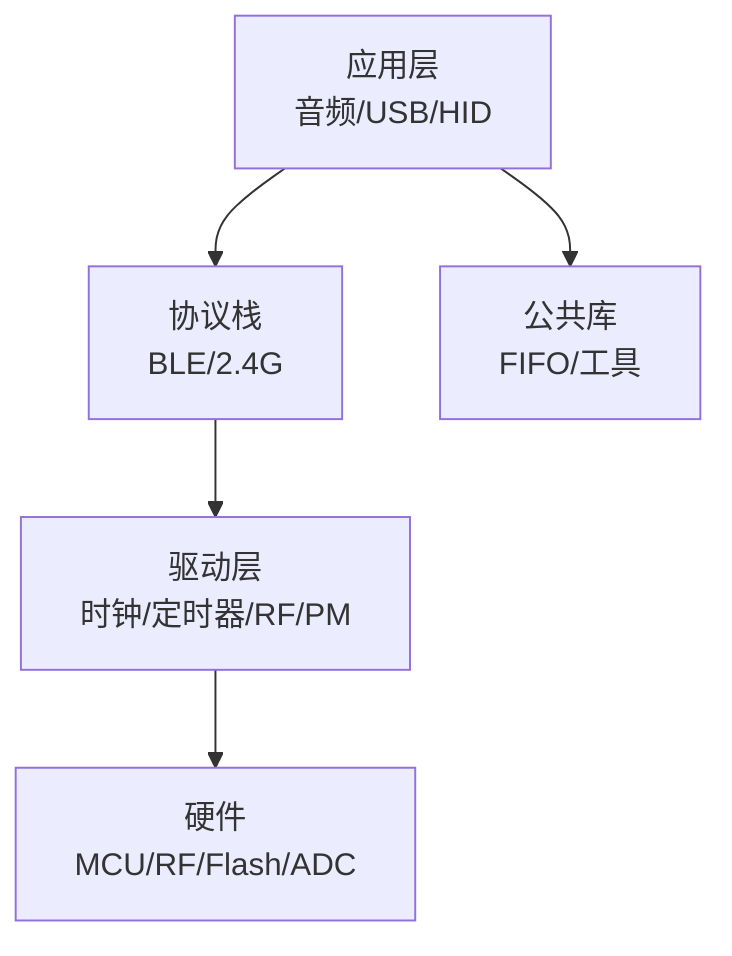
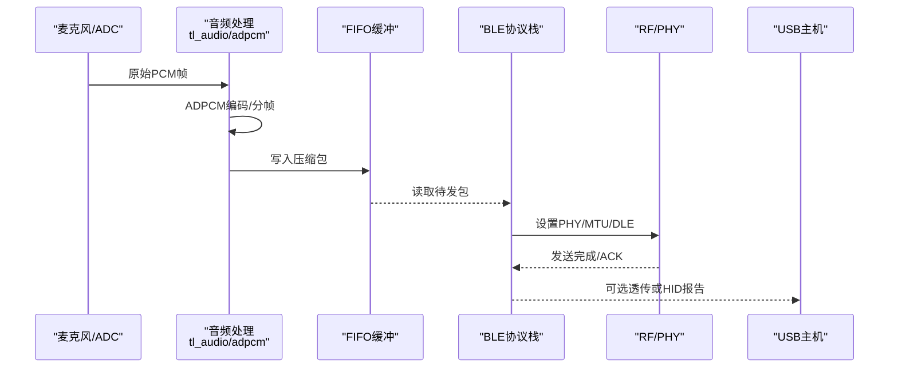
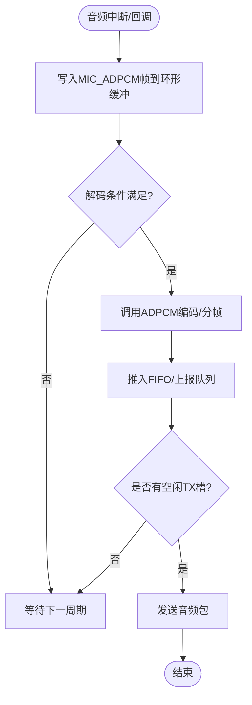
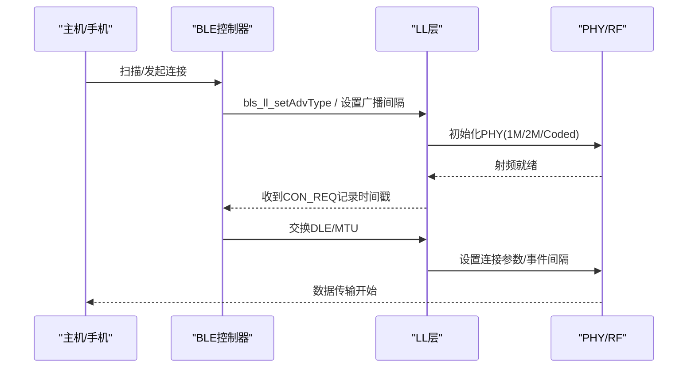
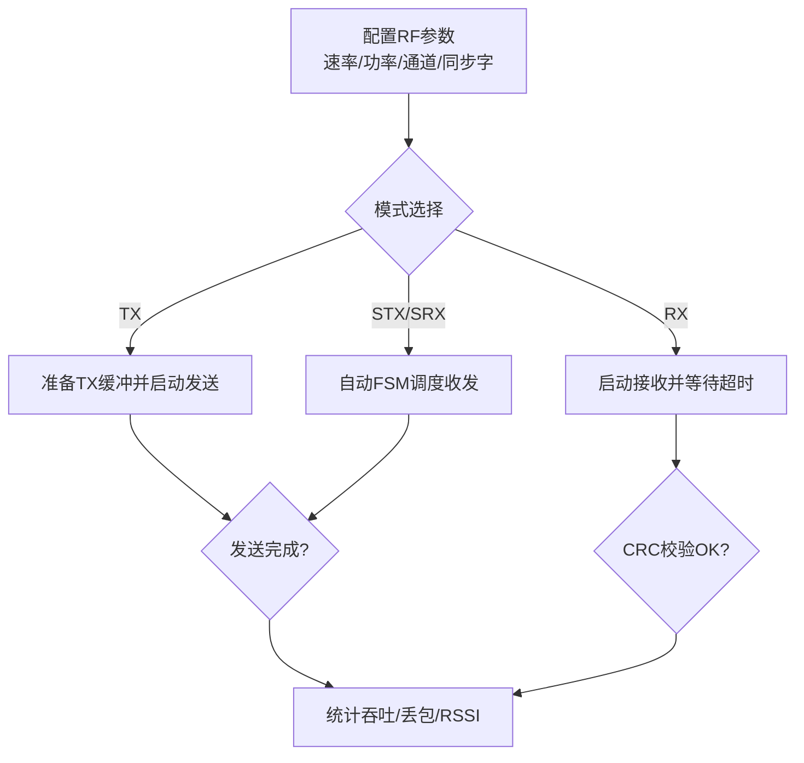
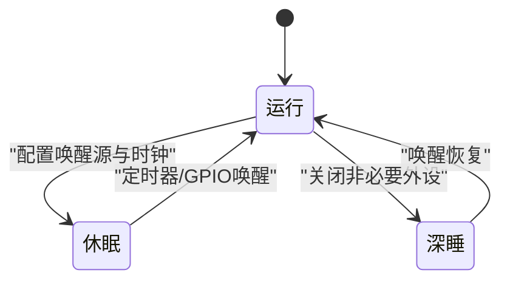
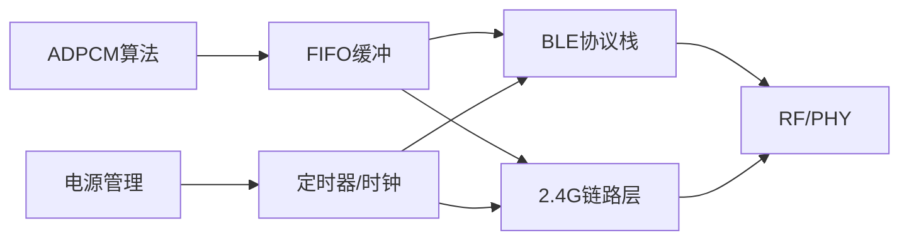

# 性能测试

<cite>
**本文引用的文件**
- [README.md](file://README.md)
- [tl_audio.c](file://tc_ble_single_sdk/application/audio/tl_audio.c)
- [adpcm.c](file://tc_ble_single_sdk/application/audio/adpcm.c)
- [audio_config.h](file://tc_ble_single_sdk/application/audio/audio_config.h)
- [gl_audio.h](file://tc_ble_single_sdk/application/audio/gl_audio.h)
- [genfsk_ll.h](file://tc_ble_single_sdk/stack/2p4g/genfsk_ll/genfsk_ll.h)
- [ll_adv.h](file://tc_ble_single_sdk/stack/ble/controller/ll/ll_adv.h)
- [hci_cmd.h](file://tc_ble_single_sdk/stack/ble/hci/hci_cmd.h)
- [ll_conn.h](file://tc_ble_single_sdk/stack/ble/controller/ll/ll_conn/ll_conn.h)
- [phy.h](file://tc_ble_single_sdk/stack/ble/controller/phy/phy.h)
- [pm.h (B85)](file://tc_ble_single_sdk/drivers/B85/lib/include/pm/pm.h)
- [pm.h (B87)](file://tc_ble_single_sdk/drivers/B87/lib/include/pm/pm.h)
- [timer.h (B85)](file://tc_ble_single_sdk/drivers/B85/timer.h)
- [timer.h (B87)](file://tc_ble_single_sdk/drivers/B87/timer.h)
- [stimer.h (TC321X)](file://tc_ble_single_sdk/drivers/TC321X/lib/include/stimer.h)
- [clock.c (TC321X)](file://tc_ble_single_sdk/drivers/TC321X/clock.c)
- [utility.h](file://tc_ble_single_sdk/common/utility.h)
- [utility.c](file://tc_ble_single_sdk/common/utility.c)
</cite>

## 目录
1. [简介](#简介)
2. [项目结构](#项目结构)
3. [核心组件](#核心组件)
4. [架构总览](#架构总览)
5. [详细组件分析](#详细组件分析)
6. [依赖关系分析](#依赖关系分析)
7. [性能考量与优化建议](#性能考量与优化建议)
8. [故障排查指南](#故障排查指南)
9. [结论](#结论)
10. [附录：基准建立与测试用例](#附录：基准建立与测试用例)

## 简介
本技术文档面向Telink三模音频鼠标SDK（B85/B87/TC321x）的性能测试与优化，覆盖以下关键指标与方法：
- CPU利用率、内存使用、启动时间、响应延迟
- 音频处理性能：ADPCM编解码效率、音频延迟测量、吞吐量测试
- 无线通信性能：BLE连接建立时间、数据传输速率、2.4G通信稳定性测试
- 功耗测试：电池续航、低功耗模式验证
- 性能基准建立与持续优化建议

本SDK支持BLE、USB、2.4G三种工作模式，并内置ADPCM音频链路、FIFO缓冲、定时器/时钟与电源管理API，为系统级性能测试提供了丰富的可观测点与可调参数。

## 项目结构
该SDK按功能分层组织：
- 应用层：音频处理（ADPCM/GATT/Google协议）、USB设备类、键盘/鼠标HID等
- 协议栈：BLE主机/控制器、2.4G通用FSK链路层
- 驱动层：各芯片平台（B85/B87/TC321x）的时钟、定时器、RF、PM、DMA、ADC等
- 公共库：FIFO、工具函数、版本信息等

**章节来源**
- [README.md:1-231](file://README.md#L1-L231)

## 核心组件
- 音频链路：ADPCM编解码、音频缓冲与打包、不同音频模式配置
- 无线链路：BLE连接与PHY、2.4G FSK收发、数据长度协商
- 时间与计时：系统定时器、微秒延时、超时判断
- 电源管理：多种休眠/唤醒模式、唤醒源配置
- 数据缓冲：环形FIFO用于音频/命令/数据包

**章节来源**
- [tl_audio.c:822-1252](file://tc_ble_single_sdk/application/audio/tl_audio.c#L822-L1252)
- [adpcm.c:29-256](file://tc_ble_single_sdk/application/audio/adpcm.c#L29-L256)
- [audio_config.h:28-123](file://tc_ble_single_sdk/application/audio/audio_config.h#L28-L123)
- [genfsk_ll.h:110-458](file://tc_ble_single_sdk/stack/2p4g/genfsk_ll/genfsk_ll.h#L110-L458)
- [ll_adv.h:164-175](file://tc_ble_single_sdk/stack/ble/controller/ll/ll_adv.h#L164-L175)
- [hci_cmd.h:191-263](file://tc_ble_single_sdk/stack/ble/hci/hci_cmd.h#L191-L263)
- [ll_conn.h:28-68](file://tc_ble_single_sdk/stack/ble/controller/ll/ll_conn/ll_conn.h#L28-L68)
- [phy.h:30-62](file://tc_ble_single_sdk/stack/ble/controller/phy/phy.h#L30-L62)
- [utility.h:166-182](file://tc_ble_single_sdk/common/utility.h#L166-L182)
- [utility.c:85-166](file://tc_ble_single_sdk/common/utility.c#L85-L166)

## 架构总览
下图展示从音频采集到无线传输的关键路径，以及可用于性能测量的关键点（如ADPCM编码、FIFO入队、BLE/2.4G发送、定时器采样）。

**图表来源**
- [tl_audio.c:822-1252](file://tc_ble_single_sdk/application/audio/tl_audio.c#L822-L1252)
- [adpcm.c:29-256](file://tc_ble_single_sdk/application/audio/adpcm.c#L29-L256)
- [utility.h:166-182](file://tc_ble_single_sdk/common/utility.h#L166-L182)
- [phy.h:30-62](file://tc_ble_single_sdk/stack/ble/controller/phy/phy.h#L30-L62)

## 详细组件分析

### 音频处理性能（ADPCM编解码、延迟、吞吐）
- 编解码实现：ADPCM编码器将PCM帧压缩为固定长度的包，适配不同音频模式（Google v0.4/v1.0、Telink GATT、HID等），通过宏定义控制包长、单元大小与缓冲区尺寸。
- 缓冲与调度：音频输入以环形缓冲方式进入，解码侧根据读/写指针差值触发解码；USB/空中接口周期性取数，避免溢出与欠载。
- 关键可调参数：包长、单位样本数、缓冲深度、超时复位阈值、是否启用多包/批量发送。

**图表来源**
- [tl_audio.c:822-1252](file://tc_ble_single_sdk/application/audio/tl_audio.c#L822-L1252)
- [adpcm.c:29-256](file://tc_ble_single_sdk/application/audio/adpcm.c#L29-L256)
- [audio_config.h:28-123](file://tc_ble_single_sdk/application/audio/audio_config.h#L28-L123)

**章节来源**
- [tl_audio.c:822-1252](file://tc_ble_single_sdk/application/audio/tl_audio.c#L822-L1252)
- [adpcm.c:29-256](file://tc_ble_single_sdk/application/audio/adpcm.c#L29-L256)
- [audio_config.h:28-123](file://tc_ble_single_sdk/application/audio/audio_config.h#L28-L123)

### BLE通信性能（连接建立时间、数据传输速率）
- 连接建立时间：可通过获取接收到的CON_REQ时间戳来评估从广播到连接的时延；结合广播间隔配置影响首次发现与连接速度。
- 数据传输速率：通过PHY选择（1M/2M/Coded）、DLE（数据长度扩展）和MTU交换决定有效吞吐；同时受连接事件间隔与负载影响。
- 关键API与枚举：广播间隔枚举、PHY设置、数据长度交换、连接句柄管理等。

**图表来源**
- [ll_adv.h:164-175](file://tc_ble_single_sdk/stack/ble/controller/ll/ll_adv.h#L164-L175)
- [hci_cmd.h:191-263](file://tc_ble_single_sdk/stack/ble/hci/hci_cmd.h#L191-L263)
- [phy.h:30-62](file://tc_ble_single_sdk/stack/ble/controller/phy/phy.h#L30-L62)
- [ll_conn.h:28-68](file://tc_ble_single_sdk/stack/ble/controller/ll/ll_conn/ll_conn.h#L28-L68)

**章节来源**
- [ll_adv.h:164-175](file://tc_ble_single_sdk/stack/ble/controller/ll/ll_adv.h#L164-L175)
- [hci_cmd.h:191-263](file://tc_ble_single_sdk/stack/ble/hci/hci_cmd.h#L191-L263)
- [phy.h:30-62](file://tc_ble_single_sdk/stack/ble/controller/phy/phy.h#L30-L62)
- [ll_conn.h:28-68](file://tc_ble_single_sdk/stack/ble/controller/ll/ll_conn/ll_conn.h#L28-L68)

### 2.4G通信稳定性与吞吐
- 链路层能力：支持固定/可变载荷格式、CRC校验、同步字长度、预同步/后同步定时、自动FSM（单发/单收/收发切换）等，便于构建高可靠低时延链路。
- 速率与功率：提供多种调制指数、数据速率（250k/500k/1M/2M）与发射功率档位，可根据环境与功耗需求调优。
- 稳定性指标：RSSI瞬时值与包级RSSI、CRC通过率、丢包率、重传策略（若上层实现）。

**图表来源**
- [genfsk_ll.h:110-458](file://tc_ble_single_sdk/stack/2p4g/genfsk_ll/genfsk_ll.h#L110-L458)

**章节来源**
- [genfsk_ll.h:110-458](file://tc_ble_single_sdk/stack/2p4g/genfsk_ll/genfsk_ll.h#L110-L458)

### 功耗测试与低功耗模式验证
- 睡眠模式：支持Suspend、DeepSleep、DeepSleep Retention、Shutdown等模式，配合32K RC或外部晶振的唤醒定时器。
- 唤醒源：GPIO、定时器、比较器、MDEC等，可在不同模式下组合使用以降低静态电流。
- 测试要点：记录进入/退出睡眠的耗时、平均电流、唤醒成功率、外设状态保持情况。

**图表来源**
- [pm.h (B85):66-332](file://tc_ble_single_sdk/drivers/B85/lib/include/pm/pm.h#L66-L332)
- [pm.h (B87):89-149](file://tc_ble_single_sdk/drivers/B87/lib/include/pm/pm.h#L89-L149)

**章节来源**
- [pm.h (B85):66-332](file://tc_ble_single_sdk/drivers/B85/lib/include/pm/pm.h#L66-L332)
- [pm.h (B87):89-149](file://tc_ble_single_sdk/drivers/B87/lib/include/pm/pm.h#L89-L149)

### 时间测量与延迟分析
- 系统定时器：提供手动模式使能、32K跟踪计数、捕获/比较等功能，适合高精度时延测量。
- 微秒延时与超时：提供sleep_us、clock_time_exceed等接口，便于在关键路径打点。
- 典型用法：在音频编码前后、FIFO入队/出队、RF发送/接收处插入时间戳，计算端到端延迟分布。

**章节来源**
- [stimer.h (TC321X):194-324](file://tc_ble_single_sdk/drivers/TC321X/lib/include/stimer.h#L194-L324)
- [timer.h (B85):107-143](file://tc_ble_single_sdk/drivers/B85/timer.h#L107-L143)
- [timer.h (B87):103-144](file://tc_ble_single_sdk/drivers/B87/timer.h#L103-L144)
- [clock.c (TC321X):1-30](file://tc_ble_single_sdk/drivers/TC321X/clock.c#L1-L30)

### 内存与缓冲管理（FIFO）
- 环形FIFO：统一的数据缓冲抽象，支持push/pop/get/重置、数量查询，适用于音频包、命令包、应用数据。
- 对齐与DMA：部分宏提供对齐与DMA友好长度计算，减少拷贝开销。
- 性能关注：避免频繁扩容/缩容，合理设置包大小与队列深度，降低CPU占用与抖动。

**章节来源**
- [utility.h:166-182](file://tc_ble_single_sdk/common/utility.h#L166-L182)
- [utility.c:85-166](file://tc_ble_single_sdk/common/utility.c#L85-L166)

## 依赖关系分析
- 音频模块依赖ADPCM算法与配置宏，输出至FIFO并由上层协议栈消费。
- BLE/2.4G模块依赖底层RF驱动与时钟/定时器，提供稳定可靠的空中接口。
- PM模块与定时器紧密耦合，确保低功耗下的精确唤醒与恢复。
- FIFO作为跨模块共享缓冲，降低耦合度并提升吞吐。

**图表来源**
- [adpcm.c:29-256](file://tc_ble_single_sdk/application/audio/adpcm.c#L29-L256)
- [utility.h:166-182](file://tc_ble_single_sdk/common/utility.h#L166-L182)
- [phy.h:30-62](file://tc_ble_single_sdk/stack/ble/controller/phy/phy.h#L30-L62)
- [genfsk_ll.h:110-458](file://tc_ble_single_sdk/stack/2p4g/genfsk_ll/genfsk_ll.h#L110-L458)
- [stimer.h (TC321X):194-324](file://tc_ble_single_sdk/drivers/TC321X/lib/include/stimer.h#L194-L324)

**章节来源**
- [adpcm.c:29-256](file://tc_ble_single_sdk/application/audio/adpcm.c#L29-L256)
- [utility.h:166-182](file://tc_ble_single_sdk/common/utility.h#L166-L182)
- [phy.h:30-62](file://tc_ble_single_sdk/stack/ble/controller/phy/phy.h#L30-L62)
- [genfsk_ll.h:110-458](file://tc_ble_single_sdk/stack/2p4g/genfsk_ll/genfsk_ll.h#L110-L458)
- [stimer.h (TC321X):194-324](file://tc_ble_single_sdk/drivers/TC321X/lib/include/stimer.h#L194-L324)

## 性能考量与优化建议
- 音频链路
  - 调整ADPCM包长与缓冲深度，平衡延迟与CPU占用；在高负载场景适当增大缓冲以避免欠载。
  - 利用RAM代码段执行关键路径（如abuf_dec_usb），减少访存开销。
  - 根据电量自适应语音时长限制，降低峰值功耗。
- BLE通信
  - 使用2M PHY提升吞吐；在弱信号环境考虑Coded PHY提高灵敏度。
  - 合理设置广播间隔与连接事件间隔，兼顾连接速度与功耗。
  - 启用DLE与MTU交换，最大化单次事件数据量。
- 2.4G通信
  - 根据距离与干扰选择合适速率与调制指数；必要时增加前导码长度提升鲁棒性。
  - 使用自动FSM减少CPU干预，降低时延抖动。
  - 监控RSSI与CRC通过率，动态调整信道/功率。
- 功耗
  - 在无任务时进入DeepSleep，仅保留必要唤醒源；缩短唤醒恢复时间。
  - 关闭未使用的外设与打印输出，减少额外功耗。
- 时间测量
  - 在关键路径使用高精度定时器打点，统计P95/P99延迟；定位热点函数。
  - 使用clock_time_exceed进行超时保护，防止阻塞。

[本节为通用指导，不直接分析具体文件]

## 故障排查指南
- 音频卡顿/爆音
  - 检查FIFO是否溢出/欠载，调整缓冲深度与发送频率。
  - 确认ADPCM编码是否及时，避免长时间阻塞。
- BLE连接慢/不稳定
  - 检查广播间隔与PHY设置；确认MTU/DLE协商成功。
  - 观察RSSI与干扰，必要时切换信道或降低速率。
- 2.4G丢包/误码
  - 检查CRC配置与前导码长度；调整调制指数与功率。
  - 使用自动FSM并确保tx/rx settle时间足够。
- 功耗异常
  - 确认睡眠模式与唤醒源配置正确；检查外设是否在睡眠前关闭。
  - 测量唤醒耗时，优化恢复流程。

**章节来源**
- [tl_audio.c:822-1252](file://tc_ble_single_sdk/application/audio/tl_audio.c#L822-L1252)
- [genfsk_ll.h:110-458](file://tc_ble_single_sdk/stack/2p4g/genfsk_ll/genfsk_ll.h#L110-L458)
- [pm.h (B85):66-332](file://tc_ble_single_sdk/drivers/B85/lib/include/pm/pm.h#L66-L332)
- [pm.h (B87):89-149](file://tc_ble_single_sdk/drivers/B87/lib/include/pm/pm.h#L89-L149)

## 结论
该SDK在音频、无线与功耗方面提供了完善的底层能力与可调参数。通过合理的缓冲设计、PHY/速率配置、睡眠策略与时间测量，可以系统性地建立性能基准并持续优化。建议在量产前完成多维度基准测试，并将关键指标纳入回归测试。

[本节为总结，不直接分析具体文件]

## 附录：基准建立与测试用例

### 基准指标与目标
- CPU利用率：在典型负载（语音+鼠标移动）下，CPU占用不超过阈值（例如<70%）
- 内存使用：峰值堆/栈使用低于安全水位（预留20%余量）
- 启动时间：冷启动到可操作时间（例如<500ms）
- 响应延迟：按键/移动端到端延迟P95/P99（例如<20ms/<30ms）
- 音频延迟：编码+传输+解码端到端延迟（例如<40ms）
- 吞吐：BLE/2.4G有效吞吐（例如BLE 2M > X KB/s，2.4G > Y KB/s）
- 功耗：待机/活动电流与电池续航（例如待机<10uA，续航>10小时）

### 测试方法与步骤
- CPU与内存
  - 使用系统计数器或调试接口统计中断/任务占用；监控堆栈水位。
  - 在音频编码、FIFO操作、RF发送前后打点，识别热点。
- 启动时间
  - 从复位到第一个HID报告/音频流可用的时间；多次采样取均值与方差。
- 响应延迟
  - 在按键/移动触发处打点，在主机侧接收处打点，计算往返延迟。
- 音频延迟与吞吐
  - 在ADPCM编码前后、FIFO入队/出队、RF发送处打点；统计端到端延迟分布。
  - 通过连续发送大包/小包测量吞吐，记录丢包率与重传次数。
- BLE连接建立时间
  - 记录从广播到CON_REQ的时间戳差；改变广播间隔与PHY对比。
- 2.4G稳定性
  - 在不同距离/干扰环境下，统计CRC通过率、RSSI分布、重传率。
- 功耗
  - 使用电流表/功耗分析仪记录各模式电流；验证DeepSleep唤醒成功率与耗时。

### 工具与接口
- 定时器/时钟：stimer_enable、clock_time、clock_time_exceed、sleep_us
- BLE：bls_ll_getConnectionCreateTime、blc_ll_setPhy、blc_ll_exchangeDataLength
- 2.4G：gen_fsk_*系列API（速率、功率、CRC、FSM）
- 电源管理：cpu_sleep_wakeup_*、pm_set_wakeup_src、pm_get_wakeup_src
- FIFO：my_fifo_*系列接口

**章节来源**
- [stimer.h (TC321X):194-324](file://tc_ble_single_sdk/drivers/TC321X/lib/include/stimer.h#L194-L324)
- [timer.h (B85):107-143](file://tc_ble_single_sdk/drivers/B85/timer.h#L107-L143)
- [timer.h (B87):103-144](file://tc_ble_single_sdk/drivers/B87/timer.h#L103-L144)
- [ll_adv.h:164-175](file://tc_ble_single_sdk/stack/ble/controller/ll/ll_adv.h#L164-L175)
- [phy.h:30-62](file://tc_ble_single_sdk/stack/ble/controller/phy/phy.h#L30-L62)
- [ll_conn.h:28-68](file://tc_ble_single_sdk/stack/ble/controller/ll/ll_conn/ll_conn.h#L28-L68)
- [genfsk_ll.h:110-458](file://tc_ble_single_sdk/stack/2p4g/genfsk_ll/genfsk_ll.h#L110-L458)
- [pm.h (B85):66-332](file://tc_ble_single_sdk/drivers/B85/lib/include/pm/pm.h#L66-L332)
- [pm.h (B87):89-149](file://tc_ble_single_sdk/drivers/B87/lib/include/pm/pm.h#L89-L149)
- [utility.h:166-182](file://tc_ble_single_sdk/common/utility.h#L166-L182)