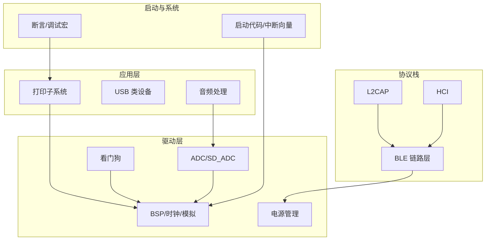
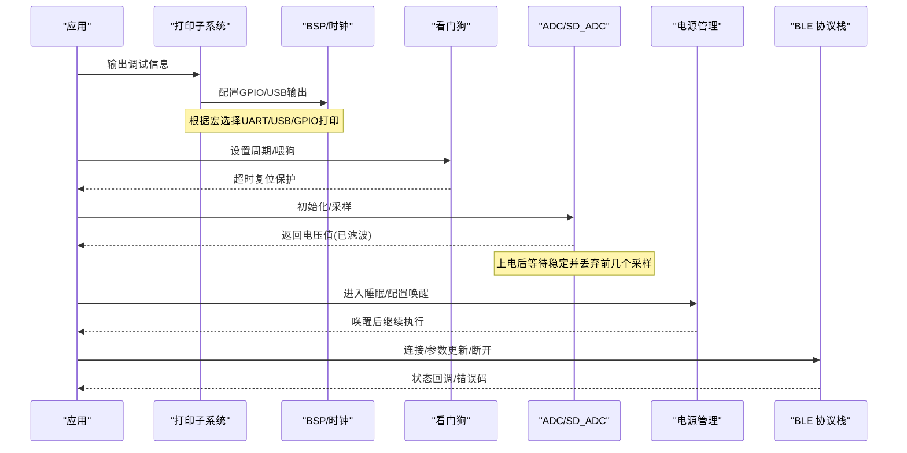
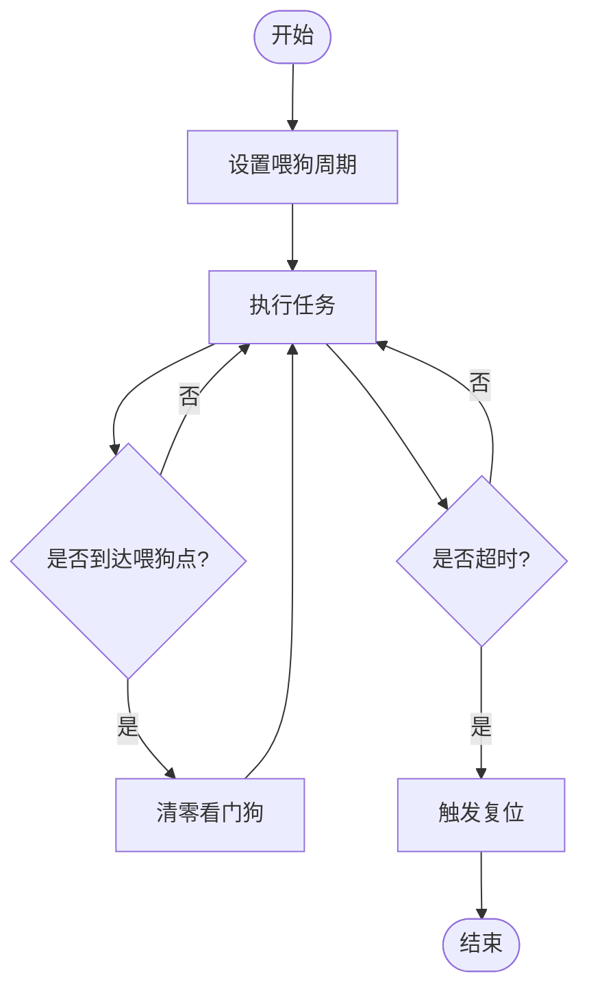
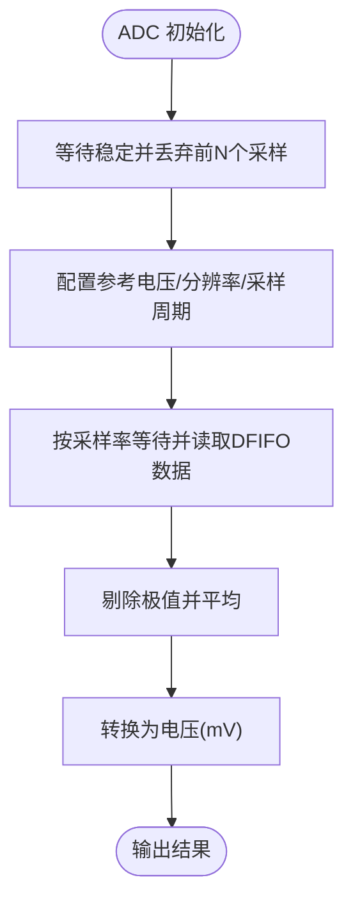
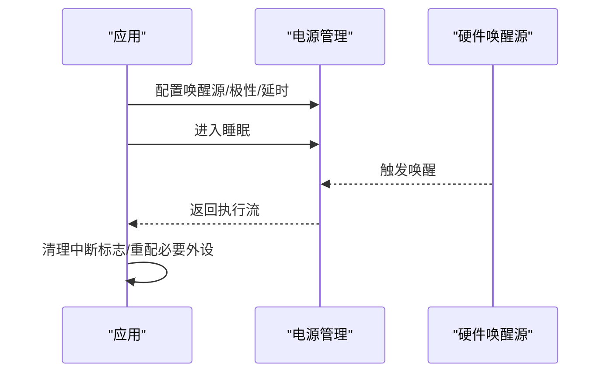
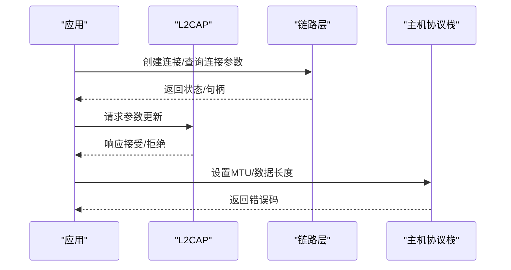
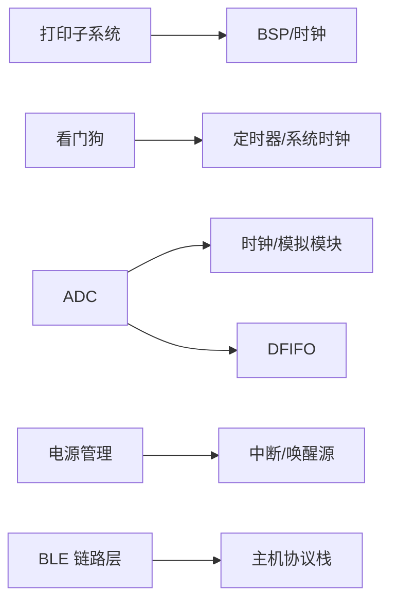

# 故障排除

<cite>
**本文引用的文件**
- [watchdog.c](file://tc_ble_single_sdk/drivers/B85/watchdog.c)
- [watchdog.h](file://tc_ble_single_sdk/drivers/B85/watchdog.h)
- [adc.c](file://tc_ble_single_sdk/drivers/B85/adc.c)
- [sd_adc.h](file://tc_ble_single_sdk/drivers/TC321X/lib/include/sd_adc.h)
- [assert.h](file://tc_ble_single_sdk/common/assert.h)
- [putchar.c](file://tc_ble_single_sdk/application/print/putchar.c)
- [u_printf.h](file://tc_ble_single_sdk/application/print/u_printf.h)
- [printf.h](file://8373_dongle_for_km/chip/B80/drivers/printf.h)
- [printf.c](file://8373_dongle_for_km/chip/B80/drivers/printf.c)
- [bsp.c](file://tc_ble_single_sdk/drivers/B85/bsp.c)
- [pm.h](file://tc_ble_single_sdk/drivers/TC321X/lib/include/pm/pm.h)
- [ll_conn.h](file://tc_ble_single_sdk/stack/ble/controller/ll/ll_conn/ll_conn.h)
- [l2cap.h](file://tc_ble_single_sdk/stack/ble/host/l2cap/l2cap.h)
- [hci_cmd.h](file://tc_ble_single_sdk/stack/ble/hci/hci_cmd.h)
- [cstartup_825x.S](file://tc_ble_single_sdk/boot/B85/cstartup_825x.S)
- [cstartup_TC321X.S](file://tc_ble_single_sdk/boot/TC321x/cstartup_TC321X.S)
- [tl_tpll_util.h](file://tc_ble_single_sdk/stack/2p4g/tl_tpll/tl_tpll_util.h)
- [SDK_Wiki.md](file://doc/SDK_Wiki.md)
- [telink_b85m_triple_mode_audio_mouse_sdk_Release_Note .md](file://telink_b85m_triple_mode_audio_mouse_sdk_Release_Note .md)
</cite>

## 目录
1. [简介](#简介)
2. [项目结构](#项目结构)
3. [核心组件](#核心组件)
4. [架构总览](#架构总览)
5. [详细组件分析](#详细组件分析)
6. [依赖关系分析](#依赖关系分析)
7. [性能注意事项](#性能注意事项)
8. [故障排除指南](#故障排除指南)
9. [结论](#结论)
10. [附录](#附录)

## 简介
本故障排除文档面向 Telink 音频鼠标 SDK（B85/B87/B80）的开发者与测试工程师，聚焦编译错误、运行时崩溃、通信失败、性能问题等常见场景的诊断流程与解决方案。文档重点说明：
- 如何使用日志系统进行问题定位（含输出通道选择、调试宏开关、关键信息记录与现场保留）
- 看门狗的使用与异常恢复机制
- 硬件相关问题排查（ADC 采样异常、电源管理、外设初始化失败）
- 标准问题报告格式与调试信息收集方法

## 项目结构
本项目采用分层组织：应用层（audio/usb/keyboard/print）、协议栈（BLE/2.4G）、驱动层（各芯片平台 B85/B87/TC321X）、启动代码与公共工具。故障排除需关注以下关键路径：
- 打印与断言：application/print、common/assert、chip/B80/drivers/printf
- 看门狗：drivers/B85/watchdog
- ADC 与 SD_ADC：drivers/B85/adc.c、drivers/TC321X/lib/include/sd_adc.h
- 电源管理与唤醒：drivers/TC321X/lib/include/pm/pm.h
- BLE 连接与参数：stack/ble/controller/ll、stack/ble/host/l2cap、stack/ble/hci
- 启动与复位向量：boot/B85/cstartup_825x.S、boot/TC321x/cstartup_TC321X.S

图表来源
- [putchar.c:95-197](file://tc_ble_single_sdk/application/print/putchar.c#L95-L197)
- [u_printf.h:24-41](file://tc_ble_single_sdk/application/print/u_printf.h#L24-L41)
- [printf.h:24-60](file://8373_dongle_for_km/chip/B80/drivers/printf.h#L24-L60)
- [watchdog.h:29-66](file://tc_ble_single_sdk/drivers/B85/watchdog.h#L29-L66)
- [adc.c:293-324](file://tc_ble_single_sdk/drivers/B85/adc.c#L293-L324)
- [pm.h:265-319](file://tc_ble_single_sdk/drivers/TC321X/lib/include/pm/pm.h#L265-L319)
- [cstartup_825x.S:74-106](file://tc_ble_single_sdk/boot/B85/cstartup_825x.S#L74-L106)

章节来源
- [putchar.c:95-197](file://tc_ble_single_sdk/application/print/putchar.c#L95-L197)
- [u_printf.h:24-41](file://tc_ble_single_sdk/application/print/u_printf.h#L24-L41)
- [printf.h:24-60](file://8373_dongle_for_km/chip/B80/drivers/printf.h#L24-L60)
- [watchdog.h:29-66](file://tc_ble_single_sdk/drivers/B85/watchdog.h#L29-L66)
- [adc.c:293-324](file://tc_ble_single_sdk/drivers/B85/adc.c#L293-L324)
- [pm.h:265-319](file://tc_ble_single_sdk/drivers/TC321X/lib/include/pm/pm.h#L265-L319)
- [cstartup_825x.S:74-106](file://tc_ble_single_sdk/boot/B85/cstartup_825x.S#L74-L106)

## 核心组件
- 日志与断言
  - 通过 u_printf/printf 将调试信息输出到 UART 或 USB；支持 GPIO 模拟 UART 打印
  - 断言在调试构建下输出文件与行号，便于快速定位
- 看门狗
  - 设置喂狗周期并启停/清零，用于捕获死锁与长时间阻塞
- ADC/SD_ADC
  - 提供初始化、参考电压配置、采样率设置、数据滤波与电压换算
  - SD_ADC 上电后需等待稳定时间并丢弃前若干采样
- 电源管理
  - 支持 suspend/deep 睡眠与多种唤醒源，可配置唤醒极性与时序参数
- BLE 协议栈
  - 提供连接建立、断开、参数更新、MTU 与数据长度协商等接口
- 启动与复位
  - 中断向量表、复位入口、挂起入口，配合调试 GPIO 标记复位原因

章节来源
- [assert.h:24-83](file://tc_ble_single_sdk/common/assert.h#L24-L83)
- [watchdog.c:26-43](file://tc_ble_single_sdk/drivers/B85/watchdog.c#L26-L43)
- [watchdog.h:29-66](file://tc_ble_single_sdk/drivers/B85/watchdog.h#L29-L66)
- [adc.c:293-516](file://tc_ble_single_sdk/drivers/B85/adc.c#L293-L516)
- [sd_adc.h:490-509](file://tc_ble_single_sdk/drivers/TC321X/lib/include/sd_adc.h#L490-L509)
- [pm.h:265-319](file://tc_ble_single_sdk/drivers/TC321X/lib/include/pm/pm.h#L265-L319)
- [ll_conn.h:28-85](file://tc_ble_single_sdk/stack/ble/controller/ll/ll_conn/ll_conn.h#L28-L85)
- [l2cap.h:36-86](file://tc_ble_single_sdk/stack/ble/host/l2cap/l2cap.h#L36-L86)
- [cstartup_825x.S:74-106](file://tc_ble_single_sdk/boot/B85/cstartup_825x.S#L74-L106)

## 架构总览
下图展示从应用打印到驱动输出的调用链，以及看门狗、ADC、电源管理与 BLE 协议栈之间的交互关系。

图表来源
- [putchar.c:95-197](file://tc_ble_single_sdk/application/print/putchar.c#L95-L197)
- [watchdog.h:29-66](file://tc_ble_single_sdk/drivers/B85/watchdog.h#L29-L66)
- [adc.c:293-516](file://tc_ble_single_sdk/drivers/B85/adc.c#L293-L516)
- [sd_adc.h:490-509](file://tc_ble_single_sdk/drivers/TC321X/lib/include/sd_adc.h#L490-L509)
- [pm.h:265-319](file://tc_ble_single_sdk/drivers/TC321X/lib/include/pm/pm.h#L265-L319)
- [l2cap.h:36-86](file://tc_ble_single_sdk/stack/ble/host/l2cap/l2cap.h#L36-L86)

## 详细组件分析

### 看门狗与异常恢复
- 功能要点
  - 设置喂狗周期（毫秒），达到捕获值时触发复位
  - 提供启动、停止、清零接口
- 使用建议
  - 在长耗时任务前后喂狗，避免误复位
  - 结合断言与日志，记录最近一次喂狗位置
- 复位与现场
  - 启动代码包含复位与挂起入口，可在复位后通过保留寄存器或调试 GPIO 标记复位原因

图表来源
- [watchdog.c:26-43](file://tc_ble_single_sdk/drivers/B85/watchdog.c#L26-L43)
- [watchdog.h:29-66](file://tc_ble_single_sdk/drivers/B85/watchdog.h#L29-L66)
- [cstartup_825x.S:74-106](file://tc_ble_single_sdk/boot/B85/cstartup_825x.S#L74-L106)

章节来源
- [watchdog.c:26-43](file://tc_ble_single_sdk/drivers/B85/watchdog.c#L26-L43)
- [watchdog.h:29-66](file://tc_ble_single_sdk/drivers/B85/watchdog.h#L29-L66)
- [cstartup_825x.S:74-106](file://tc_ble_single_sdk/boot/B85/cstartup_825x.S#L74-L106)

### ADC 采样异常排查
- 常见问题
  - 上电后前若干采样异常（需丢弃）
  - 参考电压切换后未重新校准导致读数偏差
  - 高采样率下时序不足导致丢样
- 处理流程
  - 初始化后等待稳定时间，丢弃前 N 个采样
  - 合理设置参考电压与预分频，必要时进行两点校准
  - 按采样率等待足够周期再读取 DFIFO 数据
- 数据滤波
  - 采集多组数据，剔除极值后取平均，转换为 mV

图表来源
- [adc.c:293-516](file://tc_ble_single_sdk/drivers/B85/adc.c#L293-L516)
- [sd_adc.h:490-509](file://tc_ble_single_sdk/drivers/TC321X/lib/include/sd_adc.h#L490-L509)

章节来源
- [adc.c:293-516](file://tc_ble_single_sdk/drivers/B85/adc.c#L293-L516)
- [sd_adc.h:490-509](file://tc_ble_single_sdk/drivers/TC321X/lib/include/sd_adc.h#L490-L509)

### 电源管理与唤醒异常
- 关键点
  - 支持 suspend/deep 睡眠与多种唤醒源（timer/stimer/PAD/LPC/RF）
  - 可配置唤醒极性与延时参数
  - 进入 stall 模式可由指定中断唤醒，唤醒后需清理中断标志
- 排查建议
  - 确认唤醒源配置与极性正确
  - 检查唤醒后是否需要重新配置 PM 参数（重启/深度睡眠后会丢失）
  - 对关键外设（如 ADC）在进入睡眠前关闭，避免唤醒后异常采样

图表来源
- [pm.h:265-319](file://tc_ble_single_sdk/drivers/TC321X/lib/include/pm/pm.h#L265-L319)

章节来源
- [pm.h:265-319](file://tc_ble_single_sdk/drivers/TC321X/lib/include/pm/pm.h#L265-L319)

### BLE 通信失败与参数调整
- 常见问题
  - 连接建立失败、频繁断开、参数更新被拒绝
  - MTU 不匹配导致数据发送失败
- 诊断步骤
  - 检查连接句柄有效性
  - 查询当前连接间隔、延迟、超时
  - 请求参数更新并处理响应
  - 调整 MTU 与数据长度，确保缓冲区充足
- 错误码
  - 协议栈定义 LL/L2CAP/SMP/ATT/GATT/GAP 等错误码，便于定位

图表来源
- [ll_conn.h:28-85](file://tc_ble_single_sdk/stack/ble/controller/ll/ll_conn/ll_conn.h#L28-L85)
- [l2cap.h:36-86](file://tc_ble_single_sdk/stack/ble/host/l2cap/l2cap.h#L36-L86)
- [hci_cmd.h:471-524](file://tc_ble_single_sdk/stack/ble/hci/hci_cmd.h#L471-L524)

章节来源
- [ll_conn.h:28-85](file://tc_ble_single_sdk/stack/ble/controller/ll/ll_conn/ll_conn.h#L28-L85)
- [l2cap.h:36-86](file://tc_ble_single_sdk/stack/ble/host/l2cap/l2cap.h#L36-L86)
- [hci_cmd.h:471-524](file://tc_ble_single_sdk/stack/ble/hci/hci_cmd.h#L471-L524)

### 启动与复位相关
- 启动流程
  - 复位入口、中断向量表初始化
  - 可选调试 GPIO 标记复位事件
- 挂起入口
  - 写入特定内存位置以标识挂起路径
- 建议
  - 在复位后读取保留区域或调试 GPIO 状态，辅助判断复位原因
  - 结合看门狗与断言，缩小问题范围

章节来源
- [cstartup_825x.S:74-106](file://tc_ble_single_sdk/boot/B85/cstartup_825x.S#L74-L106)
- [cstartup_TC321X.S:113-202](file://tc_ble_single_sdk/boot/TC321x/cstartup_TC321X.S#L113-L202)

## 依赖关系分析
- 打印子系统依赖 BSP 与定时器，依据系统时钟计算位间隔，保证 UART 波特率准确
- 看门狗依赖系统时钟与定时器寄存器，设置捕获值实现定时复位
- ADC 依赖时钟、模拟模块与 DFIFO，采样率影响等待时间与数据完整性
- 电源管理依赖唤醒源与中断掩码，唤醒后需清理标志并重配参数
- BLE 协议栈内部依赖链路层与主机协议栈，参数更新与 MTU 协商影响通信稳定性

图表来源
- [putchar.c:95-197](file://tc_ble_single_sdk/application/print/putchar.c#L95-L197)
- [watchdog.c:26-43](file://tc_ble_single_sdk/drivers/B85/watchdog.c#L26-L43)
- [adc.c:293-516](file://tc_ble_single_sdk/drivers/B85/adc.c#L293-L516)
- [pm.h:265-319](file://tc_ble_single_sdk/drivers/TC321X/lib/include/pm/pm.h#L265-L319)
- [ll_conn.h:28-85](file://tc_ble_single_sdk/stack/ble/controller/ll/ll_conn/ll_conn.h#L28-L85)

章节来源
- [putchar.c:95-197](file://tc_ble_single_sdk/application/print/putchar.c#L95-L197)
- [watchdog.c:26-43](file://tc_ble_single_sdk/drivers/B85/watchdog.c#L26-L43)
- [adc.c:293-516](file://tc_ble_single_sdk/drivers/B85/adc.c#L293-L516)
- [pm.h:265-319](file://tc_ble_single_sdk/drivers/TC321X/lib/include/pm/pm.h#L265-L319)
- [ll_conn.h:28-85](file://tc_ble_single_sdk/stack/ble/controller/ll/ll_conn/ll_conn.h#L28-L85)

## 性能注意事项
- 打印开销
  - UART/USB 打印在高频率下可能影响实时性，建议在关键路径减少打印或使用数组批量输出
- ADC 采样
  - 高采样率需确保等待足够周期，避免数据不完整；合理丢弃首采并滤波
- 看门狗
  - 周期过短可能导致误复位，过长则无法及时捕获死锁；结合任务调度合理喂狗
- BLE 参数
  - 连接间隔过小增加功耗，过大影响时延；根据应用场景权衡
- 电源管理
  - 频繁唤醒/睡眠会增加功耗与抖动；批量处理任务后再进入睡眠

[本节为通用指导，无需具体文件引用]

## 故障排除指南

### 编译错误
- 现象
  - 断言宏未定义或打印宏未启用导致链接错误或无输出
- 排查
  - 检查用户配置宏（如 __DEBUG__、UART_PRINT_DEBUG_ENABLE、USB_PRINT_DEBUG_ENABLE）
  - 确认 printf 与 u_printf 头文件包含与宏替换正确
- 解决
  - 启用相应宏并在构建选项中开启调试输出

章节来源
- [assert.h:24-83](file://tc_ble_single_sdk/common/assert.h#L24-L83)
- [u_printf.h:24-41](file://tc_ble_single_sdk/application/print/u_printf.h#L24-L41)
- [printf.h:24-60](file://8373_dongle_for_km/chip/B80/drivers/printf.h#L24-L60)

### 运行时崩溃
- 现象
  - 看门狗复位、断言失败、非法访问
- 排查
  - 查看断言输出（文件与行号）
  - 检查看门狗周期与喂狗逻辑
  - 利用启动代码中的调试 GPIO 或保留内存标记复位原因
- 解决
  - 修复导致长时间阻塞的代码路径
  - 完善异常分支与边界条件处理

章节来源
- [assert.h:24-83](file://tc_ble_single_sdk/common/assert.h#L24-L83)
- [watchdog.h:29-66](file://tc_ble_single_sdk/drivers/B85/watchdog.h#L29-L66)
- [cstartup_825x.S:74-106](file://tc_ble_single_sdk/boot/B85/cstartup_825x.S#L74-L106)

### 通信失败（BLE）
- 现象
  - 连接失败、频繁断开、参数更新被拒、MTU 不匹配
- 排查
  - 检查连接句柄有效性
  - 查询并记录当前连接间隔、延迟、超时
  - 请求参数更新并处理响应
  - 调整 MTU 与数据长度，确保缓冲区充足
- 解决
  - 根据设备能力协商合适的连接参数
  - 优化数据打包与分包策略

章节来源
- [ll_conn.h:28-85](file://tc_ble_single_sdk/stack/ble/controller/ll/ll_conn/ll_conn.h#L28-L85)
- [l2cap.h:36-86](file://tc_ble_single_sdk/stack/ble/host/l2cap/l2cap.h#L36-L86)
- [hci_cmd.h:471-524](file://tc_ble_single_sdk/stack/ble/hci/hci_cmd.h#L471-L524)

### 性能问题
- 现象
  - 高 CPU 占用、时延抖动、功耗异常
- 排查
  - 减少高频打印，使用批量输出
  - 合理设置 ADC 采样率与等待时间
  - 优化看门狗周期与任务调度
  - 调整 BLE 连接参数与 MTU
- 解决
  - 引入批处理与缓冲机制
  - 使用低功耗模式与休眠策略

[本节为通用指导，无需具体文件引用]

### 硬件相关问题（ADC、电源、外设初始化）
- ADC 采样异常
  - 上电后等待稳定并丢弃前若干采样
  - 参考电压切换后重新校准
  - 按采样率等待足够周期再读取
- 电源管理
  - 进入睡眠前关闭不必要的外设（如 ADC）
  - 唤醒后清理中断标志并重配 PM 参数
- 外设初始化失败
  - 检查时钟与模拟模块配置
  - 使用 BSP 命令表批量写寄存器，确保顺序与时序正确

章节来源
- [adc.c:293-516](file://tc_ble_single_sdk/drivers/B85/adc.c#L293-L516)
- [sd_adc.h:490-509](file://tc_ble_single_sdk/drivers/TC321X/lib/include/sd_adc.h#L490-L509)
- [pm.h:265-319](file://tc_ble_single_sdk/drivers/TC321X/lib/include/pm/pm.h#L265-L319)
- [bsp.c:37-107](file://tc_ble_single_sdk/drivers/B85/bsp.c#L37-L107)

### 日志系统与问题定位
- 输出通道
  - UART：通过 GPIO 模拟或硬件 UART
  - USB：当 USB 主机连接时优先使用
- 调试宏
  - 启用 UART_PRINT_DEBUG_ENABLE 或 USB_PRINT_DEBUG_ENABLE
  - 启用 __DEBUG__ 以启用断言输出
- 关键信息记录
  - 记录模块名、函数名、行号、关键变量值
  - 在关键路径前后记录状态与时间戳
- 现场保留
  - 使用保留内存或调试 GPIO 标记异常发生点
  - 结合看门狗与启动代码复位信息

章节来源
- [putchar.c:95-197](file://tc_ble_single_sdk/application/print/putchar.c#L95-L197)
- [u_printf.h:24-41](file://tc_ble_single_sdk/application/print/u_printf.h#L24-L41)
- [printf.c:24-41](file://8373_dongle_for_km/chip/B80/drivers/printf.c#L24-L41)
- [assert.h:24-83](file://tc_ble_single_sdk/common/assert.h#L24-L83)

### 看门狗使用与异常恢复
- 设置与喂狗
  - 设置喂狗周期，定期清零
  - 在长耗时任务中分段喂狗
- 异常恢复
  - 看门狗复位后，检查保留状态与调试 GPIO
  - 在应用层记录最近一次正常状态，便于回溯

章节来源
- [watchdog.c:26-43](file://tc_ble_single_sdk/drivers/B85/watchdog.c#L26-L43)
- [watchdog.h:29-66](file://tc_ble_single_sdk/drivers/B85/watchdog.h#L29-L66)
- [cstartup_825x.S:74-106](file://tc_ble_single_sdk/boot/B85/cstartup_825x.S#L74-L106)

### 问题报告标准格式与调试信息收集
- 基本信息
  - 固件版本、芯片型号、硬件版本、SDK 版本
- 复现步骤
  - 详细描述操作步骤、环境配置、期望与实际行为
- 日志与现场
  - 附上完整日志（UART/USB）
  - 记录断言输出、看门狗复位次数、关键变量快照
- 分析与验证
  - 提供最小复现代码片段路径
  - 给出已尝试的排查方法与结果

章节来源
- [telink_b85m_triple_mode_audio_mouse_sdk_Release_Note .md:1-217](file://telink_b85m_triple_mode_audio_mouse_sdk_Release_Note .md#L1-L217)

## 结论
通过系统化地利用日志、断言、看门狗与电源管理接口，结合 ADC 与 BLE 协议栈的关键配置与状态查询，可以高效定位并解决编译、运行、通信与性能问题。建议在开发早期即完善调试输出与异常恢复机制，形成标准化的问题报告流程，提升排障效率与产品可靠性。

[本节为总结性内容，无需具体文件引用]

## 附录
- 常用调试宏与接口
  - 打印：u_printf/printf、uart_putc、usb_putc
  - 断言：assert、TODO/WARN/NOTE
  - 看门狗：wd_set_interval_ms、wd_start、wd_stop、wd_clear
  - ADC：adc_init、adc_sample_and_get_result、sd_adc_power_on/off
  - 电源：cpu_sleep_wakeup_*、pm_set_wakeup_time_param、cpu_stall_wakeup
  - BLE：bls_ll_getConnectionInterval/Timeout、bls_l2cap_requestConnParamUpdate

章节来源
- [putchar.c:95-197](file://tc_ble_single_sdk/application/print/putchar.c#L95-L197)
- [assert.h:24-83](file://tc_ble_single_sdk/common/assert.h#L24-L83)
- [watchdog.h:29-66](file://tc_ble_single_sdk/drivers/B85/watchdog.h#L29-L66)
- [adc.c:293-516](file://tc_ble_single_sdk/drivers/B85/adc.c#L293-L516)
- [sd_adc.h:490-509](file://tc_ble_single_sdk/drivers/TC321X/lib/include/sd_adc.h#L490-L509)
- [pm.h:265-319](file://tc_ble_single_sdk/drivers/TC321X/lib/include/pm/pm.h#L265-L319)
- [l2cap.h:36-86](file://tc_ble_single_sdk/stack/ble/host/l2cap/l2cap.h#L36-L86)