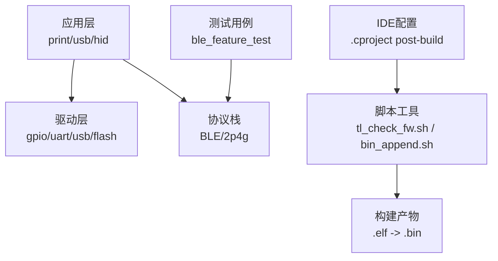
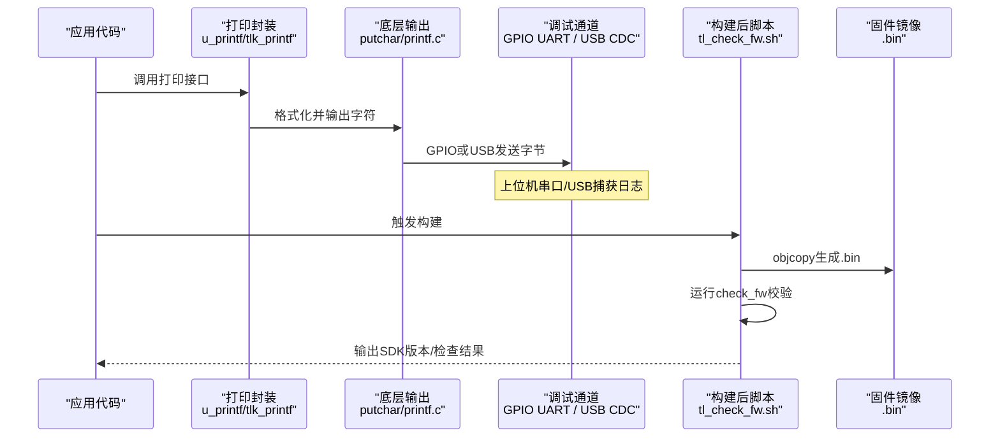
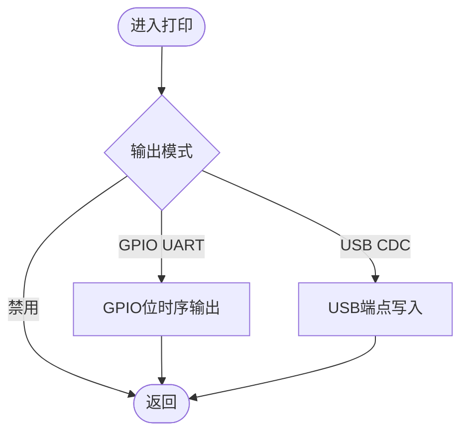
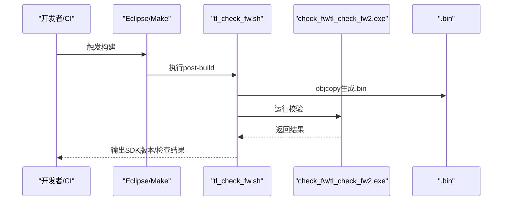
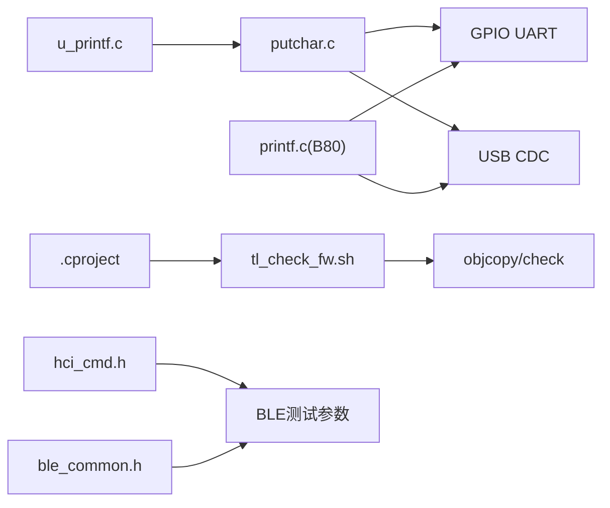

# 测试与调试

<cite>
**本文引用的文件**
- [assert.h](file://tc_ble_single_sdk/common/assert.h)
- [u_printf.c](file://tc_ble_single_sdk/application/print/u_printf.c)
- [putchar.c](file://tc_ble_single_sdk/application/print/putchar.c)
- [tlkapi_debug.c](file://tc_ble_single_sdk/vendor/common/tlkapi_debug.c)
- [printf.c](file://8373_dongle_for_km/chip/B80/drivers/printf.c)
- [printf.h](file://8373_dongle_for_km/chip/B80/drivers/printf.h)
- [driver_func_cfg.h](file://8373_dongle_for_km/chip/B80/drivers/driver_func_cfg.h)
- [.cproject (B85)](file://tc_ble_single_sdk/project/tlsr_tc32/B85/.cproject)
- [.cproject (B87)](file://tc_ble_single_sdk/project/tlsr_tc32/B87/.cproject)
- [.cproject (TC321X)](file://tc_ble_single_sdk/project/tlsr_tc32/tc321x/.cproject)
- [tl_check_fw.sh](file://tc_ble_single_sdk/script/tl_check_fw/tl_check_fw.sh)
- [bin_append.sh](file://tc_ble_single_sdk/script/bin_append_crc/bin_append.sh)
- [default_att.c](file://tc_ble_single_sdk/vendor/ble_feature_test/default_att.c)
- [flash.c](file://tc_ble_single_sdk/drivers/TC321X/flash.c)
- [hci_cmd.h](file://tc_ble_single_sdk/stack/ble/hci/hci_cmd.h)
- [ble_common.h](file://tc_ble_single_sdk/stack/ble/ble_common.h)
</cite>

## 目录
1. [简介](#简介)
2. [项目结构](#项目结构)
3. [核心组件](#核心组件)
4. [架构总览](#架构总览)
5. [详细组件分析](#详细组件分析)
6. [依赖关系分析](#依赖关系分析)
7. [性能考虑](#性能考虑)
8. [故障排除指南](#故障排除指南)
9. [结论](#结论)
10. [附录](#附录)

## 简介
本技术文档面向Telink音频鼠标SDK的测试与调试，覆盖单元测试、集成测试、系统测试的方法与工具；说明日志输出、断点调试、性能分析的使用技巧；提供常见问题诊断流程；给出硬件调试接口（JTAG/SWD）使用建议；并包含协议抓包分析与信号完整性测试方法。同时提供自动化测试脚本与持续集成的配置示例，帮助团队在本地与CI环境中高效完成质量保障。

## 项目结构
本项目采用分层组织：应用层（打印/USB/CDC/HID等）、驱动层（GPIO/UART/USB/Flash等）、协议栈（BLE/2p4g）、公共库与脚本工具。测试与调试相关的关键位置包括：
- 通用断言与编译期提示：common/assert.h
- 打印子系统：application/print/*, 8373_dongle_for_km/chip/B80/drivers/printf.*
- BLE特性测试用例：vendor/ble_feature_test/*
- 构建后校验脚本：script/tl_check_fw/*, script/bin_append_crc/*
- IDE工程配置：project/tlsr_tc32/*/ .cproject（用于绑定post-build步骤）

图表来源
- [.cproject (B85):259-260](file://tc_ble_single_sdk/project/tlsr_tc32/B85/.cproject#L259-L260)
- [.cproject (B87):178-179](file://tc_ble_single_sdk/project/tlsr_tc32/B87/.cproject#L178-L179)
- [tl_check_fw.sh:1-32](file://tc_ble_single_sdk/script/tl_check_fw/tl_check_fw.sh#L1-L32)

章节来源
- [.cproject (B85):259-260](file://tc_ble_single_sdk/project/tlsr_tc32/B85/.cproject#L259-L260)
- [.cproject (B87):178-179](file://tc_ble_single_sdk/project/tlsr_tc32/B87/.cproject#L178-L179)
- [tl_check_fw.sh:1-32](file://tc_ble_single_sdk/script/tl_check_fw/tl_check_fw.sh#L1-L32)

## 核心组件
- 断言与编译期提示：通过宏开关控制assert行为，便于开发期快速定位异常。
- 打印子系统：支持GPIO模拟UART与USB CDC两种调试输出通道，提供格式化打印与数组打印能力。
- BLE特性测试：内置HID/Battery/OTA等默认属性表，便于连接、读写、通知等集成验证。
- 构建后校验：自动将.elf转.bin并执行固件检查，提取SDK版本信息，辅助回归与发布。

章节来源
- [assert.h:29-39](file://tc_ble_single_sdk/common/assert.h#L29-L39)
- [u_printf.c:210-252](file://tc_ble_single_sdk/application/print/u_printf.c#L210-L252)
- [putchar.c:153-195](file://tc_ble_single_sdk/application/print/putchar.c#L153-L195)
- [tlkapi_debug.c:34-98](file://tc_ble_single_sdk/vendor/common/tlkapi_debug.c#L34-L98)
- [default_att.c:330-436](file://tc_ble_single_sdk/vendor/ble_feature_test/default_att.c#L330-L436)
- [tl_check_fw.sh:11-31](file://tc_ble_single_sdk/script/tl_check_fw/tl_check_fw.sh#L11-L31)

## 架构总览
下图展示从应用调用到最终输出的完整链路，以及构建后校验流程。

图表来源
- [u_printf.c:210-252](file://tc_ble_single_sdk/application/print/u_printf.c#L210-L252)
- [putchar.c:153-195](file://tc_ble_single_sdk/application/print/putchar.c#L153-L195)
- [printf.c:329-361](file://8373_dongle_for_km/chip/B80/drivers/printf.c#L329-L361)
- [tl_check_fw.sh:11-31](file://tc_ble_single_sdk/script/tl_check_fw/tl_check_fw.sh#L11-L31)

## 详细组件分析

### 断言与编译期提示
- 功能要点：
  - 通过__DEBUG__宏控制assert是否生效，未启用时为空操作，避免运行时开销。
  - 提供TODO/WARN/NOTE等编译期提示宏，便于在开发阶段标记待办与注意事项。
- 使用建议：
  - 在关键前置条件、参数合法性、状态机转换处插入assert，配合调试器快速定位。
  - 生产构建关闭assert以减小体积与提升性能。

章节来源
- [assert.h:29-81](file://tc_ble_single_sdk/common/assert.h#L29-L81)

### 打印子系统（GPIO UART / USB CDC）
- 功能要点：
  - u_printf实现轻量级格式化输出，支持%d/%x/%s等常用格式，并提供数组打印工具。
  - putchar根据宏选择GPIO模拟UART或USB CDC输出；TC321X平台不支持USB打印。
  - B80平台提供tl_printf/tl_sprintf，支持GPIO或USB输出，具备重入保护与阈值优化。
- 使用建议：
  - 开发期开启UART_PRINT_DEBUG_ENABLE或USB_PRINT_DEBUG_ENABLE，结合逻辑分析仪/示波器抓取GPIO波形。
  - 高频日志建议使用批量打印或FIFO缓冲，降低中断影响。

图表来源
- [putchar.c:153-195](file://tc_ble_single_sdk/application/print/putchar.c#L153-L195)
- [printf.c:329-361](file://8373_dongle_for_km/chip/B80/drivers/printf.c#L329-L361)

章节来源
- [u_printf.c:210-252](file://tc_ble_single_sdk/application/print/u_printf.c#L210-L252)
- [putchar.c:153-195](file://tc_ble_single_sdk/application/print/putchar.c#L153-L195)
- [printf.c:329-361](file://8373_dongle_for_km/chip/B80/drivers/printf.c#L329-L361)
- [printf.h:27-60](file://8373_dongle_for_km/chip/B80/drivers/printf.h#L27-L60)

### BLE特性测试（默认ATT表）
- 功能要点：
  - 定义GAP/GATT/Device Information/HID/Battery/OTA等服务与特征，提供标准属性表。
  - 支持客户端订阅通知、读写操作，便于连接、配对、数据交互等集成测试。
- 使用建议：
  - 使用手机或PC蓝牙工具扫描设备，验证服务发现、特征读写、通知上报。
  - 针对OTA特性进行分片写入与校验，确保升级流程稳定。

章节来源
- [default_att.c:330-436](file://tc_ble_single_sdk/vendor/ble_feature_test/default_att.c#L330-L436)

### 构建后校验与固件检查
- 功能要点：
  - 构建完成后自动将.elf转换为.bin，并在Linux/Windows下分别调用check工具进行校验。
  - 从固件末尾抽取SDK版本字符串并输出，便于追溯版本。
- 使用建议：
  - 在CI中复用该脚本，作为发布门禁；失败则阻断流水线。
  - 可结合bin_append.sh为特定产品追加CRC或签名。

图表来源
- [.cproject (B85):259-260](file://tc_ble_single_sdk/project/tlsr_tc32/B85/.cproject#L259-L260)
- [.cproject (B87):178-179](file://tc_ble_single_sdk/project/tlsr_tc32/B87/.cproject#L178-L179)
- [tl_check_fw.sh:11-31](file://tc_ble_single_sdk/script/tl_check_fw/tl_check_fw.sh#L11-L31)

章节来源
- [tl_check_fw.sh:1-32](file://tc_ble_single_sdk/script/tl_check_fw/tl_check_fw.sh#L1-L32)
- [bin_append.sh](file://tc_ble_single_sdk/script/bin_append_crc/bin_append.sh)

### Flash供应商识别（辅助调试）
- 功能要点：
  - 根据flash_mid映射到具体供应商类型，便于在不同NAND/Flash器件上适配驱动。
- 使用建议：
  - 在初始化阶段打印flash vendor，确认硬件选型与驱动匹配。

章节来源
- [flash.c:469-500](file://tc_ble_single_sdk/drivers/TC321X/flash.c#L469-L500)

## 依赖关系分析
- 打印子系统依赖：
  - u_printf依赖putchar；putchar根据平台与宏选择GPIO或USB输出；B80平台提供tl_printf直接对接底层。
- 构建链依赖：
  - .cproject配置post-build步骤调用脚本；脚本依赖objcopy与check工具。
- 协议栈常量：
  - hci_cmd.h与ble_common.h提供时间间隔、地址类型等枚举，便于测试场景参数化。

图表来源
- [u_printf.c:210-252](file://tc_ble_single_sdk/application/print/u_printf.c#L210-L252)
- [putchar.c:153-195](file://tc_ble_single_sdk/application/print/putchar.c#L153-L195)
- [printf.c:329-361](file://8373_dongle_for_km/chip/B80/drivers/printf.c#L329-L361)
- [.cproject (B85):259-260](file://tc_ble_single_sdk/project/tlsr_tc32/B85/.cproject#L259-L260)
- [hci_cmd.h:903-951](file://tc_ble_single_sdk/stack/ble/hci/hci_cmd.h#L903-L951)
- [ble_common.h:228-251](file://tc_ble_single_sdk/stack/ble/ble_common.h#L228-L251)

章节来源
- [hci_cmd.h:903-951](file://tc_ble_single_sdk/stack/ble/hci/hci_cmd.h#L903-L951)
- [ble_common.h:228-251](file://tc_ble_single_sdk/stack/ble/ble_common.h#L228-L251)

## 性能考虑
- 打印性能：
  - GPIO模拟UART在高波特率下占用CPU，建议批量输出或使用DMA/中断方式。
  - USB CDC存在端点阈值与阻塞策略，合理设置阈值可减少轮询开销。
- 构建与校验：
  - 构建后校验增加少量耗时，可在CI中并行化或仅在目标分支触发。
- 功耗与调试：
  - 调试模式下OTP/Flash可能保持激活，注意对电流测试的影响；参考驱动注释中的电流数据。

章节来源
- [driver_func_cfg.h:28-42](file://8373_dongle_for_km/chip/B80/drivers/driver_func_cfg.h#L28-L42)

## 故障排除指南
- 无法输出日志：
  - 检查是否启用UART_PRINT_DEBUG_ENABLE或USB_PRINT_DEBUG_ENABLE；确认GPIO引脚配置或USB连接状态。
  - 若使用B80平台，确认DEBUG_MODE与DEBUG_BUS配置正确。
- 断言触发：
  - 查看assert宏展开位置，结合调试器查看调用栈与变量状态。
- 构建失败：
  - 确认post-build脚本路径与权限；Linux环境需赋予check_fw执行权限。
- 固件版本缺失：
  - 检查sdk_version.c与sdk_version.h是否正确嵌入；构建后脚本会尝试从.bin中提取版本字符串。
- 协议问题：
  - 使用BLE主机工具验证服务发现与特征读写；必要时抓取HCI事件与空中包进行分析。

章节来源
- [printf.h:27-60](file://8373_dongle_for_km/chip/B80/drivers/printf.h#L27-L60)
- [assert.h:29-39](file://tc_ble_single_sdk/common/assert.h#L29-L39)
- [tl_check_fw.sh:11-31](file://tc_ble_single_sdk/script/tl_check_fw/tl_check_fw.sh#L11-L31)

## 结论
本SDK提供了完善的调试与测试基础设施：断言与编译期提示、多通道打印、BLE特性测试、构建后校验脚本与IDE集成。通过合理使用这些工具，可以高效完成单元、集成与系统级测试，并结合协议抓包与信号完整性测试手段，保障产品稳定性与可靠性。建议在CI中固化脚本与用例，形成自动化质量门禁。

## 附录

### 单元测试与集成测试方法
- 单元测试：
  - 针对打印模块、Flash识别等小粒度函数编写用例，验证边界条件与错误处理。
- 集成测试：
  - 基于默认ATT表进行BLE连接、读写、通知等端到端验证；覆盖不同主从角色与连接参数。
- 系统测试：
  - 全功能联调，包括音频、按键、鼠标、OTA等；结合功耗与稳定性压测。

### 日志输出与断点调试
- 日志：
  - 开发期开启详细日志；生产构建关闭以减少开销。
  - 使用数组打印工具输出报文，便于协议分析。
- 断点：
  - 使用JTAG/SWD在关键路径设置断点；结合寄存器与内存视图定位问题。

### 性能分析
- 使用定时器测量热点路径耗时；结合打印统计吞吐与延迟。
- 关注中断上下文中的打印与阻塞操作，避免影响实时性。

### 硬件调试接口（JTAG/SWD）
- 连接调试器至目标板SWD/JTAG引脚；配置IDE调试会话。
- 下载程序后，设置断点并单步执行；观察外设寄存器与内存变化。

### 协议抓包与信号完整性
- 协议抓包：
  - 使用BLE嗅探工具抓取HCI事件与空中包；分析连接建立、MTU协商、通知频率等。
- 信号完整性：
  - 使用示波器/逻辑分析仪观测GPIO UART波形与时序；检查边沿、占空比与噪声。

### 自动化测试与持续集成
- 本地自动化：
  - 通过IDE的post-build步骤自动执行tl_check_fw.sh；结合脚本进行批量构建与校验。
- CI配置示例：
  - 在CI中安装TC32工具链与依赖；执行构建并解析脚本输出；失败则阻断流水线。
  - 可选：在CI中启动BLE主机模拟器，自动执行特性测试用例并生成报告。

章节来源
- [.cproject (B85):259-260](file://tc_ble_single_sdk/project/tlsr_tc32/B85/.cproject#L259-L260)
- [.cproject (B87):178-179](file://tc_ble_single_sdk/project/tlsr_tc32/B87/.cproject#L178-L179)
- [.cproject (TC321X):98-99](file://tc_ble_single_sdk/project/tlsr_tc32/tc321x/.cproject#L98-L99)
- [tl_check_fw.sh:11-31](file://tc_ble_single_sdk/script/tl_check_fw/tl_check_fw.sh#L11-L31)