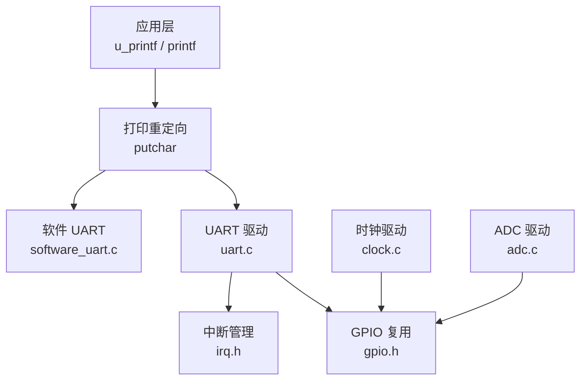
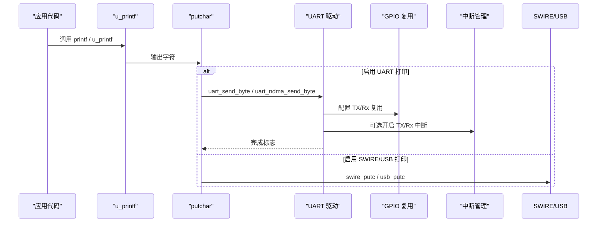
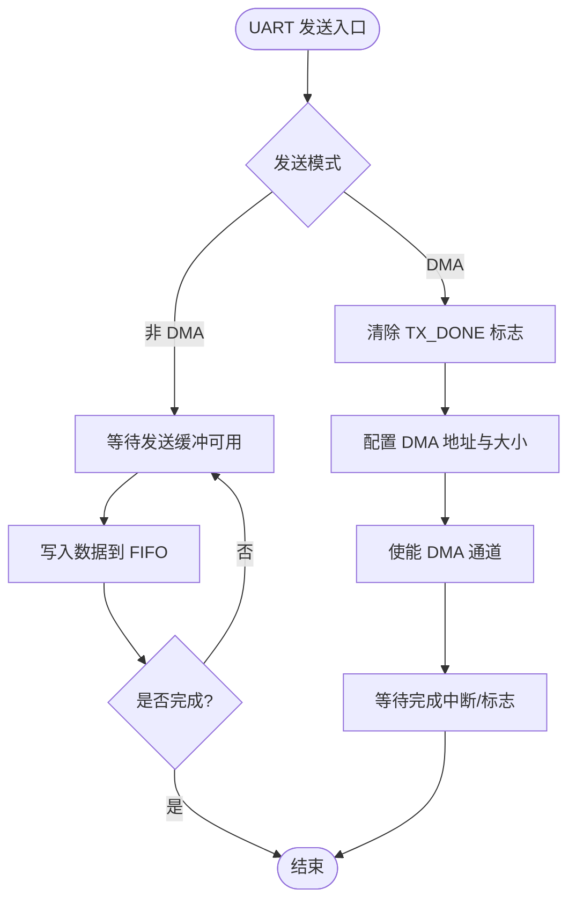
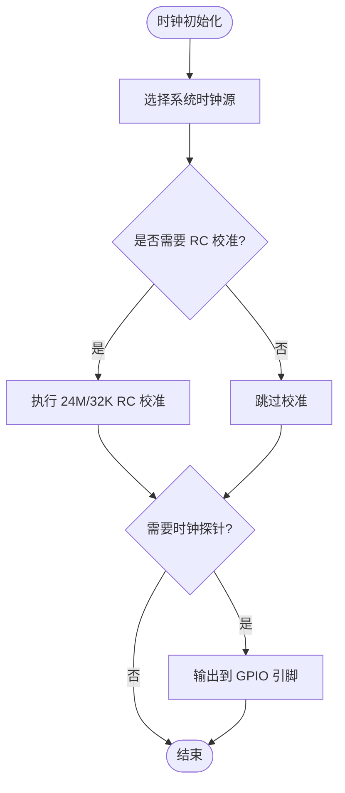
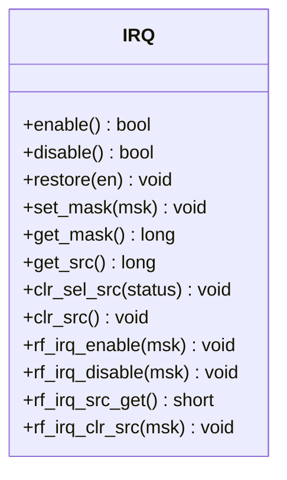
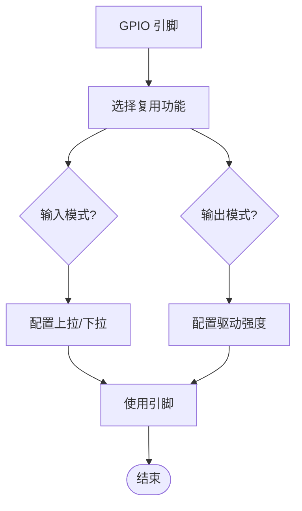
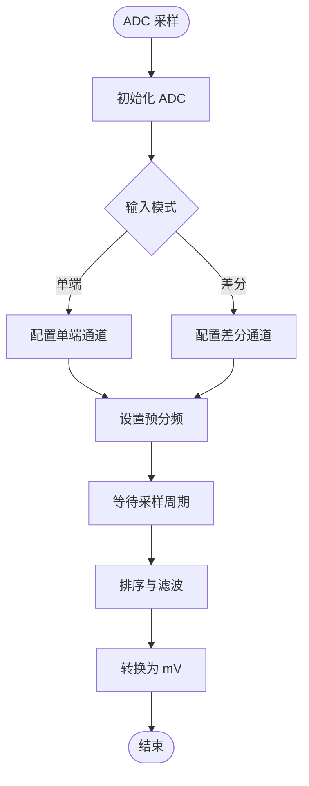
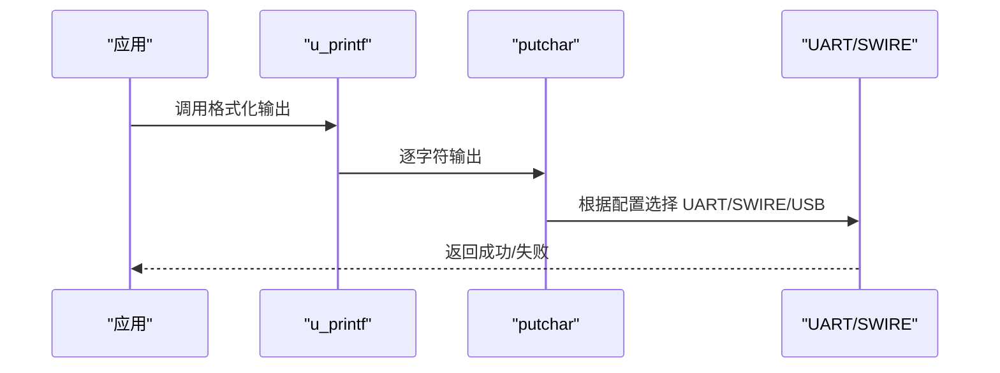
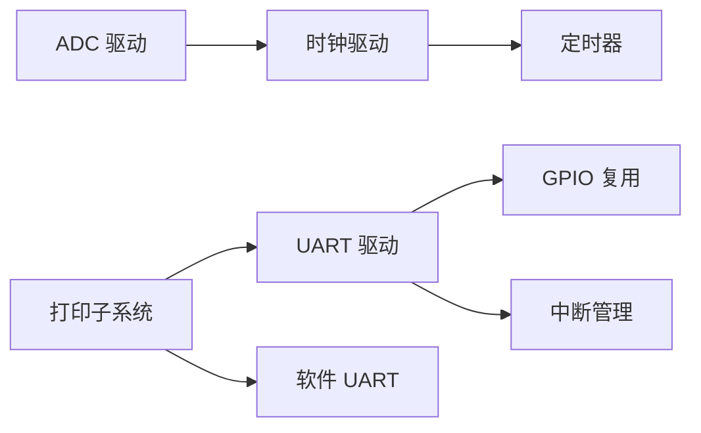

# 硬件调试

<cite>
**本文引用的文件**
- [uart.c](file://tc_ble_single_sdk/drivers/B85/uart.c)
- [clock.c](file://tc_ble_single_sdk/drivers/B85/clock.c)
- [irq.h](file://tc_ble_single_sdk/drivers/B85/irq.h)
- [gpio.h](file://tc_ble_single_sdk/drivers/B85/gpio.h)
- [adc.c](file://tc_ble_single_sdk/drivers/B85/adc.c)
- [u_printf.c](file://tc_ble_single_sdk/application/print/u_printf.c)
- [putchar.c](file://tc_ble_single_sdk/application/print/putchar.c)
- [software_uart.c (B85)](file://tc_ble_single_sdk/drivers/B85/driver_ext/software_uart.c)
- [README.md](file://README.md)
</cite>

## 目录
1. [简介](#简介)
2. [项目结构](#项目结构)
3. [核心组件](#核心组件)
4. [架构总览](#架构总览)
5. [详细组件分析](#详细组件分析)
6. [依赖关系分析](#依赖关系分析)
7. [性能注意事项](#性能注意事项)
8. [故障排除指南](#故障排除指南)
9. [结论](#结论)
10. [附录](#附录)

## 简介
本指南面向使用 Telink B85/B87/TC321X 系列芯片的工程师，提供基于该 SDK 的硬件级调试操作手册。内容涵盖：
- 使用 JTAG/SWD 进行断点设置、寄存器查看与内存分析（结合 SDK 提供的时钟探测与 GPIO 能力）
- 通过 UART 调试接口输出日志、获取实时调试信息（含软件 UART 与硬件 UART）
- 监控芯片内部状态：系统时钟配置、外设状态、中断处理流程
- 常见硬件问题诊断：电源、信号完整性、外设通信等
- 最佳实践与系统化排障流程

## 项目结构
本项目为多平台 SDK，包含 B85/B87/TC321X 三类驱动与应用层。与硬件调试密切相关的模块主要位于 drivers 与 application/print 下：
- UART 驱动：支持波特率计算、DMA/非 DMA 收发、RTS/CTS、错误中断
- 时钟驱动：系统时钟初始化、RC/Xtal 校准、时钟探针输出到 GPIO
- 中断管理：全局中断开关、IRQ 掩码、RF IRQ 管理
- GPIO：复用功能配置、上拉/下拉、中断、USB 引脚控制
- ADC：电压采样、参考电压校准、差分/单端模式
- 打印子系统：u_printf 格式化输出，putchar 可重定向至 UART/SWIRE/USB

图表来源
- [uart.c:159-215](file://tc_ble_single_sdk/drivers/B85/uart.c#L159-L215)
- [gpio.h:95-125](file://tc_ble_single_sdk/drivers/B85/gpio.h#L95-L125)
- [clock.c:50-81](file://tc_ble_single_sdk/drivers/B85/clock.c#L50-L81)
- [adc.c:293-324](file://tc_ble_single_sdk/drivers/B85/adc.c#L293-L324)

章节来源
- [README.md:1-231](file://README.md#L1-L231)

## 核心组件
- UART 驱动：提供初始化、波特率自动计算、DMA/非 DMA 发送接收、错误中断、RTS/CTS 流控
- 时钟驱动：系统时钟选择、RC 校准、时钟探针输出到 IO，便于示波器观测
- 中断管理：统一的中断使能/屏蔽、源读取与清除，以及 RF 专用中断
- GPIO：复用功能映射、输入输出控制、上拉/下拉、中断触发配置
- ADC：电压采样、参考电压校准、差分/单端模式、采样率配置
- 打印子系统：u_printf 格式化输出，putchar 可重定向到 UART/SWIRE/USB

章节来源
- [uart.c:159-215](file://tc_ble_single_sdk/drivers/B85/uart.c#L159-L215)
- [clock.c:50-81](file://tc_ble_single_sdk/drivers/B85/clock.c#L50-L81)
- [irq.h:28-168](file://tc_ble_single_sdk/drivers/B85/irq.h#L28-L168)
- [gpio.h:95-125](file://tc_ble_single_sdk/drivers/B85/gpio.h#L95-L125)
- [adc.c:293-324](file://tc_ble_single_sdk/drivers/B85/adc.c#L293-L324)
- [u_printf.c:210-256](file://tc_ble_single_sdk/application/print/u_printf.c#L210-L256)
- [putchar.c:182-195](file://tc_ble_single_sdk/application/print/putchar.c#L182-L195)

## 架构总览
下图展示了从应用层打印到 UART/SWIRE 输出的数据流，以及与底层驱动和中断的关系。

图表来源
- [u_printf.c:210-256](file://tc_ble_single_sdk/application/print/u_printf.c#L210-L256)
- [putchar.c:182-195](file://tc_ble_single_sdk/application/print/putchar.c#L182-L195)
- [uart.c:339-407](file://tc_ble_single_sdk/drivers/B85/uart.c#L339-L407)
- [gpio.h:95-125](file://tc_ble_single_sdk/drivers/B85/gpio.h#L95-L125)
- [irq.h:65-126](file://tc_ble_single_sdk/drivers/B85/irq.h#L65-L126)

## 详细组件分析

### UART 调试接口
- 初始化与波特率：支持按系统时钟自动计算分频与位宽，确保稳定通信
- 发送模式：
  - 非 DMA：轮询或中断方式发送单字节
  - DMA：批量发送，需先清完成标志再触发
- 接收模式：
  - 非 DMA：轮询读取 FIFO
  - DMA：配置接收缓冲区长度并启动通道
- 错误处理：奇偶校验错误检测与清除
- 流控：支持 RTS/CTS 硬件流控配置与手动电平控制
- GPIO 复用：TX/RX/RTS/CTS 引脚复用与上拉配置

图表来源
- [uart.c:304-328](file://tc_ble_single_sdk/drivers/B85/uart.c#L304-L328)
- [uart.c:339-407](file://tc_ble_single_sdk/drivers/B85/uart.c#L339-L407)
- [uart.c:418-432](file://tc_ble_single_sdk/drivers/B85/uart.c#L418-L432)
- [uart.c:440-460](file://tc_ble_single_sdk/drivers/B85/uart.c#L440-L460)
- [uart.c:473-551](file://tc_ble_single_sdk/drivers/B85/uart.c#L473-L551)
- [uart.c:561-593](file://tc_ble_single_sdk/drivers/B85/uart.c#L561-L593)

章节来源
- [uart.c:159-215](file://tc_ble_single_sdk/drivers/B85/uart.c#L159-L215)
- [uart.c:222-283](file://tc_ble_single_sdk/drivers/B85/uart.c#L222-L283)
- [uart.c:339-407](file://tc_ble_single_sdk/drivers/B85/uart.c#L339-L407)
- [uart.c:418-460](file://tc_ble_single_sdk/drivers/B85/uart.c#L418-L460)
- [uart.c:473-593](file://tc_ble_single_sdk/drivers/B85/uart.c#L473-L593)

### 时钟与探针
- 系统时钟初始化：可选择不同时钟源，并在特定频率下调整 DCDC 电压
- RC 校准：24M/32K RC 校准函数，保证唤醒后时钟稳定性
- 时钟探针：将系统时钟、32K、RC24M 等输出到指定 GPIO，便于示波器测量

图表来源
- [clock.c:50-81](file://tc_ble_single_sdk/drivers/B85/clock.c#L50-L81)
- [clock.c:197-240](file://tc_ble_single_sdk/drivers/B85/clock.c#L197-L240)
- [clock.c:267-285](file://tc_ble_single_sdk/drivers/B85/clock.c#L267-L285)

章节来源
- [clock.c:50-81](file://tc_ble_single_sdk/drivers/B85/clock.c#L50-L81)
- [clock.c:197-240](file://tc_ble_single_sdk/drivers/B85/clock.c#L197-L240)
- [clock.c:267-285](file://tc_ble_single_sdk/drivers/B85/clock.c#L267-L285)

### 中断管理
- 全局中断开关：保存/恢复中断状态，避免嵌套导致的状态不一致
- 中断掩码：按类型使能/禁用中断，支持查询当前掩码
- 中断源：读取与清除中断源，支持 RF 专用中断

图表来源
- [irq.h:28-168](file://tc_ble_single_sdk/drivers/B85/irq.h#L28-L168)

章节来源
- [irq.h:28-168](file://tc_ble_single_sdk/drivers/B85/irq.h#L28-L168)

### GPIO 与复用
- 功能复用：UART、I2C、SPI、PWM、USB、ADC、比较器等
- 输入输出：使能输入/输出、读写电平、切换输出
- 上拉/下拉：配置内部电阻，提高信号稳定性
- 中断：边沿触发、RISC0/RISC1 中断、清除状态

图表来源
- [gpio.h:95-125](file://tc_ble_single_sdk/drivers/B85/gpio.h#L95-L125)
- [gpio.h:191-240](file://tc_ble_single_sdk/drivers/B85/gpio.h#L191-L240)
- [gpio.h:351-367](file://tc_ble_single_sdk/drivers/B85/gpio.h#L351-L367)
- [gpio.h:375-423](file://tc_ble_single_sdk/drivers/B85/gpio.h#L375-L423)

章节来源
- [gpio.h:95-125](file://tc_ble_single_sdk/drivers/B85/gpio.h#L95-L125)
- [gpio.h:191-240](file://tc_ble_single_sdk/drivers/B85/gpio.h#L191-L240)
- [gpio.h:351-367](file://tc_ble_single_sdk/drivers/B85/gpio.h#L351-L367)
- [gpio.h:375-423](file://tc_ble_single_sdk/drivers/B85/gpio.h#L375-L423)

### ADC 电压采样
- 初始化：关闭 SAR ADC、复位、使能 24M 时钟、设置采样时钟
- 参考电压：支持 1.2V/0.6V/0.9V，带偏置电流微调
- 输入模式：单端/差分，预分频器配置
- 采样流程：配置 DFIFO、等待采样周期、排序滤波、转换为 mV

图表来源
- [adc.c:293-324](file://tc_ble_single_sdk/drivers/B85/adc.c#L293-L324)
- [adc.c:326-342](file://tc_ble_single_sdk/drivers/B85/adc.c#L326-L342)
- [adc.c:348-406](file://tc_ble_single_sdk/drivers/B85/adc.c#L348-L406)
- [adc.c:417-516](file://tc_ble_single_sdk/drivers/B85/adc.c#L417-L516)

章节来源
- [adc.c:293-324](file://tc_ble_single_sdk/drivers/B85/adc.c#L293-L324)
- [adc.c:326-342](file://tc_ble_single_sdk/drivers/B85/adc.c#L326-L342)
- [adc.c:348-406](file://tc_ble_single_sdk/drivers/B85/adc.c#L348-L406)
- [adc.c:417-516](file://tc_ble_single_sdk/drivers/B85/adc.c#L417-L516)

### 打印子系统与软件 UART
- u_printf：格式化输出，支持字符串、数字、十六进制等
- putchar：可重定向到 UART、SWIRE 或 USB；在 BLE 连接状态下优先 USB，否则 SWIRE
- 软件 UART：在射频状态机中插入回调，避免与 RF 冲突

图表来源
- [u_printf.c:210-256](file://tc_ble_single_sdk/application/print/u_printf.c#L210-L256)
- [putchar.c:182-195](file://tc_ble_single_sdk/application/print/putchar.c#L182-L195)
- [software_uart.c (B85):253-281](file://tc_ble_single_sdk/drivers/B85/driver_ext/software_uart.c#L253-L281)

章节来源
- [u_printf.c:210-256](file://tc_ble_single_sdk/application/print/u_printf.c#L210-L256)
- [putchar.c:182-195](file://tc_ble_single_sdk/application/print/putchar.c#L182-L195)
- [software_uart.c (B85):253-281](file://tc_ble_single_sdk/drivers/B85/driver_ext/software_uart.c#L253-L281)

## 依赖关系分析
- UART 驱动依赖 GPIO 复用与中断管理
- 时钟驱动依赖模拟寄存器与定时器
- ADC 驱动依赖时钟与 DFIFO
- 打印子系统依赖 UART/SWIRE/USB 输出路径

图表来源
- [uart.c:159-215](file://tc_ble_single_sdk/drivers/B85/uart.c#L159-L215)
- [clock.c:50-81](file://tc_ble_single_sdk/drivers/B85/clock.c#L50-L81)
- [adc.c:293-324](file://tc_ble_single_sdk/drivers/B85/adc.c#L293-L324)
- [u_printf.c:210-256](file://tc_ble_single_sdk/application/print/u_printf.c#L210-L256)
- [software_uart.c (B85):253-281](file://tc_ble_single_sdk/drivers/B85/driver_ext/software_uart.c#L253-L281)

章节来源
- [uart.c:159-215](file://tc_ble_single_sdk/drivers/B85/uart.c#L159-L215)
- [clock.c:50-81](file://tc_ble_single_sdk/drivers/B85/clock.c#L50-L81)
- [adc.c:293-324](file://tc_ble_single_sdk/drivers/B85/adc.c#L293-L324)
- [u_printf.c:210-256](file://tc_ble_single_sdk/application/print/u_printf.c#L210-L256)
- [software_uart.c (B85):253-281](file://tc_ble_single_sdk/drivers/B85/driver_ext/software_uart.c#L253-L281)

## 性能注意事项
- 时钟切换期间避免 DMA 收发，防止数据丢失
- UART DMA 发送前必须清除 TX_DONE 标志，避免中断卡死
- ADC 采样需等待足够采样周期，避免数据异常
- 软件 UART 在 RF 连接状态下插入状态机回调，降低对射频的影响
- 高波特率下注意系统时钟与分频配置，确保误差最小

章节来源
- [clock.c:50-81](file://tc_ble_single_sdk/drivers/B85/clock.c#L50-L81)
- [uart.c:339-407](file://tc_ble_single_sdk/drivers/B85/uart.c#L339-L407)
- [adc.c:417-516](file://tc_ble_single_sdk/drivers/B85/adc.c#L417-L516)
- [software_uart.c (B85):253-281](file://tc_ble_single_sdk/drivers/B85/driver_ext/software_uart.c#L253-L281)

## 故障排除指南
- 电源问题
  - 使用 ADC 采样电池电压，检查供电是否稳定
  - 检查 DCDC 电压配置，尤其在 48M 时钟时
- 信号完整性
  - 使用时钟探针输出系统时钟，用示波器验证频率与占空比
  - 检查 UART TX/RX 引脚的上拉配置与复用是否正确
- 外设通信故障
  - 检查 UART 错误标志（奇偶校验错误），必要时清除错误并重启接收
  - 确认 DMA 通道使能与缓冲区对齐
- 中断处理
  - 使用中断源读取与清除，避免重复进入中断
  - 检查 RF 中断掩码与状态，避免干扰
- 常见问题定位
  - 通过 u_printf 输出关键状态，结合 UART 日志定位问题
  - 在 BLE 连接状态下优先使用 USB 打印，避免 SWIRE 不稳定

章节来源
- [adc.c:417-516](file://tc_ble_single_sdk/drivers/B85/adc.c#L417-L516)
- [clock.c:50-81](file://tc_ble_single_sdk/drivers/B85/clock.c#L50-L81)
- [uart.c:440-460](file://tc_ble_single_sdk/drivers/B85/uart.c#L440-L460)
- [irq.h:99-126](file://tc_ble_single_sdk/drivers/B85/irq.h#L99-L126)
- [u_printf.c:210-256](file://tc_ble_single_sdk/application/print/u_printf.c#L210-L256)
- [putchar.c:182-195](file://tc_ble_single_sdk/application/print/putchar.c#L182-L195)

## 结论
本指南基于 SDK 提供的 UART、时钟、中断、GPIO 与 ADC 驱动，构建了完整的硬件调试工作流。通过合理配置与监控，可有效定位电源、信号完整性与外设通信问题，并结合日志输出与探针工具提升调试效率。建议在实际项目中遵循本文的最佳实践，建立标准化的排障流程。

## 附录
- 常用调试步骤
  - 初始化时钟并启用 RC 校准
  - 配置 UART 引脚与波特率，启用 DMA 或中断
  - 使用 u_printf 输出关键状态
  - 通过时钟探针观察系统时钟
  - 使用 ADC 采样电压，验证电源稳定性
- 参考文件路径
  - UART 驱动：[uart.c](file://tc_ble_single_sdk/drivers/B85/uart.c)
  - 时钟驱动：[clock.c](file://tc_ble_single_sdk/drivers/B85/clock.c)
  - 中断管理：[irq.h](file://tc_ble_single_sdk/drivers/B85/irq.h)
  - GPIO 复用：[gpio.h](file://tc_ble_single_sdk/drivers/B85/gpio.h)
  - ADC 采样：[adc.c](file://tc_ble_single_sdk/drivers/B85/adc.c)
  - 打印子系统：[u_printf.c](file://tc_ble_single_sdk/application/print/u_printf.c), [putchar.c](file://tc_ble_single_sdk/application/print/putchar.c)
  - 软件 UART：[software_uart.c (B85)](file://tc_ble_single_sdk/drivers/B85/driver_ext/software_uart.c)