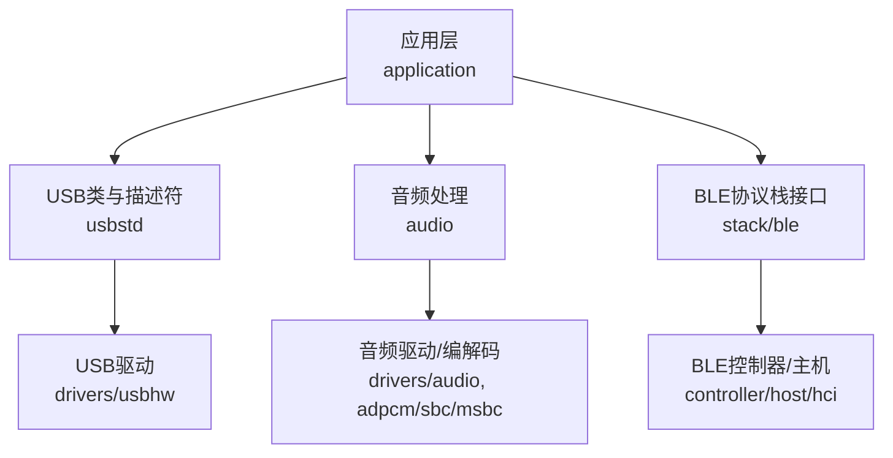
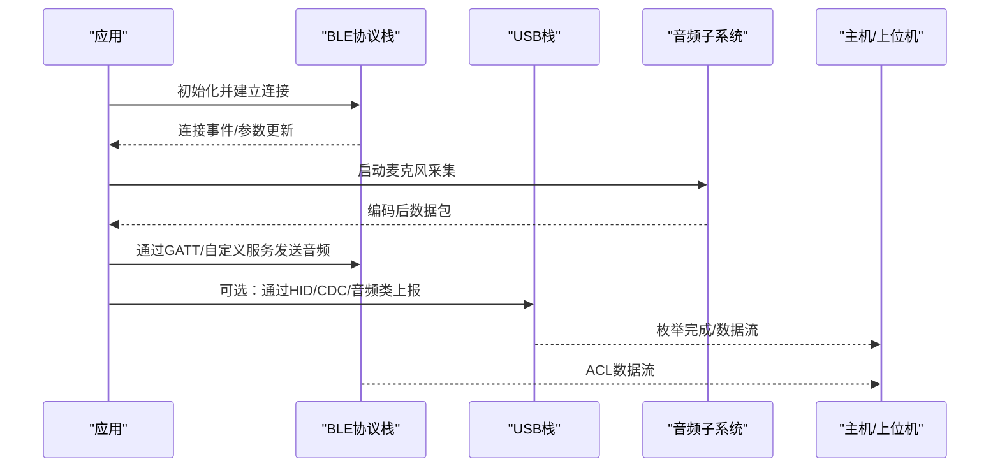
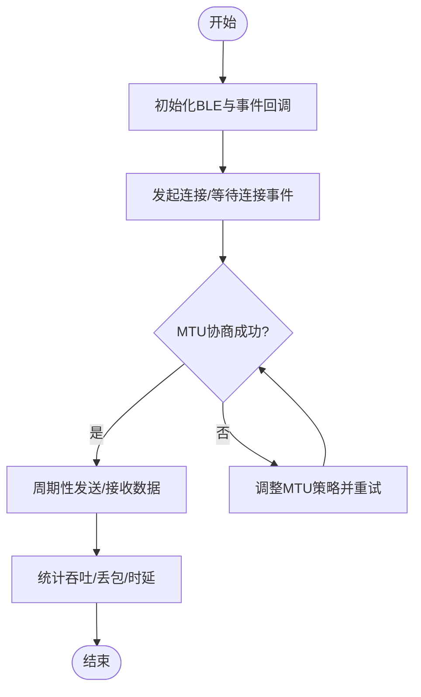
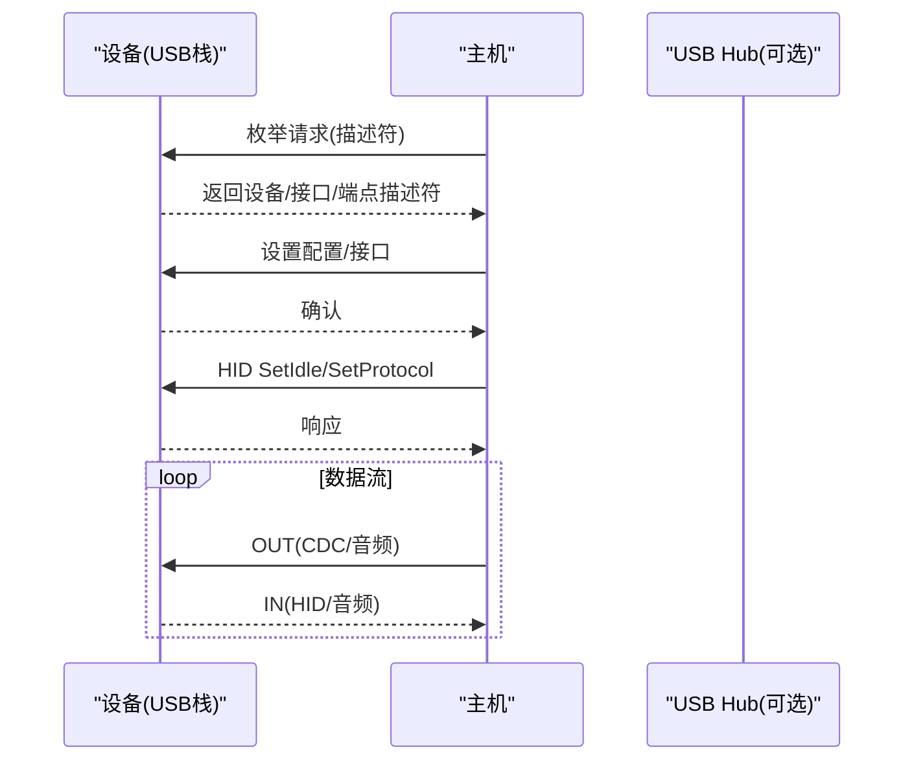
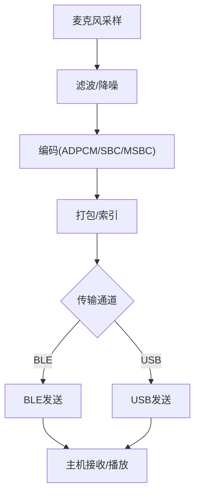
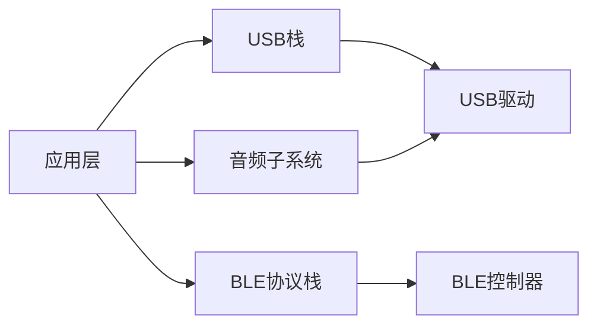

# 集成测试

<cite>
**本文引用的文件**
- [README.md](file://README.md)
- [telink_b85m_triple_mode_audio_mouse_sdk_Release_Note .md](file://telink_b85m_triple_mode_audio_mouse_sdk_Release_Note .md)
- [tl.h](file://tc_ble_single_sdk/stack/ble/controller/ll/ll.h)
- [att.h](file://tc_ble_single_sdk/stack/ble/host/attr/att.h)
- [usb.c](file://tc_ble_single_sdk/application/usbstd/usb.c)
- [usbdesc.c](file://tc_ble_single_sdk/application/usbstd/usbdesc.c)
- [AudioClassCommon.h](file://tc_ble_single_sdk/application/usbstd/AudioClassCommon.h)
- [usbmouse.c](file://tc_ble_single_sdk/application/app/usbmouse.c)
- [usbcdc.c](file://tc_ble_single_sdk/application/app/usbcdc.c)
- [usbcdc.h](file://tc_ble_single_sdk/application/app/usbcdc.h)
- [tl_audio.c](file://tc_ble_single_sdk/application/audio/tl_audio.c)
- [adpcm.c](file://tc_ble_single_sdk/application/audio/adpcm.c)
- [usbhw.h](file://tc_ble_single_sdk/drivers/B87/usbhw.h)
</cite>

## 目录
1. [简介](#简介)
2. [项目结构](#项目结构)
3. [核心组件](#核心组件)
4. [架构总览](#架构总览)
5. [详细组件分析](#详细组件分析)
6. [依赖关系分析](#依赖关系分析)
7. [性能考量](#性能考量)
8. [故障排查指南](#故障排查指南)
9. [结论](#结论)
10. [附录](#附录)

## 简介
本技术文档面向三模音频鼠标（BLE/2.4G/USB）的集成测试，覆盖以下目标：
- 模块间集成测试：BLE协议栈与应用程序、USB设备与主机系统通信、音频子系统与各组件协同。
- 测试环境搭建：硬件在环（HIL）与软件在环（SIL）两种模式。
- 端到端场景：三模连接切换、音频通话质量、鼠标功能完整性。
- 数据生成与分析：测试数据构造、抓包与指标统计方法。
- 性能评估标准：时延、丢包率、吞吐、功耗等可量化指标。

## 项目结构
该SDK按“应用层-驱动层-协议栈”分层组织，关键目录与职责如下：
- application/app：USB类实现（HID鼠标、CDC串口）、音频控制入口。
- application/audio：音频采集、编码（ADPCM/SBC/MSBC）与缓冲管理。
- application/usbstd：USB描述符、请求处理、音频类定义。
- stack/ble：BLE控制器与主机协议栈接口（LL/HCI/GATT/ATT）。
- drivers：芯片外设驱动（USB、音频、RF等）。
- vendor：厂商特性与测试用例（2.4G/蓝牙特征测试）。

**图示来源**
- [usb.c:447-509](file://tc_ble_single_sdk/application/usbstd/usb.c#L447-L509)
- [usbdesc.c:234-266](file://tc_ble_single_sdk/application/usbstd/usbdesc.c#L234-L266)
- [tl_audio.c:323-649](file://tc_ble_single_sdk/application/audio/tl_audio.c#L323-L649)
- [tl.h:31-174](file://tc_ble_single_sdk/stack/ble/controller/ll/ll.h#L31-L174)

**章节来源**
- [README.md:1-231](file://README.md#L1-L231)
- [telink_b85m_triple_mode_audio_mouse_sdk_Release_Note .md:1-217](file://telink_b85m_triple_mode_audio_mouse_sdk_Release_Note .md#L1-L217)

## 核心组件
- BLE协议栈接口：提供链路层状态、事件回调、MTU协商等能力，用于验证连接建立、参数更新与数据通道稳定性。
- USB主机通信：HID鼠标报告、CDC数据收发、USB音频类（AS/AC）描述符与控制命令，用于验证枚举、带宽与时序。
- 音频子系统：麦克风采样、滤波、降噪、编码（ADPCM/SBC/MSBC），以及打包上报，用于语音质量与吞吐评估。
- 驱动层：USB端点、音频ADC/DAC、RF功率与测试模式，支撑底层I/O与射频测试。

**章节来源**
- [tl.h:31-174](file://tc_ble_single_sdk/stack/ble/controller/ll/ll.h#L31-L174)
- [att.h:156-203](file://tc_ble_single_sdk/stack/ble/host/attr/att.h#L156-L203)
- [usb.c:447-509](file://tc_ble_single_sdk/application/usbstd/usb.c#L447-L509)
- [usbdesc.c:234-266](file://tc_ble_single_sdk/application/usbstd/usbdesc.c#L234-L266)
- [AudioClassCommon.h:59-144](file://tc_ble_single_sdk/application/usbstd/AudioClassCommon.h#L59-L144)
- [tl_audio.c:323-649](file://tc_ble_single_sdk/application/audio/tl_audio.c#L323-L649)
- [adpcm.c:29-488](file://tc_ble_single_sdk/application/audio/adpcm.c#L29-L488)
- [usbhw.h:28-75](file://tc_ble_single_sdk/drivers/B87/usbhw.h#L28-L75)

## 架构总览
下图展示三模音频鼠标的集成测试视角下的主要交互路径：
- BLE路径：应用通过BLE LL/HCI发起连接、参数更新与数据发送；GATT/ATT用于服务与特征读写。
- USB路径：应用通过USB HID/CDC/音频类与主机通信；描述符决定枚举行为与能力。
- 音频路径：ADC采样→滤波/降噪→编码→打包→通过BLE或USB上报。

**图示来源**
- [tl.h:31-174](file://tc_ble_single_sdk/stack/ble/controller/ll/ll.h#L31-L174)
- [att.h:156-203](file://tc_ble_single_sdk/stack/ble/host/attr/att.h#L156-L203)
- [usb.c:447-509](file://tc_ble_single_sdk/application/usbstd/usb.c#L447-L509)
- [usbdesc.c:234-266](file://tc_ble_single_sdk/application/usbstd/usbdesc.c#L234-L266)
- [tl_audio.c:323-649](file://tc_ble_single_sdk/application/audio/tl_audio.c#L323-L649)

## 详细组件分析

### BLE协议栈与应用程序集成测试
- 目标：验证连接建立、MTU交换、ACL数据吞吐、事件回调正确性。
- 关键点：
  - 链路层状态机与主循环：确保中断与任务调度正常。
  - MTU协商：主机侧主动请求，设备侧响应，保证大数据块传输。
  - 事件回调：注册链路层事件，捕获连接断开/重连/参数更新。
- 建议用例：
  - 多设备并发连接与切换。
  - 高负载下MTU大小对吞吐的影响。
  - 断线重连与恢复策略。

**图示来源**
- [tl.h:31-174](file://tc_ble_single_sdk/stack/ble/controller/ll/ll.h#L31-L174)
- [att.h:156-203](file://tc_ble_single_sdk/stack/ble/host/attr/att.h#L156-L203)

**章节来源**
- [tl.h:31-174](file://tc_ble_single_sdk/stack/ble/controller/ll/ll.h#L31-L174)
- [att.h:156-203](file://tc_ble_single_sdk/stack/ble/host/attr/att.h#L156-L203)

### USB设备与主机系统通信测试
- 目标：验证HID鼠标报告、CDC数据收发、USB音频类枚举与流媒体。
- 关键点：
  - 描述符配置：设备/接口/端点描述符需符合规范，确保主机识别。
  - 请求处理：SetIdle/SetProtocol、GetInterface等控制请求的正确响应。
  - 端点管理：IN/OUT端点的忙闲检测与数据回送。
- 建议用例：
  - 热插拔与重新枚举。
  - 高频率鼠标移动与按键同时上报。
  - USB音频流的采样率/位深/通道数兼容性。

**图示来源**
- [usb.c:447-509](file://tc_ble_single_sdk/application/usbstd/usb.c#L447-L509)
- [usbdesc.c:234-266](file://tc_ble_single_sdk/application/usbstd/usbdesc.c#L234-L266)
- [AudioClassCommon.h:59-144](file://tc_ble_single_sdk/application/usbstd/AudioClassCommon.h#L59-L144)

**章节来源**
- [usb.c:447-509](file://tc_ble_single_sdk/application/usbstd/usb.c#L447-L509)
- [usbdesc.c:234-266](file://tc_ble_single_sdk/application/usbstd/usbdesc.c#L234-L266)
- [AudioClassCommon.h:59-144](file://tc_ble_single_sdk/application/usbstd/AudioClassCommon.h#L59-L144)

### 音频子系统与各组件协同工作测试
- 目标：验证麦克风采集、滤波/降噪、编码（ADPCM/SBC/MSBC）、打包上报的完整链路。
- 关键点：
  - 编码选择：根据模式与带宽需求选择合适编码。
  - 缓冲管理：避免溢出与欠载，维持稳定帧率。
  - 质量控制：底噪、失真、延迟与吞吐平衡。
- 建议用例：
  - 不同编码下的音质主观/客观评测。
  - 高负载下CPU占用与内存使用。
  - 与USB/BLE并发时的资源竞争与优先级。

**图示来源**
- [tl_audio.c:323-649](file://tc_ble_single_sdk/application/audio/tl_audio.c#L323-L649)
- [adpcm.c:29-488](file://tc_ble_single_sdk/application/audio/adpcm.c#L29-L488)

**章节来源**
- [tl_audio.c:323-649](file://tc_ble_single_sdk/application/audio/tl_audio.c#L323-L649)
- [adpcm.c:29-488](file://tc_ble_single_sdk/application/audio/adpcm.c#L29-L488)

### 端到端测试场景设计与实施
- 三模连接切换测试：
  - 场景：BLE/2.4G/USB三种模式之间切换，验证连接保持、数据不丢失、LED灯效与按键行为。
  - 步骤：进入配对→建立连接→切换模式→观察重连与数据连续性→记录异常。
  - 指标：切换耗时、丢包率、重连成功率。
- 音频通话质量测试：
  - 场景：开启语音键进行通话，评估清晰度、延迟、底噪。
  - 步骤：启用编码→持续通话→录音回放→主观评分与客观指标（SNR、THD）。
  - 指标：平均时延、抖动、丢包率、MOS分。
- 鼠标功能完整性测试：
  - 场景：移动、点击、滚轮、多键同时按下。
  - 步骤：基准移动→快速划线→多键组合→记录报告间隔与准确性。
  - 指标：报告率、坐标误差、按键响应时间。

[本节为概念性内容，无需具体文件引用]

### 测试环境搭建（HIL与SIL）
- 硬件在环（HIL）：
  - 设备：三模鼠标、USB主机/手机、BLE嗅探器、示波器/频谱仪（EMI测试）。
  - 工具：USB协议分析仪、蓝牙协议分析仪、音频采集与回放设备。
  - 流程：烧录固件→连接被测设备→执行用例→抓取日志与波形→分析。
- 软件在环（SIL）：
  - 仿真：使用SDK提供的模拟环境与脚本，模拟主机与外设行为。
  - 自动化：批量执行用例，生成报告与趋势图。
  - 回归：版本迭代后自动回归关键场景。

[本节为概念性内容，无需具体文件引用]

### 测试数据生成与分析方法
- 数据生成：
  - 音频：使用标准测试音（正弦扫频、白噪声）注入麦克风输入，录制输出对比。
  - USB：使用脚本生成HID/CDC数据流，压测吞吐与时延。
  - BLE：构造不同MTU与负载的数据包，测量吞吐与丢包。
- 数据分析：
  - 抓包：使用协议分析仪导出PCAP/LOG，解析字段与时序。
  - 指标：计算平均/峰值时延、抖动、吞吐、丢包率、误码率。
  - 可视化：绘制曲线与热力图，标注异常点与阈值。

[本节为概念性内容，无需具体文件引用]

### 测试结果的性能评估标准
- BLE：
  - 连接建立时间、参数更新成功率、ACL吞吐、MTU协商结果。
- USB：
  - 枚举成功率、HID报告间隔、CDC吞吐、音频流稳定性。
- 音频：
  - 编码质量（SNR、THD）、端到端时延、丢包与重传影响。
- 功耗：
  - 待机/工作电流、发射功率档位、休眠唤醒耗时。

[本节为概念性内容，无需具体文件引用]

## 依赖关系分析
- 耦合关系：
  - 应用层依赖USB栈与BLE协议栈接口，音频子系统为共享资源。
  - 驱动层提供USB端点、音频ADC/DAC与RF控制能力。
- 外部依赖：
  - 主机系统与操作系统对USB/BLE协议的实现差异。
  - 音频编解码库（SBC/MSBC）与平台适配。
- 潜在风险：
  - 资源竞争导致音频卡顿或鼠标漂移。
  - 不同主机对USB音频类的兼容性问题。

**图示来源**
- [usb.c:447-509](file://tc_ble_single_sdk/application/usbstd/usb.c#L447-L509)
- [tl.h:31-174](file://tc_ble_single_sdk/stack/ble/controller/ll/ll.h#L31-L174)
- [tl_audio.c:323-649](file://tc_ble_single_sdk/application/audio/tl_audio.c#L323-L649)

**章节来源**
- [usb.c:447-509](file://tc_ble_single_sdk/application/usbstd/usb.c#L447-L509)
- [tl.h:31-174](file://tc_ble_single_sdk/stack/ble/controller/ll/ll.h#L31-L174)
- [tl_audio.c:323-649](file://tc_ble_single_sdk/application/audio/tl_audio.c#L323-L649)

## 性能考量
- 编码选择：在高带宽场景优先SBC/MSBC，低带宽场景考虑ADPCM。
- 缓冲策略：合理设置FIFO大小与读取周期，避免溢出与欠载。
- 报告率：根据负载动态调整HID报告率，平衡流畅性与功耗。
- RF功率：在不同距离与干扰环境下选择合适的发射功率。

[本节为概念性内容，无需具体文件引用]

## 故障排查指南
- 常见问题定位：
  - 枚举失败：检查描述符与请求处理逻辑。
  - 音频杂音：检查滤波参数与PGA增益设置。
  - BLE断连：查看连接参数与MTU协商过程。
- 调试手段：
  - 打印关键变量与状态机跳转。
  - 使用协议分析仪抓取握手与数据流。
  - 示波器观测RF波形与电源纹波。

**章节来源**
- [usb.c:447-509](file://tc_ble_single_sdk/application/usbstd/usb.c#L447-L509)
- [tl_audio.c:323-649](file://tc_ble_single_sdk/application/audio/tl_audio.c#L323-L649)
- [tl.h:31-174](file://tc_ble_single_sdk/stack/ble/controller/ll/ll.h#L31-L174)

## 结论
通过分层化的集成测试策略，结合HIL与SIL环境，可有效验证三模音频鼠标在BLE、USB与音频子系统的协同工作。以端到端场景为导向，量化评估性能指标，确保产品在不同主机与网络环境下的稳定性与用户体验。

[本节为总结性内容，无需具体文件引用]

## 附录
- 参考实现路径：
  - USB鼠标上报与平滑处理：[usbmouse.c:44-151](file://tc_ble_single_sdk/application/app/usbmouse.c#L44-L151)
  - CDC数据收发：[usbcdc.c:74-97](file://tc_ble_single_sdk/application/app/usbcdc.c#L74-L97)、[usbcdc.h:38-81](file://tc_ble_single_sdk/application/app/usbcdc.h#L38-L81)
  - USB音频类定义与控制：[AudioClassCommon.h:59-144](file://tc_ble_single_sdk/application/usbstd/AudioClassCommon.h#L59-L144)
  - 音频编码与缓冲：[tl_audio.c:323-649](file://tc_ble_single_sdk/application/audio/tl_audio.c#L323-L649)、[adpcm.c:29-488](file://tc_ble_single_sdk/application/audio/adpcm.c#L29-L488)
  - BLE链路层与MTU：[tl.h:31-174](file://tc_ble_single_sdk/stack/ble/controller/ll/ll.h#L31-L174)、[att.h:156-203](file://tc_ble_single_sdk/stack/ble/host/attr/att.h#L156-L203)

**章节来源**
- [usbmouse.c:44-151](file://tc_ble_single_sdk/application/app/usbmouse.c#L44-L151)
- [usbcdc.c:74-97](file://tc_ble_single_sdk/application/app/usbcdc.c#L74-L97)
- [usbcdc.h:38-81](file://tc_ble_single_sdk/application/app/usbcdc.h#L38-L81)
- [AudioClassCommon.h:59-144](file://tc_ble_single_sdk/application/usbstd/AudioClassCommon.h#L59-L144)
- [tl_audio.c:323-649](file://tc_ble_single_sdk/application/audio/tl_audio.c#L323-L649)
- [adpcm.c:29-488](file://tc_ble_single_sdk/application/audio/adpcm.c#L29-L488)
- [tl.h:31-174](file://tc_ble_single_sdk/stack/ble/controller/ll/ll.h#L31-L174)
- [att.h:156-203](file://tc_ble_single_sdk/stack/ble/host/attr/att.h#L156-L203)