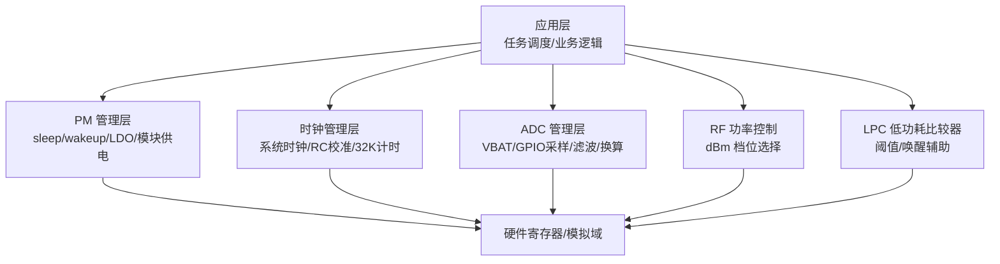
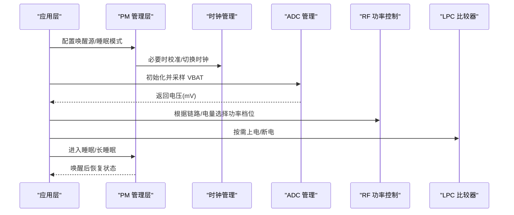
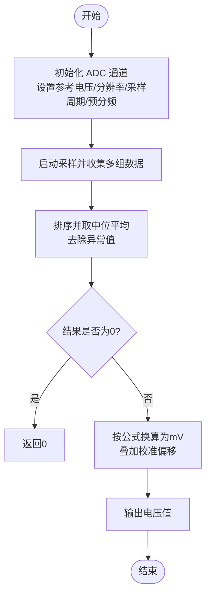
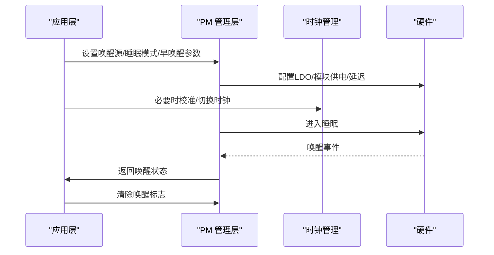
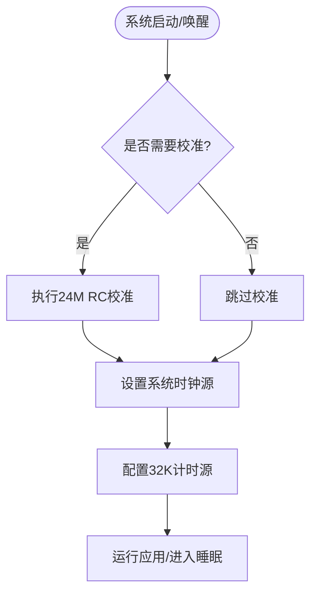
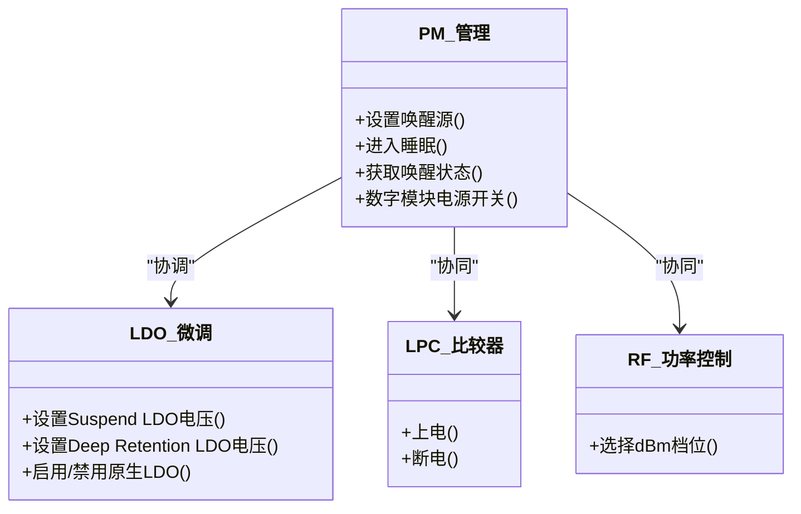
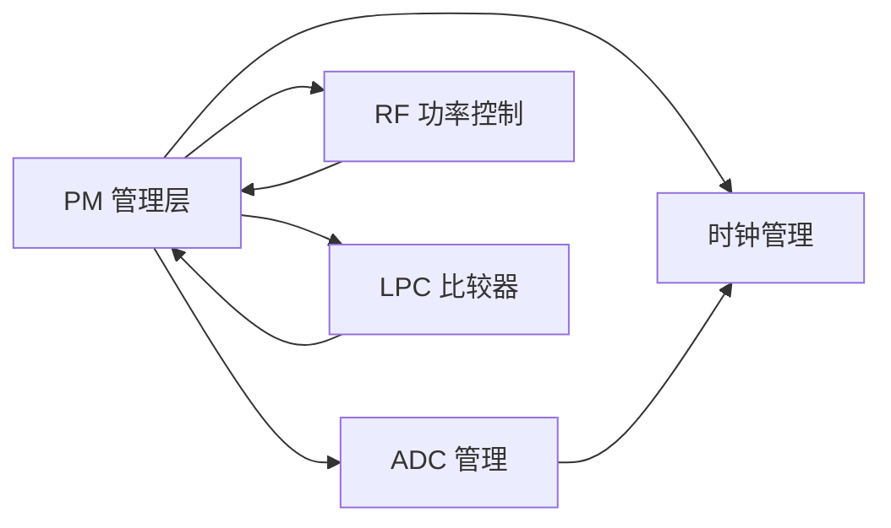

# 电源管理系统

<cite>
**本文引用的文件**
- [pm.h](file://tc_ble_single_sdk/drivers/TC321X/lib/include/pm/pm.h)
- [pm_internal.h](file://tc_ble_single_sdk/drivers/TC321X/lib/include/pm/pm_internal.h)
- [clock.c](file://tc_ble_single_sdk/drivers/TC321X/clock.c)
- [adc.c](file://tc_ble_single_sdk/drivers/B85/adc.c)
- [SDK_Wiki.md](file://doc/SDK_Wiki.md)
- [rf_drv.h (B85)](file://tc_ble_single_sdk/drivers/B85/lib/include/rf_drv.h)
- [rf_drv.h (B87)](file://tc_ble_single_sdk/drivers/B87/lib/include/rf_drv.h)
- [lpc.c (B85)](file://tc_ble_single_sdk/drivers/B85/lpc.c)
- [lpc.c (B87)](file://tc_ble_single_sdk/drivers/B87/lpc.c)
</cite>

## 目录
1. [简介](#简介)
2. [项目结构](#项目结构)
3. [核心组件](#核心组件)
4. [架构总览](#架构总览)
5. [详细组件分析](#详细组件分析)
6. [依赖关系分析](#依赖关系分析)
7. [性能与功耗考量](#性能与功耗考量)
8. [故障排查指南](#故障排查指南)
9. [结论](#结论)
10. [附录](#附录)

## 简介
本技术文档面向基于 Telink B85/B87/TC321X 平台的电源管理系统，围绕电池监控与电量估算、多级低功耗模式与休眠唤醒机制、动态频率调节、外设电源管理、功耗优化策略、低电量报警与充电管理、智能电源分配与任务调度对功耗的影响、以及功耗测试方法与电池寿命延长技巧进行系统化说明。内容严格依据仓库中的驱动与 SDK 文档实现细节展开，便于工程落地与调优。

## 项目结构
本项目在电源管理方面主要涉及以下层次：
- 时钟与系统频率：提供系统主频选择、RC 校准、32K 计时源等能力，支撑动态频率调节与低功耗定时。
- 电源管理与休眠：提供多种睡眠模式（挂起、深度睡眠、深度保持、关机）、唤醒源配置、LDO 微调、数字模块电源开关等。
- ADC 与电池检测：提供 VBAT/GPIO 采样初始化、采样与结果转换、差分/单端输入配置、参考电压与预分频设置。
- RF 功率控制：提供多档发射功率索引，支持按链路质量与距离动态调整以节能。
- 低功耗比较器（LPC）：用于快速唤醒或阈值判断的低功耗模拟模块。
- SDK 文档：总结 PM 模式、唤醒源、长睡眠接口等使用要点。

**图表来源**
- [pm.h:76-132](file://tc_ble_single_sdk/drivers/TC321X/lib/include/pm/pm.h#L76-L132)
- [pm_internal.h:82-162](file://tc_ble_single_sdk/drivers/TC321X/lib/include/pm/pm_internal.h#L82-L162)
- [clock.c:73-118](file://tc_ble_single_sdk/drivers/TC321X/clock.c#L73-L118)
- [adc.c:293-406](file://tc_ble_single_sdk/drivers/B85/adc.c#L293-L406)
- [rf_drv.h (B85):180-334](file://tc_ble_single_sdk/drivers/B85/lib/include/rf_drv.h#L180-L334)
- [lpc.c (B85):25-40](file://tc_ble_single_sdk/drivers/B85/lpc.c#L25-L40)

**章节来源**
- [pm.h:76-132](file://tc_ble_single_sdk/drivers/TC321X/lib/include/pm/pm.h#L76-L132)
- [pm_internal.h:82-162](file://tc_ble_single_sdk/drivers/TC321X/lib/include/pm/pm_internal.h#L82-L162)
- [clock.c:73-118](file://tc_ble_single_sdk/drivers/TC321X/clock.c#L73-L118)
- [adc.c:293-406](file://tc_ble_single_sdk/drivers/B85/adc.c#L293-L406)
- [rf_drv.h (B85):180-334](file://tc_ble_single_sdk/drivers/B85/lib/include/rf_drv.h#L180-L334)
- [lpc.c (B85):25-40](file://tc_ble_single_sdk/drivers/B85/lpc.c#L25-L40)

## 核心组件
- 电源管理（PM）：定义睡眠模式、唤醒源、唤醒状态、早唤醒时间参数、数字模块电源开关、GPIO 唤醒配置等。
- 时钟管理（Clock）：提供 32K 初始化、24M RC 校准、系统时钟切换、32K tick 读写与稳定等待。
- ADC 子系统：提供 VBAT/GPIO 采样通道初始化、参考电压与分辨率配置、采样周期与预分频、数据滤波与电压换算。
- RF 功率控制：提供多档 dBm 功率索引，支持根据链路条件动态降功率以节能。
- LPC 低功耗比较器：提供低功耗比较器的上电/断电控制，用于阈值判断或唤醒辅助。
- SDK 文档：总结 PM 模式与唤醒源的使用规范。

**章节来源**
- [pm.h:76-132](file://tc_ble_single_sdk/drivers/TC321X/lib/include/pm/pm.h#L76-L132)
- [pm.h:231-305](file://tc_ble_single_sdk/drivers/TC321X/lib/include/pm/pm.h#L231-L305)
- [pm_internal.h:82-162](file://tc_ble_single_sdk/drivers/TC321X/lib/include/pm/pm_internal.h#L82-L162)
- [clock.c:73-118](file://tc_ble_single_sdk/drivers/TC321X/clock.c#L73-L118)
- [adc.c:293-406](file://tc_ble_single_sdk/drivers/B85/adc.c#L293-L406)
- [rf_drv.h (B85):180-334](file://tc_ble_single_sdk/drivers/B85/lib/include/rf_drv.h#L180-L334)
- [lpc.c (B85):25-40](file://tc_ble_single_sdk/drivers/B85/lpc.c#L25-L40)

## 架构总览
下图展示了电源管理相关模块的交互关系：应用层通过 PM 接口进入不同睡眠模式并配置唤醒源；时钟模块负责系统时钟与 32K 计时源；ADC 模块周期性采样 VBAT 并换算为电压值供上层决策；RF 功率控制根据链路质量与电量状态动态调整发射功率；LPC 可在低功耗场景下参与阈值判断或唤醒。

**图表来源**
- [pm.h:231-337](file://tc_ble_single_sdk/drivers/TC321X/lib/include/pm/pm.h#L231-L337)
- [clock.c:73-118](file://tc_ble_single_sdk/drivers/TC321X/clock.c#L73-L118)
- [adc.c:293-406](file://tc_ble_single_sdk/drivers/B85/adc.c#L293-L406)
- [rf_drv.h (B85):180-334](file://tc_ble_single_sdk/drivers/B85/lib/include/rf_drv.h#L180-L334)
- [lpc.c (B85):25-40](file://tc_ble_single_sdk/drivers/B85/lpc.c#L25-L40)

## 详细组件分析

### 电池监控与电量估算算法
- 采样通道与初始化：
  - 支持 GPIO 与 VBAT 通道的独立初始化，分别调用对应引脚初始化函数，设置差分/单端输入模式、参考电压、分辨率、采样周期与预分频。
  - VBAT 通道需确保参考电压为 1.2V，并合理设置预分频以满足输入范围要求。
- 采样与滤波：
  - 采用 DFIFO 采集多组原始码值，剔除异常值后进行排序取中位平均，降低噪声影响。
  - 支持手动模式直接读取 ADC 数据，适用于连续采样场景，但需注意两次采样间隔大于两倍的采样周期。
- 电压换算：
  - 将原始码值乘以参考电压与预分频系数，再右移相应位数得到 mV 级电压值，并叠加校准偏移量。
  - 当结果为 0 时直接返回 0，避免无效计算。
- 电量估算建议：
  - 结合多次采样均值与历史数据构建滑动窗口，估计当前电池电压。
  - 根据电池放电曲线映射到百分比，并在低电量区间提高采样频率与滤波强度。

**图表来源**
- [adc.c:293-406](file://tc_ble_single_sdk/drivers/B85/adc.c#L293-L406)
- [adc.c:417-516](file://tc_ble_single_sdk/drivers/B85/adc.c#L417-L516)
- [adc.c:525-546](file://tc_ble_single_sdk/drivers/B85/adc.c#L525-L546)

**章节来源**
- [adc.c:293-406](file://tc_ble_single_sdk/drivers/B85/adc.c#L293-L406)
- [adc.c:417-516](file://tc_ble_single_sdk/drivers/B85/adc.c#L417-L516)
- [adc.c:525-546](file://tc_ble_single_sdk/drivers/B85/adc.c#L525-L546)

### 多级低功耗模式与休眠唤醒机制
- 睡眠模式：
  - 支持挂起（suspend）、深度睡眠（deep）、深度保持睡眠（deep retention，可保留 SRAM）、关机（shutdown）。
  - 支持长睡眠（long sleep），使用 32K 计时源可实现较长延时。
- 唤醒源：
  - 定时器/STIMER、PAD（GPIO 电平）、LPC、RF 等均可作为唤醒源。
  - 可通过接口设置唤醒源、获取唤醒状态并清除标志。
- 早唤醒时间与延迟：
  - 提供早唤醒时间参数与硬件延迟周期配置，适配不同晶振稳定时间与恢复时序。
- 唤醒流程：
  - 应用层配置唤醒源与目标模式后进入睡眠；唤醒后根据状态判断来源并恢复必要模块。

**图表来源**
- [pm.h:76-132](file://tc_ble_single_sdk/drivers/TC321X/lib/include/pm/pm.h#L76-L132)
- [pm.h:231-337](file://tc_ble_single_sdk/drivers/TC321X/lib/include/pm/pm.h#L231-L337)
- [pm_internal.h:183-195](file://tc_ble_single_sdk/drivers/TC321X/lib/include/pm/pm_internal.h#L183-L195)
- [SDK_Wiki.md:666-672](file://doc/SDK_Wiki.md#L666-L672)

**章节来源**
- [pm.h:76-132](file://tc_ble_single_sdk/drivers/TC321X/lib/include/pm/pm.h#L76-L132)
- [pm.h:231-337](file://tc_ble_single_sdk/drivers/TC321X/lib/include/pm/pm.h#L231-L337)
- [pm_internal.h:183-195](file://tc_ble_single_sdk/drivers/TC321X/lib/include/pm/pm_internal.h#L183-L195)
- [SDK_Wiki.md:666-672](file://doc/SDK_Wiki.md#L666-L672)

### 动态频率调节与时钟管理
- 系统时钟选择：
  - 支持 12/16/24/32/48 MHz 外部晶振与 24 MHz RC 等多种时钟源。
  - 切换时钟时需避免 DMA 传输期间操作，防止数据丢失。
- RC 校准：
  - 首次上电或深度睡眠唤醒后执行 24M RC 校准，保证频率稳定性与唤醒成功率。
  - 可根据需求配置是否在校准逻辑中自动执行。
- 32K 计时：
  - 提供 32K 初始化、tick 写入与读取，读取过程考虑边跳变导致的字节拼接问题，确保一致性。
- 功耗影响：
  - 高频运行提升性能但增加功耗；低频或 RC 模式适合低功耗场景。
  - 合理设置校准周期与系统时钟，平衡精度与能耗。

**图表来源**
- [clock.c:73-118](file://tc_ble_single_sdk/drivers/TC321X/clock.c#L73-L118)
- [clock.c:170-238](file://tc_ble_single_sdk/drivers/TC321X/clock.c#L170-L238)
- [clock.c:249-291](file://tc_ble_single_sdk/drivers/TC321X/clock.c#L249-L291)

**章节来源**
- [clock.c:73-118](file://tc_ble_single_sdk/drivers/TC321X/clock.c#L73-L118)
- [clock.c:170-238](file://tc_ble_single_sdk/drivers/TC321X/clock.c#L170-L238)
- [clock.c:249-291](file://tc_ble_single_sdk/drivers/TC321X/clock.c#L249-L291)

### 外设电源管理与功耗优化策略
- 数字模块电源开关：
  - 提供接口对音频、USB、基带等数字模块进行上电/断电控制，进入睡眠前关闭非必要模块以降低漏电流。
- LDO 微调：
  - 支持 suspend LDO 与 deep retention LDO 的电压微调，针对不同负载与功耗需求优化静态电流。
- 原生 LDO 控制：
  - 可启用/禁用原生 LDO，或在特定模式下 bypass，进一步优化功耗。
- 低功耗比较器（LPC）：
  - 提供上电/断电控制，用于阈值判断或快速唤醒路径，减少 CPU 参与。
- 射频功率控制：
  - 提供多档 dBm 功率索引，根据链路质量与距离动态调整，避免过高功率造成浪费。

**图表来源**
- [pm.h:297-361](file://tc_ble_single_sdk/drivers/TC321X/lib/include/pm/pm.h#L297-L361)
- [pm_internal.h:126-162](file://tc_ble_single_sdk/drivers/TC321X/lib/include/pm/pm_internal.h#L126-L162)
- [lpc.c (B85):25-40](file://tc_ble_single_sdk/drivers/B85/lpc.c#L25-L40)
- [rf_drv.h (B85):180-334](file://tc_ble_single_sdk/drivers/B85/lib/include/rf_drv.h#L180-L334)

**章节来源**
- [pm.h:297-361](file://tc_ble_single_sdk/drivers/TC321X/lib/include/pm/pm.h#L297-L361)
- [pm_internal.h:126-162](file://tc_ble_single_sdk/drivers/TC321X/lib/include/pm/pm_internal.h#L126-L162)
- [lpc.c (B85):25-40](file://tc_ble_single_sdk/drivers/B85/lpc.c#L25-L40)
- [rf_drv.h (B85):180-334](file://tc_ble_single_sdk/drivers/B85/lib/include/rf_drv.h#L180-L334)

### 低电量报警与充电管理
- 低电量报警：
  - 通过 ADC 采样 VBAT 并换算为电压值，设定阈值触发低电量报警。
  - 建议在低电量区间提高采样频率与滤波强度，避免误报。
- 充电管理：
  - 仓库未提供具体充电控制器驱动，通常由外部 PMIC 或充电芯片处理；MCU 侧可通过 ADC 监测电池电压与充电状态引脚，配合应用层逻辑进行充放电策略控制。
- 建议策略：
  - 低电量时降低系统频率、缩短活跃时间、减少 RF 发射功率与频率。
  - 进入更深的睡眠模式，仅保留必要唤醒源。

**章节来源**
- [adc.c:293-406](file://tc_ble_single_sdk/drivers/B85/adc.c#L293-L406)
- [adc.c:417-516](file://tc_ble_single_sdk/drivers/B85/adc.c#L417-L516)

### 智能电源分配与任务调度对功耗的影响
- 电源分配：
  - 在进入睡眠前关闭非必需的外设模块（如音频、USB、基带），唤醒后再按需开启。
  - 利用 LPC 进行阈值判断，减少 CPU 介入，降低唤醒开销。
- 任务调度：
  - 将高功耗任务集中执行，完成后尽快进入睡眠。
  - 使用定时器或 STIMER 精确控制唤醒间隔，避免频繁唤醒导致功耗上升。
- 频率与功率联动：
  - 根据任务复杂度与实时性要求动态调整系统频率与 RF 功率，达到性能与功耗的平衡。

**章节来源**
- [pm.h:297-361](file://tc_ble_single_sdk/drivers/TC321X/lib/include/pm/pm.h#L297-L361)
- [pm_internal.h:126-162](file://tc_ble_single_sdk/drivers/TC321X/lib/include/pm/pm_internal.h#L126-L162)
- [rf_drv.h (B85):180-334](file://tc_ble_single_sdk/drivers/B85/lib/include/rf_drv.h#L180-L334)

## 依赖关系分析
- PM 依赖时钟管理以确保唤醒后的时钟稳定与计时准确。
- ADC 依赖时钟与模拟域配置，采样结果受参考电压与预分频影响。
- RF 功率控制与应用层链路质量评估紧密相关，同时受电池电压与功耗策略约束。
- LPC 作为低功耗模拟模块，可与 PM 协同实现快速阈值判断或唤醒。

**图表来源**
- [pm.h:231-337](file://tc_ble_single_sdk/drivers/TC321X/lib/include/pm/pm.h#L231-L337)
- [clock.c:73-118](file://tc_ble_single_sdk/drivers/TC321X/clock.c#L73-L118)
- [adc.c:293-406](file://tc_ble_single_sdk/drivers/B85/adc.c#L293-L406)
- [rf_drv.h (B85):180-334](file://tc_ble_single_sdk/drivers/B85/lib/include/rf_drv.h#L180-L334)
- [lpc.c (B85):25-40](file://tc_ble_single_sdk/drivers/B85/lpc.c#L25-L40)

**章节来源**
- [pm.h:231-337](file://tc_ble_single_sdk/drivers/TC321X/lib/include/pm/pm.h#L231-L337)
- [clock.c:73-118](file://tc_ble_single_sdk/drivers/TC321X/clock.c#L73-L118)
- [adc.c:293-406](file://tc_ble_single_sdk/drivers/B85/adc.c#L293-L406)
- [rf_drv.h (B85):180-334](file://tc_ble_single_sdk/drivers/B85/lib/include/rf_drv.h#L180-L334)
- [lpc.c (B85):25-40](file://tc_ble_single_sdk/drivers/B85/lpc.c#L25-L40)

## 性能与功耗考量
- 睡眠模式选择：
  - 短延时优先使用 suspend；长延时使用 long sleep；需要保留 SRAM 时使用 deep retention。
- 唤醒源优化：
  - 仅启用必要的唤醒源，避免多余中断导致无法进入睡眠或唤醒后处理开销过大。
- 时钟校准：
  - 定期校准 24M RC 与 32K RC，确保计时与唤醒稳定性；在不敏感场景可降低校准频率。
- ADC 采样：
  - 合理设置采样周期与预分频，避免过采样带来额外功耗；使用中位平均与历史滤波提升精度。
- RF 功率：
  - 根据链路质量与距离动态调整功率，避免过高功率造成浪费；在弱信号环境下适当提升功率以保证可靠性。
- 外设供电：
  - 进入睡眠前关闭非必要模块；唤醒后按需开启，减少静态功耗。

[本节为通用指导，不直接分析具体文件]

## 故障排查指南
- 唤醒失败或重启：
  - 检查唤醒源配置是否正确，确认唤醒状态位已清除。
  - 验证早唤醒时间与硬件延迟参数是否满足晶振稳定要求。
- 时钟不稳定：
  - 确认 24M RC 校准是否执行，必要时调整校准周期。
  - 检查 32K 计时源初始化与 tick 读写时序。
- ADC 读数异常：
  - 检查参考电压与预分频设置是否符合输入范围。
  - 确认采样间隔大于两倍采样周期，避免数据重叠。
- 功耗偏高：
  - 检查是否在睡眠前关闭了非必要模块。
  - 评估 RF 功率档位是否过高，适当降低。
  - 确认 LPC 是否按需上电/断电。

**章节来源**
- [pm.h:231-337](file://tc_ble_single_sdk/drivers/TC321X/lib/include/pm/pm.h#L231-L337)
- [pm_internal.h:183-195](file://tc_ble_single_sdk/drivers/TC321X/lib/include/pm/pm_internal.h#L183-L195)
- [clock.c:73-118](file://tc_ble_single_sdk/drivers/TC321X/clock.c#L73-L118)
- [adc.c:417-516](file://tc_ble_single_sdk/drivers/B85/adc.c#L417-L516)

## 结论
本电源管理系统通过 PM 多层睡眠模式、时钟校准与 32K 计时、ADC 高精度 VBAT 采样、RF 功率动态控制与 LPC 低功耗比较器，构建了完整的低功耗解决方案。结合智能电源分配与任务调度策略，可在保证功能与可靠性的前提下显著降低功耗并延长电池寿命。实际工程中应根据应用场景权衡性能与功耗，持续优化各模块参数与调度策略。

[本节为总结，不直接分析具体文件]

## 附录
- 功耗测试方法：
  - 使用电流表或功耗分析仪测量不同模式下的静态与动态电流。
  - 记录典型工作循环（唤醒-处理-睡眠）的平均电流与峰值电流。
  - 对比不同频率、RF 功率、ADC 采样频率下的功耗差异。
- 电池寿命延长技巧：
  - 降低系统频率与非必要外设占用时间。
  - 提高睡眠占比，缩短活跃时间。
  - 动态调整 RF 功率与采样频率，避免过度资源消耗。
  - 定期校准时钟与 ADC，确保准确性与稳定性。

[本节为通用指导，不直接分析具体文件]