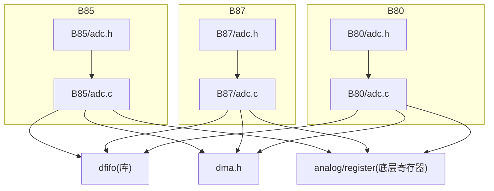
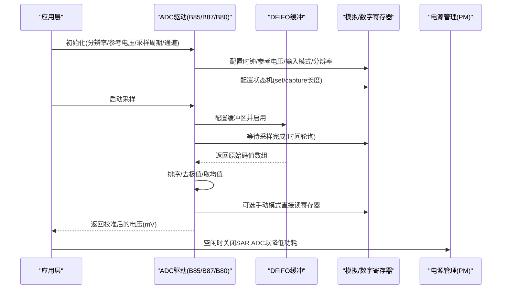
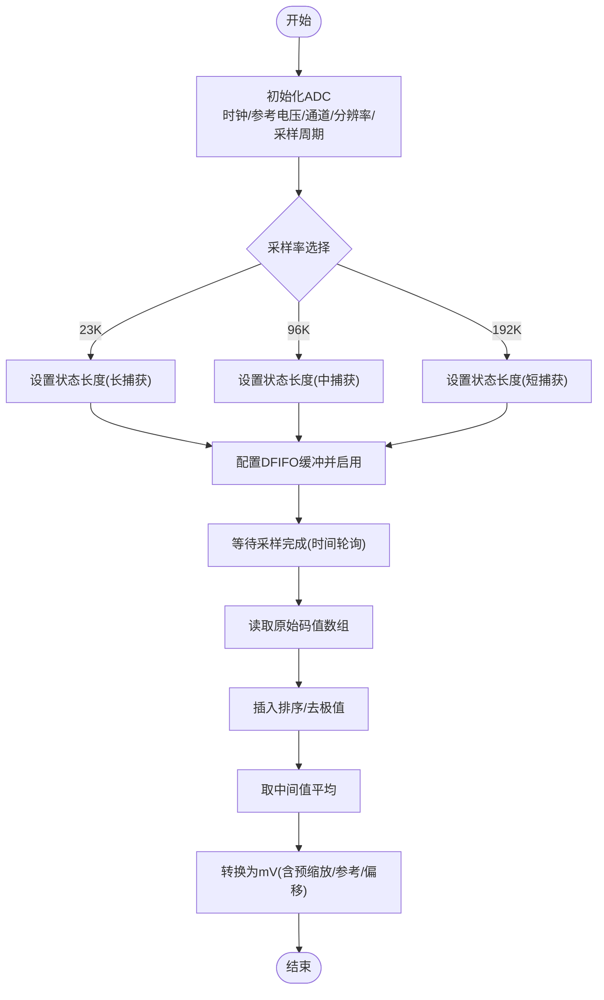
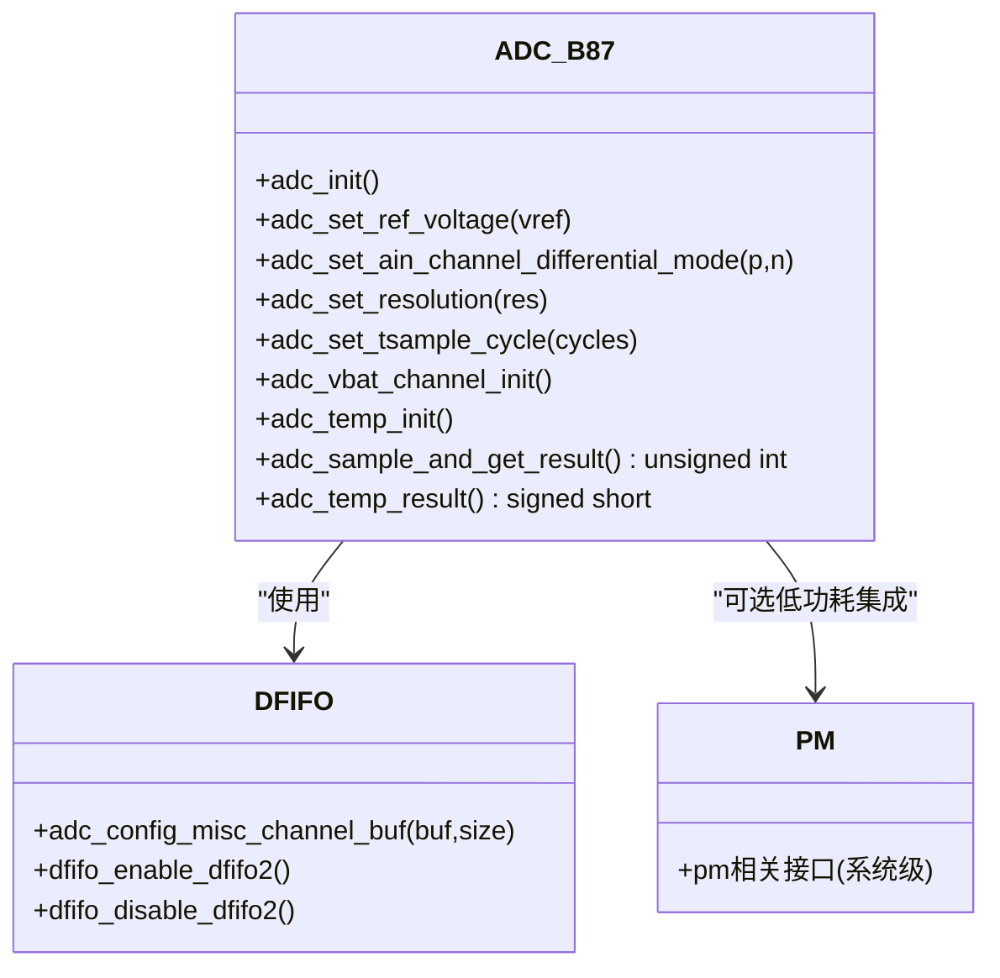
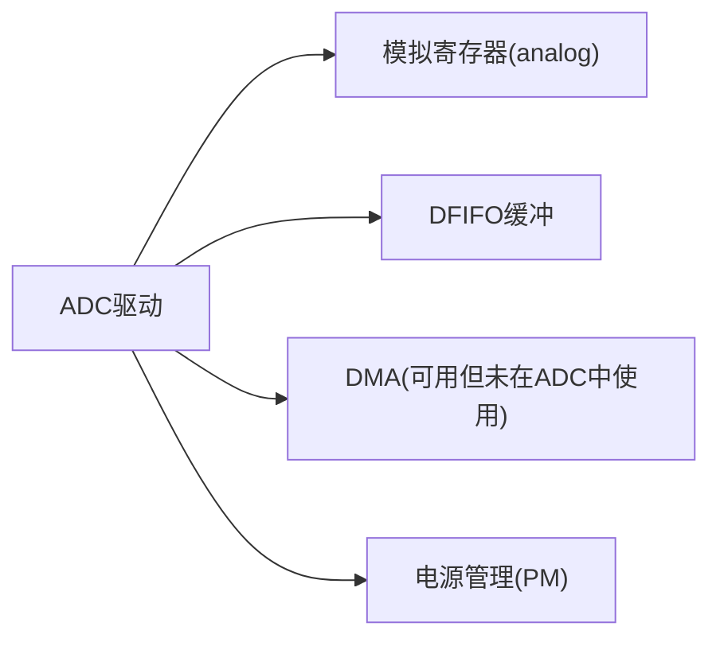

# ADC驱动

<cite>
**本文引用的文件**
- [B85/adc.h](file://tc_ble_single_sdk/drivers/B85/adc.h)
- [B85/adc.c](file://tc_ble_single_sdk/drivers/B85/adc.c)
- [B87/adc.h](file://tc_ble_single_sdk/drivers/B87/adc.h)
- [B87/adc.c](file://tc_ble_single_sdk/drivers/B87/adc.c)
- [B80/adc.h](file://8373_dongle_for_km/chip/B80/drivers/adc.h)
- [B80/adc.c](file://8373_dongle_for_km/chip/B80/drivers/adc.c)
- [dma.h](file://tc_ble_single_sdk/drivers/B85/dma.h)
</cite>

## 目录
1. [简介](#简介)
2. [项目结构](#项目结构)
3. [核心组件](#核心组件)
4. [架构总览](#架构总览)
5. [详细组件分析](#详细组件分析)
6. [依赖关系分析](#依赖关系分析)
7. [性能与功耗考量](#性能与功耗考量)
8. [故障排查指南](#故障排查指南)
9. [结论](#结论)
10. [附录](#附录)

## 简介
本技术文档面向Telink B85/B87/B80系列MCU的ADC驱动，系统性说明模数转换器的配置选项（采样分辨率、参考电压、采样速率、输入模式等）、单通道与多通道采集实现、DMA与中断触发、自动扫描状态机、校准算法与噪声抑制、以及低功耗与电源管理集成。文档同时提供电池电压监测、温度传感器读取、外部信号采集等典型应用示例的实现要点与注意事项。

## 项目结构
仓库中针对三种芯片平台分别提供了独立的ADC驱动实现：
- B85：支持L/R/MISC三通道，具备多种参考电压与采样率选择，内置DFIFO数据缓冲与状态机控制。
- B87：仅MISC通道，差分输入模式，支持内部温度传感器与VBAT通道，提供温度结果换算接口。
- B80：简化版本，仅MISC通道，默认固定高分辨率与采样周期，提供GPIO/VBAT/温度相关初始化与采样接口。

图表来源
- [B85/adc.h:1-120](file://tc_ble_single_sdk/drivers/B85/adc.h#L1-L120)
- [B85/adc.c:293-324](file://tc_ble_single_sdk/drivers/B85/adc.c#L293-L324)
- [B87/adc.h:32-167](file://tc_ble_single_sdk/drivers/B87/adc.h#L32-L167)
- [B87/adc.c:217-230](file://tc_ble_single_sdk/drivers/B87/adc.c#L217-L230)
- [B80/adc.h:31-175](file://8373_dongle_for_km/chip/B80/drivers/adc.h#L31-L175)
- [B80/adc.c:129-153](file://8373_dongle_for_km/chip/B80/drivers/adc.c#L129-L153)
- [dma.h:66-157](file://tc_ble_single_sdk/drivers/B85/dma.h#L66-L157)

章节来源
- [B85/adc.h:31-198](file://tc_ble_single_sdk/drivers/B85/adc.h#L31-L198)
- [B87/adc.h:32-167](file://tc_ble_single_sdk/drivers/B87/adc.h#L32-L167)
- [B80/adc.h:31-175](file://8373_dongle_for_km/chip/B80/drivers/adc.h#L31-L175)

## 核心组件
- 参考电压与分压
  - B85：支持0.6V/0.9V/1.2V/VBAT/N分压；可通过函数设置各通道参考电压并调整偏置电流。
  - B87/B80：支持0.9V/1.2V及VBAT分压；提供分压器配置与全局divider系数维护。
- 采样分辨率与输入模式
  - 支持8/10/12/14位分辨率；B85支持单端/差分模式，B87/B80仅差分模式。
- 采样时钟与采样周期
  - 通过24MHz源分频得到ADC采样时钟；可配置采样阶段时钟周期数以稳定输入。
- 通道与引脚映射
  - B85：L/R/MISC三通道，支持PGA与温度传感器输入；B87/B80：仅MISC通道，支持VBAT与温度传感器。
- 状态机与采样速率
  - 通过“set/capture”状态长度配置实现不同采样率（如23K/96K/192K）；B85在初始化时根据宏选择状态长度。
- 数据获取与滤波
  - 使用DFIFO缓冲批量采样，软件进行插入排序后取中间值平均，再转换为mV；支持手动模式直接读寄存器。
- 校准与偏移
  - 提供GPIO与VBAT通道的参考电压校准值与偏移量存储，用于提高测量精度。
- 低功耗与电源管理
  - 提供SAR ADC上电/断电控制；结合系统PM模块可在空闲时关闭ADC以降低功耗。

章节来源
- [B85/adc.h:48-198](file://tc_ble_single_sdk/drivers/B85/adc.h#L48-L198)
- [B85/adc.c:112-134](file://tc_ble_single_sdk/drivers/B85/adc.c#L112-L134)
- [B87/adc.h:44-167](file://tc_ble_single_sdk/drivers/B87/adc.h#L44-L167)
- [B87/adc.c:116-137](file://tc_ble_single_sdk/drivers/B87/adc.c#L116-L137)
- [B80/adc.h:40-175](file://8373_dongle_for_km/chip/B80/drivers/adc.h#L40-L175)
- [B80/adc.c:74-97](file://8373_dongle_for_km/chip/B80/drivers/adc.c#L74-L97)

## 架构总览
下图展示ADC驱动在各平台中的调用关系与数据流：应用层调用初始化与采样接口，驱动内部完成时钟、参考电压、通道、分辨率、采样周期等配置，并通过DFIFO或手动方式读取原始码值，经滤波与校准转换为实际电压值。

图表来源
- [B85/adc.c:293-324](file://tc_ble_single_sdk/drivers/B85/adc.c#L293-L324)
- [B85/adc.c:417-516](file://tc_ble_single_sdk/drivers/B85/adc.c#L417-L516)
- [B87/adc.c:217-230](file://tc_ble_single_sdk/drivers/B87/adc.c#L217-L230)
- [B87/adc.c:420-493](file://tc_ble_single_sdk/drivers/B87/adc.c#L420-L493)
- [B80/adc.c:129-153](file://8373_dongle_for_km/chip/B80/drivers/adc.c#L129-L153)
- [B80/adc.c:244-312](file://8373_dongle_for_km/chip/B80/drivers/adc.c#L244-L312)

## 详细组件分析

### B85平台：三通道ADC与多采样率
- 关键能力
  - 参考电压：0.6V/0.9V/1.2V/VBAT/N分压；可按通道独立设置。
  - 输入模式：单端/差分；支持L/R/MISC三通道。
  - 分辨率：8/10/12/14位。
  - 采样周期：3~48个ADC时钟周期可调。
  - 采样率：通过状态机长度配置支持23K/96K/192K。
  - 数据路径：DFIFO缓冲+软件滤波（插入排序+中间值平均）。
- 初始化流程
  - 复位ADC模块→使能24M到SAR时钟→设置采样时钟→关闭PGA→设置增益偏置→禁用DFIFO→按采样率设置状态长度。
- 采样与转换
  - 配置DFIFO缓冲区→等待至少2个采样周期→循环读取并排序→取中间值平均→转换为mV（考虑预缩放、参考电压与偏移）。
- 手动模式
  - 通过控制寄存器禁止自动采样，直接读取高低字节寄存器获得原始码值。

图表来源
- [B85/adc.c:293-324](file://tc_ble_single_sdk/drivers/B85/adc.c#L293-L324)
- [B85/adc.c:417-516](file://tc_ble_single_sdk/drivers/B85/adc.c#L417-L516)

章节来源
- [B85/adc.h:31-198](file://tc_ble_single_sdk/drivers/B85/adc.h#L31-L198)
- [B85/adc.c:293-324](file://tc_ble_single_sdk/drivers/B85/adc.c#L293-L324)
- [B85/adc.c:417-516](file://tc_ble_single_sdk/drivers/B85/adc.c#L417-L516)

### B87平台：MISC通道与温度传感器
- 关键能力
  - 仅MISC通道，差分输入；支持0.9V/1.2V参考电压与VBAT分压。
  - 分辨率：8/10/12/14位；采样周期可调。
  - 内置温度传感器：提供初始化与温度结果换算接口。
  - VBAT通道：支持专用初始化与分压配置。
- 初始化流程
  - 复位ADC→使能24M时钟→设置采样时钟→禁用DFIFO→按需设置状态长度与通道。
- 采样与转换
  - 与B85类似，采用DFIFO缓冲+软件滤波；转换公式包含分压系数、预缩放与参考电压。
- 温度读取
  - 提供adc_temp_init与adc_temp_result，内部基于ADC码值与线性模型计算温度。

图表来源
- [B87/adc.h:32-167](file://tc_ble_single_sdk/drivers/B87/adc.h#L32-L167)
- [B87/adc.c:217-230](file://tc_ble_single_sdk/drivers/B87/adc.c#L217-L230)
- [B87/adc.c:420-493](file://tc_ble_single_sdk/drivers/B87/adc.c#L420-L493)
- [B87/adc.c:530-551](file://tc_ble_single_sdk/drivers/B87/adc.c#L530-L551)

章节来源
- [B87/adc.h:32-167](file://tc_ble_single_sdk/drivers/B87/adc.h#L32-L167)
- [B87/adc.c:217-230](file://tc_ble_single_sdk/drivers/B87/adc.c#L217-L230)
- [B87/adc.c:420-493](file://tc_ble_single_sdk/drivers/B87/adc.c#L420-L493)
- [B87/adc.c:530-551](file://tc_ble_single_sdk/drivers/B87/adc.c#L530-L551)

### B80平台：简化MISC通道
- 关键能力
  - 仅MISC通道，差分输入；默认固定高分辨率与采样周期；支持GPIO/VBAT/温度相关初始化。
  - 提供统一的参考电压与分压配置；支持手动模式读取。
- 初始化流程
  - 复位ADC→使能24M时钟→设置采样时钟→禁用DFIFO→设置通道/分辨率/参考电压/状态长度/采样周期。
- 采样与转换
  - 与B87类似，采用DFIFO缓冲+软件滤波；转换公式包含分压系数、预缩放与参考电压。
- 温度读取
  - 提供adc_temp_init与adc_temp_result，内部基于ADC码值与线性模型计算温度。

章节来源
- [B80/adc.h:31-175](file://8373_dongle_for_km/chip/B80/drivers/adc.h#L31-L175)
- [B80/adc.c:129-153](file://8373_dongle_for_km/chip/B80/drivers/adc.c#L129-L153)
- [B80/adc.c:244-312](file://8373_dongle_for_km/chip/B80/drivers/adc.c#L244-L312)
- [B80/adc.c:358-367](file://8373_dongle_for_km/chip/B80/drivers/adc.c#L358-L367)

## 依赖关系分析
- 驱动与底层寄存器
  - 所有平台均通过analog_write/read访问模拟寄存器，配置时钟、参考电压、输入通道、分辨率、采样周期等。
- 数据缓冲与传输
  - 使用DFIFO进行批量数据搬运；B85/B87/B80均在采样前配置缓冲区大小并启用DFIFO，采样结束后禁用。
- DMA与中断
  - 提供的DMA头文件定义了DMA通道与中断控制接口；当前ADC驱动主要采用软件轮询与DFIFO，未直接使用DMA通道进行ADC数据传输。
- 电源管理
  - 提供SAR ADC上电/断电控制；建议结合系统PM在空闲时关闭ADC以降低功耗。

图表来源
- [B85/adc.c:293-324](file://tc_ble_single_sdk/drivers/B85/adc.c#L293-L324)
- [B87/adc.c:217-230](file://tc_ble_single_sdk/drivers/B87/adc.c#L217-L230)
- [B80/adc.c:129-153](file://8373_dongle_for_km/chip/B80/drivers/adc.c#L129-L153)
- [dma.h:66-157](file://tc_ble_single_sdk/drivers/B85/dma.h#L66-L157)

章节来源
- [dma.h:66-157](file://tc_ble_single_sdk/drivers/B85/dma.h#L66-L157)

## 性能与功耗考量
- 采样速率与状态机
  - B85通过设置“capture/set”状态长度实现不同采样率；更短的捕获状态提升采样率但降低稳定性，需权衡噪声与精度。
- 采样周期与噪声抑制
  - 增加采样周期有助于输入稳定，减少噪声；但会降低最大采样率。
- 滤波算法
  - 软件插入排序去除极值，取中间值平均，有效抑制突发噪声；可根据场景调整采样数量与平均窗口。
- 参考电压与预缩放
  - 合理选择参考电压与预缩放比例，确保输入范围覆盖且充分利用分辨率；注意不同参考电压下的偏置电流配置。
- 低功耗
  - 使用SAR ADC上电/断电控制；在空闲或睡眠模式下关闭ADC；结合系统PM策略最小化功耗。

[本节为通用指导，不直接分析具体文件]

## 故障排查指南
- 无数据或数据为0
  - 检查是否已启用DFIFO并正确配置缓冲区大小；确认采样周期与等待时间足够。
  - 验证参考电压与输入通道配置是否正确；差分模式下注意正负端连接。
- 数据不稳定或噪声大
  - 增加采样周期；调整参考电压与预缩放；增大滤波窗口或增加采样次数。
- 电压转换偏差
  - 校准参考电压与偏移量；确认分压系数与预缩放比例；检查是否使用了正确的校准参数。
- 温度读数异常
  - 确认温度传感器已启用；检查初始化参数（参考电压、预缩放）；使用官方温度换算公式。
- 功耗过高
  - 在空闲时关闭SAR ADC；减少采样频率；优化状态机长度。

章节来源
- [B85/adc.c:417-516](file://tc_ble_single_sdk/drivers/B85/adc.c#L417-L516)
- [B87/adc.c:420-493](file://tc_ble_single_sdk/drivers/B87/adc.c#L420-L493)
- [B80/adc.c:244-312](file://8373_dongle_for_km/chip/B80/drivers/adc.c#L244-L312)

## 结论
该ADC驱动在不同平台上提供了灵活的配置选项与稳定的数据采集流程。通过状态机控制、DFIFO缓冲与软件滤波，实现了高精度与低噪声的电压测量；同时支持电池电压监测、温度传感器读取与外部信号采集等典型应用。结合低功耗策略与校准机制，可在资源受限的嵌入式场景中实现可靠的模拟信号处理。

[本节为总结性内容，不直接分析具体文件]

## 附录
- 典型应用示例要点
  - 电池电压监测：使用VBAT通道初始化，配置分压与参考电压，采样后转换为mV。
  - 温度传感器读取：启用温度传感器，使用adc_temp_init与adc_temp_result获取温度。
  - 外部信号采集：配置对应GPIO为ADC输入，选择合适的参考电压与分辨率，采样并滤波。
- 高级功能
  - DMA传输：当前驱动未直接使用DMA进行ADC数据传输，可结合DMA实现更高吞吐量的数据搬运。
  - 中断触发：可通过系统中断机制配合DFIFO完成数据通知，减少CPU占用。
  - 自动扫描模式：通过状态机长度配置实现多通道或重复采样，注意状态切换时间与稳定性。
  - 低功耗模式：在空闲时关闭SAR ADC，结合系统PM策略降低功耗。

[本节为补充信息，不直接分析具体文件]