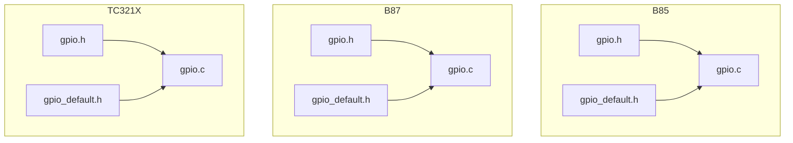
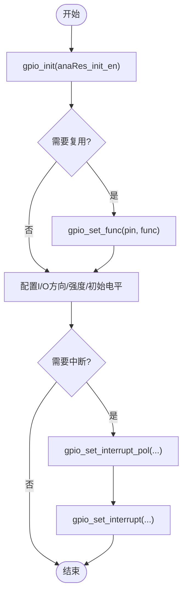
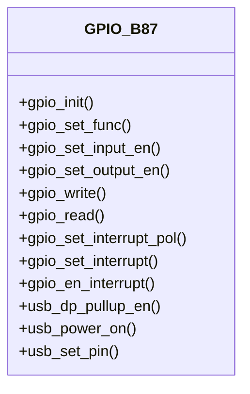
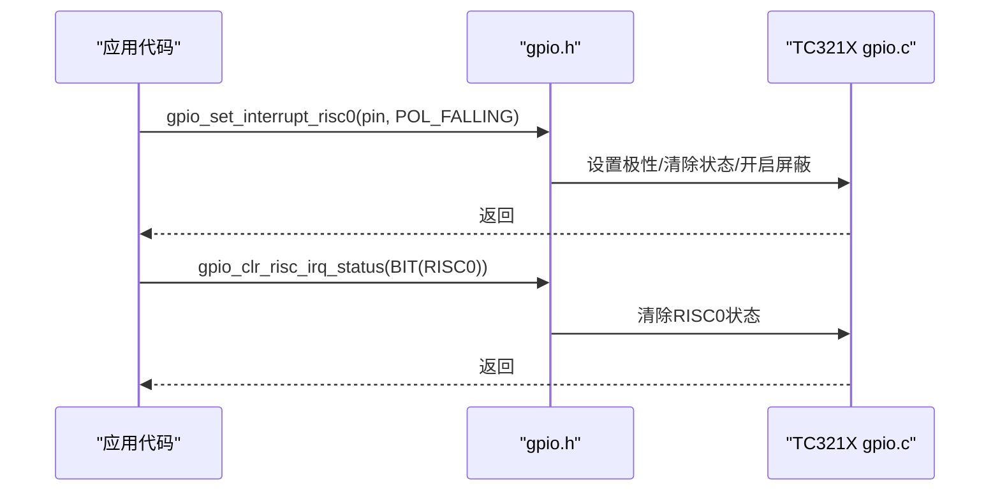
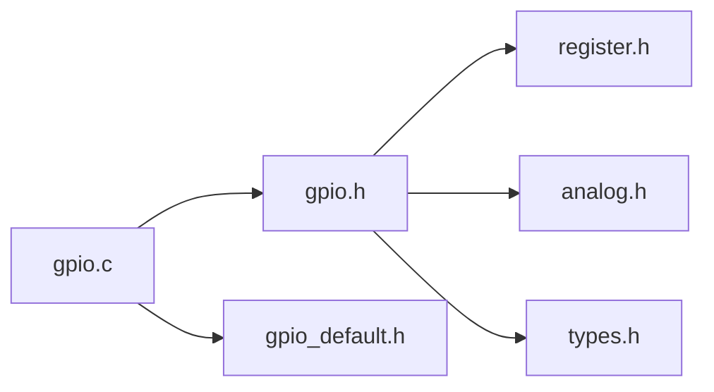
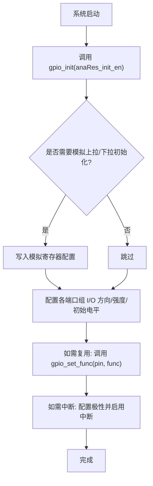

# GPIO驱动

<cite>
**本文引用的文件**
- [gpio.h](file://tc_ble_single_sdk/drivers/B85/gpio.h)
- [gpio.c](file://tc_ble_single_sdk/drivers/B85/gpio.c)
- [gpio_default.h](file://tc_ble_single_sdk/drivers/B85/gpio_default.h)
- [gpio.h](file://tc_ble_single_sdk/drivers/B87/gpio.h)
- [gpio.c](file://tc_ble_single_sdk/drivers/B87/gpio.c)
- [gpio_default.h](file://tc_ble_single_sdk/drivers/B87/gpio_default.h)
- [gpio.h](file://tc_ble_single_sdk/drivers/TC321X/gpio.h)
- [gpio.c](file://tc_ble_single_sdk/drivers/TC321X/gpio.c)
- [gpio_default.h](file://tc_ble_single_sdk/drivers/TC321X/gpio_default.h)
</cite>

## 目录
1. [简介](#简介)
2. [项目结构](#项目结构)
3. [核心组件](#核心组件)
4. [架构总览](#架构总览)
5. [详细组件分析](#详细组件分析)
6. [依赖关系分析](#依赖关系分析)
7. [性能与功耗优化](#性能与功耗优化)
8. [故障排查指南](#故障排查指南)
9. [结论](#结论)
10. [附录：初始化流程与使用示例](#附录初始化流程与使用示例)

## 简介
本技术文档面向B85、B87、TC321X三类芯片平台的GPIO驱动，系统性说明引脚配置、输入输出模式设置、中断触发配置、寄存器操作封装与API接口设计；并覆盖引脚复用管理、不同平台差异、电平检测、边沿触发、软件去抖实现思路、功耗优化与电气特性注意事项。文档以SDK中各平台gpio.h/gpio.c及默认配置头文件为依据，提供可追溯的源码路径与图示。

## 项目结构
- 每个平台（B85/B87/TC321X）均提供独立的GPIO驱动实现：
  - 公共接口定义：gpio.h（类型、枚举、API声明）
  - 具体实现：gpio.c（初始化、MUX映射、I/O控制、中断等）
  - 默认配置：gpio_default.h（端口默认方向、强度、初始电平、复用功能、上拉下拉等宏）
- B85与B87在寄存器命名和细节上略有差异；TC321X新增多RISC中断通道与更细粒度驱动强度配置。



**图表来源**
- [gpio.h:1-120](file://tc_ble_single_sdk/drivers/B85/gpio.h#L1-L120)
- [gpio.c:90-185](file://tc_ble_single_sdk/drivers/B85/gpio.c#L90-L185)
- [gpio_default.h:1-180](file://tc_ble_single_sdk/drivers/B85/gpio_default.h#L1-L180)
- [gpio.h:1-140](file://tc_ble_single_sdk/drivers/B87/gpio.h#L1-L140)
- [gpio.c:90-177](file://tc_ble_single_sdk/drivers/B87/gpio.c#L90-L177)
- [gpio_default.h:1-180](file://tc_ble_single_sdk/drivers/B87/gpio_default.h#L1-L180)
- [gpio.h:1-210](file://tc_ble_single_sdk/drivers/TC321X/gpio.h#L1-L210)
- [gpio.c:90-188](file://tc_ble_single_sdk/drivers/TC321X/gpio.c#L90-L188)
- [gpio_default.h:1-200](file://tc_ble_single_sdk/drivers/TC321X/gpio_default.h#L1-L200)

**章节来源**
- [gpio.h:1-120](file://tc_ble_single_sdk/drivers/B85/gpio.h#L1-L120)
- [gpio.c:90-185](file://tc_ble_single_sdk/drivers/B85/gpio.c#L90-L185)
- [gpio_default.h:1-180](file://tc_ble_single_sdk/drivers/B85/gpio_default.h#L1-L180)
- [gpio.h:1-140](file://tc_ble_single_sdk/drivers/B87/gpio.h#L1-L140)
- [gpio.c:90-177](file://tc_ble_single_sdk/drivers/B87/gpio.c#L90-L177)
- [gpio_default.h:1-180](file://tc_ble_single_sdk/drivers/B87/gpio_default.h#L1-L180)
- [gpio.h:1-210](file://tc_ble_single_sdk/drivers/TC321X/gpio.h#L1-L210)
- [gpio.c:90-188](file://tc_ble_single_sdk/drivers/TC321X/gpio.c#L90-L188)
- [gpio_default.h:1-200](file://tc_ble_single_sdk/drivers/TC321X/gpio_default.h#L1-L200)

## 核心组件
- 引脚与分组定义：按组（A/B/C/D/E/F）组织引脚，便于批量配置。
- 复用功能枚举：支持GPIO、UART、SPI、I2C、PWM、USB、ADC、比较器、音频相关信号等。
- 基本I/O API：
  - 输入/输出使能：gpio_set_input_en / gpio_set_output_en
  - 读写电平：gpio_write / gpio_read / gpio_toggle
  - 读取缓存/全端口：gpio_read_cache / gpio_read_all
- 上拉/下拉与驱动强度：
  - 通用：gpio_setup_up_down_resistor
  - 驱动强度：B85/B87为单比特强度；TC321X为两比特组合（2/4/8/12mA）
- 中断系统：
  - 极性配置：gpio_set_interrupt_pol
  - 启用/禁用：gpio_set_interrupt / gpio_en_interrupt
  - RISC路由：B85/B87支持GPIO/RISC0/RISC1；TC321X扩展至RISC0~RISC3，并提供专用状态清理与屏蔽API
- USB相关：
  - DP上拉控制：usb_dp_pullup_en
  - USB模块供电：usb_power_on
  - PA5/PA6复用为USB：usb_set_pin

**章节来源**
- [gpio.h:35-160](file://tc_ble_single_sdk/drivers/B85/gpio.h#L35-L160)
- [gpio.h:200-560](file://tc_ble_single_sdk/drivers/B85/gpio.h#L200-L560)
- [gpio.h:100-180](file://tc_ble_single_sdk/drivers/B87/gpio.h#L100-L180)
- [gpio.h:200-568](file://tc_ble_single_sdk/drivers/B87/gpio.h#L200-L568)
- [gpio.h:100-210](file://tc_ble_single_sdk/drivers/TC321X/gpio.h#L100-L210)
- [gpio.h:270-706](file://tc_ble_single_sdk/drivers/TC321X/gpio.h#L270-L706)

## 架构总览
GPIO驱动采用“统一API + 平台差异化实现”的分层设计：
- 应用层调用统一的gpio_* API
- 平台层根据芯片寄存器布局进行位操作与模拟寄存器写入
- 默认配置通过gpio_default.h集中管理，便于编译期裁剪与快速初始化

```mermaid
sequenceDiagram
participant App as "应用代码"
participant GPIO as "gpio.h 接口"
case B85 as "B85 gpio.c"
case B87 as "B87 gpio.c"
case T321X as "TC321X gpio.c"
App->>GPIO : 调用 gpio_init()
alt B85
GPIO->>B85 : 进入 gpio_init(anaRes_init_en)
B85-->>App : 完成端口初始化
else B87
GPIO->>B87 : 进入 gpio_init(anaRes_init_en)
B87-->>App : 完成端口初始化
else TC321X
GPIO->>T321X : 进入 gpio_init(anaRes_init_en)
T321X-->>App : 完成端口初始化
end
```

**图表来源**
- [gpio.c:90-185](file://tc_ble_single_sdk/drivers/B85/gpio.c#L90-L185)
- [gpio.c:90-177](file://tc_ble_single_sdk/drivers/B87/gpio.c#L90-L177)
- [gpio.c:90-188](file://tc_ble_single_sdk/drivers/TC321X/gpio.c#L90-L188)

**章节来源**
- [gpio.c:90-185](file://tc_ble_single_sdk/drivers/B85/gpio.c#L90-L185)
- [gpio.c:90-177](file://tc_ble_single_sdk/drivers/B87/gpio.c#L90-L177)
- [gpio.c:90-188](file://tc_ble_single_sdk/drivers/TC321X/gpio.c#L90-L188)

## 详细组件分析

### B85平台GPIO
- 初始化：
  - 配置PA/PB/PC/PD/PE组的输入/输出使能、数据输出、驱动强度、GPIO功能选择
  - 可选初始化模拟上拉/下拉寄存器
- 复用映射：
  - 通过switch-case将引脚映射到具体外设（UART/SPI/I2C/PWM/USB等），写入对应MUX寄存器
- I/O控制：
  - 提供输入/输出使能、写电平、读电平、翻转、批量读取等
- 中断：
  - 支持GPIO主中断、RISC0、RISC1；可配置极性与使能，包含中断源清理与屏蔽
- USB：
  - 提供DP上拉、模块供电、PA5/PA6复用为USB



**图表来源**
- [gpio.c:90-185](file://tc_ble_single_sdk/drivers/B85/gpio.c#L90-L185)
- [gpio.c:185-800](file://tc_ble_single_sdk/drivers/B85/gpio.c#L185-L800)
- [gpio.h:370-502](file://tc_ble_single_sdk/drivers/B85/gpio.h#L370-L502)

**章节来源**
- [gpio.c:90-185](file://tc_ble_single_sdk/drivers/B85/gpio.c#L90-L185)
- [gpio.c:185-800](file://tc_ble_single_sdk/drivers/B85/gpio.c#L185-L800)
- [gpio.h:370-502](file://tc_ble_single_sdk/drivers/B85/gpio.h#L370-L502)

### B87平台GPIO
- 与B85类似，但部分寄存器命名与位域存在差异；同时增加BLE相关复用选项（如BLE_ACTIVE/BLE_STATUS）。
- 初始化同样覆盖全部端口组，支持模拟上拉/下拉初始化。
- 中断能力与B85一致，支持GPIO/RISC0/RISC1。



**图表来源**
- [gpio.c:90-177](file://tc_ble_single_sdk/drivers/B87/gpio.c#L90-L177)
- [gpio.c:185-796](file://tc_ble_single_sdk/drivers/B87/gpio.c#L185-L796)
- [gpio.h:180-568](file://tc_ble_single_sdk/drivers/B87/gpio.h#L180-L568)

**章节来源**
- [gpio.c:90-177](file://tc_ble_single_sdk/drivers/B87/gpio.c#L90-L177)
- [gpio.c:185-796](file://tc_ble_single_sdk/drivers/B87/gpio.c#L185-L796)
- [gpio.h:180-568](file://tc_ble_single_sdk/drivers/B87/gpio.h#L180-L568)

### TC321X平台GPIO
- 新增特性：
  - 驱动强度两比特编码（2/4/8/12mA），提供更精细的电流驱动能力
  - 中断扩展至RISC0~RISC3，提供专用状态清理与屏蔽API
  - 新增时钟探测功能：可将内部时钟输出到指定引脚用于调试
- 初始化：
  - 对PA/PB/PC/PD/PE/PF各组进行输入/输出、强度、GPIO功能、输出寄存器的批量配置
- 复用映射：
  - 通过gpio_set_func将引脚切换至GPIO或特定外设功能
- 中断：
  - 支持上升/下降/高/低电平触发类型；提供RISCx专属的中断使能与清理



**图表来源**
- [gpio.h:484-512](file://tc_ble_single_sdk/drivers/TC321X/gpio.h#L484-L512)
- [gpio.h:533-560](file://tc_ble_single_sdk/drivers/TC321X/gpio.h#L533-L560)
- [gpio.h:581-656](file://tc_ble_single_sdk/drivers/TC321X/gpio.h#L581-L656)
- [gpio.h:677-706](file://tc_ble_single_sdk/drivers/TC321X/gpio.h#L677-L706)

**章节来源**
- [gpio.c:90-188](file://tc_ble_single_sdk/drivers/TC321X/gpio.c#L90-L188)
- [gpio.c:202-325](file://tc_ble_single_sdk/drivers/TC321X/gpio.c#L202-L325)
- [gpio.c:327-468](file://tc_ble_single_sdk/drivers/TC321X/gpio.c#L327-L468)
- [gpio.h:100-210](file://tc_ble_single_sdk/drivers/TC321X/gpio.h#L100-L210)
- [gpio.h:270-706](file://tc_ble_single_sdk/drivers/TC321X/gpio.h#L270-L706)

## 依赖关系分析
- 头文件依赖：
  - 各平台gpio.h依赖register/analog/types等底层定义
  - gpio_default.h提供编译期默认配置，被gpio.c引用
- 运行时依赖：
  - 中断处理依赖全局中断源与屏蔽寄存器
  - USB相关依赖analog寄存器与电源管理



**图表来源**
- [gpio.h:24-31](file://tc_ble_single_sdk/drivers/B85/gpio.h#L24-L31)
- [gpio.c:24-30](file://tc_ble_single_sdk/drivers/B85/gpio.c#L24-L30)
- [gpio_default.h:24-27](file://tc_ble_single_sdk/drivers/B85/gpio_default.h#L24-L27)

**章节来源**
- [gpio.h:24-31](file://tc_ble_single_sdk/drivers/B85/gpio.h#L24-L31)
- [gpio.c:24-30](file://tc_ble_single_sdk/drivers/B85/gpio.c#L24-L30)
- [gpio_default.h:24-27](file://tc_ble_single_sdk/drivers/B85/gpio_default.h#L24-L27)

## 性能与功耗优化
- 驱动强度选择：
  - B85/B87：单比特强度，建议根据负载与EMI需求选择合适档位
  - TC321X：两比特强度（2/4/8/12mA），低功耗场景优先选用小电流
- 上拉/下拉配置：
  - 空闲引脚建议使用弱上拉或下拉，避免悬空导致漏电
  - 注意某些引脚内部已有固定上拉（如SWS），避免外部电阻冲突
- 输入缓冲与读取：
  - 高频轮询时可使用gpio_read_cache减少寄存器访问
- 中断策略：
  - 仅启用必要引脚中断，及时清除中断标志，避免重复触发
  - 使用RISC路由分担中断负载（TC321X）
- USB相关：
  - 不使用USB时关闭DP上拉与模块供电以降低静态功耗

[本节为通用指导，不直接分析具体文件]

## 故障排查指南
- 无法唤醒/误唤醒：
  - 检查中断极性配置是否正确
  - 确认已清除中断源标志后再启用中断
- 电平异常：
  - 检查是否错误启用了输出且未正确设置初始电平
  - 检查复用功能是否与硬件电路冲突
- 功耗偏高：
  - 检查是否有引脚处于浮空状态
  - 检查是否开启了不必要的模块（如USB）
- 中断丢失：
  - 确认中断屏蔽位已正确设置
  - 在中断服务程序中尽快清除状态位

**章节来源**
- [gpio.h:370-502](file://tc_ble_single_sdk/drivers/B85/gpio.h#L370-L502)
- [gpio.h:380-509](file://tc_ble_single_sdk/drivers/B87/gpio.h#L380-L509)
- [gpio.h:484-656](file://tc_ble_single_sdk/drivers/TC321X/gpio.h#L484-L656)

## 结论
该GPIO驱动在不同平台上提供了统一的API抽象，同时针对B85/B87/TC321X的寄存器差异进行了适配。通过合理的初始化、复用配置、中断策略与功耗优化，可满足从基础I/O到复杂外设复用的多种应用场景。建议在项目中结合gpio_default.h进行编译期配置，并在运行时按需调整驱动强度与中断行为。

[本节为总结性内容，不直接分析具体文件]

## 附录：初始化流程与使用示例

### 初始化流程（通用）


**图表来源**
- [gpio.c:90-185](file://tc_ble_single_sdk/drivers/B85/gpio.c#L90-L185)
- [gpio.c:90-177](file://tc_ble_single_sdk/drivers/B87/gpio.c#L90-L177)
- [gpio.c:90-188](file://tc_ble_single_sdk/drivers/TC321X/gpio.c#L90-L188)

**章节来源**
- [gpio.c:90-185](file://tc_ble_single_sdk/drivers/B85/gpio.c#L90-L185)
- [gpio.c:90-177](file://tc_ble_single_sdk/drivers/B87/gpio.c#L90-L177)
- [gpio.c:90-188](file://tc_ble_single_sdk/drivers/TC321X/gpio.c#L90-L188)

### 使用示例（描述性步骤）
- 配置引脚为输入并启用上拉：
  - 调用gpio_set_input_en启用输入
  - 调用gpio_setup_up_down_resistor选择上拉类型
  - 参考路径：[gpio.h:354-360](file://tc_ble_single_sdk/drivers/B85/gpio.h#L354-L360)、[gpio.c:327-365](file://tc_ble_single_sdk/drivers/TC321X/gpio.c#L327-L365)
- 配置引脚为输出并设置电平：
  - 调用gpio_set_output_en启用输出
  - 调用gpio_write设置初始电平
  - 参考路径：[gpio.h:198-258](file://tc_ble_single_sdk/drivers/B85/gpio.h#L198-L258)
- 配置边沿触发中断：
  - 调用gpio_set_interrupt_pol设置极性
  - 调用gpio_set_interrupt启用中断（或RISC路由）
  - 参考路径：[gpio.h:370-502](file://tc_ble_single_sdk/drivers/B85/gpio.h#L370-L502)、[gpio.h:484-656](file://tc_ble_single_sdk/drivers/TC321X/gpio.h#L484-L656)
- 复用为USB：
  - 调用usb_set_pin启用PA5/PA6作为USB差分对
  - 参考路径：[gpio.h:548-560](file://tc_ble_single_sdk/drivers/B85/gpio.h#L548-L560)、[gpio.h:548-568](file://tc_ble_single_sdk/drivers/B87/gpio.h#L548-L568)

[本节为概念性示例，不直接展示代码片段]