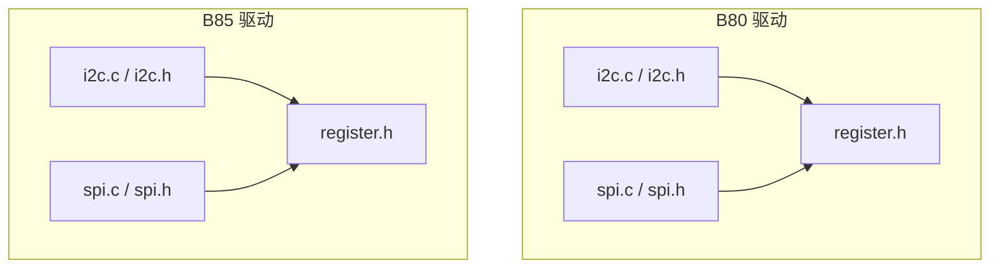
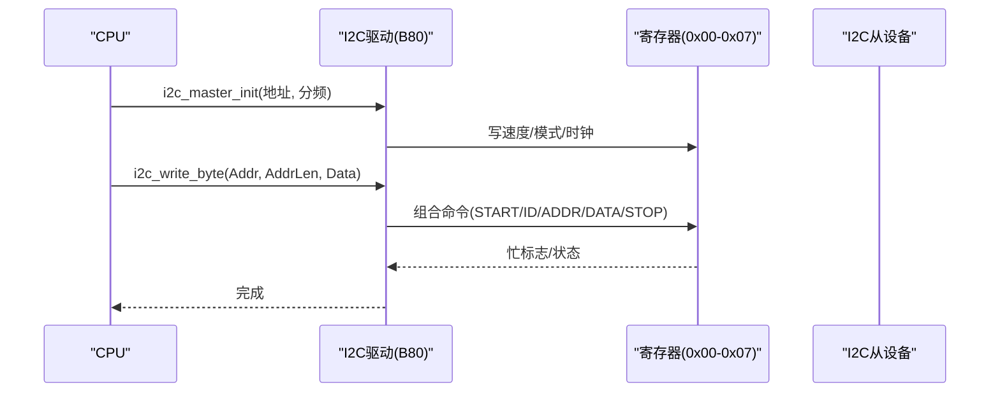
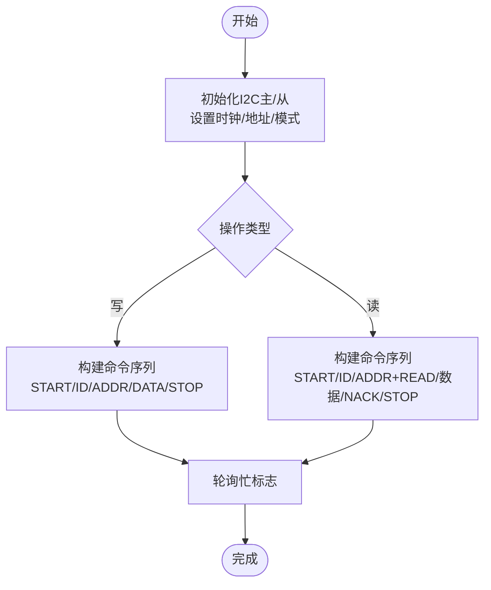
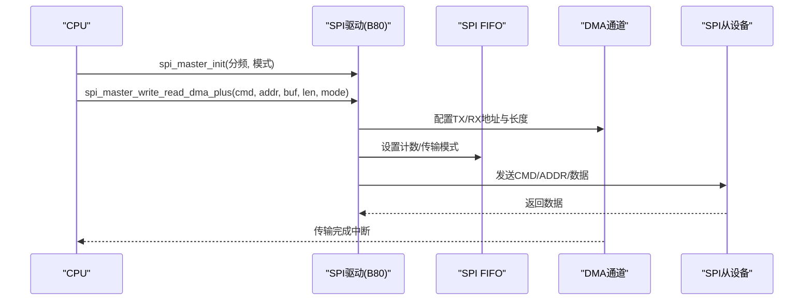
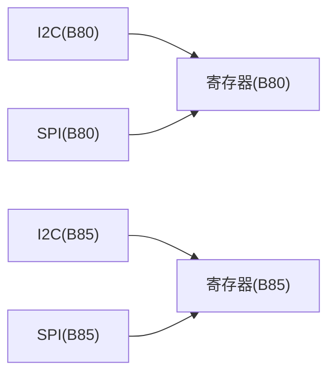

# I2C/SPI驱动

<cite>
**本文引用的文件**
- [8373_dongle_for_km/chip/B80/drivers/i2c.c](file://8373_dongle_for_km/chip/B80/drivers/i2c.c)
- [8373_dongle_for_km/chip/B80/drivers/i2c.h](file://8373_dongle_for_km/chip/B80/drivers/i2c.h)
- [8373_dongle_for_km/chip/B80/drivers/spi.c](file://8373_dongle_for_km/chip/B80/drivers/spi.c)
- [8373_dongle_for_km/chip/B80/drivers/spi.h](file://8373_dongle_for_km/chip/B80/drivers/spi.h)
- [8373_dongle_for_km/chip/B80/drivers/register.h](file://8373_dongle_for_km/chip/B80/drivers/register.h)
- [tc_ble_single_sdk/drivers/B85/i2c.c](file://tc_ble_single_sdk/drivers/B85/i2c.c)
- [tc_ble_single_sdk/drivers/B85/i2c.h](file://tc_ble_single_sdk/drivers/B85/i2c.h)
- [tc_ble_single_sdk/drivers/B85/spi.c](file://tc_ble_single_sdk/drivers/B85/spi.c)
- [tc_ble_single_sdk/drivers/B85/spi.h](file://tc_ble_single_sdk/drivers/B85/spi.h)
- [tc_ble_single_sdk/drivers/B85/register.h](file://tc_ble_single_sdk/drivers/B85/register.h)
</cite>

## 目录
1. [简介](#简介)
2. [项目结构](#项目结构)
3. [核心组件](#核心组件)
4. [架构总览](#架构总览)
5. [详细组件分析](#详细组件分析)
6. [依赖关系分析](#依赖关系分析)
7. [性能考虑](#性能考虑)
8. [故障排查指南](#故障排查指南)
9. [结论](#结论)
10. [附录：常见外设通信示例与要点](#附录：常见外设通信示例与要点)

## 简介
本技术文档围绕Telink B80与B85平台的I2C与SPI驱动，系统阐述主从模式配置、时钟频率设置、数据帧格式、片选管理、DMA传输、中断处理、错误检测与恢复策略，以及多设备地址管理与总线仲裁机制。同时给出传感器、存储器、显示设备等典型外设的通信实践与时序、信号完整性、EMC设计要点。

## 项目结构
- B80平台驱动位于 8373_dongle_for_km/chip/B80/drivers/ 下，提供I2C与SPI的完整实现与寄存器定义。
- B85平台驱动位于 tc_ble_single_sdk/drivers/B85/ 下，提供简化但功能完备的I2C与SPI实现。
- 两个平台均通过GPIO复用、时钟使能、寄存器位域控制完成外设初始化与数据传输。

图表来源
- [8373_dongle_for_km/chip/B80/drivers/i2c.c:1-325](file://8373_dongle_for_km/chip/B80/drivers/i2c.c#L1-L325)
- [8373_dongle_for_km/chip/B80/drivers/spi.c:1-696](file://8373_dongle_for_km/chip/B80/drivers/spi.c#L1-L696)
- [tc_ble_single_sdk/drivers/B85/i2c.c:1-355](file://tc_ble_single_sdk/drivers/B85/i2c.c#L1-L355)
- [tc_ble_single_sdk/drivers/B85/spi.c:1-287](file://tc_ble_single_sdk/drivers/B85/spi.c#L1-L287)

章节来源
- [8373_dongle_for_km/chip/B80/drivers/i2c.c:1-325](file://8373_dongle_for_km/chip/B80/drivers/i2c.c#L1-L325)
- [8373_dongle_for_km/chip/B80/drivers/spi.c:1-696](file://8373_dongle_for_km/chip/B80/drivers/spi.c#L1-L696)
- [tc_ble_single_sdk/drivers/B85/i2c.c:1-355](file://tc_ble_single_sdk/drivers/B85/i2c.c#L1-L355)
- [tc_ble_single_sdk/drivers/B85/spi.c:1-287](file://tc_ble_single_sdk/drivers/B85/spi.c#L1-L287)

## 核心组件
- I2C控制器（B80/B85）
  - 主/从模式切换、时钟分频、地址自动递增、映射/DMA模式、命令序列控制、状态与中断。
- SPI控制器（B80/B85）
  - 主/从模式、四相工作模式（CPOL/CPHA）、单/双/四线模式、命令/地址/数据阶段、FIFO与DMA、面板DCX/2DATA Lane等扩展能力。

章节来源
- [8373_dongle_for_km/chip/B80/drivers/i2c.h:35-127](file://8373_dongle_for_km/chip/B80/drivers/i2c.h#L35-L127)
- [8373_dongle_for_km/chip/B80/drivers/spi.h:41-169](file://8373_dongle_for_km/chip/B80/drivers/spi.h#L41-L169)
- [tc_ble_single_sdk/drivers/B85/i2c.h:33-137](file://tc_ble_single_sdk/drivers/B85/i2c.h#L33-L137)
- [tc_ble_single_sdk/drivers/B85/spi.h:44-152](file://tc_ble_single_sdk/drivers/B85/spi.h#L44-L152)

## 架构总览
I2C与SPI在B80/B85上分别由独立模块实现，底层通过寄存器位域控制时序、模式、DMA与中断。B80的SPI具备更丰富的命令/地址/数据阶段与面板相关特性；B85的SPI接口更简洁，适合常规主从通信。

图表来源
- [8373_dongle_for_km/chip/B80/drivers/i2c.c:56-64](file://8373_dongle_for_km/chip/B80/drivers/i2c.c#L56-L64)
- [8373_dongle_for_km/chip/B80/drivers/i2c.c:104-143](file://8373_dongle_for_km/chip/B80/drivers/i2c.c#L104-L143)
- [8373_dongle_for_km/chip/B80/drivers/register.h:35-75](file://8373_dongle_for_km/chip/B80/drivers/register.h#L35-L75)

章节来源
- [8373_dongle_for_km/chip/B80/drivers/i2c.c:56-64](file://8373_dongle_for_km/chip/B80/drivers/i2c.c#L56-L64)
- [8373_dongle_for_km/chip/B80/drivers/register.h:35-75](file://8373_dongle_for_km/chip/B80/drivers/register.h#L35-L75)

## 详细组件分析

### I2C驱动（B80）
- GPIO与上拉
  - 选择SDA/SCL引脚，启用输入并配置内部上拉电阻，再设置为I2C功能。
- 主模式初始化
  - 设置I2C时钟分频、从机地址（含读写位）、开启主模式、使能I2C时钟。
- 从模式初始化
  - 设置从机地址、关闭主模式、开启地址自动递增，支持DMA或Mapping模式；Mapping模式下配置映射缓冲区首地址。
- 单字节读写
  - 根据AddrLen（0/1/2/3）组合发送START/ID/ADDR/DATA/STOP命令序列，轮询忙标志等待完成。
- 批量读写
  - 循环写入/读取数据，最后以STOP结束；读时除最后一字节外均ACK，最后一字节NACK后停止。
- 中断与状态
  - 提供获取/清除从机中断状态接口，用于主机侧配合或从机侧事件处理。

图表来源
- [8373_dongle_for_km/chip/B80/drivers/i2c.c:56-94](file://8373_dongle_for_km/chip/B80/drivers/i2c.c#L56-L94)
- [8373_dongle_for_km/chip/B80/drivers/i2c.c:104-202](file://8373_dongle_for_km/chip/B80/drivers/i2c.c#L104-L202)
- [8373_dongle_for_km/chip/B80/drivers/i2c.c:211-322](file://8373_dongle_for_km/chip/B80/drivers/i2c.c#L211-L322)

章节来源
- [8373_dongle_for_km/chip/B80/drivers/i2c.c:34-94](file://8373_dongle_for_km/chip/B80/drivers/i2c.c#L34-L94)
- [8373_dongle_for_km/chip/B80/drivers/i2c.c:104-322](file://8373_dongle_for_km/chip/B80/drivers/i2c.c#L104-L322)
- [8373_dongle_for_km/chip/B80/drivers/i2c.h:35-127](file://8373_dongle_for_km/chip/B80/drivers/i2c.h#L35-L127)

### I2C驱动（B85）
- GPIO组选择
  - 提供多组引脚映射（如A3/A4、B6/D7、C0/C1、C2/C3），统一启用I2C功能与上拉。
- 主/从初始化
  - 与B80类似，设置时钟分频、地址、模式、时钟使能，并强制PAD为I2C功能。
- 单/批量读写
  - 与B80一致，按AddrLen组合命令序列，轮询忙标志，读时最后字节NACK。
- 中断状态
  - 提供查询/清除从机中断状态接口。

章节来源
- [tc_ble_single_sdk/drivers/B85/i2c.c:37-125](file://tc_ble_single_sdk/drivers/B85/i2c.c#L37-L125)
- [tc_ble_single_sdk/drivers/B85/i2c.c:135-353](file://tc_ble_single_sdk/drivers/B85/i2c.c#L135-L353)
- [tc_ble_single_sdk/drivers/B85/i2c.h:33-137](file://tc_ble_single_sdk/drivers/B85/i2c.h#L33-L137)

### SPI驱动（B80）
- 引脚与模式
  - 支持单/双/四线及三线模式，可配置命令/地址/数据阶段格式，支持Dummy周期。
- 主模式初始化
  - 设置时钟分频、工作模式（MODE0/1/2/3）、主模式位。
- 从模式初始化
  - 关闭主模式，设置工作模式。
- 数据传输
  - 提供FIFO读写、字宽读写、全双工读写、带命令/地址的高级读写、DMA读写（TX/RX独立通道）。
- DMA与中断
  - 支持TX/RX DMA使能与突发大小配置；提供FIFO阈值中断、结束中断、从机命令中断等。
- 面板特性
  - 支持3线DCX、2DATA Lane、RGB端序等显示面板常用功能。

图表来源
- [8373_dongle_for_km/chip/B80/drivers/spi.c:95-117](file://8373_dongle_for_km/chip/B80/drivers/spi.c#L95-L117)
- [8373_dongle_for_km/chip/B80/drivers/spi.c:407-474](file://8373_dongle_for_km/chip/B80/drivers/spi.c#L407-L474)
- [8373_dongle_for_km/chip/B80/drivers/spi.c:493-623](file://8373_dongle_for_km/chip/B80/drivers/spi.c#L493-L623)
- [8373_dongle_for_km/chip/B80/drivers/spi.h:486-565](file://8373_dongle_for_km/chip/B80/drivers/spi.h#L486-L565)

章节来源
- [8373_dongle_for_km/chip/B80/drivers/spi.c:34-117](file://8373_dongle_for_km/chip/B80/drivers/spi.c#L34-L117)
- [8373_dongle_for_km/chip/B80/drivers/spi.c:312-696](file://8373_dongle_for_km/chip/B80/drivers/spi.c#L312-L696)
- [8373_dongle_for_km/chip/B80/drivers/spi.h:41-169](file://8373_dongle_for_km/chip/B80/drivers/spi.h#L41-L169)
- [8373_dongle_for_km/chip/B80/drivers/register.h:95-200](file://8373_dongle_for_km/chip/B80/drivers/register.h#L95-L200)

### SPI驱动（B85）
- 引脚与CS
  - 提供两组引脚映射，CS使用GPIO输出控制空闲高电平。
- 主/从初始化
  - 使能时钟、配置分频与工作模式、主/从模式位。
- 读写流程
  - 先写命令，再写/读数据，逐字节轮询忙标志，最后释放CS。
- 共享模式
  - 支持SPI共享模式开关。

章节来源
- [tc_ble_single_sdk/drivers/B85/spi.c:46-121](file://tc_ble_single_sdk/drivers/B85/spi.c#L46-L121)
- [tc_ble_single_sdk/drivers/B85/spi.c:135-222](file://tc_ble_single_sdk/drivers/B85/spi.c#L135-L222)
- [tc_ble_single_sdk/drivers/B85/spi.c:240-287](file://tc_ble_single_sdk/drivers/B85/spi.c#L240-L287)
- [tc_ble_single_sdk/drivers/B85/spi.h:74-152](file://tc_ble_single_sdk/drivers/B85/spi.h#L74-L152)

## 依赖关系分析
- I2C依赖GPIO复用、时钟使能、寄存器位域控制命令序列与状态。
- SPI依赖GPIO复用、时钟使能、FIFO、DMA、中断与寄存器位域控制。
- B80的SPI提供更丰富的命令/地址/数据阶段与面板特性；B85的SPI更简洁，适合基础主从通信。

图表来源
- [8373_dongle_for_km/chip/B80/drivers/register.h:35-200](file://8373_dongle_for_km/chip/B80/drivers/register.h#L35-L200)
- [tc_ble_single_sdk/drivers/B85/register.h:34-116](file://tc_ble_single_sdk/drivers/B85/register.h#L34-L116)

章节来源
- [8373_dongle_for_km/chip/B80/drivers/register.h:35-200](file://8373_dongle_for_km/chip/B80/drivers/register.h#L35-L200)
- [tc_ble_single_sdk/drivers/B85/register.h:34-116](file://tc_ble_single_sdk/drivers/B85/register.h#L34-L116)

## 性能考虑
- I2C
  - 时钟分频决定速率，合理设置DivClock以满足外设要求；批量读写减少命令开销；Mapping模式避免地址传输，提升效率。
- SPI
  - 使用DMA进行大数据量传输，降低CPU占用；合理配置Dummy周期与传输模式匹配外设；利用FIFO阈值中断优化吞吐；面板场景启用DCX/2DATA Lane提升带宽。

[本节为通用指导，不直接分析具体文件]

## 故障排查指南
- I2C
  - 忙标志轮询：确保每次命令后检查忙标志，避免覆盖未完成的传输。
  - NAK检测：读取状态位判断是否收到NAK，必要时重试或回退。
  - Mapping模式：确认映射缓冲区地址正确且地址自动递增已启用。
- SPI
  - FIFO溢出/欠载：监控FIFO状态与中断，调整阈值或数据填充节奏。
  - 忙标志：读写前后检查忙标志，确保前一次传输完成。
  - CS时序：确保CS在空闲时为高，命令/数据阶段符合外设时序要求。

章节来源
- [8373_dongle_for_km/chip/B80/drivers/i2c.c:134-143](file://8373_dongle_for_km/chip/B80/drivers/i2c.c#L134-L143)
- [8373_dongle_for_km/chip/B80/drivers/i2c.c:184-202](file://8373_dongle_for_km/chip/B80/drivers/i2c.c#L184-L202)
- [8373_dongle_for_km/chip/B80/drivers/spi.h:427-464](file://8373_dongle_for_km/chip/B80/drivers/spi.h#L427-L464)
- [tc_ble_single_sdk/drivers/B85/spi.c:135-198](file://tc_ble_single_sdk/drivers/B85/spi.c#L135-L198)

## 结论
本SDK在B80与B85平台上提供了完善的I2C与SPI驱动，覆盖主从模式、时钟配置、数据帧格式、片选管理、DMA与中断、错误检测与恢复等关键能力。B80的SPI具备更丰富的命令/地址/数据阶段与面板特性，适合高性能与显示应用；B85的SPI更简洁，适合常规主从通信。实际应用中需结合外设时序与EMC要求进行参数调优与布局布线。

[本节为总结性内容，不直接分析具体文件]

## 附录：常见外设通信示例与要点

- 传感器（I2C）
  - 初始化I2C主模式，设置从机地址与分频；按器件寄存器地址长度（1/2/3字节）调用批量读写；注意最后字节NACK与STOP。
  - 参考路径：[i2c_write_series:211-255](file://8373_dongle_for_km/chip/B80/drivers/i2c.c#L211-L255)、[i2c_read_series:265-322](file://8373_dongle_for_km/chip/B80/drivers/i2c.c#L265-L322)

- 存储器（SPI）
  - 使用高级读写函数，设置命令与地址，配置Dummy周期与传输模式；大数据量采用DMA；注意CS时序与忙标志。
  - 参考路径：[spi_master_write_plus:407-420](file://8373_dongle_for_km/chip/B80/drivers/spi.c#L407-L420)、[spi_master_read_plus:461-474](file://8373_dongle_for_km/chip/B80/drivers/spi.c#L461-L474)、[spi_master_write_read_dma:514-537](file://8373_dongle_for_km/chip/B80/drivers/spi.c#L514-L537)

- 显示设备（SPI）
  - 启用3线DCX与2DATA Lane模式，配置RGB端序；使用DMA批量传输像素数据；注意Dummy周期与命令/地址格式。
  - 参考路径：[spi_set_3line_dcx_en:571-574](file://8373_dongle_for_km/chip/B80/drivers/spi.h#L571-L574)、[spi_set_panel_2data_lane_mode:598-601](file://8373_dongle_for_km/chip/B80/drivers/spi.h#L598-L601)、[spi_set_rgb_endian_en:607-610](file://8373_dongle_for_km/chip/B80/drivers/spi.h#L607-L610)

- 时序与信号完整性
  - I2C：SCL/SDA上拉电阻与电容匹配，避免过冲与振铃；长距离走线加终端匹配。
  - SPI：CS建立/保持时间满足外设要求；高速时注意阻抗匹配与地回路；合理使用屏蔽与隔离。

- EMC设计要点
  - 电源去耦与滤波；信号线远离噪声源；合理分区布局；必要时使用差分或屏蔽线缆。

- 多设备地址管理与总线仲裁
  - I2C：通过不同从机地址区分设备；同一总线避免地址冲突；必要时使用I2C Switch/Mux。
  - SPI：通过CS选择不同从机；确保CS切换时序与外设要求一致；避免CS竞争。

章节来源
- [8373_dongle_for_km/chip/B80/drivers/i2c.c:211-322](file://8373_dongle_for_km/chip/B80/drivers/i2c.c#L211-L322)
- [8373_dongle_for_km/chip/B80/drivers/spi.c:407-537](file://8373_dongle_for_km/chip/B80/drivers/spi.c#L407-L537)
- [8373_dongle_for_km/chip/B80/drivers/spi.h:571-610](file://8373_dongle_for_km/chip/B80/drivers/spi.h#L571-L610)