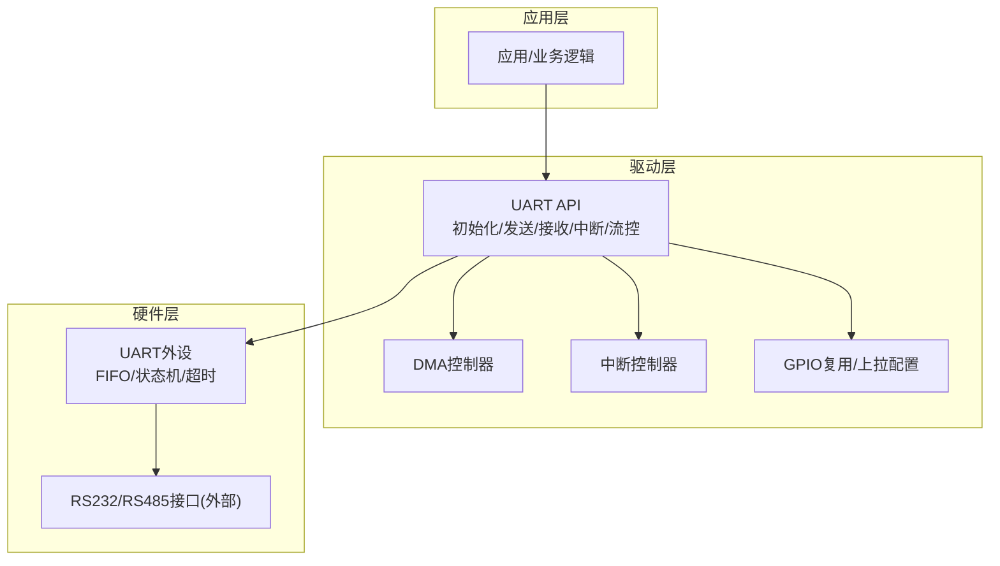
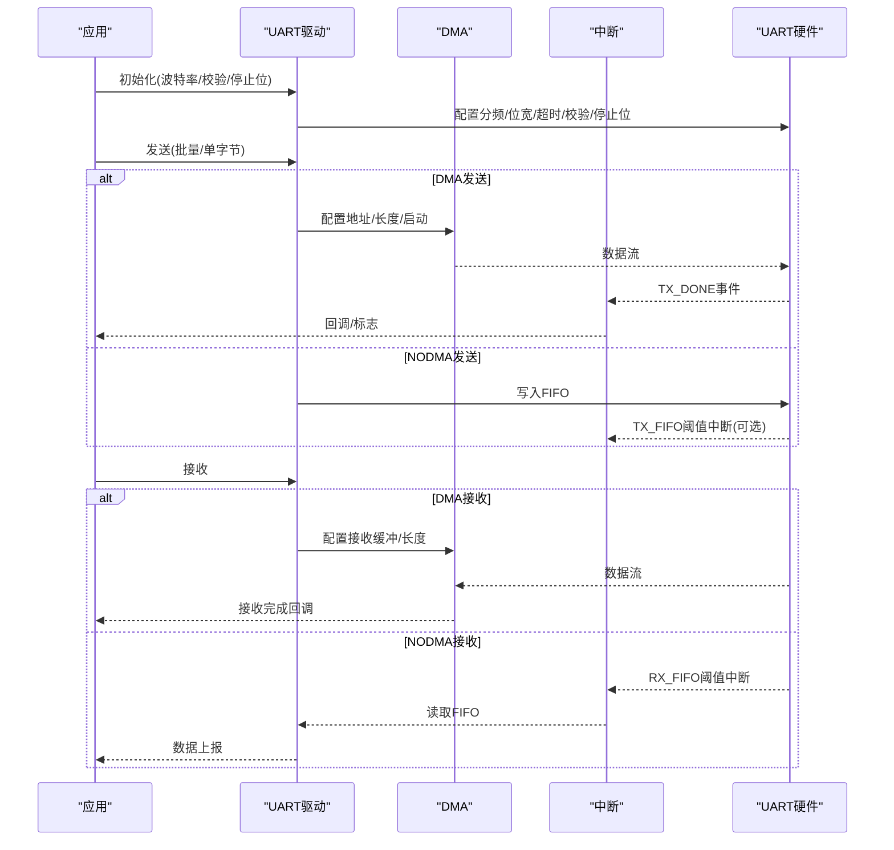
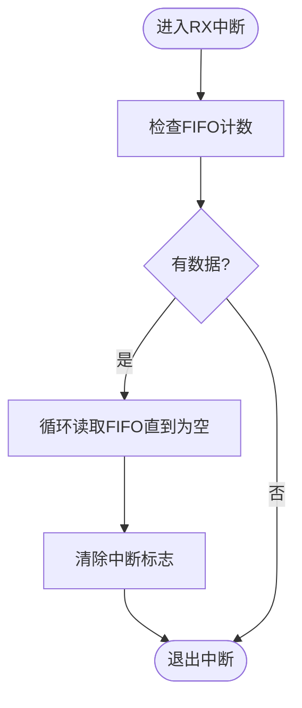
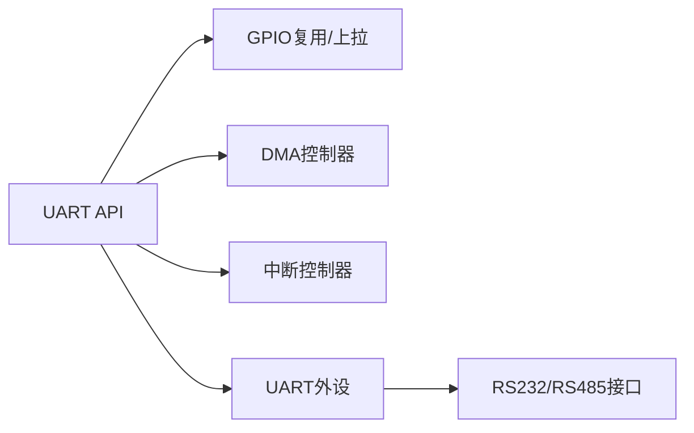

# UART驱动

<cite>
**本文引用的文件**
- [B85 uart.h](file://tc_ble_single_sdk/drivers/B85/uart.h)
- [B85 uart.c](file://tc_ble_single_sdk/drivers/B85/uart.c)
- [B87 uart.h](file://tc_ble_single_sdk/drivers/B87/uart.h)
- [TC321X uart.h](file://tc_ble_single_sdk/drivers/TC321X/uart.h)
- [TC321X uart.c](file://tc_ble_single_sdk/drivers/TC321X/uart.c)
- [B80 uart_b80b.c](file://8373_dongle_for_km/chip/B80/drivers/uart_b80b.c)
- [B80 uart.h](file://8373_dongle_for_km/chip/B80/drivers/uart.h)
</cite>

## 目录
1. [简介](#简介)
2. [项目结构](#项目结构)
3. [核心组件](#核心组件)
4. [架构总览](#架构总览)
5. [详细组件分析](#详细组件分析)
6. [依赖关系分析](#依赖关系分析)
7. [性能考虑](#性能考虑)
8. [故障排查指南](#故障排查指南)
9. [结论](#结论)
10. [附录](#附录)

## 简介
本技术文档面向Telink SDK中的UART驱动，覆盖串口通信配置（波特率、数据位、停止位、校验位）、FIFO缓冲区管理、DMA传输支持、中断处理机制、多串口资源管理、硬件流控（RTS/CTS）与RTX扩展、错误处理与超时机制、以及典型应用场景（调试输出、设备通信、数据透传）。文档基于仓库中B85/B87/TC321X/B80等平台的UART驱动实现进行归纳与说明。

## 项目结构
- B85/B87平台：提供统一的UART API（初始化、DMA、中断、流控、GPIO复用），差异主要体现在引脚定义和寄存器映射。
- TC321X平台：提供多通道UART（UART0/1/2）的API，其中仅UART0支持DMA；其他通道支持NODMA模式及RTX功能。
- B80平台：提供UART0/1双通道驱动，具备DMA、中断、流控能力。

图表来源
- [B85 uart.c:159-215](file://tc_ble_single_sdk/drivers/B85/uart.c#L159-L215)
- [B85 uart.h:217-252](file://tc_ble_single_sdk/drivers/B85/uart.h#L217-L252)
- [TC321X uart.h:251-302](file://tc_ble_single_sdk/drivers/TC321X/uart.h#L251-L302)

章节来源
- [B85 uart.h:24-42](file://tc_ble_single_sdk/drivers/B85/uart.h#L24-L42)
- [B87 uart.h:24-42](file://tc_ble_single_sdk/drivers/B87/uart.h#L24-L42)
- [TC321X uart.h:24-40](file://tc_ble_single_sdk/drivers/TC321X/uart.h#L24-L40)

## 核心组件
- 初始化与波特率设置
  - 支持直接传入分频器与位宽参数或按系统时钟与目标波特率自动计算最优分频与位宽。
  - 可配置校验位（无/偶/奇）与停止位（1/1.5/2）。
- FIFO与NODMA收发
  - 非DMA模式下通过FIFO触发级别产生RX/TX中断，需在中断中读取FIFO并清空标志。
  - 提供索引循环访问内部数据缓冲寄存器，避免唤醒后指针错乱。
- DMA收发
  - 支持批量发送与接收，单次最大长度受限（约4079-4字节），接收达到设定长度后继续接收会覆盖旧数据。
  - 发送完成可通过TX_DONE标志或中断判断。
- 中断机制
  - 可独立使能RX/TX中断，并在需要时开启错误数据中断。
  - 非DMA模式下无“接收完成”中断，需依赖FIFO阈值中断。
- 硬件流控
  - 支持RTS（自动/手动）与CTS，用于硬件级流量控制。
- RTX扩展
  - 支持半双工RTX引脚控制，便于RS485方向切换。
- 错误处理与超时
  - 提供校验错误检测与清除；支持错误中断屏蔽与启用；提供超时相关寄存器配置。

章节来源
- [B85 uart.c:159-215](file://tc_ble_single_sdk/drivers/B85/uart.c#L159-L215)
- [B85 uart.c:222-269](file://tc_ble_single_sdk/drivers/B85/uart.c#L222-L269)
- [B85 uart.c:280-328](file://tc_ble_single_sdk/drivers/B85/uart.c#L280-L328)
- [B85 uart.c:339-432](file://tc_ble_single_sdk/drivers/B85/uart.c#L339-L432)
- [B85 uart.c:440-460](file://tc_ble_single_sdk/drivers/B85/uart.c#L440-L460)
- [B85 uart.c:473-551](file://tc_ble_single_sdk/drivers/B85/uart.c#L473-L551)
- [B85 uart.h:217-252](file://tc_ble_single_sdk/drivers/B85/uart.h#L217-L252)
- [B85 uart.h:303-311](file://tc_ble_single_sdk/drivers/B85/uart.h#L303-L311)
- [B85 uart.h:322-368](file://tc_ble_single_sdk/drivers/B85/uart.h#L322-L368)
- [B85 uart.h:372-414](file://tc_ble_single_sdk/drivers/B85/uart.h#L372-L414)
- [B85 uart.h:416-445](file://tc_ble_single_sdk/drivers/B85/uart.h#L416-L445)

## 架构总览
UART驱动在应用层与硬件之间提供统一抽象，屏蔽不同芯片平台差异。关键路径包括：
- 初始化：根据系统时钟和目标波特率计算分频与位宽，配置校验、停止位、超时。
- 发送：NODMA逐字节写入FIFO；DMA批量发送，发送完成通过标志或中断通知。
- 接收：NODMA通过FIFO阈值中断读取；DMA将数据搬运至内存缓冲区。
- 流控：RTS/CTS硬件控制收发时序，RTX用于RS485方向控制。
- 错误：校验错误检测与清除，错误中断可选。

图表来源
- [B85 uart.c:222-269](file://tc_ble_single_sdk/drivers/B85/uart.c#L222-L269)
- [B85 uart.c:339-432](file://tc_ble_single_sdk/drivers/B85/uart.c#L339-L432)
- [B85 uart.c:280-328](file://tc_ble_single_sdk/drivers/B85/uart.c#L280-L328)

## 详细组件分析

### 初始化与波特率配置
- 两种初始化方式：
  - 直接指定分频器与位宽，适用于已知系统时钟与波特率的场景。
  - 根据目标波特率和系统时钟自动计算最优分频与位宽，减少误差。
- 校验位与停止位：
  - 支持无校验、偶校验、奇校验。
  - 支持1、1.5、2个停止位。
- 超时配置：
  - 设置每字节最大位数与交易结束判定条件，避免长帧误判。

章节来源
- [B85 uart.c:159-215](file://tc_ble_single_sdk/drivers/B85/uart.c#L159-L215)
- [B85 uart.h:217-252](file://tc_ble_single_sdk/drivers/B85/uart.h#L217-L252)
- [B87 uart.h:205-240](file://tc_ble_single_sdk/drivers/B87/uart.h#L205-L240)
- [TC321X uart.h:251-290](file://tc_ble_single_sdk/drivers/TC321X/uart.h#L251-L290)

### FIFO与NODMA收发
- FIFO深度为8字节，非DMA模式下通过RX/TX触发级别产生中断。
- 未开启DMA时没有“接收完成”中断，需依据FIFO计数读取全部数据。
- 提供发送/接收索引循环访问内部缓冲寄存器，并在复位或唤醒后清零以避免指针错乱。

图表来源
- [B85 uart.c:280-328](file://tc_ble_single_sdk/drivers/B85/uart.c#L280-L328)
- [B85 uart.h:303-311](file://tc_ble_single_sdk/drivers/B85/uart.h#L303-L311)

章节来源
- [B85 uart.c:280-328](file://tc_ble_single_sdk/drivers/B85/uart.c#L280-L328)
- [B85 uart.h:303-311](file://tc_ble_single_sdk/drivers/B85/uart.h#L303-L311)

### DMA收发
- 发送：
  - 批量发送需设置起始地址与长度，启动DMA通道，发送完成后置位TX_DONE标志或触发中断。
  - 注意首次发送前需清标志，避免初始化后立即进入中断。
- 接收：
  - 设置接收缓冲地址与长度（需对齐且为16的倍数），启动DMA接收。
  - 达到设定长度后若仍有数据，将继续接收并覆盖旧数据，不会溢出。
- 限制：
  - 单次最大长度受限于硬件（约4079-4字节）。
  - 部分平台仅UART0支持DMA。

章节来源
- [B85 uart.c:339-432](file://tc_ble_single_sdk/drivers/B85/uart.c#L339-L432)
- [B85 uart.h:322-368](file://tc_ble_single_sdk/drivers/B85/uart.h#L322-L368)
- [TC321X uart.h:292-302](file://tc_ble_single_sdk/drivers/TC321X/uart.h#L292-L302)
- [TC321X uart.h:387-442](file://tc_ble_single_sdk/drivers/TC321X/uart.h#L387-L442)

### 中断处理机制
- 可分别使能RX/TX中断，并在需要时开启错误数据中断。
- 非DMA模式下，RX中断由FIFO阈值触发，需在ISR中读取FIFO并清空标志。
- TX完成可通过轮询TX_DONE或中断方式处理。

章节来源
- [B85 uart.c:247-269](file://tc_ble_single_sdk/drivers/B85/uart.c#L247-L269)
- [B85 uart.c:595-607](file://tc_ble_single_sdk/drivers/B85/uart.c#L595-L607)
- [B87 uart.h:249-256](file://tc_ble_single_sdk/drivers/B87/uart.h#L249-L256)
- [TC321X uart.h:304-314](file://tc_ble_single_sdk/drivers/TC321X/uart.h#L304-L314)

### 多串口资源管理
- TC321X平台提供UART0/1/2三通道，各通道支持能力不同：
  - UART0：支持NODMA、DMA、RX、TX、CTS、RTS、RTX。
  - UART1/2：支持NODMA、RX、TX、RTX，不支持DMA。
- 各通道提供独立的初始化、中断、GPIO复用与RTX配置函数。

章节来源
- [TC321X uart.h:50-58](file://tc_ble_single_sdk/drivers/TC321X/uart.h#L50-L58)
- [TC321X uart.h:251-290](file://tc_ble_single_sdk/drivers/TC321X/uart.h#L251-L290)
- [TC321X uart.h:466-522](file://tc_ble_single_sdk/drivers/TC321X/uart.h#L466-L522)

### 硬件流控与RTX扩展
- RTS（请求发送）：
  - 支持自动与手动模式，自动模式下可按阈值控制RTS电平翻转。
  - 可配置极性反转与触发阈值。
- CTS（清除发送）：
  - 当CTS输入满足条件时暂停发送，防止接收端溢出。
- RTX（收发控制）：
  - 用于RS485半双工方向控制，可在发送前后切换方向。

章节来源
- [B85 uart.c:473-551](file://tc_ble_single_sdk/drivers/B85/uart.c#L473-L551)
- [B85 uart.h:394-445](file://tc_ble_single_sdk/drivers/B85/uart.h#L394-L445)
- [B87 uart.h:392-443](file://tc_ble_single_sdk/drivers/B87/uart.h#L392-L443)
- [TC321X uart.h:466-522](file://tc_ble_single_sdk/drivers/TC321X/uart.h#L466-L522)

### 错误处理与超时机制
- 校验错误：
  - 提供检测与清除接口，DMA模式下清除错误标志会同时清空RX FIFO。
- 错误中断：
  - 可开启错误数据中断以快速响应异常。
- 超时：
  - 通过超时寄存器配置交易结束条件，避免长帧误判。

章节来源
- [B85 uart.c:440-460](file://tc_ble_single_sdk/drivers/B85/uart.c#L440-L460)
- [B85 uart.c:595-607](file://tc_ble_single_sdk/drivers/B85/uart.c#L595-L607)
- [B85 uart.h:372-392](file://tc_ble_single_sdk/drivers/B85/uart.h#L372-L392)

### 典型应用场景
- 调试输出
  - 使用NODMA模式逐字节发送，配合终端工具查看日志。
  - 建议关闭DMA以减少开销，使用轮询或中断确认发送完成。
- 设备通信
  - 使用DMA批量收发提高吞吐，结合RTS/CTS保证稳定传输。
  - 合理设置FIFO阈值与超时，确保帧边界识别。
- 数据透传
  - 采用DMA接收+DMA发送，最小化CPU参与，提升实时性。
  - 注意单次DMA长度限制与覆盖行为，设计环形缓冲或分包策略。

章节来源
- [B85 uart.c:339-432](file://tc_ble_single_sdk/drivers/B85/uart.c#L339-L432)
- [B85 uart.h:322-368](file://tc_ble_single_sdk/drivers/B85/uart.h#L322-L368)

## 依赖关系分析
- 驱动层依赖：
  - GPIO复用与上拉配置，确保引脚功能正确与信号稳定。
  - DMA控制器，负责数据搬运与通道使能。
  - 中断控制器，统一管理与分发UART中断。
- 硬件层依赖：
  - UART外设包含FIFO、状态机、超时逻辑与错误检测。
  - 外部物理层（RS232/RS485）通过电平转换与方向控制接入。

图表来源
- [B85 uart.c:555-593](file://tc_ble_single_sdk/drivers/B85/uart.c#L555-L593)
- [B85 uart.c:222-269](file://tc_ble_single_sdk/drivers/B85/uart.c#L222-L269)
- [B85 uart.c:247-269](file://tc_ble_single_sdk/drivers/B85/uart.c#L247-L269)

章节来源
- [B85 uart.c:555-593](file://tc_ble_single_sdk/drivers/B85/uart.c#L555-L593)
- [B85 uart.c:222-269](file://tc_ble_single_sdk/drivers/B85/uart.c#L222-L269)
- [B85 uart.c:247-269](file://tc_ble_single_sdk/drivers/B85/uart.c#L247-L269)

## 性能考虑
- 优先使用DMA进行大数据量收发，降低CPU占用。
- 合理设置FIFO阈值，平衡中断频率与数据延迟。
- 注意DMA单次长度限制与覆盖行为，设计合适的分包与缓冲策略。
- 在高波特率下，确保系统时钟与分频/位宽配置准确，避免误码。
- 使用RTS/CTS硬件流控，避免对端处理能力不足导致丢包。

[本节为通用指导，不直接分析具体文件]

## 故障排查指南
- 现象：接收数据错乱或丢失
  - 检查是否使用NODMA模式且FIFO阈值设置不当，导致中断不及时。
  - 确认是否在ISR中读取了所有FIFO数据并清除了标志。
  - 若频繁出现异常，建议切换到DMA模式接收。
- 现象：发送卡死或重复中断
  - 检查TX_DONE标志是否已清除，避免初始化后立即进入中断。
  - 确认DMA发送前是否等待上一次发送完成。
- 现象：校验错误频发
  - 检查双方波特率、校验位、停止位配置是否一致。
  - 使用错误中断定位问题，必要时增加线路屏蔽与上拉电阻。
- 现象：RS485方向切换异常
  - 确认RTX引脚配置与时序，确保发送前切换为发送方向，结束后切回接收方向。

章节来源
- [B85 uart.c:280-328](file://tc_ble_single_sdk/drivers/B85/uart.c#L280-L328)
- [B85 uart.c:339-354](file://tc_ble_single_sdk/drivers/B85/uart.c#L339-L354)
- [B85 uart.c:440-460](file://tc_ble_single_sdk/drivers/B85/uart.c#L440-L460)
- [B85 uart.c:581-593](file://tc_ble_single_sdk/drivers/B85/uart.c#L581-L593)

## 结论
该UART驱动提供了完善的串口通信能力，涵盖多种配置选项、FIFO与DMA收发、中断与错误处理、硬件流控与RTX扩展。针对不同平台（B85/B87/TC321X/B80）的差异，驱动封装了统一API，便于移植与复用。在实际工程中，应根据应用场景选择合适的收发模式与流控策略，并注意DMA长度限制与FIFO阈值配置，以获得稳定高效的通信性能。

[本节为总结性内容，不直接分析具体文件]

## 附录
- 常用配置参考
  - 波特率与分频/位宽：根据系统时钟选择合适组合，或使用自动计算接口。
  - 校验位与停止位：根据协议要求配置。
  - FIFO阈值：未知长度数据设为1，已知长度设为小于8且为长度的整数倍。
  - DMA长度：不超过4079-4字节，接收缓冲需对齐且为16的倍数。
- 引脚与复用
  - TX/RX/RTS/CTS/RTX引脚需通过GPIO复用接口配置，并确保上拉电阻设置正确。
- 平台差异
  - TC321X仅UART0支持DMA；其他通道使用NODMA模式。
  - B80/B85/B87平台引脚定义略有差异，需按头文件枚举选择。

章节来源
- [B85 uart.h:303-311](file://tc_ble_single_sdk/drivers/B85/uart.h#L303-L311)
- [B85 uart.h:322-368](file://tc_ble_single_sdk/drivers/B85/uart.h#L322-L368)
- [B85 uart.h:89-149](file://tc_ble_single_sdk/drivers/B85/uart.h#L89-L149)
- [TC321X uart.h:50-58](file://tc_ble_single_sdk/drivers/TC321X/uart.h#L50-L58)
- [TC321X uart.h:97-193](file://tc_ble_single_sdk/drivers/TC321X/uart.h#L97-L193)