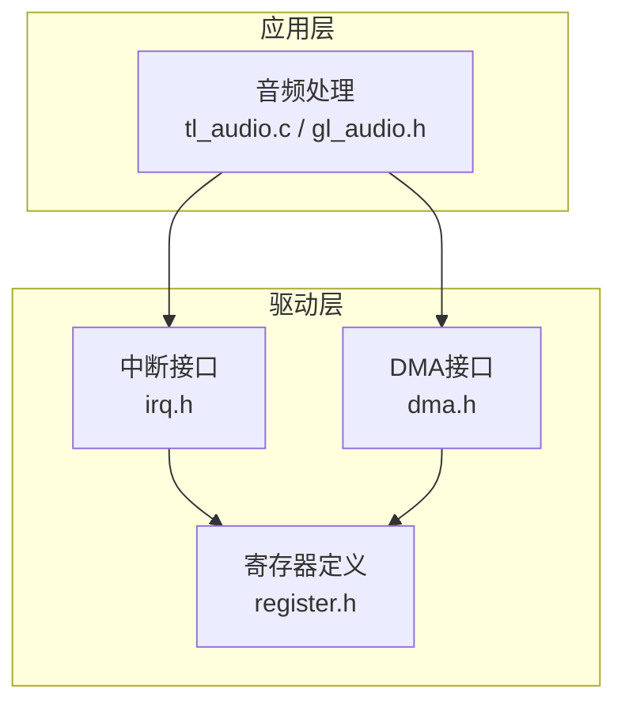
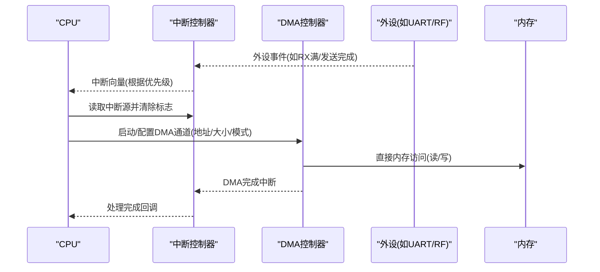
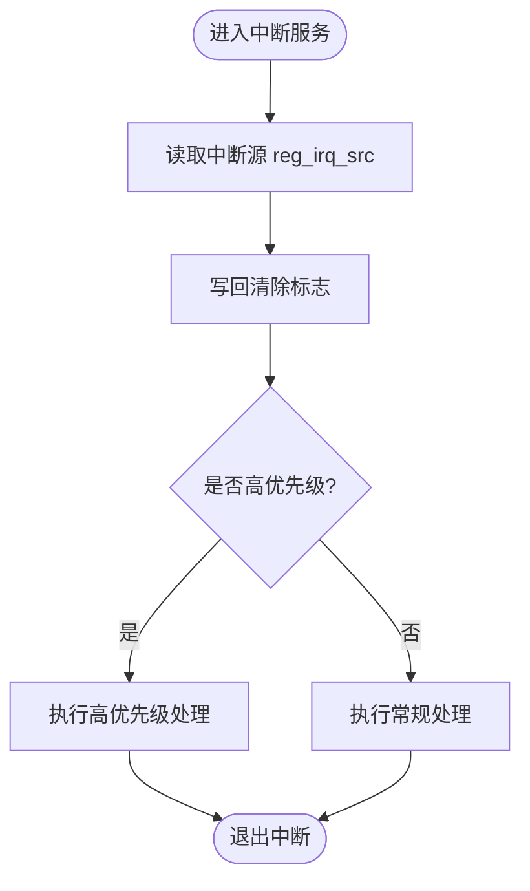
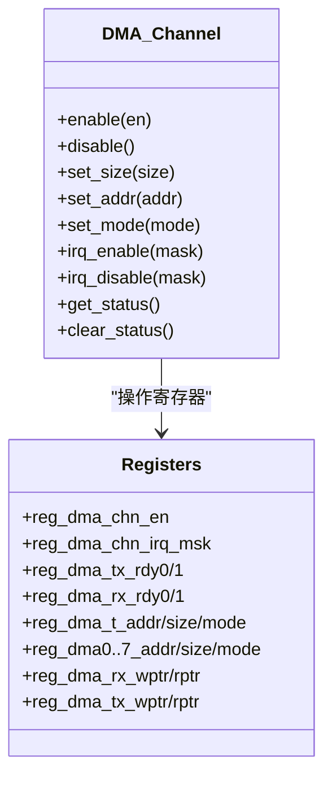
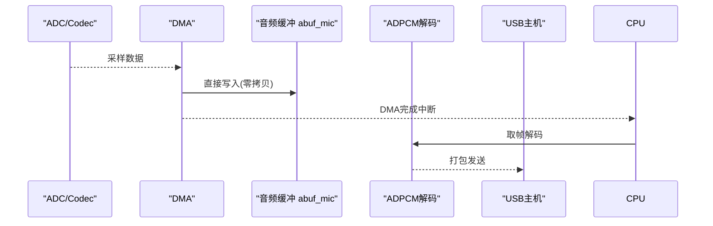
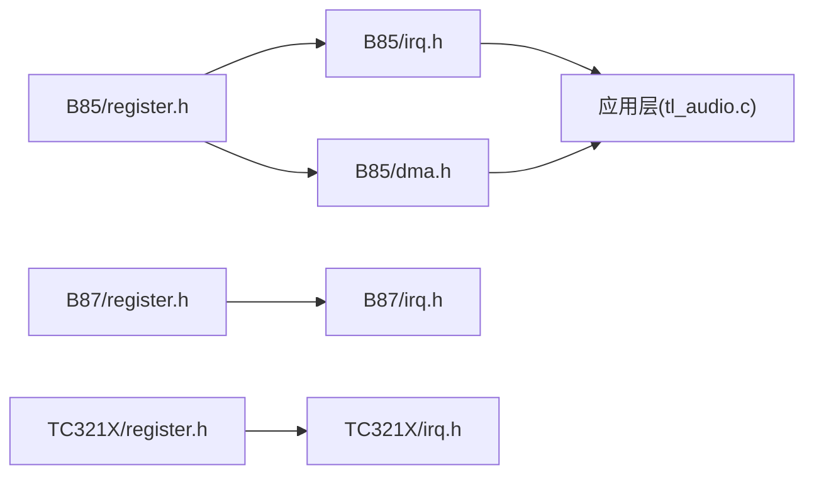

# 中断与DMA系统

<cite>
**本文引用的文件**
- [B85/dma.h](file://tc_ble_single_sdk/drivers/B85/dma.h)
- [B85/irq.h](file://tc_ble_single_sdk/drivers/B85/irq.h)
- [B85/register.h](file://tc_ble_single_sdk/drivers/B85/register.h)
- [B87/register.h](file://tc_ble_single_sdk/drivers/B87/register.h)
- [TC321X/register.h](file://tc_ble_single_sdk/drivers/TC321X/register.h)
- [TC321X/irq.h](file://tc_ble_single_sdk/drivers/TC321X/irq.h)
- [B80/irq.h](file://8373_dongle_for_km/chip/B80/drivers/irq.h)
- [tl_audio.c](file://tc_ble_single_sdk/application/audio/tl_audio.c)
- [gl_audio.h](file://tc_ble_single_sdk/application/audio/gl_audio.h)
- [utility.h](file://tc_ble_single_sdk/common/utility.h)
</cite>

## 目录
1. [简介](#简介)
2. [项目结构](#项目结构)
3. [核心组件](#核心组件)
4. [架构总览](#架构总览)
5. [详细组件分析](#详细组件分析)
6. [依赖关系分析](#依赖关系分析)
7. [性能考量](#性能考量)
8. [故障排查指南](#故障排查指南)
9. [结论](#结论)
10. [附录](#附录)

## 简介
本技术文档围绕中断控制器与DMA子系统，系统性阐述中断优先级管理、中断屏蔽/使能、中断源识别与清除、DMA通道管理与传输模式配置、内存映射与缓冲区大小设置等关键机制。同时结合音频应用中的零拷贝处理、高效数据传输与实时响应需求，给出实现方案与调优建议，并覆盖中断嵌套、延迟处理、资源竞争与忙等待等问题的解决方案。

## 项目结构
本项目为Telink B8x系列SDK，包含多平台驱动（B85/B87/TC321X）与应用层音频模块。中断与DMA相关代码主要位于各平台的drivers目录下，寄存器定义集中在register.h中；DMA抽象接口在dma.h中；应用层音频模块通过缓冲与解码流程配合DMA进行高效数据搬运。

**图表来源**
- [B85/irq.h:28-126](file://tc_ble_single_sdk/drivers/B85/irq.h#L28-L126)
- [B85/dma.h:61-157](file://tc_ble_single_sdk/drivers/B85/dma.h#L61-L157)
- [B85/register.h:810-847](file://tc_ble_single_sdk/drivers/B85/register.h#L810-L847)
- [B85/register.h:1199-1263](file://tc_ble_single_sdk/drivers/B85/register.h#L1199-L1263)

**章节来源**
- [B85/irq.h:28-126](file://tc_ble_single_sdk/drivers/B85/irq.h#L28-L126)
- [B85/dma.h:61-157](file://tc_ble_single_sdk/drivers/B85/dma.h#L61-L157)
- [B85/register.h:810-847](file://tc_ble_single_sdk/drivers/B85/register.h#L810-L847)
- [B85/register.h:1199-1263](file://tc_ble_single_sdk/drivers/B85/register.h#L1199-L1263)

## 核心组件
- 中断控制器
  - 全局中断使能/关闭/恢复：提供原子级开关能力，用于临界区保护。
  - 中断屏蔽/使能：按位操作reg_irq_mask，支持细粒度中断源控制。
  - 中断源读取与清除：读取reg_irq_src获取触发源，写回以清除标志。
  - 优先级寄存器：reg_irq_pri用于配置中断优先级（具体编码见寄存器定义）。
  - RF专用中断：rf_irq_*系列函数用于RF模块的中断屏蔽与状态管理。
- DMA控制器
  - 通道管理：启用/禁用特定通道，支持UART/RX/TX、RF RX/TX、AES编解码、PWM等。
  - 传输配置：地址、大小、模式寄存器；缓冲区大小设置（按16字节对齐）。
  - 中断管理：通道中断屏蔽、状态读取与清除。
  - FIFO指针：读写指针寄存器用于环形缓冲或流水线处理。

**章节来源**
- [B85/irq.h:28-126](file://tc_ble_single_sdk/drivers/B85/irq.h#L28-L126)
- [B85/dma.h:61-157](file://tc_ble_single_sdk/drivers/B85/dma.h#L61-L157)
- [B85/register.h:810-847](file://tc_ble_single_sdk/drivers/B85/register.h#L810-L847)
- [B85/register.h:1199-1263](file://tc_ble_single_sdk/drivers/B85/register.h#L1199-L1263)

## 架构总览
中断与DMA的交互遵循“外设事件→中断控制器→CPU”和“外设→DMA→内存”两条路径。DMA完成后可触发中断通知CPU处理数据，形成低开销的数据通路。

**图表来源**
- [B85/register.h:810-847](file://tc_ble_single_sdk/drivers/B85/register.h#L810-L847)
- [B85/register.h:1199-1263](file://tc_ble_single_sdk/drivers/B85/register.h#L1199-L1263)
- [B85/irq.h:28-126](file://tc_ble_single_sdk/drivers/B85/irq.h#L28-L126)
- [B85/dma.h:61-157](file://tc_ble_single_sdk/drivers/B85/dma.h#L61-L157)

## 详细组件分析

### 中断控制器架构与优先级管理
- 全局中断控制
  - 提供中断开启/关闭/恢复的内联函数，用于临界区保护与上下文切换。
- 中断屏蔽与源管理
  - 通过reg_irq_mask进行位掩码控制，支持批量使能/禁用。
  - 读取reg_irq_src获取当前中断源，写回对应位以清除。
- 优先级与向量
  - reg_irq_pri用于配置中断优先级（不同平台位域可能不同），结合reg_irq_src可定位高优先级事件。
- RF中断
  - 提供rf_irq_enable/disable与状态读取/清除，便于无线链路快速响应。

**图表来源**
- [B85/irq.h:98-126](file://tc_ble_single_sdk/drivers/B85/irq.h#L98-L126)
- [B85/register.h:810-847](file://tc_ble_single_sdk/drivers/B85/register.h#L810-L847)

**章节来源**
- [B85/irq.h:28-126](file://tc_ble_single_sdk/drivers/B85/irq.h#L28-L126)
- [B85/register.h:810-847](file://tc_ble_single_sdk/drivers/B85/register.h#L810-L847)

### DMA通道管理与传输模式配置
- 通道分配
  - UART RX/TX、RF RX/TX、AES编解码、PWM等通道通过位掩码启用/禁用。
- 传输参数
  - 每个通道具备地址、大小、模式寄存器；缓冲区大小按16字节单位设置。
- 中断与状态
  - 通道中断屏蔽与状态寄存器用于轮询或中断方式处理完成事件。
- FIFO指针
  - 读写指针寄存器支持环形缓冲与流水线处理，减少CPU干预。

**图表来源**
- [B85/dma.h:61-157](file://tc_ble_single_sdk/drivers/B85/dma.h#L61-L157)
- [B85/register.h:1199-1263](file://tc_ble_single_sdk/drivers/B85/register.h#L1199-L1263)

**章节来源**
- [B85/dma.h:61-157](file://tc_ble_single_sdk/drivers/B85/dma.h#L61-L157)
- [B85/register.h:1199-1263](file://tc_ble_single_sdk/drivers/B85/register.h#L1199-L1263)

### 内存映射与缓冲区策略
- 地址与大小
  - 每个DMA通道有独立地址与大小寄存器，支持外设到内存或内存到外设的传输。
- 缓冲区对齐
  - 缓冲区大小按16字节对齐设置，确保硬件效率与稳定性。
- FIFO指针
  - 读写指针用于管理环形缓冲，避免重复拷贝，提升吞吐。

**章节来源**
- [B85/register.h:1199-1263](file://tc_ble_single_sdk/drivers/B85/register.h#L1199-L1263)
- [B85/dma.h:149-157](file://tc_ble_single_sdk/drivers/B85/dma.h#L149-L157)

### 音频应用中的零拷贝与高效传输
- 音频缓冲
  - 使用固定大小的环形缓冲abuf_mic与abuf_dec，配合ADPCM解码流程，减少CPU参与。
- 零拷贝思路
  - DMA直接将外设数据写入缓冲，应用层仅消费已就绪帧，避免额外拷贝。
- 超时与复位
  - 检测长时间无数据时重置缓冲指针，防止死锁与溢出。

**图表来源**
- [tl_audio.c:876-932](file://tc_ble_single_sdk/application/audio/tl_audio.c#L876-L932)
- [tl_audio.c:1176-1238](file://tc_ble_single_sdk/application/audio/tl_audio.c#L1176-L1238)

**章节来源**
- [tl_audio.c:876-932](file://tc_ble_single_sdk/application/audio/tl_audio.c#L876-L932)
- [tl_audio.c:1176-1238](file://tc_ble_single_sdk/application/audio/tl_audio.c#L1176-L1238)
- [gl_audio.h:29-63](file://tc_ble_single_sdk/application/audio/gl_audio.h#L29-L63)

## 依赖关系分析
- 驱动层依赖
  - irq.h依赖register.h中的中断寄存器定义。
  - dma.h依赖register.h中的DMA寄存器定义。
- 应用层依赖
  - 音频模块依赖DMA接口进行数据搬运，依赖中断接口进行事件处理。
- 跨平台一致性
  - B85/B87/TC321X在寄存器位域上略有差异，但API保持一致，便于移植。

**图表来源**
- [B85/register.h:810-847](file://tc_ble_single_sdk/drivers/B85/register.h#L810-L847)
- [B85/register.h:1199-1263](file://tc_ble_single_sdk/drivers/B85/register.h#L1199-L1263)
- [B87/register.h:889-931](file://tc_ble_single_sdk/drivers/B87/register.h#L889-L931)
- [TC321X/register.h:696-731](file://tc_ble_single_sdk/drivers/TC321X/register.h#L696-L731)

**章节来源**
- [B85/register.h:810-847](file://tc_ble_single_sdk/drivers/B85/register.h#L810-L847)
- [B85/register.h:1199-1263](file://tc_ble_single_sdk/drivers/B85/register.h#L1199-L1263)
- [B87/register.h:889-931](file://tc_ble_single_sdk/drivers/B87/register.h#L889-L931)
- [TC321X/register.h:696-731](file://tc_ble_single_sdk/drivers/TC321X/register.h#L696-L731)

## 性能考量
- 中断延迟优化
  - 将高频、短小任务放入中断，长任务延后到主循环处理。
  - 使用最小化中断服务程序，尽快清除中断标志。
- DMA吞吐优化
  - 合理设置缓冲区大小（16字节对齐），减少中断次数。
  - 利用FIFO指针进行环形缓冲，避免频繁拷贝。
- 零拷贝与内存对齐
  - 确保DMA缓冲区地址对齐，提高总线效率。
  - 应用层直接消费DMA写入的数据，避免中间拷贝。
- 实时性保证
  - 对关键路径（如RF收发）使用高优先级中断。
  - 避免在中断中进行复杂计算或阻塞操作。

[本节为通用指导，不直接分析具体文件]

## 故障排查指南
- 中断未触发
  - 检查全局中断是否开启，目标中断位是否在reg_irq_mask中使能。
  - 确认外设事件是否产生，读取reg_irq_src验证。
- DMA未工作
  - 检查通道是否启用，地址与大小是否正确设置。
  - 查看通道中断状态与FIFO指针，确认数据流。
- 音频卡顿或溢出
  - 监控缓冲队列长度，调整缓冲区大小或解码速率。
  - 检查超时复位逻辑，避免长时间无数据导致的状态异常。

**章节来源**
- [B85/irq.h:98-126](file://tc_ble_single_sdk/drivers/B85/irq.h#L98-L126)
- [B85/dma.h:114-157](file://tc_ble_single_sdk/drivers/B85/dma.h#L114-L157)
- [tl_audio.c:876-932](file://tc_ble_single_sdk/application/audio/tl_audio.c#L876-L932)

## 结论
本SDK提供了完善的中断与DMA驱动接口，支持多平台一致的使用体验。通过合理的优先级配置、DMA通道管理与零拷贝策略，可实现高效、低延迟的数据传输，满足音频等实时应用场景的需求。实际工程中需结合具体外设特性与系统负载进行调优，确保稳定与性能平衡。

[本节为总结，不直接分析具体文件]

## 附录
- 常用寄存器参考
  - 中断：reg_irq_en、reg_irq_mask、reg_irq_src、reg_irq_pri
  - DMA：reg_dma_chn_en、reg_dma_chn_irq_msk、reg_dma_t_addr/size/mode、reg_dma0..7_addr/size/mode、reg_dma_rx_wptr/rptr、reg_dma_tx_wptr/rptr
- 实用宏与工具
  - ATT_ALIGN4_DMA_BUFF用于DMA缓冲区对齐
  - memcpy4等优化拷贝函数用于非重叠、对齐内存块的高效复制

**章节来源**
- [B85/register.h:810-847](file://tc_ble_single_sdk/drivers/B85/register.h#L810-L847)
- [B85/register.h:1199-1263](file://tc_ble_single_sdk/drivers/B85/register.h#L1199-L1263)
- [utility.h:185-218](file://tc_ble_single_sdk/common/utility.h#L185-L218)