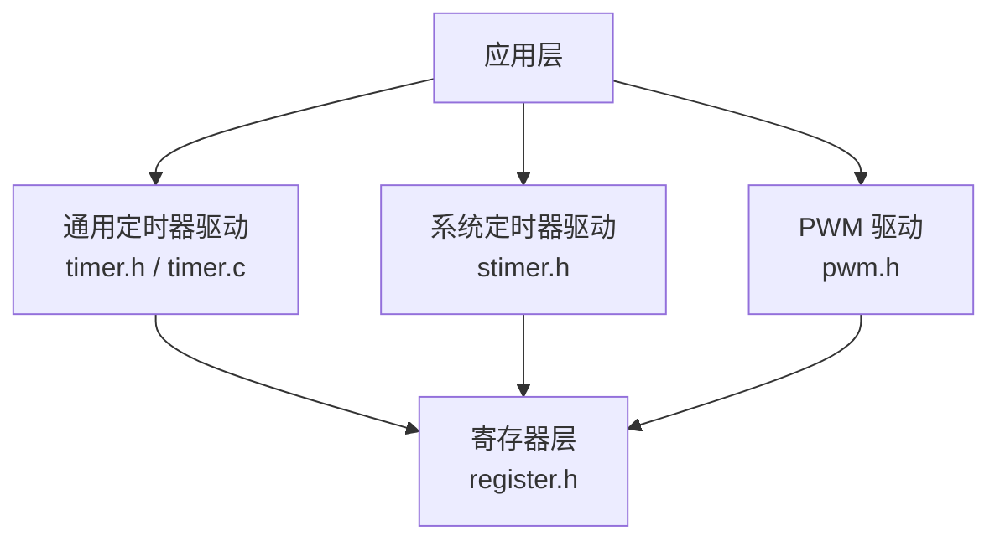
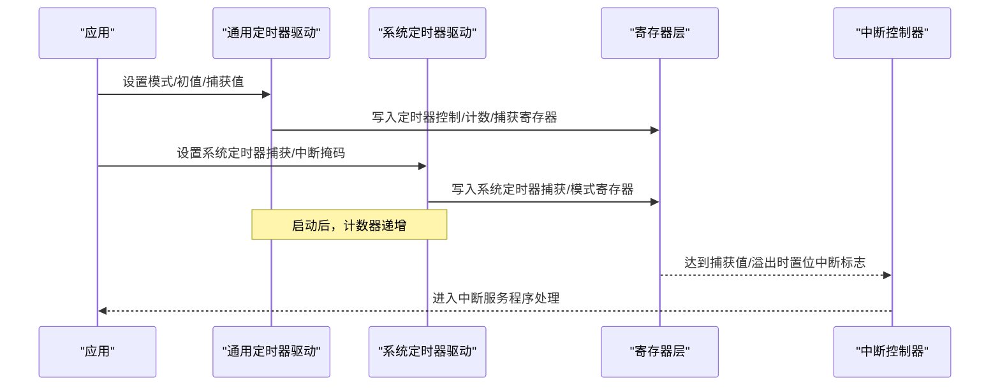
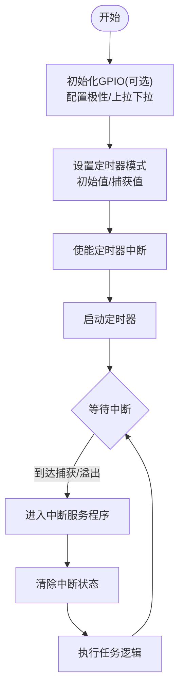
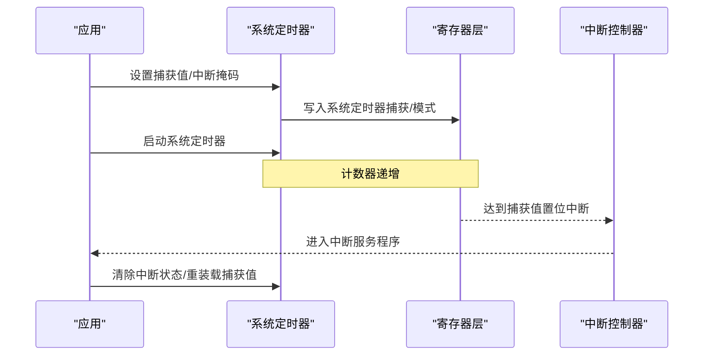
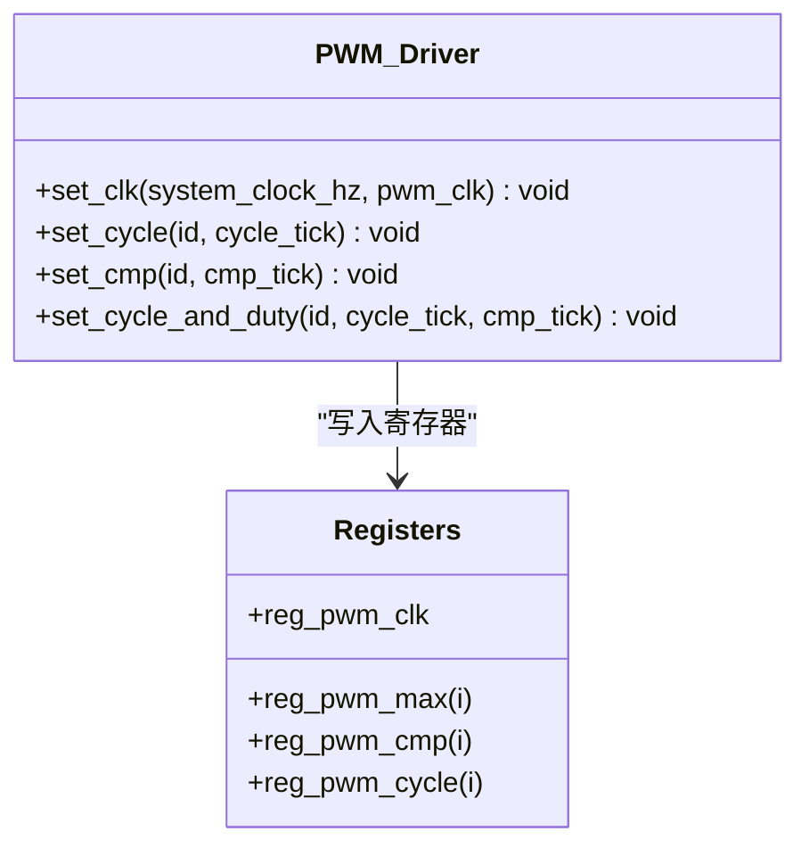
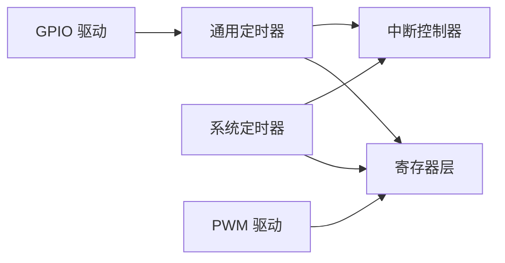

# 定时器驱动

<cite>
**本文引用的文件**
- [B85/timer.h](file://tc_ble_single_sdk/drivers/B85/timer.h)
- [B85/timer.c](file://tc_ble_single_sdk/drivers/B85/timer.c)
- [B85/stimer.h](file://tc_ble_single_sdk/drivers/B85/stimer.h)
- [B80/timer.h](file://8373_dongle_for_km/chip/B80/drivers/timer.h)
- [B80/timer.c](file://8373_dongle_for_km/chip/B80/drivers/timer.c)
- [B85/pwm.h](file://tc_ble_single_sdk/drivers/B85/pwm.h)
- [B85/register.h](file://tc_ble_single_sdk/drivers/B85/register.h)
- [TC321X/stimer.h](file://tc_ble_single_sdk/drivers/TC321X/lib/include/stimer.h)
- [TC321X/timer.h](file://tc_ble_single_sdk/drivers/TC321X/timer.h)
- [TC321X/register.h](file://tc_ble_single_sdk/drivers/TC321X/register.h)
- [B87/register.h](file://tc_ble_single_sdk/drivers/B87/register.h)
</cite>

## 目录
1. [简介](#简介)
2. [项目结构](#项目结构)
3. [核心组件](#核心组件)
4. [架构总览](#架构总览)
5. [详细组件分析](#详细组件分析)
6. [依赖关系分析](#依赖关系分析)
7. [性能与精度](#性能与精度)
8. [故障排查指南](#故障排查指南)
9. [结论](#结论)
10. [附录：常用配置要点](#附录常用配置要点)

## 简介
本技术文档围绕 Telink B8x/TC321X 平台的定时器子系统，系统性说明通用定时器（TIMER0/1/2）与系统定时器（System Timer）的硬件能力、寄存器操作、中断机制与应用方法。内容覆盖：
- 定时器的计数模式、比较匹配、溢出中断
- 时钟源选择与分频（含 PWM 时钟）
- 精确延时、周期任务调度、PWM 生成等典型场景
- 多定时器资源管理与冲突规避策略
- 精度分析与性能优化建议

## 项目结构
该 SDK 为不同芯片平台提供独立的驱动实现，定时器相关代码主要位于：
- tc_ble_single_sdk/drivers/{B85|B87|TC321X}：各平台定时器头文件与实现
- 8373_dongle_for_km/chip/B80/drivers：B80 平台定时器实现
- pwm.h：PWM 驱动接口（基于通用定时器或专用 PWM 模块）
- register.h：寄存器位定义（系统定时器、通用定时器、PWM 等）

图表来源
- [B85/timer.h:31-198](file://tc_ble_single_sdk/drivers/B85/timer.h#L31-L198)
- [B85/timer.c:125-326](file://tc_ble_single_sdk/drivers/B85/timer.c#L125-L326)
- [B85/stimer.h:29-82](file://tc_ble_single_sdk/drivers/B85/stimer.h#L29-L82)
- [B85/register.h:852-908](file://tc_ble_single_sdk/drivers/B85/register.h#L852-L908)

章节来源
- [B85/timer.h:31-198](file://tc_ble_single_sdk/drivers/B85/timer.h#L31-L198)
- [B85/timer.c:125-326](file://tc_ble_single_sdk/drivers/B85/timer.c#L125-L326)
- [B85/stimer.h:29-82](file://tc_ble_single_sdk/drivers/B85/stimer.h#L29-L82)
- [B85/register.h:852-908](file://tc_ble_single_sdk/drivers/B85/register.h#L852-L908)

## 核心组件
- 通用定时器（TIMER0/1/2）
  - 支持模式：系统时钟计数、GPIO 触发、GPIO 宽度测量、Tick 模式
  - 每个定时器具备独立计数器、捕获/比较寄存器、中断状态位
  - 通过统一 API 设置模式、初始值、捕获值、启停控制
- 系统定时器（System Timer）
  - 固定频率（如 16MHz），用于高精度延时、系统节拍
  - 提供捕获/比较、中断屏蔽/清状态、手动/自动模式开关
- PWM 驱动
  - 提供时钟分频、周期与占空比设置、通道使能等接口
  - 底层映射到 PWM 寄存器区域（CMP/TMAX）

章节来源
- [B85/timer.h:31-198](file://tc_ble_single_sdk/drivers/B85/timer.h#L31-L198)
- [B85/timer.c:125-326](file://tc_ble_single_sdk/drivers/B85/timer.c#L125-L326)
- [B85/stimer.h:29-82](file://tc_ble_single_sdk/drivers/B85/stimer.h#L29-L82)
- [B85/pwm.h:90-130](file://tc_ble_single_sdk/drivers/B85/pwm.h#L90-L130)
- [B85/register.h:852-908](file://tc_ble_single_sdk/drivers/B85/register.h#L852-L908)

## 架构总览
通用定时器与系统定时器共享统一的寄存器访问抽象，并通过中断控制器进行事件上报。PWM 作为输出型外设，复用或独立于通用定时器资源，由专用寄存器管理。

图表来源
- [B85/timer.c:125-326](file://tc_ble_single_sdk/drivers/B85/timer.c#L125-L326)
- [B85/stimer.h:29-82](file://tc_ble_single_sdk/drivers/B85/stimer.h#L29-L82)
- [B85/register.h:852-908](file://tc_ble_single_sdk/drivers/B85/register.h#L852-L908)

## 详细组件分析

### 通用定时器（TIMER0/1/2）
- 模式与用途
  - 系统时钟计数模式：以系统时钟为基准计数，配合捕获/比较实现精确定时与事件捕捉
  - GPIO 触发模式：外部边沿触发计数，适合外部事件计时
  - GPIO 宽度模式：测量输入脉冲宽度
  - Tick 模式：仅计数，常用于内部节拍
- 关键寄存器
  - 控制寄存器：启用/停止、模式选择
  - 计数/捕获寄存器：设置初始计数与捕获阈值
  - 中断状态：比较匹配/溢出标志位
- 典型流程
  - 初始化 GPIO（若使用 GPIO 触发/宽度模式）
  - 设置模式、初始值、捕获值
  - 开启中断并启动定时器
  - 在中断中清除状态并执行任务

图表来源
- [B85/timer.c:45-123](file://tc_ble_single_sdk/drivers/B85/timer.c#L45-L123)
- [B85/timer.c:125-326](file://tc_ble_single_sdk/drivers/B85/timer.c#L125-L326)
- [B80/timer.c:45-129](file://8373_dongle_for_km/chip/B80/drivers/timer.c#L45-L129)
- [B80/timer.c:137-332](file://8373_dongle_for_km/chip/B80/drivers/timer.c#L137-L332)

章节来源
- [B85/timer.h:31-198](file://tc_ble_single_sdk/drivers/B85/timer.h#L31-L198)
- [B85/timer.c:45-326](file://tc_ble_single_sdk/drivers/B85/timer.c#L45-L326)
- [B80/timer.h:31-216](file://8373_dongle_for_km/chip/B80/drivers/timer.h#L31-L216)
- [B80/timer.c:45-332](file://8373_dongle_for_km/chip/B80/drivers/timer.c#L45-L332)

### 系统定时器（System Timer）
- 特性
  - 固定频率（例如 16MHz），提供高精度时间基准
  - 支持设置捕获值、中断屏蔽/清状态、手动/自动模式
  - 提供 clock_time()、sleep_us()、clock_time_exceed() 等便捷函数
- 典型用法
  - 精确微秒级延时：读取当前 tick，循环等待差值超过目标微秒数
  - 周期任务：设置捕获值为周期长度，在中断中重装载并执行任务
  - 低功耗节拍：结合系统唤醒定时器完成周期性唤醒

图表来源
- [B85/stimer.h:29-82](file://tc_ble_single_sdk/drivers/B85/stimer.h#L29-L82)
- [B85/register.h:852-875](file://tc_ble_single_sdk/drivers/B85/register.h#L852-L875)
- [TC321X/stimer.h:108-324](file://tc_ble_single_sdk/drivers/TC321X/lib/include/stimer.h#L108-L324)

章节来源
- [B85/stimer.h:29-82](file://tc_ble_single_sdk/drivers/B85/stimer.h#L29-L82)
- [B85/register.h:852-875](file://tc_ble_single_sdk/drivers/B85/register.h#L852-L875)
- [TC321X/stimer.h:108-324](file://tc_ble_single_sdk/drivers/TC321X/lib/include/stimer.h#L108-L324)

### PWM 驱动
- 功能
  - 设置 PWM 时钟分频
  - 设置周期（TMAX）与比较值（TCMP）以调节占空比
  - 通道使能与波形输出
- 适用场景
  - LED 调光、电机调速、音频信号生成等

图表来源
- [B85/pwm.h:90-130](file://tc_ble_single_sdk/drivers/B85/pwm.h#L90-L130)
- [B85/register.h:879-908](file://tc_ble_single_sdk/drivers/B85/register.h#L879-L908)

章节来源
- [B85/pwm.h:90-130](file://tc_ble_single_sdk/drivers/B85/pwm.h#L90-L130)
- [B85/register.h:879-908](file://tc_ble_single_sdk/drivers/B85/register.h#L879-L908)

## 依赖关系分析
- 通用定时器依赖 GPIO 初始化（当使用 GPIO 触发/宽度模式）
- 系统定时器依赖寄存器层的系统定时器控制与中断管理
- PWM 驱动依赖寄存器层的 PWM 控制与通道使能
- 所有驱动均依赖中断控制器进行事件上报与处理

图表来源
- [B85/timer.c:45-123](file://tc_ble_single_sdk/drivers/B85/timer.c#L45-L123)
- [B85/stimer.h:29-82](file://tc_ble_single_sdk/drivers/B85/stimer.h#L29-L82)
- [B85/register.h:852-908](file://tc_ble_single_sdk/drivers/B85/register.h#L852-L908)

章节来源
- [B85/timer.c:45-123](file://tc_ble_single_sdk/drivers/B85/timer.c#L45-L123)
- [B85/stimer.h:29-82](file://tc_ble_single_sdk/drivers/B85/stimer.h#L29-L82)
- [B85/register.h:852-908](file://tc_ble_single_sdk/drivers/B85/register.h#L852-L908)

## 性能与精度
- 精度来源
  - 系统定时器固定频率（如 16MHz），提供微秒级分辨率
  - 通用定时器在系统时钟模式下，分辨率取决于系统时钟频率
- 误差来源
  - 中断延迟与上下文切换开销
  - 寄存器写入时序与计数器同步
- 优化建议
  - 使用系统定时器进行高精度延时与周期任务
  - 在中断中仅做最小必要操作，避免长耗时逻辑
  - 合理设置捕获值，减少频繁中断
  - 使用 PWM 进行高频波形输出，减轻 CPU 负担
  - 对 GPIO 触发/宽度模式，确保引脚配置正确，避免误触发

[本节为通用指导，不直接分析具体文件]

## 故障排查指南
- 常见问题
  - 定时器未产生中断：检查中断掩码是否使能、捕获值是否正确设置、中断状态是否清除
  - GPIO 触发异常：确认 GPIO 极性、上拉/下拉配置、输入使能
  - PWM 无输出：检查通道使能、时钟分频、周期与比较值范围
- 定位步骤
  - 读取中断状态寄存器，确认是否置位
  - 检查定时器控制寄存器，确认模式与使能位
  - 验证系统定时器捕获值与模式寄存器
  - 使用调试工具观察寄存器变化与中断入口

章节来源
- [B85/timer.h:177-195](file://tc_ble_single_sdk/drivers/B85/timer.h#L177-L195)
- [B85/stimer.h:43-82](file://tc_ble_single_sdk/drivers/B85/stimer.h#L43-L82)
- [B85/register.h:852-908](file://tc_ble_single_sdk/drivers/B85/register.h#L852-L908)

## 结论
本 SDK 提供了完善的通用定时器与系统定时器驱动，支持多种工作模式与中断机制，适用于精确延时、周期任务调度与 PWM 输出等场景。通过合理的参数配置与中断管理，可实现高可靠、高精度的定时功能。在多定时器资源管理中，应明确各定时器职责，避免冲突，最大化利用硬件能力。

[本节为总结性内容，不直接分析具体文件]

## 附录：常用配置要点
- 精确微秒延时
  - 使用 sleep_us() 与 clock_time_exceed() 组合
  - 参考路径：[B85/timer.c:32-37](file://tc_ble_single_sdk/drivers/B85/timer.c#L32-L37)、[B85/timer.h:79-110](file://tc_ble_single_sdk/drivers/B85/timer.h#L79-L110)
- 周期任务调度
  - 设置系统定时器捕获值为周期长度，在中断中重装载并执行任务
  - 参考路径：[B85/stimer.h:36-52](file://tc_ble_single_sdk/drivers/B85/stimer.h#L36-L52)、[TC321X/stimer.h:130-149](file://tc_ble_single_sdk/drivers/TC321X/lib/include/stimer.h#L130-L149)
- PWM 生成
  - 设置 PWM 时钟分频、周期与比较值
  - 参考路径：[B85/pwm.h:90-130](file://tc_ble_single_sdk/drivers/B85/pwm.h#L90-L130)、[B85/register.h:879-908](file://tc_ble_single_sdk/drivers/B85/register.h#L879-L908)
- 多定时器资源管理
  - 明确 TIMER0/1/2 的职责，避免同时使用相同 GPIO 触发源
  - 合理分配中断优先级，避免竞争
  - 参考路径：[B85/timer.h:31-55](file://tc_ble_single_sdk/drivers/B85/timer.h#L31-L55)、[B80/timer.h:31-55](file://8373_dongle_for_km/chip/B80/drivers/timer.h#L31-L55)