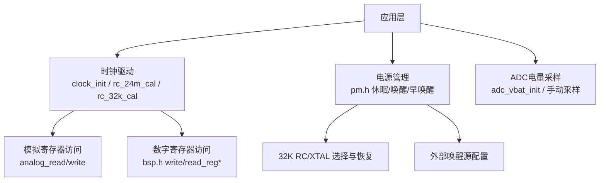
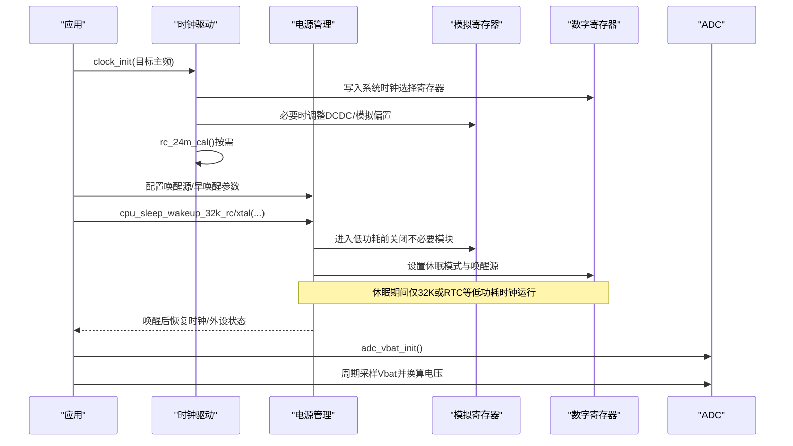
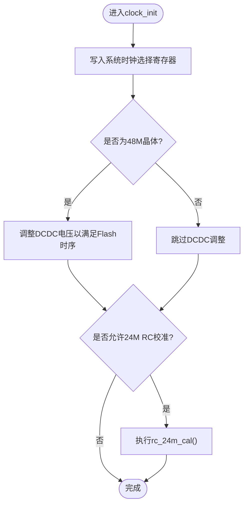
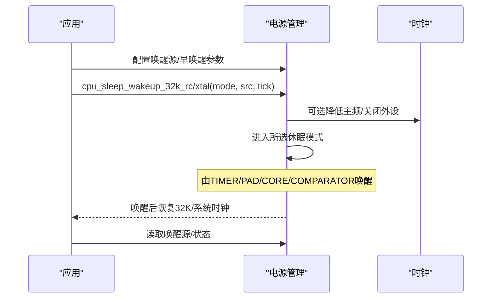
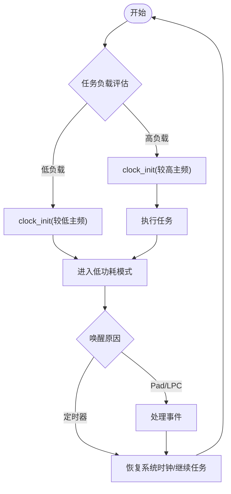
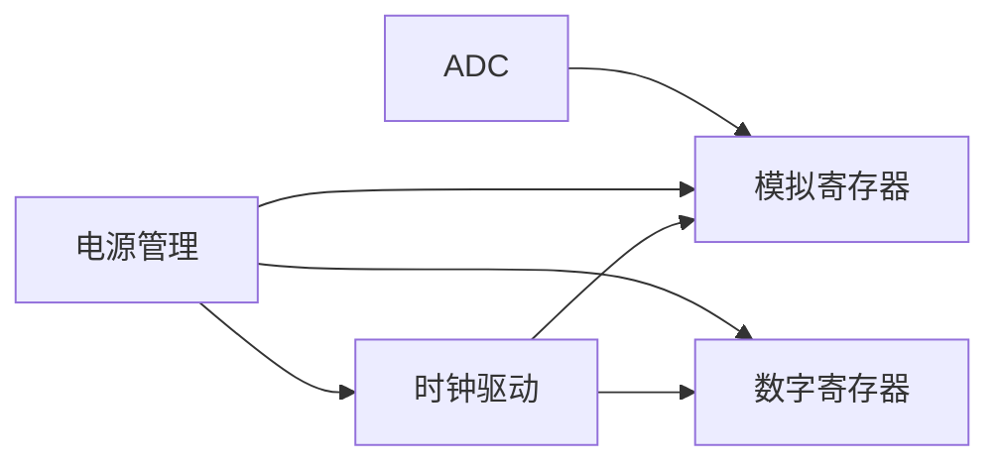

# 时钟与电源管理

<cite>
**本文引用的文件**
- [B85 clock.h](file://tc_ble_single_sdk/drivers/B85/clock.h)
- [B85 clock.c](file://tc_ble_single_sdk/drivers/B85/clock.c)
- [B80 clock.h](file://8373_dongle_for_km/chip/B80/drivers/clock.h)
- [B80 clock.c](file://8373_dongle_for_km/chip/B80/drivers/clock.c)
- [B85 pm.h](file://tc_ble_single_sdk/drivers/B85/lib/include/pm.h)
- [B85 analog.h](file://tc_ble_single_sdk/drivers/B85/analog.h)
- [B80 analog.h](file://8373_dongle_for_km/chip/B80/drivers/analog.h)
- [B85 bsp.h](file://tc_ble_single_sdk/drivers/B85/bsp.h)
- [B80 bsp.h](file://8373_dongle_for_km/chip/B80/drivers/bsp.h)
- [B85 adc.h](file://tc_ble_single_sdk/drivers/B85/adc.h)
- [B85 adc.c](file://tc_ble_single_sdk/drivers/B85/adc.c)
- [B80 adc.c](file://8373_dongle_for_km/chip/B80/drivers/adc.c)
</cite>

## 目录
1. [简介](#简介)
2. [项目结构](#项目结构)
3. [核心组件](#核心组件)
4. [架构总览](#架构总览)
5. [详细组件分析](#详细组件分析)
6. [依赖关系分析](#依赖关系分析)
7. [性能考量](#性能考量)
8. [故障排查指南](#故障排查指南)
9. [结论](#结论)
10. [附录](#附录)

## 简介
本技术文档围绕该SDK中的时钟与电源管理系统，系统阐述：
- 系统时钟树、时钟源选择与频率切换机制
- CPU主频调节、外设时钟门控与低功耗模式管理
- PLL配置、振荡器启动与稳定性检测
- 动态频率调节、睡眠唤醒流程、电量监控
- 功耗分析工具使用建议与节能优化策略
- 不同工作模式的功耗特性与性能权衡

本说明以B85与B80两路驱动实现为依据，给出可操作的工程实践与注意事项。

## 项目结构
与“时钟与电源管理”直接相关的代码主要分布在以下位置：
- B85平台：drivers/B85/clock.*、lib/include/pm.h、analog.h、bsp.h、adc.*
- B80平台：chip/B80/drivers/clock.*、analog.h、bsp.h、adc.c
- 2.4G协议栈中提供PLL相关接口（用于射频侧快速校准与时序优化）

图表来源
- [B85 clock.h:59-168](file://tc_ble_single_sdk/drivers/B85/clock.h#L59-L168)
- [B85 clock.c:50-308](file://tc_ble_single_sdk/drivers/B85/clock.c#L50-L308)
- [B85 pm.h:95-518](file://tc_ble_single_sdk/drivers/B85/lib/include/pm.h#L95-L518)
- [B85 analog.h:29-66](file://tc_ble_single_sdk/drivers/B85/analog.h#L29-L66)
- [B85 bsp.h:95-172](file://tc_ble_single_sdk/drivers/B85/bsp.h#L95-L172)
- [B85 adc.h:1154-1183](file://tc_ble_single_sdk/drivers/B85/adc.h#L1154-L1183)

章节来源
- [B85 clock.h:59-168](file://tc_ble_single_sdk/drivers/B85/clock.h#L59-L168)
- [B80 clock.h:72-220](file://8373_dongle_for_km/chip/B80/drivers/clock.h#L72-L220)
- [B85 pm.h:95-518](file://tc_ble_single_sdk/drivers/B85/lib/include/pm.h#L95-L518)

## 核心组件
- 时钟子系统
  - 系统时钟初始化与切换：clock_init
  - 24M RC校准：rc_24m_cal
  - 32K RC校准：rc_32k_cal
  - 48M RC校准：rc_48m_cal
  - 倍频器校准：doubler_calibration
  - 时钟探测输出：clock_prob（B80）
- 电源管理子系统
  - 休眠/唤醒：cpu_sleep_wakeup_*、pm_long_sleep_wakeup
  - 唤醒源配置：PM_WAKEUP_*
  - 早唤醒时间参数：pm_set_wakeup_time_param
  - 32K晶振稳定等待：pm_wait_xtal_ready
  - 基带/USB/Audio掉电控制：pm_set_suspend_power_cfg
- 模拟/数字寄存器访问
  - analog_read/write（模拟域）
  - read/write_reg*（数字域）
- ADC电量采集
  - adc_vbat_init、adc_sample_and_get_result_manual_mode

章节来源
- [B85 clock.c:50-308](file://tc_ble_single_sdk/drivers/B85/clock.c#L50-L308)
- [B80 clock.c:78-299](file://8373_dongle_for_km/chip/B80/drivers/clock.c#L78-L299)
- [B85 pm.h:95-518](file://tc_ble_single_sdk/drivers/B85/lib/include/pm.h#L95-L518)
- [B85 analog.h:29-66](file://tc_ble_single_sdk/drivers/B85/analog.h#L29-L66)
- [B85 bsp.h:95-172](file://tc_ble_single_sdk/drivers/B85/bsp.h#L95-L172)
- [B85 adc.h:1154-1183](file://tc_ble_single_sdk/drivers/B85/adc.h#L1154-L1183)

## 架构总览
下图展示了从应用到硬件的调用链路与关键模块交互：

图表来源
- [B85 clock.c:50-308](file://tc_ble_single_sdk/drivers/B85/clock.c#L50-L308)
- [B85 pm.h:95-518](file://tc_ble_single_sdk/drivers/B85/lib/include/pm.h#L95-L518)
- [B85 analog.h:29-66](file://tc_ble_single_sdk/drivers/B85/analog.h#L29-L66)
- [B85 bsp.h:95-172](file://tc_ble_single_sdk/drivers/B85/bsp.h#L95-L172)
- [B85 adc.h:1154-1183](file://tc_ble_single_sdk/drivers/B85/adc.h#L1154-L1183)

## 详细组件分析

### 时钟子系统
- 系统时钟源与类型
  - B85支持16/24/32/48MHz晶体及24M RC；B80在枚举中进一步体现OTP/时序位组合以适配不同芯片版本。
  - 通过clock_init写入系统时钟选择寄存器，并记录当前system_clk_type。
- 24M RC校准
  - 上电或深度睡眠唤醒后，若未处于深保唤醒且允许校准，则执行rc_24m_cal，确保RC频率偏差可控，提升后续唤醒与通信稳定性。
  - 可通过clock_init_calib_24m_rc_cfg控制是否自动校准。
- 32K RC校准
  - 对需要高精度定时或温度漂移敏感的场景，周期性校准32K RC；若仅需保证睡眠时长精度，可在上电时校准一次即可。
- 48M RC校准与倍频器校准
  - 48M RC校准采用二分搜索逼近最佳电容值；倍频器校准用于改善占空比与抖动，避免高速时钟异常。
- 时钟探测
  - B80提供clock_prob将内部时钟（如32K、系统时钟、24M RC、PLL等）路由至指定GPIO，便于示波器观测。

图表来源
- [B85 clock.c:50-81](file://tc_ble_single_sdk/drivers/B85/clock.c#L50-L81)
- [B80 clock.c:78-107](file://8373_dongle_for_km/chip/B80/drivers/clock.c#L78-L107)
- [B85 clock.h:80-168](file://tc_ble_single_sdk/drivers/B85/clock.h#L80-L168)
- [B80 clock.h:142-220](file://8373_dongle_for_km/chip/B80/drivers/clock.h#L142-L220)

章节来源
- [B85 clock.c:50-308](file://tc_ble_single_sdk/drivers/B85/clock.c#L50-L308)
- [B80 clock.c:78-299](file://8373_dongle_for_km/chip/B80/drivers/clock.c#L78-L299)
- [B85 clock.h:59-168](file://tc_ble_single_sdk/drivers/B85/clock.h#L59-L168)
- [B80 clock.h:72-220](file://8373_dongle_for_km/chip/B80/drivers/clock.h#L72-L220)

### 电源管理与低功耗模式
- 休眠模式
  - 支持SUSPEND、DEEPSLEEP、DEEPSLEEP_RET_SRAM_*、SHUTDOWN等模式，配合唤醒源（PAD/TIMER/CORE/COMPARATOR）。
  - 进入休眠前可选择关闭基带/USB/Audio供电以降低静态电流。
- 唤醒源与早唤醒
  - 通过PM_WAKEUP_*配置唤醒源；pm_set_wakeup_time_param设置早唤醒延时，优化唤醒路径延迟。
  - 对外部32K晶振，可使用pm_wait_xtal_ready进行稳定性判断，避免因晶振起振慢导致重启。
- 定时器恢复
  - 提供pm_tim_recover_32k_rc/xtal，基于32K tick恢复系统定时器，保证长时间休眠后的时间连续性。
- 长时休眠
  - 当需要超过234秒的休眠时，启用PM_LONG_SLEEP_WAKEUP_EN并使用pm_long_sleep_wakeup。

图表来源
- [B85 pm.h:95-518](file://tc_ble_single_sdk/drivers/B85/lib/include/pm.h#L95-L518)

章节来源
- [B85 pm.h:95-518](file://tc_ble_single_sdk/drivers/B85/lib/include/pm.h#L95-L518)

### 振荡器启动与稳定性检测
- 32K晶振启动
  - 通过clock_32k_init选择32K RC或外部晶振；若使用外部晶振，需先使能相应模拟电源与引脚复用，再等待稳定。
- 稳定性检测
  - pm_wait_xtal_ready通过比较stimer增量与预期值，间接判定晶振已稳定，避免依赖单一标志位导致的误判。
- 24M RC校准
  - 在上电或唤醒后尽快校准，减少温漂影响，提高后续唤醒速度与可靠性。

章节来源
- [B85 clock.c:88-126](file://tc_ble_single_sdk/drivers/B85/clock.c#L88-L126)
- [B80 clock.c:114-152](file://8373_dongle_for_km/chip/B80/drivers/clock.c#L114-L152)
- [B85 pm.h:491-504](file://tc_ble_single_sdk/drivers/B85/lib/include/pm.h#L491-L504)

### 动态频率调节与应用场景
- 动态主频调节
  - 通过clock_init在不同任务阶段切换系统时钟（例如空闲时降频、峰值处理升频），注意DMA收发期间避免切换以免数据丢失。
- 睡眠唤醒
  - 结合定时器唤醒实现周期性任务；Pad唤醒用于按键/事件触发；LPC比较器唤醒用于低电压阈值检测。
- 电量监控
  - 使用adc_vbat_init初始化电池通道，再以adc_sample_and_get_result_manual_mode获取原始值并换算为电压。

图表来源
- [B85 clock.c:50-81](file://tc_ble_single_sdk/drivers/B85/clock.c#L50-L81)
- [B85 pm.h:375-410](file://tc_ble_single_sdk/drivers/B85/lib/include/pm.h#L375-L410)
- [B85 adc.h:1154-1183](file://tc_ble_single_sdk/drivers/B85/adc.h#L1154-L1183)

章节来源
- [B85 clock.c:50-308](file://tc_ble_single_sdk/drivers/B85/clock.c#L50-L308)
- [B85 pm.h:375-518](file://tc_ble_single_sdk/drivers/B85/lib/include/pm.h#L375-L518)
- [B85 adc.c:515-546](file://tc_ble_single_sdk/drivers/B85/adc.c#L515-L546)
- [B80 adc.c:314-342](file://8373_dongle_for_km/chip/B80/drivers/adc.c#L314-L342)

### PLL配置与射频时序优化
- 2.4G协议栈提供TPLL/TPLU相关接口，用于快速RX/TX settle时序优化与HPMC生成，有助于降低射频链路建立时间与功耗。
- 使用时应遵循协议栈提供的初始化与使能顺序，避免与系统时钟切换冲突。

章节来源
- [tl_tpll.h](file://tc_ble_single_sdk/stack/2p4g/tl_tpll/tl_tpll.h)
- [tpll.h](file://tc_ble_single_sdk/stack/2p4g/tpll/tpll.h)

## 依赖关系分析
- 时钟驱动依赖
  - 模拟寄存器访问：analog_read/write
  - 数字寄存器访问：read/write_reg*
  - 电源管理：pm_is_MCU_deepRetentionWakeup、pm_set_wakeup_time_param等
- 电源管理依赖
  - 时钟：32K RC/XTAL选择与稳定等待
  - 模拟/数字寄存器：休眠模式与唤醒源配置
- ADC依赖
  - 模拟寄存器：采样控制与结果读取

图表来源
- [B85 clock.c:50-308](file://tc_ble_single_sdk/drivers/B85/clock.c#L50-L308)
- [B85 pm.h:95-518](file://tc_ble_single_sdk/drivers/B85/lib/include/pm.h#L95-L518)
- [B85 analog.h:29-66](file://tc_ble_single_sdk/drivers/B85/analog.h#L29-L66)
- [B85 bsp.h:95-172](file://tc_ble_single_sdk/drivers/B85/bsp.h#L95-L172)

章节来源
- [B85 clock.c:50-308](file://tc_ble_single_sdk/drivers/B85/clock.c#L50-L308)
- [B85 pm.h:95-518](file://tc_ble_single_sdk/drivers/B85/lib/include/pm.h#L95-L518)
- [B85 analog.h:29-66](file://tc_ble_single_sdk/drivers/B85/analog.h#L29-L66)
- [B85 bsp.h:95-172](file://tc_ble_single_sdk/drivers/B85/bsp.h#L95-L172)

## 性能考量
- 时钟切换时机
  - DMA收发过程中禁止切换系统时钟，避免时钟暂停导致的数据丢失。
- 校准策略
  - 24M RC校准建议在首次上电/唤醒后立即执行，并根据温度变化周期性校准；32K RC可根据需求周期性校准或仅上电校准一次。
- 休眠模式选择
  - SUSPEND适合短时休眠；DEEPSLEEP/RET模式用于更长休眠与更低功耗；SHUTDOWN用于关机态。
- 早唤醒与晶振稳定
  - 合理设置pm_set_wakeup_time_param与pm_wait_xtal_ready，避免过短导致不稳定或过长增加唤醒延迟。
- 动态调频
  - 根据任务负载动态调整主频，平衡性能与功耗；高频段避免频繁切换，低频段确保外设时钟满足最低要求。

[本节为通用指导，不直接分析具体文件]

## 故障排查指南
- 无法进入休眠
  - 检查唤醒源配置是否正确；确认未处于不允许休眠的状态（如DMA进行中）。
  - 若使用外部32K晶振，确认pm_wait_xtal_ready已通过，避免起振失败。
- 唤醒后时钟异常
  - 确认clock_init已正确设置系统时钟；必要时重新执行rc_24m_cal/rc_32k_cal。
- 通信异常
  - 避免在USB包收发期间校准或切换时钟；必要时延后校准。
- 电量读数异常
  - 确保adc_vbat_init已正确配置；两次采样间隔大于2倍采样周期；检查参考电压与分压配置。

章节来源
- [B85 clock.c:50-81](file://tc_ble_single_sdk/drivers/B85/clock.c#L50-L81)
- [B85 pm.h:491-504](file://tc_ble_single_sdk/drivers/B85/lib/include/pm.h#L491-L504)
- [B85 adc.c:515-546](file://tc_ble_single_sdk/drivers/B85/adc.c#L515-L546)
- [B80 adc.c:314-342](file://8373_dongle_for_km/chip/B80/drivers/adc.c#L314-L342)

## 结论
该SDK提供了完善的时钟与电源管理能力，覆盖多平台（B85/B80）的系统时钟初始化、RC校准、休眠唤醒、早唤醒与晶振稳定检测，以及ADC电量采样。通过合理的时钟切换策略、校准周期与休眠模式选择，可实现性能与功耗的最佳平衡。对于射频链路，可借助TPLL/TPLU接口进一步优化时序与功耗。

[本节为总结性内容，不直接分析具体文件]

## 附录
- 常用API速查
  - 时钟：clock_init、rc_24m_cal、rc_32k_cal、rc_48m_cal、doubler_calibration、clock_prob（B80）
  - 电源：cpu_sleep_wakeup_32k_rc/xtal、pm_set_wakeup_time_param、pm_wait_xtal_ready、pm_set_suspend_power_cfg
  - ADC：adc_vbat_init、adc_sample_and_get_result_manual_mode
- 典型流程
  - 上电：clock_init → rc_24m_cal → 配置唤醒源 → 进入任务循环
  - 低功耗：配置唤醒源/早唤醒 → 进入休眠 → 唤醒后恢复时钟/外设 → 继续任务
  - 电量：adc_vbat_init → 周期采样 → 换算电压 → 上报/阈值处理

[本节为补充信息，不直接分析具体文件]