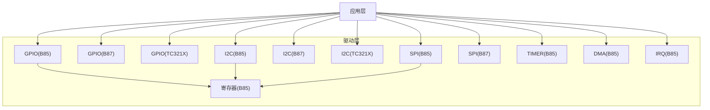
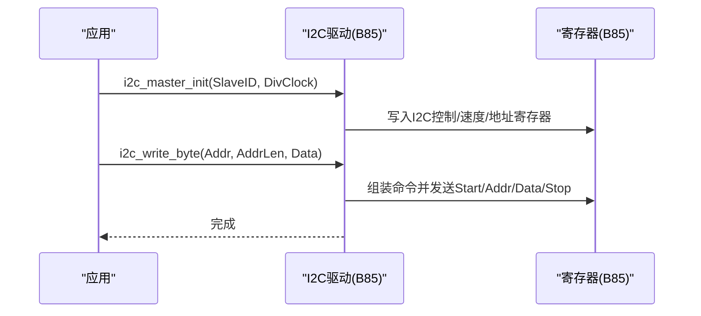
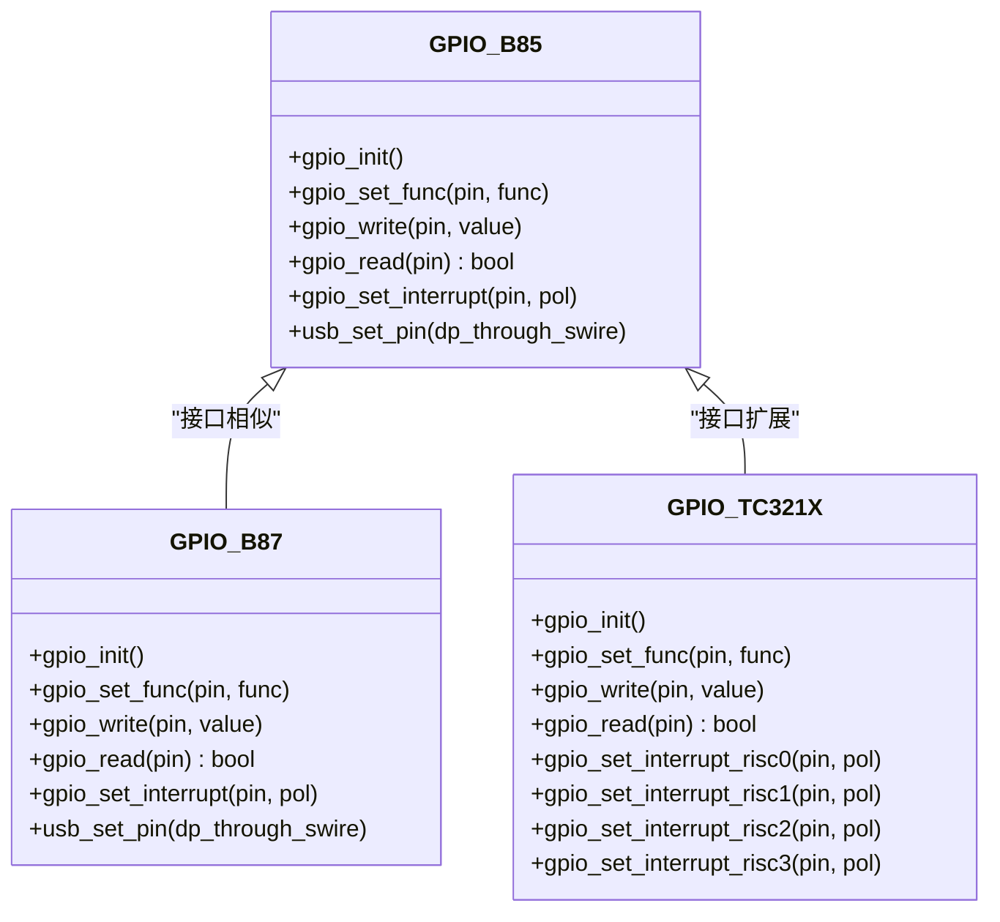
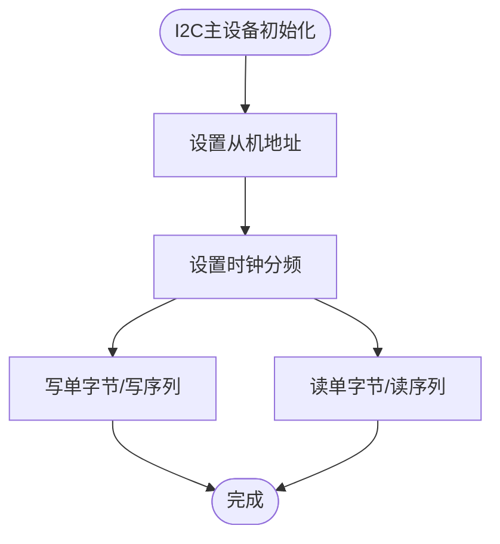
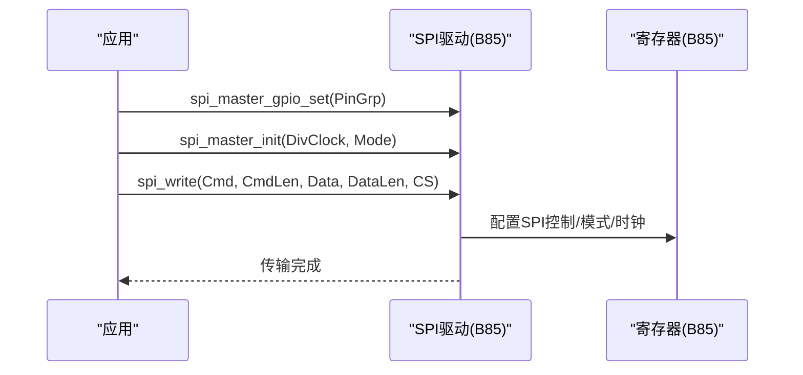
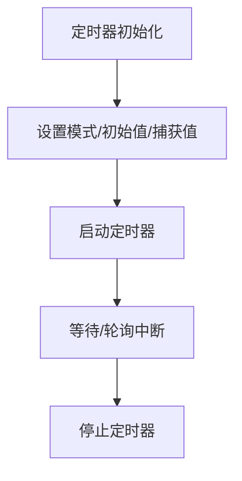
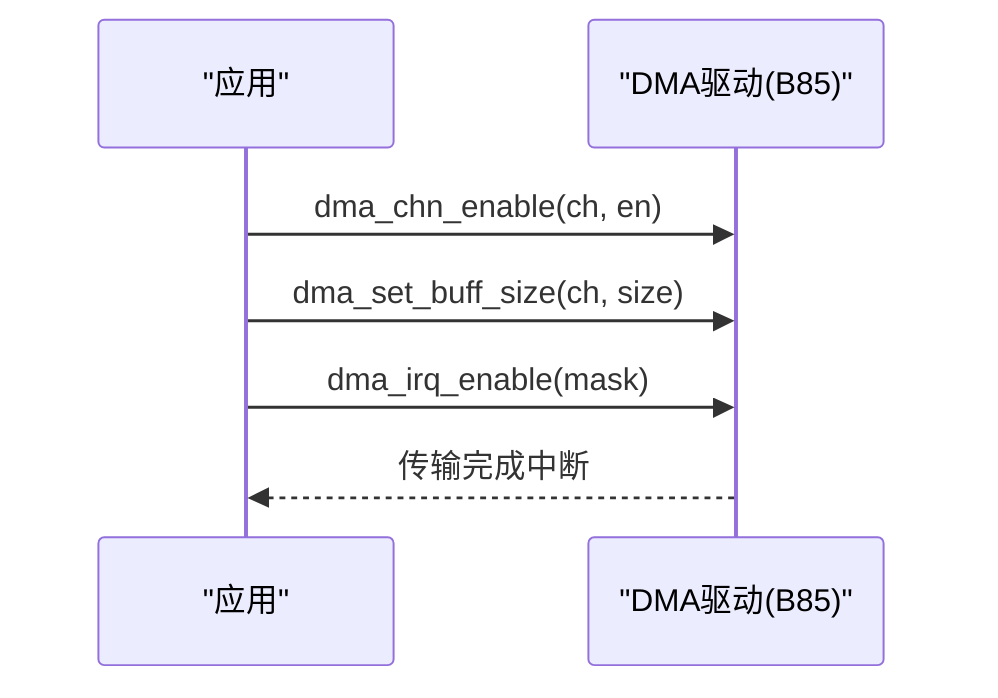
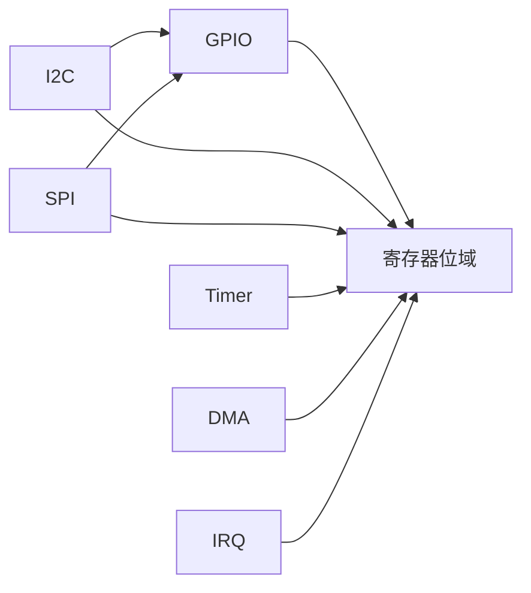

# 硬件抽象层

<cite>
**本文引用的文件**
- [gpio.h (B85)](file://tc_ble_single_sdk/drivers/B85/gpio.h)
- [gpio.h (B87)](file://tc_ble_single_sdk/drivers/B87/gpio.h)
- [gpio.h (TC321X)](file://tc_ble_single_sdk/drivers/TC321X/gpio.h)
- [i2c.h (B85)](file://tc_ble_single_sdk/drivers/B85/i2c.h)
- [i2c.h (B87)](file://tc_ble_single_sdk/drivers/B87/i2c.h)
- [i2c.h (TC321X)](file://tc_ble_single_sdk/drivers/TC321X/i2c.h)
- [spi.h (B85)](file://tc_ble_single_sdk/drivers/B85/spi.h)
- [spi.h (B87)](file://tc_ble_single_sdk/drivers/B87/spi.h)
- [timer.h (B85)](file://tc_ble_single_sdk/drivers/B85/timer.h)
- [dma.h (B85)](file://tc_ble_single_sdk/drivers/B85/dma.h)
- [irq.h (B85)](file://tc_ble_single_sdk/drivers/B85/irq.h)
- [register.h (B85)](file://tc_ble_single_sdk/drivers/B85/register.h)
</cite>

## 目录
1. [简介](#简介)
2. [项目结构](#项目结构)
3. [核心组件](#核心组件)
4. [架构总览](#架构总览)
5. [详细组件分析](#详细组件分析)
6. [依赖关系分析](#依赖关系分析)
7. [性能考虑](#性能考虑)
8. [故障排查指南](#故障排查指南)
9. [结论](#结论)
10. [附录：移植与最佳实践](#附录：移植与最佳实践)

## 简介
本技术文档面向Telink B85、B87、TC321X系列芯片的硬件抽象层（HAL），聚焦GPIO、定时器、I2C、SPI等基础驱动的接口设计与实现原理，覆盖寄存器操作封装、中断处理、DMA传输抽象，以及外设初始化配置标准流程。同时给出不同平台的适配策略、资源分配与冲突解决机制，并提供新平台移植指导与最佳实践。

## 项目结构
该SDK按“通用驱动 + 平台特定实现”组织：
- drivers/B85、drivers/B87、drivers/TC321X：分别提供对应芯片的GPIO/I2C/SPI/TIMER/DMA/IRQ/寄存器定义等底层实现。
- 上层应用通过统一的头文件接口调用，屏蔽平台差异。

图表来源
- [gpio.h (B85):1-561](file://tc_ble_single_sdk/drivers/B85/gpio.h#L1-L561)
- [gpio.h (B87):1-568](file://tc_ble_single_sdk/drivers/B87/gpio.h#L1-L568)
- [gpio.h (TC321X):1-706](file://tc_ble_single_sdk/drivers/TC321X/gpio.h#L1-L706)
- [i2c.h (B85):1-198](file://tc_ble_single_sdk/drivers/B85/i2c.h#L1-L198)
- [i2c.h (B87):1-205](file://tc_ble_single_sdk/drivers/B87/i2c.h#L1-L205)
- [i2c.h (TC321X):1-187](file://tc_ble_single_sdk/drivers/TC321X/i2c.h#L1-L187)
- [spi.h (B85):1-192](file://tc_ble_single_sdk/drivers/B85/spi.h#L1-L192)
- [spi.h (B87):1-208](file://tc_ble_single_sdk/drivers/B87/spi.h#L1-L208)
- [timer.h (B85):1-198](file://tc_ble_single_sdk/drivers/B85/timer.h#L1-L198)
- [dma.h (B85):1-160](file://tc_ble_single_sdk/drivers/B85/dma.h#L1-L160)
- [irq.h (B85):1-168](file://tc_ble_single_sdk/drivers/B85/irq.h#L1-L168)
- [register.h (B85):1-200](file://tc_ble_single_sdk/drivers/B85/register.h#L1-L200)

章节来源
- [gpio.h (B85):1-561](file://tc_ble_single_sdk/drivers/B85/gpio.h#L1-L561)
- [gpio.h (B87):1-568](file://tc_ble_single_sdk/drivers/B87/gpio.h#L1-L568)
- [gpio.h (TC321X):1-706](file://tc_ble_single_sdk/drivers/TC321X/gpio.h#L1-L706)
- [i2c.h (B85):1-198](file://tc_ble_single_sdk/drivers/B85/i2c.h#L1-L198)
- [i2c.h (B87):1-205](file://tc_ble_single_sdk/drivers/B87/i2c.h#L1-L205)
- [i2c.h (TC321X):1-187](file://tc_ble_single_sdk/drivers/TC321X/i2c.h#L1-L187)
- [spi.h (B85):1-192](file://tc_ble_single_sdk/drivers/B85/spi.h#L1-L192)
- [spi.h (B87):1-208](file://tc_ble_single_sdk/drivers/B87/spi.h#L1-L208)
- [timer.h (B85):1-198](file://tc_ble_single_sdk/drivers/B85/timer.h#L1-L198)
- [dma.h (B85):1-160](file://tc_ble_single_sdk/drivers/B85/dma.h#L1-L160)
- [irq.h (B85):1-168](file://tc_ble_single_sdk/drivers/B85/irq.h#L1-L168)
- [register.h (B85):1-200](file://tc_ble_single_sdk/drivers/B85/register.h#L1-L200)

## 核心组件
- GPIO：统一引脚分组、复用功能、输入输出使能、拉强/上拉下拉、中断（RISC0/1/2/3）与USB DP/DM复用。
- I2C：主从模式、DMA与映射缓冲两种从机模式、时钟分频、地址长度兼容、中断状态管理。
- SPI：主从模式、四种工作模式、时钟分频、CS选择、共享模式。
- Timer：系统计时、微秒延时、GPIO触发/宽度模式、中断状态管理。
- DMA：通道使能/禁用、中断使能/清状态、缓冲区大小设置。
- IRQ：全局中断开关、掩码、源读取与清除、RF中断管理。
- 寄存器：I2C/SPI/MSPI/复位/时钟使能等关键寄存器位域定义。

章节来源
- [gpio.h (B85):1-561](file://tc_ble_single_sdk/drivers/B85/gpio.h#L1-L561)
- [gpio.h (B87):1-568](file://tc_ble_single_sdk/drivers/B87/gpio.h#L1-L568)
- [gpio.h (TC321X):1-706](file://tc_ble_single_sdk/drivers/TC321X/gpio.h#L1-L706)
- [i2c.h (B85):1-198](file://tc_ble_single_sdk/drivers/B85/i2c.h#L1-L198)
- [i2c.h (B87):1-205](file://tc_ble_single_sdk/drivers/B87/i2c.h#L1-L205)
- [i2c.h (TC321X):1-187](file://tc_ble_single_sdk/drivers/TC321X/i2c.h#L1-L187)
- [spi.h (B85):1-192](file://tc_ble_single_sdk/drivers/B85/spi.h#L1-L192)
- [spi.h (B87):1-208](file://tc_ble_single_sdk/drivers/B87/spi.h#L1-L208)
- [timer.h (B85):1-198](file://tc_ble_single_sdk/drivers/B85/timer.h#L1-L198)
- [dma.h (B85):1-160](file://tc_ble_single_sdk/drivers/B85/dma.h#L1-L160)
- [irq.h (B85):1-168](file://tc_ble_single_sdk/drivers/B85/irq.h#L1-L168)
- [register.h (B85):1-200](file://tc_ble_single_sdk/drivers/B85/register.h#L1-L200)

## 架构总览
各驱动通过平台特定的头文件暴露统一API，内部直接操作寄存器或调用底层函数。以I2C为例，B85/B87/TC321X均提供相同的初始化、读写与中断管理接口，但引脚枚举和具体实现细节存在差异。

图表来源
- [i2c.h (B85):116-176](file://tc_ble_single_sdk/drivers/B85/i2c.h#L116-L176)
- [register.h (B85):34-88](file://tc_ble_single_sdk/drivers/B85/register.h#L34-L88)

章节来源
- [i2c.h (B85):116-176](file://tc_ble_single_sdk/drivers/B85/i2c.h#L116-L176)
- [register.h (B85):34-88](file://tc_ble_single_sdk/drivers/B85/register.h#L34-L88)

## 详细组件分析

### GPIO子系统
- 引脚分组与复用：B85/B87支持A~E组，TC321X新增F组；复用功能包含UART、I2C、SPI、I2S、PWM、ADC、USB等。
- 输入输出：提供输出/输入使能、电平读写、缓存读取、批量读取。
- 中断：B85/B87支持GPIO/RISC0/RISC1；TC321X扩展至RISC0~RISC3，且提供更细粒度的触发类型与电平控制。
- USB复用：PA5/PA6可复用为USB DM/DP，并提供上拉与dp_through_swire控制。

图表来源
- [gpio.h (B85):39-125](file://tc_ble_single_sdk/drivers/B85/gpio.h#L39-L125)
- [gpio.h (B87):43-134](file://tc_ble_single_sdk/drivers/B87/gpio.h#L43-L134)
- [gpio.h (TC321X):39-145](file://tc_ble_single_sdk/drivers/TC321X/gpio.h#L39-L145)

章节来源
- [gpio.h (B85):39-125](file://tc_ble_single_sdk/drivers/B85/gpio.h#L39-L125)
- [gpio.h (B87):43-134](file://tc_ble_single_sdk/drivers/B87/gpio.h#L43-L134)
- [gpio.h (TC321X):39-145](file://tc_ble_single_sdk/drivers/TC321X/gpio.h#L39-L145)

### I2C子系统
- 主从模式：主设备通过SlaveID与DivClock初始化；从设备支持DMA与Mapping两种模式。
- 数据访问：单字节/多字节读写，支持1/2/3字节地址长度。
- 中断：从机中断状态查询与清除。
- 引脚：B85使用组枚举；B87/TC321X细化到SDA/SCL独立引脚枚举，便于灵活组合。

图表来源
- [i2c.h (B85):116-176](file://tc_ble_single_sdk/drivers/B85/i2c.h#L116-L176)
- [i2c.h (B87):120-182](file://tc_ble_single_sdk/drivers/B87/i2c.h#L120-L182)
- [i2c.h (TC321X):104-166](file://tc_ble_single_sdk/drivers/TC321X/i2c.h#L104-L166)

章节来源
- [i2c.h (B85):116-176](file://tc_ble_single_sdk/drivers/B85/i2c.h#L116-L176)
- [i2c.h (B87):120-182](file://tc_ble_single_sdk/drivers/B87/i2c.h#L120-L182)
- [i2c.h (TC321X):104-166](file://tc_ble_single_sdk/drivers/TC321X/i2c.h#L104-L166)

### SPI子系统
- 主从模式：提供主/从GPIO配置、时钟与工作模式设置、CS选择。
- 工作模式：支持MODE0/1/2/3，CPOL/CPHA由寄存器控制。
- 共享模式：支持与其他模块共享总线。

图表来源
- [spi.h (B85):97-181](file://tc_ble_single_sdk/drivers/B85/spi.h#L97-L181)
- [spi.h (B87):112-197](file://tc_ble_single_sdk/drivers/B87/spi.h#L112-L197)
- [register.h (B85):94-116](file://tc_ble_single_sdk/drivers/B85/register.h#L94-L116)

章节来源
- [spi.h (B85):97-181](file://tc_ble_single_sdk/drivers/B85/spi.h#L97-L181)
- [spi.h (B87):112-197](file://tc_ble_single_sdk/drivers/B87/spi.h#L112-L197)
- [register.h (B85):94-116](file://tc_ble_single_sdk/drivers/B85/register.h#L94-L116)

### 定时器子系统
- 系统计时：提供微秒级延时与时间戳读取。
- 模式：系统时钟、GPIO触发、GPIO宽度、Tick模式。
- 中断：定时器中断状态获取与清除。

图表来源
- [timer.h (B85):34-198](file://tc_ble_single_sdk/drivers/B85/timer.h#L34-L198)

章节来源
- [timer.h (B85):34-198](file://tc_ble_single_sdk/drivers/B85/timer.h#L34-L198)

### DMA子系统
- 通道：UART RX/TX、RF RX/TX、AES编解码、PWM等。
- 控制：通道使能/禁用、中断使能/清状态、缓冲区大小设置。
- 用途：配合I2C/SPI/RF等外设进行高效数据传输。

图表来源
- [dma.h (B85):66-157](file://tc_ble_single_sdk/drivers/B85/dma.h#L66-L157)

章节来源
- [dma.h (B85):66-157](file://tc_ble_single_sdk/drivers/B85/dma.h#L66-L157)

### 中断子系统
- 全局中断：启用/禁用/恢复。
- 掩码：按源启用/禁用、读取当前掩码。
- 源：读取中断源、清除指定源、清空所有源。
- RF中断：单独掩码与状态管理。

章节来源
- [irq.h (B85):33-166](file://tc_ble_single_sdk/drivers/B85/irq.h#L33-L166)

## 依赖关系分析
- GPIO依赖寄存器定义与模拟寄存器（analog）用于USB上拉等。
- I2C/SPI依赖GPIO复用与寄存器位域。
- Timer依赖系统时钟与寄存器。
- DMA依赖复位与时钟使能寄存器。
- 各驱动通过register.h中的位域宏进行安全位操作。

图表来源
- [register.h (B85):139-200](file://tc_ble_single_sdk/drivers/B85/register.h#L139-L200)
- [gpio.h (B85):26-30](file://tc_ble_single_sdk/drivers/B85/gpio.h#L26-L30)
- [i2c.h (B85):26-29](file://tc_ble_single_sdk/drivers/B85/i2c.h#L26-L29)
- [spi.h (B85):28-30](file://tc_ble_single_sdk/drivers/B85/spi.h#L28-L30)
- [timer.h (B85):26-29](file://tc_ble_single_sdk/drivers/B85/timer.h#L26-L29)
- [dma.h (B85):27-27](file://tc_ble_single_sdk/drivers/B85/dma.h#L27-L27)
- [irq.h (B85):26-26](file://tc_ble_single_sdk/drivers/B85/irq.h#L26-L26)

章节来源
- [register.h (B85):139-200](file://tc_ble_single_sdk/drivers/B85/register.h#L139-L200)
- [gpio.h (B85):26-30](file://tc_ble_single_sdk/drivers/B85/gpio.h#L26-L30)
- [i2c.h (B85):26-29](file://tc_ble_single_sdk/drivers/B85/i2c.h#L26-L29)
- [spi.h (B85):28-30](file://tc_ble_single_sdk/drivers/B85/spi.h#L28-L30)
- [timer.h (B85):26-29](file://tc_ble_single_sdk/drivers/B85/timer.h#L26-L29)
- [dma.h (B85):27-27](file://tc_ble_single_sdk/drivers/B85/dma.h#L27-L27)
- [irq.h (B85):26-26](file://tc_ble_single_sdk/drivers/B85/irq.h#L26-L26)

## 性能考虑
- I2C/SPI：合理选择时钟分频与工作模式，避免总线拥塞；大数据量优先使用DMA。
- GPIO：批量读取使用gpio_read_all减少多次寄存器访问；中断优先级与去抖需结合应用需求。
- Timer：使用clock_time_exceed进行非阻塞超时判断，避免忙等。
- DMA：根据外设特性设置合适的缓冲区大小，注意对齐与边界条件。

[本节为通用性能建议，不直接分析具体文件]

## 故障排查指南
- I2C无响应：检查reset_i2c_module是否执行、时钟分频是否合理、地址与长度是否正确。
- SPI通信异常：确认SPI_MODE与CPOL/CPHA匹配、CS引脚正确、共享模式未冲突。
- GPIO中断误触发：确保在设置极性后清除中断源再使能中断，避免边沿抖动导致重复中断。
- DMA未完成：检查通道使能与中断使能、缓冲区大小设置、是否被其他模块抢占。
- 定时器中断不清：使用timer_clear_interrupt_status及时清除状态位。

章节来源
- [i2c.h (B85):183-196](file://tc_ble_single_sdk/drivers/B85/i2c.h#L183-L196)
- [spi.h (B85):74-78](file://tc_ble_single_sdk/drivers/B85/spi.h#L74-L78)
- [gpio.h (B85):391-406](file://tc_ble_single_sdk/drivers/B85/gpio.h#L391-L406)
- [dma.h (B85):114-147](file://tc_ble_single_sdk/drivers/B85/dma.h#L114-L147)
- [timer.h (B85):182-195](file://tc_ble_single_sdk/drivers/B85/timer.h#L182-L195)

## 结论
本HAL通过统一的接口屏蔽了B85/B87/TC321X的平台差异，提供了GPIO、I2C、SPI、Timer、DMA、IRQ等基础外设的完整抽象。开发者可按需选择平台驱动，遵循初始化顺序与中断/DMA最佳实践，快速构建稳定可靠的嵌入式应用。

[本节为总结性内容，不直接分析具体文件]

## 附录：移植与最佳实践

### 平台适配策略与差异
- GPIO引脚与复用：
  - B85/B87：A~E组，USB复用PA5/PA6。
  - TC321X：新增F组，扩展RISC中断至RISC3，提供更细粒度触发控制。
- I2C引脚：
  - B85：组枚举；B87/TC321X：SDA/SCL独立枚举，便于灵活组合。
- SPI引脚：
  - B85：组枚举；B87：细化到SCLK/CS/SDO/SDI枚举。
- 中断模型：
  - B85/B87：GPIO/RISC0/RISC1；TC321X：RISC0~RISC3，新增电平/边沿触发类型。

章节来源
- [gpio.h (B85):39-125](file://tc_ble_single_sdk/drivers/B85/gpio.h#L39-L125)
- [gpio.h (B87):43-134](file://tc_ble_single_sdk/drivers/B87/gpio.h#L43-L134)
- [gpio.h (TC321X):39-145](file://tc_ble_single_sdk/drivers/TC321X/gpio.h#L39-L145)
- [i2c.h (B85):36-41](file://tc_ble_single_sdk/drivers/B85/i2c.h#L36-L41)
- [i2c.h (B87):36-48](file://tc_ble_single_sdk/drivers/B87/i2c.h#L36-L48)
- [i2c.h (TC321X):104-104](file://tc_ble_single_sdk/drivers/TC321X/i2c.h#L104-L104)
- [spi.h (B85):38-41](file://tc_ble_single_sdk/drivers/B85/spi.h#L38-L41)
- [spi.h (B87):38-56](file://tc_ble_single_sdk/drivers/B87/spi.h#L38-L56)

### 外设初始化与配置标准流程
- GPIO：
  1) gpio_init(anaRes_init_en)
  2) gpio_set_func(pin, func)
  3) gpio_set_output_en/gpio_set_input_en
  4) 可选：gpio_setup_up_down_resistor、gpio_set_data_strength
  5) 可选：gpio_set_interrupt/pol、gpio_en_interrupt
- I2C：
  1) reset_i2c_module
  2) i2c_gpio_set（平台相关）
  3) i2c_master_init或i2c_slave_init
  4) i2c_write_byte/read_byte或系列读写
  5) 从机模式下配置映射缓冲或DMA
- SPI：
  1) reset_spi_module
  2) spi_master_gpio_set或spi_slave_gpio_set
  3) spi_master_init或spi_slave_init
  4) spi_write/spi_read
- Timer：
  1) timerX_gpio_init（如使用GPIO触发/宽度模式）
  2) timerX_set_mode(mode, init_tick, cap_tick)
  3) timer_start/timer_stop
  4) 轮询或中断处理中断状态
- DMA：
  1) dma_reset
  2) dma_chn_enable/channal选择
  3) dma_set_buff_size
  4) dma_irq_enable
  5) 在中断中dma_chn_irq_status_clr

章节来源
- [gpio.h (B85):173-406](file://tc_ble_single_sdk/drivers/B85/gpio.h#L173-L406)
- [i2c.h (B85):82-176](file://tc_ble_single_sdk/drivers/B85/i2c.h#L82-L176)
- [spi.h (B85):74-181](file://tc_ble_single_sdk/drivers/B85/spi.h#L74-L181)
- [timer.h (B85):113-175](file://tc_ble_single_sdk/drivers/B85/timer.h#L113-L175)
- [dma.h (B85):66-157](file://tc_ble_single_sdk/drivers/B85/dma.h#L66-L157)

### 硬件资源分配管理与冲突解决
- 引脚复用冲突：同一引脚不可同时作为GPIO与外设功能；切换前需关闭GPIO功能并按序配置复用。
- I2C/SPI共享：必要时启用共享模式，避免多主机竞争。
- 中断优先级：合理设置GPIO中断目标（RISC0/1/2/3），避免高负载任务阻塞关键路径。
- DMA与CPU：大数据传输优先使用DMA，释放CPU资源；注意缓冲区对齐与溢出保护。
- 电源与低功耗：闲置GPIO设为高阻态或配置上/下拉，降低漏电流；USB模块按需供电。

章节来源
- [gpio.h (B85):191-204](file://tc_ble_single_sdk/drivers/B85/gpio.h#L191-L204)
- [spi.h (B85):183-188](file://tc_ble_single_sdk/drivers/B85/spi.h#L183-L188)
- [gpio.h (TC321X):31-38](file://tc_ble_single_sdk/drivers/TC321X/gpio.h#L31-L38)

### 新平台移植指导与最佳实践
- 步骤：
  1) 定义平台GPIO引脚分组与复用枚举，保持与现有接口一致。
  2) 实现I2C/SPI/TIMER/DMA/IRQ的寄存器映射与位域宏。
  3) 提供与B85一致的API入口，内部根据平台编译选项分支实现。
  4) 验证引脚复用顺序、中断清理、DMA缓冲大小与对齐。
  5) 编写最小化示例（LED闪烁、I2C读传感器、SPI读Flash、定时器中断）。
- 最佳实践：
  - 使用static inline优化热点路径（如gpio_write/gpio_read）。
  - 严格遵循“先关GPIO功能→配置复用→开启外设”的顺序。
  - 中断服务程序中尽快清除状态位，避免丢失事件。
  - 对易错点添加注释与静态断言（如地址长度、缓冲区边界）。

[本节为通用移植指导，不直接分析具体文件]