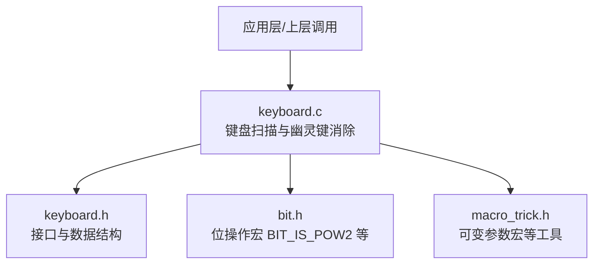
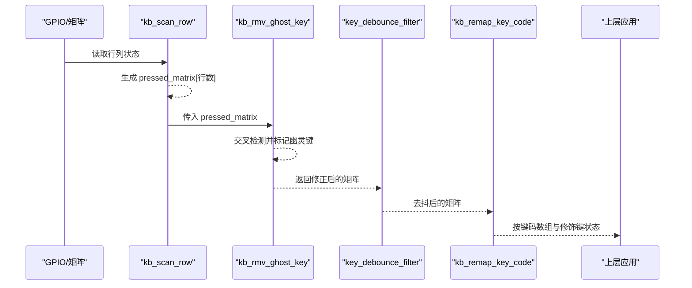
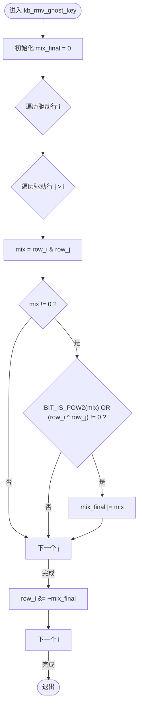
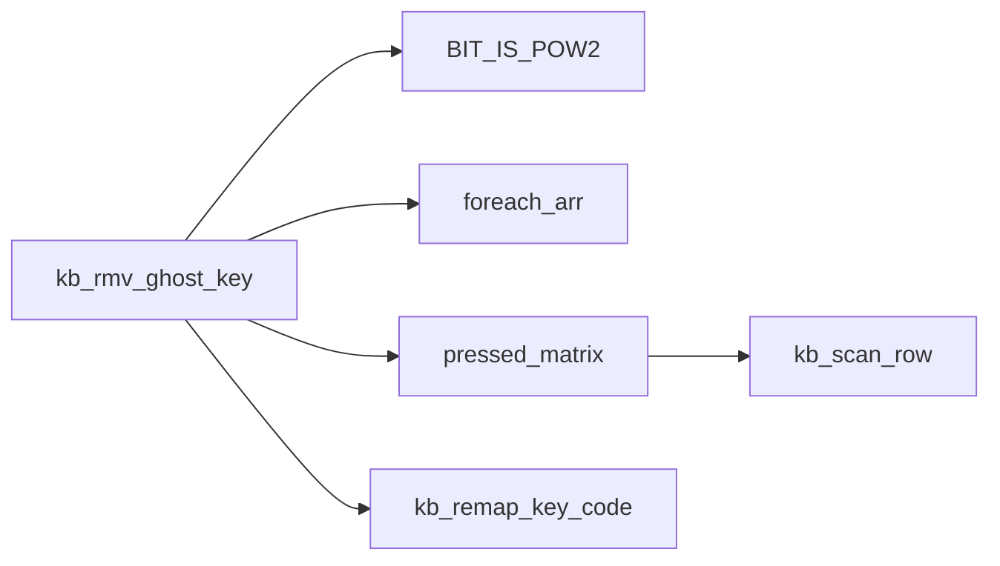

# 幽灵键消除

<cite>
**本文引用的文件**
- [keyboard.c](file://tc_ble_single_sdk/application/keyboard/keyboard.c)
- [keyboard.h](file://tc_ble_single_sdk/application/keyboard/keyboard.h)
- [bit.h](file://tc_ble_single_sdk/common/bit.h)
- [macro_trick.h](file://tc_ble_single_sdk/common/macro_trick.h)
</cite>

## 目录
1. [简介](#简介)
2. [项目结构](#项目结构)
3. [核心组件](#核心组件)
4. [架构总览](#架构总览)
5. [详细组件分析](#详细组件分析)
6. [依赖关系分析](#依赖关系分析)
7. [性能考量](#性能考量)
8. [故障排查指南](#故障排查指南)
9. [结论](#结论)
10. [附录](#附录)

## 简介
本技术文档聚焦于键盘矩阵扫描中的“幽灵键”（Ghost Key）消除算法，围绕 kb_rmv_ghost_key 函数的实现进行深入解析。内容涵盖：
- 矩阵交叉检测与幽灵键识别逻辑
- 混合位运算的使用方式
- 三键/四键同时按下时的处理策略
- 适用场景与局限性
- 不同键盘布局下的配置与优化方法
- 算法性能分析与内存使用优化策略

该功能在 Telink SDK 的键盘驱动中提供可选开关，便于在不同硬件布局与产品需求间灵活启用或关闭。

## 项目结构
与本主题直接相关的代码位于 tc_ble_single_sdk/application/keyboard 目录下，核心实现集中在 keyboard.c 与 keyboard.h；位操作宏定义位于 common/bit.h；通用宏工具位于 common/macro_trick.h。

图表来源
- [keyboard.c:202-218](file://tc_ble_single_sdk/application/keyboard/keyboard.c#L202-L218)
- [keyboard.h:28-61](file://tc_ble_single_sdk/application/keyboard/keyboard.h#L28-L61)
- [bit.h:84-86](file://tc_ble_single_sdk/common/bit.h#L84-L86)
- [macro_trick.h:26-42](file://tc_ble_single_sdk/common/macro_trick.h#L26-L42)

章节来源
- [keyboard.c:1-498](file://tc_ble_single_sdk/application/keyboard/keyboard.c#L1-L498)
- [keyboard.h:1-113](file://tc_ble_single_sdk/application/keyboard/keyboard.h#L1-L113)

## 核心组件
- 键盘扫描与去抖：kb_scan_row、key_debounce_filter
- 幽灵键消除：kb_rmv_ghost_key
- 按键映射与上报：kb_remap_key_code、kb_data_t
- 配置开关：KB_RM_GHOST_KEY_EN、KB_LINE_HIGH_VALID、KB_HAS_FN_KEY 等

其中，kb_rmv_ghost_key 是幽灵键消除的核心函数，负责在矩阵扫描后对多行/多列的按下去重，避免由于矩阵拓扑导致的误报键。

章节来源
- [keyboard.c:202-218](file://tc_ble_single_sdk/application/keyboard/keyboard.c#L202-L218)
- [keyboard.c:224-262](file://tc_ble_single_sdk/application/keyboard/keyboard.c#L224-L262)
- [keyboard.c:268-310](file://tc_ble_single_sdk/application/keyboard/keyboard.c#L268-L310)
- [keyboard.h:28-61](file://tc_ble_single_sdk/application/keyboard/keyboard.h#L28-L61)

## 架构总览
下图展示了从底层扫描到幽灵键消除再到按键映射上报的整体流程。

图表来源
- [keyboard.c:313-358](file://tc_ble_single_sdk/application/keyboard/keyboard.c#L313-L358)
- [keyboard.c:202-218](file://tc_ble_single_sdk/application/keyboard/keyboard.c#L202-L218)
- [keyboard.c:224-262](file://tc_ble_single_sdk/application/keyboard/keyboard.c#L224-L262)
- [keyboard.c:299-310](file://tc_ble_single_sdk/application/keyboard/keyboard.c#L299-L310)

## 详细组件分析

### kb_rmv_ghost_key 实现原理
该函数接收一个二维矩阵指针 pressed_matrix，每行对应一个驱动引脚（drive_pins），每个位代表一个扫描引脚（scan_pins）是否被按下。其目标是检测并移除幽灵键。

核心步骤：
- 双重循环遍历所有驱动引脚对 (i, j)，计算两行的交集 mix = pressed_matrix[i] & pressed_matrix[j]
- 若 mix 非零且满足以下条件之一，则判定为幽灵键区域：
  - mix 不是2的幂（即包含两个及以上位），表示同一列在多行同时被检测到
  - 或者 i 与 j 两行的按位异或结果非零，表示存在不对称的交叉
- 将识别出的幽灵键位累积到 mix_final，并在外层循环结束时统一从各行的矩阵中清除

图表来源
- [keyboard.c:202-218](file://tc_ble_single_sdk/application/keyboard/keyboard.c#L202-L218)
- [bit.h:84-86](file://tc_ble_single_sdk/common/bit.h#L84-L86)

章节来源
- [keyboard.c:202-218](file://tc_ble_single_sdk/application/keyboard/keyboard.c#L202-L218)
- [bit.h:84-86](file://tc_ble_single_sdk/common/bit.h#L84-L86)

### 矩阵交叉检测与幽灵键识别逻辑
- 交叉检测：通过按位与运算得到两行之间的公共列位，若某列在多行同时被检测到，说明可能存在幽灵键路径
- 幽灵键识别条件：
  - 当 mix 包含多个位时（非2的幂），表明至少有两个键在同一列被同时检测到，属于典型幽灵键特征
  - 当 mix 仅含一位但两行不完全相同（异或非零），说明存在不对称交叉，也可能产生幽灵键
- 去重策略：将所有识别到的幽灵键位汇总到 mix_final，再一次性从各行矩阵中清除，避免中间修改影响后续判断

章节来源
- [keyboard.c:202-218](file://tc_ble_single_sdk/application/keyboard/keyboard.c#L202-L218)

### 混合位运算的使用
- 按位与（&）：用于求两行之间的公共列位，定位可能的幽灵键位置
- 按位或（|）：用于累积所有识别到的幽灵键位
- 按位异或（^）：用于检测两行是否完全一致，辅助判断是否存在不对称交叉
- 2的幂检测（BIT_IS_POW2）：快速判断 mix 是否只包含单个位，从而区分单键与多键同时按下的情况

章节来源
- [keyboard.c:202-218](file://tc_ble_single_sdk/application/keyboard/keyboard.c#L202-L218)
- [bit.h:84-86](file://tc_ble_single_sdk/common/bit.h#L84-L86)

### 三键/四键同时按下的检测
- 三键同时按下：通常表现为某列在三行同时被检测到，mix 会包含多个位，触发 !BIT_IS_POW2(mix) 条件
- 四键同时按下：同理，mix 包含多个位，会被识别为幽灵键区域
- 算法优势：不依赖固定数量键的判断，而是基于位集合的多位特性进行通用检测，适用于任意数量的键同时按下

章节来源
- [keyboard.c:202-218](file://tc_ble_single_sdk/application/keyboard/keyboard.c#L202-L218)

### 适用场景与局限性
- 适用场景：
  - 标准矩阵键盘布局，行列交叉可能产生幽灵键
  - 需要支持多键同时按下的场景（如多媒体键、组合键）
  - 资源受限的嵌入式环境，希望以低开销实现幽灵键消除
- 局限性：
  - 对于某些特殊布局（如斜排键、非矩形矩阵），可能需要额外规则或禁用该功能
  - 如果真实按键恰好形成幽灵键拓扑，可能被误删
  - 无法处理动态布局变化或热插拔导致的拓扑变化

章节来源
- [keyboard.c:202-218](file://tc_ble_single_sdk/application/keyboard/keyboard.c#L202-L218)

### 不同键盘布局的配置与优化
- 启用/禁用：通过 KB_RM_GHOST_KEY_EN 控制是否启用幽灵键消除
- 有效电平：KB_LINE_HIGH_VALID 决定扫描线的有效电平，需与硬件设计匹配
- FN 键处理：KB_HAS_FN_KEY 与 VK_FN 的特殊处理可避免 FN 键引发的幽灵键问题
- 重复键与长按：结合 KB_REPEAT_KEY_ENABLE 与 LONG_PRESS_KEY_POWER_OPTIMIZE 优化长时间按键体验
- 建议：
  - 对于紧凑布局（如笔记本键盘），建议启用幽灵键消除
  - 对于扩展键盘或带数字小键盘的布局，可根据实际测试决定是否启用
  - 针对特定布局，可通过调整扫描顺序或驱动时序减少幽灵键概率

章节来源
- [keyboard.c:68-78](file://tc_ble_single_sdk/application/keyboard/keyboard.c#L68-L78)
- [keyboard.c:313-358](file://tc_ble_single_sdk/application/keyboard/keyboard.c#L313-L358)
- [keyboard.c:413-418](file://tc_ble_single_sdk/application/keyboard/keyboard.c#L413-L418)

## 依赖关系分析
kb_rmv_ghost_key 依赖以下组件：
- 位操作宏：BIT_IS_POW2 用于高效判断是否为2的幂
- 循环宏：foreach_arr 用于遍历驱动引脚数组
- 键盘数据结构：pressed_matrix 由 kb_scan_row 生成，kb_data_t 用于最终按键上报

图表来源
- [keyboard.c:202-218](file://tc_ble_single_sdk/application/keyboard/keyboard.c#L202-L218)
- [keyboard.c:313-358](file://tc_ble_single_sdk/application/keyboard/keyboard.c#L313-L358)
- [bit.h:84-86](file://tc_ble_single_sdk/common/bit.h#L84-L86)
- [macro_trick.h:26-42](file://tc_ble_single_sdk/common/macro_trick.h#L26-L42)

章节来源
- [keyboard.c:202-218](file://tc_ble_single_sdk/application/keyboard/keyboard.c#L202-L218)
- [bit.h:84-86](file://tc_ble_single_sdk/common/bit.h#L84-L86)
- [macro_trick.h:26-42](file://tc_ble_single_sdk/common/macro_trick.h#L26-L42)

## 性能考量
- 时间复杂度：O(N^2)，N 为驱动引脚数量。对于常见键盘（如 8x16），N=8，计算量很小
- 空间复杂度：O(1)，仅使用少量局部变量（mix_final、mix）
- 位运算优化：使用按位与、或、异或和 2 的幂检测，避免分支预测失败和复杂计算
- 内存访问：对 pressed_matrix 的读写次数有限，且采用一次性清除策略减少多次写操作
- 建议：
  - 对于更大规模的矩阵（如 N>16），可考虑分块处理或并行化
  - 在高频扫描场景中，可将幽灵键消除与去抖合并以减少函数调用开销

章节来源
- [keyboard.c:202-218](file://tc_ble_single_sdk/application/keyboard/keyboard.c#L202-L218)
- [keyboard.c:224-262](file://tc_ble_single_sdk/application/keyboard/keyboard.c#L224-L262)

## 故障排查指南
- 现象：按键误报或漏报
  - 检查 KB_LINE_HIGH_VALID 是否与硬件设计一致
  - 确认 KB_RM_GHOST_KEY_EN 是否启用，必要时关闭以验证是否为幽灵键消除导致
- 现象：FN 键异常
  - 检查 KB_HAS_FN_KEY 与 VK_FN 的处理逻辑，确保不会误删 FN 键
- 现象：多键同时按下失效
  - 验证 mix 的计算与 BIT_IS_POW2 的判断是否符合预期
  - 检查 pressed_matrix 的生成是否正确，避免扫描时序问题
- 调试建议：
  - 打印 pressed_matrix 的原始值与处理后值，对比差异
  - 逐步缩小 N 的范围，定位具体哪一行或哪一列引发问题

章节来源
- [keyboard.c:202-218](file://tc_ble_single_sdk/application/keyboard/keyboard.c#L202-L218)
- [keyboard.c:313-358](file://tc_ble_single_sdk/application/keyboard/keyboard.c#L313-L358)

## 结论
kb_rmv_ghost_key 通过高效的位运算与矩阵交叉检测，实现了通用的幽灵键消除功能。其设计简洁、性能优异，适用于大多数矩阵键盘布局。在实际应用中，应根据具体布局与需求合理配置相关宏定义，并结合去抖与按键映射逻辑，确保稳定可靠的按键体验。

## 附录
- 关键宏定义参考：
  - BIT_IS_POW2：判断是否为2的幂
  - foreach_arr：遍历数组的便捷宏
  - KB_RM_GHOST_KEY_EN：幽灵键消除开关
  - KB_LINE_HIGH_VALID：扫描线有效电平
- 数据结构参考：
  - kb_data_t：按键事件数据结构，包含按键码与修饰键状态

章节来源
- [bit.h:84-86](file://tc_ble_single_sdk/common/bit.h#L84-L86)
- [macro_trick.h:26-42](file://tc_ble_single_sdk/common/macro_trick.h#L26-L42)
- [keyboard.h:28-61](file://tc_ble_single_sdk/application/keyboard/keyboard.h#L28-L61)